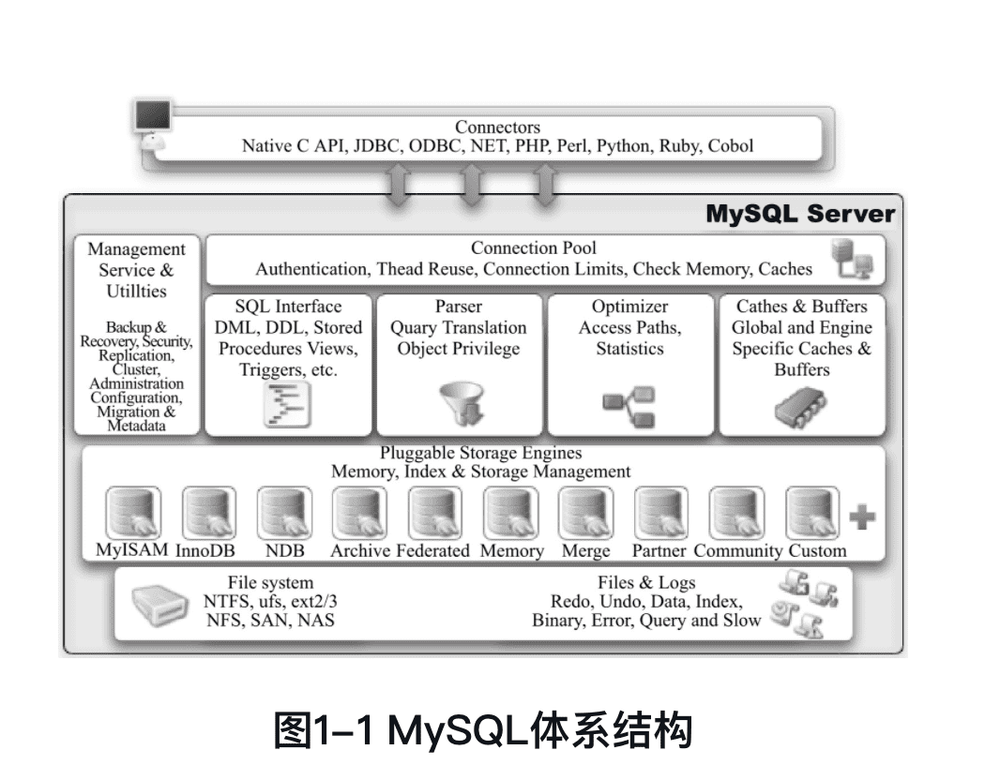
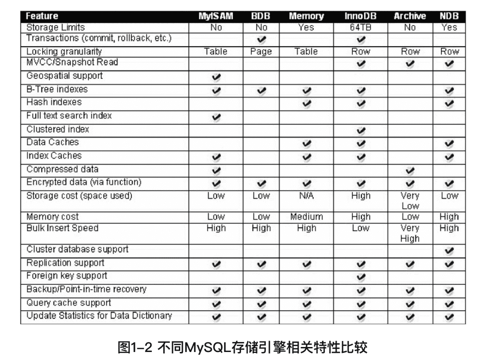
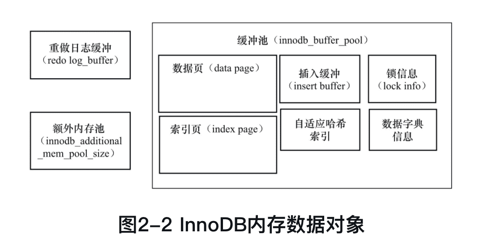

《MySQL技术内幕：InnoDB存储引擎（第2版）》笔记
------------

🏷️微信读书

## 前言

MySQL数据库独有的**插件式存储引擎架构**使其和其他任何数据库都不同。

InnoDB存储引擎的存在使得MySQL跃入了企业级数据库领域。

无论计算机技术发展的速度变得多快，数据库的使用变得多么简单，任何时候**Why都比What重要**。只有真正理解了内部实现原理、体系结构，才能更好地去使用。这正是人类正确思考问题的原则。

## 1 MySQL体系结构和存储引擎

### 1.1 定义数据库和实例

**数据库**（database）：物理操作系统文件或其他形式文件类型的集合。MySQL数据库中，数据库文件可以是frm、MYD、MYI、ibd结尾的文件，或者是NDB引擎的内存中文件。

**实例**（instance）：MySQL数据库由**后台线程以及一个共享内存区组成**。共享内存可以被运行的后台线程所共享。

MySQL被设计为一个单进程多线程架构的数据库。

观察mysql启动或进程情况：

```shell
$ ps -ef | grep mysqld
   74 86573     1   0 三02下午 ??        21:58.54 /usr/local/mysql/bin/mysqld --user=_mysql --basedir=/usr/local/mysql --datadir=/usr/local/mysql/data --plugin-dir=/usr/local/mysql/lib/plugin --log-error=/usr/local/mysql/data/mysqld.local.err --pid-file=/usr/local/mysql/data/mysqld.local.pid --keyring-file-data=/usr/local/mysql/keyring/keyring --early-plugin-load=keyring_file=keyring_file.so --default_authentication_plugin=mysql_native_password
  501 16749 65033   0  6:29下午 ttys001    0:00.01 grep --color=auto --exclude-dir=.bzr --exclude-dir=CVS --exclude-dir=.git --exclude-dir=.hg --exclude-dir=.svn mysqld
```

查找配置文件：

```shell
$ mysql --help | grep my.cnf  
order of preference, my.cnf, $MYSQL_TCP_PORT,
/etc/my.cnf /etc/mysql/my.cnf /usr/local/mysql/etc/my.cnf ~/.my.cnf
```

可以看到，MySQL数据库是按`/etc/my.cnf→/etc/mysql/my.cnf→/usr/local/mysql/etc/my.cnf→～/.my.cnf`的顺序读取配置文件的。

配置文件中`datadir`（Linux默认是 `/usr/local/mysql/data`）是数据库所在路径。也可在mysql命令行查询：

```shell
mysql> show Variables Like 'datadir'\G;
*************************** 1. row ***************************
Variable_name: datadir
        Value: /usr/local/mysql/data/
1 row in set (0.01 sec)
```

也可查询数据库路径具体文件：

```shell
mysql> system sudo ls -lh /usr/local/mysql/data/
Password:
total 336056
-rw-r-----    1 _mysql  _mysql    56B 12 23 14:41 auto.cnf
-rw-r-----    1 _mysql  _mysql   628B 12 23 14:41 binlog.000001
-rw-r-----    1 _mysql  _mysql    30K 12 23 22:47 binlog.000002
-rw-r-----    1 _mysql  _mysql    32B 12 23 14:41 binlog.index
-rw-------    1 _mysql  _mysql   1.6K 12 23 14:41 ca-key.pem
-rw-r--r--    1 _mysql  _mysql   1.1K 12 23 14:41 ca.pem
-rw-r--r--    1 _mysql  _mysql   1.1K 12 23 14:41 client-cert.pem
-rw-------    1 _mysql  _mysql   1.6K 12 23 14:41 client-key.pem
drwxr-x---   10 _mysql  _mysql   320B 12 23 22:47 crashcourse
-rw-r-----    1 _mysql  _mysql   4.4K 12 23 14:41 ib_buffer_pool
-rw-r-----    1 _mysql  _mysql    48M 12 23 22:47 ib_logfile0
-rw-r-----    1 _mysql  _mysql    48M 12 23 14:41 ib_logfile1
-rw-r-----    1 _mysql  _mysql    12M 12 23 22:47 ibdata1
-rw-r-----    1 _mysql  _mysql    12M 12 23 22:47 ibtmp1
drwxr-x---    8 _mysql  _mysql   256B 12 23 14:41 mysql
-rw-r-----    1 _mysql  _mysql    24M 12 23 22:47 mysql.ibd
-rw-r-----    1 _mysql  _mysql   668B 12 23 14:41 mysqld.local.err
-rw-r-----    1 _mysql  _mysql     6B 12 23 14:41 mysqld.local.pid
drwxr-x---  104 _mysql  _mysql   3.3K 12 23 14:41 performance_schema
-rw-------    1 _mysql  _mysql   1.6K 12 23 14:41 private_key.pem
-rw-r--r--    1 _mysql  _mysql   452B 12 23 14:41 public_key.pem
-rw-r--r--    1 _mysql  _mysql   1.1K 12 23 14:41 server-cert.pem
-rw-------    1 _mysql  _mysql   1.6K 12 23 14:41 server-key.pem
drwxr-x---    3 _mysql  _mysql    96B 12 23 14:41 sys
drwxr-x---    3 _mysql  _mysql    96B 12 23 14:45 test
drwxr-x---    2 _mysql  _mysql    64B 12 23 22:06 test2
-rw-r-----    1 _mysql  _mysql    10M 12 23 22:47 undo_001
-rw-r-----    1 _mysql  _mysql    10M 12 23 22:47 undo_002
drwxr-x---    3 _mysql  _mysql    96B 12 23 14:59 yii2basic
```

### 1.2 MySQL体系结构

从概念上来说，数据库是**文件的集合**，是依照某种数据模型组织起来并存放于二级存储器中的数据集合；数据库实例是程序，是位于用户与操作系统之间的一层数据管理软件，用户对数据库数据的任何操作，包括数据库定义、数据查询、数据维护、数据库运行控制等都是在数据库实例下进行的，应用程序只有通过数据库实例才能和数据库打交道。

另一种直白的说法，数据库是由一个个文件组成（一般来说都是二进制的文件）的，要对这些文件执行诸如SELECT、INSERT、UPDATE和DELETE之类的数据库操作是不能通过简单的操作文件来更改数据库的内容，需要通过数据库实例来完成对数据库的操作。



MySQL组成部分：

- 连接池组件
- 管理服务和工具组件
- SQL接口组件
- 查询分析器组件
- 优化器组件
- 缓冲（Cache）组件
- **插件式存储引擎**
- 物理文件

<font color=#FF8C00>**存储引擎是基于表的，而不是数据库。**</font>

### 1.3 MySQL存储引擎

MySQL数据库的核心在于存储引擎。

由于MySQL数据库的开源特性，用户可以根据MySQL预定义的存储引擎接口编写自己的存储引擎。

InnoDB存储引擎最早是第三方存储引擎，后被Oracle收购。

#### InnoDB存储引擎

面向**在线事务处理**（On-Line Transaction Processing，OLTP）的应用。

**行锁设计、支持外键**，并支持类似于Oracle的非锁定读，即默认读取操作不会产生锁。

InnoDB通过使用**多版本并发控制（MVCC）**来获得高并发性，并且实现了SQL标准的**4种隔离级别**，默认为**REPEATABLE**级别。同时，使用一种被称为**next-key locking**的策略来避免**幻读（phantom）**现象的产生。除此之外，InnoDB储存引擎还提供了**插入缓冲（insert buffer）、二次写（double write）、自适应哈希索引（adaptive hash index）、预读（read ahead）**等高性能和高可用的功能。

#### MyISAM存储引擎

面向**联机分析处理**(Online Analytical Processing，OLAP）应用，**不支持事务、表锁设计，支持全文索引**。

与众不同之处：**缓冲池只缓存（cache）索引文件，而不缓冲数据文件**。

MyISAM存储引擎表由MYD和MYI组成，MYD用来存放数据文件，MYI用来存放索引文件。myisampack工具可进一步压缩数据文件，它使用赫夫曼（Huffman）编码静态算法来压缩数据。

#### NDB存储引擎

集群存储引擎

sharenothing的集群架构

数据全部放在内存中

#### Memory存储引擎

数据存放在内存中，适合用于存储临时数据的临时表，以及数据仓库中的纬度表。

默认是哈希索引，不是B+树索引。

#### Archive存储引擎

只支持INSERT和SELECT操作。

#### Federated存储引擎

#### Maria存储引擎

#### 其他存储引擎

Merge、CSV、Sphinx和Infobright等。


### 1.4 各存储引擎之间的比较



```shell
mysql> Show Engines \G;
```


!!

### 1.5 连接MySQL

连接MySQL操作是一个连接进程和MySQL数据库实例进行通信。本质上是**进程通信**。

进程通信方式有**管道、命名管道、命名字、TCP/IP套接字、UNIX域套接字**。

#### TCP/IP套接字

#### 命名管道和共享内存

#### UNIX域套接字

## 2 InnoDB存储引擎

MySQL 5.5 开始为**默认**

### 2.1 概述

行锁设计、支持MVCC、支持外键、提供一致性非锁定读，同时被设计用来最有效地利用以及使用内存和CPU。

### 2.2 版本

| InnoDB版本   | MySQL版本 | 说明                            | 功能                                                   |
| ------------ | --------- | ------------------------------- | ------------------------------------------------------ |
| 老版本InnoDB | 5.1       | 静态编译                        | 支持ACID、行锁设计、MVCC                               |
| InnoDB 1.0.x | 5.1       | 动态加载。也叫**InnoDB Plugin** | 继承上述版本所有功能，添加compress和dynamic页格式      |
| InnoDB 1.1.x | 5.5       |                                 | 继承上述版本所有功能，添加Linux AIO(Asyc IO)、多回滚段 |
| InnoDB 1.2.x | 5.6       |                                 | 继承上述版本所有功能，添加全文索引支持、在线索引添加   |


### 2.3 InnoDB体系架构


#### 后台线程

主要作用：

- 负责刷新内存池中的数据，保证缓冲池中的内存缓存的是最近的数据
- 将已修改的数据文件刷新到磁盘文件
- 保证在数据库发生异常的情况下InnoDB能恢复到正常运行状态

##### 1. Master Thread

核心的后台线程，主要负责将缓冲池中的数据异步刷新到磁盘，保证数据的一致性，包括脏页的刷新、合并插入缓冲（INSERT BUFFER）、UNDO页的回收等。

##### 2. IO Thread

主要负责IO请求的回调（call back）处理。

InnoDB 1.0版本之前共有4个IO Thread，分别是write、read、insert buffer和log IO thread。

```shell
Show Variables Like 'innodb_version';
```

之后的版本，write和read的线程数通过下面两个参数控制：

```shell
mysql> Show Variables Like 'innodb_%io_threads';
+-------------------------+-------+
| Variable_name           | Value |
+-------------------------+-------+
| innodb_read_io_threads  | 4     |
| innodb_write_io_threads | 4     |
+-------------------------+-------+
2 rows in set (0.00 sec)
```

查看引擎状况：

```mysql
mysql> Show Engine InnoDB Status\G;
*************************** 1. row ***************************
  Type: InnoDB
  Name:
Status:
=====================================
2020-12-30 11:02:18 0x70000da5c000 INNODB MONITOR OUTPUT
=====================================
Per second averages calculated from the last 37 seconds
-----------------
BACKGROUND THREAD
-----------------
srv_master_thread loops: 45 srv_active, 0 srv_shutdown, 329190 srv_idle
srv_master_thread log flush and writes: 0
----------
SEMAPHORES
----------
OS WAIT ARRAY INFO: reservation count 149
OS WAIT ARRAY INFO: signal count 152
RW-shared spins 13, rounds 14, OS waits 1
RW-excl spins 10, rounds 113, OS waits 2
RW-sx spins 0, rounds 0, OS waits 0
Spin rounds per wait: 1.08 RW-shared, 11.30 RW-excl, 0.00 RW-sx
------------
TRANSACTIONS
------------
Trx id counter 2323
Purge done for trx's n:o < 2323 undo n:o < 0 state: running but idle
History list length 60
LIST OF TRANSACTIONS FOR EACH SESSION:
---TRANSACTION 422188242843456, not started
0 lock struct(s), heap size 1136, 0 row lock(s)
--------
FILE I/O
--------
I/O thread 0 state: waiting for i/o request (insert buffer thread)
I/O thread 1 state: waiting for i/o request (log thread)
I/O thread 2 state: waiting for i/o request (read thread)
I/O thread 3 state: waiting for i/o request (read thread)
I/O thread 4 state: waiting for i/o request (read thread)
I/O thread 5 state: waiting for i/o request (read thread)
I/O thread 6 state: waiting for i/o request (write thread)
I/O thread 7 state: waiting for i/o request (write thread)
I/O thread 8 state: waiting for i/o request (write thread)
I/O thread 9 state: waiting for i/o request (write thread)
Pending normal aio reads: [0, 0, 0, 0] , aio writes: [0, 0, 0, 0] ,
 ibuf aio reads:, log i/o's:, sync i/o's:
Pending flushes (fsync) log: 0; buffer pool: 0
859 OS file reads, 2358 OS file writes, 1363 OS fsyncs
0.00 reads/s, 0 avg bytes/read, 0.00 writes/s, 0.00 fsyncs/s
-------------------------------------
INSERT BUFFER AND ADAPTIVE HASH INDEX
-------------------------------------
......
```

上面有很多信息，**FILE I/O**一栏中显示线程信息。

##### 3. Purge Thread

事务被提交后，其所使用的undolog可能不再需要，Purge Thread来回收已经使用并分配的undo页。

InnoDB 1.1版本之前，purge操作在Master Thread中完成，之后的版本这个操作独立出来到单独的线程Purge Thread中进行。

在MySQL配置文件可启用独立的Purge Thread（数目表示线程数目，1.1版本之后）：

```mysql
[mysqld]
innodb_purge_threads=1
```

查看Purge Thread：

```mysql
mysql> Show Variables Like 'innodb_purge_threads';
+----------------------+-------+
| Variable_name        | Value |
+----------------------+-------+
| innodb_purge_threads | 4     |
+----------------------+-------+
1 row in set (0.01 sec)
```

##### 4. Page Cleaner Thread

InnoDB 1.2.x引入。

作用是将之前版本中**脏页的刷新**操作都放入到单独的线程中来完成。目的是为了减轻原Master Thread的工作及对于用户查询线程的阻塞，进一步提高InnoDB存储引擎的性能。

#### 内存

##### 1. 缓冲池

InnoDB存储引擎是基于磁盘存储的，并将其中的记录按照页的方式进行管理。在数据库系统中，由于CPU速度与磁盘速度之间的鸿沟，基于磁盘的数据库系统（Disk-baseDatabase）通常使用缓冲池技术来提高数据库的整体性能。

缓冲池简单来说就是一块内存区域。

**将页“FIX”在缓冲池中**

**该页在缓冲池中被命中**

页从缓冲池刷新回磁盘的操作并不是在每次页发生更新时触发，而是通过一种称为**Checkpoint**的机制刷新回磁盘。

**缓冲池的大小**直接影响着数据库的整体性能。

缓冲池的大小可通过参数innodb_buffer_pool_size配置：

```mysql
Show Variables Like 'innodb_buffer_pool_size';
```

缓冲池中缓存的数据页类型有：**索引页、数据页、undo页、插入缓冲（insert buffer）、自适应哈希索引（adaptive hashindex）、InnoDB存储的锁信息（lock info）、数据字典信息（datadictionary）**等。



缓冲池可以有多个实例，每个页根据哈希值平均分配到不同缓冲池实例中。通过参数innodb_buffer_pool_instances来配置，大于一则是多个实例：

```mysql
Show Variables Like 'innodb_buffer_pool_instances';
```

可通过`Show Engine InnoDB Status\G;`查看缓冲池情况。

也可通过`information_schema`中的表`INNODB_BUFFER_POOL_STATS`查看缓冲池情况：

```mysql
Select POOL_ID,POOL_SIZE,FREE_BUFFERS,DATABASE_PAGES From information_schema.INNODB_BUFFER_POOL_STATS;
```

##### 2. LRU List、Free List和Flush List

通常来说，数据库中的缓冲池是通过LRU（Latest Recent Used，最近最少使用）算法来进行管理的。即最频繁使用的页在LRU列表的前端，而最少使用的页在LRU列表的尾端。当缓冲池不能存放新读取到的页时，将首先释放LRU列表中尾端的页。

在InnoDB中，缓冲池中页的大小默认为**16KB**，同样使用LRU算法对缓冲池进行管理。

**midpoint**


在LRU列表中的页被修改后，称该页为**脏页（dirty page）**，即缓冲池中的页和磁盘上的页的数据产生了不一致。

##### 3. 重做日志缓冲（redo log buffer）

innodb_log_buffer_size

##### 4. 额外的内存池

内存堆（heap）

### 2.4 Checkpoint（检查点）技术

为了避免发生数据丢失的问题，当前事务数据库系统普遍都采用了Write Ahead Log策略，即当事务提交时，先写重做日志，再修改页。当由于发生宕机而导致数据丢失时，通过重做日志来完成数据的恢复。这也是事务ACID中D（Durability持久性）的要求。

Checkpoint是用来解决：

- 缩短数据库的恢复时间；
- 缓冲池不够用时，将脏页刷新到磁盘；
- 重做日志不可用时，刷新脏页。

### 2.5 Master Thread工作方式

Master Thread具有最高的线程优先级别。其内部由多个循环（loop）组成：**主循环（loop）、后台循环（backgroup loop）、刷新循环（flush loop）、暂停循环（suspend loop）**。

Master Thread会根据数据库运行的状态在loop、background loop、flush loop和suspendloop中进行切换。

主循环有两大操作：每秒钟的操作和每10秒的操作。

每秒一次的操作包括：

- 日志缓冲刷新到磁盘，即使这个事务还没有提交（总是）；
- 合并插入缓冲（可能）；
- 至多刷新100个InnoDB的缓冲池中的脏页到磁盘（可能）；
- 如果当前没有用户活动，则切换到background loop（可能）。

每10秒的操作包括：

- 刷新100个脏页到磁盘（可能的情况下）；
- 合并至多5个插入缓冲（总是）；
- 将日志缓冲刷新到磁盘（总是）；
- 删除无用的Undo页（总是）；
- 刷新100个或者10个脏页到磁盘（总是）。

InnoDB 1.2.x版本中再次对Master Thread进行了优化，Master Thread的伪代码如下：

```mysql
if InnoDB is idle
	srv_master_do_idle_tasks();  // 每10秒的操作
else
	srv_master_do_active_tasks();  // 每秒的操作
```


### 2.6 InnoDB关键特性

#### 插入缓冲（Insert Buffer）


####  两次写（Double Write）


### 自适应哈希索引（Adaptive Hash Index）


### 异步IO（Async IO）


#### 刷新邻接页（Flush Neighbor Page）


### 2.7 启动、关闭与恢复


## 3 文件

### 3.1 参数文件

动态（dynamic）参数

静态（static）参数

### 3.2 日志文件


#### 错误日志（error log）


#### 二进制日志（binlog）


#### 慢查询日志（slow query log）


#### 查询日志（log）


### 3.3 套接字文件


### 3.4 pid文件


### 3.5 表结构定义文件


### 3.6 InnoDB存储引擎文件


#### 表空间文件


#### 重做日志文件


## 4 表


### 4.1 索引组织表


### 4.2 InnoDB逻辑存储结构


#### 表空间


#### 段


####  区


#### 页


#### 行


### 4.3 InnoDB行记录格式


#### Compact行记录格式


#### Redundant行记录格式


#### 行溢出数据


#### Compressed和Dynamic行记录格式


#### CHAR的行结构存储


### 4.4 InnoDB数据页结构


#### File Header（文件头）


#### Page Header（页头）


#### Infimun和Supremum Records


#### User Records（用户记录，即行记录）


#### Free Space（空闲空间）


#### Page Directory（页目录）


#### File Trailer（文件结尾信息）


### 4.5 Named File Formats机制


### 4.6 约束

#### 数据完整性


#### 约束的创建和查找


#### 约束和索引的区别


#### 对错误数据的约束


####  ENUM和SET约束


####  触发器与约束


#### 外键约束


### 4.7 视图


#### 4.8 分区表


## 5 索引与算法


### 5.1 InnoDB存储引擎索引概述


### 5.2 数据结构与算法


#### 二分查找法


#### 二叉查找树和平衡二叉树


### 5.3 B+树


### 5.4 B+树索引

#### 聚集索引


#### 辅助索引


#### B+树索引的分裂


#### B+树索引的管理


### 5.5 Cardinality值


### 5.6 B+树索引的使用


#### 不同应用中B+树索引的使用


#### 联合索引


####  覆盖索引


#### 优化器选择不使用索引的情况


#### 索引提示


####  Multi-Range Read优化


#### Index Condition Pushdown（ICP）优化


### 5.7 哈希算法

#### 哈希表


####  InnoDB存储引擎中的哈希算法


#### 自适应哈希索引


### 5.8 全文检索


## 6 锁


## 7 事务


### 7.1 认识事务


### 7.2 事务的实现


### 7.3 事务控制语句


### 7.4 隐式提交的SQL语句


### 7.5 对于事务操作的统计


### 7.6 事务的隔离级别


### 7.7 分布式事务


### 7.8 不好的事务习惯


#### 在循环中提交


#### 使用自动提交


#### 使用自动回滚


### 7.9 长事务


## 8 备份与恢复


### 8.1 概述

按照备份的方法不同可以将备份分为：

- Hot Backup（热备）
- Cold Backup（冷备）
- Warm Backup（温备）

按照备份后文件的内容可以分为：

- 逻辑备份
- 裸文件备份

按照备份数据库的内容来可以分为：

- 完全备份
- 增量备份
- 日志备份


### 8.2 冷备


### 8.3 逻辑备份


#### mysqldump


### 8.4 二进制日志备份与恢复


### 8.5 热备


### 8.6 快照备份


### 8.7 复制


## 9 性能调优


### 9.1 选择合适的CPU


### 9.2 内存的重要性


### 9.3 硬盘对数据库性能的影响


### 9.4 合理地设置RAID


### 9.5 操作系统的选择


### 9.6 不同的文件系统对数据库性能的影响


### 9.7 选择合适的基准测试工具


## 10 InnoDB存储引擎源代码的编译和调试