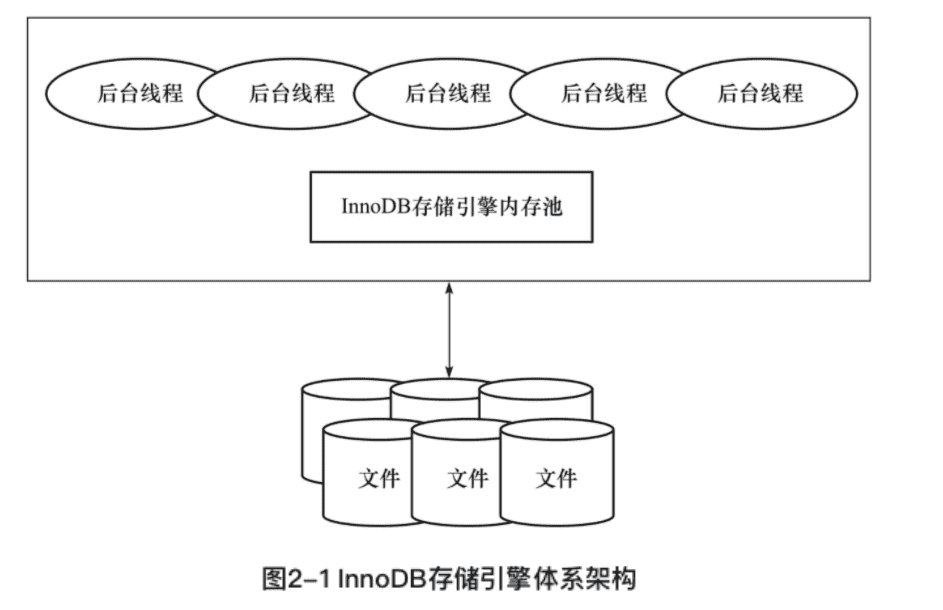

《MySQL技术内幕：InnoDB存储引擎（第2版）》笔记

------------

🏷️微信读书

## 前言


MySQL数据库独有的插件式存储引擎架构使其和其他任何数据库都不同。

InnoDB存储引擎的存在使得MySQL跃入了企业级数据库领域。

无论计算机技术发展的速度变得多快，数据库的使用变得多么简单，任何时候**Why都比What重要**。只有真正理解了内部实现原理、体系结构，才能更好地去使用。这正是人类正确思考问题的原则。


## 1 MySQL体系结构和存储引擎


### 1.1 定义数据库和实例

**数据库**（database）：物理操作系统文件或其他形式文件类型的集合。

**实例**（instance）：MySQL数据库由**后台线程以及一个共享内存区组成**。共享内存可以被运行的后台线程所共享。


MySQL被设计为一个单进程多线程架构的数据库


```shell
$ mysql --help | grep my.cnf
                      order of preference, my.cnf, $MYSQL_TCP_PORT,
/etc/my.cnf /etc/mysql/my.cnf /usr/local/mysql/etc/my.cnf ~/.my.cnf
```

可以看到，MySQL数据库是按/etc/my.cnf→/etc/mysql/my.cnf→/usr/local/mysql/etc/my.cnf→～/.my.cnf的顺序读取配置文件的。


datadir， /usr/local/mysql/data


### 1.2 MySQL体系结构


从概念上来说，数据库是文件的集合，是依照某种数据模型组织起来并存放于二级存储器中的数据集合；数据库实例是程序，是位于用户与操作系统之间的一层数据管理软件，用户对数据库数据的任何操作，包括数据库定义、数据查询、数据维护、数据库运行控制等都是在数据库实例下进行的，应用程序只有通过数据库实例才能和数据库打交道。

数据库是由一个个文件组成（一般来说都是二进制的文件）的，要对这些文件执行诸如SELECT、INSERT、UPDATE和DELETE之类的数据库操作是不能通过简单的操作文件来更改数据库的内容，需要通过数据库实例来完成对数据库的操作。


MySQL组成部分：

- 连接池组件
- 管理服务和工具组件
- SQL接口组件
- 查询分析器组件
- 优化器组件
- 缓冲（Cache）组件
- **插件式存储引擎**
- 物理文件


<font color=#FF8C00>**存储引擎是基于表的，而不是数据库。**</font>

### 1.3 MySQL存储引擎

MySQL数据库的核心在于存储引擎。


#### InnoDB存储引擎

在线事务处理（On-Line Transaction Processing，OLTP）

行锁设计、支持外键，并支持类似于Oracle的非锁定读，即默认读取操作不会产生锁。

#### MyISAM存储引擎

联机分析处理(Online Analytical Processing，OLAP）

不支持事务、表锁设计，支持全文索引

缓冲池只缓存（cache）索引文件，而不缓冲数据文件

MyISAM存储引擎表由MYD和MYI组成，MYD用来存放数据文件，MYI用来存放索引文件。myisampack工具可进一步压缩数据文件。

#### NDB存储引擎

集群存储引擎

sharenothing的集群架构

数据全部放在内存中

#### Memory存储引擎


#### Archive存储引擎


#### Federated存储引擎


#### Maria存储引擎


### 1.4 各存储引擎之间的比较


### 1.5 连接MySQL


## 2 InnoDB存储引擎

MySQL 5.5 开始为**默认**

### 2.1 概述

行锁设计、支持MVCC、支持外键、提供一致性非锁定读，同时被设计用来最有效地利用以及使用内存和CPU。

### 2.2 版本


### 2.3 InnoDB体系架构




#### 后台线程

主要作用：

- 负责刷新内存池中的数据，保证缓冲池中的内存缓存的是最近的数据
- 将已修改的数据文件刷新到磁盘文件
- 保证在数据库发生异常的情况下InnoDB能恢复到正常运行状态

##### 1. Master Thread

核心的后台线程，主要负责将缓冲池中的数据异步刷新到磁盘，保证数据的一致性，包括脏页的刷新、合并插入缓冲（INSERT BUFFER）、UNDO页的回收等。

##### 2. IO Thread

🔖

##### 3. Purge Thread


##### 4. Page Cleaner Thread


#### 内存

##### 1. 缓冲池


##### 2. LRU List、Free List和Flush List


##### 3. 重做日志缓冲


##### 4. 额外的内存池


### 2.4 Checkpoint技术


### 2.5 Master Thread工作方式


### 2.6 InnoDB关键特性

#### 插入缓冲


####  两次写


### 自适应哈希索引


### 异步IO


#### 刷新邻接页


#### 启动、关闭与恢复


## 3 文件


### 3.1 参数文件

动态（dynamic）参数

静态（static）参数

### 3.2 日志文件


#### 错误日志（error log）


#### 二进制日志（binlog）


#### 慢查询日志（slow query log）


#### 查询日志（log）


### 3.3 套接字文件


### 3.4 pid文件


### 3.5 表结构定义文件


### 3.6 InnoDB存储引擎文件


#### 表空间文件


#### 重做日志文件


## 4 表


### 4.1 索引组织表


### 4.2 InnoDB逻辑存储结构


#### 表空间


#### 段


####  区


#### 页


#### 行


### 4.3 InnoDB行记录格式


#### Compact行记录格式


#### Redundant行记录格式


#### 行溢出数据


#### Compressed和Dynamic行记录格式


#### CHAR的行结构存储


### 4.4 InnoDB数据页结构


#### File Header（文件头）


#### Page Header（页头）


#### Infimun和Supremum Records


#### User Records（用户记录，即行记录）


#### Free Space（空闲空间）


#### Page Directory（页目录）


#### File Trailer（文件结尾信息）


### 4.5 Named File Formats机制


### 4.6 约束

#### 数据完整性


#### 约束的创建和查找


#### 约束和索引的区别


#### 对错误数据的约束


####  ENUM和SET约束


####  触发器与约束


#### 外键约束


### 4.7 视图


#### 4.8 分区表


## 5 索引与算法


### 5.1 InnoDB存储引擎索引概述


### 5.2 数据结构与算法


#### 二分查找法


#### 二叉查找树和平衡二叉树


### 5.3 B+树


### 5.4 B+树索引

#### 聚集索引


#### 辅助索引


#### B+树索引的分裂


#### B+树索引的管理


### 5.5 Cardinality值


### 5.6 B+树索引的使用


#### 不同应用中B+树索引的使用


#### 联合索引


####  覆盖索引


#### 优化器选择不使用索引的情况


#### 索引提示


####  Multi-Range Read优化


#### Index Condition Pushdown（ICP）优化


### 5.7 哈希算法

#### 哈希表


####  InnoDB存储引擎中的哈希算法


#### 自适应哈希索引


### 5.8 全文检索


## 6 锁


## 7 事务


### 7.1 认识事务


### 7.2 事务的实现


### 7.3 事务控制语句


### 7.4 隐式提交的SQL语句


### 7.5 对于事务操作的统计


### 7.6 事务的隔离级别


### 7.7 分布式事务


### 7.8 不好的事务习惯


#### 在循环中提交


#### 使用自动提交


#### 使用自动回滚


### 7.9 长事务


## 8 备份与恢复


### 8.1 概述

按照备份的方法不同可以将备份分为：

- Hot Backup（热备）
- Cold Backup（冷备）
- Warm Backup（温备）

按照备份后文件的内容可以分为：

- 逻辑备份
- 裸文件备份

按照备份数据库的内容来可以分为：

- 完全备份
- 增量备份
- 日志备份


### 8.2 冷备


### 8.3 逻辑备份


#### mysqldump


### 8.4 二进制日志备份与恢复


### 8.5 热备


### 8.6 快照备份


### 8.7 复制


## 9 性能调优


### 9.1 选择合适的CPU


### 9.2 内存的重要性


### 9.3 硬盘对数据库性能的影响


### 9.4 合理地设置RAID


### 9.5 操作系统的选择


### 9.6 不同的文件系统对数据库性能的影响


### 9.7 选择合适的基准测试工具


## 10 InnoDB存储引擎源代码的编译和调试