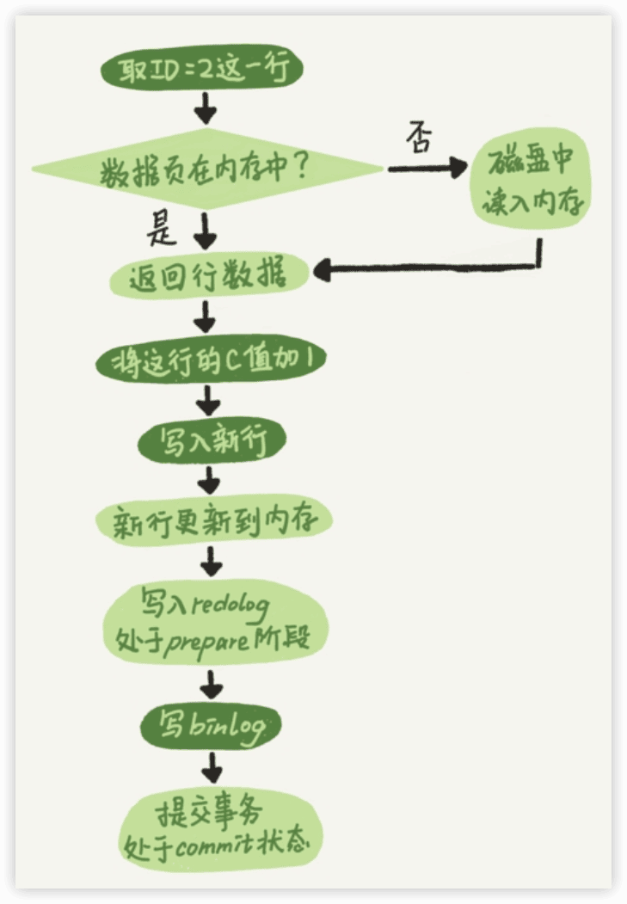

MySQL实战45讲
----

2018

https://time.geekbang.org/column/intro/100020801

### 0 前言

在了解了一个个系统模块的原理后，再来使用它，感觉是完全不一样的。当在代码里写下一行数据库命令的时候，我就能想到它**在数据库端将怎么执行，它的性能是怎么样的，怎样写能让我的应用程序访问数据库的性能最高**。进一步，**哪些数据处理让数据库系统来做性能会更好，哪些数据处理在缓存里做性能会更好**，我心里也会更清楚。在建表和建索引的时候，我也会更有意识地为将来的查询优化做综合考虑，比如确定是否使用递增主键、主键的列怎样选择，等等。


## 基础篇

### 1 基础架构：一条SQL查询语句是如何执行的？

看一个事儿千万不要直接陷入细节里，应该先鸟瞰其全貌，这样能够帮助你从高维度理解问题。


- Server层包括**连接器、查询缓存、分析器、优化器、执行器**等，涵盖MySQL的大多数核心服务功能，以及所有的**内置函数（如日期、时间、数学和加密函数等）**，所有**跨存储引擎的功能**都在这一层实现，比如**存储过程、触发器、视图**等。
- 存储引擎层负责数据的存储和提取。其架构模式是插件式的，支持InnoDB、MyISAM、Memory等多个存储引擎。

#### 连接器

连接器负责跟客户端**建立连接、获取权限、维持和管理连接**。连接命令一般写法的：

```sh
mysql -h$ip -P$port -u$user -p
```

虽然密码也可以直接跟在-p后面写在命令行中，但这样可能会导致你的密码泄露。如果你连的是生产服务器，强烈建议你不要这么做。

如果用户名密码认证通过，**连接器会到权限表里面查出你拥有的权限**。之后，这个连接里面的权限判断逻辑，都将依赖于此时读到的权限。

这就意味着，一个用户成功建立连接后，即使你用管理员账号对这个用户的权限做了修改，也不会影响已经存在连接的权限。修改完成后，只有再新建的连接才会使用新的权限设置。

`show processlist` 查看连接

参数`wait_timeout`控制客户端连接时间，默认值是8小时。断开后连接错误：Lost connection to MySQL server during query。

数据库里面，**==长连接==是指连接成功后，如果客户端持续有请求，则一直使用同一个连接。==短连接==则是指每次执行完很少的几次查询就断开连接，下次查询再重新建立一个**。

**建立连接的过程**通常是比较复杂的，所以建议在使用中要尽量减少建立连接的动作，也就是尽量使用长连接。

全部使用长连接后，有些时候MySQL占用内存涨得特别快，这是因为MySQL在**执行过程中临时使用的内存是管理在连接对象里面的**。这些资源会在连接断开的时候才释放。所以如果长连接累积下来，可能导致内存占用太大，被系统强行杀掉（OOM），从现象看就是MySQL异常重启了。

解决上面问题的两种方案：

1. 定**期断开长连接**。使用一段时间，或者程序里面判断执行过一个占用内存的大查询后，断开连接，之后要查询再重连。

2.  如果你用的是MySQL 5.7或更新版本，可以在每次执行一个比较大的操作后，通过执行`mysql_reset_connection`来重新初始化连接资源。这个过程不需要重连和重新做权限验证，但是会将连接恢复到刚刚创建完时的状态。


#### 查询缓存

查询缓存往往弊大于利。

查询缓存的失效非常频繁，只要有对一个表的更新，这个表上所有的查询缓存都会被清空。

MySQL 8.0版本直接将查询缓存的整块功能删掉了。


#### 分析器

1. ==词法分析==，识别SQL语句里的字符串分别是什么，代表什么。


2. ==语法分析==，根据词法分析的结果，语法分析器会根据语法规则，判断你输入的这个SQL语句是否满足MySQL语法。

`“You have an error in your SQL syntax”`


一般语法错误会提示第一个出现错误的位置，所以你要关注的是紧接“use near”的内容。

#### 优化器

经过了分析器，MySQL就知道你要做什么了。在开始执行之前，还要先经过优化器的处理。

优化器是**在表里面有多个索引的时候，决定使用哪个索引；或者在一个语句有多表关联（join）的时候，决定各个表的连接顺序。**

比如你执行下面这样的语句，这个语句是执行两个表的join：

```mysql
select * from t1 join t2 using(ID) where t1.c=10 and t2.d=20;
```

- 既可以先从表t1里面取出c=10的记录的ID值，再根据ID值关联到表t2，再判断t2里面d的值是否等于20。
- 也可以先从表t2里面取出d=20的记录的ID值，再根据ID值关联到t1，再判断t1里面c的值是否等于10。

这两种执行方法的逻辑结果是一样的，但是执行的效率会有不同，而优化器的作用就是决定选择使用哪一个方案。

#### 执行器

开始执行的时候，要先判断一下你对这个表T有没有执行查询的权限，如果没有，就会返回没有权限的错误：

```mysql
mysql> select * from T where ID=10;
ERROR 1142 (42000): SELECT command denied to user 'b'@'localhost' for table 'T'
```

如果有权限，就打开表继续执行。打开表的时候，执行器就会**根据表的引擎定义，去使用这个引擎提供的接口**。

比如我们这个例子中的表T中，ID字段没有索引，那么执行器的执行流程是这样的：

1.  调用InnoDB引擎接口取这个表的第一行，判断ID值是不是10，如果不是则跳过，如果是则将这行存在结果集中；
2.  调用引擎接口取“下一行”，重复相同的判断逻辑，直到取到这个表的最后一行。
3.  执行器将上述遍历过程中所有满足条件的行组成的记录集作为结果集返回给客户端。

至此，这个语句就执行完成了。

对于有索引的表，执行的逻辑也差不多。第一次调用的是“**取满足条件的第一行**”这个接口，之后循环取“**满足条件的下一行**”这个接口，这些接口都是引擎中已经定义好的。

慢查询日志中`rows_examined`的字段，表示这个语句执行过程中扫描了多少行。这个值就是在执行器每次调用引擎获取数据行的时候累加的。

在有些场景下，执行器调用一次，在引擎内部则扫描了多行，因此**引擎扫描行数跟`rows_examined`并不是完全相同的**。


### 2 日志系统：一条SQL更新语句是如何执行的？

```mysql
mysql> create table T(ID int primary key, c int);
mysql> update T set c=c+1 where ID=2;
```


与查询流程不一样的是，更新流程还涉及两个重要的日志模块：redo log（重做日志）和 binlog（归档日志）。

#### redo log（重做日志）

> 🌰酒店掌柜粉板
>
> 酒店掌柜有一个==粉板==，专门用来记录客人的赊账记录。如果赊账的人不多，那么他可以把顾客名和账目写在板上。但如果赊账的人多了，粉板总会有记不下的时候，这个时候掌柜一定还有一个专门记录赊账的==账本==。
>
> 如果有人要赊账或者还账的话，掌柜一般有两种做法：
>
> - 一种做法是直接把账本翻出来，把这次赊的账加上去或者扣除掉；
> - 另一种做法是先在粉板上记下这次的账，等打烊以后再把账本翻出来核算。
>
> 在生意红火柜台很忙时，掌柜一定会选择后者，因为前者操作实在是太麻烦了。首先，你得找到这个人的赊账总额那条记录。你想想，密密麻麻几十页，掌柜要找到那个名字，可能还得带上老花镜慢慢找，找到之后再拿出算盘计算，最后再将结果写回到账本上。
>
> 这整个过程想想都麻烦。相比之下，还是先在粉板上记一下方便。你想想，如果掌柜没有粉板的帮助，每次记账都得翻账本，效率是不是低得让人难以忍受？

同样，在MySQL里也有这个问题，**如果每一次的更新操作都需要写进磁盘，然后磁盘也要找到对应的那条记录，然后再更新，整个过程IO成本、查找成本都很高**。

粉板和账本配合的整个过程，其实就是MySQL里经常说到的WAL技术（Write-Ahead Logging），它的关键点就是**先写日志，再写磁盘**，也就是先写粉板，等不忙的时候再写账本。

具体来说，当有一条记录需要更新的时候，InnoDB引擎就会**先把记录写到redo log（粉板）里面，并更新内存**，这个时候更新就算完成了。同时，InnoDB引擎会在适当的时候，将这个操作记录更新到磁盘里面，而这个更新往往是在系统比较空闲的时候做，这就像打烊以后掌柜做的事。

如果今天赊账的不多，掌柜可以等打烊后再整理。但如果某天赊账的特别多，粉板写满了，又怎么办呢？这个时候掌柜只好放下手中的活儿，把粉板中的一部分赊账记录更新到账本中，然后把这些记录从粉板上擦掉，为记新账腾出空间。

与此类似，InnoDB的**redo log是固定大小**的，比如可以配置为一组4个文件，每个文件的大小是1GB，那么这块“粉板”总共就可以记录4GB的操作。从头开始写，写到末尾就又回到开头循环写，如下面这个图所示。


`write pos`是当前记录的位置，一边写一边后移，写到第3号文件末尾后就回到0号文件开头。`checkpoint`是当前要擦除的位置，也是往后推移并且循环的，擦除记录前要把记录更新到数据文件。

write pos和checkpoint之间的是“粉板”上还空着的部分，可以用来记录新的操作。如果write pos追上checkpoint，表示“粉板”满了，这时候不能再执行新的更新，得停下来先擦掉一些记录，把checkpoint推进一下。

有了redo log，InnoDB就可以保证即使数据库发生异常重启，之前提交的记录都不会丢失，这个能力称为==crash-safe==。

#### binlog（归档日志）

redo log是InnoDB引擎特有的日志，而Server层也有自己的日志，称为binlog（归档日志）。

两种日志不同点：

- redo log是InnoDB引擎特有的；binlog是MySQL的Server层实现的，所有引擎都可以使用。
- redo log是**物理日志**，记录的是“在某个数据页上做了什么修改”；binlog是**逻辑日志**，记录的是这个语句的原始逻辑，比如“给ID=2这一行的c字段加1 ”。
- redo log是**循环**写的，空间固定会用完；binlog是可以**追加**写入的。“追加写”是指binlog文件写到一定大小后会切换到下一个，并不会覆盖以前的日志。

执行器和InnoDB引擎在执行这个简单的update语句时的内部流程：

1. 执行器先找引擎取ID=2这一行。ID是主键，引擎直接用树搜索找到这一行。如果ID=2这一行所在的数据页本来就在内存中，就直接返回给执行器；否则，需要先从磁盘读入内存，然后再返回。
2. 执行器拿到引擎给的行数据，把这个值加上1，比如原来是N，现在就是N+1，得到新的一行数据，再调用引擎接口写入这行新数据。
3. 引擎将这行新数据更新到内存中，同时将这个更新操作记录到redo log里面，此时redo log处于==prepare状态==。然后告知执行器执行完成了，随时可以提交事务。
4. 执行器生成这个操作的binlog，并把binlog写入磁盘。
5. 执行器调用引擎的提交事务接口，引擎把刚刚写入的redo log改成==提交（commit）状态==，更新完成。



（浅色框表示是在InnoDB内部执行的，深色框表示是在执行器中执行的）

#### 两阶段提交 🔖

> 为什么必须将redo log的写入拆成“两阶段提交”呢？
>
> 为了让两份日志之间的逻辑一致。

怎样让数据库恢复到半个月内任意一秒的状态？

binlog会记录所有的逻辑操作，并且是采用“追加写”的形式。如果你的DBA承诺说半个月内可以恢复，那么备份系统中一定会保存最近半个月的所有binlog，同时系统会定期做**整库备份**。

当需要恢复到指定的某一秒时，比如某天下午两点发现中午十二点有一次误删表，需要找回数据，那你可以这么做：

- 首先，找到最近的一次**全量备份**，如果你运气好，可能就是昨天晚上的一个备份，从这个备份恢复到临时库；
- 然后，从备份的时间点开始，将备份的binlog依次取出来，重放到中午误删表之前的那个时刻。

这样你的临时库就跟误删之前的线上库一样了，然后你可以把表数据从临时库取出来，按需要恢复到线上库去。


**由于于redo log和binlog是两个独立的逻辑，如果不用两阶段提交，要么就是先写完redo log再写binlog，或者采用反过来的顺序。**

假设当前ID=2的行，字段c的值是0，再假设执行update语句过程中在写完第一个日志后，第二个日志还没有写完期间发生了crash，会出现什么情况呢？

- **先写redo log后写binlog**。假设在redo log写完，binlog还没有写完的时候，MySQL进程异常重启。由于我们前面说过的，redo log写完之后，系统即使崩溃，仍然能够把数据恢复回来，所以恢复后这一行c的值是1。但是由于binlog没写完就crash了，这时候binlog里面就没有记录这个语句。因此，之后备份日志的时候，存起来的binlog里面就没有这条语句。然后你会发现，如果需要用这个binlog来恢复临时库的话，由于这个语句的binlog丢失，这个临时库就会少了这一次更新，恢复出来的这一行c的值就是0，与原库的值不同。
- **先写binlog后写redo log**。如果在binlog写完之后crash，由于redo log还没写，崩溃恢复以后这个事务无效，所以这一行c的值是0。但是binlog里面已经记录了“把c从0改成1”这个日志。所以，在之后用binlog来恢复的时候就多了一个事务出来，恢复出来的这一行c的值就是1，与原库的值不同。

可以看到，**如果不使用“两阶段提交”，那么数据库的状态就有可能和用它的日志恢复出来的库的状态不一致。**

你可能会说，这个概率是不是很低，平时也没有什么动不动就需要恢复临时库的场景呀？

其实不是的，不只是误操作后需要用这个过程来恢复数据。当你需要**扩容**的时候，也就是需要再多搭建一些备库来增加系统的读能力的时候，现在常见的做法也是用全量备份加上应用binlog来实现的，这个“不一致”就会导致你的线上出现主从数据库不一致的情况。

简单说，**redo log和binlog都可以用于表示事务的提交状态，而两阶段提交就是让这两个状态保持逻辑上的一致。**


### 3 事务隔离：为什么你改了我还看不见？

简单来说，事务就是要**保证一组数据库操作，要么全部成功，要么全部失败**。在MySQL中，事务支持是在引擎层实现的。

#### 隔离性与隔离级别

ACID（Atomicity、Consistency、Isolation、Durability，即原子性、一致性、隔离性、持久性）

当数据库上有多个事务同时执行的时候，就可能出现**脏读（dirty read）、不可重复读（non-repeatable read）、幻读（phantom read）**的问题，为了解决这些问题，就有了“隔离级别”的概念。

> 隔离得越严实，效率就会越低。

SQL标准的事务隔离级别包括：

- 读未提交（read uncommitted），一个事务还没提交时，它做的变更就能被别的事务看到。
- 读提交（read committed），一个事务提交之后，它做的变更才会被其他事务看到。
- 可重复读（repeatable read），一个事务执行过程中看到的数据，总是跟这个事务在启动时看到的数据是一致的。当然在可重复读隔离级别下，未提交变更对其他事务也是不可见的。
- 串行化（serializable ），对于同一行记录，“写”会加“写锁”，“读”会加“读锁”。当出现读写锁冲突的时候，后访问的事务必须等前一个事务执行完成，才能继续执行。

```mysql
create table T(c int) engine=InnoDB;
insert into T(c) values(1);
```


看看在不同的隔离级别下，事务A会有哪些不同的返回结果，也就是图里面V1、V2、V3的返回值分别是什么。

- 若隔离级别是“读未提交”， 则V1的值就是2。这时候事务B虽然还没有提交，但是结果已经被A看到了。因此，V2、V3也都是2。
- 若隔离级别是“读提交”，则V1是1，V2的值是2。事务B的更新在提交后才能被A看到。所以， V3的值也是2。
- 若隔离级别是“可重复读”，则V1、V2是1，V3是2。之所以V2还是1，遵循的就是这个要求：事务在执行期间看到的数据前后必须是一致的。
- 若隔离级别是“串行化”，则在事务B执行“将1改成2”的时候，会被锁住。直到事务A提交后，事务B才可以继续执行。所以从A的角度看， V1、V2值是1，V3的值是2。

在实现上，数据库里面会创建一个视图，访问的时候以视图的逻辑结果为准。在“可重复读”隔离级别下，这个视图是在事务启动时创建的，整个事务存在期间都用这个视图。在“读提交”隔离级别下，这个视图是在每个SQL语句开始执行的时候创建的。这里需要注意的是，“读未提交”隔离级别下直接返回记录上的最新值，没有视图概念；而“串行化”隔离级别下直接用加锁的方式来避免并行访问。

在不同的隔离级别下，数据库行为是有所不同的。Oracle数据库的默认隔离级别其实就是“读提交”，因此对于一些从Oracle迁移到MySQL的应用，为保证数据库隔离级别的一致，你一定要记得将MySQL的隔离级别设置为“读提交”。

配置的方式是，将启动参数`transaction_isolation`的值设置成`READ-COMMITTED`。

```mysql
mysql> show variables like 'transaction_isolation';
+-----------------------+-----------------+
| Variable_name         | Value           |
+-----------------------+-----------------+
| transaction_isolation | REPEATABLE-READ |
+-----------------------+-----------------+
```

每种隔离级别都有自己的使用场景，要根据自己的业务情况来定。

> “可重复读”的场景:
>
> 假设你在管理一个个人银行账户表。一个表存了账户余额，一个表存了账单明细。到了月底你要做数据校对，也就是判断上个月的余额和当前余额的差额，是否与本月的账单明细一致。你一定希望在校对过程中，即使有用户发生了一笔新的交易，也不影响你的校对结果。
>
> 这时候使用“可重复读”隔离级别就很方便。事务启动时的视图可以认为是静态的，不受其他事务更新的影响。

#### 事务隔离的实现


#### 事务的启动方式


### 4 深入浅出索引（上）


### 5 深入浅出索引（下）


### 6 全局锁和表锁 ：给表加个字段怎么有这么多阻碍？


### 7 行锁功过：怎么减少行锁对性能的影响？


### 8 事务到底是隔离的还是不隔离的？

## 实践篇

### 9 
