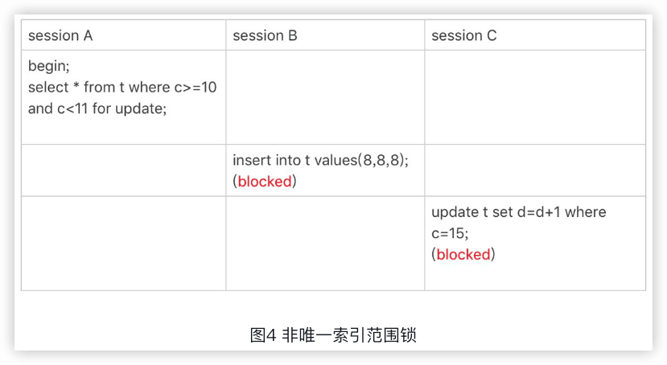

MySQL实战45讲
----

2018

https://time.geekbang.org/column/intro/100020801

### 0 前言

在了解了一个个系统模块的原理后，再来使用它，感觉是完全不一样的。当在代码里写下一行数据库命令的时候，我就能想到它**在数据库端将怎么执行，它的性能是怎么样的，怎样写能让我的应用程序访问数据库的性能最高**。进一步，**哪些数据处理让数据库系统来做性能会更好，哪些数据处理在缓存里做性能会更好**，我心里也会更清楚。在建表和建索引的时候，我也会更有意识地为将来的查询优化做综合考虑，比如确定是否使用递增主键、主键的列怎样选择，等等。


## 基础篇

### 1 基础架构：一条SQL查询语句是如何执行的？

看一个事儿千万不要直接陷入细节里，应该先鸟瞰其全貌，这样能够帮助你从高维度理解问题。


- Server层包括**连接器、查询缓存、分析器、优化器、执行器**等，涵盖MySQL的大多数核心服务功能，以及所有的**内置函数（如日期、时间、数学和加密函数等）**，所有**跨存储引擎的功能**都在这一层实现，比如**存储过程、触发器、视图**等。
- 存储引擎层负责数据的存储和提取。其架构模式是插件式的，支持InnoDB、MyISAM、Memory等多个存储引擎。

#### 连接器

连接器负责跟客户端**建立连接、获取权限、维持和管理连接**。连接命令一般写法的：

```sh
mysql -h$ip -P$port -u$user -p
```

虽然密码也可以直接跟在-p后面写在命令行中，但这样可能会导致你的密码泄露。如果你连的是生产服务器，强烈建议你不要这么做。

如果用户名密码认证通过，**连接器会到权限表里面查出你拥有的权限**。之后，这个连接里面的权限判断逻辑，都将依赖于此时读到的权限。

这就意味着，一个用户成功建立连接后，即使你用管理员账号对这个用户的权限做了修改，也不会影响已经存在连接的权限。修改完成后，只有再新建的连接才会使用新的权限设置。

`show processlist` 查看连接

参数`wait_timeout`控制客户端连接时间，默认值是8小时。断开后连接错误：Lost connection to MySQL server during query。

数据库里面，**==长连接==是指连接成功后，如果客户端持续有请求，则一直使用同一个连接。==短连接==则是指每次执行完很少的几次查询就断开连接，下次查询再重新建立一个**。

**建立连接的过程**通常是比较复杂的，所以建议在使用中要尽量减少建立连接的动作，也就是尽量使用长连接。

全部使用长连接后，有些时候MySQL占用内存涨得特别快，这是因为MySQL在**执行过程中临时使用的内存是管理在连接对象里面的**。这些资源会在连接断开的时候才释放。所以如果长连接累积下来，可能导致内存占用太大，被系统强行杀掉（OOM），从现象看就是MySQL异常重启了。

解决上面问题的两种方案：

1. 定**期断开长连接**。使用一段时间，或者程序里面判断执行过一个占用内存的大查询后，断开连接，之后要查询再重连。

2.  如果你用的是MySQL 5.7或更新版本，可以在每次执行一个比较大的操作后，通过执行`mysql_reset_connection`来重新初始化连接资源。这个过程不需要重连和重新做权限验证，但是会将连接恢复到刚刚创建完时的状态。


#### 查询缓存

查询缓存往往弊大于利。

查询缓存的失效非常频繁，只要有对一个表的更新，这个表上所有的查询缓存都会被清空。

MySQL 8.0版本直接将查询缓存的整块功能删掉了。


#### 分析器

1. ==词法分析==，识别SQL语句里的字符串分别是什么，代表什么。


2. ==语法分析==，根据词法分析的结果，语法分析器会根据语法规则，判断你输入的这个SQL语句是否满足MySQL语法。

`“You have an error in your SQL syntax”`


一般语法错误会提示第一个出现错误的位置，所以你要关注的是紧接“use near”的内容。

#### 优化器

经过了分析器，MySQL就知道你要做什么了。在开始执行之前，还要先经过优化器的处理。

优化器是**在表里面有多个索引的时候，决定使用哪个索引；或者在一个语句有多表关联（join）的时候，决定各个表的连接顺序。**

比如你执行下面这样的语句，这个语句是执行两个表的join：

```mysql
select * from t1 join t2 using(ID) where t1.c=10 and t2.d=20;
```

- 既可以先从表t1里面取出c=10的记录的ID值，再根据ID值关联到表t2，再判断t2里面d的值是否等于20。
- 也可以先从表t2里面取出d=20的记录的ID值，再根据ID值关联到t1，再判断t1里面c的值是否等于10。

这两种执行方法的逻辑结果是一样的，但是执行的效率会有不同，而优化器的作用就是决定选择使用哪一个方案。

#### 执行器

开始执行的时候，要先判断一下你对这个表T有没有执行查询的权限，如果没有，就会返回没有权限的错误：

```mysql
mysql> select * from T where ID=10;
ERROR 1142 (42000): SELECT command denied to user 'b'@'localhost' for table 'T'
```

如果有权限，就打开表继续执行。打开表的时候，执行器就会**根据表的引擎定义，去使用这个引擎提供的接口**。

比如我们这个例子中的表T中，ID字段没有索引，那么执行器的执行流程是这样的：

1.  调用InnoDB引擎接口取这个表的第一行，判断ID值是不是10，如果不是则跳过，如果是则将这行存在结果集中；
2.  调用引擎接口取“下一行”，重复相同的判断逻辑，直到取到这个表的最后一行。
3.  执行器将上述遍历过程中所有满足条件的行组成的记录集作为结果集返回给客户端。

至此，这个语句就执行完成了。

对于有索引的表，执行的逻辑也差不多。第一次调用的是“**取满足条件的第一行**”这个接口，之后循环取“**满足条件的下一行**”这个接口，这些接口都是引擎中已经定义好的。

慢查询日志中`rows_examined`的字段，表示这个语句执行过程中扫描了多少行。这个值就是在执行器每次调用引擎获取数据行的时候累加的。

在有些场景下，执行器调用一次，在引擎内部则扫描了多行，因此**引擎扫描行数跟`rows_examined`并不是完全相同的**。


### 2 日志系统：一条SQL更新语句是如何执行的？

```mysql
mysql> create table T(ID int primary key, c int);
mysql> update T set c=c+1 where ID=2;
```


与查询流程不一样的是，更新流程还涉及两个重要的日志模块：redo log（重做日志）和 binlog（归档日志）。

#### redo log（重做日志）

> 🌰酒店掌柜粉板
>
> 酒店掌柜有一个==粉板==，专门用来记录客人的赊账记录。如果赊账的人不多，那么他可以把顾客名和账目写在板上。但如果赊账的人多了，粉板总会有记不下的时候，这个时候掌柜一定还有一个专门记录赊账的==账本==。
>
> 如果有人要赊账或者还账的话，掌柜一般有两种做法：
>
> - 一种做法是直接把账本翻出来，把这次赊的账加上去或者扣除掉；
> - 另一种做法是先在粉板上记下这次的账，等打烊以后再把账本翻出来核算。
>
> 在生意红火柜台很忙时，掌柜一定会选择后者，因为前者操作实在是太麻烦了。首先，你得找到这个人的赊账总额那条记录。你想想，密密麻麻几十页，掌柜要找到那个名字，可能还得带上老花镜慢慢找，找到之后再拿出算盘计算，最后再将结果写回到账本上。
>
> 这整个过程想想都麻烦。相比之下，还是先在粉板上记一下方便。你想想，如果掌柜没有粉板的帮助，每次记账都得翻账本，效率是不是低得让人难以忍受？

同样，在MySQL里也有这个问题，**如果每一次的更新操作都需要写进磁盘，然后磁盘也要找到对应的那条记录，然后再更新，整个过程IO成本、查找成本都很高**。

粉板和账本配合的整个过程，其实就是MySQL里经常说到的WAL技术（Write-Ahead Logging），它的关键点就是**先写日志，再写磁盘**，也就是先写粉板，等不忙的时候再写账本。

具体来说，当有一条记录需要更新的时候，InnoDB引擎就会**先把记录写到redo log（粉板）里面，并更新内存**，这个时候更新就算完成了。同时，InnoDB引擎会在适当的时候，将这个操作记录更新到磁盘里面，而这个更新往往是在系统比较空闲的时候做，这就像打烊以后掌柜做的事。

如果今天赊账的不多，掌柜可以等打烊后再整理。但如果某天赊账的特别多，粉板写满了，又怎么办呢？这个时候掌柜只好放下手中的活儿，把粉板中的一部分赊账记录更新到账本中，然后把这些记录从粉板上擦掉，为记新账腾出空间。

与此类似，InnoDB的**redo log是固定大小**的，比如可以配置为一组4个文件，每个文件的大小是1GB，那么这块“粉板”总共就可以记录4GB的操作。从头开始写，写到末尾就又回到开头循环写，如下面这个图所示。


`write pos`是当前记录的位置，一边写一边后移，写到第3号文件末尾后就回到0号文件开头。`checkpoint`是当前要擦除的位置，也是往后推移并且循环的，擦除记录前要把记录更新到数据文件。

write pos和checkpoint之间的是“粉板”上还空着的部分，可以用来记录新的操作。如果write pos追上checkpoint，表示“粉板”满了，这时候不能再执行新的更新，得停下来先擦掉一些记录，把checkpoint推进一下。

有了redo log，InnoDB就可以保证即使数据库发生异常重启，之前提交的记录都不会丢失，这个能力称为==crash-safe==。

#### binlog（归档日志）

redo log是InnoDB引擎特有的日志，而Server层也有自己的日志，称为binlog（归档日志）。

两种日志不同点：

- redo log是InnoDB引擎特有的；binlog是MySQL的Server层实现的，所有引擎都可以使用。
- redo log是**物理日志**，记录的是“在某个数据页上做了什么修改”；binlog是**逻辑日志**，记录的是这个语句的原始逻辑，比如“给ID=2这一行的c字段加1 ”。
- redo log是**循环**写的，空间固定会用完；binlog是可以**追加**写入的。“追加写”是指binlog文件写到一定大小后会切换到下一个，并不会覆盖以前的日志。

执行器和InnoDB引擎在执行这个简单的update语句时的内部流程：

1. 执行器先找引擎取ID=2这一行。ID是主键，引擎直接用树搜索找到这一行。如果ID=2这一行所在的数据页本来就在内存中，就直接返回给执行器；否则，需要先从磁盘读入内存，然后再返回。
2. 执行器拿到引擎给的行数据，把这个值加上1，比如原来是N，现在就是N+1，得到新的一行数据，再调用引擎接口写入这行新数据。
3. 引擎将这行新数据更新到内存中，同时将这个更新操作记录到redo log里面，此时redo log处于==prepare状态==。然后告知执行器执行完成了，随时可以提交事务。
4. 执行器生成这个操作的binlog，并把binlog写入磁盘。
5. 执行器调用引擎的提交事务接口，引擎把刚刚写入的redo log改成==提交（commit）状态==，更新完成。


（浅色框表示是在InnoDB内部执行的，深色框表示是在执行器中执行的）

#### 两阶段提交 🔖

> 为什么必须将redo log的写入拆成“两阶段提交”呢？
>
> 为了让两份日志之间的逻辑一致。

怎样让数据库恢复到半个月内任意一秒的状态？

binlog会记录所有的逻辑操作，并且是采用“追加写”的形式。如果你的DBA承诺说半个月内可以恢复，那么备份系统中一定会保存最近半个月的所有binlog，同时系统会定期做**整库备份**。

当需要恢复到指定的某一秒时，比如某天下午两点发现中午十二点有一次误删表，需要找回数据，那你可以这么做：

- 首先，找到最近的一次**全量备份**，如果你运气好，可能就是昨天晚上的一个备份，从这个备份恢复到临时库；
- 然后，从备份的时间点开始，将备份的binlog依次取出来，重放到中午误删表之前的那个时刻。

这样你的临时库就跟误删之前的线上库一样了，然后你可以把表数据从临时库取出来，按需要恢复到线上库去。


**由于于redo log和binlog是两个独立的逻辑，如果不用两阶段提交，要么就是先写完redo log再写binlog，或者采用反过来的顺序。**

假设当前ID=2的行，字段c的值是0，再假设执行update语句过程中在写完第一个日志后，第二个日志还没有写完期间发生了crash，会出现什么情况呢？

- **先写redo log后写binlog**。假设在redo log写完，binlog还没有写完的时候，MySQL进程异常重启。由于我们前面说过的，redo log写完之后，系统即使崩溃，仍然能够把数据恢复回来，所以恢复后这一行c的值是1。但是由于binlog没写完就crash了，这时候binlog里面就没有记录这个语句。因此，之后备份日志的时候，存起来的binlog里面就没有这条语句。然后你会发现，如果需要用这个binlog来恢复临时库的话，由于这个语句的binlog丢失，这个临时库就会少了这一次更新，恢复出来的这一行c的值就是0，与原库的值不同。
- **先写binlog后写redo log**。如果在binlog写完之后crash，由于redo log还没写，崩溃恢复以后这个事务无效，所以这一行c的值是0。但是binlog里面已经记录了“把c从0改成1”这个日志。所以，在之后用binlog来恢复的时候就多了一个事务出来，恢复出来的这一行c的值就是1，与原库的值不同。

可以看到，**如果不使用“两阶段提交”，那么数据库的状态就有可能和用它的日志恢复出来的库的状态不一致。**

你可能会说，这个概率是不是很低，平时也没有什么动不动就需要恢复临时库的场景呀？

其实不是的，不只是误操作后需要用这个过程来恢复数据。当你需要**扩容**的时候，也就是需要再多搭建一些备库来增加系统的读能力的时候，现在常见的做法也是用全量备份加上应用binlog来实现的，这个“不一致”就会导致你的线上出现主从数据库不一致的情况。

简单说，**redo log和binlog都可以用于表示事务的提交状态，而两阶段提交就是让这两个状态保持逻辑上的一致。**


### 3 事务隔离：为什么你改了我还看不见？

简单来说，事务就是要**保证一组数据库操作，要么全部成功，要么全部失败**。在MySQL中，事务支持是在引擎层实现的。

#### 隔离性与隔离级别

ACID（Atomicity、Consistency、Isolation、Durability，即原子性、一致性、隔离性、持久性）

当数据库上有多个事务同时执行的时候，就可能出现**脏读（dirty read）、不可重复读（non-repeatable read）、幻读（phantom read）**的问题，为了解决这些问题，就有了“隔离级别”的概念。

> 隔离得越严实，效率就会越低。

SQL标准的事务隔离级别包括：

- 读未提交（read uncommitted），一个事务还没提交时，它做的变更就能被别的事务看到。
- 读提交（read committed），一个事务提交之后，它做的变更才会被其他事务看到。
- 可重复读（repeatable read），一个事务执行过程中看到的数据，总是跟这个事务在启动时看到的数据是一致的。当然在可重复读隔离级别下，未提交变更对其他事务也是不可见的。
- 串行化（serializable ），对于同一行记录，“写”会加“写锁”，“读”会加“读锁”。当出现读写锁冲突的时候，后访问的事务必须等前一个事务执行完成，才能继续执行。

```mysql
create table T(c int) engine=InnoDB;
insert into T(c) values(1);
```


看看在不同的隔离级别下，事务A会有哪些不同的返回结果，也就是图里面V1、V2、V3的返回值分别是什么。

- 若隔离级别是“读未提交”， 则V1的值就是2。这时候事务B虽然还没有提交，但是结果已经被A看到了。因此，V2、V3也都是2。
- 若隔离级别是“读提交”，则V1是1，V2的值是2。事务B的更新在提交后才能被A看到。所以， V3的值也是2。
- 若隔离级别是“可重复读”，则V1、V2是1，V3是2。之所以V2还是1，遵循的就是这个要求：事务在执行期间看到的数据前后必须是一致的。
- 若隔离级别是“串行化”，则在事务B执行“将1改成2”的时候，会被锁住。直到事务A提交后，事务B才可以继续执行。所以从A的角度看， V1、V2值是1，V3的值是2。

在实现上，数据库里面会创建一个视图，访问的时候以视图的逻辑结果为准。在“可重复读”隔离级别下，这个视图是在事务启动时创建的，整个事务存在期间都用这个视图。在“读提交”隔离级别下，这个视图是在每个SQL语句开始执行的时候创建的。这里需要注意的是，“读未提交”隔离级别下直接返回记录上的最新值，没有视图概念；而“串行化”隔离级别下直接用加锁的方式来避免并行访问。

在不同的隔离级别下，数据库行为是有所不同的。Oracle数据库的默认隔离级别其实就是“读提交”，因此对于一些从Oracle迁移到MySQL的应用，为保证数据库隔离级别的一致，你一定要记得将MySQL的隔离级别设置为“读提交”。

配置的方式是，将启动参数`transaction_isolation`的值设置成`READ-COMMITTED`。

```mysql
mysql> show variables like 'transaction_isolation';
+-----------------------+-----------------+
| Variable_name         | Value           |
+-----------------------+-----------------+
| transaction_isolation | REPEATABLE-READ |
+-----------------------+-----------------+
```

每种隔离级别都有自己的使用场景，要根据自己的业务情况来定。

> “可重复读”的场景:
>
> 假设你在管理一个个人银行账户表。一个表存了账户余额，一个表存了账单明细。到了月底你要做数据校对，也就是判断上个月的余额和当前余额的差额，是否与本月的账单明细一致。你一定希望在校对过程中，即使有用户发生了一笔新的交易，也不影响你的校对结果。
>
> 这时候使用“可重复读”隔离级别就很方便。事务启动时的视图可以认为是静态的，不受其他事务更新的影响。

#### 事务隔离的实现

在MySQL中，实际上**每条记录在更新的时候都会同时记录一条回滚操作**。记录上的最新值，通过回滚操作，都可以得到前一个状态的值。

假设一个值从1被按顺序改成了2、3、4，在==回滚日志==（Undo Log）里面就会有类似下面的记录。

> 回滚日志和重做日志在数据库事务管理中各自承担不同的责任。回滚日志主要用于确保事务的原子性和数据的一致性，而重做日志则主要用于保证事务的持久性和在故障发生时的数据恢复。


当前值是4，但是在查询这条记录的时候，不同时刻启动的事务会有不同的read-view。如图中看到的，在视图A、B、C里面，这一个记录的值分别是1、2、4，同一条记录在系统中可以存在多个版本，就是数据库的**多版本并发控制（MVCC）**。对于read-view A，要得到1，就必须将当前值依次执行图中所有的回滚操作得到。

同时你会发现，即使现在有另外一个事务正在将4改成5，这个事务跟read-view A、B、C对应的事务是不会冲突的。

你一定会问，回滚日志总不能一直保留吧，什么时候删除呢？答案是，**在不需要的时候才删除**。也就是说，系统会判断，当没有事务再需要用到这些回滚日志时，回滚日志会被删除。

什么时候才不需要了呢？就是当系统里**没有比这个回滚日志更早的read-view的时候**。

> 为什么建议你尽量不要使用长事务？

长事务意味着系统里面会存在很**老的事务视图**。由于这些事务随时可能访问数据库里面的任何数据，所以这个事务提交之前，数据库里面它可能用到的回滚记录都必须保留，这就会导致大量占用存储空间。

在MySQL 5.5及以前的版本，回滚日志是跟数据字典一起放在ibdata文件里的，即使长事务最终提交，回滚段被清理，文件也不会变小。<u>我见过数据只有20GB，而回滚段有200GB的库。最终只好为了清理回滚段，重建整个库。</u>

除了对回滚段的影响，长事务还占用锁资源，也可能拖垮整个库，这个我们会在后面讲锁的时候展开。

#### 事务的启动方式

1. 显式启动事务语句， `begin` 或 `start transaction`。配套的提交语句是`commit`，回滚语句是`rollback`。
2. `set autocommit=0`，这个命令会将这个线程的自动提交关掉。意味着如果你只执行一个select语句，这个事务就启动了，而且并不会自动提交。这个事务持续存在直到你主动执行commit 或 rollback 语句，或者断开连接。

有些客户端连接框架会默认连接成功后先执行一个set autocommit=0的命令。这就导致接下来的查询都在事务中，如果是长连接，就导致了意外的长事务。因此，建议总是使用`set autocommit=1`, 通过显式语句的方式来启动事务。

🔖

```mysql
select * from information_schema.innodb_trx where TIME_TO_SEC(timediff(now(),trx_started))>60;   
```


### 4 深入浅出索引（上）

索引的出现其实就是为了提高数据查询的效率。

#### 4.1 索引的常见模型

##### 哈希表

==哈希表==是一种以键-值（key-value）存储数据的结构，我们只要输入待查找的键即key，就可以找到其对应的值即Value。哈希的思路很简单，把值放在数组里，用一个哈希函数把key换算成一个确定的位置，然后把value放在数组的这个位置。

不可避免地，多个key值经过哈希函数的换算，会出现同一个值的情况。处理这种情况的一种方法是，**拉出一个链表**。

假设，你现在维护着一个身份证信息和姓名的表，需要根据身份证号查找对应的名字，这时对应的哈希索引的示意图如下所示：


图中，User2和User4根据身份证号算出来的值都是N，但没关系，后面还跟了一个链表。假设，这时候你要查ID_card_n2对应的名字是什么，处理步骤就是：首先，将ID_card_n2通过哈希函数算出N；然后，按顺序遍历，找到User2。

需要注意的是，图中四个ID_card_n的值并**不是递增**的，这样做的好处是**增加**新的User时速度会很快，只需要往后追加。但缺点是，因为不是有序的，所以哈希索引做**区间查询**的速度是很慢的。例如要找身份证号在`[ID_card_X, ID_card_Y]`这个区间的所有用户，就必须全部扫描一遍了。

所以，哈希表这种结构适用于**只有等值查询**的场景，比如Memcached及其他一些NoSQL引擎。

##### 有序数组

==有序数组==在==等值查询==和==范围查询==场景中的性能就都非常优秀。还是上面这个根据身份证号查名字的例子，如果我们使用有序数组来实现的话，示意图如下所示：


假设身份证号没有重复，这个数组就是按照身份证号递增的顺序保存的。这时候如果你要查ID_card_n2对应的名字，用二分法就可以快速得到，这个时间复杂度是O(log(N))。

同时很显然，这个索引结构支持范围查询。你要查身份证号在[ID_card_X,ID_card_Y]区间的User，可以先用二分法找到ID_card_X（如果不存在ID_card_X，就找到大于ID_card_X的第一个User），然后向右遍历，直到查到第一个大于ID_card_Y的身份证号，退出循环。

如果仅仅看查询效率，有序数组就是最好的数据结构了。但是，在需要**更新数据的时候就麻烦**了，你往中间插入一个记录就必须得挪动后面所有的记录，成本太高。

所以，**有序数组索引只适用于==静态存储引擎==**，比如你要保存的是2017年某个城市的所有人口信息，这类不会再修改的数据。


##### 搜索树

二叉搜索树也是课本里的经典数据结构了。


二叉搜索树的特点是：父节点左子树所有结点的值小于父节点的值，右子树所有结点的值大于父节点的值。这样如果你要查ID_card_n2的话，按照图中的搜索顺序就是按照UserA -> UserC -> UserF -> User2这个路径得到。这个时间复杂度是O(log(N))。

当然为了**维持**O(log(N))的查询复杂度，你就需要保持这棵树是**平衡二叉树**。为了做这个保证，更新的时间复杂度也是`O(log(N))`。

树可以有二叉，也可以有多叉。多叉树就是每个节点有多个儿子，儿子之间的大小保证从左到右递增。二叉树是搜索效率最高的，但是实际上大多数的数据库存储却并不使用二叉树。其原因是，**索引不止存在内存中，还要写到磁盘上**。

你可以想象一下一棵100万节点的平衡二叉树，树高20。一次查询可能需要访问20个数据块。在机械硬盘时代，从磁盘随机读一个数据块需要10 ms左右的寻址时间。也就是说，对于一个100万行的表，如果使用二叉树来存储，单独访问一个行可能需要20个10 ms的时间，这个查询可真够慢的。

为了让一个查询尽量少地读磁盘，就必须让查询过程访问尽量少的数据块。那么，我们就不应该使用二叉树，而是要使用**“N叉”树**。这里，“N叉”树中的“N”取决于**数据块的大小**。

以InnoDB的一个整数字段索引为例，这个N差不多是`1200`。这棵树高是`4`的时候，就可以存1200的3次方个值，这已经`17`亿了。考虑到树根的数据块总是在内存中的，一个10亿行的表上一个整数字段的索引，查找一个值最多只需要访问3次磁盘。其实，树的第二层也有很大概率在内存中，那么访问磁盘的平均次数就更少了。

**N叉树由于在读写上的性能优点，以及适配磁盘的访问模式，已经被广泛应用在数据库引擎中了。**


不管是哈希还是有序数组，或者N叉树，它们都是不断迭代、不断优化的产物或者解决方案。数据库技术发展到今天，跳表、LSM树等数据结构也被用于引擎设计中。


> 你心里要有个概念，数据库底层存储的核心就是基于这些数据模型的。每碰到一个新数据库，我们需要先关注它的**数据模型**，这样才能从理论上分析出这个数据库的适用场景。

#### 4.2 InnoDB的索引模型

在InnoDB中，表都是**根据主键顺序以索引的形式存放的**，这种存储方式的表称为==索引组织表==。

- 主键索引的叶子节点存的是整行数据。在InnoDB里，主键索引也被称为==聚簇索引（clustered index）==。
- 非主键索引的叶子节点内容是主键的值。在InnoDB里，非主键索引也被称为==二级索引（secondary index）==。

```mysql
create table T(
id int primary key, 
k int not null, 
name varchar(16),
index (k) )engine=InnoDB;
```

表中R1~R5的(ID,k)值分别为(100,1)、(200,2)、(300,3)、(500,5)和(600,6)，两棵树的示例示意图:


> 基于主键索引和普通索引的查询有什么区别？
>
> 回表
>
> 如果语句是`select * from T where ID=500`，即主键查询方式，则只需要搜索ID这棵B+树；
>
> 如果语句是`select * from T where k=5`，即普通索引查询方式，则需要先搜索k索引树，得到ID的值为500，再到ID索引树搜索一次。这个过程称为回表。
>
> 也就是说，基于非主键索引的查询需要多扫描一棵索引树。

#### 4.3 索引维护

B+树为了维护索引有序性，在插入新值的时候需要做必要的维护。以上面这个图为例，如果插入新的行ID值为700，则只需要在R5的记录后面插入一个新记录。如果新插入的ID值为400，就相对麻烦了，需要逻辑上挪动后面的数据，空出位置。

而更糟的情况是，如果R5所在的数据页已经满了，根据B+树的算法，这时候需要申请一个新的数据页，然后挪动部分数据过去。这个过程称为==页分裂==。在这种情况下，性能自然会受影响。

除了性能外，页分裂操作还影响**数据页的利用率**。原本放在一个页的数据，现在分到两个页中，整体空间利用率降低大约50%。

当然有分裂就有==合并==。当相邻两个页由于删除了数据，利用率很低之后，会将数据页做合并。合并的过程，可以认为是分裂过程的逆过程。

> 哪些场景下应该使用自增主键，而哪些场景下不应该?

自增主键是指自增列上定义的主键，： `NOT NULL PRIMARY KEY AUTO_INCREMENT`。

自增主键的插入数据模式，正符合了我们前面提到的递增插入的场景。每次插入一条新记录，都是追加操作，都不涉及到挪动其他记录，也不会触发叶子节点的分裂。

而有业务逻辑的字段做主键，则往往不容易保证有序插入，这样写数据成本相对较高。

除了考虑性能外，我们还可以从存储空间的角度来看。假设你的表中确实有一个唯一字段，比如字符串类型的身份证号，那应该用身份证号做主键，还是用自增字段做主键呢？

由于每个非主键索引的叶子节点上都是主键的值。如果用身份证号做主键，那么每个二级索引的叶子节点占用约20个字节，而如果用整型做主键，则只要4个字节，如果是长整型（bigint）则是8个字节。

显然，**主键长度越小，普通索引的叶子节点就越小，普通索引占用的空间也就越小**。

所以，从性能和存储空间方面考量，自增主键往往是更合理的选择。

那些场景适合用**业务字段**直接做主键？  🔖

比如，有些业务的场景需求是这样的：

只有一个索引；

该索引必须是唯一索引。

这就是典型的**KV场景**。由于没有其他索引，所以也就不用考虑其他索引的叶子节点大小的问题。

这时候我们就要优先考虑上一段提到的“尽量使用主键查询”原则，直接将这个索引设置为主键，可以避免每次查询需要搜索两棵树。

#### 4.4 小结

B+树能够很好地配合磁盘的读写特性，减少单次查询的磁盘访问次数。

#### 问题

对于上面例子中的InnoDB表T，如果你要重建索引k，你的两个SQL语句可以这么写：

```sql
alter table T drop index k;
alter table T add index(k);
```

如果你要重建主键索引，也可以这么写：

```sql
alter table T drop primary key;
alter table T add primary key(id);
```

对于上面这两个重建索引的作法，说出你的理解。如果有不合适的，为什么，更好的方法是什么？


---

🔖🔖

### 5 深入浅出索引（下）🔖


```mysql
create table T (
  ID int primary key,
  k int NOT NULL DEFAULT 0, 
  s varchar(16) NOT NULL DEFAULT '',
	index k(k) 
) engine=InnoDB;

insert into T values(100,1, 'aa'),(200,2,'bb'),(300,3,'cc'),(500,5,'ee'),(600,6,'ff'),(700,7,'gg');
```


> `select * from T where k between 3 and 5`，需要执行几次树的搜索操作，会扫描多少行？

这条SQL查询语句的执行流程：

1. 在k索引树上找到k=3的记录，取得 ID = 300；
2. 再到ID索引树查到ID=300对应的R3；
3. 在k索引树取下一个值k=5，取得ID=500；
4. 再回到ID索引树查到ID=500对应的R4；
5. 在k索引树取下一个值k=6，不满足条件，循环结束。

在这个过程中，回到主键索引树搜索的过程，称为**==回表==**。这个查询过程读了k索引树的3条记录（步骤1、3和5），回表了两次（步骤2和4）。

在这个例子中，由于查询结果所需要的数据只在主键索引上有，所以不得不回表。那么，有没有可能经过索引优化，避免回表过程呢？

#### 覆盖索引

如果执行的语句是`select ID from T where k between 3 and 5`，这时只需要查ID的值，而ID的值已经在k索引树上了，因此可以直接提供查询结果，不需要回表。也就是说，在这个查询里面，索引k已经“覆盖了”我们的查询需求，我们称为**覆盖索引**。

由于覆盖索引可以减少树的搜索次数，显著提升查询性能，所以使用覆盖索引是一个常用的性能优化手段。


> 在一个市民信息表上，是否有必要将身份证号和名字建立联合索引？
>
> ```mysql
> CREATE TABLE `tuser` (
>   `id` int(11) NOT NULL,
>   `id_card` varchar(32) DEFAULT NULL,
>   `name` varchar(32) DEFAULT NULL,
>   `age` int(11) DEFAULT NULL,
>   `ismale` tinyint(1) DEFAULT NULL,
>   PRIMARY KEY (`id`),
>   KEY `id_card` (`id_card`),
>   KEY `name_age` (`name`,`age`)
> ) ENGINE=InnoDB
> ```

如果现在有一个高频请求，要根据市民的身份证号查询他的姓名，这个联合索引就有意义了。它可以在这个高频请求上用到覆盖索引，不再需要回表查整行记录，减少语句的执行时间。

当然，索引字段的维护总是有代价的。因此，在建立冗余索引来支持覆盖索引时就需要权衡考虑了。这正是业务DBA，或者称为业务数据架构师的工作。

#### 最左前缀原则

B+树这种索引结构，可以利用索引的“最左前缀”，来定位记录。


第一原则是，如果通过调整顺序，可以少维护一个索引，那么这个顺序往往就是需要优先考虑采用的。

#### 索引下推


### 6 全局锁和表锁 ：给表加个字段怎么有这么多阻碍？

根据**加锁的范围**，MySQL里面的锁大致可以分成全局锁、表级锁和行锁三类。

#### 全局锁

` Flush tables with read lock (FTWRL)`


全局锁的典型使用场景是，做全库逻辑备份。


#### 表级锁

MySQL里面表级别的锁有两种：

- 一种是表锁，语法是 `lock tables … read/write`


- 一种是==元数据锁（meta data lock，MDL)==。


全局锁主要用在逻辑备份过程中。对于全部是InnoDB引擎的库，我建议你选择使用–single-transaction参数，对应用会更友好。

表锁一般是在数据库引擎不支持行锁的时候才会被用到的。如果你发现你的应用程序里有lock tables这样的语句，你需要追查一下，比较可能的情况是：

要么是你的系统现在还在用MyISAM这类不支持事务的引擎，那要安排升级换引擎；要么是你的引擎升级了，但是代码还没升级。我见过这样的情况，最后业务开发就是把lock tables 和 unlock tables 改成 begin 和 commit，问题就解决了。


### 7 行锁功过：怎么减少行锁对性能的影响？

#### 从两阶段锁说起


在InnoDB事务中，行锁是在需要的时候才加上的，但并不是不需要了就立刻释放，而是要等到事务结束时才释放。这个就是两阶段锁协议。


#### 死锁和死锁检测


### 8 事务到底是隔离的还是不隔离的？


```mysql
mysql> CREATE TABLE `t` (
  `id` int(11) NOT NULL,
  `k` int(11) DEFAULT NULL,
  PRIMARY KEY (`id`)
) ENGINE=InnoDB;
insert into t(id, k) values(1,1),(2,2);
```


#### “快照”在MVCC里是怎么工作的？


#### 更新逻辑


#### 小结

InnoDB的行数据有多个版本，每个数据版本有自己的row trx_id，每个事务或者语句有自己的一致性视图。普通查询语句是一致性读，一致性读会根据row trx_id和一致性视图确定数据版本的可见性。

## 实践篇

### 9 普通索引和唯一索引，应该怎么选择？

#### 查询过程


#### 更新过程


#### change buffer的使用场景


#### 索引选择和实践


#### change buffer和redo log


### 10 MySQL为什么有时候会选错索引？


#### 优化器的逻辑


#### 索引选择异常和处理


### 11 怎么给字符串字段加索引？

如何在邮箱这样的字段上建立合理的索引？

```sql
create table SUser(
  ID bigint unsigned primary key,
  email varchar(64), 
  ... 
)engine=innodb; 
```

```sql
select f1, f2 from SUser where email='xxx';
```


MySQL是支持前缀索引的，也就是可以定义字符串的一部分作为索引。

```mysql
mysql> alter table SUser add index index1(email);
或
mysql> alter table SUser add index index2(email(6));
```


使用前缀索引，定义好长度，就可以做到既节省空间，又不用额外增加太多的查询成本。


#### 前缀索引对覆盖索引的影响


#### 其他方式


### 12 为什么我的MySQL会“抖”一下？

#### SQL语句为什么变“慢”了


当内存数据页跟磁盘数据页内容不一致的时候，我们称这个内存页为“脏页”。内存数据写入到磁盘后，内存和磁盘上的数据页的内容就一致了，称为“干净页”。


#### InnoDB刷脏页的控制策略


### 13 为什么表数据删掉一半，表文件大小不变？


#### 参数innodb_file_per_table


#### 数据删除流程


#### 重建表


#### Online 和 inplace


### 14 count(*)这么慢，我该怎么办？🔖

#### count(*)的实现方式

MyISAM引擎把一个表的总行数存在了磁盘上，因此执行`count(*)`的时候会直接返回这个数，效率很高；

而InnoDB引擎就麻烦了，它执行`count(*)`的时候，需要把数据一行一行地从引擎里面读出来，然后累积计数。

> 为什么InnoDB不跟MyISAM一样，也把数字存起来呢？


#### 用缓存系统保存计数


实际上，将计数保存在缓存系统中的方式，还不只是丢失更新的问题。即使Redis正常工作，这个值还是逻辑上不精确的。


#### 在数据库保存计数


#### 不同的count用法


### 15 日志和索引相关问题


### 16 “orderby”是怎么工作的？

```sh
CREATE TABLE `t` (
  `id` int(11) NOT NULL,
  `city` varchar(16) NOT NULL,
  `name` varchar(16) NOT NULL,
  `age` int(11) NOT NULL,
  `addr` varchar(128) DEFAULT NULL,
  PRIMARY KEY (`id`),
  KEY `city` (`city`)
) ENGINE=InnoDB;
```

```mysql
select city,name,age from t where city='杭州' order by name limit 1000  ;
```


#### 全字段排序


#### rowid排序


#### 全字段排序 VS rowid排序


### 17 如何正确地显示随机消息？

```mysql
CREATE TABLE `words` (
  `id` int(11) NOT NULL AUTO_INCREMENT,
  `word` varchar(64) DEFAULT NULL,
  PRIMARY KEY (`id`)
) ENGINE=InnoDB;

delimiter ;;
create procedure idata()
begin
  declare i int;
  set i=0;
  while i<10000 do
    insert into words(word) values(concat(char(97+(i div 1000)), char(97+(i % 1000 div 100)), char(97+(i % 100 div 10)), char(97+(i % 10))));
    set i=i+1;
  end while;
end;;
delimiter ;

call idata();
```


#### 内存临时表

```mysql
select word from words order by rand() limit 3;
```


order by rand()使用了内存临时表，内存临时表排序的时候使用了rowid排序方法。

#### 磁盘临时表


#### 随机排序方法


### 18 为什么这些SQL语句逻辑相同，性能却差异巨大？


#### 案例一：条件字段函数操作

```mysql
CREATE TABLE `tradelog` (
  `id` int(11) NOT NULL,
  `tradeid` varchar(32) DEFAULT NULL,
  `operator` int(11) DEFAULT NULL,
  `t_modified` datetime DEFAULT NULL,
  PRIMARY KEY (`id`),
  KEY `tradeid` (`tradeid`),
  KEY `t_modified` (`t_modified`)
) ENGINE=InnoDB DEFAULT CHARSET=utf8mb4;


select count(*) from tradelog where month(t_modified)=7;
```


#### 案例二：隐式类型转换

```mysql
select * from tradelog where tradeid=110717;
```


#### 案例三：隐式字符编码转换

```mysql
CREATE TABLE `trade_detail` (
  `id` int(11) NOT NULL,
  `tradeid` varchar(32) DEFAULT NULL,
  `trade_step` int(11) DEFAULT NULL, /*操作步骤*/
  `step_info` varchar(32) DEFAULT NULL, /*步骤信息*/
  PRIMARY KEY (`id`),
  KEY `tradeid` (`tradeid`)
) ENGINE=InnoDB DEFAULT CHARSET=utf8;

insert into tradelog values(1, 'aaaaaaaa', 1000, now());
insert into tradelog values(2, 'aaaaaaab', 1000, now());
insert into tradelog values(3, 'aaaaaaac', 1000, now());

insert into trade_detail values(1, 'aaaaaaaa', 1, 'add');
insert into trade_detail values(2, 'aaaaaaaa', 2, 'update');
insert into trade_detail values(3, 'aaaaaaaa', 3, 'commit');
insert into trade_detail values(4, 'aaaaaaab', 1, 'add');
insert into trade_detail values(5, 'aaaaaaab', 2, 'update');
insert into trade_detail values(6, 'aaaaaaab', 3, 'update again');
insert into trade_detail values(7, 'aaaaaaab', 4, 'commit');
insert into trade_detail values(8, 'aaaaaaac', 1, 'add');
insert into trade_detail values(9, 'aaaaaaac', 2, 'update');
insert into trade_detail values(10, 'aaaaaaac', 3, 'update again');
insert into trade_detail values(11, 'aaaaaaac', 4, 'commit');

    
```


### 19 为什么我只查一行的语句，也执行这么慢？


```mysql
CREATE TABLE `t` (
  `id` int(11) NOT NULL,
  `c` int(11) DEFAULT NULL,
  PRIMARY KEY (`id`)
) ENGINE=InnoDB;

delimiter ;;
create procedure idata()
begin
  declare i int;
  set i=1;
  while(i<=100000) do
    insert into t values(i,i);
    set i=i+1;
  end while;
end;;
delimiter ;

call idata();
```


#### 第一类：查询长时间不返回


##### 等MDL锁


##### 等flush


##### 等行锁


#### 第二类：查询慢


### 20 幻读是什么，幻读有什么问题？

```mysql
CREATE TABLE `t` (
  `id` int(11) NOT NULL,
  `c` int(11) DEFAULT NULL,
  `d` int(11) DEFAULT NULL,
  PRIMARY KEY (`id`),
  KEY `c` (`c`)
) ENGINE=InnoDB;

insert into t values(0,0,0),(5,5,5),
(10,10,10),(15,15,15),(20,20,20),(25,25,25);
```


#### 幻读是什么？


#### 幻读有什么问题？


即使把所有的记录都加上锁，还是阻止不了新插入的记录，这也是为什么“幻读”会被单独拿出来解决的原因。

#### 如何解决幻读？


### 21 为什么我只改一行的语句，锁这么多？


```mysql
CREATE TABLE `t` (
  `id` int(11) NOT NULL,
  `c` int(11) DEFAULT NULL,
  `d` int(11) DEFAULT NULL,
  PRIMARY KEY (`id`),
  KEY `c` (`c`)
) ENGINE=InnoDB;

insert into t values(0,0,0),(5,5,5),
(10,10,10),(15,15,15),(20,20,20),(25,25,25);
```


#### 案例一：等值查询间隙锁


#### 案例二：非唯一索引等值锁


#### 案例三：主键索引范围锁


#### 案例四：非唯一索引范围锁




#### 案例五：唯一索引范围锁bug


#### 案例六：非唯一索引上存在"等值"的例子


#### 案例七：limit 语句加锁


#### 案例八：一个死锁的例子


### 22 MySQL有哪些“饮鸩止渴”提高性能的方法？

#### 短连接风暴


#### 慢查询性能问题


#### QPS突增问题


### 23 MySQL是怎么保证数据不丢的？

前面的WAL机制，得到的结论是：**只要redo log和binlog保证持久化到磁盘，就能确保MySQL异常重启后，数据可以恢复**。

#### binlog的写入机制

binlog的写入逻辑比较简单：事务执行过程中，先把日志写到binlog cache，事务提交的时候，再把binlog cache写到binlog文件中。


#### redo log的写入机制


### 24 MySQL是怎么保证主备一致的？

#### MySQL主备的基本原理


#### binlog的三种格式对比


#### 为什么会有mixed格式的binlog？


#### 循环复制问题


### 25 MySQL是怎么保证高可用的？

#### 主备延迟


#### 主备延迟的来源


#### 可用性优先策略


### 26 备库为什么会延迟好几个小时？


#### MySQL 5.5版本的并行复制策略

##### 按表分发策略


##### 按行分发策略


#### MySQL 5.6版本的并行复制策略


#### MariaDB的并行复制策略


#### MySQL 5.7的并行复制策略


#### MySQL 5.7.22的并行复制策略


### 27 主库出问题了，从库怎么办？


#### 基于位点的主备切换


#### GTID


#### 基于GTID的主备切换


#### GTID和在线DDL


### 28 读写分离有哪些坑？


#### 强制走主库方案


#### Sleep 方案


#### 判断主备无延迟方案


#### 配合semi-sync


#### 等主库位点方案


#### GTID方案


### 29 如何判断一个数据库是不是出问题了？

#### select 1判断


#### 查表判断


#### 更新判断


#### 内部统计


### 30 用动态的观点看加锁


### 31 误删数据后除了跑路，还能怎么办？

#### 误删行


#### 误删库/表


#### 延迟复制备库


#### 预防误删库/表的方法


#### rm删除数据


### 32 为什么还有kill不掉的语句？

#### 收到kill以后，线程做什么？


### 33 我查这么多数据，会不会把数据库内存打爆？


#### 全表扫描对server层的影响


#### 全表扫描对InnoDB的影响


### 34 到底可不可以使用join？


```mysql
CREATE TABLE `t2` (
  `id` int(11) NOT NULL,
  `a` int(11) DEFAULT NULL,
  `b` int(11) DEFAULT NULL,
  PRIMARY KEY (`id`),
  KEY `a` (`a`)
) ENGINE=InnoDB;

drop procedure idata;
delimiter ;;
create procedure idata()
begin
  declare i int;
  set i=1;
  while(i<=1000)do
    insert into t2 values(i, i, i);
    set i=i+1;
  end while;
end;;
delimiter ;
call idata();

create table t1 like t2;
insert into t1 (select * from t2 where id<=100)
```


### 35 join语句怎么优化？

```mysql
create table t1(id int primary key, a int, b int, index(a));
create table t2 like t1;
drop procedure idata;
delimiter ;;
create procedure idata()
begin
  declare i int;
  set i=1;
  while(i<=1000)do
    insert into t1 values(i, 1001-i, i);
    set i=i+1;
  end while;
  
  set i=1;
  while(i<=1000000)do
    insert into t2 values(i, i, i);
    set i=i+1;
  end while;

end;;
delimiter ;
call idata();
```


#### Multi-Range Read优化


#### Batched Key Access


#### BNL算法的性能问题


#### BNL转BKA


#### 扩展-hash join


### 36 为什么临时表可以重名？


#### 临时表的特性


#### 临时表的应用


#### 为什么临时表可以重名？


#### 临时表和主备复制


### 37 什么时候会使用内部临时表？


#### union 执行流程


#### group by 执行流程


#### group by 优化方法 --索引


#### group by优化方法 --直接排序


### 38 都说InnoDB好，那还要不要使用Memory引擎？

#### 内存表的数据组织结构


#### hash索引和B-Tree索引


#### 内存表的锁


#### 数据持久性问题


### 39 自增主键为什么不是连续的？

#### 自增值保存在哪儿？


#### 自增值修改机制


#### 自增值的修改时机


#### 自增锁的优化


### 40 insert语句的锁为什么这么多？

#### insert … select 语句


#### insert 循环写入


#### insert 唯一键冲突


#### insert into … on duplicate key update


### 41 怎么最快地复制一张表？


#### mysqldump方法


#### 导出CSV文件


#### 物理拷贝方法


### 42 grant之后要跟着flushprivileges吗？


#### 全局权限


#### db权限


#### 表权限和列权限


#### flush privileges使用场景


### 43 要不要使用分区表？

#### 分区表是什么？

```mysql
CREATE TABLE `t` (
  `ftime` datetime NOT NULL,
  `c` int(11) DEFAULT NULL,
  KEY (`ftime`)
) ENGINE=InnoDB DEFAULT CHARSET=latin1
PARTITION BY RANGE (YEAR(ftime))
(PARTITION p_2017 VALUES LESS THAN (2017) ENGINE = InnoDB,
 PARTITION p_2018 VALUES LESS THAN (2018) ENGINE = InnoDB,
 PARTITION p_2019 VALUES LESS THAN (2019) ENGINE = InnoDB,
PARTITION p_others VALUES LESS THAN MAXVALUE ENGINE = InnoDB);
insert into t values('2017-4-1',1),('2018-4-1',1);

    
```


#### 分区表的引擎层行为


#### 分区策略


#### 分区表的server层行为


#### 分区表的应用场景


### 45 自增id用完怎么办？


#### 表定义自增值id


#### InnoDB系统自增row_id


### 
