《MySQL必知必会》笔记
-----------
MySQL Crash Course 


MySQL 三种注释：

```mysql
# DELETE FROM SeatInformation  
/* DELETE FROM SeatInformation */
-- DELETE FROM SeatInformation
```


预建立的表([crashcourse.sql](crashcourse.sql))：

> customers			顾客表
> orders					订单表
> orderitems			订单产品表
> products				产品表
> vendors				 供应商表
> productnotes		产品注释表

### 1 了解SQL

数据库是通过数据库软件**DBMS**(数据库管理系统)创建和操纵的容器。这个容器可以是文件，也可以不是。使用者通过DBMS访问数据库。

**表**是一种结构化的文件。表的特性定义了<u>数据在表中如何存储</u>（可以存储什么样的数据，数据如何分解，各部分信息如何命名）。

**主键（primary key）** ： 一列（或一组列），其值能够唯一区分表中的每一行。 

### 2 MySQL简介

DBMS分两类：==基于共享文件系统==（如Microsoft Access、FileMaker）；==基于客户机-服务器==（如mysql、oracle）。  

<u>服务器部分</u>是负责所有数据访问和处理的一个软件（运行在叫做**数据库服务器**的计算机上）；<u>客户机</u>是与用户打交道的软件，可以是mysql提供的工具（命令行，mysql administrator等），脚本语言（如perl），web应用开发（如ASP，php），程序设计语言（如C，C++，Java）等。

客户机和服务器可以在一台或两台计算机上。

#### MySQL工具

以`\G`结束，会使原本横向输出的变成纵向输出，易于观看。

```mysql
mysql> select * from customers\G
*************************** 1. row ***************************
     cust_id: 10001
   cust_name: Coyote Inc.
cust_address: 200 Maple Lane
   cust_city: Detroit
  cust_state: MI
    cust_zip: 44444
cust_country: USA
cust_contact: Y Lee
  cust_email: ylee@coyote.com
*************************** 2. row ***************************
     cust_id: 10002
   cust_name: Mouse House
cust_address: 333 Fromage Lane
   cust_city: Columbus
  cust_state: OH
    cust_zip: 43333
cust_country: USA
cust_contact: Jerry Mouse
  cust_email: NULL
```

### 3 使用MySQL

连接MySQL：

```shell
$ mysql -u root -p
```

```mysql
-- 新建用户
create user "username"@"host" Identified by "password";

-- 查看当前所有用户
select user,host from mysql.user;

-- 查看MySQL版本
select version();

-- 新建数据库(两者等价)
create database  <数据库名>;
CREATE Schema <数据库名>;

-- 删除数据库
drop database <数据库名>;

-- 查看所有数据库
show databases;  		

-- 选择（进入） 某个数据库
use <数据库名>;			

-- 查看当前数据库所有的表
show tables;			

-- 显示用户的安全权限
show grants for root@'localhost';

-- 查看目前数据库引擎状态
show engines\G;

-- 显示mysql服务器大部分状态
show status;

-- 分别显示创建特定表和数据库的mysql语句
show create table <tablename>;
show create database <databasename>;

-- 查看当前数据库所有表（包括视图）的状态
show table status;
-- 查看test数据库中所有表[以y开头的表]信息
show table status from test [like 'y%']\G;   

-- 显示某个表的所有列的详细信息(表结构)
show columns from tablename;
-- 等价于
describe tablename;

-- 直接运行sql文件
source .../**.sql
```
```mysql
show errors;

show warnings;
```

```mysql
help

help show;
```

```mysql
-- 查看服务器的主机名
system hostname
```

### 4 检索数据

```mysql
-- DISTINCT 关键字用来显示对应列不同数据，也就是去除相同的行数据
select distinct vend_id,prod_price from products;

-- 限定表名和列名
select products.prod_name from crashcourse.products;
```

`limit  3`    限制少于三行 
`limit  1,3`  等价于 `limit 3 offset 1 `  从1行开始的三行

### 5 排序检索数据

```mysql
select prod_name from products order by prod_name;  

-- 多个列排序，仅在多个行具有相同的prod_price值时才对产品按prod_name进行排序
select prod_id, prod_price, prod_name from products order by prod_price, prod_name;    

-- 指定排序方向
select prod_id, prod_price, prod_name from products order by prod_price DESC;  
```

### 6 过滤数据

```mysql 
-- 空值检查 
select prod_name from products where prod_price IS NULL;

-- 注意and计算顺序高， 前面要加括号
select prod_name, prod_price from products where (vend_id = 1002 or vend_id = 1003) and prod_price >= 10;

select prod_name, prod_price from products where vend_id in (1002,1003) order by prod_name;

-- 在5到10之间 IN比OR快，计算次序易管理，in还可以包括其他select语句  
select prod_name, prod_price from products where prod_price between 5 and 10;`  

-- MYSQL支持使用NOT对IN，BETWEEN和EXISTS子句取反
select prod_name, prod_price, from products where vend_id NOT IN (1002, 1003) order by prod_name;
```

`order by` 在 `where`后面。

`where`子句中的操作符， `=` `<>` `!=` `<` `>` `>=` `<=` `between`

### 8 通配符过滤

`like`  语句一般都要用通配符，不然没有多大意义 

`%`  表示任意字符出现任意多次(**不能匹配NULL**)

`_` 只匹配单个字符

```mysql
select prod_id, prod_name from products where prod_name LIKE 'jet%';
```

慎用通配符，尽量不要用在搜索模式的开始处。

### 9 正则匹配

正则表达式是用来匹配文本的==特殊的串（字符集合）==。

mysql正则仅为正则表达式的一个很小的子集，不区分大小写。

#### 基本字符匹配

```mysql
-- 包含1000的匹配几个字符之一
select prod_name from products where prod_name REGEXP'1000' order by prod_name;  

select prod_name from products where prod_name REGEXP'.000' order by prod_name;  
```

LIKE与REGEXP有一个差别：LIKE匹配整个列。

```mysql
-- 匹配不到 --
select prod_name from products where prod_name like '1000'; 
-- --
select prod_name from products where prod_name like 'J%1000'; 
```

`REGEXP BINARY` 用以区分大小写，如 `WHERE prod_name REGEXP BINARY 'JetPack .000'`，需要注意的是一些排序规则是不支持区分大小写的。

#### OR匹配

`REGEXP '1000|2000'`   or匹配

#### 匹配几个字符之一

```mysql
mysql> select prod_name from products where prod_name REGEXP '[123] Ton';
+-------------+
| prod_name   |
+-------------+
| 1 ton anvil |
| 2 ton anvil |
+-------------+
```

类似 `REGEXP '1|2|3 Ton'`。

排除 `[^123]`。

#### 匹配范围

`REGEXP '[1-5] Ton'` 

#### 匹配特殊字符

`REGEXP '\\.'`， 匹配含`.`的。

```mysql
mysql> select vend_name from vendors where vend_name regexp '\\.' order by vend_name;
+--------------+
| vend_name    |
+--------------+
| Furball Inc. |
+--------------+
```

其它还有，`\\-`，`\\|`，`\\\`等，还有空白字符：

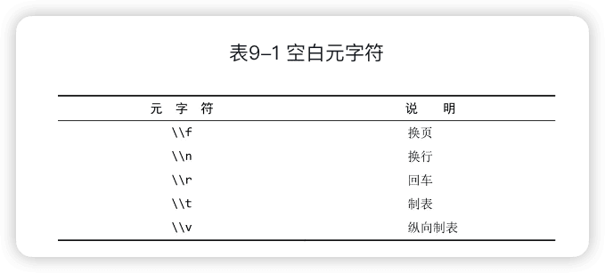


#### 匹配字符类

预先定义的常用的字符集合

| 类         | 意义                                 |
| ---------- | ------------------------------------ |
| [:alnum:]  | 任意字母和数字([a-zA-Z0-9])          |
| [:alpha:]  | [a-zA-Z]                             |
| [:blank:]  | 空格和制表                           |
| [:cntrl:]  | ASCII控制字符(ASCII值为0-31和127)    |
| [:digit:]  | [0-9]                                |
| [:print:]  | 任意可打印字符                       |
| [:graph:]  | 除去空格的[:print:]                  |
| [:lower:]  | [a-z]                                |
| [:upper:]  | [A-Z]                                |
| [:punct:]  | 既不在[:alnum:]有不在[:cntrl:]的字符 |
| [:space:]  | 任意空格符                           |
| [:xdigit:] | 任意十六进制数字([a-fA-F0-9])        |

例如：

```mysql
mysql> select prod_name from products where prod_name regexp '[:digit:]' ;
+----------------+
| prod_name      |
+----------------+
| .5 ton anvil   |
| 1 ton anvil    |
| 2 ton anvil    |
| JetPack 1000   |
| JetPack 2000   |
| TNT (1 stick)  |
| TNT (5 sticks) |
+----------------+
```

#### 匹配多个实例 

```mysql
mysql> select prod_name from products where prod_name regexp '\\([0-9] sticks?\\)' order by prod_name;
+----------------+
| prod_name      |
+----------------+
| TNT (1 stick)  |
| TNT (5 sticks) |
+----------------+
```

```mysql
mysql> select prod_name from products where prod_name regexp '[[:digit:]]{4}' order by prod_name;
+--------------+
| prod_name    |
+--------------+
| JetPack 1000 |
| JetPack 2000 |
+--------------+
```

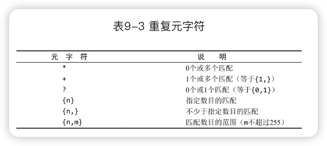

#### 定位符

`regexp '^[0-9\\.]'` 匹配以数字或者.开头的。

```mysql
mysql> select prod_name from products where prod_name regexp '^[0-9\\.]';
+--------------+
| prod_name    |
+--------------+
| .5 ton anvil |
| 1 ton anvil  |
| 2 ton anvil  |
+--------------+
```

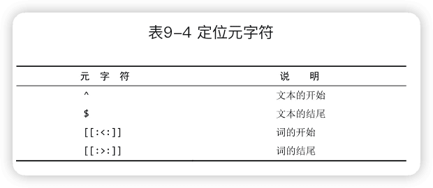

### 10 创建计算字段

字段的计算（总数，平均数等），拼接等操作，DBMS能够快速有效地完成。

#### 拼接字段

```mysql
mysql> Select Concat(RTrim(vend_name), '(', RTrim(vend_country), ')') AS vend_title From vendors order by vend_name;
+------------------------+
| vend_title             |
+------------------------+
| ACME(USA)              |
| Anvils R Us(USA)       |
| Furball Inc.(USA)      |
| Jet Set(England)       |
| Jouets Et Ours(France) |
| LT Supplies(USA)       |
+------------------------+
```


Concat()，RTrim()函数，别名

#### 算术计算

```mysql
mysql> select prod_id, quantity, item_price, quantity*item_price  AS expanded_price from orderitems where order_num = 20005;
+---------+----------+------------+----------------+
| prod_id | quantity | item_price | expanded_price |
+---------+----------+------------+----------------+
| ANV01   |       10 |       5.99 |          59.90 |
| ANV02   |        3 |       9.99 |          29.97 |
| TNT2    |        5 |      10.00 |          50.00 |
| FB      |        1 |      10.00 |          10.00 |
+---------+----------+------------+----------------+
```


测试计算（没有from的select语句） `select 3*2;` `select now();`

### 11 使用数据处理函数

**函数没有SQL的可移植性强**。

#### 文本处理函数 

```mysql
left()  right() length() locate()  lower()  upper()  ltrim() rtrim()  sounder()  substring()
```

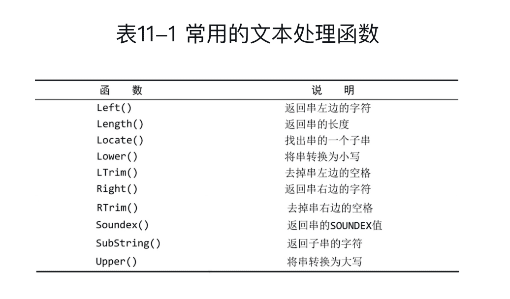

```mysql
mysql> select vend_name, Upper(vend_name) AS vend_name_upcase from vendors order by vend_name;
+----------------+------------------+
| vend_name      | vend_name_upcase |
+----------------+------------------+
| ACME           | ACME             |
| Anvils R Us    | ANVILS R US      |
| Furball Inc.   | FURBALL INC.     |
| Jet Set        | JET SET          |
| Jouets Et Ours | JOUETS ET OURS   |
| LT Supplies    | LT SUPPLIES      |
+----------------+------------------+
```

#### 日期和时间处理函数

 ```mysql
mysql> select cust_id, order_num from orders where Date(order_date) Between '2005-09-01' and '2005-09-30';
+---------+-----------+
| cust_id | order_num |
+---------+-----------+
|   10001 |     20005 |
|   10003 |     20006 |
|   10004 |     20007 |
+---------+-----------+
 ```

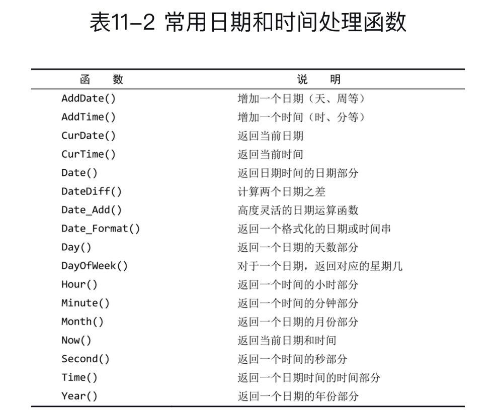

#### 数值处理函数

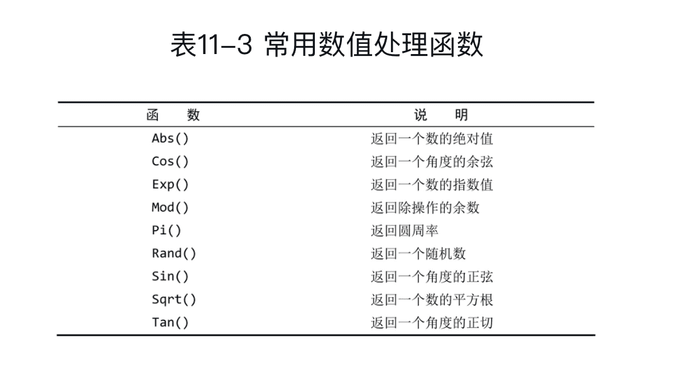

#### 系统函数

系统信息函数用来查询MySQL数据库的系统信息。

| 函数                                  | 说明                             |
| ------------------------------------- | -------------------------------- |
| VERSION()                             | 获取数据库的版本号。             |
| CONNECTION_ID()                       | 获取服务器的连接数。             |
| DATABASE()、SCHEMA()                  | 获取当前数据库名。               |
| USER()、SYSTEM_USER()、SESSION_USER() | 获取当前用户名。                 |
| CURRENT_USER()、CURRENT_USER          | 获取当前用户名。                 |
| CHARSET(str)                          | 获取字符串str的字符集。          |
| COLLATION(str)                        | 获取字符串str的字符排序方法。    |
| LAST_INSERT_ID()                      | 获取最近生成的AUTO_INCREMENT值。 |

#### 加密函数

| 函数                       | 说明                                                         |
| -------------------------- | ------------------------------------------------------------ |
| PASSWORD(str)              | 对字符串str进行加密。经此函数加密后的数据是不可逆的。其经常用于对普通数据进行加密。 |
| MD5(str)                   | 对字符串str进行MD5加密。经常用于对普通数据进行加密。         |
| ENCODE(str,pass_str)       | 使用字符串pass_str来加密字符串str。加密后的结果是一个二进制数，必须使用BLOB类型的字段来保存它。 |
| DECODE(crypt_str,pass_str) | 使用字符串pass_str来为crypt_str解密。                        |

#### 其他函数

MySQL中除了上述内置函数以外，还包含很多函数。例如，数字格式化函数FORMAT(x,n)，IP地址与数字的转换函数INET_ATON(ip)，还有加锁函数GET_LOCT(name,time)、解锁函数RELEASE_LOCK(name)等等。


### 12 汇总数据

#### 12.1 聚集函数

| 函数    | 说明                                           |
| ------- | ---------------------------------------------- |
| avg()   | 列名作为参数，忽略null行                       |
| count() | 列名或*作为参数，*作为参数时不忽略包含null的行 |
| max()   | 列名作为参数，忽略null行                       |
| min()   | 列名作为参数，忽略null行                       |
| sum()   | 列名作为参数，忽略null行                       |

所有聚集函数都可以用来执行多个列上的计算。

```mysql
mysql> select sum(item_price*quantity) as total from orderitems;
+---------+
| total   |
+---------+
| 1368.34 |
+---------+
```

Count()两种：

- 使用`COUNT(*)`对表中行的数目进行计数，不管表列中包含的是空值（NULL）还是非空值。
- 使用`COUNT(column)`对特定列中具有值的行进行计数，忽略NULL值。

在用于文本数据时，如果数据按相应的列排序，则MAX()返回最后一行，MIN()返回最前面的行。

#### 12.2 聚集不同值 

`DISTINCT`

```mysql
mysql> select avg(distinct prod_price) as avg_price  from products where vend_id = 1003;
+-----------+
| avg_price |
+-----------+
| 15.998000 |
+-----------+
```


distinct 不能用于count(*)，并且用于max()和min()没有多大意义。

#### 12.3 组合聚集函数

```mysql
mysql> select count(*) as num_items,
    -> min(prod_price) as price_min,
    -> max(prod_price) as price_max,
    -> avg(prod_price) as price_avg
    -> from products;
+-----------+-----------+-----------+-----------+
| num_items | price_min | price_max | price_avg |
+-----------+-----------+-----------+-----------+
|        14 |      2.50 |     55.00 | 16.133571 |
+-----------+-----------+-----------+-----------+
```


### 13 分组数据

#### group by

group by子句可以包含任意数目的列。

如果分组列中具有NULL值，则NULL将作为一个分组返回。

```mysql
mysql> select vend_id, count(*) as num_prods from products group by vend_id;
+---------+-----------+
| vend_id | num_prods |
+---------+-----------+
|    1001 |         3 |
|    1002 |         2 |
|    1003 |         7 |
|    1005 |         2 |
+---------+-----------+
```

```mysql
-- 使用WITH ROLLUP关键字，可以得到每个分组以及每个分组汇总级别（针对每个分组）的值，表示在进行分组统计的基础上再次进行汇总统计
mysql> select vend_id, count(*) as num_prods from products group by vend_id with rollup;
+---------+-----------+
| vend_id | num_prods |
+---------+-----------+
|    1001 |         3 |
|    1002 |         2 |
|    1003 |         7 |
|    1005 |         2 |
|    NULL |        14 |
+---------+-----------+
```


#### 过滤分组having

having类似where，where过滤行，having过滤分组

having支持所有where操作符

**where在数据分组前进行过滤，having在数据分组后进行过滤**

group by以后的数据顺序是不值得依赖的，如需排序，要通过order by

```mysql
mysql> select vend_id, count(*) as num_prods from products where prod_price >=10 group by vend_id having count(*) >=2;
+---------+-----------+
| vend_id | num_prods |
+---------+-----------+
|    1003 |         4 |
|    1005 |         2 |
+---------+-----------+
```

#### 分组和排序


#### select子句顺序

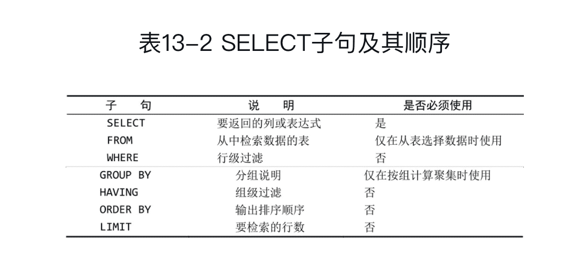


### 14 子查询

#### 使用子查询进行过滤

```mysql
Select cust_id 
From orders 
Where order_num IN (Select order_num 
                    From orderitems
                    Where prod_id = 'TNT2');
```


```mysql
select cust_name, cust_contact from customers
where cust_id in(select cust_id from orders
                 where order_num in(select order_num from orderitems
                                    where prod_id='TNT2'));
                                    
+----------------+--------------+
| cust_name      | cust_contact |
+----------------+--------------+
| Coyote Inc.    | Y Lee        |
| Yosemite Place | Y Sam        |
+----------------+--------------+
```

**子查询总是从内向外处理。**

在where子句中使用子查询，应该保证子句中select语句具有与where句中相同数目的列。（如上述代码中第二行中的cust_id和第三行的order_num）

#### 作为计算字段使用子查询

```mysql
Select cust_name,
	     cust_state,
       (Select count(*) From orders Where orders.cust_id = customers.cust_id) As order_num
From customers 
Order by cust_name;

+----------------+------------+-----------+
| cust_name      | cust_state | order_num |
+----------------+------------+-----------+
| Coyote Inc.    | MI         |         2 |
| E Fudd         | IL         |         1 |
| Mouse House    | OH         |         0 |
| Wascals        | IN         |         1 |
| Yosemite Place | AZ         |         1 |
+----------------+------------+-----------+
```

该子查询对检索出来的每个客户执行一次。上述子查询执行了五次。

**相关子查询**(correlated subquery):涉及外部查询的子查询。(orders.cust_id = customers.cust_id) 有点来消除歧义。

### 15 联结表

SQL最强大的功能之一就是能在数据检索查询的执行中**联结(join)**表。

#### 关系表

 相同数据**出现多次**决不是一件好事（关系数据库设计的基础）。关系表的设计就是要保证把信息分解成多个表，一类数据一个表。各表通过某些**常用的值（即关系）**互相关联。

**外键**(foreign key)为某个表中的一列，它包含另一个表的主键值，定义了两个表之间的关系。 

联结仅存在与查询的执行当中。

**可伸缩性**(scale)： 能够适应不断增加的工作量而不失败。关系数据库的可伸缩性远比非关系数据库要好。

**联结**仅存在与查询的执行当中，联结时利用SQL的select能执行的最重要的操作。

#### 创建联结

```mysql
Select vend_name, prod_name, prod_price
From vendors, products
Where vendors.vend_id=products.vend_id
Order by vend_name, prod_name;

+-------------+----------------+------------+
| vend_name   | prod_name      | prod_price |
+-------------+----------------+------------+
| ACME        | Bird seed      |      10.00 |
| ACME        | Carrots        |       2.50 |
| ACME        | Detonator      |      13.00 |
| ACME        | Safe           |      50.00 |
| ACME        | Sling          |       4.49 |
| ACME        | TNT (1 stick)  |       2.50 |
| ACME        | TNT (5 sticks) |      10.00 |
| Anvils R Us | .5 ton anvil   |       5.99 |
| Anvils R Us | 1 ton anvil    |       9.99 |
| Anvils R Us | 2 ton anvil    |      14.99 |
| Jet Set     | JetPack 1000   |      35.00 |
| Jet Set     | JetPack 2000   |      55.00 |
| LT Supplies | Fuses          |       3.42 |
| LT Supplies | Oil can        |       8.99 |
+-------------+----------------+------------+
```

##### WHERE子句的重要性

在联结两个表时，实际上是将第一个表中的每一行与第二个表中的每一行配对。**当没有where子句时就会产生笛卡尔积。**

**笛卡尔积**(cartesian product)：没有联结条件的表关系返回的结果为笛卡尔积。检索出的行的数目将是第一个表的行数乘以第二表的行数。

##### 内部联结/**等值联结**

上面的联结也叫**等值联结**(equijoin)或者**内部联结**，可用另外形式表示：(传递给ON的实际条件与where相同)

```mysql
select vend_name, prod_name,prod_price 
from vendors inner join products 
on vendors.vend_id = products.vend_ id；
```

##### **联结多个表**

```mysql
select cust_name, cust_contact
from customers, orders, orderitems
where customers.cust_id = orders.cust_id
and orderitems.order_num = orders.order_num
and prod_id = 'TNT2';
+----------------+--------------+
| cust_name      | cust_contact |
+----------------+--------------+
| Coyote Inc.    | Y Lee        |
| Yosemite Place | Y Sam        |
+----------------+--------------+
2 rows in set (0.00 sec)
```

> 此处的执行时间约为0.00sec，对比子联结的0.28sec，此处明显多表联结性能更好。

```mysql
select cust_name, cust_contact from customers
where cust_id in(select cust_id from orders
where order_num in(select order_num from orderitems
           where prod_id='TNT2'));
           
+----------------+--------------+
| cust_name      | cust_contact |
+----------------+--------------+
| Coyote Inc.    | Y Lee        |
| Yosemite Place | Y Sam        |
+----------------+--------------+
2 rows in set (0.28 sec)
```

> 性能可能会受操作类型、表中数据量、是否存在索引或键以及其他一些条件的影响。

### 16 高级联结

#### 表别名

表别名能用于where子句，select列表，order by子句以及语句的其他部分。 `as`

与列别名不一样，表别名<u>只在查询执行中使用</u>，不返回到客户机。

```mysql
Select cust_name, cust_contact
From customers AS c, orders AS o, orderitems AS oi
Where c.cust_id = o.cust_id
And oi.order_num = o.order_num
And prod_id = 'TNT2';
```

#### 自联结

自联结和同一张表中的子查询对比。（一般自联结性能好于子查询）

假如你发现某物品（其ID为DTNTR）存在问题，因此想知道生产该物品的供应商生产的其他物品是否也存在这些问题。

子查询
```mysql
SELECT prod_id, prod_name
FROM products
WHERE vend_id = (SELECT vend_id
                  FROM products
                  WHERE prod_id = 'DTNTR');

+---------+----------------+
| prod_id | prod_name      |
+---------+----------------+
| DTNTR   | Detonator      |
| FB      | Bird seed      |
| FC      | Carrots        |
| SAFE    | Safe           |
| SLING   | Sling          |
| TNT1    | TNT (1 stick)  |
| TNT2    | TNT (5 sticks) |
+---------+----------------+
```

自联结：

```mysql
SELECT p1.prod_id, p1.prod_name
FROM products AS p1, products AS p2
WHERE p1.vend_id = p2.vend_id
AND p2.prod_id = 'DTNTR';
+---------+----------------+
| prod_id | prod_name      |
+---------+----------------+
| DTNTR   | Detonator      |
| FB      | Bird seed      |
| FC      | Carrots        |
| SAFE    | Safe           |
| SLING   | Sling          |
| TNT1    | TNT (1 stick)  |
| TNT2    | TNT (5 sticks) |
+---------+----------------+
```

#### 自然联结

被联结的列：表联结时至少有一个列出现在不止一个表中。标准的联结（内部联结）返回所有数据，甚至相同的列多次出现。**自然联结排除多次出现，使每个列只返回一次。** 并且这个工作由开发者自己完成。

一般内部联结都是自然联结。

```mysql
select c.*, o.order_num, o.order_date,
       oi.prod_id, oi.quantity, oi.item_price
from customers as c, orders as o, orderitems as oi
where c.cust_id = o.cust_id
and oi.order_num = o.order_num
and prod_id = 'FB';
```

#### 外部联结

外部联结：联结包含了那些在相关表中没有关联行的行。

对比内部联结和外部联结。

内部联结（检索所有客户及其订单）：

```mysql
select customers.cust_id, orders.order_num 
from customers inner join orders 
on customers.cust_id=orders.cust_id;

+---------+-----------+
| cust_id | order_num |
+---------+-----------+
|   10001 |     20005 |
|   10001 |     20009 |
|   10003 |     20006 |
|   10004 |     20007 |
|   10005 |     20008 |
+---------+-----------+
```

外部联结（检索所有客户，包括那些没有订单的客户）：

```mysql
select customers.cust_id, orders.order_num 
from customers left outer join orders 
on customers.cust_id = orders.cust_id;

+---------+-----------+
| cust_id | order_num |
+---------+-----------+
|   10001 |     20005 |
|   10001 |     20009 |
|   10002 |      NULL |
|   10003 |     20006 |
|   10004 |     20007 |
|   10005 |     20008 |
+---------+-----------+
```

外部联结分为左外联结（ `LEFT OUTER JOIN`  简写为`Left Join`）和右外联结（ `RIGHT OUTER JOIN `简写为`Right Join`）。

#### 使用带聚集函数的联结

```mysql 
select customers.cust_name,  
customers.cust_id, 
count(orders.order_num) as num_ord 
from customers left outer join orders 
on customers.cust_id = orders.cust_id 
group by customers.cust_id;

+----------------+---------+---------+
| cust_name      | cust_id | num_ord |
+----------------+---------+---------+
| Coyote Inc.    |   10001 |       3 |
| Mouse House    |   10002 |       0 |
| Wascals        |   10003 |       1 |
| Yosemite Place |   10004 |       1 |
| 1232           |   10005 |       1 |
+----------------+---------+---------+
```


### 17 组合查询

> **并**(union)或**组合查询**(compund query)：执行多个查询（多条select语句），并将结果作为单个查询结果集返回。

```mysql
select vend_id, prod_id, prod_price  
from products 
where prod_price <= 5
UNION 
select vend_id, prod_id, prod_price 
from products 
where vend_id in(1001,1002) 
order by vend_id, prod_price;

+---------+---------+------------+
| vend_id | prod_id | prod_price |
+---------+---------+------------+
|    1001 | ANV01   |       5.99 |
|    1001 | ANV02   |       9.99 |
|    1001 | ANV03   |      14.99 |
|    1002 | FU1     |       3.42 |
|    1002 | OL1     |       8.99 |
|    1003 | TNT1    |       2.50 |
|    1003 | FC      |       2.50 |
|    1003 | SLING   |       4.49 |
+---------+---------+------------+
```

组合相同表查询和单个表中的多个where条件，工作是相同，但性能可能有差异。

UNION中的每个查询**必须包含相同的列、表达式或聚集函数**（不过各个列不需要以相同的次序列出）

UNION自动去除重复的行，UNOIN ALL则不。

组合查询中只能有一个order by子句对组合结果排序，不能对单个查询结果排序。

组合查询可以组合不同的表。

### 18 全文搜索

MYISAM支持全文搜索，InnoDB不支持。

全文搜索相对于通配符和正则表达式匹配的几个优势：

- 性能
- 明确控制
- 智能化结果

#### 使用全文本搜索

**为了进行全文本搜索，必须索引被搜索的列，而且要随着数据的改变不断地重新索引。** `FULLTEXT KEY note_text (note_text)`。

```mysql
Create Table: CREATE TABLE `productnotes` (
  `note_id` int(11) NOT NULL AUTO_INCREMENT,
  `prod_id` char(10) NOT NULL,
  `note_date` datetime NOT NULL,
  `note_text` text,
  PRIMARY KEY (`note_id`),
  FULLTEXT KEY `note_text` (`note_text`)
) ENGINE=MyISAM AUTO_INCREMENT=115 DEFAULT CHARSET=latin1
```

> 不要在导入数据是使用FULLTEXT ，最好首先导入所有数据，然后再修改表，定义FULLTEXT。

在索引之后，使用两个函数**Match()和Against()**执行全文本搜索，其中Match()指定被搜索的列，Against()指定要使用的搜索表达式。

```mysql
select note_text 
from productnotes 
where Match(note_text) Against('rabbit');
```

结果：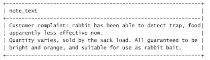

使用Like子句：

```sql
select note_text
from productnotes
WHERE note_text LIKE '%rabbit%';
```

结果：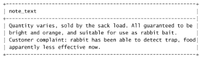

结果的排序不同，全文搜索的结果排序是确定，二Like子句就不一定了。

把`Match(note_text) Against('rabbit')`放在select中就知道全文搜索怎么排序的了

```sql
select note_text,
			Match(note_text) Against('rabbit') as `rank`
from productnotes;
```

结果：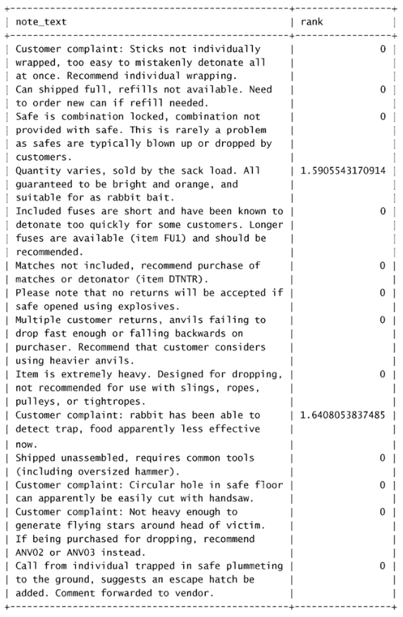

`rank`列是根据行中**词的数目、唯一词的数目、整个索引中词的总数以及包含该词的行的数目**计算出来。0就是不包含，越大表示匹配越高。

##### 使用查询扩展


##### 布尔文本搜索


### 19 插入数据

#### INSERT 插入完整的行

```sql
INSERT INTO customers(cust_name, cust_address, cust_city, cust_state, cust_zip, cust_country, cust_contact, cust_email) 
VALUES('Pep E. LaPew', '100 Main Street', 'Los Angeles', 'CA', '90046', 'USA', NULL, NULL);
```

`cust_id`作为自增字段可以给NULL或者省略。

**省略列**，该列允许为NULL值或者已有默认值。

**提高性能**，`INSERT LOW_PRIORITY INTO`，降低INSERT语句的优先级。

#### 插入多个行

```sql
INSERT INTO customers(cust_name, cust_address, cust_city, cust_state, cust_zip, cust_country, cust_contact, cust_email) 
VALUES('Pep E. LaPew', '100 Main Street', 'Los Angeles', 'CA', '90046', 'USA', NULL, NULL),
('Bill Gates', '1 Main Street', 'Los Angeles', 'CA', '90046', 'USA', NULL, NULL);
```


#### 插入检索出的数据

**INSERT SELECT**。不一个表的查询结果导入另一表中。

```mysql
INSERT INTO customers (cust_id, cust_contact, cust_email, cust_name, cust_address, cust_city, cust_state, cust_zip, cust_country) 
SELECT cust_id, cust_contact, cust_email, cust_name, cust_address, cust_city, cust_state, cust_zip, cust_country
FROM custnew;
```

如果不能确保两个表中的cust_id不重复，可以省略cust_id，让MySQL自动递增。

不一定要求两个表的列名匹配。事实上，MySQL甚至不关心SELECT返回的列名，只关心位置。


### 20 更新和删除数据

#### 更新数据

**UPDATE DELETE不要忘记过滤条件where。**

Update语句3部分：要更新的表；列名和它们的新值；过滤条件。

```mysql
Update customers
Set cust_email = 'xxxx@fudd.com',
		cust_name = 'The Fudds'
Where cust_id = 10005;
```

> **IGNORE关键字** 
>
> 如果用UPDATE语句更新多行，并且在更新这些行中的一行或多行时出现一个错误，则整个UPDATE操作被取消（错误发生前更新的所有行被恢复到它们原来的值）。
>
> 即使是发生错误，也继续进行更新，可使用IGNORE关键字：
>
> UPDATE IGNORE customers...


错误发生前更新的所有行被恢复到它们原来的值，IGNORE？？

```sql
UPDATE IGNORE customers
SET cust_name = 'The Fudds',
cust_email = elmer@fudd.com
WHERE cust_id = 10005;
```

#### 删除数据

DELETE 只删除行，不能删除表本身

```sql
DELETE FROM customers
WHERE cust_id = 10006;
```

```mysql
Truncate tablename;

更快的删除表中所有行（删除表后重新建）。
```

#### 指导原则

- 除非确实打算更新和删除每一行，否则绝对不要使用不带WHERE子句的UPDATE或DELETE语句。
- 保证每个表都有主键，尽可能像WHERE子句那样使用它（可以指定各主键、多个值或值的范围）。
- 在对UPDATE或DELETE语句使用WHERE子句前，应该先用SELECT进行测试，保证它过滤的是正确的记录，以防编写的WHERE子句不正确。
- 在对UPDATE或DELETE语句使用WHERE子句前，应该先用SELECT进行测试，保证它过滤的是正确的记录，以防编写的WHERE子句不正确。
-  使用强制实施引用完整性的数据库（关于这个内容，请参阅第15章），这样MySQL将不允许删除具有与其他表相关联的数据的行。

- **MySQL没有撤销（undo）按钮。应该非常小心地使用UPDATE和DELETE，否则你会发现自己更新或删除了错误的数据。**


### 21 创建和操纵表

#### 创建表

```mysql
CREATE TABLE productnotes (
  note_id int NOT NULL AUTO_INCREMENT,
  prod_id char(10) NOT NULL,
  note_date datetime NOT NULL,
  note_text text NULL ,
  PRIMARY KEY(note_id),
  FULLTEXT(note_text)
) ENGINE=MyISAM;
```

`IF NOT EXISTS`

NULL值是没有值，它不是空串。

每个表只允许一个AUTO_INCREMENT列，而且它必须被索引（通常就是主键）。


获得AUTO_INCREMENT时的值 `select last_insert_id()`。 ??


**指定默认值**： `quantity int NOT NULL DEFAULT 1 ,` ,默认值必须是常数不能是函数

**引擎类型** 

InnoDB 支持事务，不支持全文本搜索；

MyISAM与之相反；

每个MyISAM表在磁盘生产三个文件：

tablename.frm --.frm文件是用来保存每个数据表的元数据(meta)信息，包括表结构的定义等，frm文件跟数据库存储引擎无关，也就是任何存储引擎的数据表都必须有.frm文件..frm文件可以用来在数据库崩溃时恢复表结构。

数据文件的扩展名为·MYD (MYData)

索引文件的扩展名是.MYI (MYIndex)

MEMORY功能等价于MyISAM，但数据存储在内存中（适合临时表）；

**外键不能跨引擎**


#### 更新表

```sql
ALTER TABLE vendors ADD vend_phone CHAR(20); [增加列]

ALTER TABLE vendors DROP vend_phone CHAR(20); [删除列]
```

ALTER TABLE 可以用来定义外键:

```mysql
ALTER TABLE orderitems
ADD CONSTRAINT `fk_orderitems_orders` 
FOREIGN KEY (`order_num`) REFERENCES `orders` (`order_num`);

ALTER TABLE orderitems
ADD CONSTRAINT `fk_orderitems_products` 
FOREIGN KEY (`prod_id`) REFERENCES `products` (`prod_id`);

ALTER TABLE orders
ADD CONSTRAINT `fk_orders_customers` 
FOREIGN KEY (`cust_id`) REFERENCES `customers` (`cust_id`);


ALTER TABLE products
ADD CONSTRAINT `fk_products_vendors` FOREIGN KEY (`vend_id`) REFERENCES `vendors` (`vend_id`);
```

复杂的表结构更改一般需要手动删除过程，它涉及以下步骤：

- 用新的列布局创建一个新表；
- 使用INSERT SELECT语句从旧表复制数据到新表。如果有必要，可使用转换函数和计算字段；
- 检验包含所需数据的新表； 
- 重命名旧表（如果确定，可以删除它）；
- 用旧表原来的名字重命名新表；
- 根据需要，重新创建触发器、存储过程、索引和外键。

表的修改需要谨慎，事前需要完整备份。

#### 删除表

```mysql
DROP TABLE customers2;
```

#### 重命名表

```mysql
RENAME　TABLE customers2 TO customers;
```


### 22 视图是虚拟的表

#### 2.1 视图

**视图是虚拟的表。与包含数据的表不一样，视图只包含使用时动态检索数据的查询。**

之前用来检索订购了某个特定产品的客户的SQL：

```mysql
Select cust_name, cust_contact
From customers, orders, orderitems
Where customers.cust_id = order.cust_id
	And orderitems.order_num = orders.order_num
	And pro_id = 'TNT2';
```

如果有个类似`productcustomers`的虚拟表，那么上面的检索就可以简化为：

```mysql
Select cust_name, cust_contact 
From productcustomers
Where prod_id = 'TNT2';
```


#####  为什么使用视图？

- 重用SQL语句。
- 简化复杂的SQL操作。在编写查询后，可以方便地重用它而不必知道它的基本查询细节。
- 使用表的组成部分而不是整个表。
- 保护数据。可以给用户授予表的特定部分的访问权限而不是整个表的访问权限。
- 更改数据格式和表示。视图可返回与底层表的表示和格式不同的数据。

> 注：在部署使用了大量视图的应用前，应该进行测试。

##### 视图的规则和限制

- 唯一命名
- 数目没有限制
- 必须具有足够的访问权限
- 可以嵌套，即可以利用从其他视图中检索数据的查询来构造一个视图
- 视图中的`ORDER BY`会被外面的覆盖
- 视图中的`Where`会外面的自动组合
- 视图不能索引，也不能有关联的触发器或默认值
- 视图可以和表一起使用

#### 22.2 使用视图

```mysql
-- 创建视图
CREATE VIEW    ;

-- 查看视图的语句
SHOW CREATE VIEW viewname;

-- 删除视图
DROP VIEW viewname;

-- 查看所有视图
show table status where comment='view';
```

##### 利用视图简化复杂的联结

```mysql
CREATE VIEW productcustomers AS 
SELECT cust_name, cust_contact, prod_id 
FROM customers, orders, orderitems 
WHERE customers.cust_id = orders.cust_id 
	AND orderitems.order_num = orders.order_num;
```

##### 用视图重新格式化检索出的数据 

```mysql
CREATE VIEW vendorlocations AS
SELECT Concat(RTrim(vend_name), '(', RTrim(vend_country), ')') 
	AS vend_title
FROM vendors
ORDER BY vend_name;
```

如果经常需要这种组合格式结果，就可使把它做成视图，之后的检索是就可简化为：

```mysql
Select *
From vendorlocations;
```

##### 用视图过滤不想要的数据

```mysql
CREATE VIEW customeremaillist AS
SELECT cust_id, cust_name, cust_email
FROM customers
WHERE cust_email IS NOT NULL;
```

##### 使用视图与计算字段 

```mysql
SELECT 
		order_num,
		prod_id,
		quantity,
		item_price,
		quantity * item_price AS expanded_price 
FROM orderitems;
Where order_num = 20005;
```

转化为：

```mysql
CREATE VIEW orderitemsexpanded AS 
SELECT 
		order_num,
		prod_id,
		quantity,
		item_price,
		quantity * item_price AS expanded_price 
FROM orderitems;

Select * 
From orderitemsexpanded
Where order_num = 20005;
```

##### 更新视图

一般视图主要用于检索（select），不用于更新（insert，update，delete），更新一个视图将更新其基表数据（视图没有数据）。

视图更新有很多限制，有下面操作不能进行视图更新：

> 分组（使用GROUP BY和HAVING）；
>
> 联结；
>
> 子查询；
>
> 并；
>
> 聚集函数（Min()、Count()、Sum()等）
>
> DISTINCT；
>
> 导出（计算）列


### 23 存储过程

经常会有一个完整的操作需要多条语句才能完成。
存储过程简单来说，就是**为以后的使用而保存的一条或多条MySQL语句的集合**。

#### 为什么要使用存储过程

优点：

- 封装，简化复杂的操作。

- 保证数据的完整性。

- 简化对变动的管理，如果表名、列名或业务逻辑（或别的内容）有变化，只需要更改存储过程的代码。

  通过存储过程**限制对基础数据的访问**减少了数据讹误（无意识的或别的原因所导致的数据讹误）的机会。

- 提高性能。

总的来说就是简单、安全、高性能。

缺点：

- 编写比基本SQL语句复杂。
- 你可能没有创建存储过程的安全访问权限。

#### 使用存储过程

##### 执行存储过程

存储过程的执行称为**调用（CALL）**。
```mysql
CALL productpricing(@pricelow,
 										@pricehigh,
 										@priceaverge);
```
执行名为`productpricing`的存储过程，它计算并返回产品的最低、最高和平均价格。

##### 创建存储过程

创建是不会返回数据，调用存储过程才会返回数据。

```mysql
CREATE PROCEDURE productpricing()
BEGIN
	SELECT Avg(prod_price) AS priceaverage
	FROM products;
END;
```

如果使用MySQL命令行工具时，MySQL语句和MySQL命令行工具都使用`;`作为分隔符，可以使用`DELIMITER`（delimiter，定界符）临时更改命令行实用程序的语句分隔符：

```mysql
DELIMITER //

CREATE PROCEDURE productpricing()
BEGIN
	SELECT Avg(prod_price) AS priceaverage
	FROM products;
END //

DELIMITER ;
```

除`\`符号外，任何字符都可以用作语句分隔符。

调用存储过程： 

```mysql
mysql> call productpricing();
+--------------+
| priceaverage |
+--------------+
|    16.133571 |
+--------------+
```


##### 删除存储过程

注意没有括号 。
```mysql
DROP PROCEDURE productpricing;
```

不存在存储过程，删除时会报错，可加上`IF Exists`：

```mysql
DROP PROCEDURE IF Exists productpricing;
```

##### 使用参数 

productpricing只是简单地显示SELECT语句的结果。

一般，存储过程并不显示结果，而是把结果返回给指定的变量。

```mysql
DELIMITER //

CREATE PROCEDURE productpricing ( 
	OUT pl DECIMAL(8, 2), 
	OUT ph DECIMAL(8, 2), 
	OUT pa DECIMAL(8, 2) 
) 
BEGIN
	SELECT min(prod_price) INTO pl 
	FROM products;
	SELECT max(prod_price) INTO ph 
	FROM products;
	SELECT avg(prod_price) INTO pa 
	FROM products;
END //

DELIMITER ;
```

3个参数：pl存储产品最低价格，ph存储产品最高价格，pa存储产品平均价格。

`OUT` ：从存储过程传出给调用者

`IN` ：传递给存储过程

`INOUT` : 对存储过程传入和传出

一系列SELECT语句，用来检索值，然后保存到相应的变量（通过指定`INTO`关键字）。

调用此存储过程：（必须制定3个变量名，**mysql变量以@开头**）

```mysql
CAll productpricing(@pricelow, @pricehigh, @priceaverage);
```

这样，存储过程的结果就保存到三个参数中，可以通过SELECT语句查询。

```mysql
mysql> SELECT @pricelow, @pricehigh, @priceaverage;
+-----------+------------+---------------+
| @pricelow | @pricehigh | @priceaverage |
+-----------+------------+---------------+
|      2.50 |      55.00 |         16.13 |
+-----------+------------+---------------+
```

另一个例子，ordertotal接受订单号并返回该订单的合计：

```mysql
DELIMITER //
CREATE PROCEDURE ordertotal ( 
	IN onumber INT, 
	OUT ototal DECIMAL(8, 2) 
) 
BEGIN
	SELECT sum( item_price * quantity ) 
	FROM orderitems 
	WHERE order_num = onumber 
	INTO ototal;
END //
DELIMITER ;
```

调用 :

```mysql
CALL ordertotal(20005, @total);
SELECT @total;

+--------+
| @total |
+--------+
| 149.87 |
+--------+
```


##### 建立智能存储过程 

场景：需要获得与以前一样的订单合计，但需要对合计增加营业税，不过只针对某些顾客（或许是你所在州中那些顾客）。分步：

- 获得合计（与以前一样）；
- 把营业税有条件地添加到合计；
- 返回合计（带或不带税）。

```mysql
-- Name: ordertotal
-- Parameters: onumber = oreder number
--    texable = 是否增加营业税
--    ototal = order total varible
CREATE PROCEDURE ordertotal ( 
	IN onumber INT, 
	IN taxable boolean, 
	OUT ototal DECIMAL ( 8, 2 ) 
) COMMENT 'Obtain order total, optionally adding tax' 
BEGIN
	-- declare variable for total
	DECLARE total DECIMAL ( 8, 2 );
	-- 定义变量税率
	DECLARE taxrate INT DEFAULT 6;
	
	-- get the order total
	SELECT sum( item_price * quantity ) 
	FROM orderitems 
	WHERE order_num = onumber INTO total;
	
	-- Is this taxable?
	IF taxable THEN
		-- yes, so add taxrate to the total
		SELECT total + (total / 100 * taxrate ) INTO total;
	END IF;
	
	-- and finally,save to out variable
	SELECT total INTO ototal;
END;
```

```mysql
call ordertotal(20005, 0, @total);
select @total;
```

##### 检查存储过程

查看所有数据库里所有存储过程以及每个存储过程的创建者、创建时间等信息：

```mysql
SHOW PROCEDURE STATUS;

-- 过滤
SHOW PROCEDURE STATUS LIKE 'ordertotal'; 
```

显示用来创建一个存储过程的CREATE语句等信息：

```mysql
 SHOW CREATE PROCEDURE ordertotal;
```


### 24 游标 

游标（cursor）是一个存储在MySQL服务器上的数据库查询，它不是一条SELECT语句，而是被该语句检索出来的结果集。

主要应用交互式应用。mysql游标只能用于**存储过程（和函数）**。


#### 使用游标

使用 声明 -> 打开 -> 使用 -> 关闭。

##### 创建

```mysql
CREATE PROCEDURE processorders()
BEGIN
	DECLARE ordernumbers CURSOR
	FOR
	SELCET order_num FROM order;
END;
```

##### 打开和关闭

```mysql
OPEN ordernumbers; 

CLOSE ordernumbers;
```

#### 使用游标数据

```mysql
CREATE PROCEDURE processorders()
BEGIN
  -- Declare local variables
  DECLARE o int;
  -- Declare the curor
  DECLARE ordernumbers CURSOR
  FOR
  SELECT order_num FROM orders;
  -- Open the curor
  OPEN ordernumbers;
  -- Get order number
  FETCH ordernumbers INTO o;
  -- Close the cursor
  CLOSE ordernumbers;
END;
```


```mysql
CREATE PROCEDURE processorders()
  BEGIN
  -- Declare local variables
  DECLARE done boolean default 0;
  DECLARE o int;
  -- Declare the cursor
  DECLARE ordernumbers CURSOR
  FOR
  SELECT order_num FROM orders;
  -- Declare continue handler
  DECLARE CONTINUE HANDLER FOR SQLSTATE　'0200' SET done=1;
  -- Open the cursor
  OPEN ordernumbers;
  -- Loop through all rows
  REPEAT
  -- Get order number
  FETCH ordernumbers INTO　o;
  -- End of loop
  UNTIL done END REPEAT;
  -- Close the cursor
  CLOSE ordernumbers;
END;
```

  *   CONTUE HANDLER ?
  *   SQLSTATE '02000' [mysql错误代码][1]
  *   DECLARE语句的次序 ? \``\`sql --对数据进行实际处理 


```mysql
CREATE PROCEDURE processorders() 
begin 

  declare done boolean default 0; 
  declare o int; 
  declare t decimal(8,2); 

  declare ordernumbers cursor 
  for 
  select order_num from orders; 

  declare continue handler for sqlstate '02000' set done=1; 

  create table if not exists ordertotals (order_num int, total decimal(8,2)); 

  open ordernumbers;

  -- Loop through all rows 
  repeat 

  fetch ordernumbers into o; 

  call ordertotal(o, 1, t); 

  insert into ordertotals(order_num, total) values(o, t); 

  until done end repeat; 

  close ordernumbers; 

end; 
```

调用这个存储过程就会建立一张表

### 25 触发器

触发器是mysql响应delete，insert，update语句而自动执行的一条或一组(begin和end之间)语句。

#### 创建触发器

在创建触发器时，需要4条信息：唯一的触发器名；触发器关联的表；触发器应该响应的活动（DELETE、INSERT或UPDATE）；触发器何时执行（处理之前或之后）。

```mysql
Create TRIGGER newproduct AFTER insert on products 
FOR EACH ROW select 'Product added'; 
```

每张表最多只能有6个触发器。

#### 删除触发器

```mysql
drop trigger newproduct;

 
```

#### 使用触发器

##### INSERT触发器

```mysql
Create Trigger neworder After Insert On orders 
For Each Row Select new.order_num;

Insert Into orders(order_date, cust_id)
Values(Now(), 10001);
```

##### DELETE触发器

在DELETE触发器代码内，你可以引用一个名为`OLD`的虚拟表，访问被删除的行。

```mysql
Create Trigger deleteorder Before Delete On orders
FOr Each Row
Begin
	Insert Into archive_orders(order_num, order_date, cust_id)
	Values(OLD.order_num, OLD.order_date, OLD.cust_id);
End;
```

##### UPDATE触发器

```mysql
Create Trigger updatevendor Before Update On Vendors
For Each Row Set NEW.vend_state = Upper(NEW.vend_state);
```

### 26 事务

#### 26.1 事务处理

事务处理（transaction processing）可以用来维护数据库的完整性，它保证成批的MySQL操作要么完全执行，要么完全不执行。

设计良好的数据库模式都是关联的。 事务处理要来保证数据库不包含不完整的操作结果。 

给系统添加订单的过程如下：

(1) 检查数据库中是否存在相应的客户，如果不存在，添加他/她。

(2) 提交客户信息。

(3) 检索客户的ID。

(4) 添加一行到orders表。

(5) 如果在添加行到orders表时出现故障，回退。

(6) 检索orders表中赋予的新订单ID。

(7) 对于订购的每项物品，添加新行到orderitems表。

(8) 如果在添加新行到orderitems时出现故障，回退所有添加的orderitems行和orders行。

(9) 提交订单信息。

几个术语：

*   **事务**(transaction)：一组SQL语句
*   **回退**(rollback)：撤销指定SQL语句的过程
*   **提交**(commit)：将未存储的SQL语句结果写入数据库表
*   **保留点**(savepoint)：事务处理中设置的临时占位符（place-holder），你可以对它发布回退（与回退整个事务处理不同）

#### 26.2 控制事务处理

 管理事务处理的关键在于**将SQL语句组分解为逻辑块**，并明确规定数据何时应该回退，何时不应该回退。

MySQL中标识事务的开始的语句：

```mysql
Start Transaction;
```

##### 使用ROLLBACK

```mysql 
Select * from ordertotals; 
START TRANSACTION; 
delete from ordertotals; 
select * from ordertotals; 
ROLLBACK;
select * from ordertotals;
```

事务处理用来管理insert,update,delete.不能回退create，drop，select。

##### 使用COMMIT

```mysql
Start Transaction;
Delete From orderitems Where order_num = 20010;
Delete From orders Where order_num = 20010;
Commit;
```

##### 使用保留点

```mysql
SavePoint delete1;

Rollback To delete1;
```


### 27 全球化和本地化

#### 27.1 字符集和校对顺序

**字符集**：字母和符号的集合 

**编码**：某个字符集成员的内部表示 

**校对**：规定字符如何比较的指令（在order by，group by ，having等数据排序起作用） 

#### 27.2 使用字符集和校对顺序

```mysql
-- 查看字符集完整列表 
show character set;

-- 查看校对 
show collation; 

-- 查看目前所用字符集和校对 
show variables like 'character%'; 
show variables like 'collation%';

-- 给表指定字符集和校对

create table mytable 
( 
  columnn1 int, 
  columnn2 varchar(10) 
)default character set hebrew
 collate hebrew_general_ci;
```

也可指定特定列

指定特定的校对用于排序（下面是为了区分大小写） 

```mysql
select * from customers order by lastname, firstname collate latin1_general_cs;
```


### 28 安全管理

#### 28.1 访问控制

仅在绝对需要时使用root用户。

#### 28.2 管理用户

```mysql
-- 获得所有用户(尽量不要直接操作mysql表)
Use mysql;
Select user From user;

-- 创建用户账号
Create User andy Identified By '123456';

-- 重命名用户账号
Rename User andy To andyron;

-- 删除用户账号
Drop User andyron;
```

```mysql
-- 查看用户账号的权限
mysql> Show Grants For andy;
+----------------------------------+
| Grants for andy@%                |
+----------------------------------+
| GRANT USAGE ON *.* TO `andy`@`%` |
+----------------------------------+
```

##### 设置访问权限

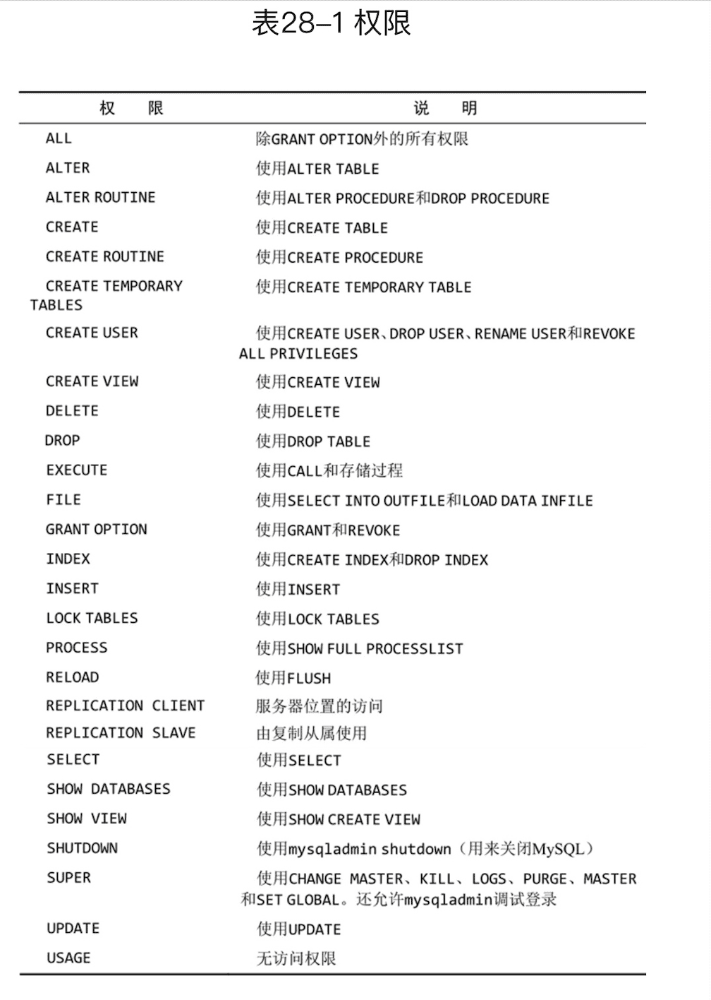

##### 更改口令

```mysql
Set Password
```


### 29 数据库维护

#### 备份数据

(由于mysql数据文件正常都是出于打开和使用状态，不能简单的复制需要使用特定工具) 

*   mysqldump
*   mysqlhotcopy
*   BACKUP TABLE SELECT INTO OUTFILE

#### 数据库维护 

```mysql
ANALYZE TABLE orders;

CHECK TABLE　orders, orderitems;

OPTIMIZE TABLE
```


#### 诊断启动问题


#### 查看日志文件 

日志通常位于data目录。

- 错误日志  `hostname.err`

- 查询日志  `hostname.log`

- 二进制日志  `hostname-bin`

- 缓存查询日志  `hostname-slow.log`

```mysql
-- 查看日志开启情况
mysql> show variables like 'log_%';
+----------------------------------------+----------------------------------------+
| Variable_name                          | Value                                  |
+----------------------------------------+----------------------------------------+
| log_bin                                | ON                                     |
| log_bin_basename                       | /usr/local/mysql/data/binlog           |
| log_bin_index                          | /usr/local/mysql/data/binlog.index     |
| log_bin_trust_function_creators        | OFF                                    |
| log_bin_use_v1_row_events              | OFF                                    |
| log_error                              | /usr/local/mysql/data/mysqld.local.err |
| log_error_services                     | log_filter_internal; log_sink_internal |
| log_error_verbosity                    | 2                                      |
| log_output                             | FILE                                   |
| log_queries_not_using_indexes          | OFF                                    |
| log_slave_updates                      | ON                                     |
| log_slow_admin_statements              | OFF                                    |
| log_slow_slave_statements              | OFF                                    |
| log_statements_unsafe_for_binlog       | ON                                     |
| log_syslog                             | ON                                     |
| log_syslog_facility                    | daemon                                 |
| log_syslog_include_pid                 | ON                                     |
| log_syslog_tag                         |                                        |
| log_throttle_queries_not_using_indexes | 0                                      |
| log_timestamps                         | UTC                                    |
+----------------------------------------+----------------------------------------+
```


### 30 改善性能

https://dev.mysql.com/doc/mysql/en/error-handling.html

```mysql
> show processlist；
+----+-----------------+-----------+------+---------+--------+------------------------+------------------+
| Id | User            | Host      | db   | Command | Time   | State                  | Info             |
+----+-----------------+-----------+------+---------+--------+------------------------+------------------+
|  5 | event_scheduler | localhost | NULL | Daemon  | 192185 | Waiting on empty queue | NULL             |
|  9 | root            | localhost | NULL | Query   |      0 | init                   | show processlist |
+----+-----------------+-----------+------+---------+--------+------------------------+------------------+
2 rows in set (0.01 sec)
```


### 附录 MySQL数据类型

大致可以分为三类：数值、日期/时间和字符串(字符)类型。

#### 1.数值类型

整型（TINYINT、SMALLINT、MEDIUMINT、INT、BIGINT）和浮点型（FLOAT、DOUBLE、DECIMAL）。

| 类型         | 大小                                     | 范围（有符号）                                               | 范围（无符号）                                               | 用途            |
| :----------- | :--------------------------------------- | :----------------------------------------------------------- | :----------------------------------------------------------- | :-------------- |
| TINYINT      | 1 Bytes                                  | (-128，127)                                                  | (0，255)                                                     | 小整数值        |
| SMALLINT     | 2 Bytes                                  | (-32 768，32 767)                                            | (0，65 535)                                                  | 大整数值        |
| MEDIUMINT    | 3 Bytes                                  | (-8 388 608，8 388 607)                                      | (0，16 777 215)                                              | 大整数值        |
| INT或INTEGER | 4 Bytes                                  | (-2 147 483 648，2 147 483 647)                              | (0，4 294 967 295)                                           | 大整数值        |
| BIGINT       | 8 Bytes                                  | (-9,223,372,036,854,775,808，9 223 372 036 854 775 807)      | (0，18 446 744 073 709 551 615)                              | 极大整数值      |
| FLOAT        | 4 Bytes                                  | (-3.402 823 466 E+38，-1.175 494 351 E-38)，0，(1.175 494 351 E-38，3.402 823 466 351 E+38) | 0，(1.175 494 351 E-38，3.402 823 466 E+38)                  | 单精度 浮点数值 |
| DOUBLE       | 8 Bytes                                  | (-1.797 693 134 862 315 7 E+308，-2.225 073 858 507 201 4 E-308)，0，(2.225 073 858 507 201 4 E-308，1.797 693 134 862 315 7 E+308) | 0，(2.225 073 858 507 201 4 E-308，1.797 693 134 862 315 7 E+308) | 双精度 浮点数值 |
| DECIMAL      | 对DECIMAL(M,D) ，如果M>D，为M+2否则为D+2 | 依赖于M和D的值                                               | 依赖于M和D的值                                               | 小数值          |

 MySQL中没有专门存储货币的数据类型，一般情况下使用DECIMAL(8, 2)。


#### 2.字符串类型

字符串类型指CHAR、VARCHAR、BINARY、VARBINARY、BLOB、TEXT、ENUM和SET。

| 类型       | 大小                  | 用途                            |
| :--------- | :-------------------- | :------------------------------ |
| CHAR       | 0-255 bytes           | 定长字符串                      |
| VARCHAR    | 0-65535 bytes         | 变长字符串                      |
| TINYBLOB   | 0-255 bytes           | 不超过 255 个字符的二进制字符串 |
| TINYTEXT   | 0-255 bytes           | 短文本字符串                    |
| BLOB       | 0-65 535 bytes        | 二进制形式的长文本数据          |
| TEXT       | 0-65 535 bytes        | 长文本数据                      |
| MEDIUMBLOB | 0-16 777 215 bytes    | 二进制形式的中等长度文本数据    |
| MEDIUMTEXT | 0-16 777 215 bytes    | 中等长度文本数据                |
| LONGBLOB   | 0-4 294 967 295 bytes | 二进制形式的极大文本数据        |
| LONGTEXT   | 0-4 294 967 295 bytes | 极大文本数据                    |
| Enum       |                       |                                 |
| Set        |                       |                                 |

- char(n) 和 varchar(n) 中括号中 n 代表字符的个数，并不代表字节个数，比如 CHAR(30) 就可以存储 30 个字符。

- MySQL固定长度字符串比变长快得多。
- 不管使用何种形式的字符串数据类型，串值都必须括在引号内（通常单引号更好）。

#### 3.日期和时间类型

DATETIME、DATE、TIMESTAMP、TIME和YEAR

| 类型      | 大小 ( bytes) | 范围                                                         | 格式                | 用途                     |
| :-------- | :------------ | :----------------------------------------------------------- | :------------------ | :----------------------- |
| DATE      | 3             | 1000-01-01/9999-12-31                                        | YYYY-MM-DD          | 日期值                   |
| TIME      | 3             | '-838:59:59'/'838:59:59'                                     | HH:MM:SS            | 时间值或持续时间         |
| YEAR      | 1             | 1901/2155                                                    | YYYY                | 年份值                   |
| DATETIME  | 8             | 1000-01-01 00:00:00/9999-12-31 23:59:59                      | YYYY-MM-DD HH:MM:SS | 混合日期和时间值         |
| TIMESTAMP | 4             | 1970-01-01 00:00:00/2038结束时间是第 **2147483647** 秒，北京时间 **2038-1-19 11:14:07**，格林尼治时间 2038年1月19日 凌晨 03:14:07 | YYYYMMDD HHMMSS     | 混合日期和时间值，时间戳 |

每个时间类型有一个有效值范围和一个"零"值，当指定不合法的MySQL不能表示的值时使用"零"值。

## 补充

### MySQL索引

实际上，索引也是一张表，该表保存了主键与索引字段，并指向实体表的记录。

```mysql
-- 显示索引信息
SHOW INDEX FROM table_name\G

mysql> show index from orderitems\G;
*************************** 1. row ***************************
        Table: orderitems
   Non_unique: 0
     Key_name: PRIMARY
 Seq_in_index: 1
  Column_name: order_num
    Collation: A
  Cardinality: 5
     Sub_part: NULL
       Packed: NULL
         Null:
   Index_type: BTREE
      Comment:
Index_comment:
      Visible: YES
   Expression: NULL
*************************** 2. row ***************************
        Table: orderitems
   Non_unique: 0
     Key_name: PRIMARY
 Seq_in_index: 2
  Column_name: order_item
    Collation: A
  Cardinality: 11
     Sub_part: NULL
       Packed: NULL
         Null:
   Index_type: BTREE
      Comment:
Index_comment:
      Visible: YES
   Expression: NULL
*************************** 3. row ***************************
        Table: orderitems
   Non_unique: 1
     Key_name: fk_orderitems_products
 Seq_in_index: 1
  Column_name: prod_id
    Collation: A
  Cardinality: 9
     Sub_part: NULL
       Packed: NULL
         Null:
   Index_type: BTREE
      Comment:
Index_comment:
      Visible: YES
   Expression: NULL
```


#### 从数据结构角度分类

1、B+树索引

2、hash索引

3、FULLTEXT索引（现在MyISAM和InnoDB引擎都支持了）

4、R-Tree索引（用于对GIS数据类型创建SPATIAL索引）

#### 从物理存储角度分类

1、聚集索引（clustered index）

2、非聚集索引（non-clustered index）

#### 从逻辑角度分类

##### 1.普通索引

不同的创建方式

```mysql
-- 直接创建
CREATE INDEX index_name ON table(column(length))

-- 修改表结构的方式添加
ALTER TABLE table_name ADD INDEX index_name ON (column(length))

-- 创建表的时候同时创建
CREATE TABLE `table` (
    `id` int(11) NOT NULL AUTO_INCREMENT ,
    `title` char(255) CHARACTER NOT NULL ,
    `content` text CHARACTER NULL ,
    `time` int(10) NULL DEFAULT NULL ,
    PRIMARY KEY (`id`),
    INDEX index_name (title(length))
)

-- 删除索引
DROP INDEX index_name ON table
```

##### 2.唯一索引

与普通索引类似不同的是：必须唯一，但允许有空值。

```mysql
CREATE UNIQUE INDEX indexName ON table(column(length))

ALTER TABLE table_name ADD UNIQUE indexName ON (column(length))

CREATE TABLE `table` (
    `id` int(11) NOT NULL AUTO_INCREMENT ,
    `title` char(255) CHARACTER NOT NULL ,
    `content` text CHARACTER NULL ,
    `time` int(10) NULL DEFAULT NULL ,
    UNIQUE indexName (title(length))
);
```

##### 3.主键索引

一种特殊的唯一索引，不允许有空值，一个表只能有一个主键索引。

```mysql
CREATE TABLE `table` (
    `id` int(11) NOT NULL AUTO_INCREMENT ,
    `title` char(255) NOT NULL ,
    PRIMARY KEY (`id`)
);
```

##### 4.组合索引

多个字段上创建的索引。

```mysql
ALTER TABLE `table` ADD INDEX name_city_age (name,city,age); 

```

##### 5.全文索引

```mysql
CREATE FULLTEXT INDEX index_content ON article(content)

ALTER TABLE article ADD FULLTEXT index_content(content)

CREATE TABLE `table` (
    `id` int(11) NOT NULL AUTO_INCREMENT ,
    `title` char(255) CHARACTER NOT NULL ,
    `content` text CHARACTER NULL ,
    `time` int(10) NULL DEFAULT NULL ,
    PRIMARY KEY (`id`),
    FULLTEXT (content)
);
```


### MySQL函数

https://www.runoob.com/mysql/mysql-functions.html

```mysql
-- 如果 v1 的值不为 NULL，则返回 v1，否则返回 v2。
IFNULL(v1,v2)
-- 获得第二高薪
Select 
IFNULL((
    Select Distinct Salary  
    From Employee
    Order By Salary Desc
    Limit 1,1), 
NULL) AS SecondHighestSalary;


```

MySQL自定义函数（CREATE FUNCTION）