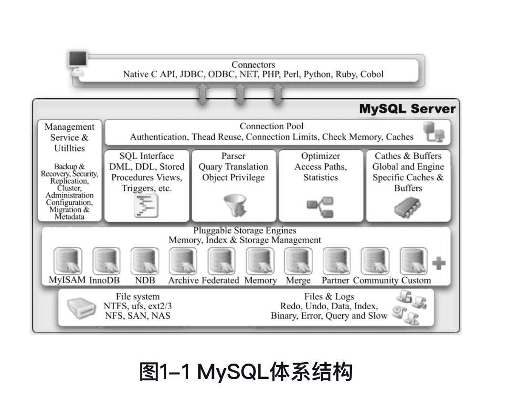
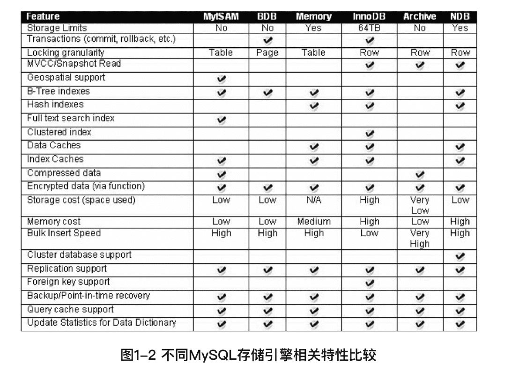

《MySQL技术内幕：InnoDB存储引擎（第2版）》笔记
------------

🏷️微信读书

## 前言

MySQL数据库独有的**插件式存储引擎架构**使其和其他任何数据库都不同。

InnoDB存储引擎的存在使得MySQL跃入了企业级数据库领域。

无论计算机技术发展的速度变得多快，数据库的使用变得多么简单，任何时候**Why都比What重要**。只有真正理解了内部实现原理、体系结构，才能更好地去使用。这正是人类正确思考问题的原则。

## 1 MySQL体系结构和存储引擎

### 1.1 定义数据库和实例

**数据库**（database）：物理操作系统文件或其他形式文件类型的集合。MySQL数据库中，数据库文件可以是frm、MYD、MYI、ibd结尾的文件，或者是NDB引擎的内存中文件。

**实例**（instance）：MySQL数据库由**后台线程以及一个共享内存区组成**。共享内存可以被运行的后台线程所共享。

MySQL被设计为一个单进程多线程架构的数据库。

观察mysql启动或进程情况：

```shell
$ ps -ef | grep mysqld
   74 86573     1   0 三02下午 ??        21:58.54 /usr/local/mysql/bin/mysqld --user=_mysql --basedir=/usr/local/mysql --datadir=/usr/local/mysql/data --plugin-dir=/usr/local/mysql/lib/plugin --log-error=/usr/local/mysql/data/mysqld.local.err --pid-file=/usr/local/mysql/data/mysqld.local.pid --keyring-file-data=/usr/local/mysql/keyring/keyring --early-plugin-load=keyring_file=keyring_file.so --default_authentication_plugin=mysql_native_password
  501 16749 65033   0  6:29下午 ttys001    0:00.01 grep --color=auto --exclude-dir=.bzr --exclude-dir=CVS --exclude-dir=.git --exclude-dir=.hg --exclude-dir=.svn mysqld
```

查找配置文件：

```shell
$ mysql --help | grep my.cnf  
order of preference, my.cnf, $MYSQL_TCP_PORT,
/etc/my.cnf /etc/mysql/my.cnf /usr/local/mysql/etc/my.cnf ~/.my.cnf
```

可以看到，MySQL数据库是按`/etc/my.cnf→/etc/mysql/my.cnf→/usr/local/mysql/etc/my.cnf→～/.my.cnf`的顺序读取配置文件的。

配置文件中`datadir`（Linux默认是 `/usr/local/mysql/data`）是数据库所在路径。也可在mysql命令行查询：

```shell
mysql> show Variables Like 'datadir'\G;
*************************** 1. row ***************************
Variable_name: datadir
        Value: /usr/local/mysql/data/
1 row in set (0.01 sec)
```

也可查询数据库路径具体文件：

```shell
mysql> system sudo ls -lh /usr/local/mysql/data/
Password:
total 336056
-rw-r-----    1 _mysql  _mysql    56B 12 23 14:41 auto.cnf
-rw-r-----    1 _mysql  _mysql   628B 12 23 14:41 binlog.000001
-rw-r-----    1 _mysql  _mysql    30K 12 23 22:47 binlog.000002
-rw-r-----    1 _mysql  _mysql    32B 12 23 14:41 binlog.index
-rw-------    1 _mysql  _mysql   1.6K 12 23 14:41 ca-key.pem
-rw-r--r--    1 _mysql  _mysql   1.1K 12 23 14:41 ca.pem
-rw-r--r--    1 _mysql  _mysql   1.1K 12 23 14:41 client-cert.pem
-rw-------    1 _mysql  _mysql   1.6K 12 23 14:41 client-key.pem
drwxr-x---   10 _mysql  _mysql   320B 12 23 22:47 crashcourse
-rw-r-----    1 _mysql  _mysql   4.4K 12 23 14:41 ib_buffer_pool
-rw-r-----    1 _mysql  _mysql    48M 12 23 22:47 ib_logfile0
-rw-r-----    1 _mysql  _mysql    48M 12 23 14:41 ib_logfile1
-rw-r-----    1 _mysql  _mysql    12M 12 23 22:47 ibdata1
-rw-r-----    1 _mysql  _mysql    12M 12 23 22:47 ibtmp1
drwxr-x---    8 _mysql  _mysql   256B 12 23 14:41 mysql
-rw-r-----    1 _mysql  _mysql    24M 12 23 22:47 mysql.ibd
-rw-r-----    1 _mysql  _mysql   668B 12 23 14:41 mysqld.local.err
-rw-r-----    1 _mysql  _mysql     6B 12 23 14:41 mysqld.local.pid
drwxr-x---  104 _mysql  _mysql   3.3K 12 23 14:41 performance_schema
-rw-------    1 _mysql  _mysql   1.6K 12 23 14:41 private_key.pem
-rw-r--r--    1 _mysql  _mysql   452B 12 23 14:41 public_key.pem
-rw-r--r--    1 _mysql  _mysql   1.1K 12 23 14:41 server-cert.pem
-rw-------    1 _mysql  _mysql   1.6K 12 23 14:41 server-key.pem
drwxr-x---    3 _mysql  _mysql    96B 12 23 14:41 sys
drwxr-x---    3 _mysql  _mysql    96B 12 23 14:45 test
drwxr-x---    2 _mysql  _mysql    64B 12 23 22:06 test2
-rw-r-----    1 _mysql  _mysql    10M 12 23 22:47 undo_001
-rw-r-----    1 _mysql  _mysql    10M 12 23 22:47 undo_002
drwxr-x---    3 _mysql  _mysql    96B 12 23 14:59 yii2basic
```

### 1.2 MySQL体系结构

从概念上来说，数据库是**文件的集合**，是依照某种数据模型组织起来并存放于二级存储器中的数据集合；数据库实例是程序，是位于用户与操作系统之间的一层数据管理软件，用户对数据库数据的任何操作，包括数据库定义、数据查询、数据维护、数据库运行控制等都是在数据库实例下进行的，应用程序只有通过数据库实例才能和数据库打交道。

另一种直白的说法，数据库是由一个个文件组成（一般来说都是二进制的文件）的，要对这些文件执行诸如SELECT、INSERT、UPDATE和DELETE之类的数据库操作是不能通过简单的操作文件来更改数据库的内容，需要通过数据库实例来完成对数据库的操作。



MySQL组成部分：

- 连接池组件
- 管理服务和工具组件
- SQL接口组件
- 查询分析器组件
- 优化器组件
- 缓冲（Cache）组件
- **插件式存储引擎**
- 物理文件

<font color=#FF8C00>**存储引擎是基于表的，而不是数据库。**</font>

### 1.3 MySQL存储引擎

MySQL数据库的核心在于存储引擎。

由于MySQL数据库的开源特性，用户可以根据MySQL预定义的存储引擎接口编写自己的存储引擎。

InnoDB存储引擎最早是第三方存储引擎，后被Oracle收购。

#### InnoDB存储引擎

面向**在线事务处理**（On-Line Transaction Processing，OLTP）的应用。

**行锁设计、支持外键**，并支持类似于Oracle的非锁定读，即默认读取操作不会产生锁。

InnoDB通过使用**多版本并发控制（MVCC）**来获得高并发性，并且实现了SQL标准的**4种隔离级别**，默认为**REPEATABLE**级别。同时，使用一种被称为**next-key locking**的策略来避免**幻读（phantom）**现象的产生。除此之外，InnoDB储存引擎还提供了**插入缓冲（insert buffer）、二次写（double write）、自适应哈希索引（adaptive hash index）、预读（read ahead）**等高性能和高可用的功能。

#### MyISAM存储引擎

面向**联机分析处理**(Online Analytical Processing，OLAP）应用，**不支持事务、表锁设计，支持全文索引**。

与众不同之处：**缓冲池只缓存（cache）索引文件，而不缓冲数据文件**。

MyISAM存储引擎表由MYD和MYI组成，MYD用来存放数据文件，MYI用来存放索引文件。myisampack工具可进一步压缩数据文件，它使用赫夫曼（Huffman）编码静态算法来压缩数据。

#### NDB存储引擎

集群存储引擎

sharenothing的集群架构

数据全部放在内存中

#### Memory存储引擎

数据存放在内存中，适合用于存储临时数据的临时表，以及数据仓库中的纬度表。

默认是哈希索引，不是B+树索引。

#### Archive存储引擎

只支持INSERT和SELECT操作。

#### Federated存储引擎

#### Maria存储引擎

#### 其他存储引擎

Merge、CSV、Sphinx和Infobright等。


### 1.4 各存储引擎之间的比较



```shell
mysql> Show Engines \G;
```


!!

### 1.5 连接MySQL

连接MySQL操作是一个连接进程和MySQL数据库实例进行通信。本质上是**进程通信**。

进程通信方式有**管道、命名管道、命名字、TCP/IP套接字、UNIX域套接字**。

#### TCP/IP套接字

#### 命名管道和共享内存

#### UNIX域套接字

## 2 InnoDB存储引擎

MySQL 5.5 开始为**默认**

### 2.1 概述

行锁设计、支持MVCC、支持外键、提供一致性非锁定读，同时被设计用来最有效地利用以及使用内存和CPU。

### 2.2 版本

| InnoDB版本   | MySQL版本 | 说明                            | 功能                                                   |
| ------------ | --------- | ------------------------------- | ------------------------------------------------------ |
| 老版本InnoDB | 5.1       | 静态编译                        | 支持ACID、行锁设计、MVCC                               |
| InnoDB 1.0.x | 5.1       | 动态加载。也叫**InnoDB Plugin** | 继承上述版本所有功能，添加compress和dynamic页格式      |
| InnoDB 1.1.x | 5.5       |                                 | 继承上述版本所有功能，添加Linux AIO(Asyc IO)、多回滚段 |
| InnoDB 1.2.x | 5.6       |                                 | 继承上述版本所有功能，添加全文索引支持、在线索引添加   |


### 2.3 InnoDB体系架构


#### 后台线程

主要作用：

- 负责刷新内存池中的数据，保证缓冲池中的内存缓存的是最近的数据
- 将已修改的数据文件刷新到磁盘文件
- 保证在数据库发生异常的情况下InnoDB能恢复到正常运行状态

##### 1. Master Thread

核心的后台线程，主要负责将缓冲池中的数据异步刷新到磁盘，保证数据的一致性，包括脏页的刷新、合并插入缓冲（INSERT BUFFER）、UNDO页的回收等。

##### 2. IO Thread

主要负责IO请求的回调（call back）处理。

InnoDB 1.0版本之前共有4个IO Thread，分别是write、read、insert buffer和log IO thread。

```shell
Show Variables Like 'innodb_version';
```

之后的版本，write和read的线程数通过下面两个参数控制：

```shell
mysql> Show Variables Like 'innodb_%io_threads';
+-------------------------+-------+
| Variable_name           | Value |
+-------------------------+-------+
| innodb_read_io_threads  | 4     |
| innodb_write_io_threads | 4     |
+-------------------------+-------+
2 rows in set (0.00 sec)
```

查看引擎状况：

```mysql
mysql> Show Engine InnoDB Status\G;
*************************** 1. row ***************************
  Type: InnoDB
  Name:
Status:
=====================================
2020-12-30 11:02:18 0x70000da5c000 INNODB MONITOR OUTPUT
=====================================
Per second averages calculated from the last 37 seconds
-----------------
BACKGROUND THREAD
-----------------
srv_master_thread loops: 45 srv_active, 0 srv_shutdown, 329190 srv_idle
srv_master_thread log flush and writes: 0
----------
SEMAPHORES
----------
OS WAIT ARRAY INFO: reservation count 149
OS WAIT ARRAY INFO: signal count 152
RW-shared spins 13, rounds 14, OS waits 1
RW-excl spins 10, rounds 113, OS waits 2
RW-sx spins 0, rounds 0, OS waits 0
Spin rounds per wait: 1.08 RW-shared, 11.30 RW-excl, 0.00 RW-sx
------------
TRANSACTIONS
------------
Trx id counter 2323
Purge done for trx's n:o < 2323 undo n:o < 0 state: running but idle
History list length 60
LIST OF TRANSACTIONS FOR EACH SESSION:
---TRANSACTION 422188242843456, not started
0 lock struct(s), heap size 1136, 0 row lock(s)
--------
FILE I/O
--------
I/O thread 0 state: waiting for i/o request (insert buffer thread)
I/O thread 1 state: waiting for i/o request (log thread)
I/O thread 2 state: waiting for i/o request (read thread)
I/O thread 3 state: waiting for i/o request (read thread)
I/O thread 4 state: waiting for i/o request (read thread)
I/O thread 5 state: waiting for i/o request (read thread)
I/O thread 6 state: waiting for i/o request (write thread)
I/O thread 7 state: waiting for i/o request (write thread)
I/O thread 8 state: waiting for i/o request (write thread)
I/O thread 9 state: waiting for i/o request (write thread)
Pending normal aio reads: [0, 0, 0, 0] , aio writes: [0, 0, 0, 0] ,
 ibuf aio reads:, log i/o's:, sync i/o's:
Pending flushes (fsync) log: 0; buffer pool: 0
859 OS file reads, 2358 OS file writes, 1363 OS fsyncs
0.00 reads/s, 0 avg bytes/read, 0.00 writes/s, 0.00 fsyncs/s
-------------------------------------
INSERT BUFFER AND ADAPTIVE HASH INDEX
-------------------------------------
......
```

上面有很多信息，**FILE I/O**一栏中显示线程信息。

##### 3. Purge Thread

事务被提交后，其所使用的undolog可能不再需要，Purge Thread来回收已经使用并分配的undo页。

InnoDB 1.1版本之前，purge操作在Master Thread中完成，之后的版本这个操作独立出来到单独的线程Purge Thread中进行。

在MySQL配置文件可启用独立的Purge Thread（数目表示线程数目，1.1版本之后）：

```mysql
[mysqld]
innodb_purge_threads=1
```

查看Purge Thread：

```mysql
mysql> Show Variables Like 'innodb_purge_threads';
+----------------------+-------+
| Variable_name        | Value |
+----------------------+-------+
| innodb_purge_threads | 4     |
+----------------------+-------+
1 row in set (0.01 sec)
```

##### 4. Page Cleaner Thread

InnoDB 1.2.x引入。

作用是将之前版本中**脏页的刷新**操作都放入到单独的线程中来完成。目的是为了减轻原Master Thread的工作及对于用户查询线程的阻塞，进一步提高InnoDB存储引擎的性能。

#### 内存

##### 1. 缓冲池

InnoDB存储引擎是基于磁盘存储的，并将其中的记录按照页的方式进行管理。在数据库系统中，由于CPU速度与磁盘速度之间的鸿沟，基于磁盘的数据库系统（Disk-baseDatabase）通常使用缓冲池技术来提高数据库的整体性能。

缓冲池简单来说就是一块内存区域。

**将页“FIX”在缓冲池中**

**该页在缓冲池中被命中**

页从缓冲池刷新回磁盘的操作并不是在每次页发生更新时触发，而是通过一种称为**Checkpoint**的机制刷新回磁盘。

**缓冲池的大小**直接影响着数据库的整体性能。

缓冲池的大小可通过参数innodb_buffer_pool_size配置：

```mysql
Show Variables Like 'innodb_buffer_pool_size';
```

缓冲池中缓存的数据页类型有：**索引页、数据页、undo页、插入缓冲（insert buffer）、自适应哈希索引（adaptive hashindex）、InnoDB存储的锁信息（lock info）、数据字典信息（datadictionary）**等。


缓冲池可以有多个实例，每个页根据哈希值平均分配到不同缓冲池实例中。通过参数innodb_buffer_pool_instances来配置，大于一则是多个实例：

```mysql
Show Variables Like 'innodb_buffer_pool_instances';
```

可通过`Show Engine InnoDB Status\G;`查看缓冲池情况。

也可通过`information_schema`中的表`INNODB_BUFFER_POOL_STATS`查看缓冲池情况：

```mysql
Select POOL_ID,POOL_SIZE,FREE_BUFFERS,DATABASE_PAGES From information_schema.INNODB_BUFFER_POOL_STATS;
```

##### 2. LRU List、Free List和Flush List

通常来说，数据库中的缓冲池是通过LRU（Latest Recent Used，最近最少使用）算法来进行管理的。即最频繁使用的页在LRU列表的前端，而最少使用的页在LRU列表的尾端。当缓冲池不能存放新读取到的页时，将首先释放LRU列表中尾端的页。

在InnoDB中，缓冲池中页的大小默认为**16KB**，同样使用LRU算法对缓冲池进行管理。

**midpoint**


在LRU列表中的页被修改后，称该页为**脏页（dirty page）**，即缓冲池中的页和磁盘上的页的数据产生了不一致。

##### 3. 重做日志缓冲（redo log buffer）

innodb_log_buffer_size

##### 4. 额外的内存池

内存堆（heap）

### 2.4 Checkpoint（检查点）技术

为了避免发生数据丢失的问题，当前事务数据库系统普遍都采用了Write Ahead Log策略，即当事务提交时，先写重做日志，再修改页。当由于发生宕机而导致数据丢失时，通过重做日志来完成数据的恢复。这也是事务ACID中D（Durability持久性）的要求。

Checkpoint是用来解决：

- 缩短数据库的恢复时间；
- 缓冲池不够用时，将脏页刷新到磁盘；
- 重做日志不可用时，刷新脏页。

### 2.5 Master Thread工作方式

Master Thread具有最高的线程优先级别。其内部由多个循环（loop）组成：**主循环（loop）、后台循环（backgroup loop）、刷新循环（flush loop）、暂停循环（suspend loop）**。

Master Thread会根据数据库运行的状态在loop、background loop、flush loop和suspendloop中进行切换。

主循环有两大操作：每秒钟的操作和每10秒的操作。

每秒一次的操作包括：

- 日志缓冲刷新到磁盘，即使这个事务还没有提交（总是）；
- 合并插入缓冲（可能）；
- 至多刷新100个InnoDB的缓冲池中的脏页到磁盘（可能）；
- 如果当前没有用户活动，则切换到background loop（可能）。

每10秒的操作包括：

- 刷新100个脏页到磁盘（可能的情况下）；
- 合并至多5个插入缓冲（总是）；
- 将日志缓冲刷新到磁盘（总是）；
- 删除无用的Undo页（总是）；
- 刷新100个或者10个脏页到磁盘（总是）。

InnoDB 1.2.x版本中再次对Master Thread进行了优化，Master Thread的伪代码如下：

```mysql
if InnoDB is idle
	srv_master_do_idle_tasks();  // 每10秒的操作
else
	srv_master_do_active_tasks();  // 每秒的操作
```


### 2.6 InnoDB关键特性

#### 插入缓冲（Insert Buffer）


####  两次写（Double Write）


### 自适应哈希索引（Adaptive Hash Index）


### 异步IO（Async IO）


#### 刷新邻接页（Flush Neighbor Page）


### 2.7 启动、关闭与恢复


## 3 文件

### 3.1 参数文件

当MySQL实例启动时，数据库会先去读一个配置参数文件，用来**寻找数据库的各种文件所在位置以及指定某些初始化参数**，这些参数通常定义了某种内存结构有多大等。

MySQL配置文件读取顺序查看：

```shell
$ mysql --help | grep my.cnf
                      order of preference, my.cnf, $MYSQL_TCP_PORT,
/etc/my.cnf /etc/mysql/my.cnf /usr/local/mysql/etc/my.cnf ~/.my.cnf
```

MySQL实例启动时，没有参数文件会都读取编译时指定的默认值和源代码中指定参数的默认值。

MySQL的**mysql架构**(也就是默认名为`mysql`的数据库)中记录了访问该实例的权限，当找不到这个架构时，MySQL实例不会成功启动。

#### 什么是参数

可以把数据库参数看成一个键/值（key/value）对。

```mysql
-- 查看数据库中所有参数，通过Like过滤
Show Variables\G;

-- 也可以通过information_schema架构下的GLOBAL_VARIABLES视图来进行查找参数
Select * From  GLOBAL_VARIABLES Where VARIABLE_NAME Like 'innodb_buffer_pool_size'\G;
```

#### 参数类型

动态（dynamic）参数：以在MySQL实例运行中进行更改；

静态（static）参数：在整个实例生命周期内都不得进行更改，也就是只读。

可以通过SET命令对动态的参数值进行修改，SET的语法如下：

```mysql
SET  
| [global | session] system_var_name= expr    
| [@@global. | @@session. | @@] system_var_name= expr
```

global和session关键字，表明参数的修改是基于**当前会话**还是**整个实例的生命周期**。

有些动态参数只能在会话中进行修改，如autocommit；

而有些参数修改完后，在整个实例生命周期中都会生效，如binlog_cache_size；

而有些参数既可以在会话中又可以在整个实例的生命周期内生效，如read_buffer_size。

例子：

```mysql 
mysql>SET read_buffer_size=524288;
Query OK, 0 rows affected (0.00 sec)
    mysql>SELECT @@session.read_buffer_size\G;
*************************** 1. row ***************************    @@session.read_buffer_size: 524288
1 row in set (0.00 sec)
mysql>SELECT @@global.read_buffer_size\G;
*************************** 1. row ***************************
@@global.read_buffer_size: 2093056
1 row in set (0.00 sec)
```

对变量的全局值进行了修改，在这次的实例生命周期内都有效，但MySQL实例本身并不会对参数文件中的该值进行修改。也就是说，在下次启动时MySQL实例还是会读取参数文件。若想在数据库实例下一次启动时该参数还是保留为当前修改的值，那么用户必须去修改参数文件。

**Dynamic System Variables**：MySQL所有动态变量的可修改范围。

### 3.2 日志文件


#### 错误日志（error log）

```mysql
mysql> SHOW VARIABLES LIKE 'log_error'\G;
*************************** 1. row ***************************
Variable_name: log_error
        Value: /usr/local/mysql/data/mysqld.local.err
1 row in set (0.00 sec)
```

当出现MySQL数据库不能正常启动时，第一个必须查找的文件应该就是错误日志文件，该文件记录了错误信息，能很好地指导用户发现问题。

```shell 
$ tail -n 50 /usr/local/mysql/data/mysqld.local.err
```

通过错误日志得到一些关于数据库优化的信息。

#### 慢查询日志（slow query log）

慢查询日志可帮助DBA定位可能存在问题的SQL语句，从而进行SQL语句层面的优化。

通过参数`long_query_time`（默认是10s）来设置一个阈值，将运行时间超过该值的所有SQL语句都记录到慢查询日志文件中。DBA每天或每过一段时间对其进行检查，确认是否有SQL语句需要进行优化。

```mysql
SHOW VARIABLES LIKE 'long_query_time'\G;
```

`log_queries_not_using_indexes`

`log_throttle_queries_not_using_indexes`

```shell
# mysqldumpslow **-slow.log
```


#### 查询日志（log）

查询日志记录了所有对MySQL数据库请求的信息，无论这些请求是否得到了正确的执行。

#### 二进制日志（binlog）

二进制日志（binary log）记录了对MySQL数据库执行更改的所有操作，但是不包括SELECT和SHOW这类操作，因为这类操作对数据本身并没有修改。

二进制日志的作用：

- **恢复**（recovery）：某些数据的恢复需要二进制日志，例如，在一个数据库全备文件恢复后，用户可以通过二进制日志进行point-in-time的恢复。
- **复制**（replication）：其原理与恢复类似，通过复制和执行二进制日志使一台远程的MySQL数据库（一般称为slave或standby）与一台MySQL数据库（一般称为master或primary）进行实时同步。
- **审计**（audit）：用户可以通过二进制日志中的信息来进行审计，判断是否有对数据库进行注入的攻击。

### 3.3 套接字文件

在UNIX系统下本地连接MySQL可以采用UNIX域套接字方式，这种方式需要一个套接字（socket）文件。套接字文件可由参数socket控制。一般在/tmp目录下，名为mysql.sock：

```mysql
mysql> SHOW VARIABLES LIKE 'socket'\G;
*************************** 1. row ***************************
Variable_name: socket
        Value: /tmp/mysql.sock
1 row in set (0.00 sec)
```

### 3.4 pid文件

pid文件：当MySQL实例启动时，会将自己的进程ID写入一个文件中。

该文件可由参数pid_file控制，默认位于数据库目录下，文件名为主机名.pid：

```mysql
mysql> SHOW VARIABLES LIKE 'pid_file'\G;
*************************** 1. row ***************************
Variable_name: pid_file
        Value: /usr/local/mysql/data/mysqld.local.pid
1 row in set (0.00 sec)
```


### 3.5 表结构定义文件

MySQL数据的存储是根据表进行的，每个表都会有与之对应的文件。但无论采用何种存储引擎，表结构定义都存储在一个`.frm`文件里。

`.frm`还用来存储视图的定义，例如用户创建了一个v_a视图，那么对应地会产生一个v_a.frm文件，用来记录视图的定义，该文件是文本文件，可以直接使用cat命令进行查看：

```shell

```

### 3.6 InnoDB存储引擎文件

每个表存储引擎还有其自己独有的文件。

#### 表空间文件


#### 重做日志文件


## 4 表

数据在表中是如何组织和存放的。

### 4.1 索引组织表

在InnoDB存储引擎中，**表都是根据主键顺序组织存放的**，这种存储方式的表称为**索引组织表（index organized table）**。

每张表都有个**主键（Primary Key）**，如果在创建表时没有显式地定义主键，则会按如下方式选择或创建主键：

1. 首先判断表中是否有非空的唯一索引（Unique NOTNULL），如果有，则该列即为主键，如果有多个，则建表时第一个定义的为主键（**注**：是定义索引的顺序，不是建表时列的顺序）。
2. 如果不符合上述条件，InnoDB存储引擎自动创建一个6字节大小的指针。

```mysql
 Create Table z (
  a INT NOT NULL,
  b INT  NULL,
  c INT NOT NULL,
  d INT NOT NULL,
  Unique Key (b),
  Unique Key (d), Unique Key (c)
);

Insert Into z Select 1,2,3,4;
Insert Into z Select 5,6,7,8;
Insert Into z Select 9,10,11,12;
```

b列允许NULL值，所以d列是主键。可通过`_rowid`来查看单个列为主键的表：

```mysql
mysql> Select a,b,c,d,_rowid From z;
+---+------+----+----+--------+
| a | b    | c  | d  | _rowid |
+---+------+----+----+--------+
| 1 |    2 |  3 |  4 |      4 |
| 5 |    6 |  7 |  8 |      8 |
| 9 |   10 | 11 | 12 |     12 |
+---+------+----+----+--------+
3 rows in set (0.01 sec)
```

### 4.2 InnoDB逻辑存储结构

InnoDB所有数据都被逻辑地存放在一个空间中，称之为**表空间（tablespace）**。

表空间由**段**（segment）、**区**（extent）、**页**（page，有时也叫块，block）组成。


#### 表空间


#### 段


####  区

区是由连续页组成的空间，在任何情况下每个区的大小都为**1MB**。为了保证区中页的连续性，InnoDB存储引擎一次从磁盘申请4～5个区。在默认情况下，InnoDB存储引擎页的大小为**16KB**，即一个区中一共有64个连续的页。

InnoDB 1.0.x版本开始引入**压缩页**，即每个页的大小可以通过参数**KEY_BLOCK_SIZE**设置为2K、4K、8K，因此每个区对应页的数量就应该为512、256、128。

#### 页

页是InnoDB磁盘管理的最小单位。

常见页类型：

- 数据页（B-tree Node）
- undo页（undo Log Page）
- 系统页（System Page）
- 事务数据页（Transaction system Page）
- 插入缓冲位图页（Insert Buffer Bitmap）
- 插入缓冲空闲列表页（Insert Buffer Free List）
- 未压缩的二进制大对象页（Uncompressed BLOB Page）
- 压缩的二进制大对象页（compressed BLOB Page）

#### 行

InnoDB存储引擎是**面向列的（row-oriented）**，也就说数据是按行进行存放的。每个页存放的行记录也是有硬性定义的，最多允许存放16KB / 2-200行的记录，即7992行记录。

### 4.3 InnoDB行记录格式

InnoDB存储引擎和大多数数据库一样（如Oracle和Microsoft SQLServer数据库），记录是以行的形式存储的。这意味着页中保存着表中一行行的数据。

#### Compact行记录格式


所以InnoDB存储引擎在页内部是通过一种链表的结构来串连各个行记录的。

不管是CHAR类型还是VARCHAR类型，在compact格式下NULL值都不占用任何存储空间。

#### Redundant行记录格式


#### 行溢出数据

InnoDB存储引擎可以将一条记录中的某些数据存储在真正的数据页面之外。

#### Compressed和Dynamic行记录格式

InnoDB 1.0.x版本开始引入了新的文件格式（file format，用户可以理解为新的页格式），以前支持的Compact和Redundant格式称为**Antelope文件格式**，新的文件格式称为**Barracuda文件格式**。Barracuda文件格式下拥有两种新的行记录格式：Compressed和Dynamic。

#### CHAR的行结构存储

因此可以认为在多字节字符集的情况下，CHAR和VARCHAR的实际行存储基本是没有区别的。

### 4.4 InnoDB数据页结构


#### File Header（文件头）

记录页的一些头信息。


#### Page Header（页头）

记录数据页的状态信息，由14个部分组成，共占用56字节。


#### Infimun和Supremum Records

每个数据页中有两个虚拟的行记录，用来限定记录的**边界**。Infimum记录是比该页中任何主键值都要小的值，Supremum指比任何可能大的值还要大的值。这两个值在页创建时被建立，并且在任何情况下不会被删除。


#### User Records（用户记录，即行记录）

InnoDB存储引擎表总是B+树索引组织的。

#### Free Space（空闲空间）


#### Page Directory（页目录）

存放了记录的相对位置（注意，这里存放的是页相对位置，而不是偏移量）。

#### File Trailer（文件结尾信息）

为了检测页是否已经完整地写入磁盘（如可能发生的写入过程中磁盘损坏、机器关机等）。

#### InnoDB数据页结构示例分析


### 4.5 Named File Formats机制

解决不同版本下页结构兼容性的问题。

### 4.6 约束

#### 数据完整性

关系型数据库系统和文件系统的一个不同点是，关系数据库本身能保证存储数据的完整性，不需要应用程序的控制，而文件系统一般需要在程序端进行控制。

在InnoDB存储引擎表中，确保数据完整性的几种途径：

- 选择合适的数据类型确保一个数据值满足特定条件。
- 外键（Foreign Key）约束。
- 编写触发器。
- 还可以考虑用DEFAULT约束作为强制域完整性的一个方面。

几种约束

- Primary Key
- Unique Key
- Foreign Key
- Default
- NOT NULL

#### 约束的创建和查找

约束创建的两种方式：

- 表建立时就进行约束定义
- `ALTER TABLE`


#### 约束和索引的区别

约束更是一个逻辑的概念，用来保证数据的完整性，而索引是一个数据结构，既有逻辑上的概念，在数据库中还代表着物理存储的方式。

#### 对错误数据的约束

如果用户想通过约束对于数据库非法数据的插入或更新，即MySQL数据库提示报错而不是警告，那么用户必须设置参数sql_mode，用来严格审核输入的参数。

####  ENUM和SET约束


####  触发器与约束

触发器的作用是在执行INSERT、DELETE和UPDATE命令之前或之后自动调用SQL命令或存储过程。

具备Super权限的用户通过`CREATE TRIGGER`命令创建触发器，完整格式：

```mysql
CREATE
[DEFINER = { user | CURRENT_USER }]
TRIGGER trigger_name BEFORE|AFTER INSERT|UPDATE|DELETE
ON tbl_name FOR EACH ROW trigger_stmt
```

最多可以为一个表建立6个触发器，即分别为INSERT、UPDATE、DELETE的BEFORE和AFTER各定义一个。

#### 外键约束

MyISAM存储引擎本身并不支持外键，对于外键的定义只是起到一个注释的作用；而InnoDB存储引擎则完整支持外键约束。定义格式：

```mysql
[CONSTRAINT [symbol]] FOREIGN KEY
[index_name] (index_col_name, ...)
REFERENCES tbl_name (index_col_name,...)
[ON DELETE reference_option]
[ON UPDATE reference_option]
reference_option:
RESTRICT | CASCADE | SET NULL | NO ACTION
```


### 4.7 视图

视图（View）是一个命名的虚表，它由一个SQL查询来定义，可以当做表使用。与持久表（permanent table）不同的是，视图中的数据没有实际的物理存储。

#### 视图的作用


#### 物化视图


#### 4.8 分区表

MySQL数据库支持的分区类型为水平分（指将同一表中不同行的记录分配到不同的物理文件中），并不支持垂直分（指将同一表中不同列的记录分配到不同的物理文件中。）。

#### 分区类型

##### RANGE分区

##### LIST分区

##### HASH分区

HASH分区的目的是将数据均匀地分布到预先定义的各个分区中，保证各分区的数据数量大致都是一样的。

##### KEY分区

##### COLUMNS分区


#### 子分区


#### 分区中的NULL值


#### 分区和性能


#### 在表和分区间交换数据


## 5 索引与算法

索引的数量需要一个合适的平衡点。

从一开始就应该在需要处添加索引。

### 5.1 InnoDB存储引擎索引概述

InnoDB支持的几种索引:

- B+树索引
- 全文索引
- 哈希索引

B+树索引目前关系型数据库系统中查找最为常用和最为有效的索引。

B+树中的B不是代表二叉（binary），而是代表**平衡（balance）**，因为B+树是从最早的平衡二叉树演化而来，但是B+树不是一个二叉树。

B+树索引并不能找到一个给定键值的具体行。B+树索引能找到的只是被查找数据行所在的页。然后数据库通过把页读入到内存，再在内存中进行查找，最后得到要查找的数据。

### 5.2 数据结构与算法

#### 二分查找法（binary search）

基本思想是：将记录按有序化（递增或递减）排列，在查找过程中采用跳跃式方式查找，即先以有序数列的中点位置为比较对象，如果要找的元素值小于该中点元素，则将待查序列缩小为左半部分，否则为右半部分。

#### 二叉查找树和平衡二叉树


平衡二叉树的定义如下：首先符合二叉查找树的定义，其次必须满足任何节点的两个子树的高度最大差为1。


### 5.3 B+树

B+树是为磁盘或其他直接存取辅助设备设计的一种平衡查找树。在B+树中，所有记录节点都是按键值的大小顺序存放在同一层的叶子节点上，由各叶子节点指针进行连接。

#### B+树的插入操作


#### B+树的删除操作


### 5.4 B+树索引

#### 聚集索引（clustered index）

由于实际的数据页只能按照一棵B+树进行排序，因此每张表只能拥有一个聚集索引。

#### 辅助索引（secondary index）


#### B+树索引的分裂


#### B+树索引的管理

1. 索引管理


2. Fast Index Creation


3. Online Schema Change


4. Online DDL


### 5.5 Cardinality值


#### InnoDB存储引擎的Cardinality统计


### 5.6 B+树索引的使用


#### 不同应用中B+树索引的使用


#### 联合索引


####  覆盖索引


#### 优化器选择不使用索引的情况


#### 索引提示


####  Multi-Range Read优化


#### Index Condition Pushdown（ICP）优化


### 5.7 哈希算法

#### 哈希表

哈希表（Hash Table）也称散列表，由直接寻址表改进而来。

####  InnoDB存储引擎中的哈希算法


#### 自适应哈希索引


### 5.8 全文检索


#### 倒排索引（inverted index）


#### InnoDB全文检索


#### 全文检索（Full-Text Search）

```mysql
MATCH (col1,col2,...) AGAINST (expr [search_modifier])
search_modifier:
	{
		IN NATURAL LANGUAGE MODE
		| IN NATURAL LANGUAGE MODE WITH QUERY EXPANSION
    | IN BOOLEAN MODE
    | WITH QUERY EXPANSION
  }
```


## 6 锁

### 6.1 什么是锁

锁是数据库系统区别于文件系统的一个关键特性。

InnoDB存储引擎不仅会在**行级别**上对表数据上锁，也会在数据库内部其他多个地方使用锁，从而允许对多种不同资源提供并发访问。例如，操作缓冲池中的**LRU列表，删除、添加、移动LRU列表**中的元素，为了保证一致性，必须有锁的介入。

数据库系统使用锁是为了支持对共享资源（不仅仅是“行记录”）进行并发访问，提供数据的完整性和一致性。

**注：**不同的数据库，锁的实现方法是不同的。

### 6.2 lock与latch


### 6.3 InnoDB存储引擎中的锁

#### 锁的类型

#### 一致性非锁定读


#### 一致性锁定读


#### 自增长与锁


#### 外键和锁


### 6.4 锁的算法

#### 行锁的3种算法

- Record Lock：单个行记录上的锁
- Gap Lock：间隙锁，锁定一个范围，但不包含记录本身
- Next-Key Lock：Gap Lock+Record Lock，锁定一个范围，并且锁定记录本身


#### 解决Phantom Problem


### 6.5 锁问题

#### 脏读


#### 不可重复读


#### 丢失更新


### 6.6 阻塞


### 6.7 死锁


#### 死锁概率


### 6.8 锁升级


## 7 事务

事务（Transaction）也是数据库区别于文件系统的重要特性。

ACID的特性

### 7.1 认识事务


#### 分类

##### 扁平事务（Flat Transactions）

##### 带有保存点的扁平事务（Flat Transactions withSavepoints）

##### 链事务（Chained Transactions）

##### 嵌套事务（Nested Transactions）

##### 分布式事务（Distributed Transactions）

### 7.2 事务的实现

隔离性：锁

原子性、持久性：redo log（重做日志）

一致性：undo log

#### redo


#### undo


#### purge


#### group commit


### 7.3 事务控制语句

```mysql
START TRANSACTION | BEGIN

COMMIT

ROLLBACK

SAVEPOINT identifier

RELEASE SAVEPOINT identifier

ROLLBACK TO[SAVEPOINT]identifier

SET TRANSACTION
```


### 7.4 隐式提交的SQL语句


### 7.5 对于事务操作的统计

每秒请求数（Question Per Second，QPS）

每秒事务处理的能力（Transaction Per Second，TPS）


### 7.6 事务的隔离级别


### 7.7 分布式事务


### 7.8 不好的事务习惯


#### 在循环中提交


#### 使用自动提交


#### 使用自动回滚


### 7.9 长事务


## 8 备份与恢复


### 8.1 概述

按照备份的方法不同可以将备份分为：

- Hot Backup（热备）
- Cold Backup（冷备）
- Warm Backup（温备）

按照备份后文件的内容可以分为：

- 逻辑备份
- 裸文件备份

按照备份数据库的内容来可以分为：

- 完全备份
- 增量备份
- 日志备份


### 8.2 冷备

对于InnoDB存储引擎的冷备非常简单，只需要备份MySQL数据库的frm文件，共享表空间文件，独立表空间文件（*.ibd），重做日志文件。另外建议定期备份MySQL数据库的配置文件my.cnf，这样有利于恢复的操作。


### 8.3 逻辑备份

#### mysqldump


#### SELECT...INTO OUTFILE


#### 逻辑备份的恢复


#### LOAD DATA INFILE


#### mysqlimport


### 8.4 二进制日志备份与恢复


### 8.5 热备

#### ibbackup


#### XtraBackup


####  XtraBackup实现增量备份


### 8.6 快照备份

MySQL数据库本身并不支持快照功能，因此快照备份是指通过文件系统支持的快照功能对数据库进行备份。备份的前提是将所有数据库文件放在同一文件分区中，然后对该分区进行快照操作。


### 8.7 复制（replication）

#### 复制的工作原理


####  快照+复制的备份架构


## 9 性能调优


### 9.1 选择合适的CPU

数据库的应用类型：OLTP（Online Transaction Processing，在线事务处理）和OLAP（Online Analytical Processing，在线分析处理）。

OLAP多用在数据仓库或数据集市中，一般需要执行复杂的SQL语句来进行查询；OLTP多用在日常的事物处理应用中，如银行交易、在线商品交易、Blog、网络游戏等应用。相对于OLAP，数据库的容量较小。

InnoDB存储引擎一般都应用于OLTP的数据库应用

### 9.2 内存的重要性


### 9.3 硬盘对数据库性能的影响


### 9.4 合理地设置RAID


### 9.5 操作系统的选择

稳定性

### 9.6 不同的文件系统对数据库性能的影响


### 9.7 选择合适的基准测试工具

#### sysbench


#### mysql-tpcc


## 10 InnoDB存储引擎源代码的编译和调试