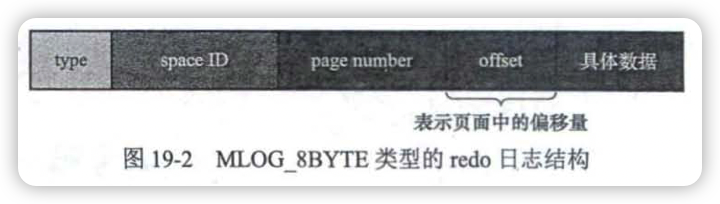

《MySQL是怎样运行的》笔记
----

作者：小孩子4919

## 1 初始MySQL

MySQL的服务器程序和客户端程序

我的电脑安装目录：

```
/opt/homebrew/Cellar/mysql/8.0.27/
```

### 启动MySQL服务器程序

`mysqld`不常用，常用`mysqld_safe`，它的优点：

- 间接调用mysqld并持续监控服务器的运行状态。
- 当服务器进程出现错误，可以帮助重启服务器程序。
- 输出错误日志

`mysql.server`间接地调用mysqld_safe：

```shell
mysql.server start
mysql.server stop
```

`mysqld_multi`可以启动或停止多个服务器进程，也能报告他们的运行状态。

`mysqld_safe`、`mysql.server`、`mysqld_multi`都是基于`mysqld`的shell脚本。

### 启动MySQL客服端程序

```shell
mysql -h主机名 -u用户们 -p密码
```


关闭客服端命令：

```
quit
exit
\q
```


### 客服端与服务器连接的过程

客服端进程向服务器进程发送请求并得到响应的过程本质上是一个**==进程间通信==**的过程。MySQL支持几种进程通信方式。

#### 1 TCP/IP

mysql服务端进程默认监听3306端口，使用`-P`修改：

```shell
mysqld -P3307
```

客服端程序连接：

```shell
mysql -uroot -h127.0.0.1 -P3307 -p
```

#### 2 命名管道和共享内存

windows特有的。

- 命名管道。分别在启动服务器程序和客服端程序时加上，`--enable-named-pipe`和`--pipe`/`--protocal=pipe`。
- 共享内存。分别在启动服务器程序和客服端程序时加上，`--shared-memory`和`--protocal==memory`。

#### 3 Unix域套接字

在类Unix的同一台机器上。

如果在启动客服端程序时<u>没有指定主机名，或者指定的主机名为localhost，或者指定了`--protocol=socket`，</u>那么服务器程序和客服端程序就可以通过Unix域套接字通信了。

服务器程序默认监听的Unix域**套接字文件**是`/tmp/mysql.sock`，修改方式：

```shell
mysqld --socket=/tmp/a.txt
```

对应的客服端程序启动时修改为：

```shell
mysql -hlocalhost -uroot --socket=/tmp/a.txt -p
```

### 服务器处理客服端请求

无论那种通信方式，最后都是实现**客服端进程向服务器进程发送一段文本（MySQL语句），服务器进程处理后再向客服端进程返回一段文本（处理结果）。**


服务端处理客服端的查询请求时，大致分为3部分：

#### 1.连接管理

每当一个客户端进程连接到服务器进程时，服务器进程都会**创建一个线程专门处理与这个客户端的交互**；断开后线程不会被立即销毁，而是缓存起来，当另一个新的客户端再进行连接时，就会把这个线程分配给该新的客户端。

当然也需要限制可以同时连接到服务器的客服端数量。

#### 2.解析与优化

- 查询缓存

> MySQL5.7.20开始不推荐使用查询缓存，MySQL8.0直接删除了。

- 语法解析

从本质上说，这个从指定的文本中提取出需要的信息是一个编译过程，涉及词法解析、语法分析、语义分析等阶段。

- 查询优化

对我们的语句做一些优化，如外连接转换为内连接、表达式简化、子查询转为连接等等，最中结果是生成一个==执行计划==。

#### 3.存储引擎

在物理上如何表示记录（逻辑上表是有一行一行的记录组成的），怎么从表中读取数据以及怎么把数据写入具体的物理存储器上，都是存储引擎负责的事情。

### 常用存储引擎


### 存储引擎的一些操作

#### 当前服务器程序支持的存储引擎

```mysql
Show Engines;
```

结果中，Support列表示是否可用；Savepoints表示是否支持事务的部分回滚。

#### 设置表的存储引擎

```mysql
-- 1.创建时
Create Table 表名(
) Engine = 存储引擎名称;

-- 2.修改
Alter Table 表名 Engine = 存储引擎名称;
```


## 2 MySQL的调控按钮——启动选项和系统变量

### 2.1 启动选项和配置文件

**==启动选项（startup option）==**，控制着程序启动后的行为。

启动选项可以在命令行中指定，也可以在配置文件中指定。

#### 在命令行上指定启动选项

比如，禁止客户端使用TCP/IP网络进行通信：

```mysql
mysqld --skip-networking
```

参数`--`为前缀，多个单词以`-`或`_`连接。

修改默认存储引擎：

```mysql
mysqld --default-storage-engine=MyISAM
```

启动服务器程序的命令行指定启动选项的通用格式：

```mysql
--启动选项1[=值1] --启动选项2[=值2] ... --启动选项n[=值n]
```

查看程序全部启动选项及其默认值：

```shell
mysql --help
mysql_safe --help
mysqld --verbose --help
```

常用的启动选项可以有短形式的：


#### 配置文件中指定启动选项

命令行配置只能当次启动生效。

##### 1.配置文件的路径

MySQL程序启动时会在多个路径下寻找配置文件，也可在命令行中添加额外的配置文件路径。不同系统有所不同。

**Windows**：


- 前3个路径，配置文件可以`.ini`也可以是`.cnf`
- `%WINDIR`指Windows目录，通常是`C:\WINDOWS`。可以通过`echi %WINDIR%`查看。
- `BASEDIR`是指MySQL的安装目录路径。
- `%APPDATA%`表示Windows应用程序数据目录，可用`echo %APPDATA%`查看。
- 最后一个`.mylogin.cnf`有点特殊，它不是纯文本文件，是程序mysql_config_editor创建的加密文件。

**类Unix：**


##### 2.配置文件的内容

配置文件中的启动选项被划分为若干个组（组名用`[]`扩起来），不同选项组给不同程序使用。

```
[server]
option1
option2 = value2
...

[mysqld]
option1
option2 = value2
...

[mysqld_safe]
option1
option2 = value2
...

[client]
option1
option2 = value2
...

[mysql]
option1
option2 = value2
...

[mysqladmin]
option1
option2 = value2
...
```


##### 3.特定MySQL版本的专用选项组

```
# 只有对应版本的mysqld才能使用
[mysqld-5.7]
```

##### 4.配置文件的优先级

配置文件读取，是按照表2-2或表2-3的顺序依次加载，相同启动选项，以最后一个配置文件为准。

##### 5.同一个配置文件中多个组的优先级

以最后一个出现的组中的启动选项为准。

##### 6.defaults-file的使用

不想让MySQL到默认的路径下搜索配置文件。

```shell
mysqld --defaults-file=/tmp/myconfig.txt
```

程序启动时只在`/tmp/myconfig.txt`路径下搜索配置文件。

#### 在命令行和配置文件中启动选项的区别

除了`defaults--extra-file`、`defaults-file`这样的本身指定配置文件路径的和一些只能在命令行使用的，其它启动选项都可以放到配置文件中。

命令行的优先级高于配置文件。

### 2.2 系统变量

**系统变量**：MySQL服务器程序在运行过程中会用到许多影响程序行为的变量。有好几百个。

每个系统变量都有一个默认值，可使用命令行或配置文件在启动服务器是修改。

大多说系统变量的值也可以在程序运行过程中修改，而无须停止并停止并重新启动服务器。

#### 查看系统变量

```mysql
Show Variables [Like 匹配的模式];
```

#### 设置系统变量

##### 1.通过启动选项设置

```shell
mysqld --default-storage-engine=MyISAM --max-connections=10
```

```
[server]
default-storage-engine=MyISAM 
max-connections=10
```

> **注**：系统变量，各单词之间只能用`_`连接。

##### 2.运行中设置

系统变量有作用范围之分：

- Global（全局范围）：影响服务器的整体操作。（全局变量）
- Session（会话范围）：影响某个客服端连接的操作。（会话变量）

服务器程序运行期间通过客服端程序设置系统变量的语法：

```mysql
Set [Global|Session] 系统变量名 = 值;
-- 或
Set [@@(Global|Session).]系统变量名 = 值;
```

如果在设置系统变量的语句中省略了作用范围，默认是Session。

查看不同作用范围的系统变量：

```mysql
Show [Global|Session] Variables [Like 匹配的模式];
```

> **注：**
>
> - 通过启动选项设置的系统变量的作用范围都是GLOBAL。
>
> - 一些系统变量只具有Global作用范围，如max_connections。
> - 一些系统变量只具有Session作用范围，如inser_id。
>
> - 有些系统变量是只读的，如version。

##### 3.启动选项和系统变量的区别

- 大部分的系统变量都可以当作启动选项传入。
- 有些系统变量是在程序运行过程中自动生成的，不可以当作启动选项来设置，比如 character_set_client。
- 有些启动选项也不是系统变量，比如 defaults-file。

### 2.3 状态变量

MySQL服务器程序运行状态的变量，好几百个，不能人为设置。

```mysql
Show [Global|Session] Variables [Like 匹配的模式];
```

```mysql
mysql> show status like 'thread%';
+-------------------+-------+
| Variable_name     | Value |
+-------------------+-------+
| Threads_cached    | 2     |
| Threads_connected | 1     |
| Threads_created   | 3     |
| Threads_running   | 2     |
+-------------------+-------+
4 rows in set (0.00 sec)
```


## 3 字符集和比较规则

### 3.1 简介

#### 字符集简介

字符与二进制数据的映射关系。

将字符映射成二进制数据的过程叫作**==编码==**，将二进制数据映射到字符的过程叫作**==解码==**。

人们抽象出的概念，**==字符集==**：描述某个字符范围的编码规则。

#### 比较规则简介

直接用字符对应的二进制比较大小的比较规则叫**==二进制比较规则==**，这种规则比较简单。

同一种字符集可以有多种比较规则。

#### 一些重要的字符集

- **ASCII字符集**。128个字符。（一个字节编码一个字符）

- ISO 8859-1字符集（**Latin1**）。256个字符（在ASCII基础扩充了128个西欧常用字符）。（一个字节）

- **GB2312字符集**。6762个汉字+682个其它。对应ASCII字符的一个字节编码，其它两个字节编码。（**变长编码方式**）

  > <u>计算机读取一个字节序列时，怎么区分某个字节代表的是一个单独的字符还是某个字符的一部分呢？</u>
  >
  > ASCII的最高位默认为0，如果为1就是两个字节代表一个单独的字符。

- **GBK字符集**。对GB2312的扩充。

- **UTF-8字符集**。几乎收录世界各国使用的字符，而且还在不断扩充。1~4个字节编码一个字符。

  > UTF-8只是Unicode字符集的一中**编码方案**，其它有UTF-16（2或4字节编码）、UTF-32（4字节编码）。
  >
  > UTF-8采用1~4个字节编码一个字符；
  >
  > UTF-16采用2或4个字节编码一个字符；
  >
  > UTF-32采用4个字节编码一个字符。
  
  

### 3.2 MySQL中支持的字符集和比较规则

#### MySQL中的utf8和utf8mb4

- Utf8mb3（简称utf8）：阉割过的UTF-8字符集，只使用1~3字节表示一个字符。

  > UTF-8：8-bit Unicode Transformation Format
  >
  > mb3:  **m**aximun of **3** **b**ytes per multibyte character

- utf8mb4：正宗的UTF-8字符集，1~4个字节。MySQL8.0已经优化，默认字符集。

#### 字符集的查看

```mysql
-- `Character Set`和`Charset`是同义词
Show (Character Set | Charset) [Like 匹配的模式];

SHOW CHARACTER SET LIKE 'utf8%';
SHOW CHARSET;
```


MySQL中表示字符集的名称时使用小写形式。

大概有41中字符集。

#### 比较规则的查看

```mysql
Show Collation [Like 匹配的模式];

show Collation Like 'utf8%';
+--------------------------+---------+-----+---------+----------+---------+---------------+
| Collation                | Charset | Id  | Default | Compiled | Sortlen | Pad_attribute |
+--------------------------+---------+-----+---------+----------+---------+---------------+
| utf8_bin                 | utf8    |  83 |         | Yes      |       1 | PAD SPACE     |
| utf8_croatian_ci         | utf8    | 213 |         | Yes      |       8 | PAD SPACE     |
| utf8_czech_ci            | utf8    | 202 |         | Yes      |       8 | PAD SPACE     |
| utf8_danish_ci           | utf8    | 203 |         | Yes      |       8 | PAD SPACE     |
...
```

- 比较规则的名称以其关联的字符集名称开头。
- 中间紧跟着该**比较规则所应用的语言**。如，utf8_polish_ci表示波兰语的比较规则...，utf8_general_ci是通用的比较规则。
- 名称后缀表示该比较规则是否区分语言中的重音、大小写等。


### 3.3 字符集和比较规则的应用

#### 各级别的字符集和比较规则

##### 1.服务器级别

服务器级别的字符集和比较规则的系统变量：`character_set_server`, `collation_server`。

```mysql
SHOW VARIABLES LIKE 'character_set_server';
SHOW VARIABLES LIKE 'collation_server';
```

##### 2.数据库级别

在创建和修改数据库时可以指定，具体语法：

```mysql
Create Database 数据库名
	[[Default] Character set 字符集名称]
	[[Default] Collate 比较规则名称];
	
Alter Database 数据库名
	[[Default] Character set 字符集名称]
	[[Default] Collate 比较规则名称];
```

```mysql
Create Database charset_demo_db
Character Set gb2312
Collate gb2312_chinese_ci;
```

对应的系统变量：`character_set_database`, `collation_database`（不能通过这两个变量来修改数据库的字符集和比较规则）。

查看当前数据库的字符集和比较规则：

```mysql
SHOW VARIABLES LIKE 'character_set_database';
SHOW VARIABLES LIKE 'collation_database';
```

> 创建数据库时不指定字符集和比较规则，就使用服务器级别的。

##### 3.表级别

也可在创建和修改表时指定，具体语法：

```mysql
Create Table 表名(列的信息)
	[[Default] Character set 字符集名称]
	[Collate 比较规则名称];
	
Alter Table 表名
	[[Default] Character set 字符集名称]
	[Collate 比较规则名称];
```

```mysql
Create Table t (
	col Varchar(10)
) character Set utf8 collate utf8_general_ci;
```

> 同样创建表示没指定，就使用数据库级别的。

##### 4.列级别

对于存储字符串的列，**同一个表中不同的列也可以有不同的字符集和比较规则**。

```mysql
Create Table 表名(
	列名 字符串类型 [Character set 字符集名称] [Collate 比较规则名称],
  ...
);

Alter Table 表名 Modify 列名 字符串类型 [Character set 字符集名称] [Collate 比较规则名称];
```

> 对于某个列来说，如果在创建和修改表的语句中没有指明其字符集和比较规则，则使用表的。

##### 5.仅修改字符集或仅修改比较规则

- 只修改字符集，则比较规则将变为修改后的字符集默认的比较规则；
- 只修改比较规则，则字符集将变为修改后的比较规则对应的字符集。

##### 6.各级别字符集和比较规则小结

- 如果创建或修改列时没有显式指定字符集和比较规则，则该列默认使用表的宇符集和比较规则；
- 如果创建表时没有显式指定字符集和比较规则，则该表默认使用数据库的字符集和比较规则；
- 如果创建数据库时没有显式指定字符集和比较规则，则该数据库默认使用服务器的字符集和比较规则。

#### 客户端和服务器通信过程中使用的字符集

##### 1.编码和解码使用的字符集不一致

> `我`在UTF-8字符集编码下的字节序列是`0xE68891`。如果程序A把这个字节序列发送到程序B，程序B使用不同的字符集解码（假设使用GBK），过程如下：（可通过在线工具 [汉字字符集编码查询](https://www.qqxiuzi.cn/bianma/zifuji.php) 测试）
>
> a. 首先看第一个字节0xE6，大于0x7F（十进制127），说明待读取字符是两字节编码。继续读一字节后得到 OxE688，然后从 GBK 编码表中查找字节为 0xE688 对应的字符，发现是字符`鎴`。
> b. 继续读一个字节 0x91，它的值也大于 0x7F，试图再读一个字节时发现后边没有了，所以这是半个字符。
> c. 最终，0xE68891被 GBK 字符集解释成一个字符'鎴'和半个字符。

##### 2.字符集转换

如果接受`0xE68891`这个字节序列的程序按照UTF-8字符集解码（得到二进制序列为`111001101000100010010001`）；然后再按照GBK字符集进行编码，编码后的字节序列为0xCED2。这个过程就叫作**==字符集转换==**。

##### 3.MySQL中的字符集转换过程🔖

从机器的角度看，客户端发送的请求以及服务器返回的响应本质上就是一个**字节序列**。

在这个“客户端发送请求，服务器返回响应”的过程中，其实经历了**多次的字符集转换**：

###### 客户端发送请求

一般，客户端编码请求字符串时使用的字符集与操作系统当前的字符集一致。

- 类UNIX系统时

系统当前使用的字符集，由三个环境变量决定：`LC_ALL`，`LC_CTYPE`，`LANG`（优先级渐渐降低）。

- Windows


###### 服务器接受请求

服务器将客户端请求的字符序列看作是使用系统变量`character_set_client`代表的字符集进行编码的字节序列（每个客户端与服务器建立连接后，服务器都会为其维护一个单独的SESSION级别的`character_set_client`变量）。


###### 服务器处理请求


###### 服务器生成响应


这三个系统变量作用范围都是Session级别。


> 如果MySQL不支持操作系统当前使用的字符集，则会将客户端默认的字符集设置为MySQL的默认字符集（5.7前是latin1,8.0之后改为utf8mb4）。

###### 客户端接收到响应


#### 比较规则的应用

比较规则通常用来==比较字符串的大小以及对某些字符进行排序==，所以也称为**排序规则**。

```mysql
Insert Into t(col) Values('a'), ('b'), ('A'), ('B'), ('我');
```

```mysql
-- 默认gbk_chinese_ci不区分大小写
mysql> Select * From t Order By col;
+------+
| col  |
+------+
| a    |
| A    |
| b    |
| B    |
| 我   |
+------+
5 rows in set (0.00 sec)


-- gbk_bin是比较字符的二进制编码，所以区分大小写
mysql> Alter Table t Modify col Varchar(10) Collate gbk_bin;
Query OK, 5 rows affected (0.02 sec)
Records: 5  Duplicates: 0  Warnings: 0

mysql> Select * From t Order By col;
+------+
| col  |
+------+
| A    |
| B    |
| a    |
| b    |
| 我   |
+------+
5 rows in set (0.00 sec)
```


## 4 从一条记录说起——InnoDB「记录」存储结构

> 数据库建立： `xiaohaizi` utf8mb4  utf8mb4_bin


### 4.2 InnoDB页简介

处理数据的过程发生在内存中，如果是处理写入或修改请求，还需要把内存中的内容刷新到磁盘上。

InnoDB以**==页==**作为磁盘和内存之间交互的基本单位。页的大小一般为16KB（16*1024=16384）。对应系统变量是`innodb_page_size`，只能在第一次<u>初始化MySQL数据目录</u>时指定，服务器运行时不能更改。

### 4.3 InnoDB行格式

平常以记录为单位向表中插入数据，4种**==行格式==**（也叫作**==记录格式==**）：Compact、Redundant、Dynamic、Compressed。

#### 指定行格式的语法

```mysql
Create Table 表名 (列的信息) Row_Format=行格式名称;

Alter Table 表名 Row_Format=行格式名称;
```

```mysql
Create Table record_format_demo (
	c1 varchar(10),
  c2 varchar(10) not null,
  c3 char(10),
  c4 varchar(10)
) Charset=ascii Row_Format=Compact;

Insert into record_format_demo(c1, c2, c3, c4) values('aaaa', 'bbb', 'cc', 'd'), ('eeee', 'fff', Null, Null);
```

```mysql
mysql> select * from record_format_demo;
+------+-----+------+------+
| c1   | c2  | c3   | c4   |
+------+-----+------+------+
| aaaa | bbb | cc   | d    |
| eeee | fff | NULL | NULL |
+------+-----+------+------+
2 rows in set (0.00 sec)
```

#### Compact行格式


一条完整的记录分为两大部分：

##### 1.==记录的额外信息==

###### a 变长字段长度列表

MySQL支持一些变长的数据类型：<u>Varchar(M)、Varbinary(M)、各种Text类型、各种Blob类型</u>。

变长字段占用的存储空间分为两个部分：**真正的数据内容；该数据占用的字节数**。

在COMPACT行格式中，所有变长字段的真实数据占用的字节数都存放在记录的开头位置，从而形成一个==变长字段长度列表==，各变长字段的真实数据占用的字节数按照列的顺序**==逆序存放==**（如下面的c4、c2、c1）。

表record_format_demo的c1、c2、c4字段都是varchar(10)，这3个列的值<u>占用的存储空间字节数</u>保存在记录开头处。


<u>变长字段的真实数据占用的字节数是用1字节还是2字节表示？</u> InnoDB通过W、M、L是三个符号制定一套规则，这个三个符号的意义：

- 某个字符集表示一个字符最多需要W**字节**。（比如utf8mb4的W是4，utf8是3，gbk是2，ascii是1）
- 对于varchar(M)，表示这种类型最多能存储M个**字符**。那么这种类型表示的字符串最多占用的字节数就是`M * W`。
- L表示变长字段实际存储的字符串占用的**字节数**。

规则：

- M * W <= 255，使用1个字节表示变长字段的真实数据占用的字节数。

- M * W > 255

  L <= 127，1字节

  L > 127，2字节

总结：<u>如果该变长字段允许存储的最大字节数（M * W）超过255字节，并且真实数据占用的字节数(L）超过 127字节，则使用2字节来表示真实数据占用的字节数，否则使用 1字节。</u>

**变长字段长度列表中只存储值为非NULL的列的内容长度。**


> 如果表中所有的列都不是变长的数据类型或所有列的值都是NULL，那么就不需要变长字段长度列表。

###### b NULL值列表

Compact行格式把一条记录中值为NULL的列统一管理起来（节省空间），存储在NULL值列表中。

处理过程：

1. 首先统计表中允许存储NULL的列有哪些。

   主键列和NOT NULL列不会被统计。

2. 每个允许存储NULL的列对应一个二进制位，二进制位按照列的顺序**逆序排列**。二进制位为1表示该列的值为NULL，0表示不为NULL。

   如果表中没有允许存储NULL的列，则NULL值列表就不存在。

3. 规定NULL值列表必须使用**整数个字节的位**表示，如果不够，字节的高位补0。

   如之前表的表只有3个列允许为NULL（c2是NOT NULL，不统计）：

   

   第一条记录的c1、c3、c4都不为NULL，二进制位都为0；第二条记录的c3、c4为NULL，二进制位为1：

               

这两条记录的填充NULL值列表后：


###### c 记录头信息

固定5字节，也就是40个二进制位。前4位称为**info bit**。


**record_format_demo**表中的两条记录的记录头信息：


##### 2.==记录的真实数据==

MySQL会为每个记录默认地添加一些**隐藏列**：


> InoDB 表的**主键生成策略**：
>
> - 优先使用用户自定义的主键作为主键；
> - 如果用户没有定义主键，则选取一个不允许存储 NULL 值的Unique键作为主键；
> - 如果表中连不允许存储NULL 值的 Unique 键都没有定义，则InnoDB 会为表默认添加个名为row_id的隐藏列作为主键。（否则默认是不会有row_id的）

加上记录的真实数据的两条记录：


第一条记录c3列式CHAR(10)类型（固定），实际存储的是只占2个字节的字符串`'cc'`（`0x6363`），后面8个字节用空格（`0x6363`）填充。

##### 3.Char(M)列的存储格式

表record_format_demo的c3列类型是`CHAR(10)`，也就是c3列不属于变长字段，其它三个`VARCHAR(10)`列占用的字节长度逆序存到变长字段长度列表中：


表record_format_demo采用的是ascii字符集（一个字符用一个字节编码）。

如果采用变长编码的字符集（也就是一个字符不确定几个字节编码，如gbk是1-2个、utf8是1-3个），设计者规定此时`CHAR(10)`类型的c3列占用的字节数也会被存储到变长字段长度列表中。

```mysql
Alter Table record_format_demo Modify Column c3 Char(10) Character Set utf8;
```

修改后：


> 总结：
>
> 对于`CHAR(M)`类型的列来说，当列采用的是==定长编码的字符集==时，该列占用的字节数不会被加到变长字段长度列表；而如果采用==变长编码的字符集==时，则会。


#### Redundant行格式

MySQL5.0之前使用的，比较原始，占用空间页比较大。


##### 1.字段长度偏移列表


##### 2.记录头信息


##### 3.记录头信息中的1byte_offs_flag的值是怎么选择的


##### 4.Redundant行格式中NULL值得处理


##### 5.Char(M)列的存储格式


#### 溢出列


```mysql
Create Table off_page_demo (
	c Varchar(65532)
) Charset=ascii Row_Format=Compact;

Insert Into off_page_demo (c) Values(Repeat('a', 65532));
```

一个页一般大小16KB（16384B），上面的c列占用65532B。

在COMPACT和Redundant行格式中，对于占用存储空间非常多的列，在记录的真实数据处只会存储该列的一部分数据，而把剩余的数据**分散存储在其它的页中**，然后在记录的真实数据处用==20字节==存储志向这些**页的地址和其在其它页面中占用的字节数**，从而可以找到剩余数据所在的页，


上面存储768字节之外的数据的页面叫作==溢出页==。

需要溢出页来存储的列叫作==溢出列==。Varchar(M)、Text、Blob等类型都可能成为溢出列。

##### 产生溢出页的临界点🔖

MySQL中规定一个页中至少存放两行记录。

#### Dynamic行格式和Compressed行格式

这两种类似于Compact，处理溢出列数据有点不同：**它们不会在记录的真实数据处存储列真实数据的前768字节，而是把所有的数据都存储到所谓的溢出页中，只在记录的真实数据处存储指向这些溢出页的地址。**

另外Compressed会采用压缩算法对页面进行压缩。


## 5 盛放记录的大盒子——InnoDB数据页结构

### 5.1 不同类型的页简介

InnoDB**为了不同的目的而设计了多种不同类型的页**，比如<u>存放表空间头部信息的页、存放Chang Buffer信息的页、存放INODE信息的页、存放undo日志信息的页</u>等等，当然还又存放表中**记录**的页，官方称这种为<font color=#FF8C00>索引（INDEX）页</font>（也就是**数据页**）。

### 5.2 数据页结构快览


InnoDB数据页大致分为7个部分，占用的字节数有的是确定的，有的是不确定的。


### 5.3 记录在页中的存储

一开始生成页的时候，并没有**User Records**，每当插入一条记录时，都会从**==Free Space==**部分申请一个记录大小的空间划分为User Records。当Free Space的空间被全部划分为User Records时，就意味着这个页使用完了。


#### 记录头信息的秘密

```mysql
Create Table page_demo(
	c1 int,
  c2 int,
  c3 Varchar(10000),
  Primary Key (c1)
) Charset=ascii Row_format=Compact;
```

定义了c1列为主键，因此没有所谓的`row_id`隐藏列：


记录头信息详细说明可查看[表4-2](#c 记录头信息)。page_demo表的行格式可简化为：


插入几条记录：

```mysql
Insert Into page_demo Values(1, 100, 'aaaa'), (2, 200, 'bbbb'), (3, 300, 'cccc'), (4, 400, 'dddd');
```


上图为了方便用十进制表示二进制；而且实际每条记录存储时是**没有间隙**的。

[表4-2](#c 记录头信息)记录头信息一些说明：

- deleted_flag：1比特，标记是否被删除，1表示被删除。记录如果直接被删除会带来性能消耗，所有被删除的记录组成一个**垃圾链表**，之后统一处理。

- min_rec_flag（1bit）

- n_owned（4bit）

- heap_no（13bit）。 记录一条一条亲密排列成结构为**堆（heap）**。

   heap_no表示记录在堆中的相对位置。默认先给每个页里面加了两条记录（称为**伪记录**），<u>任何用户记录都比**Infimum记录**大，都比**Supremum记录**小</u>。两个默认记录的heap_no值分别是0和1。
   
   **==对于一条完整的记录来说，比较记录的大小就是比较主键的大小。==**


- record_type（3bit）：表示当前记录的类型，共四种，0表示普通记录，1表示B+非叶节点的目录项记录，2表示Infimum记录，3表示Supremum记录。

​		

- next_record（16bit）：==非常重要==。表示从当前记录的真实数据到下一条记录的真实数据的距离。

​	正数表示下一条记录（指按主键顺序）在当前记录的后面，负数表示在前面。比如，第1条记录的next_record是32，意味着从第1条记录的真实数据的地址处向后找32字节就是下一条记录的真实数据。

​	根据之前的规定，<u>**Infimum记录的下一条记录就是本页中主键值最小的用户记录，主键值最大的用户记录的下一条记录就是Supremum记录**</u>（next_record为0，表示没有下一条记录了）。如下图：


​	记录按**照主键从小到大的顺序**形成一个**单向链表**。如果删除一条记录，链表也就会改变：


删除第2条记录：

- 第2条记录并没有从存储空间移除，而是deleted_flag变成了1；
- 第2条记录的next_record变为0，意味着没有下一条记录了；
- 第1条记录的next_record指向了第3条记录；
- Supremum记录的n_owned从5变成了4。

如果重新插入主键为2的记录，InnoDB并不会申请新的存储空间，而是直接==复用==之前删除的记录的存储空间。

```mysql
Insert Into page_demo Values(2, 200, 'bbbb');
```

> 垃圾链表🔖

### 5.4 Page Directory（页目录）

记录在页中是==按照主键值有小到大的顺序串联成一个单向链表==。

页目录的制作过程：

1. 将所有正常的记录（包括Infimum 和 Supremum 记录，但不包括己经移除到垃圾链表的记录）划分为几个组。
2. 每个组的**最后一条记录**（也就是组内最大的那条记录）相当于 “带头大哥”，组内其余的记
   录相当于 “小弟”。“带头大哥” 记录的头信息中的`n_owned`属性表示该组内共有几条记录。
3. 将每个组中最后一条记录在页面中的**地址偏移量**（就是该记录的真实数据与页面中第0个字节之间的距离） 单独提取出来，按顺序存储到靠近页尾部的地方。这个地方就是 **==Page Directory（页目录）==**。页目录中的这些地址偏移量称为**==槽 (Slot)==**(每组一个Slot)，每个槽占用2字节。页目录就是由多个槽组成的。

比如，现在page_demo 表中正常的记录共有6条。InnoDB 会把它们分成2个组，第一组只有一个Infimum 记录，第二组是剩余的5条记录。2个组就对应者2个槽，每个槽中存放每个组中最大的那条记录在页面中的地址偏移量，如图5-12所示。


两个槽的偏移量分别是99和112，用箭头指向的方式表示：


> 分组的规定：对于 Infimum 记录所在的分组只能有1条记录，Supremum 记录所在的分组拥有的记录条数只能在1~8条之间，剩下的分组中记录的条数范围只能是在4～8条之间。

🔖分组细节


### 5.5 Page Header（页面头部）

Page Header（页面头部）用来记录==数据页==中**记录**的**状态信息**，比如数据页中已经<u>存储了多少条记录、Free Space在页面中的地址偏移量、页目录中存储了多少个槽</u>等。


- ==PAGE_DIRECTION==：表示最后一条记录插入方向的状态。新插入的记录主键值比上一条的大，这条记录插入方向就是右边，反之是左边
- ==PAGE_N_DIRECTION==：

### 5.6 File Header（文件头部）

Page Header专门针对数据页中记录的状态信息，而File Header**通用**的**各种类型的页信息**。

也就是各种类型的页都会File Header作为第一个组成部分，它描述了一些通用于各种页的信息，比如这个页的编号是多少，它的上一个页和下一个页是谁等。共39字节：


- **FIL_PAGE_SPACE_OR_CHKSUM**：当前页面的校验和（checksum）。

  对于很长的字符串，通过某种算得到一个比较短的字符串代表这个长的，这个短的就叫做==校验和==。

  这样比较时，比较校验和，能减少时间。

- **FIL_PAGE_TYPE**表示当前页的类型。除了存储记录的数据页（也就是下面的最后一个索引页），还有：


- FIL_PAGE_PREV和FIL_PAGE_NEXT。需要存放的数据太大时，一个页放不下时，通过这两个把分散的页建立一个==**双向链表**==连起来。


### 5.7 File Trailer（文件尾部）

为了检查一个页是否完整。8个字节。

- 前4个字节代表页的校验和。与File Header中的校验和相对应。
- 后4个字节代表页面最后修改时对应的==LSN（Log Sequence Number，日志序列号）==的后4字节，正常情况下应该与File Header的FIL_PAGE_LSN的后4字节相同。

## 6 快速查询的秘籍——B+树索引

各个数据页组成一个双向链表，而每个数据页中的记录会按照主键值从小到大的顺序组成一个单向链表。

每个数据页都会为存储在它里面的记录生成一个页目录，在通过主键查找某条记录的时候可以在页目录中使用**二分法**快速定位到对应的槽，然后再遍历该槽对应分组中的记录即可快速找到指定的记录。


### 6.1 没有索引时进行查找

#### 在一个页中查找

根据搜索条件不同分两种情况：

- 以主键为搜索条件
- 以其它列为搜索条件。只能依次遍历

#### 在很多页中查找

两个步骤：

- 定位到记录所在的页
- 从所在的页内查找相应的记录（遍历）


### 6.2 索引

```mysql
Create Table index_demo(
	c1 Int,
  c2 Int,
  c3 Char(1),
  Primary Key(c1)
) Row_Format = Compact;
```

index_demo的行格式简图：


“其他信息”不分也省略掉：


#### 一个简单的索引方案

> 为什么要遍历所有的数据页？
>
> 因为各个页的记录没有规律

类似主键的页目录，为快速定位记录所在的数据页而建立一个别的目录，为此必须完成两个件事：

1. 下一个数据页中用户记录的主键值必须大于上一个页中用户记录的主键值。

   > 假设每个数据页最多能存放3条记录。

   ```mysql
   Insert Into index_demo Values(1, 4, 'u'), (3, 9, 'd'), (5, 3, 'y');
   ```

   

   此时再插入一条记录：

   ```mysql
   Insert Into index_demo Values(4, 5, 'a');
   ```

   新插入的记录主键大于之前的，不符合上面的规定，需要移动。

   

   上面的过程叫作**==页分裂==**。

2. 给所有的页建立一个目录项。

   每个页对应一个目录项，每个目录项包括两个部分：

   - 页的用户记录中最小的主键值，用`key`来表示；
   - 页号，用`paga_no`表示。


只需要把几个目录项在物理存储器上连续存储，比如把它们放到一个数组中，就可以实现根据主键值快速查找某条记录的功能了。比如，我们想查找主键值为20的记录，具体查找过程分两步。

- 先从目录项中根据二分法快速确定出主键值为20的记录在目录项3中（因为 12<20<209），它对应的页是页9。
- 再根据前文讲的在页中查找记录的方式去页9中定位具体的记录。

这个简易的目录有一个别名，称为==**索引**==。

#### InnoDB的索引方案

实际目录项不可能在物理存储上连续存储。

InnoDB设计者复用了之前存储用户记录的数据页来存储目录项。区分==用户记录==，称为==**目录项记录**==。记录头信息中record_type属性为1时就表示目录项记录。


目录项记录和普通的用户记录区别：

- record type值，前者是1，后者是0；
- 目录项记录只有<u>主键值和页的编号</u>两个列，而普通用户记录的列是用户自己定义的，可能包含很多列，另外还有 InnoDB 自己添加的隐藏列。
- 记录头信息中`min_rec_flag`属性，目录项记录的为 1，普通用户记录的是0。

两者其它都一样：都是数据页（相同页类型。File Header中FIL_PAGE_TYPE属性都是FIL_PAGE_Index，也就是`0x45BF`）；页组成结构一样（7个部分）；都会为主键值生成Page Directory。

> 现在以查找主键为20的记录为例，根据某个主键值去查找记录的步骤可以大致拆分为两步。
>
> 1. 先到存储目录项记录的页(也就是页 30）中通过二分法快速定位到对应的目录项记录，因为 12<20＜209，所以定位到对应的用户记录所在的页就是页 9。
> 2. 再到存储用户记录的页9中根据二分法快速定位到主键值为 20的用户记录。

如果表中数据太多，一个数据页不足以存放所有的目录项记录时，通过类似普通用户记录存储方式，再增加页即可：


在定位存储目录项记录的页的时候，也遇到之前用户记录类似的问题：这些页在存储空间中可能不挨着（页20和页32不连续，数据越多这中情况越明显）。同样解决思路，为这些存储目录项记录的页再生成一个更高级的目录：


上面这种组织数据的形式（数据结构），就叫作**B+树**。

根节点，叶节点，非叶子节点或内节点。

##### 1.聚簇索引

满足下面两个特点的B+树就称为**聚簇索引**：

- 使用记录**主键值**的大小进行记录和页的排序。
- B+树的叶子节点存储的是完整的用户记录（存错了所有列的值，包括隐藏列）。

在InnoDB中，聚簇索引就是数据的存储方式（所有的用户记录都存储在叶节点），也就是所谓的==“**索引即数据，数据即索引**”==。聚簇索引不是用户创建的，而是==默认==就存在的。

##### 2.二级索引（或叫辅助索引）

当需要通过其它列进行搜索时，就以其它列，再建B+树，并且<u>不同B+树中的数据采用不同的排序规则</u>。例如，用c2列的大小作为数据页、页中记录的排序规则，建立B+树：


这个B+树的叶节点存储的不是完整的用户记录。

回表操作

因为这种以非主键列的大小为排序规则而建立的 B+树需要执行回表操作才可以定位到完整的用户记录，所以这种 B+树也称为二级素引(Secondarv Index）或辅助索引。

##### 3.联合索引

**同时以多个列的大小作为排序规则**建立索引。比如，c2和c3，包含两次含义：

- 先把各个记录和页按照c2列进行排序；
- 在记录的c2列相同的情况下，再采用c3列进行排序。


#### InnoDB中B+树索引的注意事项

##### 1.跟页面万年不动窝

一个B+树索引的根节点子创建之日起便不会再移动（页号不变）。

##### 2.内节点中目录项记录的唯一性

二级索引的内节点的目录项记录的内容实际上由3个部分组成：索引列的值；主键值；页号；

##### 3.一个页面至少容纳2条记录


#### MyISAM的索引方案简介

在InnoDB中索引即数据，而MyISAM**将索引和数据分开存储**（数据文件和索引文件）。

MyISAM中建立的索引相当于都是二级索引，都要回表操作。


#### MySQL中创建和删除索引的语句

```mysql
Create Table 表名 (
	各个列的信息 ...,
  (Key|Index) 索引名 (需要被索引的单个列或多个列)
)

Alter Table 表名 Add (Index|Key) 索引名 (需要被索引的单个列或多个列);

Alter Table 表名 Drop (Index|Key) 索引名;
```

Key和Index是同义。

索引名建议以`idx_`为前缀，加上列名，下划线隔开

> 总结
>
> InnoDB 存储引擎的索引是一棵B+树，完整的用户记录都存储在 B+树第0层的**叶子节点**；其他层次的节点都属于**内节点**，内节点中存储的是**目录项记录**。
> InnoDB 的索引分为两种：
>
> 1. 聚筷索引：以主键值的大小作为页和记录的排序规则，在叶子节点处存储的记录包含
>    了表中所有的列。
> 2. 二级索引：以索引列的大小作为页和记录的排序规则，在叶子节点处存储的记录内容
>    是索引列＋主键。
>
> InnoDB 存储引擎的 B+树根节点自创建之日起就不再移动。
> 在二级索引的B+树内节点中，目录项记录由索引列的值、主键值和页号组成。
>
> 一个数据页至少可以容纳2条记录。
>
> MyISAM 存储引擎的数据和索引分开存储，这种存储引擎的索引全部都是二级索引，在叶子节点处存储的是列＋行号（对于定长记录格式的记录来说）。


### 6.3 总结

InnDB的索引是一棵B+树，完整的用户记录都存储在B+树==第0层的叶子节点==；其它层次的节点都属于==内节点==，内节点中存储的是==目录项记录==。

## 7 B+树索引的使用

回顾：

- 每个索引都对应一棵B+树。所有用户记录存储在叶节点，所有目录项记录存储在内节点。
- InnoDB 存储引擎会自动为主键建立==聚簇索引==（如果没有显式指定主键或者没有声明不允许
  存储NULL 的UNIQUE 键，它会自动添加主键），聚族索引的叶子节点包含完整的用户记录。
- B+树中的每层节点都按照索引列的值从小到大的顺序排序组成了双向链表，而且每个页内的记录（无论是用户记录还是目录项记录）都按照索引列的值从小到大的顺序形成了一个单向链表。
- 通过索引查找记录时，是从B+树的根节点开始一层一层向下搜索的。

### 7.1 B+树索引示意图的简化

```mysql
Create Table single_table (
	id Int Not Null Auto_Increment,
  key1 Varchar(100),
  key2 Int,
  key3 Varchar(100),
  key_part1 Varchar(100),
  key_part2 Varchar(100),
  key_part3 Varchar(100),
  common_field Varchar(100),
  Primary Key (id),
  Key idx_key1(key1),
  Unique Key uk_key2 (key2),
  Key idx_key3 (key3),
  Key idx_key_part (key_part1, key_part2, key_part3)
) Engine=InnoDB Charset=utf8;
```

插入10000行。

简化B+树示意图：


二级索引idx_key1的B+树示意图：


这些记录是按照key1列的值由小到大的顺序排序的额，如果key1列的值相同，则按照id列的值进行排序。


### 7.2 索引的代价

- 空间上的代价

​		每一颗B+树的每一个节点都是一个数据页，一个数据页默认16KB

- 时间上的代价

  每当对表中的数据进行增删改操作时，都需要修改各个B+树索引。

  执行查询语句前，需要生成一个**执行计划**，这个过程中需要计算使用不同索引执行查询时所需的成本。

为了建立又好又少的索引，先要了解索引在查询执行期间到底是如何发挥作用的。

### 7.3 应用B+树索引

#### 扫描区间和边界条件🔖

==全表扫描==

==扫描区间==：单点扫描区间，范围扫描区间

扫描区间的==边界条件==

在使用某个索引执行查询时，关键的问题是**通过搜索条件找出合适的扫描区间，然后再到对应的B+树中扫描索引列值在这些扫描区间的记录**。


##### 1.所有搜索条件都可以生成合适的扫描区间的情况


##### 2.有的搜索条件不能生成合适的扫描区间的情况


##### 3.从复杂的搜索条件中找出扫描区间


##### 4.使用联合索引执行查询时对应的扫描区间


#### 索引用于排序

在MySQL中，这种在内存或磁盘中进行排序的方式统称为**文件排序（filesort）**。

Order By

```mysql
Select * From single_table Order By key_part1, key_part2, key_part3 Limit 10;
```

##### 1.使用联合索引进行排序时的注意事项

`Order By key_part1, key_part2, key_part3`中的列顺序必须和联合索引中列相同，因为联合索引中页面和记录的排序规则是孤灯。

🔖

##### 2.不可以使用索引进行排序的几种情况

###### a. ASC、DESC混用

###### b. 排序列包含非同一个索引的列

```mysql
Select * From single_table Order By key1, key2 Limit 10;
```

对于 idx_key1 的二级索引记录来说，只按照key1列的值进行排序。而且在key1 值相同的情
况下是不按照 key2列的值进行排序的。

###### c. 排序列是某个联合索引的索引列

```mysql
Select * From single_table Order By key_part1, key_part3 Limit 10;
```

对于idx_key_part的二级索引记录来说，key_part1值相同的记录并不是按照key_part3排序的，所以不能使用idx_key_part执行上述查询

###### d. 用来形成扫描区间的索引列与排序列不同

###### e. 排序列不是以单独列的形式出现在Order By子句中

```mysql
Select * From single_table Order By Upper(key1) Limit 10;
```

#### 索引用于分组

```mysql
Select key_part1, key_part2, key_part3, Count(*) From single_table Group By key_part1, key_part2, key_part3;
```

3次分组：

- 先按照 key_part1值把记录进行分组，key_part1值相同的所有记录划分为一组。
- 将key_ part1 值相同的每个分组中的记录再按照 key_part2的值进行分组，将key_ part2
  值相同的记录放到一个小分组中；看起来像是在一个大分组中又细分了好多小分组。
- 再将上一步中产生的小分组按照 key_ part3 的值分成更小的分组。所以整体上看起来就像是先把记录分成一个大分组，然后再把大分组分成若干个小分组，最后把若干个小分组再细分成更多的小小分组。

然后<u>针对那些小小分组进行统计</u>，上面这个查询语句就是统计每个小小分组包含的记录条数。

### 7.4 回表的代价

**需要执行回表操作的记录越多，使用二级索引进行查询的性能也就越低，某些查询宁愿使用全表扫描也不使用二级索引。**比如，假设key1 值在'a'~'c之间的用户记录数量占全部记录数量的 99%以上，如果使用 idx_key1 索引，则会有99%以上的id值需要执行回表操作。这不是吃力不讨好么，还不如直接执行全表扫描。

> 什么时候采用<u>全表扫描</u>，什么时候使用<u>二级索引＋回表</u>的方式呢？
>
> 这就是查询优化器应该做的工作。查询优化器会事先针对表中的记录计算一些统计数据，然后再利用这些统计数据或者访问表中的少量记录来计算需要执行回表操作的记录数。如果需要执行回表操
> 作的记录数越多，就越倾向于使用全表扫描，反之则倾向于使用二级索引＋回表的方式。当然查询优化器所做的分析工作没有这么简单，但大致上是这样一个过程。

使用Limit子句限制查询返回的记录数，会让查询优化器倾向于二级索引＋回表的方式。

### 7.5 更好地创建和使用索引

#### 1 只为用于搜索、排序或分组的列创建索引

#### 2 考虑索引列中不重复值的个数

列中不重复值得个数占全部记录条数的比例太低，说明该列包含过多重复值，那么通过二级索引＋回表的方式执行查询时，就有可能执行太多次回表操作。

#### 3 索引列的类型尽量小

数据类型占用的存储空间越小，索引占用的存储空间越少，在一个数据页就可以存放更多的记录，磁盘I/O带来的性能损耗也就越小（一次页面I/O可以将更多的记录加载到内存中），读写效率页就越高。

这个建议对于表的主键来说更加适用，因为不仅聚簇索引会存储主键值，其他所有的二级索引的节点都会存储一份记录的主键值。如果主键使用更小的数据类型中就以为着能节省更多的存储空间。

#### 4 为列前缀建立索引

只将字符串的前几个字符存放到索引中

```mysql
Alter Table single_table Drop Index idx_key1;
Alter Table single_table Add Index idx_key1(key1(10));
```

#### 5 覆盖索引

为了彻底告别回表操作带来的性能损耗，建议最好在查询列表中只包含索引列：

```mysql
Select key1, id From single_table Where key1 > 'a' And key1 < 'c';
```

key1和id列在二级索引记录中可直接读取，不需要回表到聚簇索引中查询。

这种索引中已经包含所有需要读取的列的查询方式称为**覆盖索引**。

排序操作页优先使用覆盖索引进行查询：

```mysql
Select key1 From single_table Order By key1;
```

#### 6 让索引列一列名的形式在搜索条件中单独出现

```mysql
Select * From single_table Where key2 * 2 < 4;

Select * From single_table Where key2 < 4/2;
```

#### 7 新插入记录时主键大小对效率的影响

最好让插入记录的主键值依次递增。

#### 8 避免冗余和重复索引


## 8 数据的家——MySQL的数据目录

>  MySQL 5.7.22

### 8.1 数据库和文件系统的关系

想InnoDB、MyISAM这样的存储引擎都是把数据存储在文件系统上。那么它们的数据是如何在文件系统中存储的？

### 8.2 MySQL数据目录

#### 数据目录和安装目录的区别

数据目录时用来存储MySQL在运行过程中产生的数据。

```mysql
Show variables like 'datadir';
+---------------+--------------------------+
| Variable_name | Value                    |
+---------------+--------------------------+
| datadir       | /opt/homebrew/var/mysql/ |
+---------------+--------------------------+
1 row in set (0.00 sec)
```


### 8.3 数据目录的结构

#### 数据库在文件系统中的表示

每个数据库都对应数据目录下的一个子目录。

每当创建一个数据库是，MySQL会做两件事：

- 在数据目录下创建一个与数据库名同名的子目录（除了information_schema）
- 在子目录下创建**db.opt**文件（存储一些如字符集和比较规则的数据库属性）

#### 表在文件系统中的表示

表信息：

- 表结构的定义（名称、列数、每个列的数据类型、约束条件、索引、字符集、比较规则等），二进制文件`表名.frm`
- 表数据

> Mysql8后 表结构文件.frm合并到.idb中了。

##### InnoDB是如何存储表数据的

抽象出一个概念，**表空间（table space）**或者**文件空间（file space）**，对应文件系统上一个或多个真实文件。每一个表空间可以被划分为很多个页。

###### 1.系统表空间（system tablespace）

`innodb_data_file_path`

`innodb_data_home_dir`

###### 2.独立表空间（file-per-table tablespace）

MySQL5.6.6之后，innodb不在默认把各个表的数据存储到系统表空间中，而是为每个表建立一个独立表空间。独立表空间的对应文件为`表名.idb`。

###### 3.其它类型的表空间

如通用表空间、undo表空间、临时表空间等。

##### MyISAM是如何存储表数据的

```mysql
CREATE TABLE  `test_myisam`(
   `id` INT  AUTO_INCREMENT, 
   `title` VARCHAR(100) NOT NULL,
   `author` VARCHAR(40) NOT NULL,
   PRIMARY KEY ( `id` )
)ENGINE=MyISAM DEFAULT CHARSET=utf8;
```

`.frm`－－存储数据表定义，此文件非MyISAM引擎的一部分。

`.MYD`－－存放真正的数据。

`.MYI`－－存储索引信息。

#### 其它文件

- 服务器进程文件（`*.pid`）

- 服务器日志文件（`*.err`）

- SSL和RSA证书与密钥文件

  ```shell
  ll  /opt/homebrew/var/mysql/*.pem
  -rw-------  1 andyron  admin   1.6K 11  4 20:48 /opt/homebrew/var/mysql/ca-key.pem
  -rw-r--r--  1 andyron  admin   1.1K 11  4 20:48 /opt/homebrew/var/mysql/ca.pem
  -rw-r--r--  1 andyron  admin   1.1K 11  4 20:48 /opt/homebrew/var/mysql/client-cert.pem
  -rw-------  1 andyron  admin   1.6K 11  4 20:48 /opt/homebrew/var/mysql/client-key.pem
  -rw-------  1 andyron  admin   1.6K 11  4 20:48 /opt/homebrew/var/mysql/private_key.pem
  -rw-r--r--  1 andyron  admin   452B 11  4 20:48 /opt/homebrew/var/mysql/public_key.pem
  -rw-r--r--  1 andyron  admin   1.1K 11  4 20:48 /opt/homebrew/var/mysql/server-cert.pem
  -rw-------  1 andyron  admin   1.6K 11  4 20:48 /opt/homebrew/var/mysql/server-key.pem
  ```

  

### 8.4 文件系统对数据库的影响

- 数据库名称和表名称不得超过文件系统所允许的最大长度
- 特殊字符的问题
- 文件长度受文件系统最大长度的限制。


### 8.5 MySQL系统数据库简介

- mysql：存储了 MySQL 的**用户账户和权限信息、一些存储过程和事件的定义信息、一些运行过程中产生的日志信息、一些帮助信息以及时区信息**等。
- information_schema：保存着MySQL 服务器维护的所有其他数据库的信息，比如有哪些表、哪些视图、哪些触发器、哪些列、哪些索引等。这些信息并不是真实的用户数据，而是一些<u>描述性信息</u>，有时候也称之为<u>元数据</u>。
- performance_schema：主要保存MySQL 服务器运行过程中的一些<u>状态信息</u>，算是对 MySQL 服务器的一个<u>性能监控</u>。它包含的信息有统计最近执行了哪些语句，在执行过程的每个阶段都花费了多长时间，内存的使用情况等。
- sys：这个数据库主要是通过视图的形式把 information_schema 和 performance_schema结合起来，让开发人员更方便地了解MySQL 服务器的性能信息


## 9 存放页面的大池子——InnoDB的表空间

**表空间**是一个抽象的概念，可以把它想象成被切分为许多个页的池子，当想为某个表插入一条记录的时候，就从池子中捞出一个对应的页把数据写进去。

### 9.1 回顾旧知识

#### 页的类型

页的类型可查看[表5-5](#5.6 File Header（文件头部）)。由于类型名称都有前缀**FIL_PAGE_**或**FIL_PAGE_TYPE**，之后可省略前缀。

#### 页通用部分

[数据页有7部分](#5.2 数据页结构快览)组成，其中两个部分是其它类型页通用的。


- 表空间的每一个页都有对应的页号，就是**FIL_PAGE_OFFSET**，4个字节，32位，也就是表示一个表空间最多可也拥有 2^32^个页。如果按照默认页大小16KB计算，那么一个表空间最多支持64TB的数据。

### 9.2 独立表空间结构

#### 区的概念

为了管理表空间中页，有了**区（extent）**。一个区是**连续**的64个页，也就是16K*64=1M。系统表空间和独立表空间都可以看成若干连续的区组成，每256区被划分成一**组**。


每个组最开始的几个页面的类型是固定。


第一组最开始的3个页面的类型是固定的，也就是extent 0这个区最开始的3个页面：

- **FSP_HDR**：表空间的一些整体属性，和本组所有区（就是extent 0 ~extent 255）的属性。整个表空间只有一个。
- **IBUF_BITMAP**：存储关于Change Buffer的信息。
- **INODE**：存储数据结构 INODE Entry。

其余各组最开始的2个页面的类型是固定的：

- **XDES**（extent descriptor）
- **IBUF_BITMAP**

#### 段（segment）的概念

为了对B+树的叶节点和非叶子节点进行区别对待。存放叶子节点的区的集合就算一个段，同样存放非叶子节点的区的集合就算另一个段。逻辑上的概念。

**碎片（fragment）区**

#### 区的分类🔖


#### 段的结构

段是一个逻辑上的概念，是某些零散的页面以及一些完整的区的集合。


#### 各类型页面详细情况

##### 1.FSP_HDR类型


###### a. File Space Header


###### b. XDES Entry部分


##### 2.XDES类型


XDES类型的页面除了没有File Space Header部分之外，其余部分都和FSP_HDR相同。

##### 3.IBUF_BITMAP类型


##### 4.INODE类型


#### Segment Header 结构的运用


#### 真实表空间对应的文件大小

.idb文件是自扩展的。

### 9.3 系统表空间

结构与独立表空间类型。只不过整个MySQL进程只有一个系统表空间，系统表空间中需要记录一些与整个系统相关的信息。

#### 整体结构

系统表空间不同于独立表空间的地方就是**在表空间开头有许多记录整个系统属性的页面**：


Doublewrite Buffer（双写缓冲区）

#### InnoDB数据字典

内部系统表（internal system table）


这些系统表也被称为**数据字典**。

前四个表非常重要，称为**基本系统表**。

##### 1.SYS_TABLES


##### 2.SYS_COLUMNS


##### 3.SYS_INDEXES


##### 4.SYS_FIELEDS


## 10 条条大路通罗马——单表访问方法

MySQL Server对一条查询语句进行语法解析之后，就会将其交给==优化器==，优化的结果就是生成**==执行计划==**。

这个执行计划表明了<u>应该使用哪些索引进行查询、表之间的连接顺序是啥样</u>等等。

```mysql
Create Table single_table (
	id Int Not Null Auto_Increment,
  key1 Varchar(100),
  key2 Int,
  key3 Varchar(100),
  key_part1 Varchar(100),
  key_part2 Varchar(100),
  key_part3 Varchar(100),
  common_field Varchar(100),
  Primary Key (id),
  Key idx_key1(key1),
  Unique Key uk_key2 (key2),
  Key idx_key3 (key3),
  Key idx_key_part (key_part1, key_part2, key_part3)
) Engine=InnoDB Charset=utf8;
```

### 10.1 访问方法的概念

平时写的查询语句本质上只是一种**声明式的语法**，MySQL执行查询语句的方式称为**访问方法（Access method）**或者访问类型。

同一个查询语句可以使用多种不同的访问方法来执行。

### 10.2 const

```mysql
Select * From single_table Where id = 1438;

Select * From single_table Where key2 = 3841;
```


通过主键或唯一二级索引列与常数的**等值比较**来定位一条记录非常快，MySQL设计者把这种访问方法定义为const（常数级别）。

### 10.3 ref

```mysql
Select * From single_table Where key1 = 'abc';
```


普通的二级索引列与常数进行等值比较，形成的扫描区间为单点扫描区间，ref。

### 10.4 ref_or_null

```mysql
Select * From single_table Where key1 = 'abc' Or key1 Is NULL;
```


ref_or_null访问法只是比ref多扫描一些值为NULL的二级索引记录。

### 10.5 range

```mysql
Select * From single_table Where key2 In (1438, 6328) Or (key2 >= 38 And key2 <= 79);
```

对应的扫描区间是[1438, 1438]、[6328, 6328]、[38, 79]。

“使用索引执行查询时，对应的扫描区间为若干个单点扫描区间或者范围扫描区间” range

### 10.6 index


### 10.7 all

全表扫描

### 10.8 注意事项🔖

#### 重温二级索引+回表


#### 索引合并


#### Union索引合并


#### Sort-Union索引合并


## 11 两个表的亲密接触——连接的原理

关系型数据库一个至关重要的概念就是Join。


### 11.1 连接简介

#### 连接的本质

```mysql
Create Table t1 (m1 int, n1 char(1));
Create Table t2 (m2 int, n2 char(1));

Insert Into t1 Values(1, 'a'), (2, 'b'), (3, 'c');
Insert Into t2 Values (2, 'b'), (3, 'c'), (4, 'd');
```


**连接**就是把各个表中的记录都取出来进行一次匹配，并把匹配后的组合发给客户端。


**连接查询**

**笛卡尔积**

MySQL连接查询的语法很随意

#### 连接过程简介

连接查询中的**过滤条件**分两种：

- 涉及单表的条件
- 涉及两表的条件。比如`t1.m1=t2.m2`、`t1.n1>t2.n2`等

```mysql
Select * From t1, t2 Where t1.m1 > 1 And t1.m1 = t2.m2 And t2.n2 < 'd';
```

3个过滤条件：

- t1.m1 > 1
- t1.m1 = t2.m2 
- t2.n2 < 'd'

这个连接查询的执行过程：

1. 首先确定第一个需要查询的表，称为==**驱动表**==。然后再对驱动表进行单表查询，选取代价最小的访问方法。假设使用t1位驱动表。
2. 从驱动表每获取到一条记录，都需要到t2表中查询匹配的记录。**==被驱动表==**

驱动表只需访问一次，被驱动表可能需要访问多次。


#### 内连接和外连接

```mysql
Create Table student (
	number Int Not Null Auto_Increment Comment '学号',
  name Varchar(5) Comment '姓名',
  major Varchar(30) Comment '专业',
  Primary Key (number)
) Engine=InnoDB Charset=utf8 Comment '学生信息表';

Create Table score (
	number Int Comment '学号',
  subject Varchar(30) Comment '科目',
  score Tinyint Comment '成绩',
  Primary Key (number, subject)
) Engine=InnoDB Charset=utf8 Comment '学生成绩表';
```

若驱动表中的记录在被驱动表中找不到匹配的记录，则该记录不会加入到最后的结果集中，这是就是**==内连接==**；会加入的就是**==外连接==**。

MySQL中外连接细分，选取左侧表为驱动表叫**左外连接**，选取右侧表为驱动表叫**右外连接**。

外连接必须使用On子句指出连接条件，On子句用户内连接与Where子句等价。

##### 1.左（外）连接的语法

```mysql
Select * From t1 Left [Outer] Join t2 On 连接条件 [Where 普通过滤条件];
```


##### 2.右（外）连接的语法

```mysql
Select * From t1 Right [Outer] Join t2 On 连接条件 [Where 普通过滤条件];
```

##### 3.内连接的语法

```mysql
Select * From t1 [Inner | Cross] Join t2 [On 连接条件] [Where 普通过滤条件];
```

简写：

```mysql
Select * From t1, t2;
```


### 11.2 连接的原理🔖

#### 嵌套循环连接


#### 使用索引加快连接速度


#### 基于块的嵌套循环连接

Join Buffer（连接缓存区）


## 12 谁最便宜就选谁——基于成本的优化

### 12.1 什么是成本

- I/O成本：从磁盘到内存的加载过程损耗的时间。
- CPU成本：读取记录以及检测记录是否满足对应的搜索条件、对结构集进行排序等操作损耗的时间。

规定了一些**成本常数**：

- 读取一个页面花费的成本为 1.0
- 读取以及检测一条记录是否符合搜索条件的成本为0.2

### 12.2 单表查询的成本

#### 基于成本的优化步骤

成本最低的方案就是所谓的执行计划。

##### 1.根据搜索条件，找出所有可能使用的索引


##### 2.计算全表扫描的代价


##### 3.计算使用不同索引执行查询的代价


##### 4.对比各种执行方案的代价，找出成本最低的那个方案


#### 基于索引统计数据的成本计算

 


### 12.3 连接查询的成本


#### 条件过滤


#### 两表连接的成本分析

> 连接查询总成本 = 单次访问驱动表的成本 + 驱动表扇出值 * 单次访问被驱动表的成本


#### 多表连接的成本分析


### 12.4 调节成本常数

mysql成本常数在两个表中：

```mysql
Show Tables From mysql Like '%cost%';
+--------------------------+
| Tables_in_mysql (%cost%) |
+--------------------------+
| engine_cost              |
| server_cost              |
+--------------------------+
```


#### mysql.server_cost表

记录了在server层进行的一些操作所对应的成本常数。

```mysql
mysql> select * from mysql.server_cost;
+------------------------------+------------+---------------------+---------+---------------+
| cost_name                    | cost_value | last_update         | comment | default_value |
+------------------------------+------------+---------------------+---------+---------------+
| disk_temptable_create_cost   |       NULL | 2021-11-04 20:48:00 | NULL    |            20 |
| disk_temptable_row_cost      |       NULL | 2021-11-04 20:48:00 | NULL    |           0.5 |
| key_compare_cost             |       NULL | 2021-11-04 20:48:00 | NULL    |          0.05 |
| memory_temptable_create_cost |       NULL | 2021-11-04 20:48:00 | NULL    |             1 |
| memory_temptable_row_cost    |       NULL | 2021-11-04 20:48:00 | NULL    |           0.1 |
| row_evaluate_cost            |       NULL | 2021-11-04 20:48:00 | NULL    |           0.1 |
+------------------------------+------------+---------------------+---------+---------------+
6 rows in set (0.00 sec)
```


##### mysql.engine_cost表

记录了在存储引擎层进行的一些操作所对应的成本常数。

```mysql
select * from mysql.engine_cost;
+-------------+-------------+------------------------+------------+---------------------+---------+---------------+
| engine_name | device_type | cost_name              | cost_value | last_update         | comment | default_value |
+-------------+-------------+------------------------+------------+---------------------+---------+---------------+
| default     |           0 | io_block_read_cost     |       NULL | 2021-11-04 20:48:00 | NULL    |             1 |
| default     |           0 | memory_block_read_cost |       NULL | 2021-11-04 20:48:00 | NULL    |          0.25 |
+-------------+-------------+------------------------+------------+---------------------+---------+---------------+
```


## 13 InnoDB统计数据是如何收集的

```mysql
Show Table status;
SHOW INDEX FROM <表名>;
```

InnoDB的统计信息是不精确的估计值。

### 13.1 统计数据的存储方式

### 13.2 基于磁盘的永久性统计数据

存储在两个表中：

```mysql
mysql> show tables from mysql like 'innodb%stats';
+--------------------------------+
| Tables_in_mysql (innodb%stats) |
+--------------------------------+
| innodb_index_stats             |
| innodb_table_stats             |
+--------------------------------+
2 rows in set (0.00 sec)
```

#### innodb_table_stats


#### innodb_index_stats


主键是 (database_name, table_name, index_name, stat_name)，

```mysql
select * from mysql.innodb_index_stats where table_name = 'single_table';
+-----------------+--------------+--------------+---------------------+--------------+------------+-------------+-----------------------------------+
| database_name   | table_name   | index_name   | last_update         | stat_name    | stat_value | sample_size | stat_description                  |
+-----------------+--------------+--------------+---------------------+--------------+------------+-------------+-----------------------------------+
| charset_demo_db | single_table | PRIMARY      | 2022-04-24 11:51:14 | n_diff_pfx01 |          0 |           1 | id                                |
| charset_demo_db | single_table | PRIMARY      | 2022-04-24 11:51:14 | n_leaf_pages |          1 |        NULL | Number of leaf pages in the index |
| charset_demo_db | single_table | PRIMARY      | 2022-04-24 11:51:14 | size         |          1 |        NULL | Number of pages in the index      |
| charset_demo_db | single_table | idx_key1     | 2022-04-24 11:51:14 | n_diff_pfx01 |          0 |           1 | key1                              |
| charset_demo_db | single_table | idx_key1     | 2022-04-24 11:51:14 | n_diff_pfx02 |          0 |           1 | key1,id                           |
| charset_demo_db | single_table | idx_key1     | 2022-04-24 11:51:14 | n_leaf_pages |          1 |        NULL | Number of leaf pages in the index |
| charset_demo_db | single_table | idx_key1     | 2022-04-24 11:51:14 | size         |          1 |        NULL | Number of pages in the index      |
| charset_demo_db | single_table | idx_key3     | 2022-04-24 11:51:14 | n_diff_pfx01 |          0 |           1 | key3                              |
| charset_demo_db | single_table | idx_key3     | 2022-04-24 11:51:14 | n_diff_pfx02 |          0 |           1 | key3,id                           |
| charset_demo_db | single_table | idx_key3     | 2022-04-24 11:51:14 | n_leaf_pages |          1 |        NULL | Number of leaf pages in the index |
| charset_demo_db | single_table | idx_key3     | 2022-04-24 11:51:14 | size         |          1 |        NULL | Number of pages in the index      |
| charset_demo_db | single_table | idx_key_part | 2022-04-24 11:51:14 | n_diff_pfx01 |          0 |           1 | key_part1                         |
| charset_demo_db | single_table | idx_key_part | 2022-04-24 11:51:14 | n_diff_pfx02 |          0 |           1 | key_part1,key_part2               |
| charset_demo_db | single_table | idx_key_part | 2022-04-24 11:51:14 | n_diff_pfx03 |          0 |           1 | key_part1,key_part2,key_part3     |
| charset_demo_db | single_table | idx_key_part | 2022-04-24 11:51:14 | n_diff_pfx04 |          0 |           1 | key_part1,key_part2,key_part3,id  |
| charset_demo_db | single_table | idx_key_part | 2022-04-24 11:51:14 | n_leaf_pages |          1 |        NULL | Number of leaf pages in the index |
| charset_demo_db | single_table | idx_key_part | 2022-04-24 11:51:14 | size         |          1 |        NULL | Number of pages in the index      |
| charset_demo_db | single_table | uk_key2      | 2022-04-24 11:51:14 | n_diff_pfx01 |          0 |           1 | key2                              |
| charset_demo_db | single_table | uk_key2      | 2022-04-24 11:51:14 | n_leaf_pages |          1 |        NULL | Number of leaf pages in the index |
| charset_demo_db | single_table | uk_key2      | 2022-04-24 11:51:14 | size         |          1 |        NULL | Number of pages in the index      |
+-----------------+--------------+--------------+---------------------+--------------+------------+-------------+-----------------------------------+
20 rows in set (0.00 sec)
```


#### 定期更新统计数据

- 开启Innodb_stats_auto_recalc

- 手动调用Analyze Table语句来更新统计信息


#### 手动更新innodb_table_stats和innodb_index_stats表


### 13.3 基于内存的非永久性统计数据

Innodb_stats_persistent


### 13.4 innodb_stats_method的使用


## 14 基于规则的优化（内含子查询优化二三事）

**查询重写**：MySQL设计者依据一些规则，竭力把用户糟糕的查询语句转换成某种可以高效执行的形式的过程。

### 14.1 条件化简

查询语句中的搜索条件本质上是**表达式**。

#### 移除不必要的括号


#### 常量传递

```mysql
a = 5 And b > a
-- 转换成
a = 5 And b > 5
```

#### 移除没用的条件

对一些明显永远为TRUE或FALSE的表达式，优化器会将它们移除掉：

```mysql
(a < 1 Andy b = b) Or ( a = 6 Or 5 != 5)
--
(a < 1 And True) Or ( a = 6 Or False)
```

#### 表达式计算

在查询执行之前，如果表达式中只包含常量的话，它的值会被先计算出来。

> ==注意：==如果某个列不是以单独形式作为表达式的操作数，那么优化不会尝试对表达式进行简化。

#### Having子句和Where子句的合并

如果查询语句中没有出现诸如Sum、Max这样的聚集函数以及Group By子句，查询优化器就把Having子句和Where子句合并起来。

#### 常量表检测


### 14.2 外连接消除

在外连接查询中，指定的Where子句中包含被驱动表中的列不为NULL值得条件称为**空值拒绝（reject-NULL）**。这种情况下，外连接和内连接可以相互转换。

转换带来的好处就是**优化器可以通过评估表的不同连接顺序的成本，选出成本最低的连接顺序来执行查询。**

### 14.3 子查询优化

#### 子查询语法

在一个查询语句中的**==某个位置==**也可以有另一个查询语句。

- 在Select子句中

  ```mysql
  Select (Select m1 From t1 Limit 1);
  ```

- 在From子句中国

  ```mysql
  Select m, n From (Select m2 + 1 As m, n2 As n From t2 Where m2 > 2) As t;
  ```

  派生表

- 在Where或On子句的表达式中

  ```mysql
  Select * From t1 Where m1 In (Select m2 From t2);
  ```

语法支持子查询在Order By和Group By中，但没啥意义。

##### 1.按返回的结果集 区分子查询

- 标量子查询

- 行子查询

  ```mysql
  Select * From t1 Where (m1, n1) = (Select m2, n2 From t2 Limit 1);
  ```

- 列子查询

  ```mysql
  Select * From t1 Where m1 In (Select m2 From t2);
  ```

- 表子查询：就是子查询结果既包含很多条记录，又包含很多个列。

  ```mysql
  Select * From t1 Where (m1, n1) In (Select m2, n2 From t2);
  ```

##### 2.按与外层查询的关系来 区分子查询

- 不相关子查询：子查询可单独运行出结果
- 相关子查询

##### 3.子查询在布尔表达式中的使用

- 使用=、>、<、>=、<=、<>、!=、<=>作为表达式的操作符(comparison_operator)

  ```mysql
  操作数 comparison_operator (子查询)
  ```

  操作数可以是：某个列名、常量、复杂的表达式、另一个子查询；

  子查询只能是：标量子查询或行子查询。

  ```mysql
  Select * From t1 Where m1 < (Select Min(m2) From t2);
  Select * From t1 Where (m1, n1) In (Select m2, n2 From t2 Limit 1);
  ```

- [Not] In/Any/Some/All 子查询

  + `操作数 [Not] In (子查询)`

  + `操作数 comparison_operator Any/Some(子查询)`

    ```mysql
    Select * From t1 Where m1 > Any(Select m2 From t2);
    -- 等价于：
    Select * From t1 Where m1 > (Select Min(m2) From t2);
    ```

  + `操作数 comparison_operator All(子查询)`

    ```mysql
    Select * From t1 Where m1 > All(Select m2 From t2);
    ```

- Exists子查询 `[Not] Exists (子查询)`

  ```mysql
  Select * From t1 Where Exists (Select 1 From t2);
  ```

  只要(Select 1 From t2)查询的结果集中有记录，Exists表达式的结果就位TRUE。

##### 4.子查询语法注意事项

- 子查询必须用小括号
- 在Select子句中的子查询必须是标量子查询
- 要想得到标量子查询或行子查询，但又不能保证子查询结果集只有一条记录时，可使用Limit 1
- 对于[Not] In/Any/Some/All 子查询，不允许有Limit
- 不允许在一条语句中增删改同时还对该表进行子查询

#### 子查询在MySQL中是怎么执行的🔖


##### 2.标量子查询、行子查询的执行方式

##### 3.In子查询优化

物化表


##### 4.Any/All子查询优化


##### 5.[Not]Exists子查询的执行


##### 6.对于派生表的优化


## 15 查询优化的百科全书——Explain详解

MySQL查询优化器在基于成本和规则对一条查询语句进行优化后，会生成一个**执行计划**，它展示了接下来执行查询的具体方式，比如<u>多表连接的顺序是什么，采用什么访问方法来具体查询每个表等</u>。

```mysql
mysql> Explain select 1;
+----+-------------+-------+------------+------+---------------+------+---------+------+------+----------+----------------+
| id | select_type | table | partitions | type | possible_keys | key  | key_len | ref  | rows | filtered | Extra          |
+----+-------------+-------+------------+------+---------------+------+---------+------+------+----------+----------------+
|  1 | SIMPLE      | NULL  | NULL       | NULL | NULL          | NULL | NULL    | NULL | NULL |     NULL | No tables used |
+----+-------------+-------+------------+------+---------------+------+---------+------+------+----------+----------------+
1 row in set, 1 warning (0.00 sec)
```

EXPLAIN 语句输中的各个列的作用

|     列名      |                             描述                             |
| :-----------: | :----------------------------------------------------------: |
|      id       |   在一个大的查询语句中，每个select关键字都对应一个唯一的id   |
|  select_type  |                  select关键字对应的查询类型                  |
|     table     |                             表名                             |
|  partitions   |                        匹配的分区信息                        |
|     type      |                      针对单表的访问方法                      |
| possible_keys |                        可能用到的索引                        |
|      key      |                        实际使用的索引                        |
|    key_len    |                      实际使用的索引长度                      |
|      ref      |    当使用索引列等值查询时，与索引列进行等值匹配的对象信息    |
|     rows      |                   预估的需要读取的记录条数                   |
|   filtered    | 针对预估的需要读取的记录，经过搜索条件过滤后剩余记录条数的百分比 |
|     Extra     |                         一些额外信息                         |

```mysql
Create Table single_table (
  id INT NOT NULL AUTO_INCREMENT,
  key1 VARCHAR (100),
  key2 INT,
  key3 VARCHAR(100),
  key_part1 VARCHAR(100),
  key_part2 VARCHAR(100),
  key_part3 VARCHAR(100),
  common_field VARCHAR(100),
  PRIMARY KEY (id),
  KEY idx_key1 (key1),
  UNIQUE KEY uk_key2 (key2),
  KEY idx_key3 (key3),
  KEY idx_key_part (key_part1, key_part2, key_part3)
) Engine=InnoDB CHARSET=utf8;
```


### 15.1 执行计划输出中各列详解🔖🔖

#### table

无论查询语句有多复杂，包含多少表，最后都是对每个表今夕单表访问。**Explain语句输出的每条记录都对应这某个单表的访问方法**。

#### id

查询语句中国没出现一次Select关键字，MySQL就会为它分配一个唯一的id值。

```mysql
Explain Select * From s1 Where key1 In (Select key1 From s2) Or key3 = 'a';
+----+--------------------+-------+------------+----------------+---------------+----------+---------+------+------+----------+-------------+
| id | select_type        | table | partitions | type           | possible_keys | key      | key_len | ref  | rows | filtered | Extra       |
+----+--------------------+-------+------------+----------------+---------------+----------+---------+------+------+----------+-------------+
|  1 | PRIMARY            | s1    | NULL       | ALL            | idx_key3      | NULL     | NULL    | NULL |    1 |   100.00 | Using where |
|  2 | DEPENDENT SUBQUERY | s2    | NULL       | index_subquery | idx_key1      | idx_key1 | 303     | func |    1 |   100.00 | Using index |
+----+--------------------+-------+------------+----------------+---------------+----------+---------+------+------+----------+-------------+
```


Union子句


#### select_type


#### type

访问方法类型，有system、const、eq_ref、ref、fulltext、ref_or_null、index_merge、unique_subquery、index_subquery、rang、index、ALL等。


#### possible_keys和key

possible_keys表示对某个表执行单表查询时可能用到的索引有哪些；key表示实际用到的索引。

```mysql
Explain Select * From s1 Where key1 > 'z' And key3 = 'a';
+----+-------------+-------+------------+------+-------------------+----------+---------+-------+------+----------+-------------+
| id | select_type | table | partitions | type | possible_keys     | key      | key_len | ref   | rows | filtered | Extra       |
+----+-------------+-------+------------+------+-------------------+----------+---------+-------+------+----------+-------------+
|  1 | SIMPLE      | s1    | NULL       | ref  | idx_key1,idx_key3 | idx_key3 | 303     | const |    1 |   100.00 | Using where |
+----+-------------+-------+------------+------+-------------------+----------+---------+-------+------+----------+-------------+
```


#### key_len


#### ref


#### rows


#### filtered


#### Extra


### 15.2 JSON格式的执行计划

 JSON格式的执行计划里包含该计划花费的成本。

```mysql
mysql> explain format=json select * from vendors\G;
*************************** 1. row ***************************
EXPLAIN: {
  "query_block": {
    "select_id": 1,
    "cost_info": {
      "query_cost": "1.60"
    },
    "table": {
      "table_name": "vendors",
      "access_type": "ALL",
      "rows_examined_per_scan": 6,
      "rows_produced_per_join": 6,
      "filtered": "100.00",
      "cost_info": {
        "read_cost": "1.00",
        "eval_cost": "0.60",
        "prefix_cost": "1.60",
        "data_read_per_join": "5K"
      },
      "used_columns": [
        "vend_id",
        "vend_name",
        "vend_address",
        "vend_city",
        "vend_state",
        "vend_zip",
        "vend_country"
      ]
    }
  }
}
1 row in set, 1 warning (0.00 sec)

ERROR:
No query specified
```


### 15.3  Extented Explain

```mysql
show warnings\G;
```


## 16 神兵利器——optimizer trace的神奇功效

### 16.1 简介

MySQL5.6后新增optimizer trace功能，让用户方便地**查看优化器生成执行计划的整个过程**。

```mysql
show variables like 'optimizer_trace';
+-----------------+--------------------------+
| Variable_name   | Value                    |
+-----------------+--------------------------+
| optimizer_trace | enabled=off,one_line=off |
+-----------------+--------------------------+
```


```mysql
mysql> Set optimizer_trace="enabled=on";
```

开启后，就可以在表information_schema.optimizer_trace中查看完整的执行计划生成过程。这个表有四个字段：

- QUERY：输入的查询语句。
- TRACE：表示优化过程的JSON格式的文本。
- MISSING_BYTES_BEYOND_MAX_MEM_SIZE：
- INSUFFICIENT_PRIVILEGES：

```mysql
mysql> Set optimizer_trace="enabled=off";
```


### 16.2 通过optimizer_trace分析查询优化器的具体工作过程

```mysql
Select * From s1 Where key1 > 'z' And key2 < 1000000 And key3 In('a', 'b', 'c') And common_field = 'abc';
```


```mysql
mysql> select * from information_schema.optimizer_trace\G;
*************************** 1. row ***************************
QUERY: Select * From s1 Where key1 > 'z' And key2 < 1000000 And key3 In('a', 'b', 'c') And common_field = 'abc'

# 优化的具体过程
TRACE: {
  "steps": [
    {
      "join_preparation": {		# prepare阶段
        "select#": 1,
        "steps": [
          {
            "IN_uses_bisection": true
          },
          {
            "expanded_query": "/* select#1 */ select `s1`.`id` AS `id`,`s1`.`key1` AS `key1`,`s1`.`key2` AS `key2`,`s1`.`key3` AS `key3`,`s1`.`key_part1` AS `key_part1`,`s1`.`key_part2` AS `key_part2`,`s1`.`key_part3` AS `key_part3`,`s1`.`common_field` AS `common_field` from `s1` where ((`s1`.`key1` > 'z') and (`s1`.`key2` < 1000000) and (`s1`.`key3` in ('a','b','c')) and (`s1`.`common_field` = 'abc'))"
          }
        ]
      }
    },
    {
      "join_optimization": {		# optimize阶段
        "select#": 1,
        "steps": [
          {
            "condition_processing": {		# 处理搜索条件
              "condition": "WHERE",
          		# 原始搜索条件
              "original_condition": "((`s1`.`key1` > 'z') and (`s1`.`key2` < 1000000) and (`s1`.`key3` in ('a','b','c')) and (`s1`.`common_field` = 'abc'))",
              "steps": [
                {
                	# 等值传递转换
                  "transformation": "equality_propagation",
                  "resulting_condition": "((`s1`.`key1` > 'z') and (`s1`.`key2` < 1000000) and (`s1`.`key3` in ('a','b','c')) and (`s1`.`common_field` = 'abc'))"
                },
                {
                	# 常量传递转换
                  "transformation": "constant_propagation",
                  "resulting_condition": "((`s1`.`key1` > 'z') and (`s1`.`key2` < 1000000) and (`s1`.`key3` in ('a','b','c')) and (`s1`.`common_field` = 'abc'))"
                },
                {
                	# 去除没用的条件
                  "transformation": "trivial_condition_removal",
                  "resulting_condition": "((`s1`.`key1` > 'z') and (`s1`.`key2` < 1000000) and (`s1`.`key3` in ('a','b','c')) and (`s1`.`common_field` = 'abc'))"
                }
              ]
            }
          },
          {
          	# 替换虚拟生成列
            "substitute_generated_columns": {
            }
          },
          {
          	# 表的依赖信息
            "table_dependencies": [
              {
                "table": "`s1`",
                "row_may_be_null": false,
                "map_bit": 0,
                "depends_on_map_bits": [
                ]
              }
            ]
          },
          {
            "ref_optimizer_key_uses": [
            ]
          },
          {
          	# 预估不同单表访问方法的访问成本
            "rows_estimation": [
              {
                "table": "`s1`",
                "range_analysis": {
                  "table_scan": {		# 全表扫描的行数以及成本
                    "rows": 1,
                    "cost": 2.45
                  },
              		# 分析可能使用的索引
                  "potential_range_indexes": [
                    {
                      "index": "PRIMARY",  # 主键不可用
                      "usable": false,
                      "cause": "not_applicable"
                    },
                    {
                      "index": "uk_key2",		# uk_key2可能被使用
                      "usable": true,
                      "key_parts": [
                        "key2"
                      ]
                    },
                    {
                      "index": "idx_key1",
                      "usable": true,
                      "key_parts": [
                        "key1",
                        "id"
                      ]
                    },
                    {
                      "index": "idx_key3",
                      "usable": true,
                      "key_parts": [
                        "key3",
                        "id"
                      ]
                    },
                    {
                      "index": "idx_key_part",
                      "usable": false,
                      "cause": "not_applicable"
                    }
                  ],
                  "setup_range_conditions": [
                  ],
                  "group_index_range": {
                    "chosen": false,
                    "cause": "not_group_by_or_distinct"
                  },
                  "skip_scan_range": {
                    "potential_skip_scan_indexes": [
                      {
                        "index": "uk_key2",
                        "usable": false,
                        "cause": "query_references_nonkey_column"
                      },
                      {
                        "index": "idx_key1",
                        "usable": false,
                        "cause": "query_references_nonkey_column"
                      },
                      {
                        "index": "idx_key3",
                        "usable": false,
                        "cause": "query_references_nonkey_column"
                      }
                    ]
                  },
              		# 分析各种可能使用的索引的成本
                  "analyzing_range_alternatives": {
                    "range_scan_alternatives": [
                      {
                        "index": "uk_key2",
                        "ranges": [
                          "NULL < key2 < 1000000"
                        ],
                        "index_dives_for_eq_ranges": true,
                        "rowid_ordered": false,
                        "using_mrr": false,
                        "index_only": false,
                        "in_memory": 1,
                        "rows": 1,
                        "cost": 0.61,
                        "chosen": true
                      },
                      {
                        "index": "idx_key1",
                        "ranges": [
                          "'z' < key1"
                        ],
                        "index_dives_for_eq_ranges": true,
                        "rowid_ordered": false,
                        "using_mrr": false,
                        "index_only": false,
                        "in_memory": 1,
                        "rows": 1,
                        "cost": 0.61,
                        "chosen": false,
                        "cause": "cost"
                      },
                      {
                        "index": "idx_key3",
                        "ranges": [
                          "key3 = 'a'",
                          "key3 = 'b'",
                          "key3 = 'c'"
                        ],
                        "index_dives_for_eq_ranges": true,
                        "rowid_ordered": false,
                        "using_mrr": false,
                        "index_only": false,
                        "in_memory": 1,
                        "rows": 3,
                        "cost": 1.81,
                        "chosen": false,
                        "cause": "cost"
                      }
                    ],
              			# 分析使用索引合并的成本
                    "analyzing_roworder_intersect": {
                      "usable": false,
                      "cause": "too_few_roworder_scans"
                    }
                  },
              		# 对于上述单表查询s1最优的访问方法
                  "chosen_range_access_summary": {
                    "range_access_plan": {
                      "type": "range_scan",
                      "index": "uk_key2",
                      "rows": 1,
                      "ranges": [
                        "NULL < key2 < 1000000"
                      ]
                    },
                    "rows_for_plan": 1,
                    "cost_for_plan": 0.61,
                    "chosen": true
                  }
                }
              }
            ]
          },
          {
          	# 分析各种可能的执行计划
            "considered_execution_plans": [
              {
                "plan_prefix": [
                ],
                "table": "`s1`",
                "best_access_path": {
                  "considered_access_paths": [
                    {
                      "rows_to_scan": 1,
                      "access_type": "range",
                      "range_details": {
                        "used_index": "uk_key2"
                      },
                      "resulting_rows": 1,
                      "cost": 0.71,
                      "chosen": true
                    }
                  ]
                },
                "condition_filtering_pct": 100,
                "rows_for_plan": 1,
                "cost_for_plan": 0.71,
                "chosen": true
              }
            ]
          },
          {
          	# 尝试给查询添加一些其他的查询条件
            "attaching_conditions_to_tables": {
              "original_condition": "((`s1`.`key1` > 'z') and (`s1`.`key2` < 1000000) and (`s1`.`key3` in ('a','b','c')) and (`s1`.`common_field` = 'abc'))",
              "attached_conditions_computation": [
              ],
              "attached_conditions_summary": [
                {
                  "table": "`s1`",
                  "attached": "((`s1`.`key1` > 'z') and (`s1`.`key2` < 1000000) and (`s1`.`key3` in ('a','b','c')) and (`s1`.`common_field` = 'abc'))"
                }
              ]
            }
          },
          {
            "finalizing_table_conditions": [
              {
                "table": "`s1`",
                "original_table_condition": "((`s1`.`key1` > 'z') and (`s1`.`key2` < 1000000) and (`s1`.`key3` in ('a','b','c')) and (`s1`.`common_field` = 'abc'))",
                "final_table_condition   ": "((`s1`.`key1` > 'z') and (`s1`.`key2` < 1000000) and (`s1`.`key3` in ('a','b','c')) and (`s1`.`common_field` = 'abc'))"
              }
            ]
          },
          {
          	# 在稍微改进一下执行计划
            "refine_plan": [
              {
                "table": "`s1`",
                "pushed_index_condition": "(`s1`.`key2` < 1000000)",
                "table_condition_attached": "((`s1`.`key1` > 'z') and (`s1`.`key3` in ('a','b','c')) and (`s1`.`common_field` = 'abc'))"
              }
            ]
          }
        ]
      }
    },
    {
      "join_execution": {
        "select#": 1,
        "steps": [
        ]
      }
    }
  ]
}

# 因优化过程文本太多而丢弃的文本字节大小，0表示并没有丢弃
MISSING_BYTES_BEYOND_MAX_MEM_SIZE: 0
          INSUFFICIENT_PRIVILEGES: 0
1 row in set (0.01 sec)
```


优化过程大致分为3个阶段：

- prepare阶段

- optimize阶段。"rows_estimation"

- execute阶段


## 17 调节磁盘和CPU的矛盾——InnoDB的Buffer Pool

**Buffer Pool（缓存池）**是InnoDB向操作系统申请的一段连续的内存空间。用于缓存磁盘中的页。

### 17.2 Buffer Pool

**innodb_buffer_pool_size**， 默认128MB，最小5MB。

#### 内部组成

**缓冲页**：Buffer Pool中的页。为了区别磁盘中页。

每个缓冲页都有一个占用相同内存的控制信息，叫作**控制块**。这些信息包括该页所属的表空间编号、页号、缓冲页在Buffer Pool中的地址、链表节点信息等。

控制块和缓冲页一一对应，并且控制块在缓冲池的前面。


#### free链表的管理

> 怎么区分Buffer Pool中哪些缓冲页是空闲的？

所有空闲的缓冲页对应的控制块作为一个节点放到一个链表中，**==free链表==**。


#### 缓冲页的哈希处理

> 怎么知道某页在不在Buffer Pool中？

表空间号+页号 定位一个页，作为一个key，缓冲页控制块就是对应的value。哈希表。

#### flush链表的管理

如果修改了缓冲页中的数据，就会和磁盘上的页数据不一致，这样的缓冲页叫作**脏页（dirty page）**。

隔一段时间统一把脏页中刷新到磁盘上。为了管理这些脏页，另外创建一个存储脏页的链表，**==flush链表==**。


#### LRU链表的管理🔖

##### 1.缓冲区不够的窘境


##### 2.简单的LRU链表


##### 3.划分区域的LRU链表


##### 4.更进一步优化LRU链表


#### 其他一些链表


#### 刷新脏页到磁盘


#### 多个Buffer Pool实例

在Buffer Pool特别大并且多线程并发访问量（各种链表需要加锁处理）特别高的情况下，单一的Buffer Pool可能会影响请求的处理速度。可以把大Buffer Pool拆分成若干个小的Buffer Pool。

`innodb_buffer_pool_instantces`


#### innodb_buffer_pool_chunk_size


#### 配置Buffer Pool时的注意事项


#### 查看Buffer Pool的状态信息

```mysql
mysql> show engine innodb status\G;
...
----------------------
BUFFER POOL AND MEMORY
----------------------
Total large memory allocated 0
Dictionary memory allocated 524562
Buffer pool size   8191
Free buffers       5208
Database pages     2876
Old database pages 1041
Modified db pages  0
Pending reads      0
Pending writes: LRU 0, flush list 0, single page 0
Pages made young 2494, not young 74846
0.00 youngs/s, 0.00 non-youngs/s
Pages read 2315, created 942, written 3692
0.00 reads/s, 0.00 creates/s, 0.00 writes/s
No buffer pool page gets since the last printout
Pages read ahead 0.00/s, evicted without access 0.00/s, Random read ahead 0.00/s
LRU len: 2876, unzip_LRU len: 0
I/O sum[0]:cur[0], unzip sum[0]:cur[0]
--------------
...
```


## 18 事务简介

### 18.1 事务的起源

大部分程序员的任务就是==把现实世界的业务场景映射到数据库世界中==。

#### 原子性（Atomicity）


#### 隔离性（Isolation）


#### 一致性（Consistency）


#### 持久性（Durability）


### 18.2 事务的概念

ACID

设计者把需要保证原子性、隔离性、一致性和持久性的**一个或多个**数据库操作称为**==事务（transaction）==**。

数据库设计者根据这些操作所执行的不同阶段把事务大致划分为：

- 活动的（active）
- 部分提交的（partially commited）
- 失败的（failed）
- 中止的（aborted）
- 提交的（committed）


### 18.3 MySQL事务的语法

#### 开启事务

- `Begin [Work];`

```mysql

```

- `Start Transaction;`与begin语句相同，标志着开启一个事务。
  - `Read Only`：属于该事务的数据库操作只能读取数据，不能修改数据。
  - `Read Write`
  - `With Consistent Snapshot`：启动一致性读。

```mysql
Start Transaction Read Only;

Start Transaction Read Only, With Consistent Snapshot;
```


#### 提交事务

```mysql
Commit [Work];
```


#### 手动中止事务

```mysql
Rollback [Work];
```


#### 支持事务的存储引擎

MySQL中只有InnoDB和NDB。

如果某个事务中包含的语句要修改某个表中的数据，但是该表使用的存储引擎不支持事务，那么对该表所做的修改将无法进行回滚。

#### 自动提交

```mysql
Show variables Like 'autocommit';
+---------------+-------+
| Variable_name | Value |
+---------------+-------+
| autocommit    | ON    |
+---------------+-------+
```

默认开启，也就是说如果不显示地使用Start Transaction或Begin语句开启一个事务，那么**每一条语句都算是一个独立的事务**，这种特性称为事务的自动提交。

#### 隐式提交

- 定义或修改数据库对象的数据定义语言（DDL，Data Definition Language）

#### 保存点

保存点（savepoint）：在事务对应的数据库语句中“打”几个点。给Rollback语句回滚。

```mysql
Savepoint 保存点名称；
Release Savepoint 保存点名称；
```

```mysql
Rollback [Work] To [SavePoint] 保存点名称;
```


## 19 说过的话就一定要做到——redo日志

### 19.2 redo日志是啥

InnoDB是以页为单位来管理存储空间的，增删改查操作从本质来说都是在**访问页面（包括读页面、写页面、创建新页面等操作）**。

没有必要在每次提交事务时就把该事务在内存中修改过的全部页面刷新到磁盘，只需要把修改的内容记录一下就好。

在系统因奔溃而重启时需要按照上述内容所记录的步骤重新更新数据页，上述内容称为**重做日志（redo log）**。

相较于在事务提交时将所有修改过的内存中的页面刷新到磁盘中，只将该事务执行过程中产生的redo日志刷新到磁盘具有一些好处：

- redo日志占用空间小
- redo日志是顺序写入磁盘的：在执行事务的过程中，每执行一条语句，就可能产生若干条redo日志，这些日志是按照产生的顺序写入磁盘的，也就是使用顺序I/O。


### 19.3 redo日志格式

redo日志只是记录了一下事务对数据库进行了哪些修改。InnoDB设计对事务对数据库的不同修改场景，定义了多种类型的redo日志。


- type
- space ID：表空间ID
- page number：页号
- data

#### 简单的redo日志类型

**Max Row ID**

只记录在某个页面的某个偏移量修改了几个字节的值、具体修改后的内容是啥，这种简单的redo日志叫**物理日志**，根据在页面中写入数据的多少划分：

- MLOG_1BYTE
- MLOG_2BYTE
- MLOG_4BYTE
- MLOG_8BYTE
- MLOG_WRITE_STRING




#### 复杂一些的redo日志类型


### 19.4 Mini-Transaction（MTR）

**Mini-Transaction（MTR）**：对底层页面进行一次原子访问的过程。

#### 以组的形式写入redo日志


### 19.5 redo日志的写入过程

#### redo log block

MTR生成的redo日志存储在512字节的页，这个页叫作**redo log block**（为了区分于之前的页）。


#### redo日志缓冲区

类比引入Buffer Pool，写入redo日志时也不能直接写到磁盘中，实际上在服务器启动时就向操作系统申请了一大片称为**redo log buffer（redo日志缓冲区）**的连续内存空间，简称log buffer。


#### redo日志写入log buffer

`buf_free`


### 19.6 redo日志文件

#### redo日志刷盘时机

- Log buffer 空间不足时
- 事务提交时
- 正常关闭服务器时
- 做checkpoint时

#### redo日志文件组

MySQL的数据目录中的**ib_logfile0**和**ib_logfile1**两个文件就是log buffer默认刷盘的两个磁盘文件。

- innodb_log_group_home_dir：指定redo日志文件所在目录，默认为当前数据目录
- innodb_log_file_size
- innodb_log_file_in_group：指定redo日志文件的个数，默认为2，最大为100。

#### redo日志文件格式


### 19.7 log sequence number（lsn）

全局变量**log sequence number（lsn）**，用来记录当前总共已经写入的redo日志量。

#### flushed_to_disk_lsn


#### lsn值和redo日志文件组中的偏移量的对应关系


#### flush链表中的lsn


### 19.8 checkpoint

判断某些redo日志占用的磁盘空间是否可以覆盖的依据，就是它对应的脏页是否已经被刷新到了磁盘中。


### 19.9 用户线程批量从flush链表中刷出脏页


### 19.10 查看系统中的各种lsn值

```mysql
Show Engine Innodb Status\G;
...
---
LOG
---
Log sequence number          62003410
Log buffer assigned up to    62003410
Log buffer completed up to   62003410
Log written up to            62003410
Log flushed up to            62003410
Added dirty pages up to      62003410
Pages flushed up to          62003410
Last checkpoint at           62003410
5831 log i/o's done, 0.00 log i/o's/second
----------------------
...
```


### 19.11 innodb_flush_log_at_trx_commit的用法


### 19.12 崩溃恢复

#### 确定恢复的起点


#### 确定恢复的终点


#### 怎么恢复


### 19.13 遗留问题：LOG_BLOCK_HDR_NO是如何计算的


## 20 后悔了怎么办——undo日志

### 20.1 事务回滚的需求

每当要对一条记录进行修改是（Insert、Delete、Update），都需要留一手——**把回滚时所需要的东西都记下来**：

- 在插入一条记录时，至少要把这条记录的主键值记下来，这样之后回滚时只需要把这个主键值对应的记录删掉就好了；
- 在删除一条记录时，至少要把这条记录中的内容都记下来，这样之后回滚时再把由这些内容组成的记录插入到表中就好了；
- 在修改一条记录时，至少要把被更新的列的旧值记下来，这样之后回滚时再把这些列更新为旧值就好了。

为了回滚而记录的东西称为**撤销日志（undo log）**。


### 20.2 事务id

#### 分配事务id的时机

如果某个事务在执行过程中对某个表执行了增删改操作，那么InnoDB就会给它分配一个独一无二的事务id。

#### 事务id是怎么生成的


#### trx_id隐藏列


### 20.3 undo日志的格式

```mysql
Create Table undo_demo (
	id Int Not Null,
  key1 Varchar(100),
  col Varchar(100),
  Primary Key (id),
  Key idx_key1 (key1)
) Engine=InnoDB Charset=utf8;
```


#### Insert操作对应的undo日志


#### Delete操作对应的undo日志


#### Update操作对应的undo日志


#### 增删改操作对二级索引的影响


### 20.4 通用链表结构


### 20.5 FIL_PAGE_UNDO_LOG页面

FIL_PAGE_UNDO_LOG类型的页面是**专门用来存储undo日志的**，简称Undo页面。


### 20.6 Undo页面链表

#### 单个事务中的Undo页面链表


#### 多个事务中的Undo页面链表


### 20.7 undo日志具体写入过程

#### Undo Log Segment Header


第一个页面比普通页面多了一个Undo Log Segment Header。

#### Undo Log Header

### 20.8 重用Undo页面


### 20.9 回滚段


### 20.10 回滚段相关配置


### 20.11 undo日志在崩溃恢复时的作用


## 21 一条记录的多幅面孔——事务隔离级别和MVCC

```mysql
Create Table hero (
	number Int,
  name Varchar(100),
  country Varchar(100),
  Primary Key (number)
) Engine=Innodb Charset=utf8;

Insert Into hero Values(1, '刘备', '蜀');
```


### 21.2 事务隔离级别

服务器可以同时处理来自多个客户端的多个事务。

事务的隔离性

串行执行

可串行化执行

#### 事务并发执行时遇到的一致性问题

- 脏写（Dirty Write）
- 脏读（Dirty Read）
- 不可重复读（Non-Repeatable Read）
- 幻读（Phantom）

#### SQL标准中的4中隔离级别

按照可能导致一致性问题的严重性排序：

```
脏写>脏读>不可重复读>幻读
```


#### MySQL中支持的4中隔离级别

```mysql
Set [Global|Session] Transaction Isolation Level level;
```

level的4个可选值：Repeatable Read、Read Committed、Read Uncommitted、Serializable。

```mysql
Show variables Like 'transaction_isolation';
-- 简写
Select @@transaction_isolation;
```


### 21.3 MVCC原理

#### 版本链

聚簇索引记录中包含两个必要的隐藏列：

- trx_id：一个事务每次对某条聚簇索引记录进行改动时，都会把该事务的事务id赋值给这个隐藏列。
- roll_pointer：每次对某条聚簇索引记录进行改动时，都会把旧的版本写入到undo日志。这个隐藏列相当于一个指针，可通过它找到该记录修改前的信息。

**多版本并发控制（Multi-Version Concurrency COntrol，MVCC）**

#### ReadView

> 核心问题：需要判断版本链中的那个版本是当前事务可见的。

- m_ids
- min_trx_id
- max_trx_id
- creator_trx_id

##### 1.Read Committed——每次读取数据前都生成一个ReadView


##### 2.Repeatable Read——在第一次读取数据时生成一个ReadView


#### 二级索引与MVCC


#### MVCC小结

MVCC指在使用Read Committed、Repeatable Read这两种隔离级别的事务执行普通的Select操作时，访问记录的版本链的过程。

### 21.4 关于purge

为了节约存储空间，我们应该在合适的时候把update undo日志以及仅仅被标记为删除的记录彻底删除掉，这个删除操作就称为**purge**（净化）。


## 22 工作面试老大难——锁

### 22.1 解决并发事务带来问题的两种基本方式

#### 写-写情况

锁结构中两个比较重要的属性：

- trx信息：表示这个锁与哪个事务关联
- is_waiting：表示当前事务是否在等待


#### 读-写或写-读情况


#### 一致性读

事务利用MVCC进行的读取操作称为**一致性读（Consistent Read）**。

所有普通的Select语句在Read Committed、Repeatable Read隔离级别下都算是一致性读。

一致性读并不会对表中的任何记录进行加锁操作，其它事务可以自由地对表中的记录进行改动。

#### 锁定读

##### 1.共享锁和独占锁

共享锁（Shared Lock，简称**==S锁==**）

独占锁/排他锁（Exclusive Lock，简称**==X锁==**）

##### 2.锁定读的语句


#### 写操作


### 22.2 多粒度锁

意向锁（Intention Lock）

意向共享锁（Intention Shared Lock，简称IS锁）

意向独占锁（Intention Exclusive Lock，简称IX锁）

### 22.3 MySQL中的行锁和表锁

#### 其它存储引擎中的锁


#### InnoDB中的锁

##### 1.InnoDB中的表级锁

- 表级别的S锁、X锁
- 表级别的IS锁、IX锁
- 表级别的Auto-INC锁

##### 2.InnoDB中的行级锁🔖


#### InnoDB锁的内存结构

对一条记录加锁的本质就是在内存中创建一个锁结构与之关联（隐式锁除外）。


### 22.4 语句加锁分析


#### 普通的Select语句


#### 锁定读的语句


#### 半一致性读的语句

半一致性读的语句（Semi-COnsistent Read）是一种夹在一致性读和锁定读之间的读取方式。


#### Insert语句


##### 1.遇到重复键（duplicate key）


##### 2.外键检测


### 22.5 查看事务加锁情况

#### 使用information_schema数据库中的表索取锁信息

**INNODB_TRX**表存储了InnoDB当前正在执行的事务信息。

**INNODB_LOCKS**

**INNODB_LOCK_WAITS**


#### 使用Show Engine Innodb Status获取锁信息

### 22.6 死锁


### 总结

MVCC和加锁是解决并发事务带来的一致性问题的两种方式。


