MySQL是怎样运行的
----

## 1 初始MySQL

MySQL的服务器程序和客户端程序

我的电脑安装目录：

```
/opt/homebrew/Cellar/mysql/8.0.27/
```

### 启动MySQL服务器程序

`mysqld`不常用，常用`mysqld_safe`：

- 间接调用mysqld并持续监控服务器的运行状态。
- 当服务器进程出现错误，可以帮助重启服务器程序。
- 输出错误日志

`mysql.server`间接地调用mysqld_safe：

```shell
mysql.server start
mysql.server stop
```

`mysqld_multi`可以启动或停止多个服务器进程，也能报告他们的运行状态。

上面是三个命令都是基于mysqld的shell脚本。

### 启动MySQL客服端程序

```
quit
exit
\q
```


### 客服端与服务器连接的过程

客服端进程向服务器进程发送请求并得到响应的过程本质上是一个**进程间通信**的过程。MySQL支持几种进程通信方式。

#### TCP/IP

mysql服务端进程默认监听3306端口，使用`-P`修改：

```shell
mysqld -P3307
```

客服端程序连接：

```shell
mysql -uroot -h127.0.0.1 -P3307 -p
```

#### 命名管道和共享内存

windows特有的。

- 命名管道。分别在启动服务器程序和客服端程序时加上，`--enable-named-pipe`和`--pipe`/`--protocal=pipe`。
- 共享内存。分别在启动服务器程序和客服端程序时加上，`--shared-memory`和`--protocal==memory`。

#### Unix域套接字

在类Unix的同一台机器上。

如果在启动客服端程序时<u>没有指定主机名，或者指定的主机名为localhost，或者指定了`--protocol=socket`，</u>那么服务器程序和客服端程序就可以通过Unix域套接字通信了。

服务器程序默认监听的Unix域套接字文件是`/tmp/mysql.sock`，修改方式：

```shell
mysqld --socket=/tmp/a.txt
```

对应的客服端程序启动时修改为：

```shell
mysql -hlocalhost -uroot --socket=/tmp/a.txt -p
```

### 服务器处理客服端请求

无论那种通信方式，最后都是实现**客服端进程向服务器进程发送一段文本（MySQL语句），服务器进程处理后再向客服端进程返回一段文本（处理结果）。**


服务端处理客服端的查询请求时，大致分为3部分：

#### 1.连接管理


#### 2.解析与优化

- 查询缓存

> MySQL5.7.20开始不推荐使用查询缓存，MySQL8.0直接删除了。

- 语法解析

- 查询优化

#### 3.存储引擎


### 常用存储引擎


### 存储引擎的一些操作

#### 当前服务器程序支持的存储引擎

```mysql
show engines;
```

Support列表示是否可用；Savepoints表示是否支持事务的部分回滚。

#### 设置表的存储引擎

```mysql
-- 1.创建时
Create Table 表名(
) Engine = 存储引擎名称;

-- 2.修改
Alter Table 表名 Engine = 存储引擎名称;
```


## 2 MySQL的调控按钮——启动选项和系统变量

### 2.1 启动选项和配置文件

启动选项（startup option），控制着程序启动后的行为。

启动选项可以在命令行中指定，也可以在配置文件中指定。

#### 在命令行上指定启动选项

比如，禁止客户端使用TCP/IP网络进行通信：

```mysql
mysqld --skip-networking
```

参数`--`为前缀，多个单词以`-`或`_`连接。

修改默认存储引擎：

```mysql
mysqld --default-storage-engine=MyISAM
```

启动服务器程序的命令行指定启动选项的通用格式：

```mysql
--启动选项1[=值1] --启动选项2[=值2] ... --启动选项n[=值n]
```

查看程序全部启动选项及其默认值：

```shell
mysql --help
mysql_safe --help
mysqld --verbose --help
```

常用的启动选项可以有短形式的：


#### 配置文件中指定启动选项

命令行配置只能当次启动生效。

##### 1.配置文件的路径

MySQL程序启动时会在多个路径下寻找配置文件，也可在命令行中添加额外的配置文件路径。不同系统有所不同。

**Windows**：

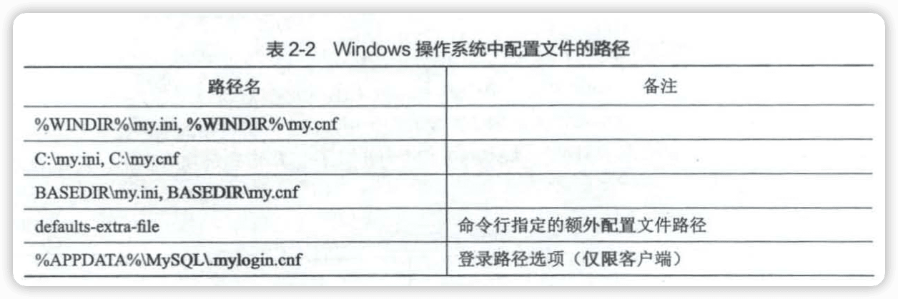

- 前3个路径，配置文件可以`.ini`也可以是`.cnf`
- `%WINDIR`指Windows目录，通常是`C:\WINDOWS`。可以通过`echi %WINDIR%`查看。
- BASEDIR是指MySQL的安装目录路径。
- `%APPDATA%`表示Windows应用程序数据目录，可用`echo %APPDATA%`查看。
- 最后一个`.mylogin.cnf`有点特殊，它不是纯文本文件，是程序mysql_config_editor创建的加密文件。

**类Unix：**

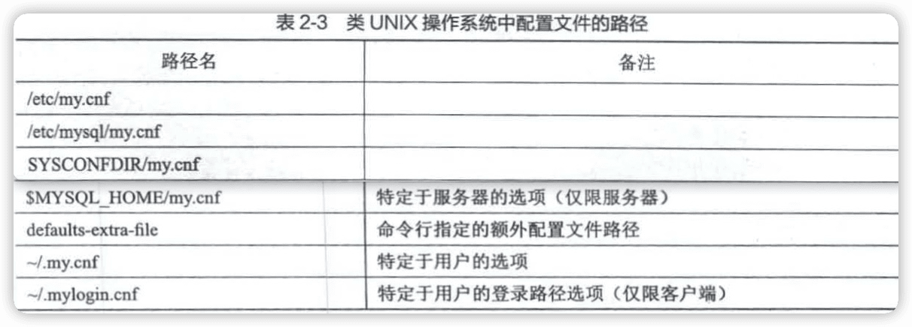

##### 2.配置文件的内容

配置文件中的启动选项被划分为若干个组，不同选项组给不同程序使用。

```ini
[server]
option1
option2 = value2
...

[mysqld]
option1
option2 = value2
...

[mysqld_safe]
option1
option2 = value2
...

[client]
option1
option2 = value2
...

[mysql]
option1
option2 = value2
...

[mysqladmin]
option1
option2 = value2
...
```


##### 3.特定MySQL版本的专用选项组

```ini
# 只有对应版本的mysqld才能使用
[mysqld-5.7]
```

##### 4.配置文件的优先级

配置文件读取，是按照表2-2或表2-3的顺序一次加载，相同启动选项，以最后一个配置文件为准。

##### 5.同一个配置文件中多个组的优先级

以最后一个出现的组中的启动选项为准。

##### 6.defaults-file的使用

不想让MySQL到默认的路径下搜索配置文件。

```shell
mysqld --defaults-file=/tmp/myconfig.txt
```

程序启动时只在`/tmp/myconfig.txt`路径下搜索配置文件。

#### 在命令行和配置文件中启动选项的区别

除defaults--extra-file、defaults-file这样的本身指定配置文件路径的，在命令行汇总指定的启动选项都可以放到配置文件中。

命令行的优先级高于配置文件。

### 2.2 系统变量

**系统变量**：MySQL服务器程序在运行过程中会用到许多影响程序行为的变量。

有好几百个。

可以通过启动服务器时的启动选项配置。

大多说系统变量的值也可以在程序运行过程中修改，而无须停止并停止并重新启动服务器。

#### 查看系统变量

```mysql
Show Variables [Like 匹配的模式];
```

#### 设置系统变量

##### 1.通过启动选项设置

> **注**：系统变量，各单词之间只能用`_`连接。

##### 2.运行中设置

系统变量有作用范围之分：

- Global（全局范围）：影响服务器的整体操作。
- Session（会话范围）：影响某个客服端连接的操作。

服务器程序运行期间通过客服端程序设置系统变量的语法：

```mysql
Set [Global|Session] 系统变量名 = 值;
-- 或
Set [@@(Global|Session).]系统变量名 = 值;
```

如果在设置系统变量的语句中省略了作用范围，默认是Session。

查看不同作用范围的系统变量：

```mysql
Show [Global|Session] Variables [Like 匹配的模式];
```

> **注：**
>
> - 一些系统变量只具有Global作用范围，如max_connections
> - 一些系统变量只具有Session作用范围，如inser_id
>
> - 有些系统变量是只读的，如version

##### 3.启动选项和系统变量的区别

- 大部分的系统变量都可以当作启动选项传入。
- 有些系统变量是在程序运行过程中自动生成的，不可以当作启动选项来设置，比如 character_set_client。
- 有些启动选项也不是系统变量，比如 defaults-file。

### 2.3 状态变量

MySQL服务器程序运行状态的变量。

```mysql
Show [Global|Session] Variables [Like 匹配的模式];
```

```mysql
mysql> show status like 'thread%';
+-------------------+-------+
| Variable_name     | Value |
+-------------------+-------+
| Threads_cached    | 2     |
| Threads_connected | 1     |
| Threads_created   | 3     |
| Threads_running   | 2     |
+-------------------+-------+
4 rows in set (0.00 sec)
```


## 3 字符集和比较规则

### 3.1 简介

将字符映射成二进制数据的过程叫作**编码**，将二进制数据映射到字符的过程叫作**解码**。

抽象出的概念，**字符集**：描述某个字符范围的编码规则。

直接用字符对应的二进制比较大小的比较规则叫**二进制比较规则**。

同一种字符集可以有多种比较规则。

#### 一些重要的字符集

- ASCII字符集。128个字符，一个字节编码。

- ISO 8859-1字符集（Latin1）。256个字符（在ASCII基础扩充了128个西欧常用字符）。一个字节编码。

- GB2312字符集。6762个汉字+682个其它。对应ASCII字符的一个字节编码，其它两个字节编码。（**变长编码方式**）

  > <u>计算机读取一个字节序列时，怎么区分某个字节代表的是一个单独的字符还是某个字符的一部分呢？</u>
  >
  > ASCII的最高位某人为0，如果为1就是两个字节代表一个单独的字符。

- GBK字符集。对GB2312的扩充。

- UTF-8字符集。几乎收录世界各国使用的字符，而且还在不断扩充。1~4个字节编码。

  > UTF-8只是Unicode字符集的一中编码方案，其它有UTF-16（2或4字节编码）、UTF-32（4字节编码）。

  

### 3.2 MySQL中支持的字符集和比较规则

#### MySQL中的utf8和utf8mb4

- uft8mb3（简称utf8）：阉割过的UTF-8字符集，只使用1~3字节。
- utf8mb4：正宗的UTF-8字符集，1~4个字节。MySQL8.0已经优化，默认字符集。

#### 字符集的查看

```mysql
-- `Character Set`和`Charset`是同义词
Show (Character Set|Charset) [Like 匹配的模式];
```

#### 比较规程的查看

```mysql
Show Collation [Like 匹配的模式];

mysql> show Collation Like 'utf8\_%';
+--------------------------+---------+-----+---------+----------+---------+---------------+
| Collation                | Charset | Id  | Default | Compiled | Sortlen | Pad_attribute |
+--------------------------+---------+-----+---------+----------+---------+---------------+
| utf8_bin                 | utf8    |  83 |         | Yes      |       1 | PAD SPACE     |
| utf8_croatian_ci         | utf8    | 213 |         | Yes      |       8 | PAD SPACE     |
| utf8_czech_ci            | utf8    | 202 |         | Yes      |       8 | PAD SPACE     |
| utf8_danish_ci           | utf8    | 203 |         | Yes      |       8 | PAD SPACE     |
| utf8_esperanto_ci        | utf8    | 209 |         | Yes      |       8 | PAD SPACE     |
| utf8_estonian_ci         | utf8    | 198 |         | Yes      |       8 | PAD SPACE     |
| utf8_general_ci          | utf8    |  33 | Yes     | Yes      |       1 | PAD SPACE     |
| utf8_general_mysql500_ci | utf8    | 223 |         | Yes      |       1 | PAD SPACE     |
| utf8_german2_ci          | utf8    | 212 |         | Yes      |       8 | PAD SPACE     |
| utf8_hungarian_ci        | utf8    | 210 |         | Yes      |       8 | PAD SPACE     |
| utf8_icelandic_ci        | utf8    | 193 |         | Yes      |       8 | PAD SPACE     |
| utf8_latvian_ci          | utf8    | 194 |         | Yes      |       8 | PAD SPACE     |
| utf8_lithuanian_ci       | utf8    | 204 |         | Yes      |       8 | PAD SPACE     |
| utf8_persian_ci          | utf8    | 208 |         | Yes      |       8 | PAD SPACE     |
| utf8_polish_ci           | utf8    | 197 |         | Yes      |       8 | PAD SPACE     |
| utf8_romanian_ci         | utf8    | 195 |         | Yes      |       8 | PAD SPACE     |
| utf8_roman_ci            | utf8    | 207 |         | Yes      |       8 | PAD SPACE     |
| utf8_sinhala_ci          | utf8    | 211 |         | Yes      |       8 | PAD SPACE     |
| utf8_slovak_ci           | utf8    | 205 |         | Yes      |       8 | PAD SPACE     |
| utf8_slovenian_ci        | utf8    | 196 |         | Yes      |       8 | PAD SPACE     |
| utf8_spanish2_ci         | utf8    | 206 |         | Yes      |       8 | PAD SPACE     |
| utf8_spanish_ci          | utf8    | 199 |         | Yes      |       8 | PAD SPACE     |
| utf8_swedish_ci          | utf8    | 200 |         | Yes      |       8 | PAD SPACE     |
| utf8_tolower_ci          | utf8    |  76 |         | Yes      |       1 | PAD SPACE     |
| utf8_turkish_ci          | utf8    | 201 |         | Yes      |       8 | PAD SPACE     |
| utf8_unicode_520_ci      | utf8    | 214 |         | Yes      |       8 | PAD SPACE     |
| utf8_unicode_ci          | utf8    | 192 |         | Yes      |       8 | PAD SPACE     |
| utf8_vietnamese_ci       | utf8    | 215 |         | Yes      |       8 | PAD SPACE     |
+--------------------------+---------+-----+---------+----------+---------+---------------+
28 rows in set (0.01 sec)
```

- 比较规则的名称以其关联的字符集名称开头
- 中间紧跟着该比较规则所应用的语言。如，utf8_polish_ci表示波兰语的比较规则...，utf8_general_ci是通用的比较规则。
- 名称后缀表示该比较规则是否区分语言中的重音、大小写等。


### 3.3 字符集和比较规则的应用

#### 各级别的字符集和比较规则

##### 1.服务级别

服务级别的字符集和比较规则的系统变量：character_set_server, collation_server

##### 2.数据库级别

在创建和修改数据库时可以指定，具体语法：

```mysql
Create Database 数据库名
	[[Default] Character set 字符集名称]
	[[Default] Collate 比较规则名称];
	
Alter Database 数据库名
	[[Default] Character set 字符集名称]
	[[Default] Collate 比较规则名称];
```

```mysql
Create Database charset_demo_db
Character Set gb2312
Collate gb2312_chinese_ci;
```


对应的系统变量：character_set_database, collation_database

##### 3.表级别

也可在创建和修改表时指定，具体语法：

```mysql
Create Table 表名(列的信息)
	[[Default] Character set 字符集名称]
	[Collate 比较规则名称];
	
Alter Table 表名
	[[Default] Character set 字符集名称]
	[Collate 比较规则名称];
```

```mysql
Create Table t (
	col Varchar(10)
) character Set utf8 collate utf8_general_ci;
```


##### 4.列级别

对于存储字符串的列，同一个表中不同的列也可以有不同的字符集和比较规则。

```mysql
Create Table 表名(
	列名 字符串类型 [Character set 字符集名称] [Collate 比较规则名称],
  ...
);

Alter Table 表名 Modify 列名 字符串类型 [Character set 字符集名称] [Collate 比较规则名称];
```

##### 5.仅修改字符集或仅修改比较规则

- 只修改字符集，则比较规则将变为修改后的字符集默认的比较规则；
- 只修改比较规则，则字符集将变为修改后的比较规则对应的字符集。

##### 6.各级别字符集和比较规则小结

- 如果创建或修改列时没有显式指定字符集和比较规则，则该列默认使用表的宇符集和比较规则；
- 如果创建表时没有显式指定字符集和比较规则，则该表默认使用数据库的字符集和比较规则；
- 如果创建数据库时没有显式指定字符集和比较规则，则该数据库默认使用服务器的字符集和比较规则。

#### 客户端和服务器通信过程中使用的字符集

##### 1.编码和解码使用的字符集不一致

> '我'在UTF-8字符集编码下的字节序列是0xE68891。如果程序A把这个字节序列发送到程序B，程序B使用不同的字符集解码（假设使用GBK），过程如下：（可通过在线工具 [汉字字符集编码查询](https://www.qqxiuzi.cn/bianma/zifuji.php) 测试）
>
> a. 首先看第一个字节0xE6，大于0x7F（十进制127），说明待读取字符是两字节编码。继续读一字节后得到 OxE688，然后从 GBK 编码表中查找字节为 0xE688 对应的字符，发现是字符'鎴'。
> b. 继续读一个字节 0x91，它的值也大于 0x7F，试图再读一个字节时发现后边没有了，所以这是半个字符。
> c. 最终，0xE68891被 GBK 字符集解释成一个字符'鎴'和半个字符。

##### 2.字符集转换

如果接受`0xE68891`这个字节序列的程序按照UTF-8字符集解码（得到二进制序列为`111001101000100010010001`）；然后再按照GBK字符集进行编码，编码后的字节序列为0xCED2。这个过程就叫作**字符集转换**。

##### 3.MySQL中的字符集转换过程


这三个系统变量作用范围都是Session级别。


🔖

#### 比较规则的应用

比较规则通常用来比较字符串的大小以及对某些字符进行排序，所以也称为**排序规则**。

```mysql
Insert Into t(col) Values('a'), ('b'), ('A'), ('B'), ('我');
```

```mysql
-- 默认gbk_chinese_ci不区分大小写
mysql> Select * From t Order By col;
+------+
| col  |
+------+
| a    |
| A    |
| b    |
| B    |
| 我   |
+------+
5 rows in set (0.00 sec)


-- gbk_bin是比较字符的二进制编码，所以区分大小写
mysql> Alter Table t Modify col Varchar(10) Collate gbk_bin;
Query OK, 5 rows affected (0.02 sec)
Records: 5  Duplicates: 0  Warnings: 0

mysql> Select * From t Order By col;
+------+
| col  |
+------+
| A    |
| B    |
| a    |
| b    |
| 我   |
+------+
5 rows in set (0.00 sec)
```


## 4 从一条记录说起——InnoDB「记录」存储结构

### InnoDB页简介

InnoDB以**页**作为磁盘和内存之间交互的基本单位。页的大小一般为16KB（16384）。对应系统变量是`innodb_page_size`，只能在第一次<u>初始化MySQL数据目录</u>时指定，服务器运行时不能更改。

### InnoDB行格式

4中**行格式**（也叫作**记录格式**）：Compact、Redundant、Dynamic、Compressed。

#### 指定行格式的语法

```mysql
Create Table 表名 (列的信息) Row_Format=行格式名称;

Alter Table 表名 Row_Format=行格式名称;
```

```mysql
Create Table record_format_demo (
	c1 varchar(10),
  c2 varchar(10) not null,
  c3 char(10),
  c4 varchar(10)
) Charset=ascii Row_Format=Compact;

Insert into record_format_demo(c1, c2, c3, c4) values('aaaa', 'bbb', 'cc', 'd'), ('eeee', 'fff', Null, Null);
```

```mysql
mysql> select * from record_format_demo;
+------+-----+------+------+
| c1   | c2  | c3   | c4   |
+------+-----+------+------+
| aaaa | bbb | cc   | d    |
| eeee | fff | NULL | NULL |
+------+-----+------+------+
2 rows in set (0.00 sec)
```

#### Compact行格式


一条完整的记录分为两大部分：

##### 1.记录的额外信息

###### a 变长字段长度列表

MySQL支持一些变长的数据类型：Varchar(M)、Varbinary(M)、各种Text类型、各种Blob类型。

变长字段占用的存储空间分为两个部分：**真正的数据内容；该数据占用的字节数**。

**逆序存放**

表record_format_demo的c1、c2、c4字段都是varchar(10)，这3个列的值<u>占用的存储空间字节数</u>保存在记录开头处。

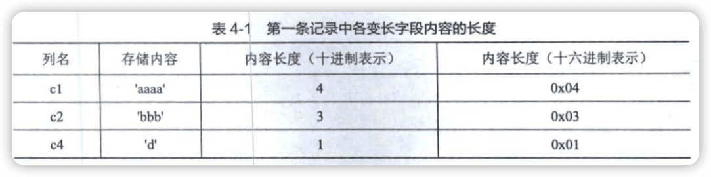


<u>变长字段的真实数据占用的字节数是用1字节还是2字节表示？</u> InnoDB通过W、M、L是三个符号制定一套规则，这个三个符号的意义：

- 某个字符集表示一个字符最多需要W**字节**。（比如utf8mb4的W是4，utf8是3，gbk是2，ascii是1）
- 对于varchar(M)，表示这种类型最多能存储M个**字符**。那么这种类型表示的字符串最多占用的字节数就是`M * W`。
- L表示变长字段实际存储的字符串占用的**字节数**。

规则：

- M * W <= 255，使用1个字节表示变长字段的真实数据占用的字节数。

- M * W > 255

  L <= 127，1字节

  L > 127，2字节

总结：<u>如果该变长字段允许存储的最大字节数（M * W）超过255字节，并且真实数据占用的字节数(L）超过 127字节，则使用2字节来表示真实数据占用的字节数，否则使用 1字节。</u>

**变长字段长度列表中只存储值为非NULL 的列的肉容长度。**


###### b NULL值列表

Compact行格式把一条记录中值为NULL的行统一管理起来（节省空间），存储在NULL值列表中。

🔖


###### c 记录头信息

固定5字节，也就是40个二进制位。前4位称为**info bit**。


record_format_demo表中的两条记录的记录头信息：


##### 2.记录的真实数据

MySQL会为每个记录默认地添加一些**隐藏列**：


> InoDB 表的**主键生成策略**：
>
> - 优先使用用户自定义的主键作为主键；
> - 如果用户没有定义主键，则选取一个不允许存储 NULL 值的Unique 键作为主键；
> - 如果表中连不允许存储NULL 值的 Unique 键都没有定义，则InnoDB 会为表默认添加个名为row_id的隐藏列作为主键。

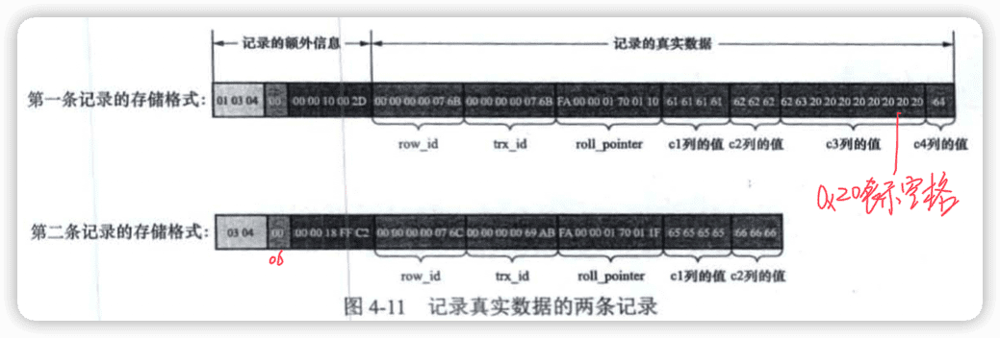

##### 3.Char(M)列的存储格式

🔖

#### Redundant行格式


##### 1.字段长度偏移列表


##### 2.记录头信息


##### 3.记录头信息中的1byte_offs_flag的值是怎么选择的


##### 4.Redundant行格式中NULL值得处理


##### 5.Char(M)列的存储格式


#### 溢出列

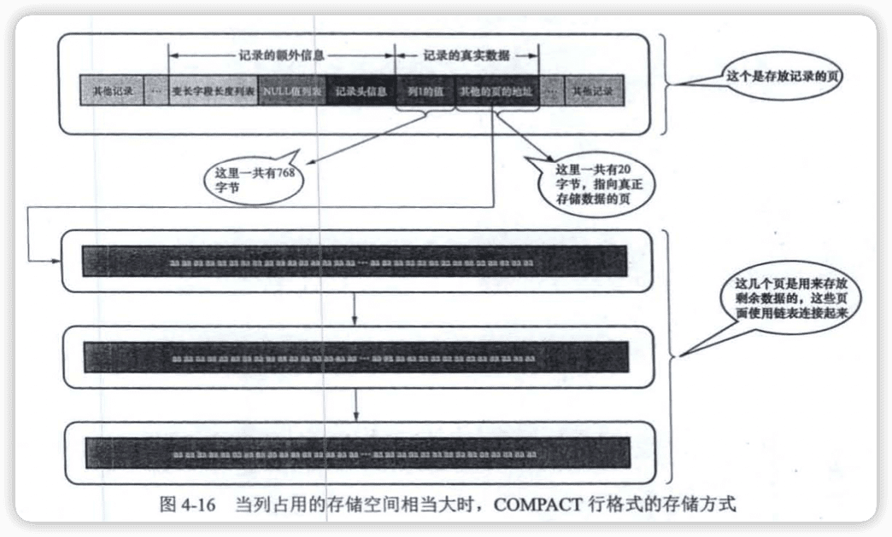

#### Dynamic行格式和Compressed行格式


## 5 盛放记录的大盒子——InnoDB数据页结构

### 5.1 不同类型的页简介

InnoDB**为了不同的目的而设计了多种不同类型的页**，比如存放表空间头部信息的页、存放Chang Buffer信息的页、存放INODE信息的页、存放undo日志信息的页等等，当然还又存放表中**记录**的页，官方称这种为<font color=#FF8C00>索引（INDEX）页</font>。

### 5.2 数据页结构快览


### 5.3 记录在页中的存储

一开始生成页的时候，并没有**User Records**，每当插入一条记录时，都会从**Free Space**部分申请一个记录大小的空间划分为User Records。当Free Space的空间被全部划分为User Records时，就意味着这个页使用完了。


#### 记录头信息的秘密

```mysql
Create Table page_demo(
	c1 int,
  c2 int,
  c3 Varchar(10000),
  Primary Key (c1)
) Charset=ascii Row_format=Compact;
```


上图为了方便用十进制表示二进制，实际每条记录存储时是没有间隙的。

[表4-2](#c 记录头信息)记录头信息说明。

- deleted_flag。**垃圾链表**
- min_rec_flag
- n_owned
- heap_no 


- record_type：表示当前记录的类型，共四种，0表示普通记录，1表示B+非叶节点的目录项记录，2表示Infimum记录，3表示Supremum记录。
- next_record：表示从当前记录的真实数据到下一条记录的真实数据的距离。


### 5.4 Page Directory（页目录）

记录在页中是按照主键值有小到大的顺序串联成一个单向链表。

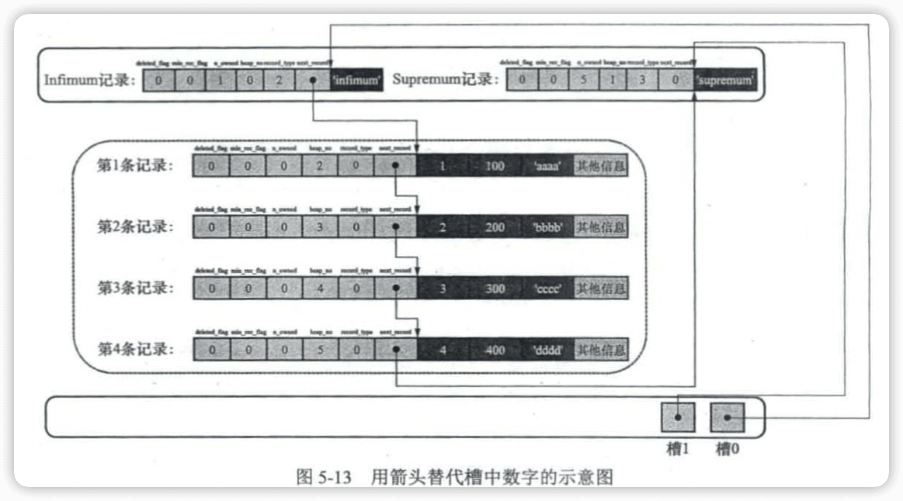


### 5.5 Page Header（页面头部）

Page Header（页面头部）用来记录数据页中**记录**的状态信息，比如数据页中已经存储了多少条记录、Free Space在页面中的地址偏移量、页目录中存储了多少个槽等。


### 5.6 File Header（文件头部）

各种类型的页都会一File Header作为第一个组成部分，它描述了一些通用于各种页的信息，比如这个页的编号是多少，它的上一个页和下一个页是谁等。共39字节：


### 5.7 File Trailer（文件尾部）

为了检查一个页是否完整。


## 6 快速查询的秘籍——B+树索引

各个数据页组成一个双向链表，而每个数据页中的记录会按照主键值从小到大的顺序组成一个单向链表。

### 6.1 没有索引时进行查找

#### 在一个页中查找


#### 在很多页中查找


### 6.2 索引

```mysql
Create Table index_demo(
	c1 Int,
  c2 Int,
  c3 Char(1),
  Primary Key(c1)
) Row_Format = Compact;
```


#### 一个简单的索引方案


#### InnoDB的索引方案


##### 1.聚簇索引


##### 2.二级索引


##### 3.联合索引


#### InnoDB中B+树索引的注意事项

##### 1.跟页面往年不动窝


##### 2.内节点中目录项记录的唯一性


##### 3.一个页面至少容纳2条记录


#### MyISAM的索引方案简介


#### MySQL中创建和删除索引的语句


> 总结
>
> InnoDB 存储引擎的索引是一棵B+树，完整的用户记录都存储在 B+树第0层的**叶子节点**；其他层次的节点都属于**内节点**，内节点中存储的是**目录项记录**。
> InnoDB 的索引分为两种：
>
> 1. 聚筷索引：以主键值的大小作为页和记录的排序规则，在叶子节点处存储的记录包含
>    了表中所有的列。
> 2. 二级索引：以索引列的大小作为页和记录的排序规则，在叶子节点处存储的记录内容
>    是索引列＋主键。
>
> InnoDB 存储引擎的 B+树根节点自创建之日起就不再移动。
> 在二级索引的B+树内节点中，目录项记录由索引列的值、主键值和页号组成。
>
> 一个数据页至少可以容纳2条记录。
>
> MyISAM 存储引擎的数据和索引分开存储，这种存储引擎的索引全部都是二级索引，在叶子节点处存储的是列＋行号（对于定长记录格式的记录来说）。


## 7 B+树索引的使用

### 7.1 B+树索引示意图的简化


### 7.2 索引的代价


### 7.3 应用B+树索引

#### 扫描区间和边界条件

**全表扫描**


##### 1.所有搜索条件都可以生成合适的扫描区间的情况


##### 2.有的搜索条件不能生成合适的扫描区间的情况


##### 3.从复杂的搜索条件中找出扫描区间


##### 4.使用联合索引执行查询时对应的扫描区间


#### 索引用于排序


##### 1.使用联合索引进行排序时的注意事项


##### 2.不可以使用索引进行排序的几种情况

- ASC、DESC混用
- 排序列包含非同一个索引的列
- 排序列是某个联合索引的索引列

- 用来形成扫描区间的索引列与排序列不同
- 排序列不是以单独列的形式出现在Order By子句中

#### 索引用于分组


### 7.4 回表的代价


### 7.5 更好地创建和使用索引


## 8 数据的家——MySQL的数据目录

### 8.1 数据库和文件系统的关系

想InnoDB、MyISAM这样的存储引擎都是把数据存储在文件系统上。那么它们的数据是如何在文件系统中存储的？

### 8.2 MySQL数据目录

#### 数据目录和安装目录的区别

数据目录时用来存储MySQL在运行过程中产生的数据。

```mysql
Show variables like 'datadir';
+---------------+--------------------------+
| Variable_name | Value                    |
+---------------+--------------------------+
| datadir       | /opt/homebrew/var/mysql/ |
+---------------+--------------------------+
1 row in set (0.00 sec)
```


### 8.3 数据目录的结构

#### 数据库在文件系统中的表示

每个数据库都对应数据目录下的一个子目录。

每当创建一个数据库是，MySQL会做两件事：

- 在数据目录下创建一个与数据库名同名的子目录
- 在子目录下创建**db.opt**文件（存储一些如字符集和比较规则的数据属性）

#### 表在文件系统中的表示

表信息：

- 表结构（名称、列数、每个列的数据类型、约束条件、索引、字符集、比较规则等）
- 表数据

> Mysql8后 表结构文件.frm和到.idb中了。


##### MyISAM

```mysql
CREATE TABLE  `test_myisam`(
   `id` INT  AUTO_INCREMENT, 
   `title` VARCHAR(100) NOT NULL,
   `author` VARCHAR(40) NOT NULL,
   PRIMARY KEY ( `id` )
)ENGINE=MyISAM DEFAULT CHARSET=utf8;
```

.frm－－存储数据表定义，此文件非MyISAM引擎的一部分。

.MYD－－存放真正的数据。

.MYI－－存储索引信息。

#### 其它文件

- 服务器进程文件（`*.pid`）

- 服务器日志文件（`*.err`）

- SSL和RSA证书与密钥文件

  ```shell
  ll  /opt/homebrew/var/mysql/*.pem
  -rw-------  1 andyron  admin   1.6K 11  4 20:48 /opt/homebrew/var/mysql/ca-key.pem
  -rw-r--r--  1 andyron  admin   1.1K 11  4 20:48 /opt/homebrew/var/mysql/ca.pem
  -rw-r--r--  1 andyron  admin   1.1K 11  4 20:48 /opt/homebrew/var/mysql/client-cert.pem
  -rw-------  1 andyron  admin   1.6K 11  4 20:48 /opt/homebrew/var/mysql/client-key.pem
  -rw-------  1 andyron  admin   1.6K 11  4 20:48 /opt/homebrew/var/mysql/private_key.pem
  -rw-r--r--  1 andyron  admin   452B 11  4 20:48 /opt/homebrew/var/mysql/public_key.pem
  -rw-r--r--  1 andyron  admin   1.1K 11  4 20:48 /opt/homebrew/var/mysql/server-cert.pem
  -rw-------  1 andyron  admin   1.6K 11  4 20:48 /opt/homebrew/var/mysql/server-key.pem
  ```

  

### 8.4 文件系统对数据库的影响

- 数据库名称和表名称不得超过文件系统所允许的最大长度
- 特殊字符的问题
- 文件长度受文件系统最大长度的限制。


### 8.5 MySQL系统数据库简介

- mysql：存储了 MySQL 的用户账户和权限信息、一些存储过程和事件的定义信息、一些运行过程中产生的日志信息、一些帮助信息以及时区信息等。
- information_schema：保存着MySQL 服务器维护的所有其他数据库的信息
  比如有哪些表、哪些视图、哪些触发器、哪些列、哪些索引等。这些信息并不是真实的用户数据，而是一些<u>描述性信息</u>，有时候也称之为<u>元数据</u>。
- performance_schema：主要保存MySQL 服务器运行过程中的一些<u>状态信息</u>，算是对 MySQL 服务器的一个<u>性能监控</u>。它包含的信息有统计最近执行了哪些语句，在执行过程的每个阶段都花费了多长时间，内存的使用情况等。
- sys：这个数据库主要是通过视图的形式把 information_schema 和 performance_schema结合起来，让开发人员更方便地了解MySQL 服务器的性能信息


## 9 存放页面的大池子——InnoDB的表空间

**表空间**是一个抽象的概念，可以把它想象成被切分为许多个页的池子，当想为某个表插入一条记录的时候，就从池子中捞出一个对应的页把数据写进去。


### 9.2 独立表空间结构

#### 区的概念

为了管理表空间中页，有了**区（extent）**。一个区是连续的64个页，也就是16K*64=1M。系统表空间和独立表空间都可以看成若干连续的区组成，每256区被划分成一**组**，每个组最开始的几个页面的类型是固定。


#### 段的概念


#### 区的分类


#### 段的结构

段是一个逻辑上的概念，是某些零散的页面以及一些完整的区的集合。


#### 各类型页面详细情况

##### 1.FSP_HDR类型


##### 2.XDES类型


##### 3.IBUF_BITMAP类型


##### 4.INODE类型


#### Segment Header 结构的运用


#### 真实表空间对应的文件大小


### 9.3 系统表空间

#### 整体结构

系统表空间不同于独立表空间的地方就是**在表空间开头有许多记录整个系统属性的页面**：

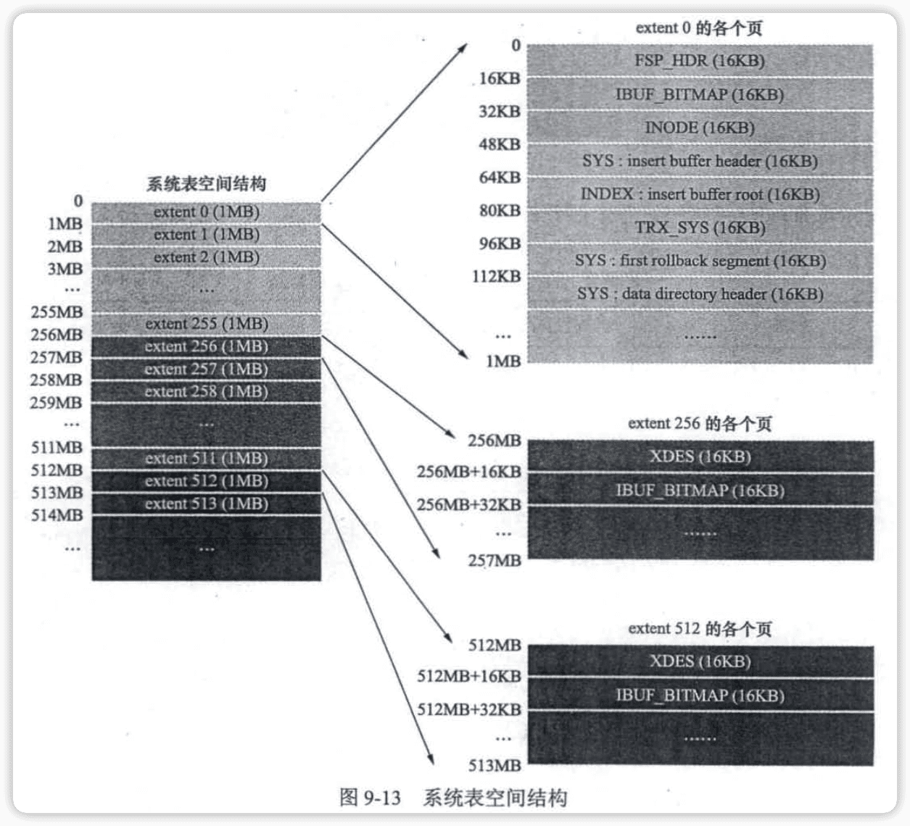


## 10 条条大路通罗马——单表访问方法

优化器

执行计划

### 10.1 访问方法的概念


### 10.2 const


### 10.3 ref


### 10.4 ref_or_null


### 10.5 range


### 10.6 index


### 10.7 all


### 10.8 注意事项

#### 索引合并


#### Union索引合并


#### Sort-Union索引合并


## 11 两个表的亲密接触——连接的原理


### 11.1 连接简介

#### 连接的本质

连接就是把各个表中的记录都取出来进行一次匹配，并把匹配后的组合发给客户端。

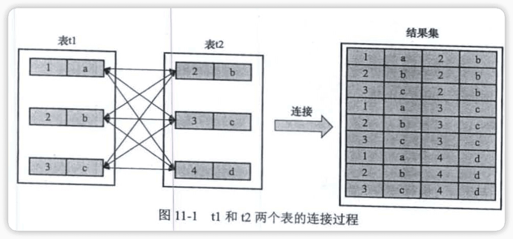

#### 连接过程简介


#### 内连接和外连接

两者区别，在驱动表中的记录不符合ON子句中的连接条件时，内连接不会把该记录加入到最后的结果集中，而外连接会。


### 11.2 连接的原理

#### 嵌套循环连接


#### 使用索引加快连接速度


#### 基于块的嵌套循环连接


## 12 谁最便宜就选谁——基于成本的优化

### 12.1 什么是成本

- I/O成本
- CPU成本


### 12.2 单表查询的成本


#### 基于成本的优化步骤

##### 1.根据搜索条件，找出所有可能使用的索引


##### 2.计算全表扫描的代价


##### 3.计算使用不同索引执行查询的代价


##### 4.对比各种执行方案的代价，找出成本最低的那个方案


#### 基于索引统计数据的成本计算


### 12.3 连接查询的成本


#### 条件过滤


#### 两表连接的成本分析


#### 多表连接的成本分析


### 12.4 调节成本常数


#### mysql.server_cost表

记录了在server层进行的一些操作所对应的成本常数。

```mysql
mysql> select * from mysql.server_cost;
+------------------------------+------------+---------------------+---------+---------------+
| cost_name                    | cost_value | last_update         | comment | default_value |
+------------------------------+------------+---------------------+---------+---------------+
| disk_temptable_create_cost   |       NULL | 2021-11-04 20:48:00 | NULL    |            20 |
| disk_temptable_row_cost      |       NULL | 2021-11-04 20:48:00 | NULL    |           0.5 |
| key_compare_cost             |       NULL | 2021-11-04 20:48:00 | NULL    |          0.05 |
| memory_temptable_create_cost |       NULL | 2021-11-04 20:48:00 | NULL    |             1 |
| memory_temptable_row_cost    |       NULL | 2021-11-04 20:48:00 | NULL    |           0.1 |
| row_evaluate_cost            |       NULL | 2021-11-04 20:48:00 | NULL    |           0.1 |
+------------------------------+------------+---------------------+---------+---------------+
6 rows in set (0.00 sec)
```


##### mysql.engine_cost表

记录了在存储引擎层进行的一些操作所对应的成本常数。


## 13 InnoDB统计数据是如何收集的

```mysql
Show Table status;
SHOW INDEX FROM <表名>;
```

InnoDB的统计信息是不精确的估计值。

### 13.1 统计数据的存储方式

#### 13.2 基于磁盘的永久性统计数据

存储在两个表中：

```mysql
mysql> show tables from mysql like 'innodb%stats';
+--------------------------------+
| Tables_in_mysql (innodb%stats) |
+--------------------------------+
| innodb_index_stats             |
| innodb_table_stats             |
+--------------------------------+
2 rows in set (0.00 sec)
```

#### innodb_table_stats


#### innodb_index_stats


#### 定期更新统计数据


#### 手动更新


### 13.3 基于内存的非永久性统计数据


## 14 基于规则的优化（内含子查询优化二三事）

**查询重写**

### 14.1 条件化简

#### 移除不必要的括号


#### 常量传递


#### 移除没用的条件


#### 表达式计算


#### Having子句和Where子句的合并


#### 常量表检测


### 14.2 外连接消除


### 14.3 子查询优化

#### 子查询语法


#### 子查询在MySQL中是怎么执行的


##### 2.标量子查询、行子查询的执行方式

##### 3.In子查询优化


##### 4.Any/All子查询优化


##### 5.[Not]Exists子查询的执行


##### 6.对于派生表的优化


## 15 查询优化的百科全书——Explain详解

MySQL查询优化器在基于成本和规则对一条查询语句进行优化后，会生成一个**执行计划**，它展示了接下来执行查询的具体方式，比如<u>多表连接的顺序是什么，采用什么访问方法来具体查询每个表等</u>。

```mysql
mysql> Explain select 1;
+----+-------------+-------+------------+------+---------------+------+---------+------+------+----------+----------------+
| id | select_type | table | partitions | type | possible_keys | key  | key_len | ref  | rows | filtered | Extra          |
+----+-------------+-------+------------+------+---------------+------+---------+------+------+----------+----------------+
|  1 | SIMPLE      | NULL  | NULL       | NULL | NULL          | NULL | NULL    | NULL | NULL |     NULL | No tables used |
+----+-------------+-------+------------+------+---------------+------+---------+------+------+----------+----------------+
1 row in set, 1 warning (0.00 sec)
```

EXPLAIN 语句输中的各个列的作用

|     列名      |                             描述                             |
| :-----------: | :----------------------------------------------------------: |
|      id       |   在一个大的查询语句中，每个select关键字都对应一个唯一的id   |
|  select_type  |                  select关键字对应的查询类型                  |
|     table     |                             表名                             |
|  partitions   |                        匹配的分区信息                        |
|     type      |                      针对单表的访问方法                      |
| possible_keys |                        可能用到的索引                        |
|      key      |                        实际使用的索引                        |
|    key_len    |                      实际使用的索引长度                      |
|      ref      |    当使用索引列等值查询时，与索引列进行等值匹配的对象信息    |
|     rows      |                   预估的需要读取的记录条数                   |
|   filtered    | 针对预估的需要读取的记录，经过搜索条件过滤后剩余记录条数的百分比 |
|     Extra     |                         一些额外信息                         |

##### 

```mysql
Create Table single_table (
  id INT NOT NULL AUTO INCREMENT,
  key1 VARCHAR (100),
  key2 INT,
  key3 VARCHAR (100),
  key_part1 VARCHAR(100),
  key_part2 VARCHAR(100),
  key_part3 VARCHAR(100),
  common_field VARCHAR(100),
  PRIMARY KEY (id),
  KEY idx_keyl (keyl),
  UNIQUE KEY uk_key2 (key2),
  KEY idx key3 (key3),
  KEY idx_key_part (key_partl, key_part2, key_part3)
) Engine=InnoDB CHARSET=utf8;
```


### 15.1 执行计划输出中各列详解

#### table

无论查询语句有多复杂，包含多少表，最后都是对每个表今夕单表访问。**Explain语句输出的每条记录都对应这某个单表的访问方法**。

#### id


#### select_type

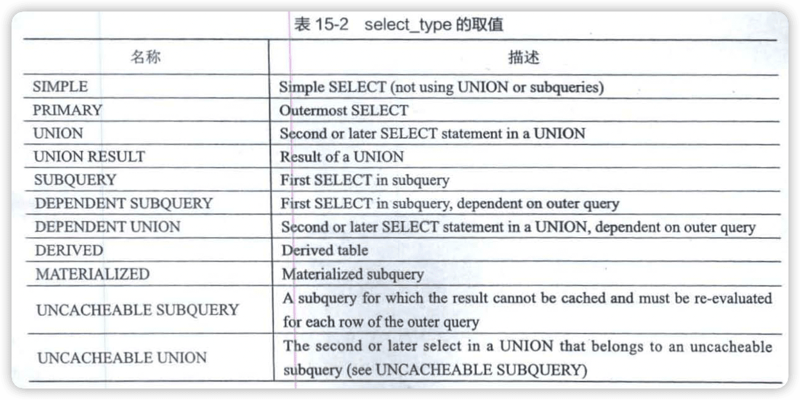


#### type

访问方法类型，有system、const、eq_ref、ref、fulltext、ref_or_null、index_merge、unique_subquery、index_subquery、rang、index、ALL等。


#### possible_keys和key


#### key_len


#### ref


#### rows


#### filtered


#### Extra


### 15.2 JSON格式的执行计划

```mysql
mysql> explain format=json select * from vendors\G;
*************************** 1. row ***************************
EXPLAIN: {
  "query_block": {
    "select_id": 1,
    "cost_info": {
      "query_cost": "1.60"
    },
    "table": {
      "table_name": "vendors",
      "access_type": "ALL",
      "rows_examined_per_scan": 6,
      "rows_produced_per_join": 6,
      "filtered": "100.00",
      "cost_info": {
        "read_cost": "1.00",
        "eval_cost": "0.60",
        "prefix_cost": "1.60",
        "data_read_per_join": "5K"
      },
      "used_columns": [
        "vend_id",
        "vend_name",
        "vend_address",
        "vend_city",
        "vend_state",
        "vend_zip",
        "vend_country"
      ]
    }
  }
}
1 row in set, 1 warning (0.00 sec)

ERROR:
No query specified
```


### 15.3  Extented Explain


## 16 神兵利器——optimizer trace的神奇功效

### 16.1 简介

MySQL5.6后新增optimizer trace功能，让用户方便地**查看优化器生成执行计划的整个过程**。

```mysql
show variables like 'optimizer_trace';
+-----------------+--------------------------+
| Variable_name   | Value                    |
+-----------------+--------------------------+
| optimizer_trace | enabled=off,one_line=off |
+-----------------+--------------------------+
```


```mysql
Set optimizer_trace="enabled=on";
```


### 16.2 通过optimizer_trace分析查询优化器的具体工作过程


prepare阶段

optimize阶段

execute阶段


## 17 调节磁盘和CPU的矛盾——InnoDB的Buffer Pool

Buffer Pool是InnoDB想操作系统申请的一段连续的内存空间。

### 17.2 Buffer Pool

**innodb_buffer_pool_size**， 默认128MB，最小5MB

#### 内部组成

缓冲页

控制块


#### free链表的管理


#### 缓冲页的哈希处理


#### flush链表的管理

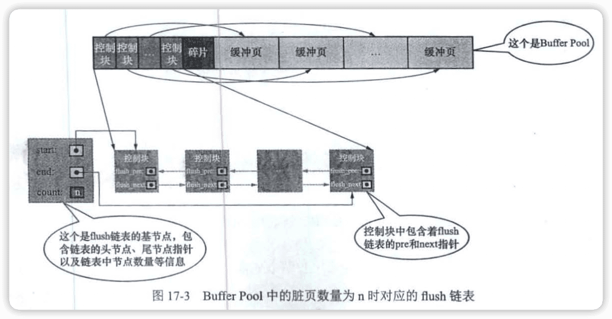


#### LRU链表的管理


##### 1.缓冲区不够的窘境


##### 2.简单的LRU链表


##### 3.划分区域的LRU链表


##### 4.更进一步优化LRU链表


#### 刷新脏页到磁盘


#### 多个Buffer Pool实例

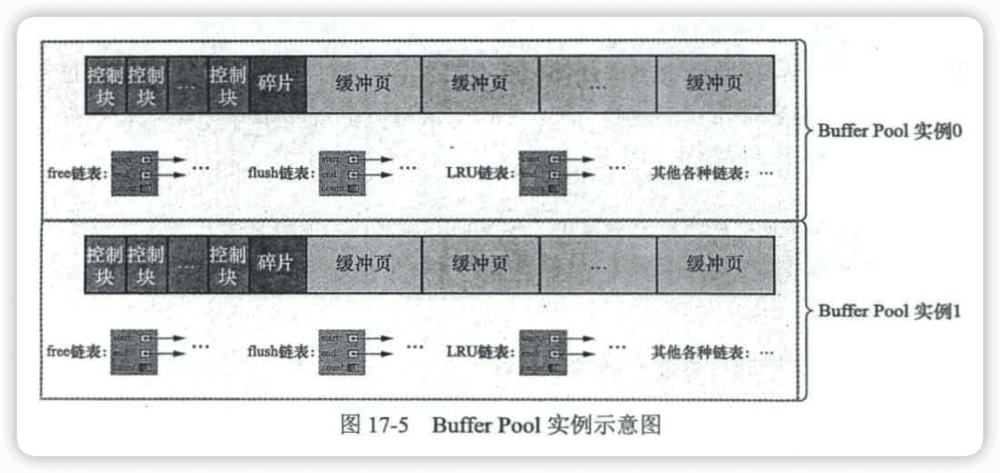

#### innodb_buffer_pool_chunk_size


#### 配置Buffer Pool时的注意事项


#### 查看Buffer Pool的状态信息

```mysql
mysql> show engine innodb status\G;
...
----------------------
BUFFER POOL AND MEMORY
----------------------
Total large memory allocated 0
Dictionary memory allocated 524562
Buffer pool size   8191
Free buffers       5208
Database pages     2876
Old database pages 1041
Modified db pages  0
Pending reads      0
Pending writes: LRU 0, flush list 0, single page 0
Pages made young 2494, not young 74846
0.00 youngs/s, 0.00 non-youngs/s
Pages read 2315, created 942, written 3692
0.00 reads/s, 0.00 creates/s, 0.00 writes/s
No buffer pool page gets since the last printout
Pages read ahead 0.00/s, evicted without access 0.00/s, Random read ahead 0.00/s
LRU len: 2876, unzip_LRU len: 0
I/O sum[0]:cur[0], unzip sum[0]:cur[0]
--------------
...
```


## 18 事务简介

### 18.1 事务的起源

#### 原子性


#### 隔离性


#### 一致性


#### 持久性


### 18.3 MySQL事务的语法

#### 开启事务


#### 提交事务


#### 手动中止事务


#### 支持事务的存储引擎


#### 自动提交


#### 隐式提交


#### 保存点


## 19 说过的话就一定要做到——redo日志


### 19.2 redo日志是啥


在系统因奔溃而重启时需要按照上述内容所记录的步骤重新更新数据页，上述内容称为**重做日志（redo log）**。


### 19.3 redo日志格式

redo日志只是记录了一下事务对数据库进行了哪些修改。


#### 简单的redo日志类型


#### 复杂一些的redo日志类型


### 19.4 Mini-Transaction（MTR）

**Mini-Transaction（MTR）**：对底层页面进行一次原子访问的过程。

#### 以组的形式写入redo日志


### 19.5 redo日志的写入过程

#### redo log block

MTR生成的redo日志存储在512字节的页，这个页叫作**redo log block**（为了区分于之前的页）。


#### redo日志缓冲区

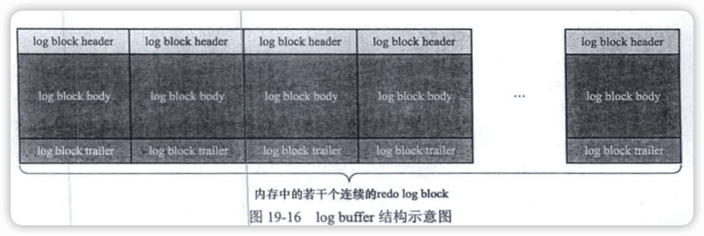

#### redo日志写入log buffer


### 19.6 redo日志文件

#### redo日志刷盘时机


#### redo日志文件组


#### redo日志文件格式


### 19.7 log sequence number（lsn）

#### flushed_to_disk_lsn


#### lsn值和redo日志文件组中的偏移量的对应关系


#### flush链表中的lsn


### 19.8 checkpoint


### 19.9 用户线程批量从flush链表中刷出脏页


### 19.10 查看系统中的各种lsn值

```mysql
Show Engine Innodb Status\G;
...
---
LOG
---
Log sequence number          62003410
Log buffer assigned up to    62003410
Log buffer completed up to   62003410
Log written up to            62003410
Log flushed up to            62003410
Added dirty pages up to      62003410
Pages flushed up to          62003410
Last checkpoint at           62003410
5831 log i/o's done, 0.00 log i/o's/second
----------------------
...
```


### 19.11 innodb_flush_log_at_trx_commit的用法


### 19.12 崩溃恢复


## 20 后悔了怎么办——undo日志

### 20.1 事务回滚的需求

为了回滚而记录的东西称为**撤销日志（undo log）**。


### 20.2 事务id

#### 分配事务id的时机


#### 事务id是怎么生成的


#### trx_id隐藏列


### 20.3 undo日志的格式

#### Insert操作对应的undo日志

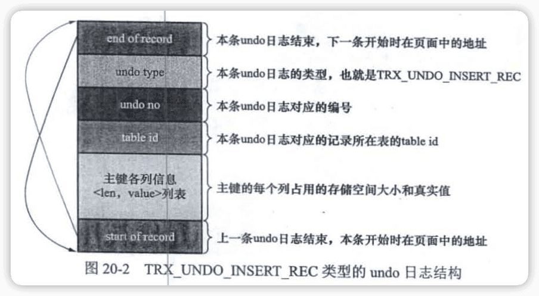

#### Delete操作对应的undo日志


#### Update操作对应的undo日志


#### 增删改操作对二级索引的影响


### 20.4 通用链表结构

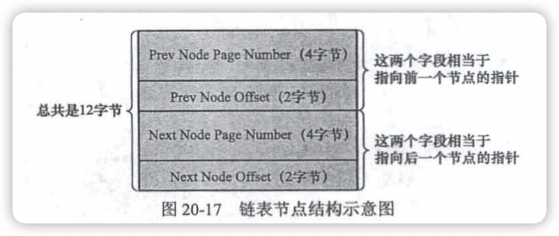


### 20.5 FIL_PAGE_UNDO_LOG页面


### 20.6 Undo页面链表

#### 单个事务中的Undo页面链表


#### 多个事务中的Undo页面链表


### 20.7 undo日志具体写入过程


### 20.8 重用Undo页面


### 20.9 回滚段


### 20.10 回滚段相关配置


### 20.11 undo日志在崩溃恢复时的作用


## 21 一条记录的多幅面孔——事务隔离级别和MVCC

```mysql
Create Table hero (
	number Int,
  name Varchar(100),
  country Varchar(100),
  Primary Key (number)
) Engine=Innodb Charset=utf8;
```


### 21.2 事务隔离级别


#### 事务并发执行时遇到的一致性问题


#### SQL标准中的4中隔离级别

按照可能导致一致性问题的严重性排序：

```
脏写>脏读>不可重复读>幻读
```


#### MySQL中支持的4中隔离级别


### 21.3 MVCC原理

#### 版本链

**多版本并发控制（Multi-Version Concurrency COntrol，MVCC）**


#### ReadView


### 21.4 关于purge


## 22 工作面试老大难——锁

### 22.1 解决并发事务带来问题的两种基本方式

#### 写-写情况


#### 读-写或写-读情况


#### 一致性读


#### 锁定读

##### 1.共享锁和独占锁


##### 2.锁定读的语句


#### 写操作


### 22.2 多粒度锁


### 22.3 MySQL中的行锁和表锁

#### 其它存储引擎中的锁


#### InnoDB中的锁


#### InnoDB锁的内存结构


### 22.4 语句加锁分析


#### 普通的Select语句


#### 锁定读的语句


#### 半一致性读的语句

半一致性读的语句（Semi-COnsistent Read）是一种夹在一致性读和锁定读之间的读取方式


#### Insert语句


### 22.5 查看事务加锁情况

#### 使用information_schema数据库中的表索取锁信息


### 22.6 死锁


