《MySQL是怎样运行的》笔记
----

作者：小孩子4919

## 1 初始MySQL

MySQL的服务器程序和客户端程序

我的电脑安装目录：

```
/opt/homebrew/Cellar/mysql/8.0.27/
```

### 启动MySQL服务器程序

`mysqld`不常用，常用`mysqld_safe`，它的优点：

- 间接调用mysqld并持续监控服务器的运行状态。
- 当服务器进程出现错误，可以帮助重启服务器程序。
- 输出错误日志

`mysql.server`间接地调用mysqld_safe：

```shell
mysql.server start
mysql.server stop
```

`mysqld_multi`可以启动或停止多个服务器进程，也能报告他们的运行状态。

`mysqld_safe`、`mysql.server`、`mysqld_multi`都是基于`mysqld`的shell脚本。

### 启动MySQL客服端程序

```shell
mysql -h主机名 -u用户们 -p密码
```


关闭客服端命令：

```
quit
exit
\q
```


### 客服端与服务器连接的过程

客服端进程向服务器进程发送请求并得到响应的过程本质上是一个**==进程间通信==**的过程。MySQL支持几种进程通信方式。

#### 1 TCP/IP

mysql服务端进程默认监听3306端口，使用`-P`修改：

```shell
mysqld -P3307
```

客服端程序连接：

```shell
mysql -uroot -h127.0.0.1 -P3307 -p
```

#### 2 命名管道和共享内存

windows特有的。

- 命名管道。分别在启动服务器程序和客服端程序时加上，`--enable-named-pipe`和`--pipe`/`--protocal=pipe`。
- 共享内存。分别在启动服务器程序和客服端程序时加上，`--shared-memory`和`--protocal==memory`。

#### 3 Unix域套接字

在类Unix的同一台机器上。

如果在启动客服端程序时<u>没有指定主机名，或者指定的主机名为localhost，或者指定了`--protocol=socket`，</u>那么服务器程序和客服端程序就可以通过Unix域套接字通信了。

服务器程序默认监听的Unix域**套接字文件**是`/tmp/mysql.sock`，修改方式：

```shell
mysqld --socket=/tmp/a.txt
```

对应的客服端程序启动时修改为：

```shell
mysql -hlocalhost -uroot --socket=/tmp/a.txt -p
```

### 服务器处理客服端请求

无论那种通信方式，最后都是实现**客服端进程向服务器进程发送一段文本（MySQL语句），服务器进程处理后再向客服端进程返回一段文本（处理结果）。**

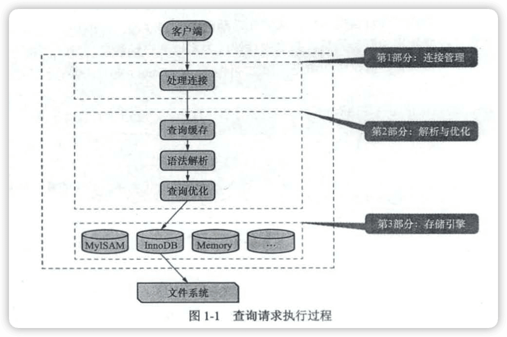

服务端处理客服端的查询请求时，大致分为3部分：

#### 1.连接管理

每当一个客户端进程连接到服务器进程时，服务器进程都会**创建一个线程专门处理与这个客户端的交互**；断开后线程不会被立即销毁，而是缓存起来，当另一个新的客户端再进行连接时，就会把这个线程分配给该新的客户端。

当然也需要限制可以同时连接到服务器的客服端数量。

#### 2.解析与优化

- 查询缓存

> MySQL5.7.20开始不推荐使用查询缓存，MySQL8.0直接删除了。

- 语法解析

从本质上说，这个从指定的文本中提取出需要的信息是一个编译过程，涉及词法解析、语法分析、语义分析等阶段。

- 查询优化

对我们的语句做一些优化，如外连接转换为内连接、表达式简化、子查询转为连接等等，最中结果是生成一个==执行计划==。

#### 3.存储引擎

在物理上如何表示记录（逻辑上表是有一行一行的记录组成的），怎么从表中读取数据以及怎么把数据写入具体的物理存储器上，都是存储引擎负责的事情。

### 常用存储引擎


### 存储引擎的一些操作

#### 当前服务器程序支持的存储引擎

```mysql
Show Engines;
```

结果中，Support列表示是否可用；Savepoints表示是否支持事务的部分回滚。

#### 设置表的存储引擎

```mysql
-- 1.创建时
Create Table 表名(
) Engine = 存储引擎名称;

-- 2.修改
Alter Table 表名 Engine = 存储引擎名称;
```


## 2 MySQL的调控按钮——启动选项和系统变量

### 2.1 启动选项和配置文件

**==启动选项（startup option）==**，控制着程序启动后的行为。

启动选项可以在命令行中指定，也可以在配置文件中指定。

#### 在命令行上指定启动选项

比如，禁止客户端使用TCP/IP网络进行通信：

```mysql
mysqld --skip-networking
```

参数`--`为前缀，多个单词以`-`或`_`连接。

修改默认存储引擎：

```mysql
mysqld --default-storage-engine=MyISAM
```

启动服务器程序的命令行指定启动选项的通用格式：

```mysql
--启动选项1[=值1] --启动选项2[=值2] ... --启动选项n[=值n]
```

查看程序全部启动选项及其默认值：

```shell
mysql --help
mysql_safe --help
mysqld --verbose --help
```

常用的启动选项可以有短形式的：


#### 配置文件中指定启动选项

命令行配置只能当次启动生效。

##### 1.配置文件的路径

MySQL程序启动时会在多个路径下寻找配置文件，也可在命令行中添加额外的配置文件路径。不同系统有所不同。

**Windows**：


- 前3个路径，配置文件可以`.ini`也可以是`.cnf`
- `%WINDIR`指Windows目录，通常是`C:\WINDOWS`。可以通过`echi %WINDIR%`查看。
- `BASEDIR`是指MySQL的安装目录路径。
- `%APPDATA%`表示Windows应用程序数据目录，可用`echo %APPDATA%`查看。
- 最后一个`.mylogin.cnf`有点特殊，它不是纯文本文件，是程序mysql_config_editor创建的加密文件。

**类Unix：**


##### 2.配置文件的内容

配置文件中的启动选项被划分为若干个组（组名用`[]`扩起来），不同选项组给不同程序使用。

```
[server]
option1
option2 = value2
...

[mysqld]
option1
option2 = value2
...

[mysqld_safe]
option1
option2 = value2
...

[client]
option1
option2 = value2
...

[mysql]
option1
option2 = value2
...

[mysqladmin]
option1
option2 = value2
...
```

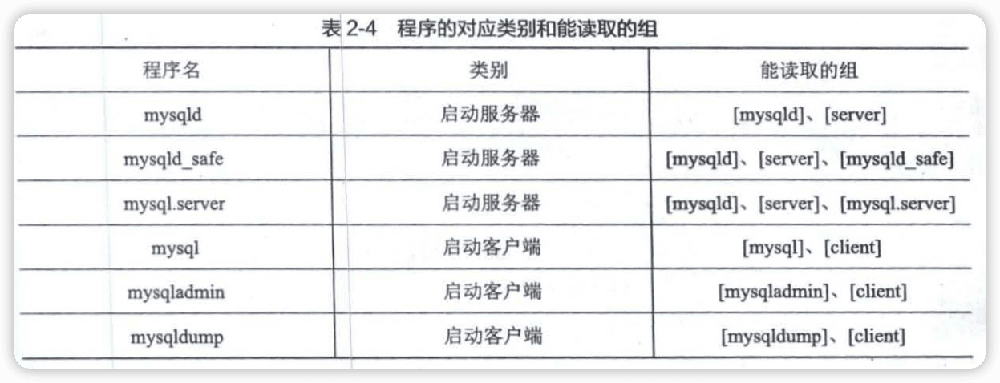

##### 3.特定MySQL版本的专用选项组

```
# 只有对应版本的mysqld才能使用
[mysqld-5.7]
```

##### 4.配置文件的优先级

配置文件读取，是按照表2-2或表2-3的顺序依次加载，相同启动选项，以最后一个配置文件为准。

##### 5.同一个配置文件中多个组的优先级

以最后一个出现的组中的启动选项为准。

##### 6.defaults-file的使用

不想让MySQL到默认的路径下搜索配置文件。

```shell
mysqld --defaults-file=/tmp/myconfig.txt
```

程序启动时只在`/tmp/myconfig.txt`路径下搜索配置文件。

#### 在命令行和配置文件中启动选项的区别

除了`defaults--extra-file`、`defaults-file`这样的本身指定配置文件路径的和一些只能在命令行使用的，其它启动选项都可以放到配置文件中。

命令行的优先级高于配置文件。

### 2.2 系统变量

**系统变量**：MySQL服务器程序在运行过程中会用到许多影响程序行为的变量。有好几百个。

每个系统变量都有一个默认值，可使用命令行或配置文件在启动服务器是修改。

大多说系统变量的值也可以在程序运行过程中修改，而无须停止并停止并重新启动服务器。

#### 查看系统变量

```mysql
Show Variables [Like 匹配的模式];
```

#### 设置系统变量

##### 1.通过启动选项设置

```shell
mysqld --default-storage-engine=MyISAM --max-connections=10
```

```
[server]
default-storage-engine=MyISAM 
max-connections=10
```

> **注**：系统变量，各单词之间只能用`_`连接。

##### 2.运行中设置

系统变量有作用范围之分：

- Global（全局范围）：影响服务器的整体操作。（全局变量）
- Session（会话范围）：影响某个客服端连接的操作。（会话变量）

服务器程序运行期间通过客服端程序设置系统变量的语法：

```mysql
Set [Global|Session] 系统变量名 = 值;
-- 或
Set [@@(Global|Session).]系统变量名 = 值;
```

如果在设置系统变量的语句中省略了作用范围，默认是Session。

查看不同作用范围的系统变量：

```mysql
Show [Global|Session] Variables [Like 匹配的模式];
```

> **注：**
>
> - 通过启动选项设置的系统变量的作用范围都是GLOBAL。
>
> - 一些系统变量只具有Global作用范围，如max_connections。
> - 一些系统变量只具有Session作用范围，如inser_id。
>
> - 有些系统变量是只读的，如version。

##### 3.启动选项和系统变量的区别

- 大部分的系统变量都可以当作启动选项传入。
- 有些系统变量是在程序运行过程中自动生成的，不可以当作启动选项来设置，比如 character_set_client。
- 有些启动选项也不是系统变量，比如 defaults-file。

### 2.3 状态变量

MySQL服务器程序运行状态的变量，好几百个，不能人为设置。

```mysql
Show [Global|Session] Variables [Like 匹配的模式];
```

```mysql
mysql> show status like 'thread%';
+-------------------+-------+
| Variable_name     | Value |
+-------------------+-------+
| Threads_cached    | 2     |
| Threads_connected | 1     |
| Threads_created   | 3     |
| Threads_running   | 2     |
+-------------------+-------+
4 rows in set (0.00 sec)
```


## 3 字符集和比较规则

### 3.1 简介

#### 字符集简介

字符与二进制数据的映射关系。

将字符映射成二进制数据的过程叫作**==编码==**，将二进制数据映射到字符的过程叫作**==解码==**。

人们抽象出的概念，**==字符集==**：描述某个字符范围的编码规则。

#### 比较规则简介

直接用字符对应的二进制比较大小的比较规则叫**==二进制比较规则==**，这种规则比较简单。

同一种字符集可以有多种比较规则。

#### 一些重要的字符集

- **ASCII字符集**。128个字符。（一个字节编码一个字符）

- ISO 8859-1字符集（**Latin1**）。256个字符（在ASCII基础扩充了128个西欧常用字符）。（一个字节）

- **GB2312字符集**。6762个汉字+682个其它。对应ASCII字符的一个字节编码，其它两个字节编码。（**变长编码方式**）

  > <u>计算机读取一个字节序列时，怎么区分某个字节代表的是一个单独的字符还是某个字符的一部分呢？</u>
  >
  > ASCII的最高位默认为0，如果为1就是两个字节代表一个单独的字符。

- **GBK字符集**。对GB2312的扩充。

- **UTF-8字符集**。几乎收录世界各国使用的字符，而且还在不断扩充。1~4个字节编码一个字符。

  > UTF-8只是Unicode字符集的一中**编码方案**，其它有UTF-16（2或4字节编码）、UTF-32（4字节编码）。
  >
  > UTF-8采用1~4个字节编码一个字符；
  >
  > UTF-16采用2或4个字节编码一个字符；
  >
  > UTF-32采用4个字节编码一个字符。
  
  

### 3.2 MySQL中支持的字符集和比较规则

#### MySQL中的utf8和utf8mb4

- Utf8mb3（简称utf8）：阉割过的UTF-8字符集，只使用1~3字节表示一个字符。

  > UTF-8：8-bit Unicode Transformation Format
  >
  > mb3:  **m**aximun of **3** **b**ytes per multibyte character

- utf8mb4：正宗的UTF-8字符集，1~4个字节。MySQL8.0已经优化，默认字符集。

#### 字符集的查看

```mysql
-- `Character Set`和`Charset`是同义词
Show (Character Set | Charset) [Like 匹配的模式];

SHOW CHARACTER SET LIKE 'utf8%';
SHOW CHARSET;
```

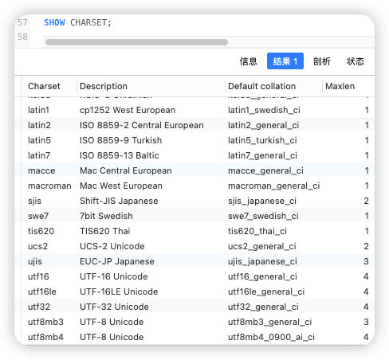

MySQL中表示字符集的名称时使用小写形式。

大概有41中字符集。

#### 比较规则的查看

```mysql
Show Collation [Like 匹配的模式];

show Collation Like 'utf8%';
+--------------------------+---------+-----+---------+----------+---------+---------------+
| Collation                | Charset | Id  | Default | Compiled | Sortlen | Pad_attribute |
+--------------------------+---------+-----+---------+----------+---------+---------------+
| utf8_bin                 | utf8    |  83 |         | Yes      |       1 | PAD SPACE     |
| utf8_croatian_ci         | utf8    | 213 |         | Yes      |       8 | PAD SPACE     |
| utf8_czech_ci            | utf8    | 202 |         | Yes      |       8 | PAD SPACE     |
| utf8_danish_ci           | utf8    | 203 |         | Yes      |       8 | PAD SPACE     |
...
```

- 比较规则的名称以其关联的字符集名称开头。
- 中间紧跟着该**比较规则所应用的语言**。如，utf8_polish_ci表示波兰语的比较规则...，utf8_general_ci是通用的比较规则。
- 名称后缀表示该比较规则是否区分语言中的重音、大小写等。

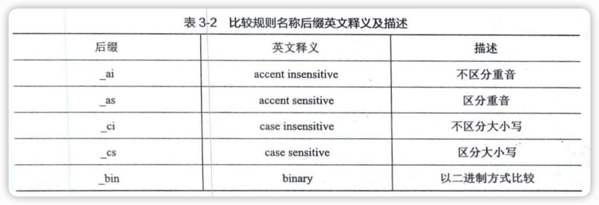

### 3.3 字符集和比较规则的应用

#### 1️⃣各级别的字符集和比较规则

##### 1.服务器级别

服务器级别的字符集和比较规则的系统变量：`character_set_server`, `collation_server`。

```mysql
SHOW VARIABLES LIKE 'character_set_server';
SHOW VARIABLES LIKE 'collation_server';
```

##### 2.数据库级别

在创建和修改数据库时可以指定，具体语法：

```mysql
Create Database 数据库名
	[[Default] Character set 字符集名称]
	[[Default] Collate 比较规则名称];
	
Alter Database 数据库名
	[[Default] Character set 字符集名称]
	[[Default] Collate 比较规则名称];
```

```mysql
Create Database charset_demo_db
Character Set gb2312
Collate gb2312_chinese_ci;
```

对应的系统变量：`character_set_database`, `collation_database`（不能通过这两个变量来修改数据库的字符集和比较规则）。

查看当前数据库的字符集和比较规则：

```mysql
SHOW VARIABLES LIKE 'character_set_database';
SHOW VARIABLES LIKE 'collation_database';
```

> 创建数据库时不指定字符集和比较规则，就使用服务器级别的。

##### 3.表级别

也可在创建和修改表时指定，具体语法：

```mysql
Create Table 表名(列的信息)
	[[Default] Character set 字符集名称]
	[Collate 比较规则名称];
	
Alter Table 表名
	[[Default] Character set 字符集名称]
	[Collate 比较规则名称];
```

```mysql
Create Table t (
	col Varchar(10)
) character Set utf8 collate utf8_general_ci;
```

> 同样创建表示没指定，就使用数据库级别的。

##### 4.列级别

对于存储字符串的列，**同一个表中不同的列也可以有不同的字符集和比较规则**。

```mysql
Create Table 表名(
	列名 字符串类型 [Character set 字符集名称] [Collate 比较规则名称],
  ...
);

Alter Table 表名 Modify 列名 字符串类型 [Character set 字符集名称] [Collate 比较规则名称];
```

> 对于某个列来说，如果在创建和修改表的语句中没有指明其字符集和比较规则，则使用表的。

##### 5.仅修改字符集或仅修改比较规则

- 只修改字符集，则比较规则将变为修改后的字符集默认的比较规则；
- 只修改比较规则，则字符集将变为修改后的比较规则对应的字符集。

##### 6.各级别字符集和比较规则小结

- 如果创建或修改列时没有显式指定字符集和比较规则，则该列默认使用表的宇符集和比较规则；
- 如果创建表时没有显式指定字符集和比较规则，则该表默认使用数据库的字符集和比较规则；
- 如果创建数据库时没有显式指定字符集和比较规则，则该数据库默认使用服务器的字符集和比较规则。

#### 2️⃣客户端和服务器通信过程中使用的字符集

##### 1.编码和解码使用的字符集不一致

> `我`在UTF-8字符集编码下的字节序列是`0xE68891`。如果程序A把这个字节序列发送到程序B，程序B使用不同的字符集解码（假设使用GBK），过程如下：（可通过在线工具 [汉字字符集编码查询](https://www.qqxiuzi.cn/bianma/zifuji.php) 测试）
>
> a. 首先看第一个字节0xE6，大于0x7F（十进制127），说明待读取字符是两字节编码。继续读一字节后得到 OxE688，然后从 GBK 编码表中查找字节为 0xE688 对应的字符，发现是字符`鎴`。
> b. 继续读一个字节 0x91，它的值也大于 0x7F，试图再读一个字节时发现后边没有了，所以这是半个字符。
> c. 最终，0xE68891被 GBK 字符集解释成一个字符'鎴'和半个字符。

##### 2.字符集转换

如果接受`0xE68891`这个字节序列的程序按照UTF-8字符集解码（得到二进制序列为`111001101000100010010001`）；然后再按照GBK字符集进行编码，编码后的字节序列为0xCED2。这个过程就叫作**==字符集转换==**。

##### 3.MySQL中的字符集转换过程🔖

从机器的角度看，客户端发送的请求以及服务器返回的响应本质上就是一个**字节序列**。

在这个“客户端发送请求，服务器返回响应”的过程中，其实经历了**多次的字符集转换**：

###### 客户端发送请求

一般，客户端编码请求字符串时使用的字符集与操作系统当前的字符集一致。

- 类UNIX系统时

系统当前使用的字符集，由三个环境变量决定：`LC_ALL`，`LC_CTYPE`，`LANG`（优先级渐渐降低）。

- Windows

代码页（code page）


###### 服务器接受请求

服务器将客户端请求的字符序列看作是使用系统变量`character_set_client`代表的字符集进行编码的字节序列（每个客户端与服务器建立连接后，服务器都会为其维护一个单独的SESSION级别的`character_set_client`变量）。


###### 服务器处理请求


###### 服务器生成响应

character_set_client、character_set_connection 和character_set_results


这三个系统变量作用范围都是Session级别。


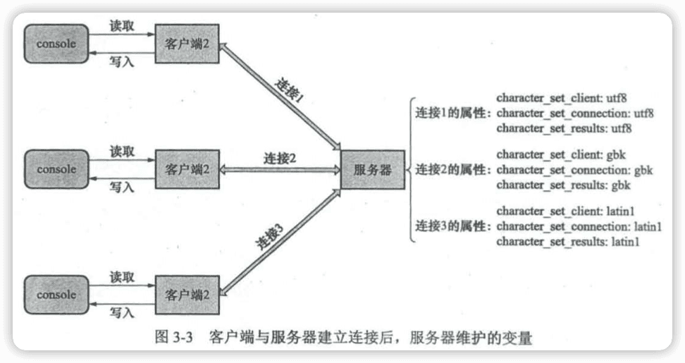

> 如果MySQL不支持操作系统当前使用的字符集，则会将客户端默认的字符集设置为MySQL的默认字符集（5.7前是latin1,8.0之后改为utf8mb4）。

###### 客户端接收到响应


#### 3️⃣比较规则的应用

比较规则通常用来==比较字符串的大小以及对某些字符进行排序==，所以也称为**排序规则**。

```mysql
Insert Into t(col) Values('a'), ('b'), ('A'), ('B'), ('我');
```

```mysql
-- 默认gbk_chinese_ci不区分大小写
mysql> Select * From t Order By col;
+------+
| col  |
+------+
| a    |
| A    |
| b    |
| B    |
| 我   |
+------+
5 rows in set (0.00 sec)


-- gbk_bin是比较字符的二进制编码，所以区分大小写
mysql> Alter Table t Modify col Varchar(10) Collate gbk_bin;
Query OK, 5 rows affected (0.02 sec)
Records: 5  Duplicates: 0  Warnings: 0

mysql> Select * From t Order By col;
+------+
| col  |
+------+
| A    |
| B    |
| a    |
| b    |
| 我   |
+------+
5 rows in set (0.00 sec)
```


## 4 从一条记录说起——InnoDB「记录」存储结构

> 数据库建立： `xiaohaizi` utf8mb4  utf8mb4_bin
>
> ```mysql
> CREATE DATABASE [IF NOT EXISTS] database_name
> [CHARACTER SET charset_name]
> [COLLATE collation_name];
> ```
>
> ```mysql
> CREATE DATABASE `xiaohaizi`
> CHARACTER SET utf8mb4
> COLLATE utf8mb4_bin;
> ```


### 4.2 InnoDB页简介

InnoDB将表中数据存储在磁盘上，真正处理数据的过程发生在内存中，如果是处理写入或修改请求，还需要把内存中的内容重新刷新到磁盘上。

InnoDB以**==页==**作为磁盘和内存之间交互的基本单位。页的大小默认为==16KB==（16*1024=16384）。对应系统变量是`innodb_page_size`，只能在第一次<u>初始化MySQL数据目录</u>时指定，服务器运行时不能更改页面大小。

### 4.3 InnoDB行格式

平常以==记录==为单位向表中插入数据，这些记录在磁盘上的**存放方式**被成为**==行格式==**（也叫作**==记录格式==**），4种**==行格式==**：Compact、Redundant、Dynamic、Compressed。

#### 1️⃣指定行格式的语法

```mysql
Create Table 表名 (列的信息) Row_Format=行格式名称;

Alter Table 表名 Row_Format=行格式名称;
```

```mysql
Create Table record_format_demo (
	c1 varchar(10),
  c2 varchar(10) not null,
  c3 char(10),
  c4 varchar(10)
) Charset=ascii Row_Format=Compact;

Insert into record_format_demo(c1, c2, c3, c4) values('aaaa', 'bbb', 'cc', 'd'), ('eeee', 'fff', Null, Null);
```

```mysql
mysql> select * from record_format_demo;
+------+-----+------+------+
| c1   | c2  | c3   | c4   |
+------+-----+------+------+
| aaaa | bbb | cc   | d    |
| eeee | fff | NULL | NULL |
+------+-----+------+------+
2 rows in set (0.00 sec)
```

#### 2️⃣Compact行格式


一条完整的记录分为两大部分：

##### 1.==记录的额外信息==

###### a 变长字段长度列表

MySQL支持一些变长的数据类型：<u>Varchar(M)、Varbinary(M)、各种Text类型、各种Blob类型</u>。【**变长字段**】

变长字段占用的存储空间分为两个部分：**真正的数据内容；该数据占用的字节数**。

在COMPACT行格式中，所有变长字段的真实数据占用的字节数都存放在记录的开头位置，从而形成一个==变长字段长度列表==，各变长字段的真实数据占用的字节数按照列的顺序**==逆序存放==**（如下面的c4、c2、c1）。

表record_format_demo的c1、c2、c4字段都是varchar(10)，这3个列的值**占用的存储空间字节数**保存在记录开头处。


<u>变长字段的真实数据占用的字节数是用1字节还是2字节表示？</u>  InnoDB通过W、M、L是三个符号制定一套规则，这个三个符号的意义：

- 某个字符集表示一个字符最多需要W**字节**。（比如utf8mb4的W是4，utf8是3，gbk是2，ascii是1）
- 对于varchar(M)，表示这种类型最多能存储M个**字符**。那么这种类型表示的字符串最多占用的字节数就是`M * W`。
- L表示变长字段实际存储的字符串占用的**字节数**。

规则：

- M * W <= 255，使用1个字节表示变长字段的真实数据占用的字节数。

- M * W > 255

  L <= 127，1字节

  L > 127，2字节

总结：<u>如果该变长字段允许存储的最大字节数（M * W）超过255字节，并且真实数据占用的字节数(L）超过 127字节，则使用2字节来表示真实数据占用的字节数，否则使用 1字节。</u>

**变长字段长度列表中只存储值为非NULL的列的内容长度。**

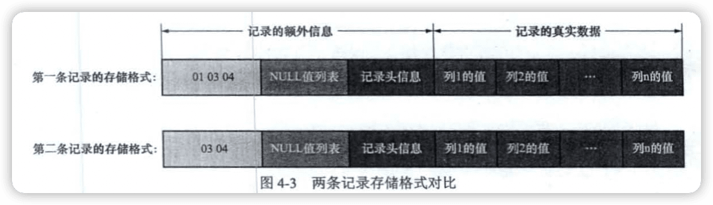

> 如果表中所有的列都不是变长的数据类型或所有列的值都是NULL，那么就不需要变长字段长度列表。

###### b NULL值列表

Compact行格式把一条记录中值为NULL的列统一管理起来（节省空间），存储在NULL值列表中。

处理过程：

1. 首先统计表中允许存储NULL的列有哪些。

   主键列和NOT NULL列不会被统计。

2. 每个允许存储NULL的列对应一个二进制位，二进制位按照列的顺序**逆序排列**。二进制位为1表示该列的值为NULL，0表示不为NULL。

   如果表中没有允许存储NULL的列，则NULL值列表就不存在。

3. 规定NULL值列表必须使用**整数个字节的位**表示，如果不够，字节的高位补0。

   如之前表的表只有3个列允许为NULL（c2是NOT NULL，不统计）：

   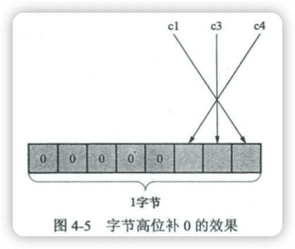

   第一条记录的c1、c3、c4都不为NULL，二进制位都为0；第二条记录的c3、c4为NULL，二进制位为1：

    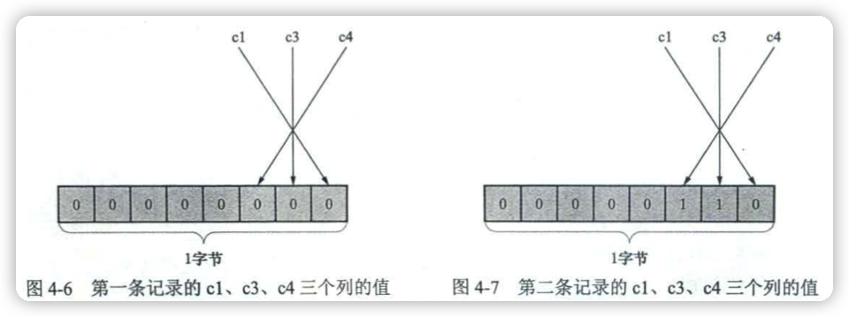           

这两条记录的填充NULL值列表后：


###### c 记录头信息

固定**5字节**，也就是**40**个二进制位。前4位称为**info bit**。

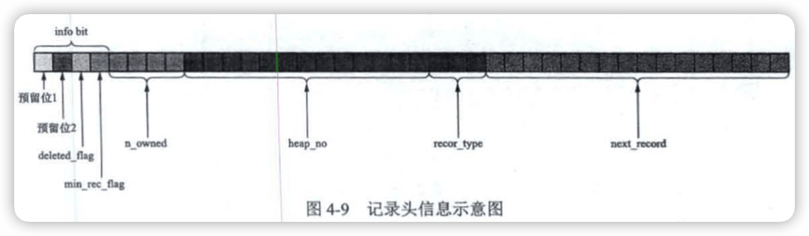

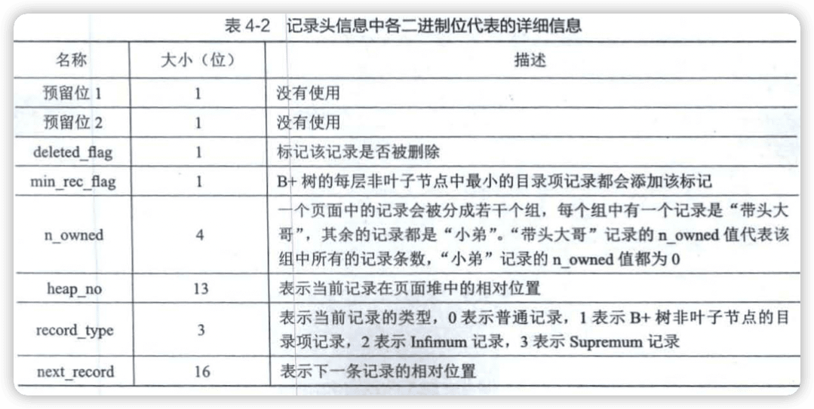

**record_format_demo**表中的两条记录的记录头信息：

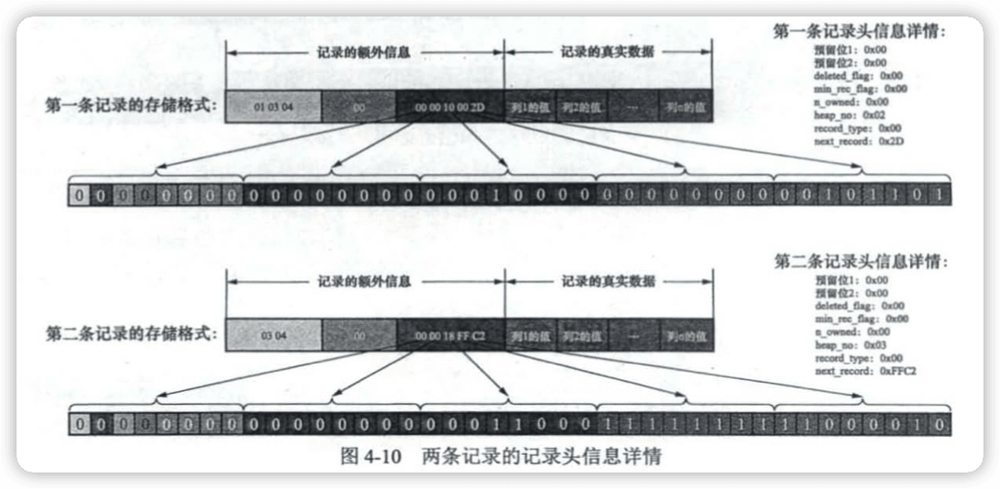

##### 2.==记录的真实数据==

MySQL会为每个记录默认地添加一些**隐藏列**：

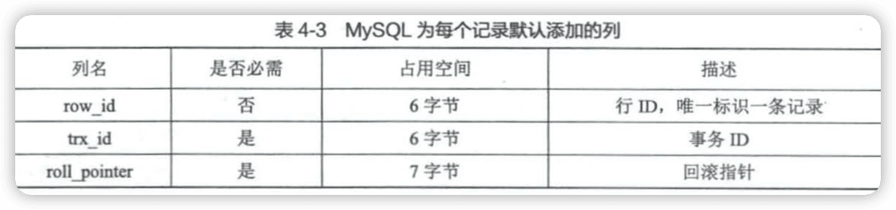

> InoDB表的**主键生成策略**：
>
> - 优先使用用户自定义的主键作为主键；
> - 如果用户没有定义主键，则选取一个不允许存储NULL值的Unique键作为主键；
> - 如果表中连不允许存储NULL值的Unique键都没有定义，则InnoDB会为表默认添加个名为`row_id`的隐藏列作为主键。（否则默认是不会有row_id的）

加上记录的真实数据的两条记录：


- 表`record_forat_demo`使用的是ascii字符集，所以`Ox61616161` 就表示字符串“aaaa'，`Ox626262`就表示字符串「bbb'；依此类推。

- 第一条记录c3列式`CHAR(10)`类型（固定），实际存储的是只占2个字节的字符串`'cc'`（`0x6363`），后面8个字节用空格（`0x2020`）填充。

- 注意第二条记录中c3和c4列的值都为NULL，它们被存储在了前面的NULL值列表处，在记录的真实数据处就不再冗余存储，从而节省了存储空间，NULL列表应该是`110`也就是`06`。

##### 3.Char(M)列的存储格式

表record_format_demo的c3列类型是`CHAR(10)`，也就是c3列不属于变长字段，其它三个`VARCHAR(10)`列占用的字节长度逆序存到变长字段长度列表中：

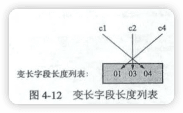

表record_format_demo采用的是ascii字符集（一个字符用一个字节编码）。

如果采用变长编码的字符集（也就是一个字符不确定几个字节编码，如gbk是1-2个、utf8是1-3个），设计者规定此时`CHAR(10)`类型的c3列占用的字节数也会被存储到变长字段长度列表中。

```mysql
Alter Table record_format_demo Modify Column c3 Char(10) Character Set utf8;
```

修改后：

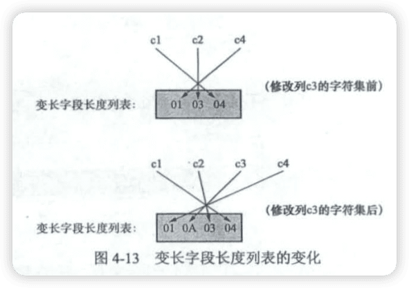

> 总结：
>
> 对于`CHAR(M)`类型的列来说，当列采用的是==定长编码的字符集==时，该列占用的字节数不会被加到变长字段长度列表；而如果采用==变长编码的字符集==时，则会。

> 其它几种行格式，都可以以COMPACT格式"依葫芦画瓢"了。

#### 3️⃣Redundant行格式

MySQL5.0之前使用的，比较原始，占用空间页比较大。比较少的使用了。


##### 1.字段长度偏移列表


##### 2.记录头信息


##### 3.记录头信息中的1byte_offs_flag的值是怎么选择的


##### 4.Redundant行格式中NULL值得处理


##### 5.Char(M)列的存储格式


#### 4️⃣溢出列


```mysql
Create Table off_page_demo (
	c Varchar(65532)
) Charset=ascii Row_Format=Compact;

Insert Into off_page_demo (c) Values(Repeat('a', 65532));
```

一个页一般大小16KB（16384B），上面的c列占用65532B。

在COMPACT和Redundant行格式中，对于占用存储空间非常多的列，在记录的真实数据处只会存储该列的一部分数据，而把剩余的数据**分散存储在其它的页中**，然后在记录的真实数据处用==20字节==存储志向这些**页的地址和其在其它页面中占用的字节数**，从而可以找到剩余数据所在的页，


上面存储768字节之外的数据的页面叫作==溢出页==。


需要溢出页来存储的列叫作==溢出列==。Varchar(M)、Text、Blob等类型都可能成为溢出列。

##### 产生溢出页的临界点🔖

MySQL中规定一个页中至少存放两行记录。


重点：不用关注这个临界点是什么，只要知道**如果一条记录的某个列中存储的数据占用的字节数非常多时，该列就可能成为溢出列**。

#### 5️⃣Dynamic行格式和Compressed行格式

这两种类似于Compact，处理溢出列数据有点不同：**它们不会在记录的真实数据处存储列真实数据的前768字节，而是把所有的数据都存储到所谓的溢出页中，只在记录的真实数据处存储指向这些溢出页的地址。**

另外Compressed会采用压缩算法对页面进行压缩。


> MySQL 5.7 及更高版本（含 MySQL 8）中，`innodb_default_row_format` 的全局默认值为 `DYNAMIC`。

### 4.4 小结

页是InnoDB中磁盘和内存交互的基本单位，也是InnoDB管理存储空间的基本单位，默认大小为16KB。

指定和修改行格式的语法如下:

```mysql
CREATE TABLE 表名(列的信息) ROW_FORMAT=行格式名称;
ALTER TABLE 表名 ROW_FORMAT=行格式名称;
```

InnoDB的4种行格式：

- Compact行格式


- REDUNDANT行格式


- DYNAMIC和COMPRESSED行格式

这两种行格式类似于COMPACT行格式,只不过在**处理溢出列数据**时有点儿分歧:它们不会在记录的真实数据处存储列真实数据的前768字节，而是把所有的数据都存储到所谓的溢出页中，只在记录的真实数据处存储指向这些溢出页的地址。另外，COMPRESSED行格式会采用压缩算法对页面进行**压缩**。


## 5 盛放记录的大盒子——InnoDB数据页结构

### 5.1 不同类型的页简介

InnoDB**为了不同的目的而设计了多种不同类型的页**，比如<u>存放表空间头部信息的页、存放Chang Buffer信息的页、存放INODE信息的页、存放undo日志信息的页</u>等等，当然还又存放表中**记录**的页，官方称这种为<font color=#FF8C00>索引（INDEX）页</font>（也就是**数据页**）。

### 5.2 数据页结构快览

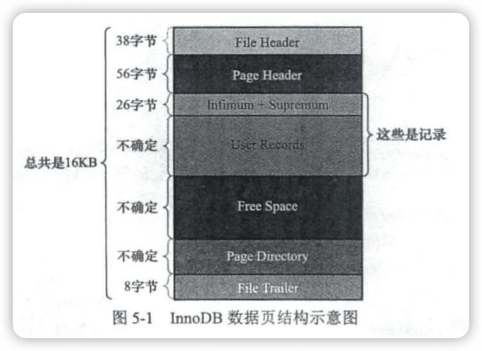

InnoDB数据页大致分为==7==个部分，占用的字节数有的是确定的，有的是不确定的。


### 5.3 记录在页中的存储

一开始生成页的时候，并没有**User Records**，每当插入一条记录时，都会从**==Free Space==**部分申请一个记录大小的空间划分为User Records。当Free Space的空间被全部划分为User Records时，就意味着这个页使用完了。


#### 记录头信息的秘密

```mysql
Create Table page_demo(
	c1 int,
  c2 int,
  c3 Varchar(10000),
  Primary Key (c1)
) Charset=ascii Row_format=Compact;
```

定义了c1列为主键，因此没有所谓的`row_id`隐藏列：

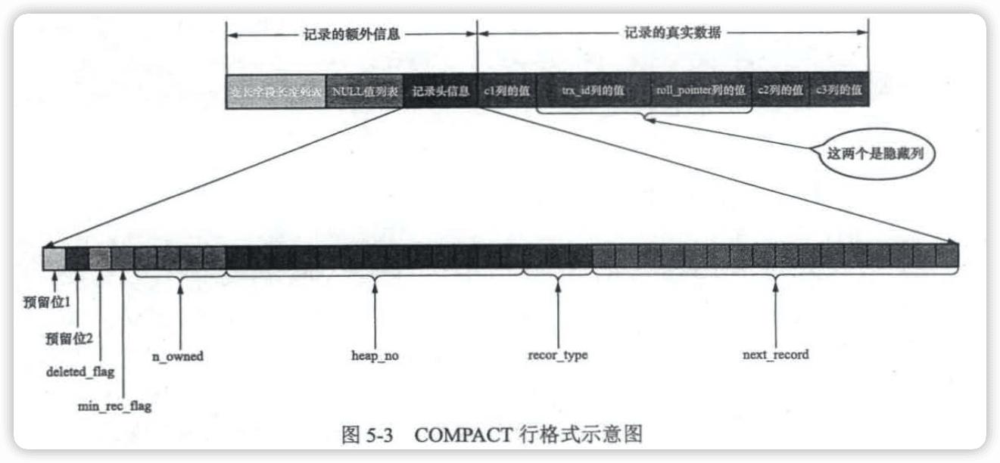

记录头信息详细说明可查看[表4-2](#c 记录头信息)。page_demo表的行格式可简化为：


插入几条记录：

```mysql
Insert Into page_demo Values(1, 100, 'aaaa'), (2, 200, 'bbbb'), (3, 300, 'cccc'), (4, 400, 'dddd');
```


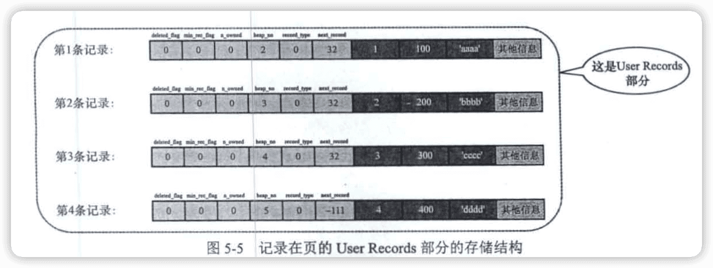

上图为了方便用十进制表示二进制；而且实际每条记录存储时是**没有间隙**的。

[表4-2](#c 记录头信息)记录头信息一些说明：

- deleted_flag：1比特，标记是否被删除，1表示被删除。记录如果直接被删除会带来性能消耗，所有被删除的记录组成一个**垃圾链表**，之后统一处理。

- min_rec_flag（1bit）

- n_owned（4bit）

- heap_no（13bit）。 

   InnoDB设计者把记录一条一条亲密排列成结构称为**堆（heap）**。
   
   
   
   heap_no表示记录在堆中的相对位置（包括deleted_flag为1的记录）。默认先给每个页里面加了两条记录（称为**伪记录**），<u>任何用户记录都比**Infimum记录**大，都比**Supremum记录**小</u>。两个默认记录的heap_no值分别是0和1。
   
   **==对于一条完整的记录来说，比较记录的大小就是比较主键的大小。==**


​	为了区分用户自己插入的记录，就从**User Records**部分单独成为**Infimum+Supremum**部分。

​	堆中记录的heap_no值在分配之后就不会发生改动了（即使记录被删除也不会改动）。

- record_type（3bit）：表示当前记录的类型，共四种，0表示普通记录，1表示B+非叶节点的目录项记录，2表示Infimum记录，3表示Supremum记录。

​		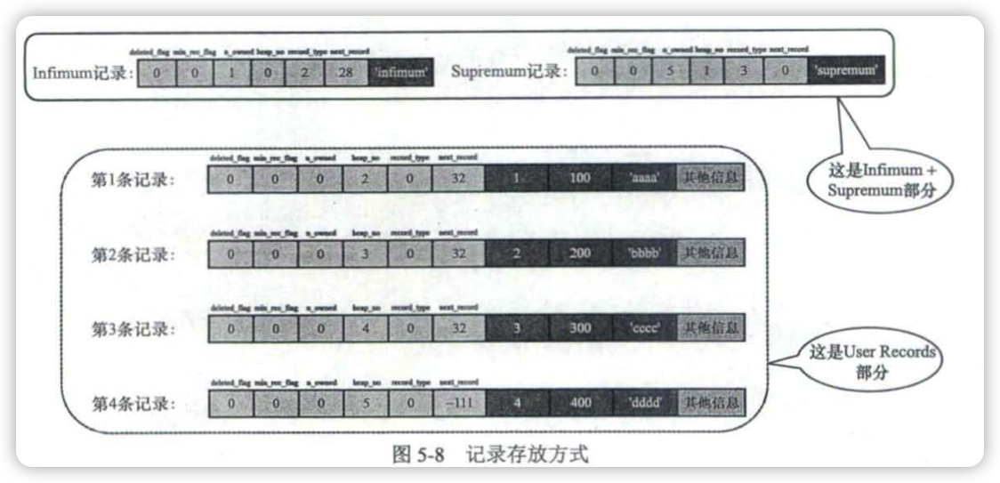

- next_record（16bit）：==非常重要==。表示从当前记录的真实数据到下一条记录的真实数据的距离。

​	正数表示下一条记录（指按主键顺序）在当前记录的后面，负数表示在前面。比如，第1条记录的next_record是32，意味着从第1条记录的真实数据的地址处向后找32字节就是下一条记录的真实数据。

​	根据之前的规定，<u>**Infimum记录的下一条记录就是本页中主键值最小的用户记录，主键值最大的用户记录的下一条记录就是Supremum记录**</u>（next_record为0，表示没有下一条记录了）。如下图：

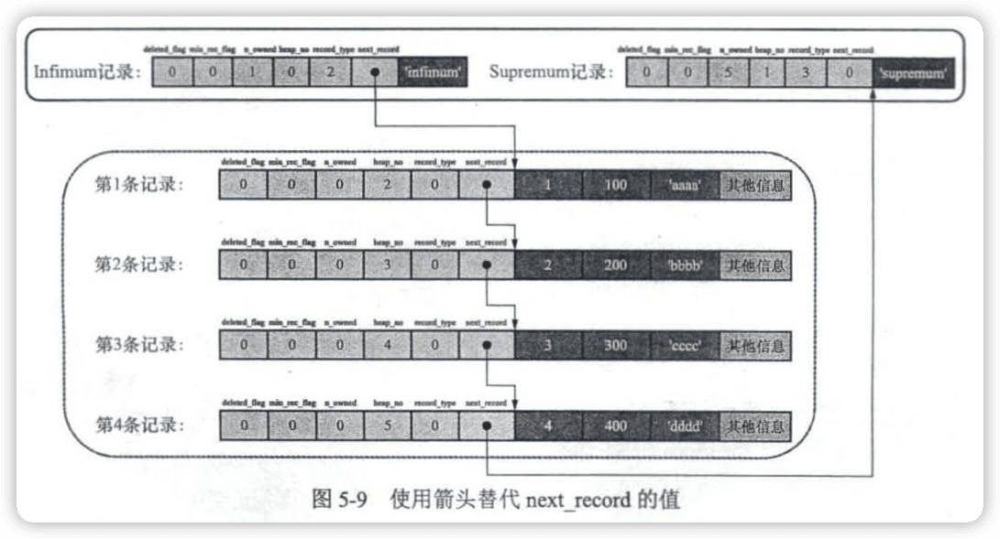

​	记录按**照主键从小到大的顺序**形成一个**==单向链表==**。如果删除一条记录，链表也就会改变：


删除第2条记录：

- 第2条记录并没有从存储空间移除，而是deleted_flag变成了1；
- 第2条记录的`next_record`变为0，意味着没有下一条记录了；
- 第1条记录的`next_record`指向了第3条记录；
- Supremum记录的`n_owned`从5变成了4。

所以，无论怎么对页中的记录进行增删改操作，InnoDB始终会维护记录的一个单向链表，链表中的各个节点是按照主键由小到大的顺序链接起来的。

> 为什么next_record要指向记录头信息和真实数据之间的位置？
>
> 因为这个位置正好向左读取就是记录头信息，向右读取就是真实数据。
>
> 之前说过，变长字段长度列表、NULL值列表中的信息都是逆序存放的，这样可以使记录中位置靠前的字段和它们对应的字段长度信息在内存中的距离更近，这可能会提高高速缓存的命中率。

如果重新插入主键为2的记录，InnoDB并不会申请新的存储空间，而是直接==复用==之前删除的记录的存储空间。

```mysql
Insert Into page_demo Values(2, 200, 'bbbb');
```

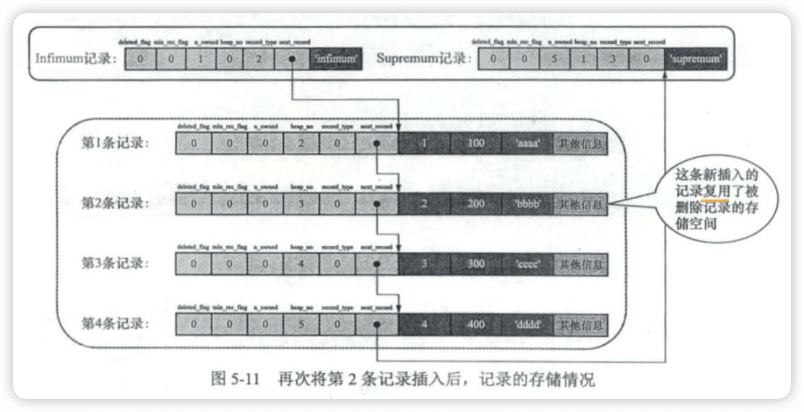

> 当数据页中存在多条被删除的记录时，可以使用这些记录的next_record属性将这些删除的记录组成一个**==垃圾链表==**，以备之后重用这部分存储空间。

### 5.4 Page Directory（页目录）

记录在页中是==按照主键值有小到大的顺序串联成一个单向链表==。

查询某条记录时，从第一个记录Infimum记录开始，沿着单向链表找，是最笨的方法。

页目录的制作过程：

1. 将所有正常的记录（包括Infimum和Supremum记录，但不包括己经移除到垃圾链表的记录）划分为几个组。
2. 每个组的**最后一条记录**（也就是组内最大的那条记录）相当于 “带头大哥”，组内其余的记录相当于 “小弟”。“带头大哥” 记录的头信息中的`n_owned`属性表示该组内共有几条记录。
3. 将每个组中最后一条记录在页面中的**地址偏移量**（就是该<u>记录的真实数据与页面中第0个字节之间的距离</u>） 单独提取出来，按顺序存储到靠近页尾部的地方。这个地方就是 **==Page Directory（页目录）==**。页目录中的这些地址偏移量称为**==槽 (Slot)==**(每组一个Slot)，每个槽占用2字节。页目录就是由多个槽组成的。

比如，现在page_demo 表中正常的记录共有6条。InnoDB 会把它们分成2个组，第一组只有一个Infimum 记录，第二组是剩余的5条记录。2个组就对应者2个槽，每个槽中存放每个组中最大的那条记录在页面中的地址偏移量，如图5-12所示。

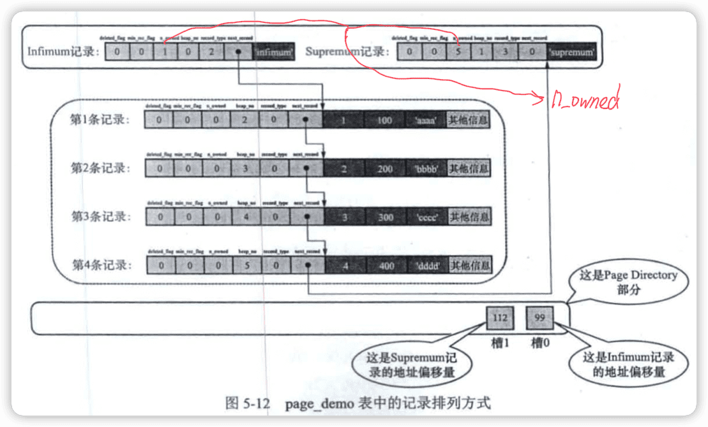


两个槽的偏移量分别是99和112，用箭头指向的方式表示：

> Infimum记录的偏移量99，是 **38（File Header） + 56（Page Header） + 5（记录头信息）= 99字节**。
>
> Supremum记录的偏移量112，是 **38 + 56 + 5+8 + 5** = 112。
>
> 注：Infimum和Supremum分别占用13个字节（5记录头信息+8真实数据）。

> 分组的规定：对于 Infimum 记录所在的分组只能有1条记录，Supremum 记录所在的分组拥有的记录条数只能在1~8条之间，剩下的分组中记录的条数范围只能是在4～8条之间。

分组细节：

1. 在初始情况下，一个数据页中有Infimum记录和Supremum记录两条，它们分属于两个分组。页目录中也只有两个槽，分别代表Infimum记录和Supremum记录在页面中的地址偏移量。
2. 之后每插入一条记录，都会从页目录中找到对应记录的主键值比待插入记录的主键值大并且差值最小的槽（从本质上来说，槽是一个组内最大的那条记录在页面中的地址偏移量，通过槽可以快速找到对应的记录的主键值），然后把该槽对应的记录的n_owned值加1，表示本组内有添加一条记录，直到该组中的记录数等于8个。

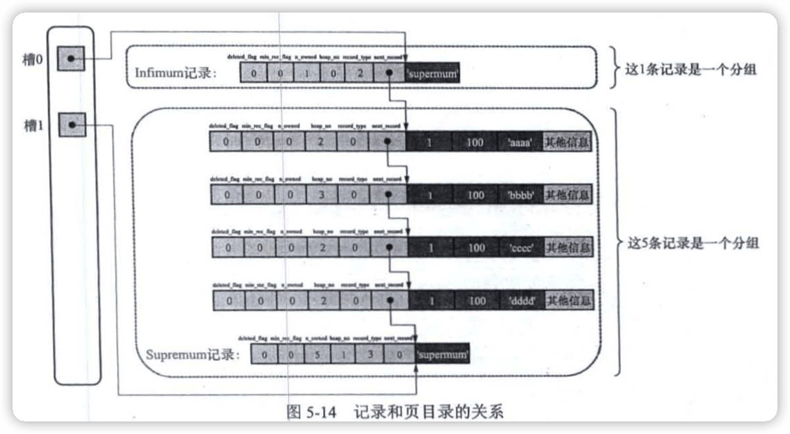

3. 当一组中的记录数等于8后，再插入一条记录，会将组中的记录拆分成两个组，其中一个组中4条记录，另一个5条记录。这个拆分过程会在页目录中新增一个槽，记录这个新增分组中最大的那条记录的偏移量。

```mysql
Insert Into page_demo Values(5, 500, 'eeee'), (6, 600, 'ffff'), (7, 700, 'gggg'), (8, 800, 'hhhh'), (9, 900, 'iiii'), (10, 1000, 'jjjj'), (11, 1100, 'kkkk'), (12, 1200, 'llll'), (13, 1300, 'mmmm'), (14, 1400, 'nnnn'), (15, 1500, 'oooo'), (16, 1600, 'pppp');
```

简图：

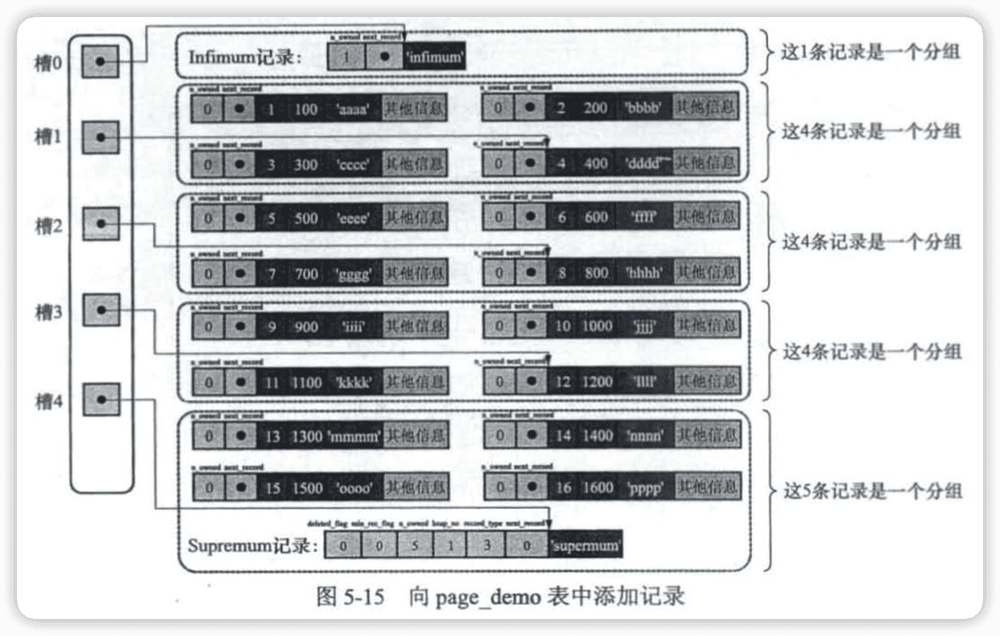

1. 计算中间槽的位置：(0+4)/2=2，查看槽2对应记录的主键值为8；又因为8＞6，所以设置 high=2，low保持不变。

2. 重新计算中间槽的位置：(0+2)/2=1，查看槽1对应记录的主键值为4；又因为4<6，所以设置low=1，high 保持不变。

3. 因为high-low 的值1，所以确定主键值为6的记录在槽2对应的组中。此时需要找到槽2所在分组中主键值最小的那条记录，然后沿着单向链表遍历槽2中的记录。但是前文又说过，每个槽对应的记录都是该组中主键值最大的记录，这里槽2对应的记录是主键值为8的记录，<u>怎么定位一个组中最小的记录呢？</u>

   别忘了各个槽都是挨着的，我们可以很轻易地找到槽1对应的记录（主键值为4），这条记录的下一条记录就是槽2所在分组中主键值最小的记录，其主键值为5。所以，可以从这条主键值为5的记录出发，遍历槽2中的各条记录，直到找到主键值为6的那条记录即可。由于一个组中包含的记录条数最多是8条，所以遍历一个组中的记录的代价是很小的。

总之，在一个数据页中查找指定主键值的记录时，分两步：

- 通过二分法确定该记录所在分组对应的槽，然后找到该槽所在分组中主键值最小的那条记录。
- 通过记录的`next_record`属性遍历该槽所在的组中的各个记录。

### 5.5 Page Header（页面头部，56字节）

Page Header（页面头部）用来记录==数据页==中**记录**的**状态信息**，比如数据页中已经<u>存储了多少条记录、Free Space在页面中的地址偏移量、页目录中存储了多少个槽</u>等。


- ==PAGE_DIRECTION==：表示最后一条记录插入方向的状态。新插入的记录主键值比上一条的大，这条记录插入方向就是右边，反之是左边。
- ==PAGE_N_DIRECTION==：假设连续几次插入新记录的方向都是一致的，InnoDB会把沿着同一个方向插入记录的条数记下来，这个条数就用PAGE_N_DIRECTION 状态表示。当然，如果最后一条记录的插入方向发生了改变，这个状态的值会被清零后重新统计。

### 5.6 File Header（文件头部，38字节）

Page Header专门针对数据页中记录的状态信息，而File Header**通用**的**各种类型的页信息**。

也就是各种类型的页都会File Header作为第一个组成部分，它描述了一些通用于各种页的信息，比如这个页的编号是多少，它的上一个页和下一个页是谁等。共38字节：


- **FIL_PAGE_SPACE_OR_CHKSUM**：当前页面的校验和（checksum）。

  对于很长的字符串，通过某种算得到一个比较短的字符串代表这个长的，这个短的就叫做==校验和==。

  这样比较时，比较校验和，能减少时间。

- **FIL_PAGE_OFFSET**：每个页都有一个单独的页号。

- **FIL_PAGE_TYPE**：表示当前页的类型。除了存储记录的数据页（也就是下面的最后一个索引页），还有：


- **FIL_PAGE_PREV**和**FIL_PAGE_NEXT**。需要存放的数据太大时，一个页放不下时，通过这两个把分散的页建立一个==双向链表==连起来。这两个分别代表本数据页的上一个页和下一个页的页号。

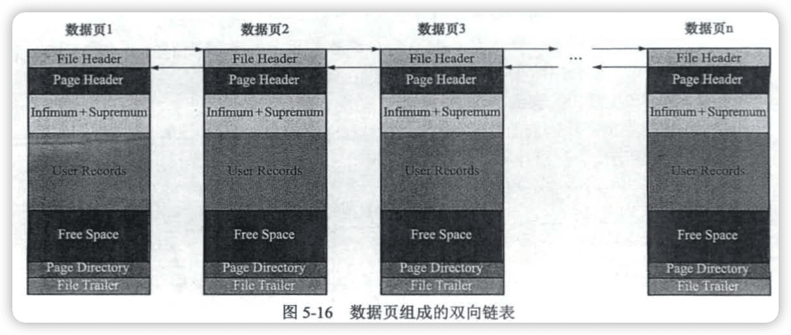

### 5.7 File Trailer（文件尾部，8字节）

为了检查一个页是否完整。8个字节。

- 前4个字节代表页的校验和。与File Header中的校验和相对应。
- 后4个字节代表页面最后修改时对应的==LSN（Log Sequence Number，日志序列号）==的后4字节，正常情况下应该与File Header的FIL_PAGE_LSN的后4字节相同。

### 5.8 小结

InnoDB为了不同的目的而设计了不同类型的页，我们把用于存放记录的页称为==数据页==。

一个数据页可以被大致划分为7个部分：

- ==File Header==:表示页的一些通用信息，占固定的38字节。
- ==Page Header==:表示数据页专有的一些信息，占固定的56字节。
- ==Infimum+Supremum==:两个虚拟的伪记录，分别表示页中的最小记录和最大记录，占固定的 26字节。
- ==User Records==:真正存储我们插入的记录，大小不固定。
- ==Free Space==:页中尚未使用的部分，大小不固定。
- ==Page Directory==:页中某些记录的相对位置，也就是各个槽对应的记录在页面中的地址偏移量;大小不固定，插入的记录越多，这个部分占用的空间就越多。
- ==File Trailer==:用于检验页是否完整，占固定的8字节。

每个记录的头信息中都有一个`next_record`属性，从而可以使页中的所有记录串联成一个单向链表。

InnoDB会把页中的记录划分为若干个组，每个组的最后一个记录的地址偏移量作为一个槽，存放在Page Directory中，一个槽占用2字节。在一个页中根据主键查找记录是非常快的，分为两步。

1. 通过二分法确定该记录所在分组对应的槽，并找到该槽所在分组中主键值最小的那条记录。
2. 通过记录的`next_record`属性遍历该槽所在的组中的各个记录。每个数据页的File Header部分都有上一个页和下一个页的编号，所以所有的数据页会组成一个双向链表。

在将页从内存刷新到磁盘时，为了保证页的完整性，页首和页尾都会存储页中数据的校验和，以及页面最后修改时对应的LSN值(页尾只会存储LSN值的后4字节)。如果页首和页尾的校验和以及LSN值校验不成功，就说明刷新期间出现了问题。


## 6 快速查询的秘籍——B+树索引

各个数据页组成一个双向链表，而每个数据页中的记录会按照主键值从小到大的顺序组成一个单向链表。

每个数据页都会为存储在它里面的记录生成一个**页目录**，在通过主键查找某条记录的时候可以在页目录中使用**二分法**快速定位到对应的槽，然后再遍历该槽对应分组中的记录即可快速找到指定的记录。

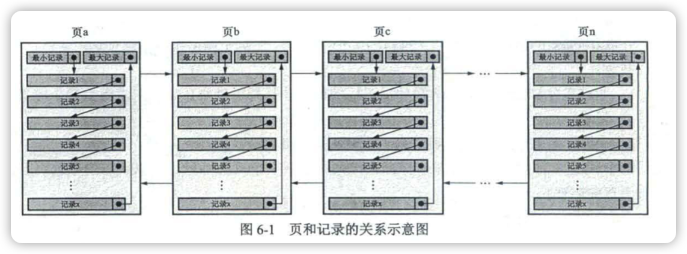

### 6.1 没有索引时进行查找

以搜索条件为某个列等于某个常数的情况为例。

#### 在一个页中查找

根据搜索条件不同分两种情况：

- 以主键为搜索条件：就是在页目录中使用二分法快递定位对应的槽；然后再遍历槽对应分组的记录，找到对应记录。
- 以其它列为搜索条件：没有为非注解列建立的页目录。只能从Infimum记录开始依次遍历单向链表中的每条记录。

#### 在很多页中查找

两个步骤：

- 定位到记录所在的页
- 从所在的页内查找相应的记录（遍历）


在没有索引的情况下，无论是根据主键列还是其他列的值进行查找，由于不能快速第定位记录所在的页，所以只能从第一页沿着双向链表一直往下找。在每一页中就根据上面的查找方法查找记录。

### 6.2 索引

```mysql
Create Table index_demo(
	c1 Int,
  c2 Int,
  c3 Char(1),
  Primary Key(c1)
) Row_Format = Compact;
```

index_demo的行格式简图：


其他信息：除了上述3种信息以外的所有信息，包括其他隐藏列的值以及记录的额外信息。

“其他信息”部分也省略掉的简图：


#### 1️⃣一个简单的索引方案

> 为什么要遍历所有的数据页？
>
> 因为各个页的记录没有规律

类似主键的页目录，为快速定位记录所在的数据页而建立一个别的目录，为此必须完成两个件事：

1. 下一个数据页中用户记录的主键值必须大于上一个页中用户记录的主键值。

   > 假设每个数据页最多能存放3条记录。

   ```mysql
   Insert Into index_demo Values(1, 4, 'u'), (3, 9, 'd'), (5, 3, 'y');
   ```

   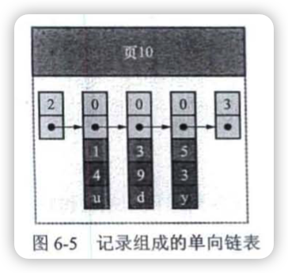

   此时再插入一条记录：

   ```mysql
   Insert Into index_demo Values(4, 4, 'a');
   ```

   假设每个数据页最多存放3条记录。新插入的记录主键大于之前的，不符合上面的规定，需要移动。

   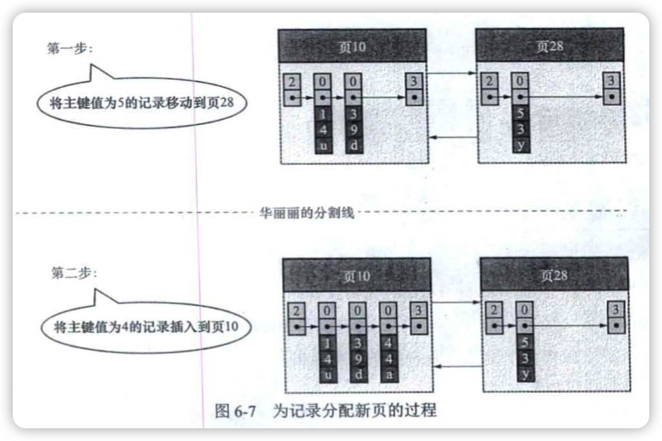

   上面的过程叫作**==页分裂==**。下一个数据页中用户记录的主键值必须大于上一个页中用户记录的主键值。

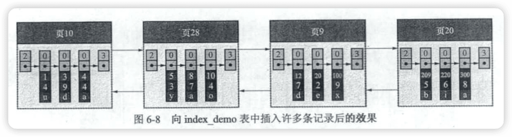

2. 给所有的页建立一个目录项。

每个页对应一个目录项，每个目录项包括两个部分：

- 页的用户记录中最小的主键值，用`key`来表示；
- 页号，用`paga_no`表示。

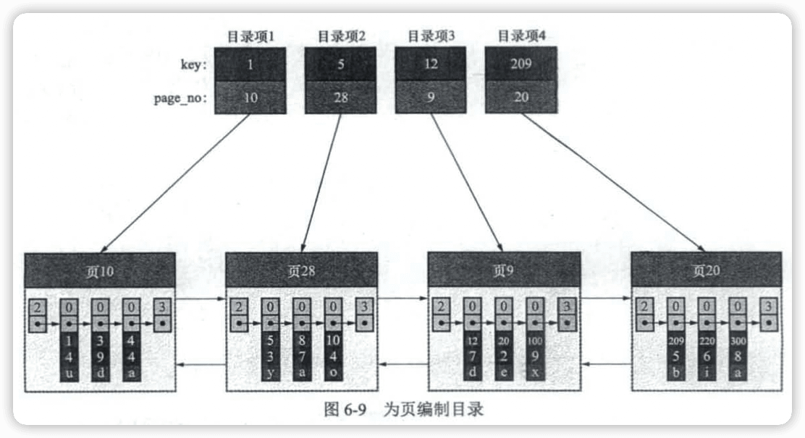

只需要把几个目录项在物理存储器上连续存储，比如把它们放到一个数组中，就可以实现<u>根据主键值快速查找某条记录的功能</u>了。比如，我们想查找主键值为20的记录，具体查找过程分两步。

- 先从目录项中根据二分法快速确定出主键值为20的记录在目录项3中（因为 12<20<209），它对应的页是页9。
- 再根据前文讲的在页中查找记录的方式去页9中定位具体的记录。

这个简易的目录有一个别名，称为==索引==。

#### 2️⃣InnoDB的索引方案

**实际目录项不可能在物理存储上连续存储。**

InnoDB设计者复用了之前存储用户记录的数据页来存储目录项。区分==用户记录==，称为==目录项记录==。记录头信息中`record_type`属性为1时就表示目录项记录。

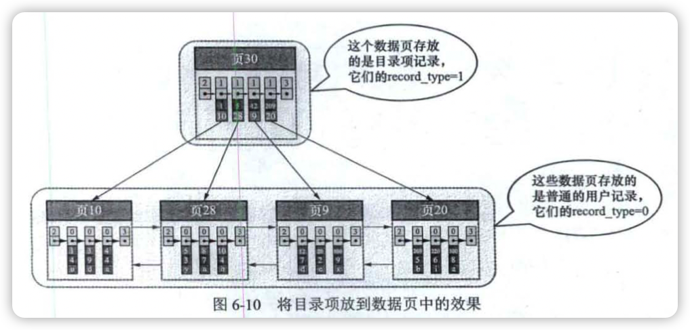

目录项记录和普通的用户记录区别：

- `record_type`值，前者是1，后者是0；
- 目录项记录只有**主键值和页的编号**两个列，而普通用户记录的列是用户自己定义的，可能包含很多列，另外还有InnoDB自己添加的隐藏列。
- 记录头信息中`min_rec_flag`属性，目录项记录的为 1，普通用户记录的是0。

两者其它都一样：都是数据页（相同页类型。File Header中`FIL_PAGE_TYPE`属性都是`FIL_PAGE_Index`，也就是`0x45BF`）；页组成结构一样（7个部分）；都会为主键值生成Page Directory。

> 现在以查找主键为20的记录为例，根据某个主键值去查找记录的步骤可以大致拆分为两步。
>
> 1. 先到存储**==目录项记录==**的页(也就是页30）中通过二分法快速定位到对应的目录项记录，因为 12<20＜209，所以定位到对应的用户记录所在的页就是页 9。
> 2. 再到存储**==用户记录==**的页9中根据二分法快速定位到主键值为 20的用户记录。

如果表中数据太多，一个数据页不足以存放所有的目录项记录时，通过类似普通用户记录存储方式，再增加页即可：

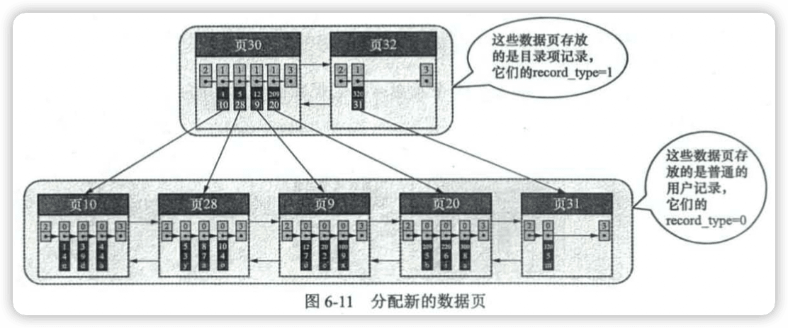

在插入一条主键值为320的用户记录之后，需要两个新的数据页：

- 为存储该用户记录而新生成了页31；
- （假设每个页只能存储4目录项记录）新的页32，用户存储多出的目录项记录。

多个目录项记录页，此时根据主键值查找一条用户记录，大致分为3步：

- 步骤1：去顶存储目录项记录的页。

  页30表示的目录项记录主键值的范围是[1, 320)，页32则是不小于320，所以主键值为20的记录对应的目录项记录在页30中。

- 步骤2：通过存储目录项记录的页确定用户记录真正所在的页。

- 步骤3：在真正存储用户记录的页中定位到具体的记录。

步骤1中，在定位存储目录项记录的页的时候，也遇到之前用户记录类似的问题：这些页在存储空间中可能不挨着（页20和页32不连续，数据越多这中情况越明显）。同样解决思路，**为这些存储目录项记录的页再生成一个更高级的目录**：

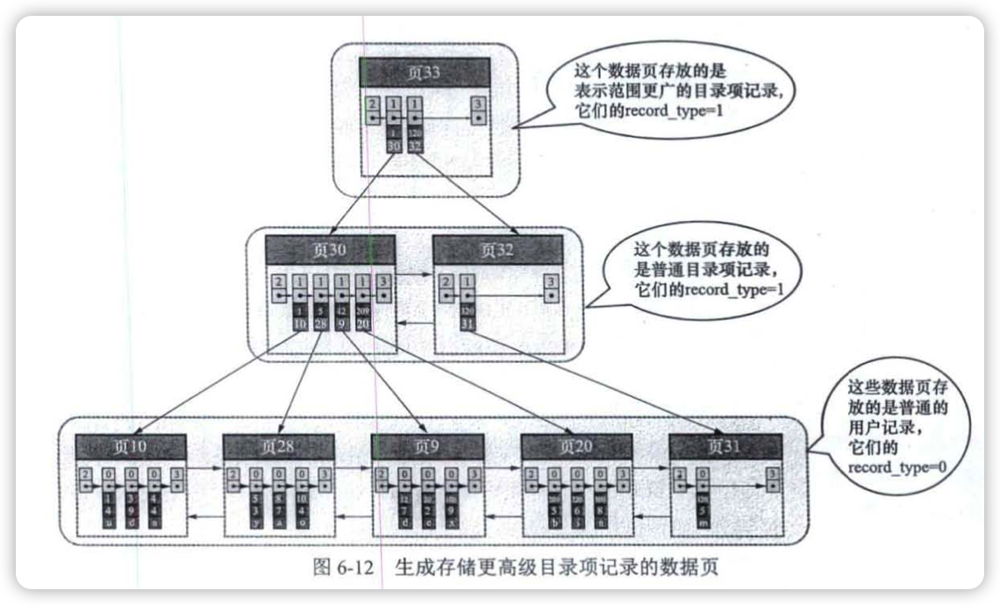

上图中生产了一个存储更高级目录项记录的页33。这个页中的两条记录分别代表页30和页32。如果用户记录的主键值在[1,320)直接，就到页30中查找更详细的目录项记录；不小于320，就要到页32中查找。简化一下就是：

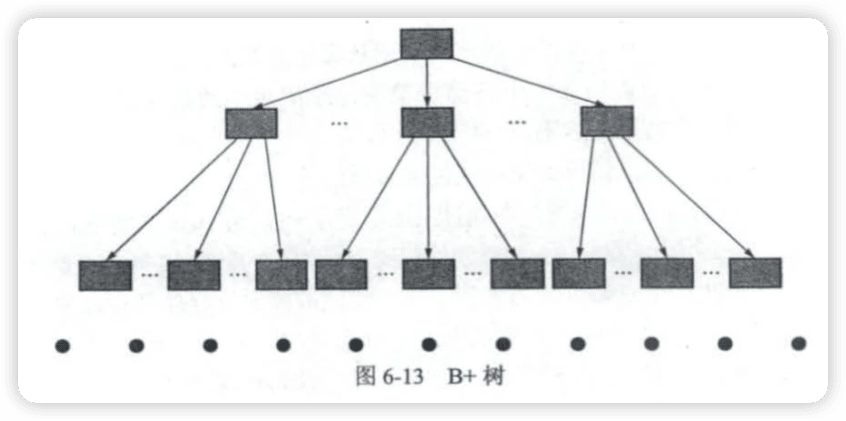

上面这种组织数据的形式（数据结构），就叫作**B+树**。

==根节点==，==叶节点==，==非叶子节点或内节点==。

规定最下面的层（存储用户记录的）为第0层。

真实环境中，一个页存放的记录数量是非常大的。假设所有存放用户记录的叶子节点所代表的数据页可以存放100条用户记录，所有存放目录项记录的内节点所有代表的数据页可以存放1000条目录项记录，那么：

- 如果B+树只有1层，也就是只有一个用户存放用户记录的节点，则对多能存放100条用户记录
- 2层，1000 * 100 = 100000
- 3层，1000 * 1000 * 100 = 1亿
- 4层，1000 * 1000 * 1000 * 100 = 1000亿

一般情况下，**用到的B+树都不会超过4层**。因此，在通过主键值查找记录时，最多只需要进行4个页面内的查找（3个目录项记录页和1个用户记录页）。

> Page Header部分中`PAGE_LEVEL`代表这个数据页作为节点在B+树中的层级。

##### 1.聚簇索引

B+树本身就是一个目录，或者说本身就是一个索引，两个特点：

- 使用记录**主键值**的大小进行记录和页的排序，3方面含义
  + 页（包括叶子结点和内节点）内的记录按照主键的大小顺序排成一个**单向链表**，页内的记录被划分成若干个组，每个组中主键值最大的记录在页内的偏移量会被当作槽依次存放在页目录中，可以在页目录中通过二分法快速定位到主键列等于某个值的记录。
  + 各个存放用户记录的页也是根据页中用户记录的主键大小顺序排成一个**双向链表**。
  + 存放目录记录的页分为不同的层级，在同一个层级中的页也是根据页中目录项记录的主键大小顺序排成一个**双向链表**。
- B+树的叶子节点存储的是**==完整的用户记录==**（存错了所有列的值，包括隐藏列）。

满足上面这两个特点的B+树就称为**聚簇索引**。

在InnoDB中，聚簇索引就是数据的存储方式（所有的用户记录都存储在叶节点），也就是所谓的==“索引即数据，数据即索引”==。聚簇索引不是用户创建的，InnoDB默认自动创建。

##### 2.二级索引（或叫辅助索引）

由于聚簇索引的B+树中数据都是按照主键进行排序的，因此它只能在搜索条件是主键值时才能发挥作用。

当需要通过其它列进行搜索时，就以其它列，再建B+树，并且<u>不同B+树中的数据采用不同的排序规则</u>。例如，用c2列的大小作为数据页、页中记录的排序规则，建立B+树：

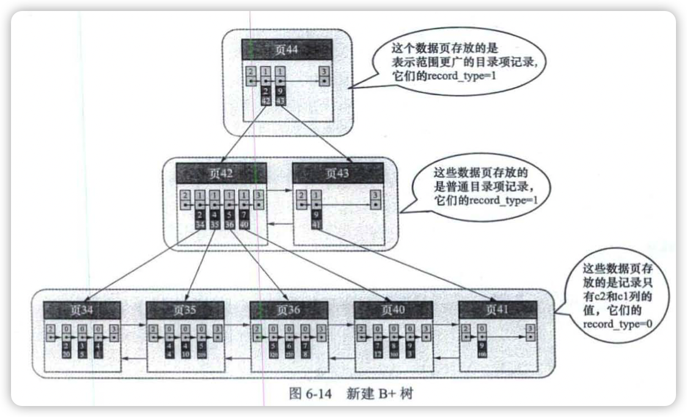

这个B+树与聚簇索引的不同：

- 使用记录c2列的大小进行记录和页的排序
- B+树的叶节点存储的不是完整的用户记录，而**只是c2列+主键这两个列的值**。
- 目录项记录中不再是主键+页号的搭配，而是**c2列+页号**。

比如查找满足搜索条件c2=4的记录（注意结果可能有多条），过程：

- 步骤1：确定第一条符合c2=4条件的目录项记录所在的页。

  根据根页面（也就是页44）可以快速定位到第一条符合 c2=4 条件的目录项记录所在的页为页42（因为2<4<9)。

- 步骤2：通过第一条符合c2=4 条件的目录项记录所在的页面确定第一条符合 c2=4 条件的用户记录所在的页。

  根据页42可以快速定位到第一条符合条件的用户记录所在的页为页 34 或者页 35中（因为2<4≤4)。

- 步骤3：在真正存储第一条符合 c2=4 条件的用户记录的页中定位到具体的记录。

  到页 34 和页 35 中定位到具体的用户记录（如果在页 34中使用页目录定位到第一条符合条件的用户记录，就不需要再到页 35 中使用页目录去定位第一条符合条件的用户记录了）。

- 步骤4：这个B+树的叶子节点中的记录只存储了c2和c1（也就是主键）两个列。在这个B+树的叶子节点处定位到第一条符合条件的那条用户记录之后，我们需要根据该记录中的主键信息到聚筷索引中查找到完整的用户记录。这个通过携带主键信息到聚族索引中重新定位完整的用户记录的过程也称为**==回表==**。然后再返回到这棵 B+ 树的叶子节点处，找到刚才定位到的符合条件的那条用户记录，并沿着记录组成的单向链表向后继续搜素其他也满足 c2=4 的记录，每找到一条的话就继续进行回表操作。重复这个过程，直到下一条记录不满足 c2=4 的这个条件为止。

因为这种以非主键列的大小为排序规则而建立的 B+树需要执行回表操作才可以定位到完整的用户记录，所以这种 B+树也称为==二级素引(Secondarv Index）或辅助索引==。

##### 3.联合索引

**同时以多个列的大小作为排序规则**建立索引。比如，c2和c3，包含两次含义：

- 先把各个记录和页按照c2列进行排序；
- 在记录的c2列相同的情况下，再采用c3列进行排序。

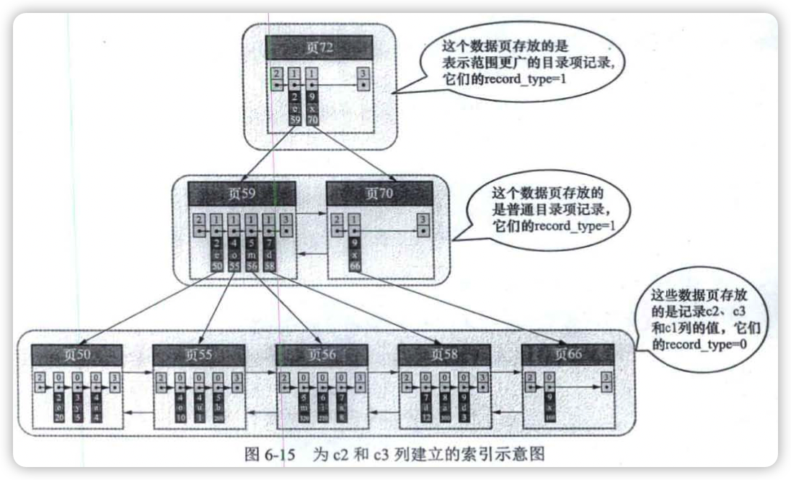

注意：

- 每条目录项记录都由c2列、c3列、页号这了部分组成。各条记录先按照c2列的值进行排序，如果记录的c2 列相同，则按照c3列的值进行排序。
- B+树叶子节点处的用户记录由c2列、c3列和主键c1列组成。

千万要注意的是，以c2和c3列的大小为排序规则建立的B+树称为==联合索引==，也称为复合索引或多列索引。它本质上也是一个二级索引。

#### 3️⃣InnoDB中B+树索引的注意事项

##### 1.跟页面万年不动窝

之前为了方便理解，先把存储用户记录的叶子节点都画出来，然后再画出存储目录项记录的内节点。实际上B+树的形成过程是下面这样的。

- 每当为某个表创建一个B+树索引（**聚簇索引不是人为创建的，它默认就存在**）时，都会为这个索引创建一个根节点页面。最开始表中没有数据的时候，每个B+树索引对应的根节点中既没有用户记录，也没有目录项记录。
- 随后向表中插入用户记录时，先把用户记录存储到这个根节点中。
- 在根节点中的可用空间用完时继续插入记录，此时会将根节点中的所有记录复制到一个新分配的页（比如页a）中，然后对这个新页进行页分裂操作，得到另一个新页（比如页b）。这时新插入的记录会根据键值（也就是聚簇索引中的主键值，或二级索引中对应的索引列的值）的大小分配到页a或页b中。根节点此时便升级为存储目录项记录的页，也就需要把页a 和页b对应的目录项记录插入到根节点中。

特别注意，**一个B+树索引的根节点子创建之日起便不会再移动（页号不变）。**

##### 2.内节点中目录项记录的唯一性

二级索引的目录项记录的内容是以索引列+页号，但这时索引列内容可能重复。

为了让新插入的记录能找到自己在哪个页，就需要保证B+树同一层内节点的目录项记录除页号这个字段以外的唯一的。所以二级索引的内节点的目录项记录的内容实际上由3个部分组成：索引列的值，主键值，页号。

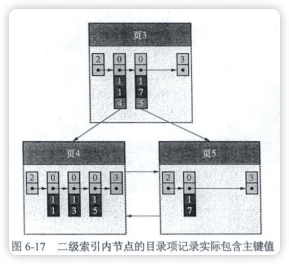

##### 3.一个页面至少容纳2条记录

一棵B+树只需要很少的层级就可以轻松存储数亿条记录，查询速度杠杠的！

这是因为B+树本质上就是**一个大的多层级目录**，每经过一个目录时都会过滤掉许多无效的子目录，直到最后访问到存储真正数据的目录。

#### 4️⃣MyISAM的索引方案简介

在InnoDB中索引即数据，而MyISAM**将索引和数据分开存储**（数据文件和索引文件）。

- 将表中的记录按照记录的插入顺序单独存储在一个文件中（称之为==数据文件==）。这个文件并不划分为若干个数据页，有多少记录就往这个文件中塞多少记录。这样一来，我们可以通过==行号==快速访问到一条记录。

MyISAM记录也需要**记录头**信息来存储一些额外数据。

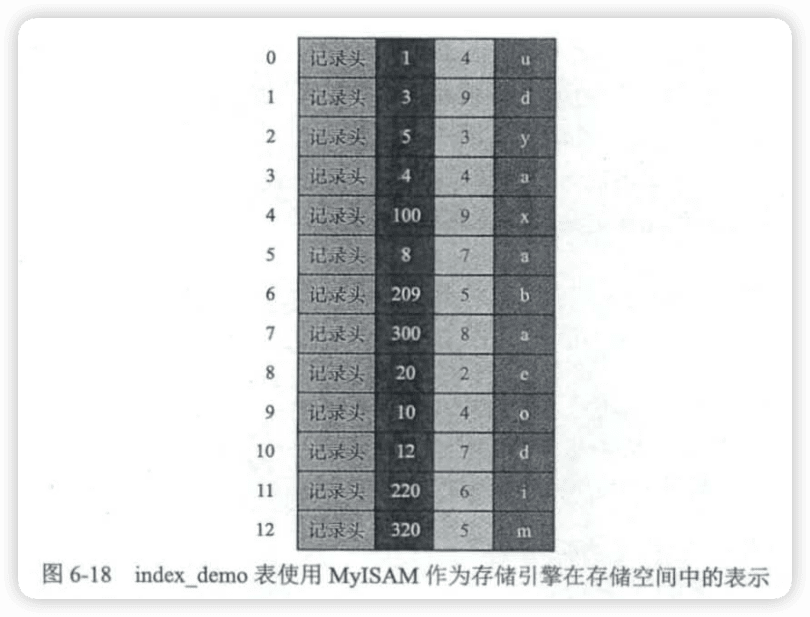

由于在插入数据时并**没有刻意按照主键大小排序**，所以我们不能在这些数据上使用二分法进行查找。

- 使用MyISAM存储引擎的表会把索引信息单独存储到另外一个文件中（称为==索引文件==）。MyISAM会为表的主键单独创建一个索引，只不过在索引的叶子节点中存储的**不是完整的用户记录，而是主键值与行号的组合**。也就是先通过索引找到对应的行号，再通过行号去找对应的记录！

这一点与InnoDB 是完全不相同的。在InnoDB 存储引擎中，只需要根据主键值对聚筷索引进行一次查找就能找到对应的记录，而在MyISAM中却需要进行一次回表操作。

==MyISAM中建立的索引相当于都是二级索引，都要回表操作。==

- 如果有必要，我们也可以为其他列分别建立索引或者建立联合素引，其原理与InnoDB中的索引差不多，只不过在叶子节点处存储的是相应的列＋行号。这些索引也全部都是二级索引。

#### 5️⃣MySQL中创建和删除索引的语句

InnoDB和MyISAM会**自动为主键或待用UNION属性的列建立索引**。

```mysql
Create Table 表名 (
	各个列的信息 ...,
  (Key|Index) 索引名 (需要被索引的单个列或多个列)
)

Alter Table 表名 Add (Index|Key) 索引名 (需要被索引的单个列或多个列);

Alter Table 表名 Drop (Index|Key) 索引名;
```

Key和Index是同义。

索引名建议以`idx_`为前缀，加上列名，下划线隔开。

### 6.3 总结

InnDB的索引是一棵B+树，完整的用户记录都存储在B+树==第0层的叶子节点==；其它层次的节点都属于==内节点==，内节点中存储的是==目录项记录==。
InnoDB 的索引分为两种：

1. 聚筷索引：以主键值的大小作为页和记录的排序规则，在叶子节点处存储的记录包含了表中所有的列。
2. 二级索引：以索引列的大小作为页和记录的排序规则，在叶子节点处存储的记录内容是索引列＋主键。

InnoDB 存储引擎的 B+树根节点自创建之日起就不再移动。
在二级索引的B+树内节点中，目录项记录由索引列的值、主键值和页号组成。

一个数据页至少可以容纳2条记录。

MyISAM 存储引擎的数据和索引分开存储，这种存储引擎的索引全部都是二级索引，在叶子节点处存储的是列＋行号（对于定长记录格式的记录来说）。


## 7 B+树索引的使用

回顾：

- 每个索引都对应一棵B+树。所有用户记录存储在叶节点，所有目录项记录存储在内节点。
- InnoDB 存储引擎会自动为主键建立==聚簇索引==（如果没有显式指定主键或者没有声明不允许存储NULL 的UNIQUE 键，它会自动添加主键），聚族索引的叶子节点包含完整的用户记录。
- B+树中的每层节点都按照索引列的值从小到大的顺序排序组成了双向链表，而且每个页内的记录（无论是用户记录还是目录项记录）都按照索引列的值从小到大的顺序形成了一个单向链表。
- 通过索引查找记录时，是**从B+树的根节点开始一层一层向下搜索的**。

### 7.1 B+树索引示意图的简化

```mysql
Create Table single_table (
	id Int Not Null Auto_Increment,
  key1 Varchar(100),
  key2 Int,
  key3 Varchar(100),
  key_part1 Varchar(100),
  key_part2 Varchar(100),
  key_part3 Varchar(100),
  common_field Varchar(100),
  Primary Key (id),
  Key idx_key1(key1),
  Unique Key uk_key2 (key2),
  Key idx_key3 (key3),
  Key idx_key_part (key_part1, key_part2, key_part3)
) Engine=InnoDB Charset=utf8;
```

插入10000行。

简化B+树示意图：


方便起见，把聚簇索引叶子节点中的记录称为==聚簇索引记录==，把二级索引叶子节点中的记录称为==二级索引记录==。

定位id值为1438的记录：

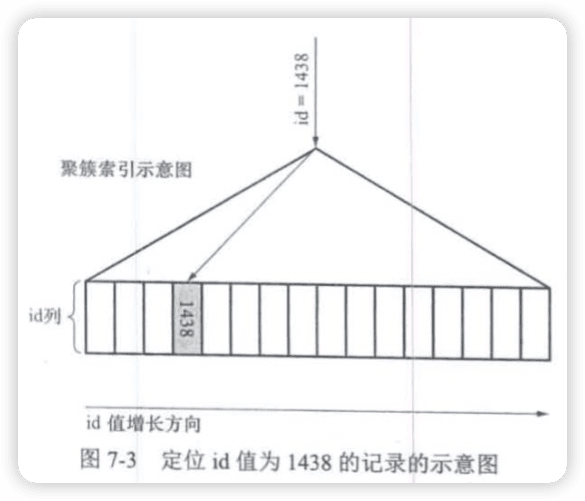

二级索引idx_key1的B+树示意图：

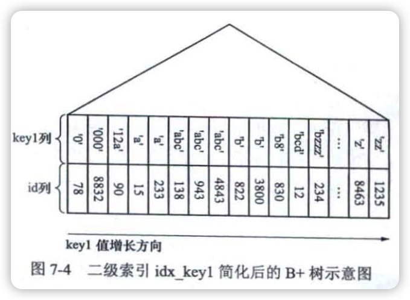

这些记录是按照key1列的值由小到大的顺序排序的额，如果key1列的值相同，则按照id列的值进行排序。

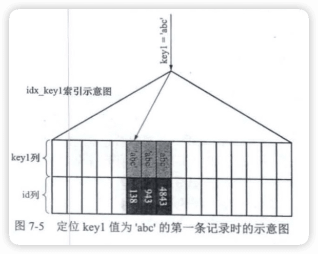

### 7.2 索引的代价

- 空间上的代价

​	每一颗B+树的每一个节点都是一个数据页，一个数据页默认16KB

- 时间上的代价

  **每当对表中的数据进行增删改操作时，都需要修改各个B+树索引**。B+树中的每层节点都按照索引列的值从小到大的顺序排序组成了双向链表。无论是叶子节点中的记录还是内节点中的记录（也就是无论是用户记录还是目录项记录），都按照索引列的值从小到大的顺序形成了一个单向链表。而增删改操作可能会对节点和记录的排序造成破坏，所以存储引擎需要额外的时间进行**页面分裂、页面回收**等操作，以维护节点和记录的排序。【建立过多索引，每个B+索引都要进行相关维护，会影响性能。】

  执行查询语句前，需要生成一个**==执行计划==**，这个过程中需要计算使用不同索引执行查询时所需的成本。索引太多，可能会导致==成本分析==过程耗时太多，从而影响查询语句的执行性能。🔖

为了建立又好又少的索引，先要了解索引在查询执行期间到底是如何发挥作用的。

### 7.3 应用B+树索引

#### 1️⃣扫描区间和边界条件🔖

==全表扫描==

==扫描区间==：单点扫描区间，范围扫描区间

扫描区间的==边界条件==

并不是所有的搜索条件都可以成为边界条件。


在使用某个索引执行查询时，关键的问题是**通过搜索条件找出合适的扫描区间，然后再到对应的B+树中扫描索引列值在这些扫描区间的记录**。


对于某个索引列来说，字符串前缀相同的记录在由记录组成的单向链表中肯定是相邻的。

很显然，`key1 LIKE 'a%'`形成的扫描区间相当于`['a','b')`。


怎么从包含若干个And或Or的复杂搜索条件中提取出正确的扫描区间。

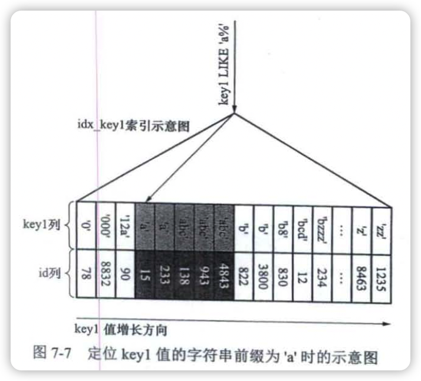

##### 1.所有搜索条件都可以生成合适的扫描区间的情况

在使用某个索引执行查询时，有时每个小的搜索条件都可以生成一个合适的扫描区间减少需要扫描的记录数量。

```mysql
Select * From single_table Where key2 > 100 And key2 > 200;
```


```mysql
Select * From single_table Where key2 > 100 Or key2 > 200;
```


##### 2.有的搜索条件不能生成合适的扫描区间的情况

```mysql
Select * From single_table Where key2 > 100 Andy common_field = 'abc';
```

(100,+∞)和(-∞,+∞)这两个扫描区间取交集后得到的结果是(100,+∞)。


##### 3.从复杂的搜索条件中找出扫描区间

```mysql
Select * From single_table Where
	(key1 > 'xyz' And key2 = 748) Or
	(key1 < 'abc' And key1 > 'lmn') Or
	(key1 Like '%suf' And key1 > 'zzz' And (key2 < 8000 Or common_field = 'abc')); 
```

分析套路：

- 首先查看 WHERE 子句中的搜索条件都涉及了哪些列，以及我们为哪些列建立了素引。

  这个查询语句的搜索条件涉及了key1、key2、common_field 这3个列，其中key1列有普通的二级素引idx_key1，key2 列有唯一二级索引uk_key2。

- 对于那些可能用到的索引，分析它们的扫描区间。

🔖


##### 4.使用联合索引执行查询时对应的扫描区间

联合索引的索引列包含多个列，B+树中的每一层页面以及每个页面中的记录采用的排序规则较为复杂。以single_table 表的 idx key_part 联合索引为例，它采用的排序规则如下所示：

- 先按照 key_part1 列的值进行排序；
- 在key_part1列的值相同的情况下，再按照 key_part2 列的值进行排序；
- 在key_part1和key_part2列的值都相同的情况下，再按照 key_part3 列的值进行排序。

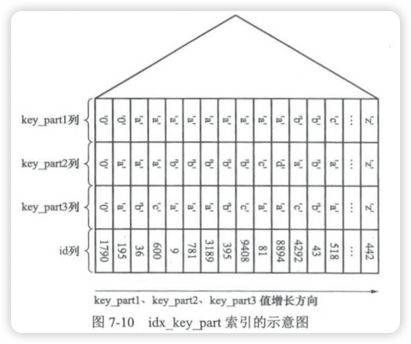

```mysql
Q1: Select * From single_table Where key_part1 = 'a';
```

可以定位到符合key_part1 ='a' 条件的第一条记录，然后沿着记录所在的单向链表向后扫描（如果本页面中的记录扫描完了，就根据叶子节点的双向链表找到下一个页面中的第一条记录，继续沿着记录所在的单向链表向后扫描)，直到某条记录不符合key_part1='a'条件为止（当然，对于获取到的每一条二级索引记录都要执行回表操作)。

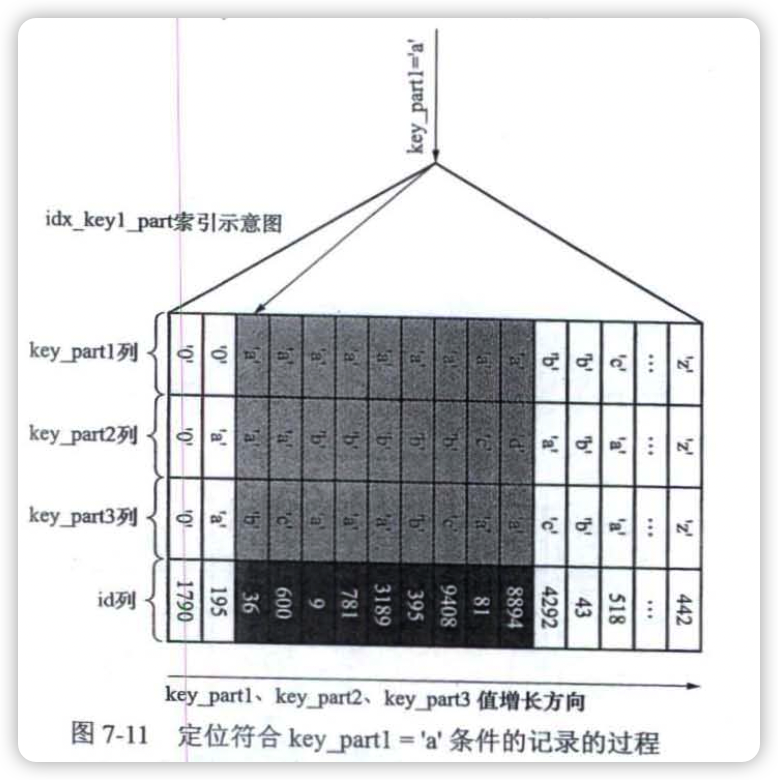

也就是说，如果使用 idx_key_part 索引执行查询语句Q1，对应的扫描区间就是['a'，'a']，形成这个扫描区间的边界条件就是key_part1 ='a'。


```mysql
Q2： SELECT * FROM single_table WHERE key_part1 = 'a' AND key_part2 = 'b';
```

由于二级索引记录是先按照key_part1列的值排序的，在key_part1列的值相等的情况下再按照key_part2列进行排序，所以符合 `key_part1='a' AND key_part2 = 'b'` 条件的二级索引记录肯定是相邻的。

也就是说，如果使用 idx_key_part 索引执行查询语句 Q2，可以形成扫描区间`[('a','b'), ('a','b')]`，形成这个扫描区间的边界条件就是 `key_part1 = 'a' AND key_part2 = 'b'`。

> `[('a','b'), ('a','b')]`代表在idx_key_part索引中，从第一条符合 `key_part1 = 'a' AND key_part2 = 'b'`条件的记录开始，到最后一条行合`key_part1 = 'a' AND key_part2 = 'b'`条件的记录为止的所有二级索引记录。

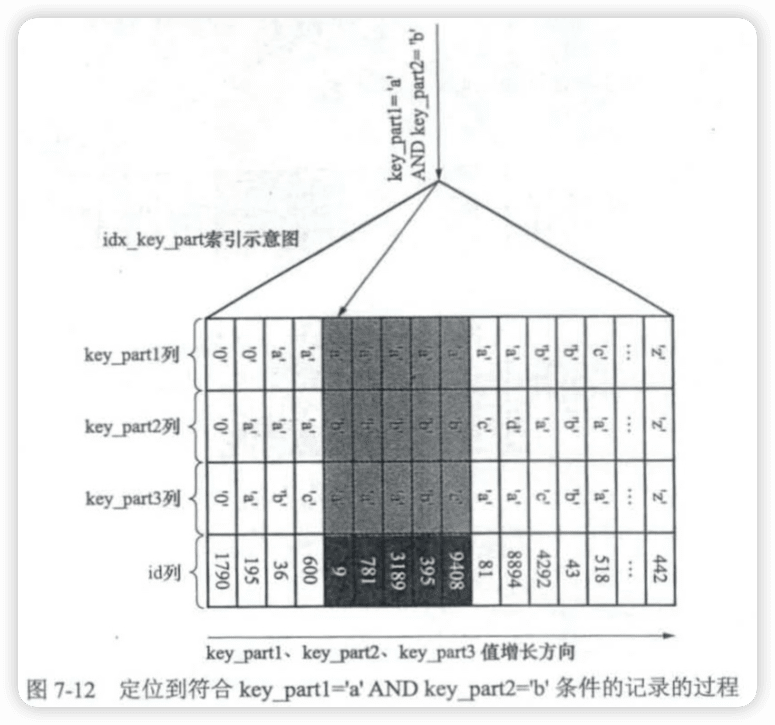


```mysql
Q3: SELECT * FROM single_table WHERE key_part1 = 'a' AND key_part2 = 'b' AND key_part3 = 'c';
```


```mysql
Q4: SELECT * FROM single_table WHERE key_part1 < 'a';
```

向后扫描

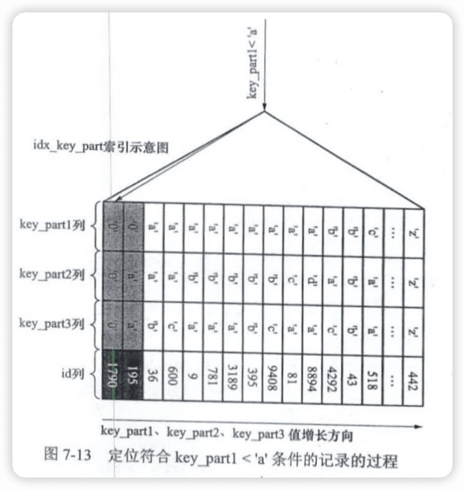


```mysql
Q5: SELECT * FROM single_table WHERE key_part1 = 'a' AND key_part2 > 'a' AND key_part2 = 'd';
```

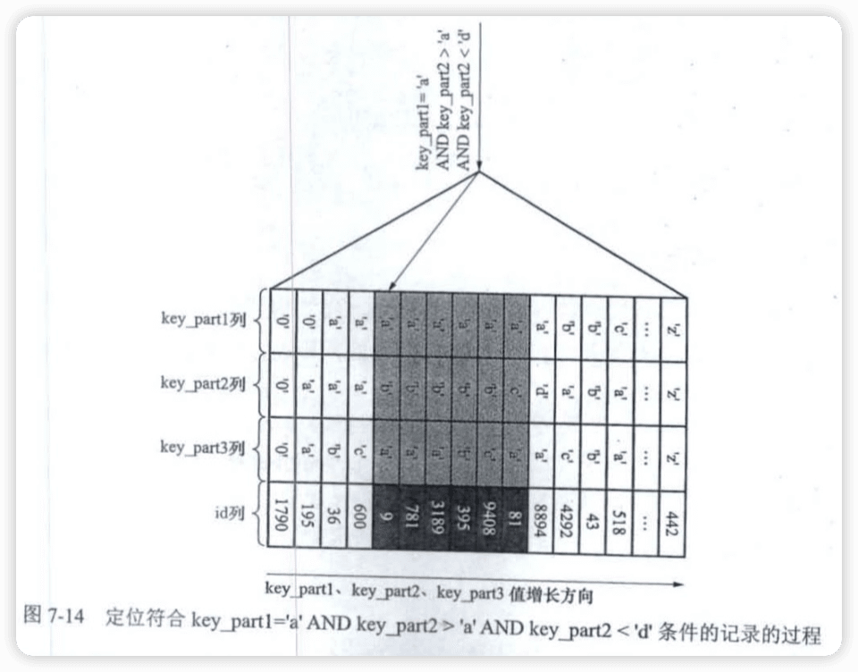


```mysql
Q6: SELECT * FROM single_table WHERE key_part2 = 'a';
```


```mysql
Q7: SELECT * FROM single_table WHERE key_part1 = 'a' AND key_part3 = 'c';
```


```mysql
Q8: SELECT * FROM single_table WHERE key_part1 < 'b' AND key_part2 = 'a';
```

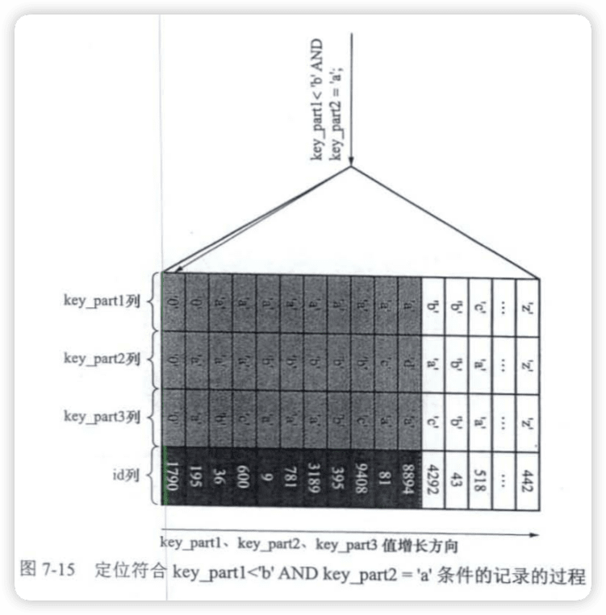


```mysql
Q9: SELECT * FROM single_table WHERE key_part1 <= 'b' AND key_part2 = 'a';
```


#### 2️⃣索引用于排序

编写查询语句时，经常需要使用Order By子句对查询出来的记录按照某种规则进行排序。一般会把记录加载到内存中，然后再用排序算法在内存中进行排序；有时结果集太大，需要暂时借助磁盘的空间存放中间结果，在排序操作完成后再把排好序的结果返回客户端。

在MySQL中，这种在内存或磁盘中进行排序的方式统称为**==文件排序（filesort）==**。

但是，如果Order By子句中使用索引列，就可能省去在内存或磁盘中排序的步骤。

```mysql
Select * From single_table Order By key_part1, key_part2, key_part3 Limit 10;
```

从第一条idx_key_part二级索引记录开始，沿着记录所在的单向链表向后扫描，取10条二级索引记录即可。

##### 1.使用联合索引进行排序时的注意事项

`Order By key_part1, key_part2, key_part3`中的列顺序必须和联合索引中列相同，因为联合索引中页面和记录的排序规则是固定的。


##### 2.不可以使用索引进行排序的几种情况

###### a. ASC、DESC混用

使用联合索引进行排序，要求各个排序列的排序规则是一致的，也就是要么各个列都是按照 ASC(升序）规则排序，要么都是按照 DESC（降序）规则排序。

> 🔖 降序  槽 

🔖


> MySQL 8.0引入了一种称为 Descending Index 的特性，可以支持 ORDER BY 子句体惜況可以中ASC、 DESC 混用的情况。 🔖

###### b. 排序列包含非同一个索引的列

```mysql
Select * From single_table Order By key1, key2 Limit 10;
```

对于 idx_key1 的二级索引记录来说，只按照key1列的值进行排序。而且在key1 值相同的情况下是不按照 key2列的值进行排序的。

###### c. 排序列是某个联合索引的索引列，但这些排序列在联合索引中并不连续

```mysql
Select * From single_table Order By key_part1, key_part3 Limit 10;
```

对于idx_key_part的二级索引记录来说，key_part1值相同的记录并不是按照key_part3排序的，所以不能使用idx_key_part执行上述查询。

###### d. 用来形成扫描区间的索引列与排序列不同

```mysql
Select * From single_table Where key1 = 'a' Order By key2 Limit 10;
```


###### e. 排序列不是以单独列的形式出现在Order By子句中

```mysql
Select * From single_table Order By Upper(key1) Limit 10;
```

要想使用索引进行排序操作，必须保证索引列是以单独列名的形式（而不是修饰过的形式）出现。

#### 3️⃣索引用于分组

```mysql
Select key_part1, key_part2, key_part3, Count(*) From single_table Group By key_part1, key_part2, key_part3;
```

这个查询语句相当于执行了3次分组操作：

- 先按照 key_part1值把记录进行分组，key_part1值相同的所有记录划分为一组。
- 将key_part1值相同的每个分组中的记录再按照key_part2的值进行分组，将key_part2值相同的记录放到一个小分组中；看起来像是在一个大分组中又细分了好多小分组。
- 再将上一步中产生的小分组按照 key_part3 的值分成更小的分组。所以整体上看起来就像是先把记录分成一个大分组，然后再把大分组分成若干个小分组，最后把若干个小分组再细分成更多的小小分组。

然后<u>针对那些小小分组进行统计</u>，上面这个查询语句就是统计每个小小分组包含的记录条数。

如果没有 idx_key_part 索引，就得建立一个用于统计的临时表，在扫描聚簇索引的记录时将统计的中间结果填入这个**临时表**。当扫描完记录后，再把临时表中的结果作为结果集发送给客户端。如果有了索引idx_key_part， 恰巧这个分组顺序又与idx_key_part的索引列的顺序是一致的，而idx_key_part的二级索引记录又是按照索引列的值排好序的，这就正好了。所以可以直接使用idx_key_part索引进行分组，而不用再建立临时表了。

与使用 B+树索引进行排序差不多，分组列的顺序也需要与索引列的顺序一致：也可以只使用索引列中左边连续的列进行分组。🔖

### 7.4 回表的代价

```mysql
SELECT * FROM single_table WHERE key1 > 'a' AND key1 < 'c';
```

可以选择下面这两种方式来执行：

- 以全表扫描的方式执行该查询

  也就是直接扫描全部的聚簇索引记录，针对每一条聚族索引记录，都判断搜索条件是否成立，如果成立则发送到客户端，否则跳过该记录。

- 使用idx_key1 执行该查询

  可以根据搜索条件key1 >'a' AND key1＜'c'。得到对应的扫描区间（'a'，'c'），然后扫描该扫描区间中的二级索引记录。由于idx_key1索引的叶子节点存储的是不完整的用户记录，仅包含key1、id这两个列，而查询列表是*，这意味着我们需要获取每条二级索引记录对应的聚族索引记录，也就是执行回表操作，在获取到完整的用户记录后再发送到客户端。

对于使用 InnoDB 存储引擎的表来说，索引中的数据页都必须存放在磁盘中，等到需要时再加载到内存中使用。这些数据页会被存放到磁盘中的一个或者多个文件中，**页面的页号对应着该页在磁盘文件中的偏移量**。以16KB 大小的页面为例，页号为0的页面对应着这些文件中偏移量为0的位置，页号为1的页面对应着这些文件中偏移量为 16KB 的位置。

B+树的每层节点会使用双向链表连接起来，上一个节点和下一个节点的页号可以不必相邻。不过在实际实现中，设计InnoDB的大叔还是**尽量让同一个索引的叶子节点的页号按照顺序排列**，之后讨论表空间时再详细说明。

也就是说，idx_key1在扫描区间（'a'，'c'）中的二级索引记录所在的页面的页号会尽可能相邻。

即使这些页面的页号不相邻，但起码一个页面可以存放很多记录，也就是说在执行完一次页面IO后，就可以把很多二级索引记录从磁盘加载到内存中。总而言之，就是读取在扫描区间（'a'，'c'）中的二级索引记录时，所付出的代价还是较小的。不过扫描区间（'a'，'c'）中的二级索引记录对应的 id 值的大小是毫无规律的，我们每读取一条二级索引记录，就需要根据该二级索引记录的id值到聚簇索引中执行回表操作。如果对应的聚族索引记录所在的页面不在内存中，就需要将该页面从磁盘加载到内存中。**由于要读取很多 id 值并不连续的聚簇索引记录，而且这些聚簇索引记录分布在不同的数据页中，这些数据页的页号也毫无规律，因此会造成大量的随机IO。**

**需要执行回表操作的记录越多，使用二级索引进行查询的性能也就越低，某些查询宁愿使用全表扫描也不使用二级索引。**比如，假设key1 值在'a'~'c之间的用户记录数量占全部记录数量的 99%以上，如果使用 idx_key1 索引，则会有99%以上的id值需要执行回表操作。这不是吃力不讨好么，还不如直接执行全表扫描。

> 什么时候采用<u>全表扫描</u>，什么时候使用<u>二级索引＋回表</u>的方式呢？
>
> 这就是==查询优化器==应该做的工作。查询优化器会事先针对表中的记录计算一些统计数据，然后再利用这些统计数据或者访问表中的少量记录来计算需要执行回表操作的记录数。如果需要执行回表操作的记录数越多，就越倾向于使用全表扫描，反之则倾向于使用二级索引＋回表的方式。当然查询优化器所做的分析工作没有这么简单，但大致上是这样一个过程。

一般，使用Limit子句限制查询返回的记录数，会让查询优化器倾向于二级索引＋回表的方式，原因是回表的记录越少，性能提升就越高。比如：

```mysql
SELECT * FROM single_table WHERE key1 > 'a' AND key1 < 'c' Limit 10;
```

对于需要对结果进行排序的查询，如果在采用二级索引执行查询时需要执行回表操作的记录特别多，也倾向于使用<u>全表扫描＋文件排序</u>的方式执行查询。比如：

```mysql
SELECT * FROM single_table ORDER BY key1;
```

由于查询列表是 *，如果使用二级索引进行排序，则需要对所有二级索引记录执行回表操作。这样操作的成本还不如直接遍历聚簇索引然后再进行文件排序低，所以查询优化器会倾向于使用全表扫描的方式执行查询。

### 7.5 更好地创建和使用索引🔖

#### 1 只为用于搜索、排序或分组的列创建索引

#### 2 考虑索引列中不重复值的个数

列中不重复值得个数占全部记录条数的比例太低，说明该列包含过多重复值，那么通过二级索引＋回表的方式执行查询时，就有可能执行太多次回表操作。

#### 3 索引列的类型尽量小

数据类型占用的存储空间越小，索引占用的存储空间越少，在一个数据页就可以存放更多的记录，磁盘I/O带来的性能损耗也就越小（一次页面I/O可以将更多的记录加载到内存中），读写效率页就越高。

这个建议对于表的主键来说更加适用，因为不仅聚簇索引会存储主键值，其他所有的二级索引的节点都会存储一份记录的主键值。**如果主键使用更小的数据类型中就以为着能节省更多的存储空间。**

#### 4 为列前缀建立索引

只将字符串的前几个字符存放到索引中

```mysql
Alter Table single_table Drop Index idx_key1;
Alter Table single_table Add Index idx_key1(key1(10));
```

#### 5 覆盖索引

为了彻底告别回表操作带来的性能损耗，建议最好在查询列表中只包含索引列：

```mysql
Select key1, id From single_table Where key1 > 'a' And key1 < 'c';
```

key1和id列在二级索引记录中可直接读取，不需要回表到聚簇索引中查询。

这种索引中已经包含所有需要读取的列的查询方式称为**覆盖索引**。

排序操作也优先使用覆盖索引进行查询：

```mysql
Select key1 From single_table Order By key1;
```

#### 6 让索引列以列名的形式在搜索条件中单独出现

```mysql
Select * From single_table Where key2 * 2 < 4;

Select * From single_table Where key2 < 4/2;
```

在第一个查询语句的搜素条件中，key2列并不是以单独列名的形式出现的，而是以 `key2 * 2`这样的表达式的形式出现的。<u>MySQL 并不会尝试简化 `key2*2<4` 表达式，而是直接认为这个搜索条件不能形成合适的扫描区间来减少需要扫描的记录数量，所以该查询语句只能以全表扫描的方式来执行。</u>

#### 7 新插入记录时主键大小对效率的影响

最好让插入记录的主键值依次递增。Auto_Increment

#### 8 避免冗余和重复索引


### 7.6 总结

为了方便理解，我们简化了B+树索引的示意图，在其中省略了页面结构，只保留了叶子节点中的记录。

B+树索引在空间和时间上都有代价，所以没事儿别瞎建索引。

索引可以用于减少需要扫描的记录数量，也可以用于排序和分组。

在使用索引来减少需要扫描的记录数量时，应该先找到使用该索引执行查询时对应的**扫描区间和形成该扫描区间的边界条件**，然后就可以扫描各个扫描区间中的记录。

如果扫描的是二级索引记录，并且如果需要完整的用户记录，就需要根据获取到的每条二级索引记录的主键值执行**回表**操作。

在创建和使用索引时应注意下列事项: 🔖

- 只为用于**搜索、排序或分组**的列创建索引；
- 当列中不重复值的个数在总记录条数中的占比很大时，才为列建立索引;
- 索引列的类型**尽量小**;
- 可以只为**索引列前缀**创建索引，以减小索引占用的存储空间;
- 尽量使用**覆盖索引**进行查询，以避免回表操作带来的性能损耗;
- 让索引列以列名的形式单独出现在搜索条件中;
- 为了尽可能少地让聚簇索引发生**页面分裂**的情况，建议让主键拥有AUTO INCREMENT属性；
- 定位并删除表中的冗余和重复索引。


## 8 数据的家——MySQL的数据目录

>  MySQL 5.7.22

### 8.1 数据库和文件系统的关系

想InnoDB、MyISAM这样的存储引擎都是把数据存储在文件系统上。那么它们的数据是如何在文件系统中存储的？

### 8.2 MySQL数据目录

MySQL服务器程序在启动时，会到文件系统的某个目录下加载一些数据，之后在运行过程中产生的数据也会存储到这个目录下的某些文件中。这个目录称为==数据目录==。

数据目录时用来存储MySQL在运行过程中产生的数据。

```mysql
Show variables like 'datadir';
+---------------+--------------------------+
| Variable_name | Value                    |
+---------------+--------------------------+
| datadir       | /opt/homebrew/var/mysql/ |
+---------------+--------------------------+
1 row in set (0.00 sec)
```

### 8.3 数据目录的结构

MySQL运行过程中会产生==数据库、表、视图和触发器==等用户数据，另外MySQL也会创建一些额外的数据。

#### 数据库在文件系统中的表示

每个数据库都对应数据目录下的一个子目录。

每当创建一个数据库是，MySQL会做两件事：

- 在数据目录下创建一个与数据库名同名的子目录（除了information_schema）
- 在子目录下创建**db.opt**文件（存储一些如字符集和比较规则的数据库属性）🔖

#### 表在文件系统中的表示

表信息：

- 表结构的定义（名称、列数、每个列的数据类型、约束条件、索引、字符集、比较规则等），二进制文件`表名.frm`
- 表数据

> Mysql8后 表结构文件.frm合并到.idb中了。

##### InnoDB是如何存储表数据的

为了更好地管理这些页，设计者抽象出一个概念，**表空间（table space）**或者**文件空间（file space）**，对应文件系统上一个或多个真实文件。每一个表空间可以被划分为很多个页。

###### 1.系统表空间（system tablespace）

`innodb_data_file_path`

`innodb_data_home_dir`

###### 2.独立表空间（file-per-table tablespace）

MySQL5.6.6之后，innodb不在默认把各个表的数据存储到系统表空间中，而是为每个表建立一个独立表空间。独立表空间的对应文件为`表名.idb`。

`innodb_file_per_table`

###### 3.其它类型的表空间

如通用表空间、undo表空间、临时表空间等。

##### MyISAM是如何存储表数据的

```mysql
CREATE TABLE  `test_myisam`(
   `id` INT  AUTO_INCREMENT, 
   `title` VARCHAR(100) NOT NULL,
   `author` VARCHAR(40) NOT NULL,
   PRIMARY KEY ( `id` )
)ENGINE=MyISAM DEFAULT CHARSET=utf8;
```

`.frm`－－存储数据表定义，此文件非MyISAM引擎的一部分。

`.MYD`－－存放真正的数据。

`.MYI`－－存储索引信息。

#### 其它文件

- 服务器进程文件（`*.pid`）

- 服务器日志文件（`*.err`）：查询日志、错误日志、二进制日志、redo日志等。

- SSL和RSA证书与密钥文件：为了客户端和服务器安全通行。

  ```shell
  ll  /opt/homebrew/var/mysql/*.pem
  -rw-------  1 andyron  admin   1.6K 11  4 20:48 /opt/homebrew/var/mysql/ca-key.pem
  -rw-r--r--  1 andyron  admin   1.1K 11  4 20:48 /opt/homebrew/var/mysql/ca.pem
  -rw-r--r--  1 andyron  admin   1.1K 11  4 20:48 /opt/homebrew/var/mysql/client-cert.pem
  -rw-------  1 andyron  admin   1.6K 11  4 20:48 /opt/homebrew/var/mysql/client-key.pem
  -rw-------  1 andyron  admin   1.6K 11  4 20:48 /opt/homebrew/var/mysql/private_key.pem
  -rw-r--r--  1 andyron  admin   452B 11  4 20:48 /opt/homebrew/var/mysql/public_key.pem
  -rw-r--r--  1 andyron  admin   1.1K 11  4 20:48 /opt/homebrew/var/mysql/server-cert.pem
  -rw-------  1 andyron  admin   1.6K 11  4 20:48 /opt/homebrew/var/mysql/server-key.pem
  ```


### 8.4 文件系统对数据库的影响

- 数据库名称和表名称不得超过文件系统所允许的最大长度
- 特殊字符的问题
- 文件长度受文件系统最大长度的限制。


### 8.5 MySQL系统数据库简介

- `mysql`：存储了 MySQL 的**用户账户和权限信息、一些存储过程和事件的定义信息、一些运行过程中产生的日志信息、一些帮助信息以及时区信息**等。
- `information_schema`：保存着MySQL 服务器维护的所有其他数据库的信息，比如有哪些表、哪些视图、哪些触发器、哪些列、哪些索引等。这些信息并不是真实的用户数据，而是一些<u>描述性信息</u>，有时候也称之为<u>元数据</u>。
- `performance_schema`：主要保存MySQL 服务器运行过程中的一些<u>状态信息</u>，算是对 MySQL 服务器的一个<u>性能监控</u>。它包含的信息有统计最近执行了哪些语句，在执行过程的每个阶段都花费了多长时间，内存的使用情况等。
- `sys`：这个数据库主要是通过视图的形式把 information_schema 和 performance_schema结合起来，让开发人员更方便地了解MySQL 服务器的性能信息。

### 8.6 小结

像InnoDB、MyISAM这样的存储引擎都是**把数据存储在文件系统上**。

MySQL服务器程序在启动时会到数据目录中加载数据，运行过程中产生的数据也会被存储到数据目录中。系统变量`datadir`表明了数据目录的路径。

每个数据库都对应着数据目录下的一个子目录，该子目录中包含一个名为`db.opt`的文件。这个文件包含了该数据库的一些属性，比如该数据库的字符集和比较规则等。

对于InnoDB存储引擎来说:

- 如果使用系统表空间存储表中的数据，那么只会在该表所在数据库对应的子目录下创建一个名为“`表名.frm`”的文件，表中的数据会存储在系统表空间对应的文件中;
- 如果使用独立表空间存储表中的数据，那么会在该表所在数据库对应的子目录下创建一个名为“`表名.frm`”的文件和一个名为“`表名.ibd`”的文件，表中的数据会存储这个“表名.ibd”文件中。

对于MyISAM存储引擎来说，会在该表所在数据库对应的子目录下创建3个文件。

- `表名.frm`:表示表的结构文件。
- `表名.MYD`:表示表的数据文件。
- `表名.MYI`:表示表的索引文件。

数据目录中除了存储用户数据外，还需要存储一些额外的文件，包括:

- 服务器进程文件；
- 服务器日志文件;
- SSL和 RSA 证书与密钥文件。

特定的文件系统会对MySQL服务器程序的运行产生一些影响，比如:

- 数据库名称和表名称不得超过文件系统所允许的最大长度;
- 特殊字符的问题:
- 文件长度受文件系统最大长度的限制。

为了存储MySQL服务器**运行过程中所需的信息以及运行状态信息**，设计MySQL的大叔设计了下面这些系统数据库:

- `mysql` ;
- `information_schema` ;
- `performance_schema` ;
- `sys`。


## 9 存放页面的大池子——InnoDB的表空间

**==表空间==**是一个**抽象的概念**，对于==系统表空间==来说，对应着文件系统中一个或多个实际文件；对于每个==独立表空间==来说，对应着文件系统中一个名为“表名.idb”的实际文件。

可以把表空间想象成被切分为许多个页的池子，当想为某个表插入一条记录的时候，就从池子中捞出一个对应的页把数据写进去。

> InnoDB支持许多种类型的表空间，本章重点关注独立表空间和系统表空间的结构。

### 9.1 回顾旧知识

#### 页的类型

**==InnoDB是以页为单位管理存储空间的。==**

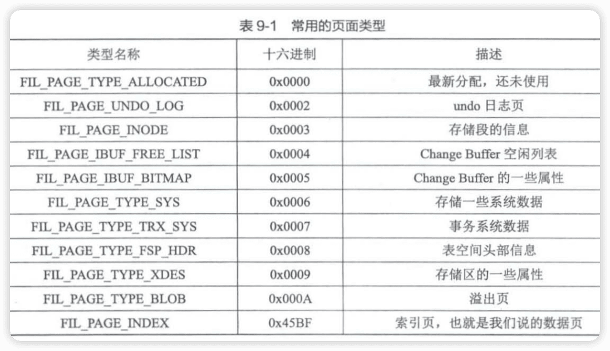

由于类型名称都有前缀**FIL_PAGE_**或**FIL_PAGE_TYPE**，之后可省略前缀。

#### 页通用部分

[数据页有7部分](#5.2 数据页结构快览)组成，其中两个部分是其它类型页通用的。


- 表空间的每一个页都有对应的页号，就是**FIL_PAGE_OFFSET**，4个字节，32位，也就是表示一个表空间最多可也拥有2^32^个页。如果按照默认页大小16KB计算，那么一个表空间最多支持==64TB==的数据。
- `FILE_PAGE_PREV`和`FILE_PAGE_NEXT` 主要用于INDEX类型的页（数据页），在建立B+树后，使用这两个字段为每层节点建立双向链表。

### 9.2 独立表空间结构

#### 1️⃣区的概念

为了管理表空间中太多的页，有了**区（extent）**。一个区是**==连续==**的64个页，也就是16K*64=1M。系统表空间和独立表空间都可以看成若干连续的区组成，每256区被划分成一**组**。

> 页（`16K`） ->  区（`16K*64=1M`） ->  组（`1M*256`） ->  表空间

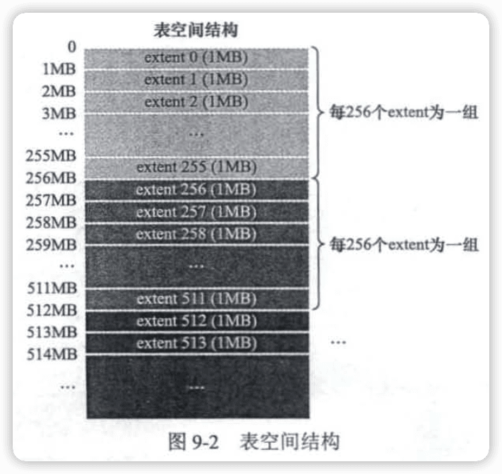

每个组最开始的几个页面的类型是固定。

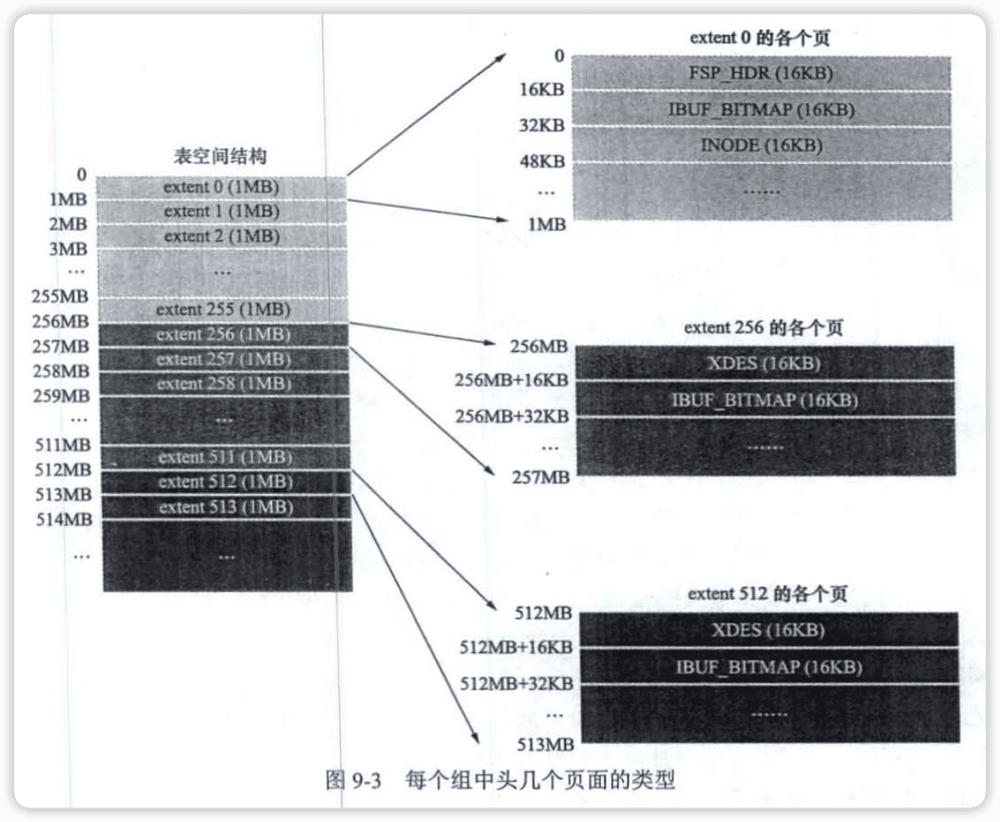

第一组最开始的3个页面的类型是固定的，也就是extent 0这个区最开始的3个页面：

- **==FSP_HDR==**：表空间的一些整体属性，和本组所有区（就是extent 0 ~extent 255）的属性。整个表空间只有一个。
- **==IBUF_BITMAP==**：存储关于Change Buffer的信息。
- **==INODE==**：存储数据结构 INODE Entry。

其余各组最开始的2个页面的类型是固定的：

- **XDES**（extent descriptor）：用来登记本组256个区的属性。
- **IBUF_BITMAP**

#### 2️⃣段（segment）的概念

为了对B+树的叶节点和非叶子节点进行区别对待。存放叶子节点的区的集合就算一个段，同样存放非叶子节点的区的集合就算另一个段。逻辑上的概念。

🔖

> “以完整的区为单位分配给某个段时，对于数据量较小的表来说太浪费空间”
>
> **碎片（fragment）区**
>
> 碎片区中的页可以用于不同的目的
>
> 碎片区直属于表空间
>
> 以后为某个段分配存储空间的策略：
>
> - 在刚开始向表中插入数据时，段是从某个碎片区以单个页面为单位来分配存储空间的；
> - 当某个段已经占用了32 个碎片区页面之后，就会以完整的区为单位来分配存储空间（原先占用的碎片区页面并不会被复制到新申请的完整的区中）。

段精确来说是**某些零散的页面以及一些完整的区的集合**。

回滚段等

#### 3️⃣区的分类

- 空闲的区：现在还没有用到这个区中的任何页面。
- 有剩余空闲页面的碎片区：表示碎片区中还有可被分配的空闲页面。
- 没有剩余空闲页面的碎片区：表示碎片区中的所有页面都被分配使用，没有空闲页面。
- 附属于某个段的区：我们知道，每一个索引都可以分为叶子节点段和非叶子节点段。除此之外，IonoDB 还会另外定义一些特殊用途的段。当这些段中的数据量很大时，将使用区作为基本的分配单位，这些区中的页面完全用于存储该段中的数据〈而碎片区可以存储属于不同段的数据)。

这4种类型的区也可以称为区的 4种状态(State），设计 IonoDB 的大叔为这 4种状态的区定义了特定的名词：


前3种状态的区都是独立的，算是直属于表空间；而FSEG是附属于某个段的。

> 如果把表空间比作一个集团军，段就相当于师，区就相当于团。一般来说，团都是隶属于某个师，就像是处于 FSEG 的区全都棗属于某个段；而处于 FREE、FREE_FRAG 以及FULL_FRAG 这了种状态的区却直接来属于表空问，就像独立团直接听命于军部一样。

为了方便管理区，设计者设计了一个称为==XDES Entry (Extent Descriptor Entry）==的结构。每一个区都对应着一个XDES Entry结构，这个结构记录了对应的区的一些属性。

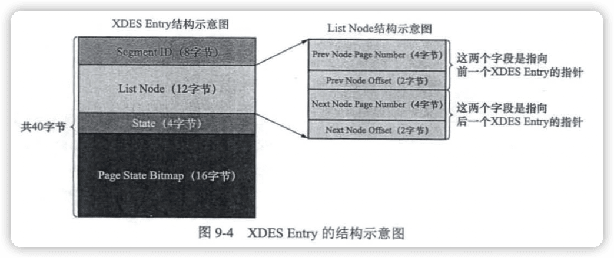

XDES Entry 结构有40字节，大致分为4个部分：

- **Segment ID**(8字节）：每一个段都有一个唯一的编号，用ID表示。Segment ID字段表示的就是**该区所在的段**，前提是该区已经被分配给某个段了，不然该字段的值没有意义。

- **List Node**(12 字节）：这个部分可以将若干个 XDES Entry结构串连成一个链表。 

  如果我们想定位表空间内的某一个位置，只需指定==页号==以及该位置在指定页号中的页内==偏移量==即可。

  + Pre Node Page Number 和Pre Node Offset 的组合就是指向前一个 XDES Entry 的指针。
  + Next Node Page Number 和 Next Node Offset 的组合就是指向后一个 XDES Entry 的指针。

- **State**（4 字节)：这个字段表明区的状态。可选的值分别是 FREE、FREE FRAG、 FULLFRAG 和 FSEG。
- **Page State Bitmap**（16 字节)：共128位。一个区默认有64个页，这128位被划分为64个部分，每个部分有2位，对应区中的一个页。比如Page State Bitmap 部分的第1位和第2 位对应着区中的第1个页面，第了位和第4位对应着区中的第2个页面...第 127 位和 128 位对应着区中的第 64 个页面。这2个位中的<u>第1位表示对应的页是否是空闲的，第2位还没有用到</u>。

##### 1 XDES Entry链表

> 提出各种概念 —— **区、段、碎片区、附属于段的区、XDESEntry结构**，都是==为了减少随机I/O，而又不至于让数据量少的表浪费空间==。

向表中插入数据本质上就是向表中各个索引的叶子节点段、非叶子节点段插入数据。

向某个段中插入数据时，申请新页面的过程：

- 当段中数据较少时，首先会查看表空间中是否有状态为FREE_FRAG的区（也就是查找还有空闲页面的碎片区)。
- 如果找到了，那么从该区中取一个零散页把数据插进去；
- 否则到表空间中申请一个状态为FREE的区（也就是空闲的区），把该区的状态变为FREE_FRAG， 然后从该新申请的区中取一个零散页把数据插进去。
- 之后，在不同的段使用零散页的时候都从该区中取，直到该区中没有空闲页面；然后该区的状态就变成了FULL_FRAG。

> 问题：怎么知道表空间中哪些区的状态是FREE,哪些区的状态是FREE_FRAG，哪些区的状态是 FULL_FRAG呢？

使用XDES Entry中的List Node中的指针做下面3件事。

- 通过List Node把状态为FREE的区对应的XDES Entry结构连接成一个链表，这个链表称为==FREE链表==。
- 通过List Node把状态为FREE_FRAG的区对应的 XDES Entry 结构连接成一个链表，这个链表称为==FREE_FRAG链表==。
- 通过 List Node把状态为FULL_FRAG的区对应的 XDES Entry 结构连接成一个链表，这个链表称为==FULL_FRAG链表==。

这样一来，每当想查找一个 FREE FRAG 状态的区时，就直接把 FREE FRAG 链表的头节点拿出来，从这个节点对应的区中取一些零散页来插入数据。...

> 怎么知道哪些区属于哪个段呢？

 🔖

##### 2 链表基节点

> 怎么找到前面各种链表的头节点或者尾节点在表空间中的位置呢？

List Base Node（链表基节点），包含了链表的头节点和尾节点的指针以及这个链表中包含了多少个节点的信息。

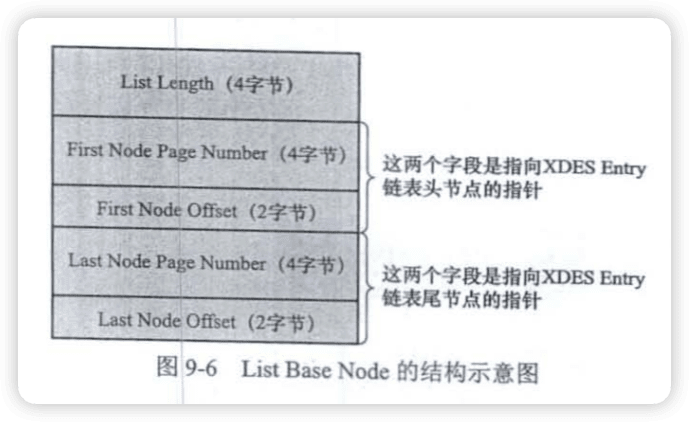

前面介绍的每个链表都对应这么一个List Base Node结构，其中：

- List Length 表明该链表一共有多少个节点：
- First Node Page Number 和 First Node Oriset 表明该链表的头节点在表空间中的位置：
- Last Node Page Number 和 Last Node Ofiset 表明该链表的尾节点在表空间中的位置。

一般把某个链表对应的List Base Node结构放置在表空间中的固定位置。

##### 3.链表小结

综上所述，表空间是由若干个区组成的，每个区都对应一个XDES Entry 结构。直属于表空间的区对应的XDES Entry 结构可以分成 FREE、FREE_FRAG和FULL_FRAG这了个链表。每个段可以拥有若干个区，每个段中的区对应的 XDES Entry 结构可以构成 FREE、NOI_FULL 和FULL这了个链表。每个链表都对应一个List Base Node结构，这个结构中记录了链表的头尾节点的位置以及该链表中包含的节点数。正是因为这些链表的存在，管理这些区才变成了一件相当容易的事情。

#### 4️⃣段的结构

段是一个==逻辑==上的概念，是某些零散的页面以及一些完整的区的集合。

类似每个区都有对应的XDES Entry来记录这个区中的属性一样，每个段都定义了一个**INODE Entry**结构来记录这个段中的属性。IODE Entry结构中各个部分的含义如下：

- **Segment ID**：这个NODE Entry结构对应的段的编号（ID)。
- **NOT_FULL_N_USED**：在NOT_FULL 链表中已经使用了多少个页面。
- 3个**List Base Node**：分别为段的FREE链表、NOT_FULL链表、FULL链表定义了List Base Node, 这样当想查找某个段的某个链表的头节点和尾节点时，可以直接到这个部分找到对应链表的 List Base Node。
- **Magic Number**：用来标记这个INODE Entry是否己经被初始化（即把各个字段的值都填进去了）。如果这个数字的值是 97,937,874，表明该NODE Entry 己经初始化，否则没有被初始化（不用纠结值 97,937,874 有啥特殊含义，这是人家规定的)。
- **Fragment Array Entry**：前面强调过无数次，段是一些零散页面和一些完整的区的集合，每个Fragment Array Entry 结构都对应着一个零散的页面，这个结构一共4字节，表示一个零散页面的页号。

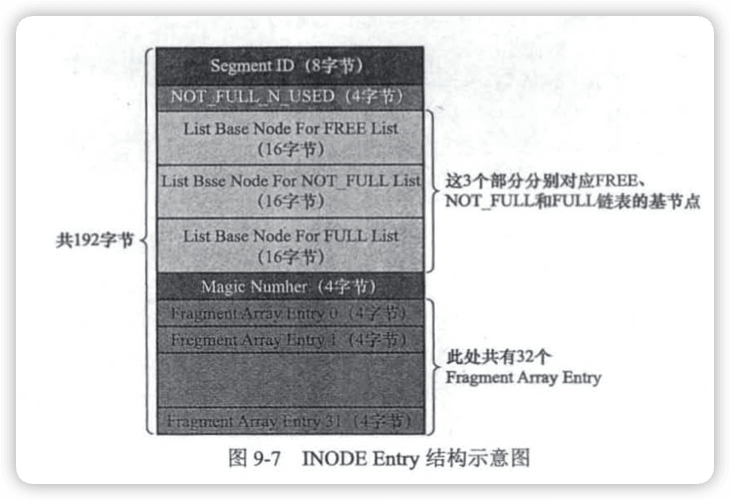

#### 5️⃣各类型页面详细情况

##### 1.FSP_HDR类型

第一个组的第一个页面，当然也是表空间的第一个页面，页号为0。它存储了表空间的一些整体属性以及第一个组内256个区对应的XDES Entry结构。

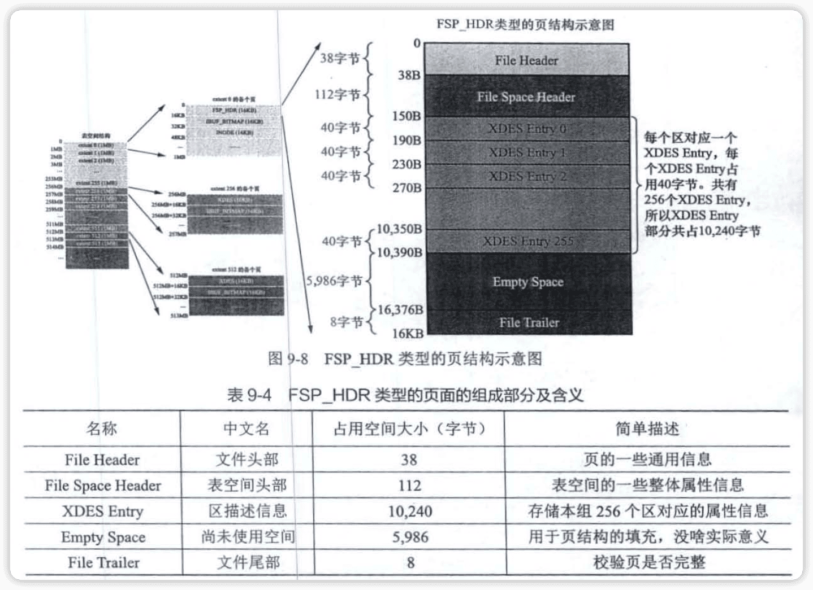

###### a. File Space Header

表空间的一些整体属性

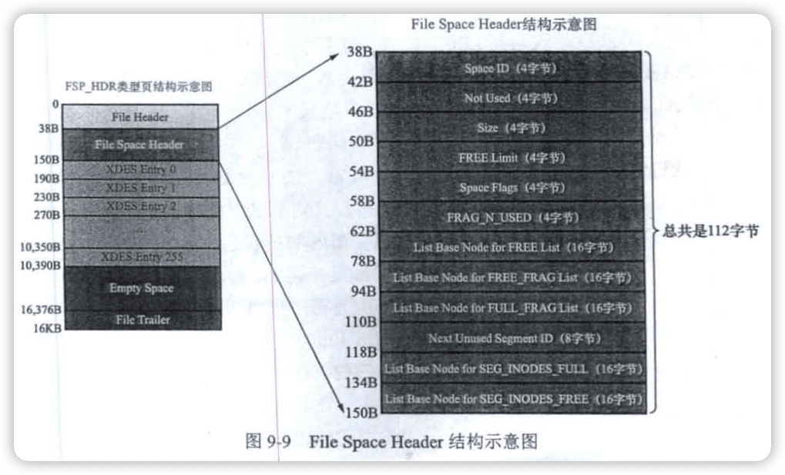

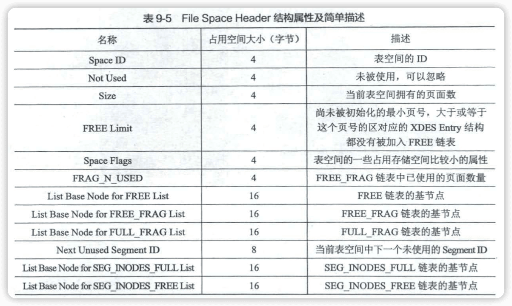

🔖

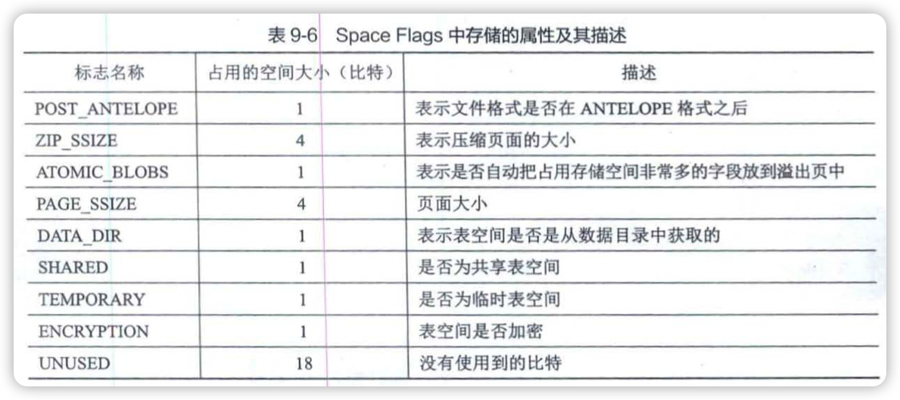

###### b. XDES Entry部分

XDES Entry 就存储在表空间的第一个页面中。一个40字节，由于一个页面的大小有限，只能存放数量有限的 XDES Entry 结构，所以我们才把 256个区划分成一组，在每组的第一个页面中存放 256个XDES Entry 结构。

XDES Entry 0对应着 extent 0， XDES Entry 1 对应着 extent 1 ... XDES Entry 255 对应着 extent 255。

因为每个区对应的XDES Entry结构的地址是固定的，因此可以很轻松地访问extent 0对应的 XDES Entry 结构（页面偏移量为150字节）、extent 1 对应的 XDES Entry 结构（页面偏移量为150+ 40 字节）、extent 2对应的 XDES Entry 结构（页面偏移量为 150+ 80字节）等等。


##### 2.XDES类型

整个表空间里只有一个FSP_HDR类型的页面。除第一个分组以外，之后每个分组的第一个页面只需要记录本组内所有的区对应的 XDES Entry 结构即可，不需要再记录表空间的属性。为了与FSP_HDR类型进行区别，把之后每个分组中第一个页面的类型定义为==XDES==。

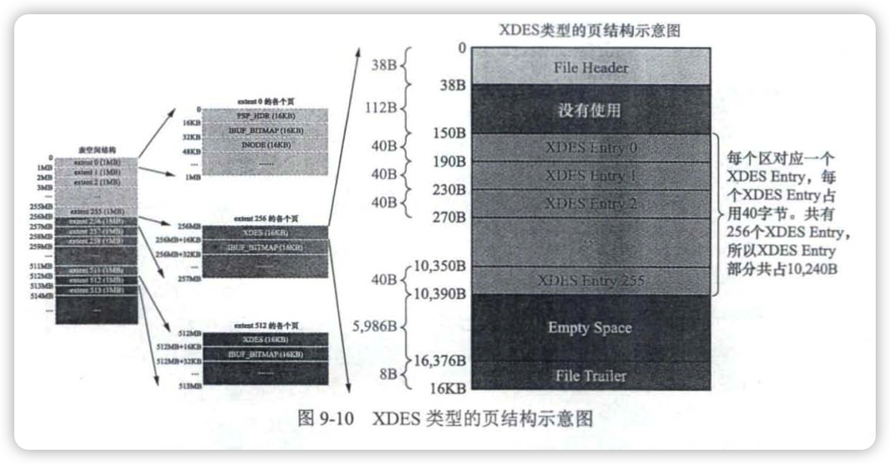

XDES类型的页面除了没有File Space Header部分之外，其余部分都和FSP_HDR相同。

##### 3.IBUF_BITMAP类型

每个分组中第二个页面的类型都是==IBUF_BITMAP==，记录了一些有关Change Buffer的东西。

平时说向表中插入一条记录，其实本质上是==向每个索引对应的B+树中插入记录==。该记录<u>首先插入聚族索引页面，然后再插入每个二级索引页面</u>。这些页面在表空间中随机分布，将会产生大量的随机I/O，严重影响性能。对于UPDATE和DELETE操作来说，也会带来许多的随机 1/0。所以InnoDB设计者引入了一种称为==Change Buffer==的结构（本质上也是表空间中的一颗B+树，它的根节点存储在系统表空间中）。

在修改非唯一二级索引页面时（修改唯一二级索引页面时是否利用 Change Buffer 取决于很多情况），如果该页面尚未被加载到内存中（仍在磁盘上），那么该修改将先被暂时缓存到 Change Buffer 中，之后服务器空闲或者其他什么原因导致对应的页面从磁盘上加载到内存中时，再将修改合并到对应页面。

##### 4.INODE类型

图9-3中，第一个分组中第三个页面的类型是INODE，这个页是**为了存储INODE Entry结构而存在的**。

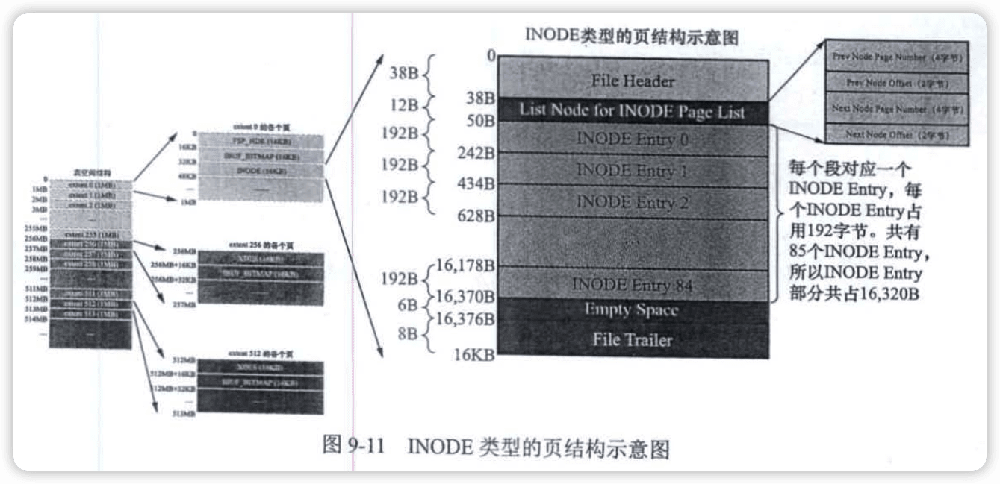

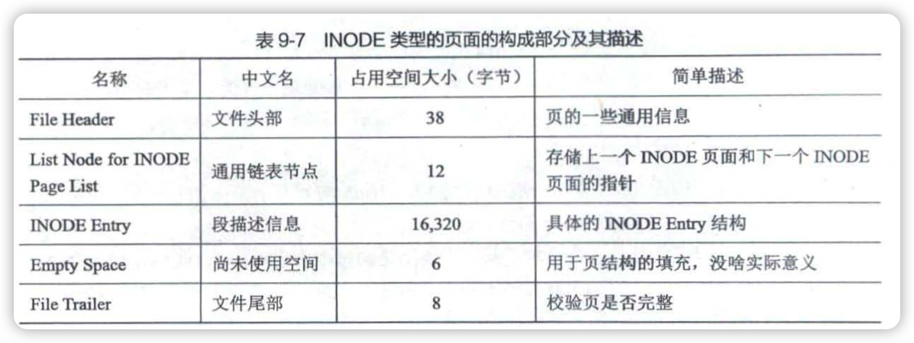

🔖


#### 6️⃣Segment Header结构的运用

🔖


#### 7️⃣真实表空间对应的文件大小

.idb文件是自扩展的，随着表中数据的增多，表空间对应的稳就也逐渐增大。


### 9.3 系统表空间

系统表空间结构与独立表空间类似，**只不过整个MySQL进程只有一个系统表空间，系统表空间中需要记录一些与整个系统相关的信息**。

#### 系统表空间的整体结构

系统表空间不同于独立表空间的地方就是**==在表空间开头有许多记录整个系统属性的页面==**：


系统表空间和独立表空间的前了个页面（页号分别为0、1、2，类型分别是FSP_HIDR、IBUF_BITMAP、INODE 的类型是一致的，但是页号为3~7的页面是系统表空间特有的。

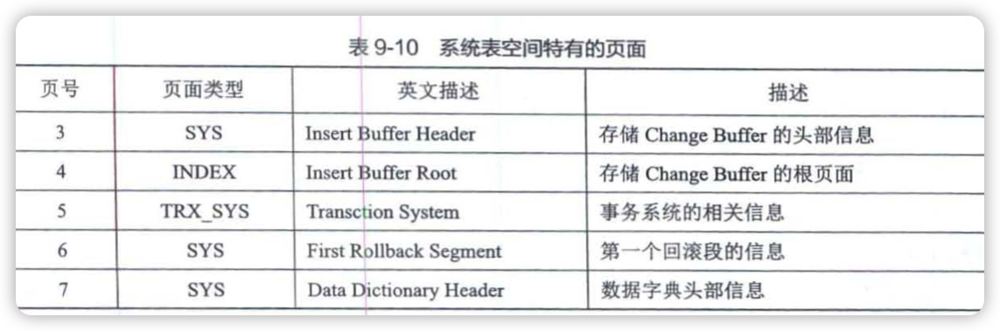

系统表空间extent 1和extent 2这个两区（也就是页号从64~191的这128个页面）称为**Doublewrite Buffer（双写缓冲区）**。

##### InnoDB数据字典

平时使用INSERT 语句向表中插入的那些记录称为==用户数据==。MySQL只是作为一个软件来为我们来保管这些数据，提供方便的增刪改查接口而己。但是每当向一个表中插入一条记录时，MySQL先要**校验插入语句所对应的表是否存在，以及插入的列和表中的列是否符合**。如果语法没有问题，还需要知道**该表的聚族索引和所有一级索引对应的根页面是哪个表空间的哪个页面**，然后把记录插入对应素引的B+树中。所以，MySQL除了保存着我们插入的用户数据之外，还需要保存许多==额外的信息==，比如：

- 某个表属于哪个表空间，表里面有多少列；
- 表对应的每一个列的类型是什么；
- 该表有多少个索引，每个索引对应哪几个字段，该索引对应的根页面在哪个表空间的哪个页面；
- 该表有哪些外键，外键对应哪个表的哪些列；
- 某个表空间对应的文件系统上的文件路径是什么。

上述信息并不是使用INSERT 语句插入的用户数据，实际上是为了更好地管理用户数据而不得己引入的一些额外数据，这些数据也称为==元数据==。InnoDB存储引擎特意定义了一系列的==内部系统表（internal system table）==来记录这些元数据。

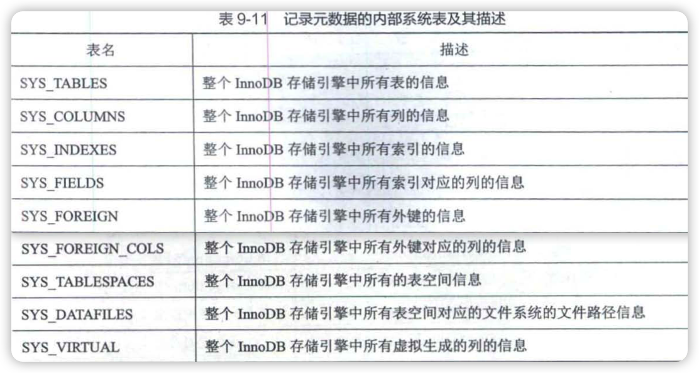

这些系统表也被称为**==数据字典==**，它们都是以B+树的形式保存在系统表空间的某些页面中。其中SYS_TABLES、SYS_COLUMNS、 SYS_IDEXES、SYS_FIELDS 这4个表尤其重要，称为==基本系统表 (basic system table）==。

###### 1.SYS_TABLES

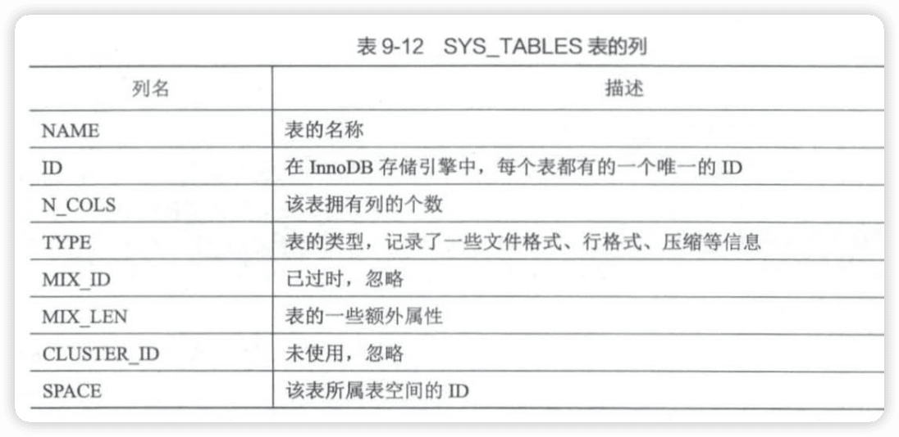

有两个索引：

- 以NAME列为主键的聚簇索引
- 以ID列建立的二级索引

###### 2.SYS_COLUMNS

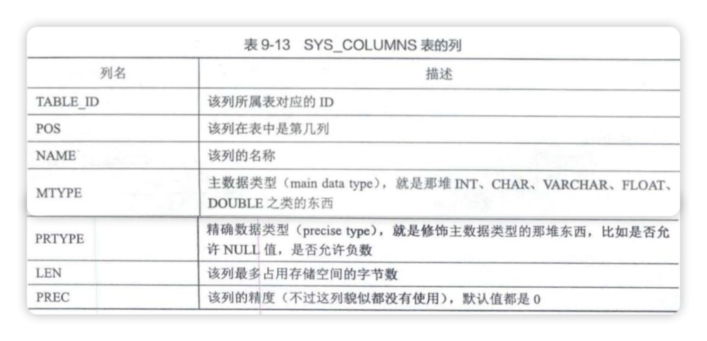

只有一个以（TABLE_ID，POS）为主键的聚簇索引。

###### 3.SYS_INDEXES

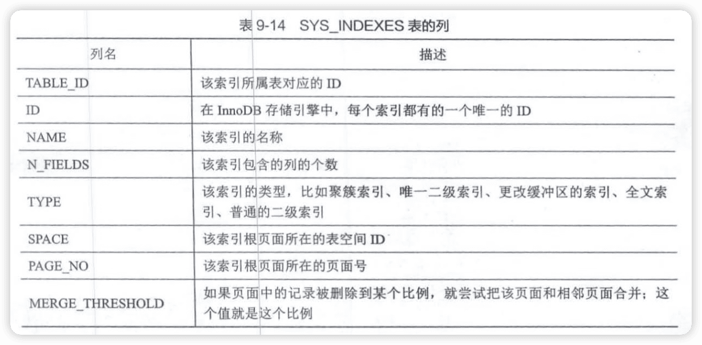

只有一个以（TABLE_ID，ID）为主键的聚簇索引。

###### 4.SYS_FIELEDS

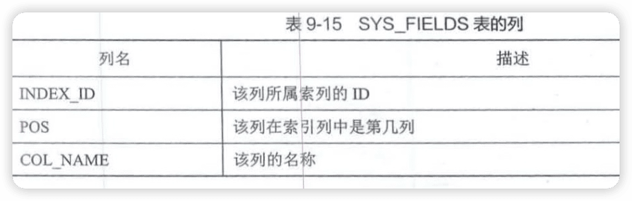

只有一个以（INDEX_ID，POS）为主键的聚簇索引。

###### 5.Data Dictionary Header页面

只要有了上述4个基本系统表，也就意味着**可以获取其他系统表以及用户定义的表的所在元数据**。比如，想看一下 SYS_TABLESPACES 系统表中存储了哪些表空间以及表空间对应的属性，就可以执行下述操作：

- 根据表名到`SYS_TABLES`表中定位到具体的记录，从而获取到`SYS_TABLESPACES`表的`TABLE_ID`。
- 使用获取的`TABLE_ID`到`SYS_COLUMNS`表中就可以获取到属于该表的所有列的信息。
- 使用获取的`TABLE_ID`还可以到`SYS_IDEXES`表中获取所有的索引的信息。索引的信息中包括对应的`INDEX_ID`，还记录着该索引对应的<u>B+树根页面是哪个表空间的哪个页面</u>。
- 使用获取的`INDEX_ID`就可以到`SYS_FIELDS`表中获取所有索引列的信息。

也就是说这4个表是表中之表。那么，这4个表的元数据去哪里获取呢？

只能把这4个表的元数据（也就是它们有哪些列、哪些素引等信息）硬编码到代码中。然后InnoDB设计者又拿出一个固定的页面来记录这4个表的聚筷索引和二级索引对应的B+树位置。这个页面就是**页号为7的页面**，类型为`SYS`，记录了 ==Data Dictionary Header(数据字典的头部信息）==。除了这 4个表的5个索引的根页面信息外，这个页号为7的页面还记录了整个

InnoDB 存储引擎的一些全局属性。如图：

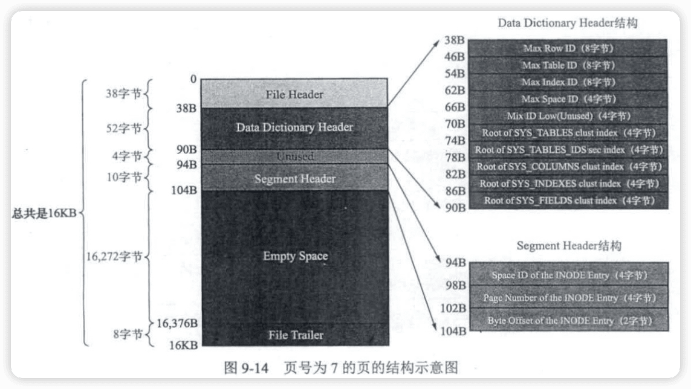

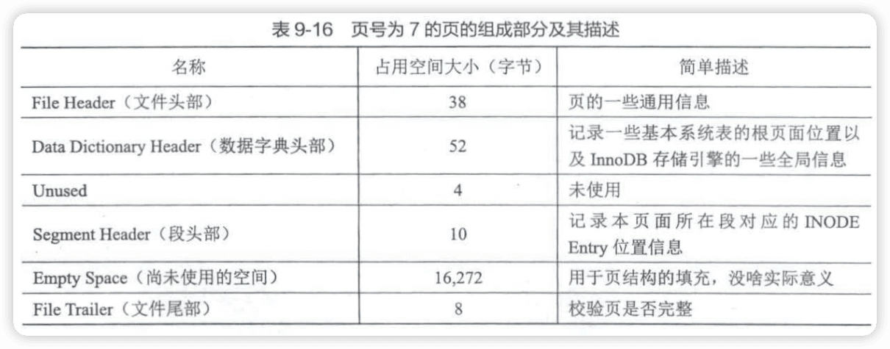

这个页面中竟然有 Segment Header 部分，这意味着设计InnoDB的大叔把这些有关数据字典的信息当成一个段来分配存储空间，就姑且称之为**数据字典段**。由于目前需要记录的数据字典信息非常少（可以看到 Data Dictionary Header 部分仅占用了52字节），所以该段只有一个碎片页，也就是页号为7的这个页。


- **Max Row ID**：如果不显式地为表定义主键，而且表中也没有不允许存储 NULL值的 UNIQUE 键，那么InnoDB 存储引擎会默认生成一个名为`row_id`的列作为主键。因为它是主键，所以每条记录的`row_id`列的值不能重复。原则上只要一个表中的`row_id`列不重复就可以了，也就是说表a和表b拥有一样的`row_id`列也没啥关系。不过设计InnoDB的大叔只提供了这个Max Row ID字段，无论哪个拥有`row_id`列的表插入一条记录，该记录的`row_id`列的值就是Max Row ID对应的值，然后再把 Max Row ID对应的值加 1。也就是说这个**Max Row ID是全局共享的**。

- **Max Table ID**：在InnoDB存储引擎中，所有的表都对应一个唯一的ID，每次新建一个表时，就会把该字段的值加1，然后将其作为该表的ID。
- **Max Index ID**：在InnoDB存储引擎中，所有的索引都对应一个唯一的ID，每次新建一个索引时，就会把该字段的值的值加 1，然后将其作为该索引的ID。
- **Max Space ID**：在InnoDB存储引擎中，所有的表空间都对应一个唯一的ID，每次新建一个表空间时，就会把本字段的值的值加 1，然后将其作为该表空间的ID。
- Mix ID Low(Unused)：这个字段没啥用，直接跳过。
- **Root of SYS_TABLES clust index**： 表示SYS_TABLES表聚簇索引的根页面的页号。
- **Root of SYS_TABLE_IDS sec index**：表示SYS_TABLES表为ID列建立的二级索引的根页面的页号。
- **Root of SYS_COLUMNS clust index**：表示SYS_COLUMNS表聚簇索引的根页面的页号。
- **Root of SYS_INDEXES clust index**：表示SYS_INDEXES表聚簇索引的根页面的页号。
- **Root of SYS_FIELDS clust index**：表示SYS_FIELDS表聚簇索引的根页面的页号


###### 6.information_schema 系统数据库

需要注意的一点是，**用户不能直接访问 InnoDB 的这些内部系统表**，除非直接去解析系统表空间对应的文件系统上的文件。不过设计者考虑到，查看这些表的内容可能有助于大家分析问题，所以在系统数据库`information_schema` 中提供了一些以 INNODB_SYS 开头的表：🔖

```mysql
use information_schema;
show tables like 'INNODB_SYS%';
```


在`information_schema`数据库中，这些以 INODB_SYS 开头的表并不是真正的内部系统表，而是在在储引擎启动时读取这些以SYS开头的系统表，然后填充到这些以INODB_SYS 开头的表中。以INODB_SYS 开头的表和以 SYS 开头的表中的字段并不完全一样，但供大家参考已经足矣。

### 9.4 总结

InnoDB设计者出于不同的目的而设计了不同类型的页面。这些不同类型的页面基本都有**File Header**和**File Trailer**的**通用结构**。

表空间被划分为许多连续的区，对于天小为16KB 的页面来说，每个区默认由 64个页(也就是1MB）组成，每256个区（也就是 256MB）划分为一组，每个组最开始的几个页面的类型是固定的。

段是一个逻辑上的概念，是某些零散的页面以及一些完整的区的集合。

每个区都对应一个==XDES Entry==结构，这个结构中存储了一些与这个区有关的属性。这些区可以被分为下面几种类型。

- 空闲的区：这些区会被加入到 FREE 链表。
- 有剩余空闲页面的碎片区：这些区会被加入到 FREE_FRAG 链表。
- 没有剩余空闲页面的碎片区：这些区会被加入到 FULL_FRAG 链表。
- 附属于某个段的区：每个段所属的区又会被组织成下面几种链表。
  - FREE 链表：在同一个段中，所有页面都是空闲页面的区对应的 XDES Entry 结构会被加入到这个链表。
  - NOT_FULL链表：在同一个段中，仍有空闲页面的区对应的 XDES Entry 结构会被加入到这个链表。
  - FULL链表：在同一个段中，已经没有空闲页面的区对应的 XDES Entry 结构会被加入到这个链表。

每个段都会对应一个==INODE Entry==结构，该结构中存储了一些与这个段有关的属性。

表空间中第一个页面的类型为 ==FSP_HDR==，它存储了表空间的一些整体属性以及第一个组内256个区对应的 XDES Entry 结构。

除了表空间的第一个组以外，其余组的第一个页面的类型为 ==XDES==， 这种页面的结构和FSP_HDR 类型的页面对比，除了少了 File Space Header 部分之外（也就是除了少了记录表空间整体属性的部分之外），其余部分是一样的。

每个组的第二个页面的类型为 ==IBUF_BITMAP==，存储了一些关于 Change Buffer 的信息。

表空间中第一个分组的第三个页面的类型是 ==INODE==，它是为了存储INODE Entry 结构而设计的，这种类型的页面会组织成下面两个链表。

- SEG_INODES_FULL 链表：在该链表中，NODE 类型的页面中己经没有空闲空间来存储额外的 INODE Entry 结构。
- SEG_IODES_FREE 链表：在该链表中，NODE 类型的页面中还有空闲空间来存储额外的 INODE Entry 结构。

Segment Header结构占用10字节，是为了定位到具体的 INODE Entry 结构而设计的。

与独立表空间相比，系统表空间有一个非常明显的不同之处，就是在表空间开头有许多记录整个系统属性的页面。

InnoDB提供了一系列系统表来描述元数据，其中 SYS_TABLES、SYS_COLUMNS、SYS_IDEXES、SYS_FIELDS这4个表尤其重要，称为==基本系统表 (basic system table)==。系统表空间的第7个页面记录了数据字典的头部信息。


## 10 条条大路通罗马——单表访问方法

MySQL Server对一条查询语句进行语法解析之后，就会将其交给==优化器==，优化的结果就是生成**==执行计划==**。

这个执行计划表明了<u>应该使用哪些索引进行查询、表之间的连接顺序是啥样</u>等等。最后会按照执行计划中的步骤**调用存储引擎提供的接口来真正地执行查询**，并将查询结果返给客户端。

```mysql
Create Table single_table (
	id Int Not Null Auto_Increment,
  key1 Varchar(100),
  key2 Int,
  key3 Varchar(100),
  key_part1 Varchar(100),
  key_part2 Varchar(100),
  key_part3 Varchar(100),
  common_field Varchar(100),
  Primary Key (id),
  Key idx_key1(key1),
  Unique Key uk_key2 (key2),
  Key idx_key3 (key3),
  Key idx_key_part (key_part1, key_part2, key_part3)
) Engine=InnoDB Charset=utf8;
```

### 10.1 访问方法的概念

平时写的查询语句本质上只是一种**==声明式的语法==**。

设计者把MySQL执行查询语句的方式称为**==访问方法==（Access method）**或者访问类型。

同一个查询语句可以使用多种不同的访问方法来执行。

### 10.2 const

```mysql
Select * From single_table Where id = 1438;
```

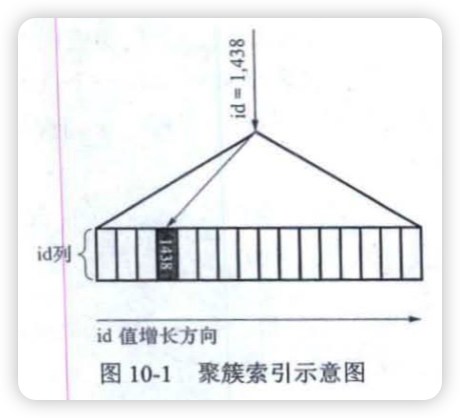

```mysql
Select * From single_table Where key2 = 3841;
```

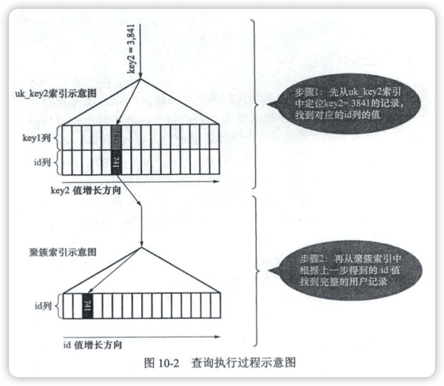

通过**主键或唯一二级索引列**与常数的**等值比较**来定位==一条==记录非常快，MySQL设计者把这种访问方法定义为==const==（常数级别）。

```mysql
Select * From single_table Where key2 Is Null;
```

因为唯一二级索引列并不限制Null值的数量，所以上面的额语句可能访问到多条记录，也就是这条语句不可以使用const访问方法来执行。

### 10.3 ref

```mysql
Select * From single_table Where key1 = 'abc';
```

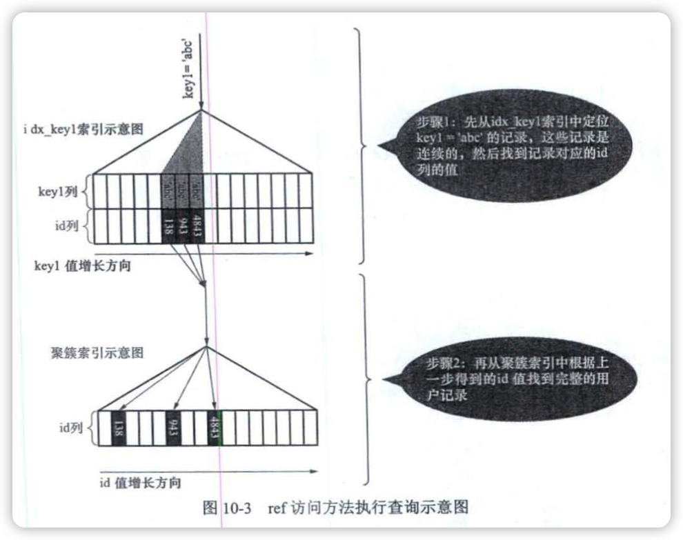

这种“搜索条件为二级索引列与常数进行等值比较，形成的扫描区间为单点扫描区间，采用二级索引来执行查询”的访问方法称为==ref==。

> 采用二级索引来执行查询时，其实每获取到一条二级索引记录，就会==立刻对其执行回表操作==，而不是将所有二级索引记录的主键值都收集起来后再统一执行回表採作。上图只是为了直观查看。

注意点：

- 在二级索引列允许存储 NULL 值时，无论是普通的二级素引，还是唯一二级索引，它们的索引列并不限制 NULL 值的数量，所以在执行包含 “Key Is NULL”形式的搜索条件的查询时，最多只能使用ref访问方法，而不能使用 const 访问方法。
- 对于索引列中包含多个列的二级索引来说，只要最左边连续的列是与常数进行**等值比较**，就可以采用ref访问方法。比如下面这几个查询都可以采用ref访问方法执行：

```mysql
SELECT * FROM single_table WHERE key_part1 = 'god like';

SELECT * FROM single_table WHERE key_part1 = 'god like' AND key_part2 = 'legendary';

SELECT * FROM single_table WHERE key_part1 = 'god like' AND key_part2 = "legendary" AND key_part3 = 'penta kill';
```

如果索引列中最左边连续的列不全部是等值比较的话，它的访问方法就不能称为ref了。比如下面这条语句(其实该语句利用 idx_key_part索引的访问方法就是后文要介绍的range):

```mysql
SELECT * FROM single_table WHERE key_part1 = 'god like' AND key_part2 > 'legendary'
```

### 10.4 ref_or_null

```mysql
Select * From single_table Where key1 = 'abc' Or key1 Is NULL;
```

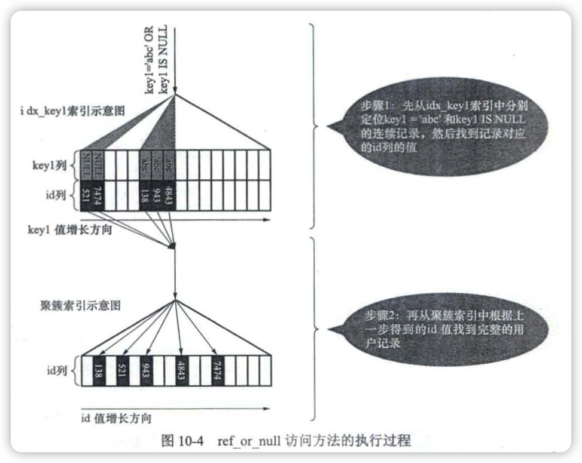

ref_or_null访问法只是比ref**多扫描一些值为NULL的二级索引记录**。

### 10.5 range

```mysql
Select * From single_table Where key2 In (1438, 6328) Or (key2 >= 38 And key2 <= 79);
```

对应的扫描区间是[1438, 1438]、[6328, 6328]、[38, 79]。

把“使用索引执行查询时，对应的扫描区间为**若干个单点扫描区间或者范围扫描区间**”的访问方法称为==range==。

### 10.6 index

```mysql
SELECT key_part1, key_part2, key_part3 FROM single_table WHERE key_part2 = 'abc' ;
```

由于key_part2 并不是联合索引idx_key_part 的索引列中最左边的列，所以无法形成合适的范围区间来减少需要扫描的记录数量，从而无法使用 ref 或者 range 访问方法来执行这个语句。但是这个查询符合下面这两个条件：

- 它的查询列表只有key_part1、key_part2 和key_part3 这了个列，而索引idx_key_part又恰好包含这了个列；
- 搜索条件中只有key_part2列，这个列也包含在索引idx_key_part中。

也就是说，可以直接遍历idx_key_part索引的所有二级索引记录，针对获取到的每一条二级索引记录，都判断key_ part2='abe'条件是否成立。如果成立，就从中读取出key_part1、key_part2、key_part3 这了个列的值并将它们发送给客户端。很显然，在这种使用idx_key_part索引执行上述查询的情况下，对应的扫描区间就是(-∞,+∞)。

由于二级索引记录比聚簇索记录小得多（聚族索引记录要存储用户定义的所有列以及隐藏列，而二级索引记录只需要存放索引列和主键），而且这个过程也不用执行回表操作，所以<u>直接扫描全部的二级索引记录比直接扫描全部的聚簇索引记录的成本要小很多</u>。MySQL设计者就把这种**扫描全部二级索引记录的访问方法**称为==index==访问方法。

另外，当通过全表扫描对使用IonoDB存储引擎的表执行查询时，如果添加了“ORDER BY主键”的语句，那么该语句在执行时也会被人为地认定为使用的是 index 访问方法，如下面这个查询：

```mysql
SELECT * FROM single_table ORDER BY id;
```

### 10.7 all

最直接的查询执行方式就是全表扫描，对于InnoDB表来说也就是直接扫描全部的聚簇索引记录。把这种使用==全表扫描==执行查询的访问方法称为==all==访问方法。

### 10.8 注意事项

#### 重温二级索引+回表

在使用索引引来减少需要扫描的记录数量时，==一般情况下只会为单个索引生成扫描区间==。比如下面这个查询：

```mysql
SELECT * FROM single_table WHERE key1 = 'abc' AND key2 > 1000;
```

查询优化器会识别到这个查询中的两个搜索条件：

- key1 = 'abc';
- key2 > 1000。

如果使用idx_key1执行查询，对应的扫描区间就是['abc','abc]；如果使用uk_key2执行查询，对应的扫描区间就是（100,+∞)。

优化器会通过访问表中的少量数据或者直接根据<u>事先生成的统计数据</u>，来计算 ['abc','abc']扫描区间包含多少条记录，再计算(100,+∞）扫描区间包含多少条记录，之后再通过一定**算法**来计算使用这两个扫描区间执行查询时的成本分别是多少，==最后选择成本更小的那个扫描区间对应的索引执行查询==（有关选择使用哪个索引执行查询的具体步骤，查看第12章）。

**一般来说，等值查找比范围查找需要扫描的记录数更少**（也就是ref访问方法一般比range访问方法好；但这并不总是成立，也有可能在采用ref方法访问时，相应的索引列为特定值的行数特别多)。我们假设优化器决定使用 idx_key1索引来执行查询，那么整个查询的执行过程：

- 步骤1 先通过idx_key1对应的B+树定位到扫描区间['abc','abc']中的第一条二级索引记录。

- 步骤2．根据从步骤1中得到的二级索引记录的主键值执行回表操作，得到完整的用户记录，再检测该记录是否满足 key2>1000 条件。如果满足则将其发送给客户端，否则将其忽略。
- 步骤3。再根据该记录所在的单向链表找到下一条二级索引记录，重复步骤2中的操作，直到某条二级索引记录不满足 key1='abe'条件为止。

> MRR（多范围读取，Disk-Sweep Multi-Range Read） 🔖

#### 索引合并🔖

特殊情况下，MySQL也可能为多个索引引生成扫描区间。

把这种**使用多个索引来完成一次查询**的执行方法称为 ==index merge（索引合并)==。有3种。

##### 1️⃣ Intersection 索引合并

```mysql
SELECT * FROM single_table WHERE key1 = 'a' AND key3 ='b';
```


##### 2️⃣ Union索引合并

```mysql
SELECT * FROM single_table WHERE key1 = 'a' OR key3 ='b';
```


##### 3️⃣ Sort-Union索引合并

```mysql
SELECT * FROM single_table WHERE key1 < 'a' OR key3 >'z';
```


### 10.9 小结

查询语句在本质上是**一种==声明式==的语法，具体执行方式有很多种**。MySQL的设计者根据不同的场景划分了很多种访问方法，比如:

- const;
- ref;
- ref_or_null ;
- range;
- index;
- all;
- index_merge.

有的查询可以使用索引合并的方式利用多个索引完成查询，具体方法有下面3种:

- Intersection索引合并；
- Union索引合并;
- Sort-Union索引合并。

访问方法选择优先级：


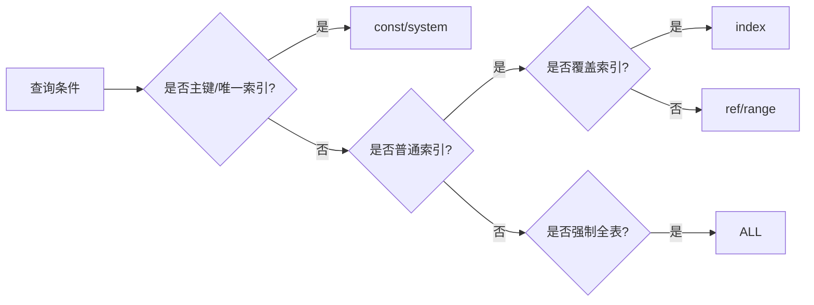
```mermaid
graph LR
A[查询条件] --> B{是否主键/唯一索引?}
B -->|是| C[const/system]
B -->|否| D{是否普通索引?}
D -->|是| E{是否覆盖索引?}
E -->|是| F[index]
E -->|否| G[ref/range]
D -->|否| H{是否强制全表?}
H -->|是| I[ALL]
```


## 11 两个表的亲密接触——连接的原理

关系型数据库一个至关重要的概念就是==Join（连接）==。

### 11.1 连接简介

#### 连接的本质

```mysql
Create Table t1 (m1 int, n1 char(1));
Create Table t2 (m2 int, n2 char(1));

Insert Into t1 Values(1, 'a'), (2, 'b'), (3, 'c');
Insert Into t2 Values (2, 'b'), (3, 'c'), (4, 'd');
```


本质上来说，**连接**就是把各个表中的记录都取出来进行一次匹配，并把匹配后的组合发给客户端。


这个过程看起来就是把t1表中的记录和t2表中的记录连起来组成一个新的更大的记录，所以这个查询过程称为**==连接查询==**。如果连接查询的结果集中包含一个表中的每一条记录与另一个表中的每一条记录相互匹配的组合，那么这样的结果集就可以称为**==笛卡儿积==**。

```mysql
mysql> select * from t1,t2;
+------+------+------+------+
| m1   | n1   | m2   | n2   |
+------+------+------+------+
|    3 | c    |    2 | b    |
|    2 | b    |    2 | b    |
|    1 | a    |    2 | b    |
|    3 | c    |    3 | c    |
|    2 | b    |    3 | c    |
|    1 | a    |    3 | c    |
|    3 | c    |    4 | d    |
|    2 | b    |    4 | d    |
|    1 | a    |    4 | d    |
+------+------+------+------+
9 rows in set (0.00 sec)
```

MySQL中连接查询的语法很随意，只要在FROM语句后边跟多个表名就好了。

#### 连接过程简介

原则上可以连接**任意数量的表**。没有限制条件的笛卡尔积非常巨大。

连接查询中的**过滤条件**分两种：

- 涉及单表的条件
- 涉及两表的条件。比如`t1.m1=t2.m2`、`t1.n1>t2.n2`等

```mysql
Select * From t1, t2 Where t1.m1 > 1 And t1.m1 = t2.m2 And t2.n2 < 'd';
```

3个过滤条件：

- t1.m1 > 1
- t1.m1 = t2.m2 
- t2.n2 < 'd'

这个连接查询的执行过程：

- 步骤1：首先确定第一个需要查询的表，称为**==驱动表==**。

  上一章说明了怎样在单表中执行单表查询，只要选取代价最小的访问方法区执行查询单表查询语句就好了。

  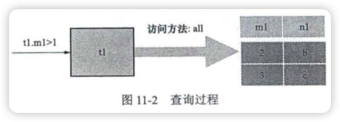

- 步骤2：步骤1中从驱动表每获取到一条记录，都需要到t2表中查询匹配的记录。这里t2也被称为**==被驱动表==**。

  步骤1从驱动表中得到了2条记录，也就意味着需要查询2次t2表。此时涉及两个表的列的过滤条件t1.m1=t2.m2就派上用场了。

  对于从t1表中查询得到的第一条记录，也就是当t1.m1=2时，过滤条件t1.m1=2.m2 就相当于t2.m2=2。所以此时t2表相当于有了t2.m2=2、t2.n2<'d'这两个过滤条件，然后到t2表中执行单表查询。

  对于从t1表中查询得到的第二条记录，也就是当t1.m1=3时，过滤条件t1.m1=t2.m2就相当于t2.m2=3。所以此时 t2表相当于有了22.m2=3、t2.n2<'d'这两个过滤条件，然后到t2表中执行单表查询。

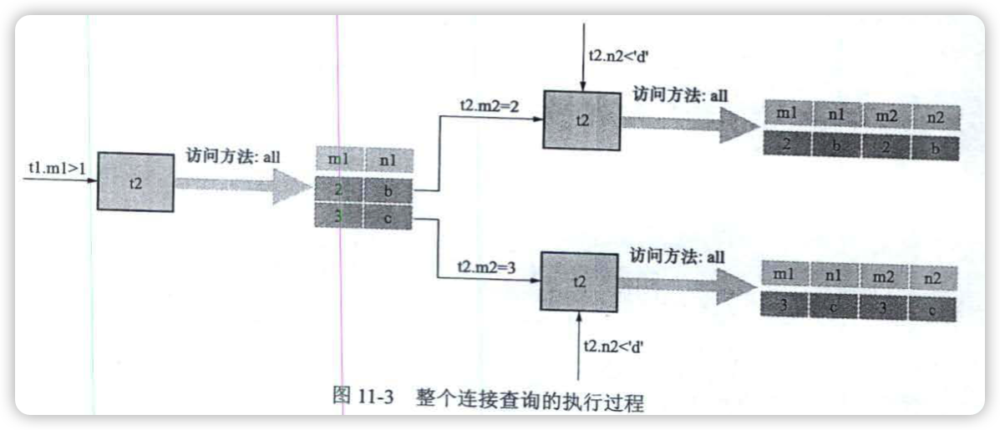

在两表的连接查询中，**==驱动表只需访问一次，被驱动表可能需要访问多次==**。

> 注：并不是将所有满足条件的驱动表记录查询出来放到一个地方，然后再去被驱动表查询的，而是**每获得一条驱动表记录，就立即到被驱动表中寻找匹配的记录**。

#### 内连接和外连接

```mysql
Create Table student (
	number Int Not Null Auto_Increment Comment '学号',
  name Varchar(5) Comment '姓名',
  major Varchar(30) Comment '专业',
  Primary Key (number)
) Engine=InnoDB Charset=utf8 Comment '学生信息表';

Create Table score (
	number Int Comment '学号',
  subject Varchar(30) Comment '科目',
  score Tinyint Comment '成绩',
  Primary Key (number, subject)
) Engine=InnoDB Charset=utf8 Comment '学生成绩表';

Insert Into student Values(20180101, '张三', '软件学院'), (20180102, '李四', '计算机科学与工程'),(20180103, '王五', '计算机科学与工程');

Insert Into score Values(20180101, 'MySQL是怎么运行的', 78), (20180101, '深入浅出MySQL', 88), (20180102, '深入浅出MySQL', 98),(20180102, 'MySQL是怎么运行的', 100);
```

```mysql
Select * From student, score Where student.number = score.number;
```

```mysql
mysql> Select s1.number, s1.name, s2.subject, s2.score From student s1, score s2 Where s1.number = s2.number;
+----------+--------+-------------------------+-------+
| number   | name   | subject                 | score |
+----------+--------+-------------------------+-------+
| 20180101 | 张三   | MySQL是怎么运行的       |    78 |
| 20180101 | 张三   | 深入浅出MySQL           |    88 |
| 20180102 | 李四   | MySQL是怎么运行的       |   100 |
| 20180102 | 李四   | 深入浅出MySQL           |    98 |
+----------+--------+-------------------------+-------+
```

若驱动表中的记录在被驱动表中找不到匹配的记录，则该记录不会加入到最后的结果集中，这是就是**==内连接==**；会加入的就是**==外连接==**。

MySQL中外连接细分，选取左侧表为驱动表叫**==左外连接==**，选取右侧表为驱动表叫**==右外连接==**。

> 问题：有时候匹配失败要加入结果集，有时候又不要加入结果集。
>
> 解决：把过滤条件分为两种。

- Where子句的过滤条件

  内连接和外连接，凡是不符合Where子句中过滤条件的记录都不会被加入到最后的结果集。

- On子句中的过滤条件

  对于外连接的驱动表中的记录来说，如果无法在被驱动表中找到匹配ON子句中过滤条件的记录，那么该驱动表记录仍然会被加入到结果集中，对应的被驱动表记录的各个字段使用NULL值填充。

  注意：ON子句是**专门为“外连接驱动表中的记录在被驱动表找不到匹配记录时是否应该把该驱动表记录加入结果集中”** 这个场景提出的。所以，**内连接中的WHERE子句和ON子句是等价的**。

##### 1.左（外）连接的语法

```mysql
Select * From t1 Left [Outer] Join t2 On 连接条件 [Where 普通过滤条件];
```

对于左（外）链接和右（外）链接来说，必须使用ON子句来指出连接条件。

##### 2.右（外）连接的语法

```mysql
Select * From t1 Right [Outer] Join t2 On 连接条件 [Where 普通过滤条件];
```

##### 3.内连接的语法

```mysql
Select * From t1 [Inner | Cross] Join t2 [On 连接条件] [Where 普通过滤条件];
```

简写：

```mysql
Select * From t1, t2;
```

### 11.2 连接的原理

<u>MySQL采用了什么样的算法来进行表与表之间的连接？</u>

#### 嵌套循环连接

**对于内连接来说，选取哪个表为驱动表都没关系；而外连接的驱动表是固定的。**

t1表和t2表执行内连接查询的大致过程：

- 步骤1 选取驱动表，使用与驱动表相关的过滤条件，选取代价最低的单表访问方法来执行对驱动表的单表查询。

- 步骤2 对步骤1中查询驱动表得到的结果集中的每一条记录，都分别到被驱动表中查找匹配的记录。


> 注：上图中结果集只是一个抽象概念，实际是从驱动表中获得一条记录，就**立即**到被驱动表中查询一次。

如果有3个表进行连接，那么步骤2中得到的结果集就像是新的驱动表，然后第了个表就成为了被驱动表，然后重复上面的过程。也就是针对步骤2中得到的结果集中的每一条记录，都需要到33 表中找一找有没有匹配的记录。

这个过程就像是一个嵌套的循环，所以这种“**驱动表只访问一次，但被驱动表却可能访问多次，且访问次数取决于对驱动表执行单表查询后的结果集中有多少条记录**”的连接执行方式称为**==嵌套循环连接（Nested-Loop Join)==**，这是==最简单也是最笨拙==的一种连接查询算法。

#### 使用索引加快连接速度

查询t2表相当于一次单表查询，也可以利用索引来加快查询速度。

```sql
Select * From t1, t2 Where t1.m1 > 1 And t1.m1 = t2.m2 And t2.n2 < 'd';
```

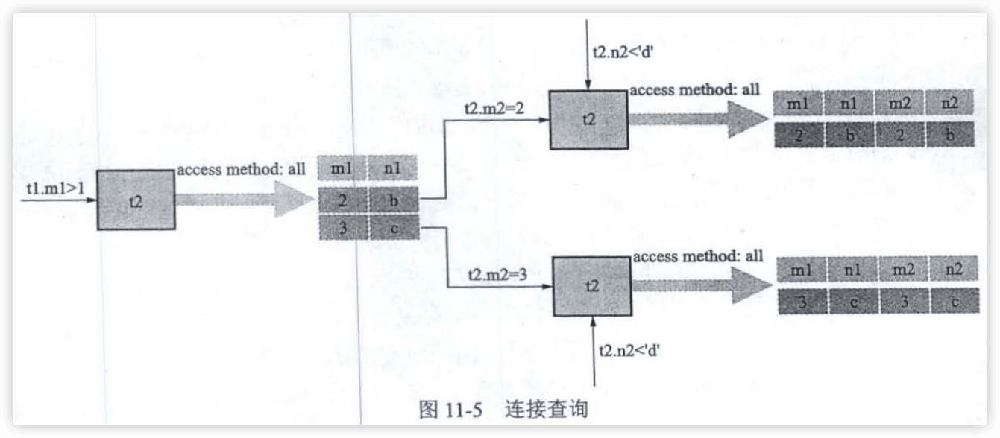

上述两个对t2表的查询语句中利用到的是m2和n2列，可以进行如下尝试：

- 在m2列上建立索引。因为针对m2列的条件是等值查找，比如t2.m2=2、t2.m2=3等，所以可能使用到ref访问方法。假设使用 ref 访问方法来执行对t2表的查询，需要在回表之后再判断t2.n2<d这个条件是否成立。

  这里有一个比较特殊的情况，即假设m2列是t2表的主键，或者是不允许存储NULL值的唯一二级索引列，那么使用“t2.m2=常数值”这样的条件从t2表中查找记录时，代价就是常数级别的。

  在单表中使用主键值或者唯一二级索引列的值进行等值查找的方式称为`const`，而在连接查询中对被驱动表的主键或者不允许存储 NULL 值的唯一二级索引进行等值查找使用的访问方法就称为`eq_ref`。

- 在n2列上建立索引，涉及的条件是t2.n2<'d'，可能用到`range` 访问方法。假设使用range 访问方法对t2表进行查询，需要在回表之后再判断包含m2列的条件是否成立。

假设m2和n2列上都存在索引，那么就需要从这两个里面挑一个代价更低的索引来查询t2表。

另外，连接查询的查询列表和过滤条件中有时可能只涉及被驱动表的部分列，而这些列都是某个二级索引的一部分，在这种情况下即使不能使用eq_ref、ref、ref_ or_null 或者 range 等访问方法来查询被驱动表，也可以通过扫描全部二级索引记录（即使用index 访问方法）来查询被驱动表。所以**建议最好不要使用`*`作查询列表，而是把真正用到的列作为查询列表。**

#### 基于块的嵌套循环连接

假设不能使用索引加快被驱动表的查询过程，所以对于驱动表结果集中的每一条记录，都需要对被驱动表执行全表扫描。这样在对被驱动表进行全表扫描时，**可能表前面的记录还在内存中，而表后面的记录还在磁盘上**。

需要想办法，**尽量减少被驱动表的访问次数**。

> 是否可以在把被驱动表中的记录加载到内存时，一次性地与驱动表中的多条记录进行匹配呢？

==Join Buffer（连接缓存区）==

Join Buffer 就是在执行连接查询前申请的一块固定大小的内存。先把若干条驱动表结果集中的记录装在这个Join Buffer中，然后开始扫描被驱动表，每一条被驱动表的记录一次性地与Join Buffer中的多条驱动表记录进行匹配。由于匹配的过程都是在内存中完成的，所以这样可以显著减少被驱动表的 I/O 代价。

把这种加入了Join Buffer的嵌套循环连接算法称为==基于块的嵌套循环连接 (Block Nested-Loop Join）算法==。

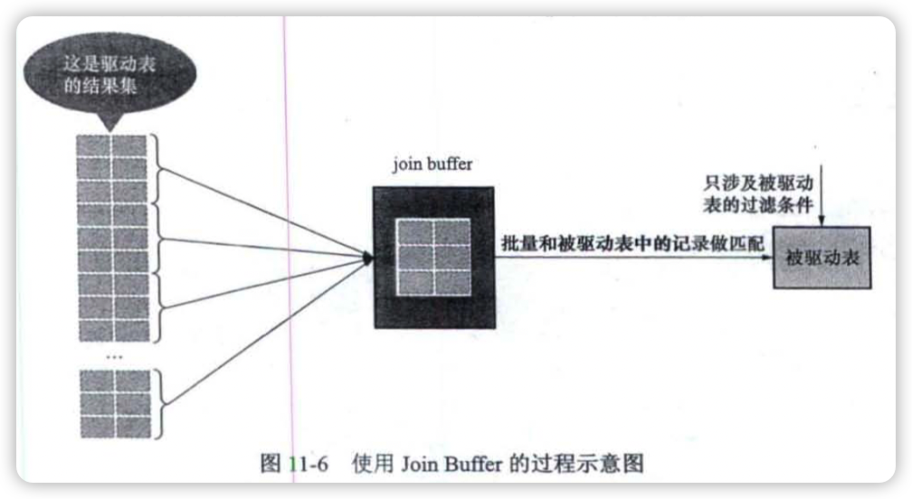

这个 Join Buffer 的大小可以通过启动选项或者系统变量`join_buffer_size`进行配置，默认大小为262,144字节（也就是`256KB`），最小可以设置为 128字节。当然，在我们优化对被驱动表的查询时，最好是为被驱动表加上高效率的索引。如果实在不能使用索引，并且自己机器的内存也比较大，则可以尝试调大`join_buffer_size`的值来对连接查询进行优化。

另外需要注意的是，Join Buffer 中并不会存放驱动表记录的所有列，只有查询列表中的列和过滤条件中的列才会被放到Join Buffer 中，**所以这也再次提醒我们，最好不要把*作为查询列表，只需要把关心的列放到查询列表就好了**；这样还可以在 Join Buffer中放置更多的记录。

### 11.3 小结

从本质上来说，连接就是把各个表中的记录都取出来依次进行匹配，并把匹配后的组合发送给客户端。如果不加任何过滤条件，产生的结果集就是笛卡儿积。

在MySQL中，连接分为内连接和外连接，其中外连接又可以被细分为左(外)连接和右(外)连接。内连接和外连接的根本区别就是，**在==驱动表==中的记录不符合ON子句中的连接条件时，内连接不会把该记录加入到最后的结果集中，而外连接会。**

嵌套循环连接算法是指驱动表只访问一次，但被驱动表却可能会访问多次，访问次数取决于对驱动表执行单表查询后的结果集中有多少条记录。大致过程如下。

- 步骤 1.选取驱动表，使用与驱动表相关的过滤条件，选取代价最低的单表访问方法来执行对驱动表的单表查询。
- 步骤 2.对步骤1中查询驱动表得到的结果集中的每一条记录，都分别到被驱动表中查找匹配的记录。

由于被驱动表可能会访问多次，因此可以为被驱动表建立合适的索引以加快查询速度。

如果被驱动表非常大，多次访问被驱动表可能导致很多次的磁盘I/O，此时可以使用基于块的嵌套循环连接算法来缓解由此造成的性能损耗。


## 12 谁最便宜就选谁——基于成本的优化

### 12.1 什么是成本

MySQL在执行一个查询时可以有不同的执行方案，它会选择其中成本最低或者说代价最低的方案区真正地执行查询。

- I/O成本：从磁盘到内存的加载过程损耗的时间。
- CPU成本：读取记录以及检测记录是否满足对应的搜索条件、对结构集进行排序等操作损耗的时间。

对InnoDB存储引擎来说，页是磁盘和内存之间进行交互的基本单位。

规定了一些**==成本常数==**：

- 读取一个页面花费的成本为 `1.0`
- 读取以及检测一条记录是否符合搜索条件的成本为`0.2`

### 12.2 单表查询的成本

```mysql
CREATE TABLE single_table (
	id INT NOT NULL AUTO_INCREMENT,
  key1 VARCHAR(100),
  key2 INT,
	key3 VARCHAR(100),
  key_part1 VARCHAR(100),
	key_part2 VARCHAR(100),
  key_part3 VARCHAR(100),
  common_field VARCHAR(100),
	PRIMARY KEY (id),
	KEY idx_key1 (key1),
	UNIQUE KEY uk_key2 (key2),
	KEY idx_key (key3) ,
	KEY idx_key_part (key_part1, key_part2, key_part3)
) Engine=InnoDB CHARSET=utf8;
```

假设表中有10000条记录，除了id列其余列都插入随机值。

#### 基于成本的优化步骤

```mysql
Select * From single_table Where
	key1 IN ('a', 'b', 'c') And
	key2 > 10 And key2 < 100 And
	key3 > key2 And
	key_part1 Like '%hello%' And
	common_field = '123';
```

在真正执行一条单表查询语句之前，MySQL的优化器会找出**所有可以用来执行该语句的方案**，并在对比这些方案之后找出成本最低的方案。这个成本最低的方案就是所谓的==执行计划==。过程：

##### 1.根据搜索条件，找出所有可能使用的索引

前文说过，对于B+树索引来说，只要索引列和常数使用`=`、`<=>`、`IN`、`NOT IN`、`IS NULL`、`IS NOT NULL`、`＞`、`＜`、`>=`、`<=`、`BETWEEN`、`!=`（不等于也可以写成`<>`）或者`LIKE`操作符连接起来，就会产生一个**扫描区间**（用LIKE匹配字符串<u>前缀时</u>，也会产生一个扫描区间）。也就是说，这些搜索条件都可能使用到索引，MySQL设计者把一个查询中可能使用到的索引称之为**==possible keys==**。

分析上面的查询语句中涉及的几个搜索条件：

- `key1 IN ('a','b','c')`：这个搜索条件可以使用二级索引idx_key1。
- `key2>10 AND key2<1000`：这个搜索条件可以使用二级索引uk_key2。
- `key3>key2`：这个搜索条件的索引列由于没有与常数进行比较，因此不能产生合适的扫描区间。
- `key_part1 Like '%hello%'`：key_part1通过`LIKE`操作符与以通配符开头的字符串进行比较，不能产生合适的扫描区间。【`%`是通配符，代表任意长度的任意字符序列， `%`在开头，MySQL无法利用索引的有序性来确定一个明确的扫描区间。】

- `common_field = '123'`：由于压根儿没有在该列上建立素引，所以不会用到索引。

综上所述，上面的查询语句可能使用到的索引（也就是possible keys）有idx_key1和uk_key2。

##### 2.计算全表扫描的代价

对InnoDB存储引擎来说，全表扫描的意思就是**把聚簇索引中的记录都依次与给定的搜索条件进行比较，并把符合搜索条件的记录加入到结果集中**。所以需要将聚簇索引对应的页面加载到内存中，然后再检测记录是否符合搜索条件。

由于**查询成本 = I/O成本 + CPU成本**，所以在计算全表扫描的代价时需要两个信息：

- 聚簇索引占用的页面数；
- 该表中的记录数。

这两个信息从哪里来呢？设计者**为每个表维护了一系列的统计信息**。使用`SHOW TABLE STATUS`语句来查看表的统计信息。如果要看某个指定表的统计信息，在该语句后添加对应的LIKE语句就好了。

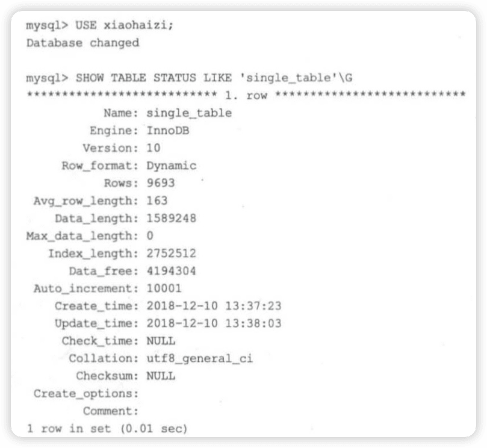

目前最关系的两项：

- **Rows**：表示表中的记录条数。对于使用MyISAM存储引擎的表来说，该值是准确的；对于使用InnoDB存储引擎的表来说，该值是一个**估计值**。从查询结果中也可以看出，由于 single_table 表使用的是IonoDB 存储引擎，尽管表实际有 10,000 条记录，但是 Rows值是9,693。

- **Data length**：表示表**占用的存储空间字节数**。对于使用MyISAM存储引擎的表来说，该值就是**数据文件的大小**；对于使用InnoDB存储引擎的表来说，该值就相当于**聚簇索引占用的存储空间大小**（**==Data length = 聚族索引的页面数量 * 每个页面的大小==**）。【`Index_length`是包含了二级索引】

反向推导出聚簇索引的页面数量： `聚簇索引的页面数量 = 1,589,248 / 16 / 1024 = 97`

现在己经得到了聚簇索引占用的页面数量以及该表记录数的估计值，接下来就可以计算全表扫描成本了。

但是，设计者在真正计算成本时会进行一些直接硬编码到代码中==微调==，由于这些微调的值十分小，并不影响我们分析，所以也就没有必要在这些徽调值上纠结了。全表扫描成本的计算过程：

- I/O成本：97 × 1.0 + 1.1（微调值） = 98.1

- CPU成本：9693 × 0.2 + 1.0（微调值）= 1939.6
- 总成本：98.1+1939.6= 2037.7

> 聚簇索引中只要通过根节点获得最左边的叶子节点，就可以沿着叶子节点组成的双向链表把所有记录都查看一遍，也就是说在全表扫描的过程中，其实**有的B+树内节点是不需要访问的**，但MySQL设计者在计算全表扫描成本是，直接使用聚簇索引整个占用的页面数作为计算I/O成本的依据，并没有区分内节点和叶子节点。

##### 3.计算使用不同索引执行查询的代价

需要分析**单独使用这些索引执行查询的成本**，最后还要分析**是否可能使用到索引合并**。

MySQL查询优化器**先分析使用唯一二级索引的成本，再分析使用普通索引的成本**。

###### a.使用uk_key2执行查询的成本分析

以key2对应的搜索条件是`key2>10 AND key2<1000`，也就是说对应的扫描区间就是(10, 1000)。

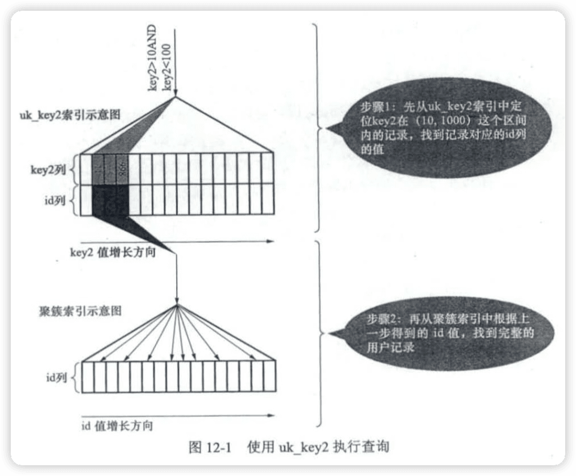

对于使用二级索引＋回表方式执行的查询，MySQL设计者在计算这种查询的成本时，依赖于两方面的数据：**扫描区间数量和需要回表的记录数**。

- 扫描区间数量

无论某个扫描区间的二级索引到底占用了多少页面，查询优化器<u>粗暴地认为读取索引的一个扫描区间的I/O成本与读取一个页面的I/O成本是相同的</u>。本例中使用uk_key2的扫描区间只有一个：(10,1000)，所以相当于访问这个扫描区间的二级索引所付出的I/O成本就是 1 × 1.0=1.0。

- 需要回表的记录数

查询优化器需要计算二级索引的某个扫描区间到底包含多少条记录，对于本例来说就是要计算uk_key2在(10,1000)扫描区间中包含多少二级索引记录。计算过程是这样的：

步骤1. 先根据 key2>10条件访问uk_key2对应的B+树索引，找到满足 kev2>10 条件的第一条记录（我们把这条记录称为区间**最左记录**）。前文说过，在B+树中定位一条记录的过程是贼快的，是常数级别的，所以这个过程的性能消耗可以忽略不计。

步骤2. 然后再根据key2<1000 条件继续从uk_key2对应的B+树索引中找出最后一条满足这个条件的记录（我们把这条记录称为区间**最右记录**)。这个过程的性能消耗也可以忽略不计。

步骤3. 如果区间最左记录和区间最右记录相隔不太远（在MySQL5.7.22版本中，只要相隔不大于10个页面即可），就可以精确统计出满足 key2>10 AND key2<1000 条件的二级索引记录的条数。

> 数据页中的Page Header中有一个名为`PAGE_N_RECS`的属性，该属性代表了该页面中日前有多少条记录，所以，如果区间最左记录和区问最右记录所在的页面相隔不太远，可以直接遍历这些页面，把这些页面中的`PAGE_N_RECS`属性值加起来就好了。

否则只沿着区间最左记录向右读10个页面，计算每个页面平均包含多少记录，然后用这个平均值乘以区间最左记录和区间最右记录之间的页面数量就可以了。

那么问题又来了：<u>怎么估计区间最左记录和区间最右记录之间有多少个页面呢？</u>

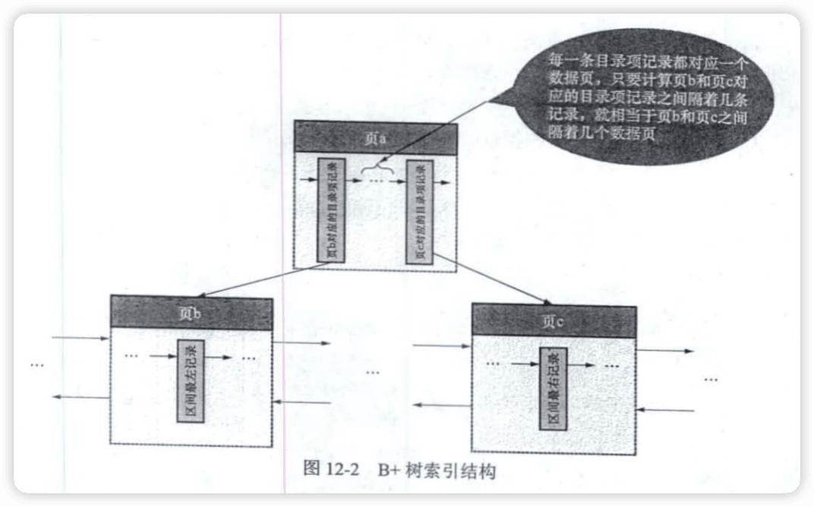

在图 12-2中，假设区间最左记录在页b中，区间最右记录在页c中，那么要计算区间最左记录和区间最右记录之间的页面数量，就相当于计算页b和页c之间有多少页面。而每一条目录项记录都对应一个数据页，所以计算页b和c页。之间有多少页面就相当于计算它们的**父节点(也就是页a）中对应的目录项记录之间隔着几条记录**。在一个页面中统计两条记录之间有几条记录的成本就相当低了。

不过还有问题：<u>如果页b和页c之间的页面实在太多，以至于页b和页c对应的目录项记录都不在一个页面中该咋办？</u>

继续递归啊，也就是再统计页b和页c对应的目录项记录所在页之间有多少个页面。我们之前说过，一个B+树能有 4 层就己经比较高了，所以这个统计过程也不是很消耗性能。

知道了如何统计二级索引某个扫描区间的记录数之后，就需要回到现实问题中来。根据上述算法测得 uk_key2在区间(10,1000）中大约有95 条记录。读取这 95 条二级索引记录需要付出的 CPU 成本就是 95 x 0.2+0.01=19.01。 其中95是需要读取的二级索引的记录条数，0.2是读取一条记录的成本常数，0.01 是微调值。

在通过二级索引获取到记录之后，还需要干两件事：

- 根据这些记录的主键值到聚簇索引中执行回表操作。

​	MySQL设计者在评估回表操作的I/O成本时依旧很豪放：他们认为==每次回表操作都相当于访问一个页面==，也就是说二级索引扫描区间中有多少记录，就需要进行多少次回表操作，也就是需要进行多少次页面I/O。

​	前面在使用uk_key2 二级索引执行查询时，预计有95 条二级索引记录需要进行回表操作，所以回表操作带来的 IO 成本就是95 x 1.0=95.0。 

- 回表操作后得到完整的用户记录，然后再检测其他搜索条件是否成立。

​	回表操作的本质就是通过二级索引记录的主键值到聚簇索引中找到完整的用户记录，然后再检测除`key2>10 AND key2<1000`这个搜索条件以外的其他搜索条件是否成立。因为我们通过扫描区间获取到的二级索引记录共有95条，这也就对应着聚簇索引中95条完整的用户记录。

​	读取并检测这些完整的用户记录是否符合其余的搜索条件的 CPU 成本为 95x 0.2=19.0。其中95是待检测记录的条数，0.2是检测一条记录是否符合给定搜索条件的成本常数。

所以本例中使用uk_key2执行查询的成本就如下所示。

- IO成本：1.0 + 95× 1.0=96.0（扫描区间的数量＋预估的二级索引记录条数）。
- CPU 成本：95 x 0.2 + 0.01 + 95× 0.2 = 38.01(读取二级索引记录的成本＋读取并检测回表操作后聚簇索引记录的成本）。

综上所述，使用uk_key2执行查询的总成本就是 96.0+ 38.01 =134.01。

###### b.使用idx_key1执行查询的成本分析

idx_key1对应的搜索条件是 `key1 IN('a'，'b'，'c')`，相当于3个单点扫描区间：

- ['a','a']
- ['b','b']
- ['c','c']

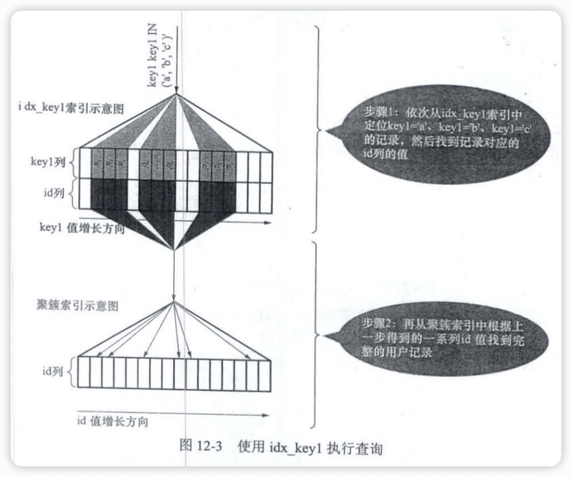

- 扫描区间的数量

​	在使用idx_key1执行查询时，很显然有3个单点扫描区间，所以访问这了个扫描区间的二级索引付出的I/O成本就是3 x 1.0 = 3.0。

- 需要回表的记录数

  由于在使用idx_key1时存在了个单点扫描区间，所以每个单点扫描区间都需要查找一遍对应的二级索引记录数。

  - 查找单点扫描区间['a','a']对应的二级索引记录数：计算单点扫描区间对应的二级索引记录数与计算范围扫描区间对应的二级索引记录数是一样的，都是先找到区间最左记录和区间最右记录，然后再计算它们之间的记录数。最后计算得到的单点扫描区间['a','a']对应的二级索引记录数是35。

  - 查找单点扫描区间['b','b']对应的二级索引记录数：与上同理，计算得到的本单点扫描区间对应的记录数是 44。

  - 查找单点扫描区间['c','c']对应的二级索引记录数：与上同理，计算得到的本单点扫描区间对应的记录数是 39。

所以，这3个单点扫描区间总共需要回表的记录数就是 35+44+39=118。读取这些二级索引记录的CPU成本就是 118×0.2+0.01=23.61。

在得到总共需要回表的记录数之后，还要考虑：

- 根据这些记录中的主键值到聚簇索引中执行回表操作：所需的IO成本就是 118 × 1.0=118.0。
- 针对回表操作后读取到的完整用户记录，比较其他搜索条件是否成立。这一步骤对应的 CPU 成本就是 118x 0.2-23.6。

所以本例中使用idx_key1执行查询的成本如下所示。

- I/O成本：3.0+118 × 1.0=121.0(扫描区间的数量十预估的二级索引记录条数）。
- CPU成本：118 x 0.2+ 0.01+118 × 0.2=47.21(读取二级索引记录的成本十读取并检测回表操作后聚族索引记录的成本）。

综上所述，使用idx_key1执行查询的总成本就是 121.0+ 47.21 =168.21。

###### c.是否有可能使用索引合并 (Index Merge)

本例中有关key1和key2的搜索条件是使用AND操作符连接起来的，而对于 idx_key1 和uk_key2都是范围查询。也就是说，查找到的二级索引记录并不是按照主键值进行排序的，不满足使用 Intersection 合并的条件，所以并不会使用索引合并。

##### 4.对比各种执行方案的代价，找出成本最低的那个方案

- 全表扫描的成本：2037.7。
- 使用uk_key2的成本：134.01。
- 使用idx_key1的成本：168.21。

很显然，使用uk_key2的成本最低。

#### 基于索引统计数据的成本计算

使用IN语句就很容易产生非常多的单点扫描区间。

```mysql
SELECT * FROM single_table WHERE key1 IN ('aa1', 'aa2', 'aa3', ... , 'zzz');
```

很显然，这个查询可能使用到的索引就是idx_key1。由于这个索引并不是唯一二级索引，所以并不能确定一个单点扫描区间内对应的二级索引记录的条数有多少，算一下，就是**先获取索引对应的B+树的区间最左记录和区间最右记录，然后再计算这两条记录之间有多少记录（记录条数少的时候可以做到精确计算，记录条数多的时候只能估算）**。设计MySQL的大叔把这种通过**直接访问索引对应的B+树来计算某个扫描区间内对应的索引记录条数的方式**称为==index dive==。

> 也就是说，在查询真正执行前的执行计划生成阶段，就可能少量地访问B+树中的数据。

一般几个单点扫描区间，使用index dive来计算对应的记录数没什么问题。In语句中参数多了，就会带来性能损耗，有时比直接全表扫描成本更大。MySQL提供了一个系统变量`eq_range_index_dive_limit`，In语句参数少于这个参数就利用index dive来计算各个单点扫描区间对应的记录条数。

```mysql
mysql> show variables like '%dive%';
+---------------------------+-------+
| Variable_name             | Value |
+---------------------------+-------+
| eq_range_index_dive_limit | 200   |
+---------------------------+-------+
1 row in set (0.01 sec)
```


MySQL为每个表的索引维护一份统计数据：

```mysql
Show index From single_table;
```

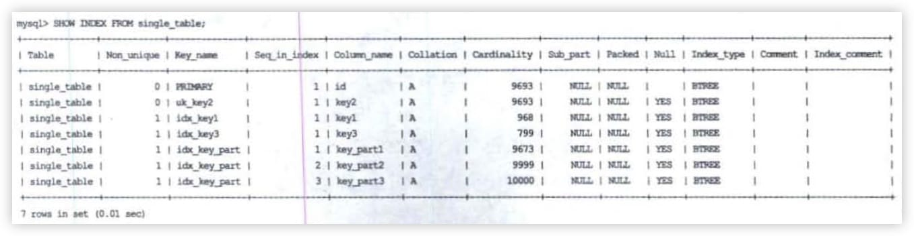


`Cardinality`属性（在中文中是“基数”的意思），表示**某个列中不重复的值的个数**。比如对于一个有10,000行记录的表来说，某个列的 Cardinality 属性值是 10,000，就意味着该列中没有重复的值；如果 Cardinality 属性是1，就意味着该列的值全部都是重复的。【对于InnoDB，Cardinality值是估值】

前面讲到，当IN语句中对应的单点区间数量大于或等于系统变量 `eq_range_index_dive_limit` 的值时，就不会使用 index dive 来计算各个单点区间对应的索引记录条数，而是使用**索引统计数据 （index statistics）**。这里的索引统计数据指的是下面这两个值。

- 使用`SHOW TABLE STATUS`语句显示出来的`Rows`值：表示一个表中有多少条记录。
- 使用`SHOW INDEX`语句显示出来的`Cardinality`属性。

结合Rows统计数据，可以计算出在某一个列中一个值平均重复多少次。一个值的重复次数大约等于 Rows 除以 Cardinality的值。

以 single_table 表的idx_key1 索引为例，Rows 值是 9693，keyl 列的 Cardinality 值是968，所以可以计算key1 列单个值的平均重复次数：9,693/968约等于10条。


此时会看上面的查询语句：

```mysql
SELECT * FROM single_table WHERE key1 IN ('aa1', 'aa2', 'aa3', ... , 'zzz');
```

假设 IN语句对应着20,000个单点扫描区间，就直接使用统计数据来估算这些单点扫描区间对应的记录条数了。每个单点扫描区间大约对应10条记录，所以总共需要回表的记录数就是20,000×10=200,000。

使用统计数据来计算单点扫描区间对应的索引记录条数可比 index dive 方式简单多了，但是它的致命弱点就是不精确！使用统计数据算出来的查询成本与实际执行时的成本可能相差很大。

### 12.3 连接查询的成本

相同表single_table s1, single_table2 s2。

#### 条件过滤

两表连接查询的查询成本由两部分构成：

- 单次查询驱动表的成本；
- 多次查询被驱动表的成本（具体查询多少次取决于针对驱动表查询后的结果集中有多少条记录）。

把查询驱动表后得到的记录条数称为**驱动表的==扇出（fanout)==**。显然，驱动表的扇出值越小，对被驱动表的查询次数也就越少，连接查询的总成本也就越低。当查询优化器想计算执行整个连接查询所需的成本时，就需要计算出驱动表的扇出值。

有时扇出值的计算是很容易的，比如下面这两个查询。

- 查询1：

```mysql
SELECT * FROM s1 INNER JOIN s2;
```

假设使用 s1 表作为驱动表，很显然就只能使用全表扫描的方式对驱动表执行单表查询。驱动表的扇出值也很明确，那就是驱动表中有多少记录，扇出值就是多少。前面说过，统计数据中s1 表的记录行数是 9,693，也就是说优化器直接会把 9,693 当作s1 表的扇出值。

- 查询2：

```mysql
SELECT * FROM s1 INNER JOIN s2
WHERE s1.key2 >10 AND s1.key2 < 1000;
```

此时 uk_key2的扫描区间（10，1000） 中有多少条记录，那么扇出值就是多少。前面计算过，满足uk_key2的扫描区间（10，1000）的记录数是 95 条，也就是说在本查询中优化器会把 95当作驱动表 s1 的扇出值。

有时扇出值的计算是不容易的。

- 查询 3：

```mysql
SELECT * FROM s1 INNER JOIN s2
WHERE s1.comon_field > "xyz';
```

优化器又不会真正地去执行查询，所以它只能**猜**这 9,693 条记录中有多少条记录满足 commonfield>'xyz 条件。

- 查询4:

```mysql
SELECT * FROM s1 INNER JOIN s2
WHERE s1.key2 > 10 AND s1.key2 < 1000 AND
			s1.common_field > 'xyz';
```

只需要在二级索引扫描区间的记录中猜测有多少条记录符合common_feld > 'xyz' 条件，也就是只需要在 95 条记录中猜测有多少条记录符合 common_feld > 'xyz' 条件即可。

- 查询 5:

```mysql
SELECT * FROM s1 INNER JOIN s2
WHERE s1.key2 > 10 AND s1. key2 < 1000 AND 
			s1.key1 IN ('a', 'b', 'c') AND 
			s1.common_field > 'xyz';
```

查询5和查询2类似，不过在对驱动表s1选取uk_key2索引执行查询后，查询优化器需要在二级索引扫描区间的记录中猜测有多少条记录符合下面两个条件：

- `key1 IN('a', 'b','c')`
- `common_field > 'xyz'`

也就是优化器需要在 95 条记录中猜测有多少条记录符合上述两个条件。

说了这么多，其实就是想表达在下面两种情况下计算驱动表扇出值时，需要靠==猜测==。

- 如果使用全表扫描的方式执行单表查询，那么计算驱动表扇出值时需要猜测满足全部搜索条件的记录到底有多少条。

- 如果使用索引来执行单表查询，那么计算驱动表扇出值时需要猜测除了满足形成索引扫描区间的搜索条件外，还满足其他搜索条件的记录有多少条。

设计者把这个猜测过程称为==Condition Filtering（条件过滤）==。当然，这个猜测过程可能会使用到索引，也可能会使用到统计数据，还有可能就是设计者单纯地瞎猜。整个评估过程其实挺复杂的。

#### 两表连接的成本分析 🔖

> 连接查询总成本 = 单次访问驱动表的成本 + 驱动表扇出值 * 单次访问被驱动表的成本


#### 多表连接的成本分析 🔖


### 12.4 调节成本常数

mysql支持很多成本常数，在两个表中：

```mysql
Show Tables From mysql Like '%cost%';
+--------------------------+
| Tables_in_mysql (%cost%) |
+--------------------------+
| engine_cost              |
| server_cost              |
+--------------------------+
```

第1章讲到，一条语句在执行时，其实是分为在==server层==和==存储引擎层==这两层执行。在server层进行==连接管理、查询缓存、语法解析、查询优化==等操作，在存储引擎层执行==具体的数据存取==操作。也就是说，一条语句在 server 层进行操作的成本与它在操作表时使用的在储引擎没有任何关系，那些在 server层进行的操作对应的成本常数存储在 `server_cost` 表中，而依赖于存储引擎的操作对应的成本常数存储在 `engine_cost` 表中。

#### mysql.server_cost表

记录了在server层进行的一些操作所对应的成本常数。

```mysql
mysql> select * from mysql.server_cost;
+------------------------------+------------+---------------------+---------+---------------+
| cost_name                    | cost_value | last_update         | comment | default_value |
+------------------------------+------------+---------------------+---------+---------------+
| disk_temptable_create_cost   |       NULL | 2021-11-04 20:48:00 | NULL    |            20 |
| disk_temptable_row_cost      |       NULL | 2021-11-04 20:48:00 | NULL    |           0.5 |
| key_compare_cost             |       NULL | 2021-11-04 20:48:00 | NULL    |          0.05 |
| memory_temptable_create_cost |       NULL | 2021-11-04 20:48:00 | NULL    |             1 |
| memory_temptable_row_cost    |       NULL | 2021-11-04 20:48:00 | NULL    |           0.1 |
| row_evaluate_cost            |       NULL | 2021-11-04 20:48:00 | NULL    |           0.1 |
+------------------------------+------------+---------------------+---------+---------------+
6 rows in set (0.00 sec)
```

`cost_value`表示成本常数对应的值，null表示采用默认值


> 在执行诸如包含 DISTINCT 子句、GROUP BY 子句、UNTON 子句的查询以及某些特殊条件下的排序查询时，MySQL 都可能在内部先创建一个**临时表**，使用这个临时表来辅助完成查询。比如针对包含 DISTINCT 子句的查询，可以建立一个内部临时表，这个临时表在需要去重的那些列上具有唯一性，这样直接把需要去重的记录插入到这个临时表中，插入完成之后的记录就是结果集了，在数据量大的情況下可能创建基于磁盘的临时表，也就是为该临时表使用 MyISAM、InnoDB 等存储引擎，在数据量不大时可能创建基于内存的临时表，也就是使用 MIEMORY 存储引擎。

修改某个成本常数的值：

```mysql
Update mysql.server_cost Set cost_value = 0.4
Where cost_name = 'row_evaluate_cost';

Flush OPTIMIZER_COSTS;  // 让系统重新加载
```

如果想回复默认值，把cost_value设置成null即可。

##### mysql.engine_cost表

记录了在存储引擎层进行的一些操作所对应的成本常数。

```mysql
select * from mysql.engine_cost;
+-------------+-------------+------------------------+------------+---------------------+---------+---------------+
| engine_name | device_type | cost_name              | cost_value | last_update         | comment | default_value |
+-------------+-------------+------------------------+------------+---------------------+---------+---------------+
| default     |           0 | io_block_read_cost     |       NULL | 2021-11-04 20:48:00 | NULL    |             1 |
| default     |           0 | memory_block_read_cost |       NULL | 2021-11-04 20:48:00 | NULL    |          0.25 |
+-------------+-------------+------------------------+------------+---------------------+---------+---------------+
```


```mysql
Insert Into mysql.engine_cost
	Values ('InnoDB', 0, 'io_block_read_cost', 2.0, CURRENT_TIMESTAMP, 'increae Innodb I/O cost');
	
FLUSH OPTIMIZER_COSTS;
```

### 12.5 总结

在MySQL中，一个查询的执行成本是由**I/O成本**和**CPU成本**组成的。对于InnoDB存储引擎来说，读取一个页面的I/O成本默认是1.0，读取以及检测一条记录是否符合搜索条件的成本默认是0.2。

在单表查询中，优化器生成执行计划的步骤一般如下。

- 步骤1．根据搜索条件，找出所有可能使用的索引。

- 步骤2．计算全表扫描的代价。

- 步骤3．计算使用不同素引执行查询的代价。

- 步骤4．对比各种执行方案的代价，找出成本最低的那个方案。

在优化器生成执行计划的过程中，需要依赖一些数据。这些数据可能是使用下面两种方式得到的：

- index dive：通过直接访问索引对应的 B+树来获取数据。
- 索引统计数据：直接依赖对表或者索引的统计数据。

为了更准确地计算连接查询的成本，设计者提出了条件过滤的概念，也就是采用某些规则来预测驱动表的扇出值。

对于内连接来说，为了生成成本最低的执行计划，需要考虑两方面的事情：

- 选择最优的表连接顺序；
- 为驱动表和被驱动表选择成本最低的访问方法。

可以通过手动修改mysql数据库下`engine_cost`表或者`server_cost`表中的某些成本常数，更精确地控制在生成执行计划时的成本计算过程。


## 13 InnoDB统计数据是如何收集的

```mysql
Show Table status;
SHOW INDEX FROM <表名>;
```

InnoDB的统计信息是不精确的估计值。

### 13.1 统计数据的存储方式

InnoDB提供了两种存储统计数据的方式：

- 永久性地存储统计数据：统计数据存储在磁盘上
- 非永久性地存储统计数据：统计数据存储在内存中

系统变量`innodb_stats_persistent`控制将统计数据存储在何处（5.6之前默认off是内存，5.6之后默认on存储在磁盘）。

IonoDB 默认以表为单位来收集和存储统计数据，也就是说我们可以把某些**表的统计数据**（以及该表的**索引统计数据**）存储在磁盘上，把另一些表的统计数据存储在内存中。

```mysql
CREATE TABLE 表名(...) Engine=InnoDB, STATS_PERSISTENT = (1|0):
ALTER TABLE 表名 Engine=InnoDB, STATS_PERSISTENT = (1|0);
```

### 13.2 基于磁盘的永久性统计数据

当选择存储在磁盘上时，就是把统计数据存储在两个表中：

```mysql
mysql> show tables from mysql like 'innodb%stats';
+--------------------------------+
| Tables_in_mysql (innodb%stats) |
+--------------------------------+
| innodb_index_stats             |
| innodb_table_stats             |
+--------------------------------+
2 rows in set (0.00 sec)
```

#### 13.2.1 表innodb_table_stats

存储了关于表的统计数据，每一条记录对应着一个表的统计数据.

```mysql
SELECT * FROM mysql.innodb_table_stats;
+---------------+--------------------+---------------------+--------+----------------------+--------------------------+
| database_name | table_name         | last_update         | n_rows | clustered_index_size | sum_of_other_index_sizes |
+---------------+--------------------+---------------------+--------+----------------------+--------------------------+
| mysql         | component          | 2025-06-27 14:20:29 |      0 |                    1 |                        0 |
| sys           | sys_config         | 2025-06-27 14:20:30 |      6 |                    1 |                        0 |
| xiaohaizi     | record_format_demo | 2025-07-28 18:54:32 |      2 |                    1 |                        0 |
| xiaohaizi     | single_table       | 2025-07-28 19:44:23 |  10246 |                   97 |                       84 |
+---------------+--------------------+---------------------+--------+----------------------+--------------------------+
13 rows in set (0.00 sec)
```

这个表的主键是(database_name, table_name)。

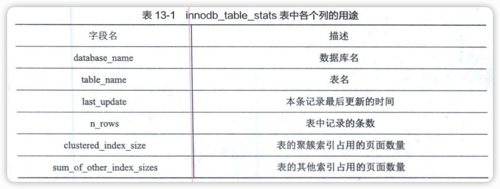

```mysql
CREATE TABLE `innodb_table_stats` (
  `database_name` varchar(64) COLLATE utf8mb3_bin NOT NULL,
  `table_name` varchar(199) COLLATE utf8mb3_bin NOT NULL,
  `last_update` timestamp NOT NULL DEFAULT CURRENT_TIMESTAMP ON UPDATE CURRENT_TIMESTAMP,
  `n_rows` bigint unsigned NOT NULL,
  `clustered_index_size` bigint unsigned NOT NULL,
  `sum_of_other_index_sizes` bigint unsigned NOT NULL,
  PRIMARY KEY (`database_name`,`table_name`)
) /*!50100 TABLESPACE `mysql` */ ENGINE=InnoDB DEFAULT CHARSET=utf8mb3 COLLATE=utf8mb3_bin STATS_PERSISTENT=0 ROW_FORMAT=DYNAMIC;
```

##### n_rows统计项的收集

==为什么是估计值？==

按照一定算法（并不是纯粹随机的）从聚族索引中选取几个叶子节点页面，统计每个页面中包含的记录数量，然后计算一个页面中平均包含的记录数量，并将其乘以全部叶子节点的数量，结果就是该表的n_rows值。

采样的页面数量的系统变量`innodb_statspersistent_sample_pages` ，默认值20，可自定义。


##### clustered_index_size和sum_of_other_index_sizes统计项的收集🔖


#### 13.2.2 表innodb_index_stats

存储了关于索引的统计数据，每一条记录对应着一个索引的一个统计项的统计数据。

```mysql
SELECT * FROM mysql.innodb_index_stats;
```

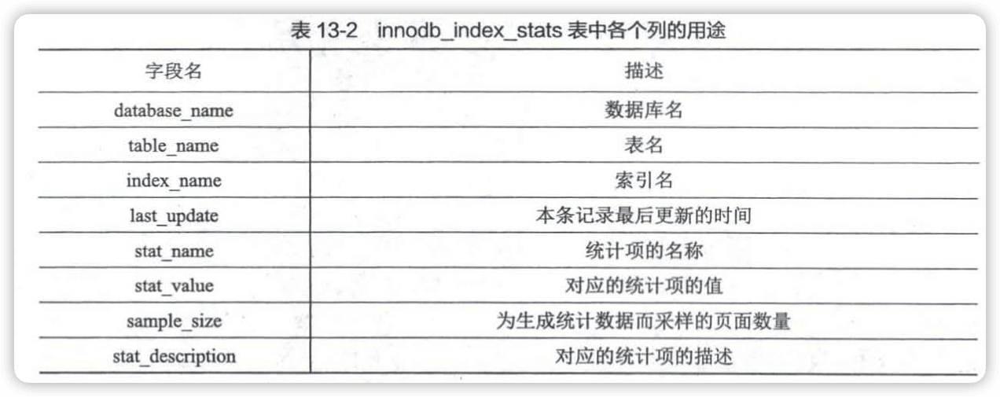

```mysql
CREATE TABLE `innodb_index_stats` (
  `database_name` varchar(64) COLLATE utf8mb3_bin NOT NULL,
  `table_name` varchar(199) COLLATE utf8mb3_bin NOT NULL,
  `index_name` varchar(64) COLLATE utf8mb3_bin NOT NULL,
  `last_update` timestamp NOT NULL DEFAULT CURRENT_TIMESTAMP ON UPDATE CURRENT_TIMESTAMP,
  `stat_name` varchar(64) COLLATE utf8mb3_bin NOT NULL,
  `stat_value` bigint unsigned NOT NULL,
  `sample_size` bigint unsigned DEFAULT NULL,
  `stat_description` varchar(1024) COLLATE utf8mb3_bin NOT NULL,
  PRIMARY KEY (`database_name`,`table_name`,`index_name`,`stat_name`)
) /*!50100 TABLESPACE `mysql` */ ENGINE=InnoDB DEFAULT CHARSET=utf8mb3 COLLATE=utf8mb3_bin STATS_PERSISTENT=0 ROW_FORMAT=DYNAMIC;
```

主键是 (database_name, table_name, index_name, stat_name)，

```mysql
select * from mysql.innodb_index_stats where table_name = 'single_table';
+-----------------+--------------+--------------+---------------------+--------------+------------+-------------+-----------------------------------+
| database_name   | table_name   | index_name   | last_update         | stat_name    | stat_value | sample_size | stat_description                  |
+-----------------+--------------+--------------+---------------------+--------------+------------+-------------+-----------------------------------+
| charset_demo_db | single_table | PRIMARY      | 2022-04-24 11:51:14 | n_diff_pfx01 |          0 |           1 | id                                |
| charset_demo_db | single_table | PRIMARY      | 2022-04-24 11:51:14 | n_leaf_pages |          1 |        NULL | Number of leaf pages in the index |
| charset_demo_db | single_table | PRIMARY      | 2022-04-24 11:51:14 | size         |          1 |        NULL | Number of pages in the index      |
| charset_demo_db | single_table | idx_key1     | 2022-04-24 11:51:14 | n_diff_pfx01 |          0 |           1 | key1                              |
| charset_demo_db | single_table | idx_key1     | 2022-04-24 11:51:14 | n_diff_pfx02 |          0 |           1 | key1,id                           |
| charset_demo_db | single_table | idx_key1     | 2022-04-24 11:51:14 | n_leaf_pages |          1 |        NULL | Number of leaf pages in the index |
| charset_demo_db | single_table | idx_key1     | 2022-04-24 11:51:14 | size         |          1 |        NULL | Number of pages in the index      |
| charset_demo_db | single_table | idx_key3     | 2022-04-24 11:51:14 | n_diff_pfx01 |          0 |           1 | key3                              |
| charset_demo_db | single_table | idx_key3     | 2022-04-24 11:51:14 | n_diff_pfx02 |          0 |           1 | key3,id                           |
| charset_demo_db | single_table | idx_key3     | 2022-04-24 11:51:14 | n_leaf_pages |          1 |        NULL | Number of leaf pages in the index |
| charset_demo_db | single_table | idx_key3     | 2022-04-24 11:51:14 | size         |          1 |        NULL | Number of pages in the index      |
| charset_demo_db | single_table | idx_key_part | 2022-04-24 11:51:14 | n_diff_pfx01 |          0 |           1 | key_part1                         |
| charset_demo_db | single_table | idx_key_part | 2022-04-24 11:51:14 | n_diff_pfx02 |          0 |           1 | key_part1,key_part2               |
| charset_demo_db | single_table | idx_key_part | 2022-04-24 11:51:14 | n_diff_pfx03 |          0 |           1 | key_part1,key_part2,key_part3     |
| charset_demo_db | single_table | idx_key_part | 2022-04-24 11:51:14 | n_diff_pfx04 |          0 |           1 | key_part1,key_part2,key_part3,id  |
| charset_demo_db | single_table | idx_key_part | 2022-04-24 11:51:14 | n_leaf_pages |          1 |        NULL | Number of leaf pages in the index |
| charset_demo_db | single_table | idx_key_part | 2022-04-24 11:51:14 | size         |          1 |        NULL | Number of pages in the index      |
| charset_demo_db | single_table | uk_key2      | 2022-04-24 11:51:14 | n_diff_pfx01 |          0 |           1 | key2                              |
| charset_demo_db | single_table | uk_key2      | 2022-04-24 11:51:14 | n_leaf_pages |          1 |        NULL | Number of leaf pages in the index |
| charset_demo_db | single_table | uk_key2      | 2022-04-24 11:51:14 | size         |          1 |        NULL | Number of pages in the index      |
+-----------------+--------------+--------------+---------------------+--------------+------------+-------------+-----------------------------------+
20 rows in set (0.00 sec)
```

`stat_name`统计项名称，有哪些：

- `n_leaf_pages`： 表示该索引的叶子节点实际占用多少页面。

- `size`：表示该索引共占用多少页面（包括已经分配给叶子节点段或者非叶子节点段但是尚未使用的页面）。

- `n_diff_ptxNN`：表示对应的索引列不重复的值有多少。NN表示可以被替换为01、02、03••••••这样的数字。比如对于`idx_key_part` 来说：
  - `n_dift_pfxO1`表示的是统计key_part1这一个列中不重复的值有多少；
  - `n_diff_pbx02`表示的是统计key_part1、key_par2这两个列组合起来后不重复的值有多少；
  - `n_diff_pfx03` 表示的是统计key_part1、key_part2、key_part3 这3个列组合起来后不重复的值有多少；
  - `n_diff_pfx04` 表示的是统计key_partl、key_part2、key_partB、id 这4个列组合起来后不重复的值有多少。

> 这里需要注意的是，对于普通的二级索引，并不能保证它的索引列值是唯一的。比如对于idx_key1来说，key1列就可能有很多值重复的记录。此时只有在索引列的基础上加上主键，才可以区分两条索引列值都一样的一级索引记录，对于主键和唯一二级索引则没有这个问题，它们本身就可以保证索引列的值是不重复的，所以也不需要再统计一遍在索引列后加上主键值后的不重复值有多少。比如前文的idx_key1 有n_dift_pfx01和n_diff_pfx02两个统计项，其中的n_diff_pfx02 表示的就是统计key1和id 这两个列组合起来不重复的值有多少；而uk_key2却只有n_dift_pfx01一个统计项，该统计项表示的就是key2列不重复的值有多少。

#### 13.2.3 定期更新统计数据

`innodb_index_stats`和`innodb_table_stats`两个表中统计数据的两种更新方式：

- 开启`Innodb_stats_auto_recalc`

- 手动调用`Analyze Table`语句来更新统计信息

  ```mysql
  Analyze Table single_table;
  +------------------------+---------+----------+----------+
  | Table                  | Op      | Msg_type | Msg_text |
  +------------------------+---------+----------+----------+
  | xiaohaizi.single_table | analyze | status   | OK       |
  +------------------------+---------+----------+----------+
  1 row in set (0.03 sec)
  ```

  

#### 13.2.4 手动更新innodb_table_stats和innodb_index_stats表

这两个表与普通表别无二致。

```mysql
Update innodb_table_stats Set n_rows = 1 Where table_name = 'single_table';

-- 让MySQL优化器重新加载更改后的数据
Flush Table single_table;
```

### 13.3 基于内存的非永久性统计数据

`innodb_stats_persistent`  off


### 13.4 innodb_stats_method的使用🔖

**索引列中不重复的值的数量对于MySQL优化器十分重要**，通过它可以计算出在索引列中一个值平均重复多少行。


`innodb_stats_method`决定着在统计某个索引列中不重复的值的数量时如何对待NULL值。


### 13.5 小结

InnoDB**以表为单位**来收集统计数据。这些统计数据可以是基于磁盘的永久性统计数据，也可以是基于内存的非永久性统计数据。

`innodb_stats_persistent`控制着服务器使用永久性统计数据还是非永久性统计数据，`innodb_stats_persistent_sample_pages`控制着永久性统计数据的采样页面数量，`innodb_stats_transient_sample_pages`控制着非永久性统计数据的采样页面数量，`innodb_stats_auto_recalc`控制着是否自动重新计算统计数据。

我们可以在创建和修改表时通过指定`STATS_PERSISTENT`、`STATS_AUTO_RECALC`、`STATS_SAMPLE_PAGES`的值来控制收集统计数据时的一些细节。

`innodb_stats_method`决定着在统计某个索引列中不重复的值的数量时如何对待NULL值。


## 14 基于规则的优化（内含子查询优化二三事）

**查询重写**：MySQL设计者依据一些规则，竭力把用户糟糕的查询语句转换成某种可以高效执行的形式的过程。

### 14.1 条件化简

查询语句中的搜索条件本质上是**表达式**。MySQL优化器会为用户简化这些表达式。

#### 移除不必要的括号

```mysql
Select * From (t1, (t2, t3)) Where t1.a=t2.a And t2.b=t3.b;
-- 
Select * From t1, t2, t3 Where t1.a=t2.a And t2.b=t3.b;
```

#### 常量传递

```mysql
a = 5 And b > a
-- 转换成
a = 5 And b > 5
```

#### 移除没用的条件

对一些明显永远为TRUE或FALSE的表达式，优化器会将它们移除掉：

```mysql
(a < 1 Andy b = b) Or ( a = 6 Or 5 != 5)
-- 简化
(a < 1 And True) Or ( a = 6 Or False)
-- 继续简化
a < 1 OR a = 6
```

#### 表达式计算

在查询执行之前，如果表达式中只包含常量的话，它的值会被先计算出来。如：

```mysql
a = 5 + 1
---
a = 6
```

如果某个列并不是以单独的形式作为表达式的操作数，比如出现在函数中，或者出现在某个更复杂的表达式中：

```mysql
ABS(a) > 5
-a < -8
```

优化器是不会尝试对这些表达式进行简化的。前文说过，在搜索条件中，**只有索引列和常数使用某些运算符连接起来，才可能形成合适的范围区间来减少需要扫描的记录数量**。所以，**最好让索引列以单独的形式出现在搜索条件表达式中。**

#### Having子句和Where子句的合并

如果查询语句中没有出现诸如Sum、Max这样的聚集函数以及Group By子句，查询优化器就把**Having**子句和Where子句合并起来。

#### 常量表检测 🔖

常量表(constant table)

MySQL中两种类型查询运行得特别快：

- 类型1：查询的表中一条记录都没有，或者只有一条记录。【适用于Memory或MyISAM这类有紧缺统计数据的】

- 类型2：使用主键等值匹配或者唯一二级索引列等值匹配作为搜索条件来查询某个表。

MySQL设计者觉得这两种查询花费的时间特别少，少到可以忽略，所以也把通过这两种方式查询的表称为==常量表（constant table）==。查询优化器在分析一个查询语句时，首先执行常量表查询，然后把查询中涉及该表的条件全部替换成常数，最后再分析其余表的查询成本。比如：

```mysql
SELECT * FROM table1 INNER JOIN table2
	ON table1.column1 = table2.column2
	WHERE table1.primary_key = 1;
```

这个查询可以使用主键和常量值的等值匹配来查询table1表。也就是说，在这个查询中table1表相当于常量表。在分析针对table2表的查询成本之前，就会执行针对table1表的查询，在得到查询结果后把原查询中涉及table1表的条件都替换掉。也就是说，上面的查询语句会被转换成：

```mysql
SELECT table1表记录各个字段的常量值, table2.* FROM table1 INNER JOIN table2
	ON table1表column1列的常量值 = table2.column2;
```


### 14.2 外连接消除 🔖


在外连接查询中，指定的Where子句中包含被驱动表中的列不为NULL值得条件称为**空值拒绝（reject-NULL）**。这种情况下，外连接和内连接可以相互转换。

转换带来的好处就是**优化器可以通过评估表的不同连接顺序的成本，选出成本最低的连接顺序来执行查询。**

### 14.3 子查询优化

#### 子查询语法

在一个查询语句中的**==某个位置==**也可以有另一个查询语句。

- 在Select子句中

  ```mysql
  Select (Select m1 From t1 Limit 1);
  ```

- 在From子句中

  ```mysql
  Select m, n From (Select m2 + 1 As m, n2 As n From t2 Where m2 > 2) As t;
  ```

  ==派生表==

- 在Where或On子句的表达式中

  ```mysql
  Select * From t1 Where m1 In (Select m2 From t2);
  ```

语句含义：想找t1表中的某些记录，这些记录的m1列的值能在t2表的m2列找到匹配的值。

另外语法支持子查询在Order By和Group By中，但没啥意义。

##### 1.按返回的结果集 区分子查询

- ==标量子查询==：只返回一个单一值

- ==行子查询==：返回一个记录（包含多个列）

  ```mysql
  Select * From t1 Where (m1, n1) = (Select m2, n2 From t2 Limit 1);
  ```

- ==列子查询==：查询一个列（多条列）

  ```mysql
  Select * From t1 Where m1 In (Select m2 From t2);
  ```

- ==表子查询==：就是子查询结果既包含很多条记录，又包含很多个列。

  ```mysql
  Select * From t1 Where (m1, n1) In (Select m2, n2 From t2);
  ```

##### 2.按与外层查询的关系来区分子查询

- ==不相关子查询==：子查询可单独运行出结果

- ==相关子查询==：子查询的执行需要依赖外层查询的值

  ```mysql
  Select * From t1 Where m1 IN (Select m2 From t2 Where n1 = n2);
  ```

  n1是表t1的列。

##### 3.子查询在布尔表达式中的使用

- 使用=、>、<、>=、<=、<>、!=、<=>作为布尔表达式的操作符，它们被称为comparison_operator。

  ```mysql
  操作数 comparison_operator (子查询)
  ```

  操作数可以是：某个列名、常量、复杂的表达式、另一个子查询；

  子查询只能是：标量子查询或行子查询。

  ```mysql
  Select * From t1 Where m1 < (Select Min(m2) From t2);
  Select * From t1 Where (m1, n1) In (Select m2, n2 From t2 Limit 1);
  ```

- [Not] In/Any/Some/All 子查询

  + `操作数 [Not] In (子查询)`

    ```mysql
    Select * From t1 Where(m1, n1) IN (Select m2, n2 From t2);
    ```

  + `操作数 comparison_operator Any/Some(子查询)`

    ```mysql
    Select * From t1 Where m1 > Any(Select m2 From t2);
    -- 等价于：
    Select * From t1 Where m1 > (Select Min(m2) From t2);
    ```

  + `操作数 comparison_operator All(子查询)`

    ```mysql
    Select * From t1 Where m1 > All(Select m2 From t2);
    -- 等价于：
    Select * From t1 Where m1 > (Select Max(m2) From t2);
    ```

- Exists子查询 `[Not] Exists (子查询)`

  ```mysql
  Select * From t1 Where Exists (Select 1 From t2);
  ```

  只要(Select 1 From t2)查询的结果集中有记录，Exists表达式的结果就位TRUE。

##### 4.子查询语法注意事项

- 子查询必须用小括号
- 在Select子句中的子查询必须是标量子查询
- 要想得到标量子查询或行子查询，但又不能保证子查询结果集只有一条记录时，可使用`Limit 1`
- 对于`[Not] In/Any/Some/All` 子查询，不允许有Limit
- 不允许在一条语句中增删改同时还对该表进行子查询

#### 子查询在MySQL中是怎么执行的 🔖🔖

##### 1.小白眼中的子查询执行方式


##### 2.标量子查询、行子查询的执行方式


##### 3.In子查询优化

物化表


##### 4.Any/All子查询优化

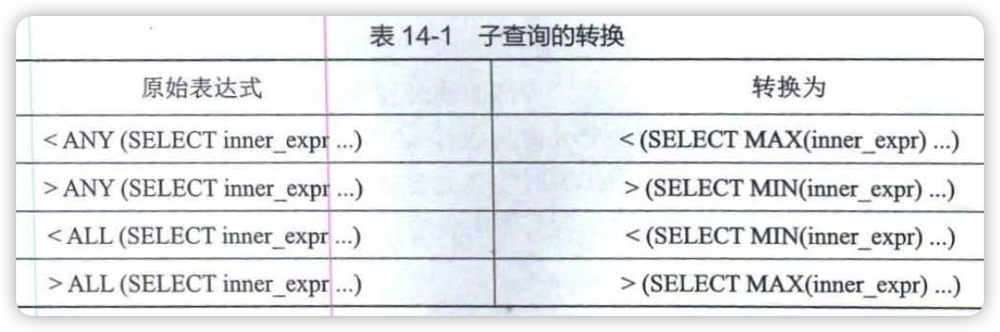

##### 5.[Not]Exists子查询的执行


##### 6.对于派生表的优化


### 14.4 总结

MySQL会对用户编写的查询语句执行一些**重写操作**，比如：

- 移除不必要的括号；
- 常量传递；
- 移除没用的条件；
- 表达式计算；
- HAVING子句和WHERE子句的合并：
- 常量表检测。

在被驱动表的WHERE子句符合**空值拒绝**的条件时，外连接和内连接可以相互转换。

子查询可以按照**不同的维度**进行不同的分类，比如按照子查询返回的结果集分类：

- 标量子查询；
- 行子查询；
- 列子查询；
- 表子查询。

按照与外层查询的关系来分类：

- 不相关子查询；
- 相关子查询。

设计者将IN子查询进行了很多优化。如果IN子查询符合转换为半连接的条件，查询优化器会优先把该子查询转换为**半连接**，然后再考虑下面5种执行半连接查询的策略中哪个成本最低，最后选择成本最低的执行策略来执行子查询。

- Table pullout
- Duplicate Weedout
- LooseScan
- Semi-join Materialization
- FirstMatch

如果IN子查询不符合转换为半连接的条件，查询优化器会从下面的两种策略中找出一种成本更低的方式执行子查询：

- 先将子查询物化，再执行查询；
- 执行IN到EXISTS的转换。

MySQL在处理带有派生表的语句时，优先尝试把派生表和外层查询进行合并；如果不行，再把派生表物化掉，然后执行查询。


## 15 查询优化的百科全书——Explain详解

MySQL查询优化器在基于成本和规则对一条查询语句进行优化后，会生成一个**==执行计划==**，它展示了接下来执行查询的具体方式，比如<u>多表连接的顺序是什么，采用什么访问方法来具体查询每个表等</u>。

```mysql
mysql> Explain select 1;
+----+-------------+-------+------------+------+---------------+------+---------+------+------+----------+----------------+
| id | select_type | table | partitions | type | possible_keys | key  | key_len | ref  | rows | filtered | Extra          |
+----+-------------+-------+------------+------+---------------+------+---------+------+------+----------+----------------+
|  1 | SIMPLE      | NULL  | NULL       | NULL | NULL          | NULL | NULL    | NULL | NULL |     NULL | No tables used |
+----+-------------+-------+------------+------+---------------+------+---------+------+------+----------+----------------+
1 row in set, 1 warning (0.00 sec)
```

EXPLAIN语句输中的各个列的作用

| 列名          | 描述                                                         |
| :------------ | :----------------------------------------------------------- |
| id            | 在一个大的查询语句中，每个select关键字都对应一个唯一的id     |
| select_type   | select关键字对应的查询类型                                   |
| table         | 表名                                                         |
| partitions    | 匹配的分区信息                                               |
| type          | 针对单表的访问方法                                           |
| possible_keys | 可能用到的索引                                               |
| key           | 实际使用的索引                                               |
| key_len       | 实际使用的索引长度                                           |
| ref           | 当使用索引列等值查询时，与索引列进行等值匹配的对象信息       |
| rows          | 预估的需要读取的记录条数                                     |
| filtered      | 针对预估的需要读取的记录，经过搜索条件过滤后剩余记录条数的百分比 |
| Extra         | 一些额外信息                                                 |

```mysql
Create Table single_table (
  id INT NOT NULL AUTO_INCREMENT,
  key1 VARCHAR (100),
  key2 INT,
  key3 VARCHAR(100),
  key_part1 VARCHAR(100),
  key_part2 VARCHAR(100),
  key_part3 VARCHAR(100),
  common_field VARCHAR(100),
  PRIMARY KEY (id),
  KEY idx_key1 (key1),
  UNIQUE KEY uk_key2 (key2),
  KEY idx_key3 (key3),
  KEY idx_key_part (key_part1, key_part2, key_part3)
) Engine=InnoDB CHARSET=utf8;
```

> 看懂执行计划，以及在这个执行计划的辅助下，应该怎样改进自己的查询语句，是查询执行起来更高效。

### 15.1 执行计划输出中各列详解

#### table

无论查询语句有多复杂，包含多少表，最后都是对每个表进行单表访问。**Explain语句输出的每条记录都对应这==某个单表的访问方法==**。

table表示表名。

#### id

查询语句中每出现一次Select关键字，MySQL就会为它分配一个唯一的id值。


```mysql
EXPLAIN SELECT * FROM single_table, single_table2 ;
```

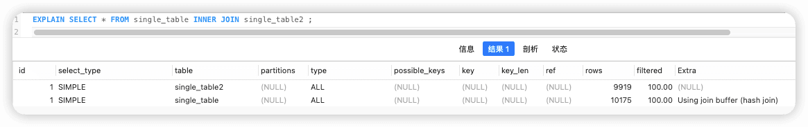

在连接查询的执行计划中，每个表都会对应一条记录，这些记录的id列的值是相同的；出现在前面的表表示驱动表，出现在后面的表表示被驱动表。


对于包含子查询的查询语句来说，就可能涉及多个SELECT关键字。**每个SELECT关键字都会对应一个唯一的id值**。如：

```mysql
Explain Select * From single_table Where key1 In (Select key1 From single_table2) Or key3 = 'a';
```

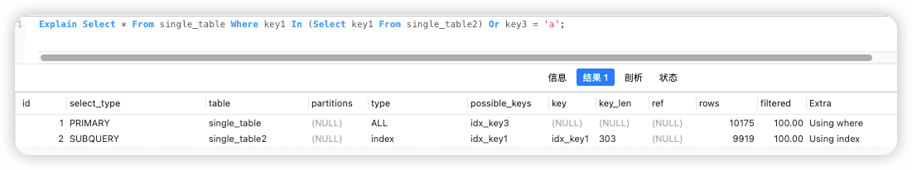


**注意**：查询优化器可能对涉及子查询的查询语句进行**重写**，从而转换为连接查询（当然这里指的是半连接)。

```mysql
Explain Select * From single_table Where key1 In (Select key3 From single_table2 Where common_field = 'a');
```

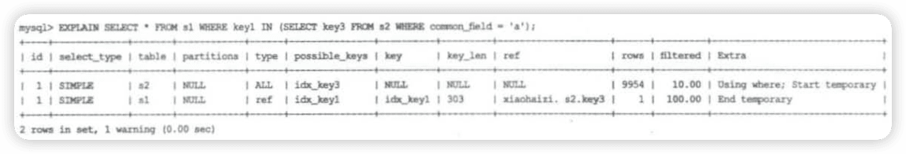

虽然包含了一个子查询，但执行计划中两个表对应的记录id值都是1，说明查询优化器将子查询转换为了连接查询。


Union子句

```mysql
Explain Select * From single_table Union Select * From single_table2;
```

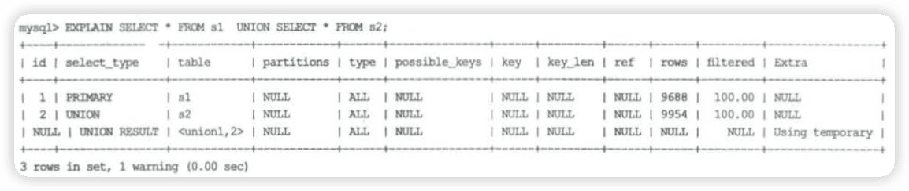

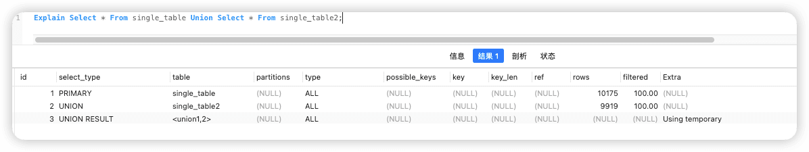

UNION子句为了把id为1的查询和id为2的查询的结果集合并起来并**去重**，在内部创建了一个名为 `<unionl，2>`的**临时表**（就是执行计划第3条记录的 table 列的名称）。

与 UNION 比起来，UNION ALL 就不需要对最终的结果集进行去重。它只是单纯地把多个查询结果集中的记录合并成一个并返回给用户，所以也就不需要使用临时表。

```mysql
Explain Select * From single_table Union All Select * From single_table2;
```

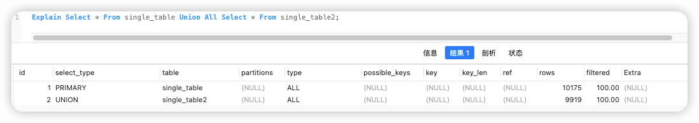

#### select_type


- **SIMPLE**：不包含Union或子查询的都是

- **Primary**：对于包含 UNION、UNION ALL 或者子查询的大查询来说，它是由几个小查询组成的；其中最左边那个查询的select type 值就是 PRIMARY。
- **UNION**：对于包含 UNION 或者 UNION ALL 的大查询来说，它是由几个小查询组成的；其中除了最左边的那个小查询以外，其余小查询的select_type 值就是 UNION。
- **UNION RESULT**： ==临时表==。MySQL选择使用**临时表**来完成 UNION 查询的去重工作。
- **SUBQUERY**：如果包含子查询的查询语句不能够转为对应的半连接形式，并且该子查询是**不相关子查询**，而且查询优化器决定采用将该子查询物化的方案来执行该子查询时，该子查询的第一个SELECT 关键字代表的那个查询的select_type 就是SUBQUERY。

```mysql
Explain Select * From single_table Where key1 In (Select key1 From single_table2) Or key3 = 'a';
```

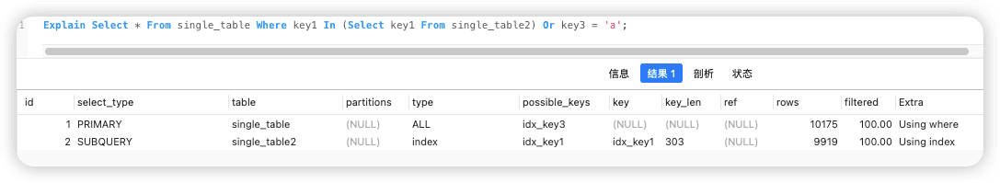

子查询被物化，只需要执行一遍 🔖

- DEPENDENT SUBQUERY：如果包含子查询的查询语句不能够转为对应的半连接形式，并且该子查询被查询优化器转换为相关子查询的形式，则该子查询的第一个SELECT 关键字代表的那个查询的select_type 就是 DEPENDENT SUBQUERY。

```mysql
Explain Select * From single_table Where key1 In (Select key1 From single_table2 Where single_table.key2 = single_table2.key2) Or key3 = 'a';
```

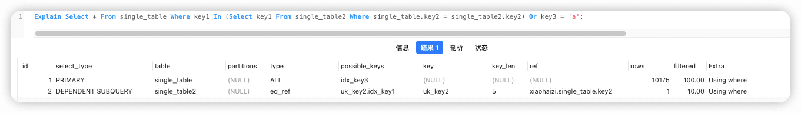

注意：DEPENDENT SUBQUERY子查询可能会被执行多次。

- **DEPENDENT UNION**：在包含 UNION 或者 UNION ALL 的大查询中，如果各个小查询都依赖于外层查询，则除了最左边的那个小查询之外，其余小查询是DEPENDENT UNION。

```mysql
Explain Select * From single_table Where key1 In 
	(Select key1 From single_table2 Where key1 = 'a' Union Select key1 From single_table Where key1 = 'b');
```

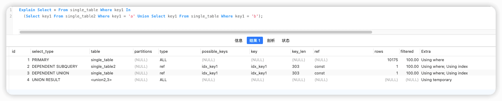

这个查询比较复杂，大查询中包含了一个子查询，子查询中又包含由 UNION 连起来的两个小查询。从执行计划中可以看出，`Select key1 From single_table2 Where key1 = 'a'`这个小查询由于是子查询中的第一个查询，所以它 是 DEPENDENT SUBQUERY；而`Select key1 From single_table Where key1 = 'b'`这个小查询的是 DEPENDENT UNION。

- **DERIVED**：在包含派生表的查询中，如果是以物化派生表的方式执行查询，则派生表对应的子查询就是 DERIVED。

```mysql
Explain Select * From (Select key1, count(*) as c From single_table Group By key1) as derived_s1 Where c > 1;
```

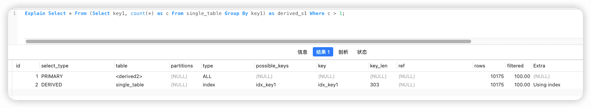

id为1的table 列显示的是`<derived2>`，表示该查询是针对将派生表物化之后的表进行查询的。🔖

- **MATERIALIZED**：当查询优化器在执行包含子查询的语句时，选择将子查询物化之后与外层查询进行连接查询，该子查询就是 MATERIALIZED。

```mysql
Explain Select * From single_table Where key1 In (Select key1 From single_table2);
```

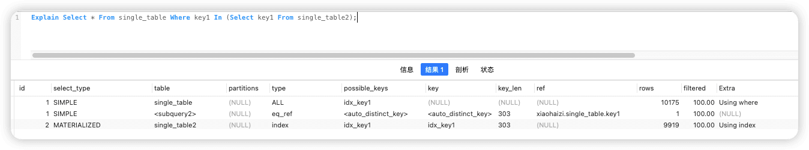

🔖


#### partitions

分区，暂时没有。

#### type

访问方法类型。

- `system`：当表中只有一条记录并且该表使用的存储引擎（比如MyISAM、MEMORY）的统计数据是精确的。

- `const`

- `eq_ref`:执行连接查询时，如果被驱动表是通过主键或者不允许存储 NULL 值的唯一二级索引列等值匹配的方式进行访问的（如果该主键或者不允许存储 NULL 值的唯一二级索引是联合索引，则所有的索引列都必须进行等值比较），则对该被驱动表的访问方法就是eq_ref。

  ```mysql
  mysql> Explain Select * From single_table s1 Inner Join single_table2 s2 On s1.id = s2.id;
  +----+-------------+-------+------------+--------+---------------+---------+---------+-----------------+------+----------+-------+
  | id | select_type | table | partitions | type   | possible_keys | key     | key_len | ref             | rows | filtered | Extra |
  +----+-------------+-------+------------+--------+---------------+---------+---------+-----------------+------+----------+-------+
  |  1 | SIMPLE      | s1    | NULL       | ALL    | PRIMARY       | NULL    | NULL    | NULL            | 9987 |   100.00 | NULL  |
  |  1 | SIMPLE      | s2    | NULL       | eq_ref | PRIMARY       | PRIMARY | 4       | xiaohaizi.s1.id |    1 |   100.00 | NULL  |
  +----+-------------+-------+------------+--------+---------------+---------+---------+-----------------+------+----------+-------+
  2 rows in set, 1 warning (0.00 sec)
  ```

  

- `ref`：普通的二级索引与常量进行等值匹配的查询某个表时；还有连接查询时，被驱动表中某个普通的二级索引列与驱动表中的某个列进行等值匹配时。

  ```mysql
  mysql> Explain Select * From single_table s1 Inner Join single_table2 s2 On s1.key1 = s2.key1;
  +----+-------------+-------+------------+------+---------------+----------+---------+-------------------+-------+----------+-------------+
  | id | select_type | table | partitions | type | possible_keys | key      | key_len | ref               | rows  | filtered | Extra       |
  +----+-------------+-------+------------+------+---------------+----------+---------+-------------------+-------+----------+-------------+
  |  1 | SIMPLE      | s2    | NULL       | ALL  | idx_key1      | NULL     | NULL    | NULL              | 10192 |   100.00 | Using where |
  |  1 | SIMPLE      | s1    | NULL       | ref  | idx_key1      | idx_key1 | 303     | xiaohaizi.s2.key1 |     1 |   100.00 | NULL        |
  +----+-------------+-------+------------+------+---------------+----------+---------+-------------------+-------+----------+-------------+
  2 rows in set, 1 warning (0.00 sec)
  ```

  

- `fulltext`：

- `ref_or_null`：普通二级索引列进行等值匹配且该索引列可以为Null。

  ```mysql
  mysql> Explain Select * From single_table Where key1 = 'a' or key1 Is Null;
  +----+-------------+--------------+------------+-------------+---------------+----------+---------+-------+------+----------+-----------------------+
  | id | select_type | table        | partitions | type        | possible_keys | key      | key_len | ref   | rows | filtered | Extra                 |
  +----+-------------+--------------+------------+-------------+---------------+----------+---------+-------+------+----------+-----------------------+
  |  1 | SIMPLE      | single_table | NULL       | ref_or_null | idx_key1      | idx_key1 | 303     | const |    2 |   100.00 | Using index condition |
  +----+-------------+--------------+------------+-------------+---------------+----------+---------+-------+------+----------+-----------------------+
  1 row in set, 1 warning (0.01 sec)
  ```

  

- `index_merge`：一般情况下只会为单个索引生成扫描区间，但是前面单表访问方法时，特意强调了在某些场景下可以使用 Intersection、Union、Sort-Union 这3种**索引合并**的方式来执行查询。执行计划中使用这个类型体现MySQL使用索引合并的方式来对某个表执行查询的：

  ```mysql
  mysql> Explain Select * From single_table Where key1 = 'a' Or key3 = 'a';
  +----+-------------+--------------+------------+-------------+------------------+------------------+---------+------+------+----------+--------------------------------------------+
  | id | select_type | table        | partitions | type        | possible_keys    | key              | key_len | ref  | rows | filtered | Extra                                      |
  +----+-------------+--------------+------------+-------------+------------------+------------------+---------+------+------+----------+--------------------------------------------+
  |  1 | SIMPLE      | single_table | NULL       | index_merge | idx_key1,idx_key | idx_key1,idx_key | 303,303 | NULL |    2 |   100.00 | Using union(idx_key1,idx_key); Using where |
  +----+-------------+--------------+------------+-------------+------------------+------------------+---------+------+------+----------+--------------------------------------------+
  1 row in set, 1 warning (0.01 sec)
  ```

  

- `unique_subquery`：类似于两表连接中被驱动表的eq_ref 访问方法，unique_subquery针对的是一些包含IN子查询的查询语句。如果查询优化器决定将 IN子查询转换为EXISTS 子查询，而且子查询在转换之后可以使用主键或者不允许存储 NULL 值的唯一二级索引进行等值匹配，那么该子查询执行计划的 type 列的值就是 unique_subquery。

  ```mysql
  mysql> Explain Select * From single_table s1 Where common_field In (Select id From single_table2 s2 where s1.common_field = s2.common_field) Or key3 = 'a';
  +----+--------------------+-------+------------+-----------------+---------------+---------+---------+------+------+----------+-------------+
  | id | select_type        | table | partitions | type            | possible_keys | key     | key_len | ref  | rows | filtered | Extra       |
  +----+--------------------+-------+------------+-----------------+---------------+---------+---------+------+------+----------+-------------+
  |  1 | PRIMARY            | s1    | NULL       | ALL             | idx_key       | NULL    | NULL    | NULL | 9987 |   100.00 | Using where |
  |  2 | DEPENDENT SUBQUERY | s2    | NULL       | unique_subquery | PRIMARY       | PRIMARY | 4       | func |    1 |    10.00 | Using where |
  +----+--------------------+-------+------------+-----------------+---------------+---------+---------+------+------+----------+-------------+
  2 rows in set, 2 warnings (0.01 sec)
  ```

  

- `index_subquery`：与`unique_subquery`类似，只不过在访问子查询中的表时使用的是普通索引。

  ```mysql
  mysql> Explain Select * From single_table s1 Where common_field In (Select key3 From single_table2 s2 where s1.common_field = s2.common_field) Or key3 = 'a';
  +----+--------------------+-------+------------+----------------+---------------+---------+---------+------+------+----------+-------------+
  | id | select_type        | table | partitions | type           | possible_keys | key     | key_len | ref  | rows | filtered | Extra       |
  +----+--------------------+-------+------------+----------------+---------------+---------+---------+------+------+----------+-------------+
  |  1 | PRIMARY            | s1    | NULL       | ALL            | idx_key       | NULL    | NULL    | NULL | 9987 |   100.00 | Using where |
  |  2 | DEPENDENT SUBQUERY | s2    | NULL       | index_subquery | idx_key       | idx_key | 303     | func | 2000 |    10.00 | Using where |
  +----+--------------------+-------+------------+----------------+---------------+---------+---------+------+------+----------+-------------+
  2 rows in set, 2 warnings (0.00 sec)
  ```

  

- `range`：使用索引获取某些单点扫描区间的记录。

  ```mysql
  mysql> Explain Select * From single_table Where key1 In ('a','b','c');
  +----+-------------+--------------+------------+-------+---------------+----------+---------+------+------+----------+-----------------------+
  | id | select_type | table        | partitions | type  | possible_keys | key      | key_len | ref  | rows | filtered | Extra                 |
  +----+-------------+--------------+------------+-------+---------------+----------+---------+------+------+----------+-----------------------+
  |  1 | SIMPLE      | single_table | NULL       | range | idx_key1      | idx_key1 | 303     | NULL |    3 |   100.00 | Using index condition |
  +----+-------------+--------------+------------+-------+---------------+----------+---------+------+------+----------+-----------------------+
  1 row in set, 1 warning (0.01 sec)
  ```

  或者用于获取某个或者某些范围扫描区间的记录的查询：

  ```mysql
  
  mysql> Explain Select * From single_table Where key1 > 'a' And key1 < 'b';
  +----+-------------+--------------+------------+-------+---------------+----------+---------+------+------+----------+-----------------------+
  | id | select_type | table        | partitions | type  | possible_keys | key      | key_len | ref  | rows | filtered | Extra                 |
  +----+-------------+--------------+------------+-------+---------------+----------+---------+------+------+----------+-----------------------+
  |  1 | SIMPLE      | single_table | NULL       | range | idx_key1      | idx_key1 | 303     | NULL |  326 |   100.00 | Using index condition |
  +----+-------------+--------------+------------+-------+---------------+----------+---------+------+------+----------+-----------------------+
  1 row in set, 1 warning (0.00 sec)
  ```

  

- `index`：当可以使用索引覆盖，但需要扫描全部的索引记录时。

  ```mysql
  mysql> Explain Select key_part2 From single_table Where key_part3 = 'a';
  +----+-------------+--------------+------------+-------+---------------+--------------+---------+------+------+----------+--------------------------+
  | id | select_type | table        | partitions | type  | possible_keys | key          | key_len | ref  | rows | filtered | Extra                    |
  +----+-------------+--------------+------------+-------+---------------+--------------+---------+------+------+----------+--------------------------+
  |  1 | SIMPLE      | single_table | NULL       | index | idx_key_part  | idx_key_part | 909     | NULL | 9987 |    10.00 | Using where; Using index |
  +----+-------------+--------------+------------+-------+---------------+--------------+---------+------+------+----------+--------------------------+
  1 row in set, 1 warning (0.01 sec)
  ```

  上述查询的查询列表中只有 key_part2 一个列，而且搜索条件中也只有key_part3 一个列，这两个列又恰好包含在`idx_key_part`索引中。但是，搜索条件`key_part3='a'`不能形成合适的扫描区间从而减少需要扫描的记录数量，而只能扫描整个`idx_key_part`索引的记录，所以执行计划的type列的值就是index。

  > 注：扫描全部二级索引记录代价比扫描全部聚簇索引记录的代价低一些。

  还有一种特殊情况也是index，全表扫描且对主键进行排序时：

  ```mysql
  mysql> Explain Select * From single_table Order By id;
  +----+-------------+--------------+------------+-------+---------------+---------+---------+------+------+----------+-------+
  | id | select_type | table        | partitions | type  | possible_keys | key     | key_len | ref  | rows | filtered | Extra |
  +----+-------------+--------------+------------+-------+---------------+---------+---------+------+------+----------+-------+
  |  1 | SIMPLE      | single_table | NULL       | index | NULL          | PRIMARY | 4       | NULL | 9987 |   100.00 | NULL  |
  +----+-------------+--------------+------------+-------+---------------+---------+---------+------+------+----------+-------+
  1 row in set, 1 warning (0.00 sec)
  ```

`ALL`:全表扫描。

#### possible_keys和key

possible_keys表示对某个表执行单表查询时可能用到的索引有哪些；key表示实际用到的索引。

```mysql
Explain Select * From s1 Where key1 > 'z' And key3 = 'a';
+----+-------------+-------+------------+------+-------------------+----------+---------+-------+------+----------+-------------+
| id | select_type | table | partitions | type | possible_keys     | key      | key_len | ref   | rows | filtered | Extra       |
+----+-------------+-------+------------+------+-------------------+----------+---------+-------+------+----------+-------------+
|  1 | SIMPLE      | s1    | NULL       | ref  | idx_key1,idx_key3 | idx_key3 | 303     | const |    1 |   100.00 | Using where |
+----+-------------+-------+------------+------+-------------------+----------+---------+-------+------+----------+-------------+
```

上述执行计划的possible keys 列的值是 idx_key1 和idx_key3，表示该查询可能使用到idx_key1 和idx_key3 这两个素引。然后key列的值是idx_key3，表示经过查询优化器计算不同索引的使用成本后，最后决定使用idx_key3了 来执行查询（因为它比较划算)。

不过有一点比较特别，就是在使用 index 访问方法查询某个表时，possible keys 列是空的，而key列展示的是实际使用到的索引。

#### key_len 🔖

```mysql
Explain Select * From single_table Where key1 > 'a' And key1 < 'b';
```

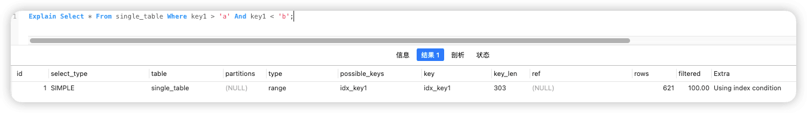

设计者为边界条件中包含的列都维护了一个key_len值。该值由3部分组成：

- 该列的实际数据最多占用的存储空间长度。对于固定长度类型的列来说，比方说对于INT类型的列来说，该列实际数据最多占用的存储空间长度就是4字节（当然，对于INT类型的列来说，不论存什么数据，实际数据占用的存储空间长度都是4字节)。对于使用变长类型的列来说，比方说对于使用 utf8 字符集，类型为 VARCHAR(100) 的列来说，该列的实际数据最多占用的存储空间长度就是在 utf8 宇符集中表示一个字符最多占用的字节数乘以该类型最多可以存储的字符数的积，也就是 3×100= 300字节。

- 如果该列可以存储 NULL值，则key_len值在该列的实际数据最多占用的存储空间长度的基础上再加1字节。
- 对于使用变长类型的列来说，都会有2字节的空间来存储该变列的实际数据占用的存储空间长度，key_len值还要在原先的基础上加2字节。

再分析一下上述查询中的key_len值是怎么计算出来的。

- key1列的类型是 VARCHAR(100），使用的字符集是utf8，所以该列的实际数据最多占用的存储空间长度就是 300 字节。
- key1列可以存储NULL 值，所以key_len值在 300 的基础上再加 1，也就是 301。
- key1列是变长类型的列，key_len值在301 的基础上再加2，也就是303。

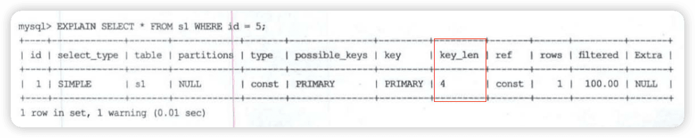


#### ref

当访问方法是 const、eq_ref、ref、ref_ or_null、unique_subquery、index_subquery 中的其中一个时，ref列展示的就是与索引列进行等值匹配的东西是啥，比如只是一个常数或者是某个列。

```mysql
mysql> Explain Select * From single_table Where key1 = 'a';
+----+-------------+--------------+------------+------+---------------+----------+---------+-------+------+----------+-------+
| id | select_type | table        | partitions | type | possible_keys | key      | key_len | ref   | rows | filtered | Extra |
+----+-------------+--------------+------------+------+---------------+----------+---------+-------+------+----------+-------+
|  1 | SIMPLE      | single_table | NULL       | ref  | idx_key1      | idx_key1 | 303     | const |    1 |   100.00 | NULL  |
+----+-------------+--------------+------------+------+---------------+----------+---------+-------+------+----------+-------+
1 row in set, 1 warning (0.00 sec)
```


```mysql
mysql> Explain Select * From single_table s1  Inner Join single_table2 s2 On s1.id = s2.id;
+----+-------------+-------+------------+--------+---------------+---------+---------+-----------------+------+----------+-------+
| id | select_type | table | partitions | type   | possible_keys | key     | key_len | ref             | rows | filtered | Extra |
+----+-------------+-------+------------+--------+---------------+---------+---------+-----------------+------+----------+-------+
|  1 | SIMPLE      | s1    | NULL       | ALL    | PRIMARY       | NULL    | NULL    | NULL            | 9987 |   100.00 | NULL  |
|  1 | SIMPLE      | s2    | NULL       | eq_ref | PRIMARY       | PRIMARY | 4       | xiaohaizi.s1.id |    1 |   100.00 | NULL  |
+----+-------------+-------+------------+--------+---------------+---------+---------+-----------------+------+----------+-------+
2 rows in set, 1 warning (0.01 sec)
```

与索引列进行等值匹配的对象是一个函数:

```mysql
mysql> Explain Select * From single_table s1  Inner Join single_table2 s2 On s2.key1 = Upper(s1.key1);
+----+-------------+-------+------------+------+---------------+----------+---------+------+------+----------+-----------------------+
| id | select_type | table | partitions | type | possible_keys | key      | key_len | ref  | rows | filtered | Extra                 |
+----+-------------+-------+------------+------+---------------+----------+---------+------+------+----------+-----------------------+
|  1 | SIMPLE      | s1    | NULL       | ALL  | NULL          | NULL     | NULL    | NULL | 9987 |   100.00 | NULL                  |
|  1 | SIMPLE      | s2    | NULL       | ref  | idx_key1      | idx_key1 | 303     | func | 2500 |   100.00 | Using index condition |
+----+-------------+-------+------------+------+---------------+----------+---------+------+------+----------+-----------------------+
2 rows in set, 1 warning (0.00 sec)
```

#### rows

在查询优化器决定使用全表扫描的方式对某个表执行查询时，执行计划的rows 列就代表该表的估计行数。如果使用索引来执行查询，执行计划的 rows列就代表预计扫描的索引记录行数。

#### filtered 🔖

条件过滤


#### Extra

- No tables used
- Impossible WHERE
- No matching min/max row
- Using index
- Using index condition
- Using where
- Using join buffer(Block Nested Loop)
- Using intersect(...)、Using union(...)、Using sort_union(...)
- Zero limit
- Using filesort
- Using temporary
- Start tmporary, End temporary
- LooseScan
- FirstMatch(tbl_name)

### 15.2 JSON格式的执行计划

之前EXPLAIN语句输出中缺少了一个衡量执行计划好坏的重要属性——**成本**。

在EXPLAIN单词和真正的查询语句中间加上`FORMAT=JSON`就可查看。

JSON格式的执行计划里包含该计划花费的成本。

```mysql
mysql> explain format=json select * from vendors\G;
*************************** 1. row ***************************
EXPLAIN: {
  "query_block": {
    "select_id": 1,
    "cost_info": {
      "query_cost": "1.60"
    },
    "table": {
      "table_name": "vendors",
      "access_type": "ALL",
      "rows_examined_per_scan": 6,
      "rows_produced_per_join": 6,
      "filtered": "100.00",
      "cost_info": {
        "read_cost": "1.00",
        "eval_cost": "0.60",
        "prefix_cost": "1.60",
        "data_read_per_join": "5K"
      },
      "used_columns": [
        "vend_id",
        "vend_name",
        "vend_address",
        "vend_city",
        "vend_state",
        "vend_zip",
        "vend_country"
      ]
    }
  }
}
1 row in set, 1 warning (0.00 sec)

ERROR:
No query specified
```


```mysql
Explain FORMAT=JSON Select * From single_table s1  Inner Join single_table2 s2 On s1.key1 = s2.key2 Where s1.common_field = 'a'\G;
```

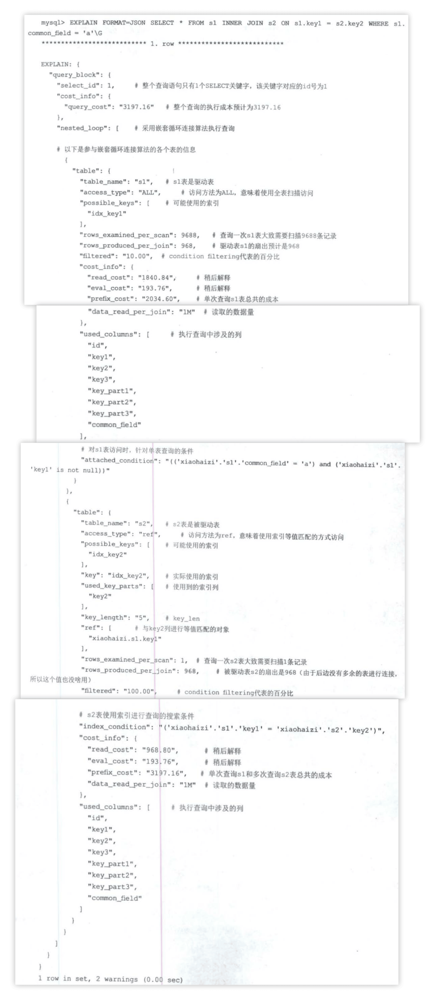

🔖


### 15.3  Extented Explain

查看与这个查询的执行计划有关的扩展信息

```mysql
show warnings\G;

*************************** 1. row ***************************
  Level: Note
   Code: 1003
Message: /* select#1 */ select `xiaohaizi`.`s1`.`id` AS `id`,`xiaohaizi`.`s1`.`key1` AS `key1`,`xiaohaizi`.`s1`.`key2` AS `key2`,`xiaohaizi`.`s1`.`key3` AS `key3`,`xiaohaizi`.`s1`.`key_part1` AS `key_part1`,`xiaohaizi`.`s1`.`key_part2` AS `key_part2`,`xiaohaizi`.`s1`.`key_part3` AS `key_part3`,`xiaohaizi`.`s1`.`common_field` AS `common_field`,`xiaohaizi`.`s2`.`id` AS `id`,`xiaohaizi`.`s2`.`key1` AS `key1`,`xiaohaizi`.`s2`.`key2` AS `key2`,`xiaohaizi`.`s2`.`key3` AS `key3`,`xiaohaizi`.`s2`.`key_part1` AS `key_part1`,`xiaohaizi`.`s2`.`key_part2` AS `key_part2`,`xiaohaizi`.`s2`.`key_part3` AS `key_part3`,`xiaohaizi`.`s2`.`common_field` AS `common_field` from `xiaohaizi`.`single_table` `s1` join `xiaohaizi`.`single_table2` `s2` where ((`xiaohaizi`.`s1`.`key1` = `xiaohaizi`.`s2`.`key3`) and (`xiaohaizi`.`s1`.`common_field` = 'a'))
1 row in set (0.00 sec)
```


## 16 神兵利器——optimizer trace的神奇功效

optimizer trace（优化器追踪）是MySQL提供的高级诊断功能，用于**详细记录优化器生成执行计划的完整决策过程**，包括：**如何解析查询、考虑哪些索引、计算各种执行路径的成本、最终选择哪个执行计划等**。它是分析慢查询原因、理解优化器行为（尤其是“基于成本的优化”逻辑）的核心工具。

当 MySQL 接收到一条 SQL 查询时，优化器会经历 “解析→重写→成本估算→计划选择” 等复杂步骤。默认情况下，我们只能看到最终的执行计划（通过 EXPLAIN），而 optimizer trace 可以输出优化器在每个步骤中的中间状态、候选计划、成本计算细节，帮助回答：

- 为什么优化器选择索引 A 而非索引 B？
- 为什么某个全表扫描没有被索引扫描替代？
- 子查询/连接顺序是如何确定的？

### 16.1 简介

MySQL5.6前，查询优化器就像一个黑盒子，我们只能通过Explain语句查看到优化器最终决定使用的执行计划，却无法知道它为什么做出这样的决策。

MySQL5.6后新增optimizer trace功能，让用户方便地**查看优化器生成执行计划的整个过程**。

```mysql
show variables like 'optimizer_trace';
+-----------------+--------------------------+
| Variable_name   | Value                    |
+-----------------+--------------------------+
| optimizer_trace | enabled=off,one_line=off |
+-----------------+--------------------------+
```


```mysql
mysql> Set optimizer_trace="enabled=on";

mysql> Set optimizer_trace="enabled=off";
```

开启后，就可以在表`information_schema.optimizer_trace`中查看完整的执行计划生成过程。这个表有四个字段：

- **QUERY**：输入的查询语句。
- **TRACE**：表示优化过程的JSON格式的文本。
- **MISSING_BYTES_BEYOND_MAX_MEM_SIZE**：：在执行计划的生成过程中可能会输出很多内容，如果超过某个限制，多余的文本将不会显示。这个字段则展示了被忽略的文本字节数。
- **INSUFFICIENT_PRIVILEGES**：表示是否有权限查看执行计划的生成过程，默认值是0，表示有权限查看执行计划的生成过程：只有某些特殊情况下，它的值才是1。

使用optimizer trace功能的完整步骤：

- 步骤1. 打开 optimizer trace 功能（默认情况下是关闭的）。

​	`SET optimizer_trace="enabled=on";`

- 步骤2. 输入自己的查询语句。

​	`SELECT...;`

- 步骤3.从 OPTIMIZER_TRACE 表中查看上一个查询的优化过程。

​	`SELECT * FROM information_schema.OPTIMIZER_TRACE\G;`

- 步骤4. 可能还要观察其他语句执行的优化过程；重复步骤2和步骤3。

- 步骤5. 当停止查看语句的优化过程时，把 optimizer trace 功能关闭。

​	`SET optimizer_trace="enabled=off";`

### 16.2 通过optimizer_trace分析查询优化器的具体工作过程

```mysql
Select * From single_table Where key1 > 'z' And key2 < 1000000 And key3 In('a', 'b', 'c') And common_field = 'abc';
```


```mysql
mysql> select * from information_schema.optimizer_trace\G;
*************************** 1. row ***************************
QUERY: Select * From s1 Where key1 > 'z' And key2 < 1000000 And key3 In('a', 'b', 'c') And common_field = 'abc'

# 优化的具体过程
TRACE: {
  "steps": [
    {
      "join_preparation": {		# prepare阶段
        "select#": 1,
        "steps": [
          {
            "IN_uses_bisection": true
          },
          {
            "expanded_query": "/* select#1 */ select `s1`.`id` AS `id`,`s1`.`key1` AS `key1`,`s1`.`key2` AS `key2`,`s1`.`key3` AS `key3`,`s1`.`key_part1` AS `key_part1`,`s1`.`key_part2` AS `key_part2`,`s1`.`key_part3` AS `key_part3`,`s1`.`common_field` AS `common_field` from `s1` where ((`s1`.`key1` > 'z') and (`s1`.`key2` < 1000000) and (`s1`.`key3` in ('a','b','c')) and (`s1`.`common_field` = 'abc'))"
          }
        ]
      }
    },
    {
      "join_optimization": {		# optimize阶段
        "select#": 1,
        "steps": [
          {
            "condition_processing": {		# 处理搜索条件
              "condition": "WHERE",
          		# 原始搜索条件
              "original_condition": "((`s1`.`key1` > 'z') and (`s1`.`key2` < 1000000) and (`s1`.`key3` in ('a','b','c')) and (`s1`.`common_field` = 'abc'))",
              "steps": [
                {
                	# 等值传递转换
                  "transformation": "equality_propagation",
                  "resulting_condition": "((`s1`.`key1` > 'z') and (`s1`.`key2` < 1000000) and (`s1`.`key3` in ('a','b','c')) and (`s1`.`common_field` = 'abc'))"
                },
                {
                	# 常量传递转换
                  "transformation": "constant_propagation",
                  "resulting_condition": "((`s1`.`key1` > 'z') and (`s1`.`key2` < 1000000) and (`s1`.`key3` in ('a','b','c')) and (`s1`.`common_field` = 'abc'))"
                },
                {
                	# 去除没用的条件
                  "transformation": "trivial_condition_removal",
                  "resulting_condition": "((`s1`.`key1` > 'z') and (`s1`.`key2` < 1000000) and (`s1`.`key3` in ('a','b','c')) and (`s1`.`common_field` = 'abc'))"
                }
              ]
            }
          },
          {
          	# 替换虚拟生成列
            "substitute_generated_columns": {
            }
          },
          {
          	# 表的依赖信息
            "table_dependencies": [
              {
                "table": "`s1`",
                "row_may_be_null": false,
                "map_bit": 0,
                "depends_on_map_bits": [
                ]
              }
            ]
          },
          {
            "ref_optimizer_key_uses": [
            ]
          },
          {
          	# 预估不同单表访问方法的访问成本
            "rows_estimation": [
              {
                "table": "`s1`",
                "range_analysis": {
                  "table_scan": {		# 全表扫描的行数以及成本
                    "rows": 1,
                    "cost": 2.45
                  },
              		# 分析可能使用的索引
                  "potential_range_indexes": [
                    {
                      "index": "PRIMARY",  # 主键不可用
                      "usable": false,
                      "cause": "not_applicable"
                    },
                    {
                      "index": "uk_key2",		# uk_key2可能被使用
                      "usable": true,
                      "key_parts": [
                        "key2"
                      ]
                    },
                    {
                      "index": "idx_key1",	# idx_key1可能被使用
                      "usable": true,
                      "key_parts": [
                        "key1",
                        "id"
                      ]
                    },
                    {
                      "index": "idx_key3", 	# idx_key3可能被使用
                      "usable": true,
                      "key_parts": [
                        "key3",
                        "id"
                      ]
                    },
                    {
                      "index": "idx_key_part",	# idx_key_part不可用
                      "usable": false,
                      "cause": "not_applicable"
                    }
                  ],
                  "setup_range_conditions": [
                  ],
                  "group_index_range": {
                    "chosen": false,
                    "cause": "not_group_by_or_distinct"
                  },
                  "skip_scan_range": {
                    "potential_skip_scan_indexes": [
                      {
                        "index": "uk_key2",
                        "usable": false,
                        "cause": "query_references_nonkey_column"
                      },
                      {
                        "index": "idx_key1",
                        "usable": false,
                        "cause": "query_references_nonkey_column"
                      },
                      {
                        "index": "idx_key3",
                        "usable": false,
                        "cause": "query_references_nonkey_column"
                      }
                    ]
                  },
              		# 分析各种可能使用的索引的成本
                  "analyzing_range_alternatives": {
                    "range_scan_alternatives": [
                      {
                      	# 使用uk_key2的成本分析
                        "index": "uk_key2",
                      	# 使用uk_key2的扫描区间
                        "ranges": [
                          "NULL < key2 < 1000000"
                        ],
                        "index_dives_for_eq_ranges": true,	# 是否使用index dive
                        "rowid_ordered": false,		# 使用该索引获取的记录是否按照主键排序
                        "using_mrr": false,		# 是否使用mrr
                        "index_only": false,	# 是否是覆盖索引
                        "in_memory": 1,		# 使用该索引获取的记录条数
                        "rows": 1,			# 使用该索引的成本
                        "cost": 0.61,		# 使用该索引的成本
                        "chosen": true	# 是否选择该索引
                      },
                      {
                        "index": "idx_key1",
                        "ranges": [
                          "'z' < key1"
                        ],
                        "index_dives_for_eq_ranges": true,
                        "rowid_ordered": false,
                        "using_mrr": false,
                        "index_only": false,
                        "in_memory": 1,
                        "rows": 1,
                        "cost": 0.61,
                        "chosen": false,
                        "cause": "cost"
                      },
                      {
                        "index": "idx_key3",
                        "ranges": [
                          "key3 = 'a'",
                          "key3 = 'b'",
                          "key3 = 'c'"
                        ],
                        "index_dives_for_eq_ranges": true,
                        "rowid_ordered": false,
                        "using_mrr": false,
                        "index_only": false,
                        "in_memory": 1,
                        "rows": 3,
                        "cost": 1.81,
                        "chosen": false,
                        "cause": "cost"
                      }
                    ],
              			# 分析使用索引合并的成本
                    "analyzing_roworder_intersect": {
                      "usable": false,
                      "cause": "too_few_roworder_scans"
                    }
                  },
              		# 对于上述单表查询s1最优的访问方法
                  "chosen_range_access_summary": {
                    "range_access_plan": {
                      "type": "range_scan",
                      "index": "uk_key2",
                      "rows": 1,
                      "ranges": [
                        "NULL < key2 < 1000000"
                      ]
                    },
                    "rows_for_plan": 1,
                    "cost_for_plan": 0.61,
                    "chosen": true
                  }
                }
              }
            ]
          },
          {
          	# 分析各种可能的执行计划
            "considered_execution_plans": [
              {
                "plan_prefix": [
                ],
                "table": "`s1`",
                "best_access_path": {
                  "considered_access_paths": [
                    {
                      "rows_to_scan": 1,
                      "access_type": "range",
                      "range_details": {
                        "used_index": "uk_key2"
                      },
                      "resulting_rows": 1,
                      "cost": 0.71,
                      "chosen": true
                    }
                  ]
                },
                "condition_filtering_pct": 100,
                "rows_for_plan": 1,
                "cost_for_plan": 0.71,
                "chosen": true
              }
            ]
          },
          {
          	# 尝试给查询添加一些其他的查询条件
            "attaching_conditions_to_tables": {
              "original_condition": "((`s1`.`key1` > 'z') and (`s1`.`key2` < 1000000) and (`s1`.`key3` in ('a','b','c')) and (`s1`.`common_field` = 'abc'))",
              "attached_conditions_computation": [
              ],
              "attached_conditions_summary": [
                {
                  "table": "`s1`",
                  "attached": "((`s1`.`key1` > 'z') and (`s1`.`key2` < 1000000) and (`s1`.`key3` in ('a','b','c')) and (`s1`.`common_field` = 'abc'))"
                }
              ]
            }
          },
          {
            "finalizing_table_conditions": [
              {
                "table": "`s1`",
                "original_table_condition": "((`s1`.`key1` > 'z') and (`s1`.`key2` < 1000000) and (`s1`.`key3` in ('a','b','c')) and (`s1`.`common_field` = 'abc'))",
                "final_table_condition   ": "((`s1`.`key1` > 'z') and (`s1`.`key2` < 1000000) and (`s1`.`key3` in ('a','b','c')) and (`s1`.`common_field` = 'abc'))"
              }
            ]
          },
          {
          	# 在稍微改进一下执行计划
            "refine_plan": [
              {
                "table": "`s1`",
                "pushed_index_condition": "(`s1`.`key2` < 1000000)",
                "table_condition_attached": "((`s1`.`key1` > 'z') and (`s1`.`key3` in ('a','b','c')) and (`s1`.`common_field` = 'abc'))"
              }
            ]
          }
        ]
      }
    },
    {
      "join_execution": {
        "select#": 1,
        "steps": [
        ]
      }
    }
  ]
}

# 因优化过程文本太多而丢弃的文本字节大小，0表示并没有丢弃
MISSING_BYTES_BEYOND_MAX_MEM_SIZE: 0
          INSUFFICIENT_PRIVILEGES: 0
1 row in set (0.01 sec)
```


优化过程大致分为3个阶段：

- prepare阶段

- optimize阶段。"rows_estimation"

- execute阶段

基于成本的优化主要集中在optimize阶段。

对于单表查询来说，主要关注的是optimize阶段的`rows_estimation`过程。

这个过程深入分析了针对单表查询的各种执行方案的成本;

对于多表连接查询来说，我们更多关注的是`considered_execution_plans`过程。这个过程中会写明各种**不同的表连接顺序所对应的成本**。反正查询优化器最终会选择成本最低的方案来作为最终的执行计划，即我们使用EXPLAIN语句所展现出的那种方案。

如果有对使用EXPLAIN语句展示出的针对某个查询的执行计划很不理解，可以尝试使用optimizer trace功能详细了解每一种执行方案对应的成本。相信这个功能能让大家更深入地了解MySQL 查询优化器。

> `rows_estimation`过程分析的其实都是range访问方法对应的成本，并没有涉及ref访问方法。对于ref访问方法来说，在计算回表操作的I/O成本时存在天花板(第12章中有提及)。
>
> ref访问方法所对应的成本是被单独计算的，计算过程体现在`considered_execution_plans->best_access_path->considered_access_paths`中，本例中没有使用ref访问方法执行查询的场景，在optimizer trace 的输出中并未体现。


## 17 调节磁盘和CPU的矛盾——InnoDB的Buffer Pool

### 17.1 缓存的重要性

对于使用InnoDB存储引擎的表来说，无论是用于存储用户数据的索引(包括聚簇索引和二级索引)，还是各种系统数据，都是以页的形式存放在表空间中。

所谓的==表空间==，只不过是InnoDB对一个或几个实际文件的抽象。也就是说，我们的数据说到底还是存储在磁盘上。

磁盘的速度慢得“跟乌龟一样”，怎么能配得上“快如风，疾如电”的CPU呢?所以InnoDB存储引擎在处理客户端的请求时，如果需要访问某个页的数据，就会把完整的页中的数据全部加载到内存中。

也就是说，即使只需要访问一个页的一条记录，也需要先把整个页的数据加载到内存中。将整个页加载到内存中后就可以进行读写访问了，而且在读写访问之后并不着急把该页对应的内存空间释放掉，而是将其缓存起来，这样将来有请求再次访问该页面时，就可以省下磁盘I/O的开销了。

**Buffer Pool（缓存池）**是InnoDB向操作系统申请的一段==连续==的内存空间。用于缓存磁盘中的页。

### 17.2 Buffer Pool

`innodb_buffer_pool_size`， 默认128MB，最小5MB。 

#### 1️⃣内部组成

**==缓冲页==**：Buffer Pool中的页。为了区别磁盘中的页面。

每个缓冲页都有一些控制信息，叫作**==控制块==**。这些信息包括该页所属的==表空间编号、页号、缓冲页在Buffer Pool中的地址、链表节点信息==等。每个控制块占用的内存大小是相同的。

控制块和缓冲页一一对应，并且控制块在缓冲池的前面。

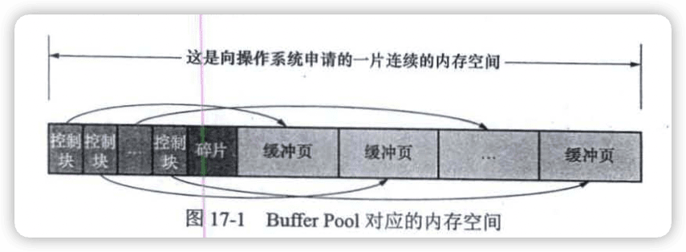

剩余不够一对控制块和缓冲页的内存空间叫做==碎片==。

> 注意：在DEBUG模式下，每个控制块大约占用缓冲页大小的5%（非 DEBUG 模式下会更小一点）。在MySQL 5.7.22版本的DEBUG 模式下，每个控制块占用的大小是808字节（单个页大小是16k，`808/(16*1024) = 5%`）。
>
> 而设置的 `innodb_buffer_pool_size` 并不包含这部分控制块占用的内存空间大小。也就是说 InnoDB 在为 Buffer Pool 向操作系统申请连续的内存空间时，这片连续的内存空间会比 innodb_buffer_pool_size 的值大5%左右。
>

#### 2️⃣free链表的管理

启动MySQL服务器的时候，需要完成 Buffer Pool 的初始化过程。就是先向操作系统申请 Buffer Pool 的内存空间，然后把它划分成若干对控制块和缓冲页。但是此时并没有真实的磁盘页被缓存到 Buffer Pool 中（因为还没有用到），之后随着程序的运行，会不断地有磁盘上的页被缓存到 Buffer Pool 中。

> 怎么区分Buffer Pool中哪些缓冲页是空闲的？

所有空闲的缓冲页对应的控制块作为一个节点放到一个链表中，**==free链表==**（空闲链表）。

假设Buffer Pool中可容纳的缓冲页数量为n，free链表的效果图：

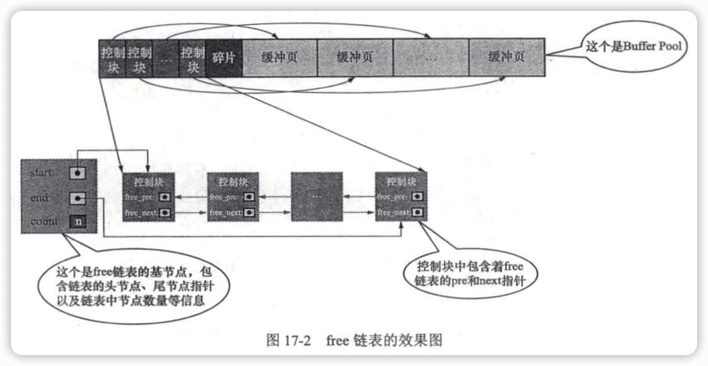

**注**：**链表的基节点**占用的内存空间是单独的，不在Buffer Pool内。

> ”从free链表中取一个缓冲页“相当于”从链表中去一个缓冲页对应的控制块“。

#### 3️⃣缓冲页的哈希处理

> 怎么知道某页在不在Buffer Pool中？

**表空间号+页号** 定位一个页，作为一个key，缓冲页控制块就是对应的value。哈希表。

#### 4️⃣flush链表的管理

如果修改了缓冲页中的数据，就会和磁盘上的页数据不一致，这样的缓冲页叫作**==脏页==（dirty page）**。

隔一段时间统一把脏页中刷新到磁盘上。为了管理这些脏页，另外创建一个存储脏页的链表，**==flush链表==**。凡是被修改过的缓冲页对应的控制块都会作为一个节点加入flush链表。


> 某个缓冲页对应的控制块不可能既是free链表的节点，也是flush链表的节点。

#### 5️⃣LRU链表的管理

##### 1.缓冲区不够的窘境

> 缓存页不够用时，移除那些缓冲页呢？


##### 2.简单的LRU链表

淘汰最近很少使用的

LRU（Least Recently Used）

当需要访问某个页时，可以按照下面的方式处理LRU链表：

- 如果该页不在Buffer Pool中，在把该页从磁盘加载到Buffer Pool中的缓冲页时，就把该缓冲页对应的控制块作为节点塞到LRU链表的头部；
- 如果该页已经被加载到Buffer Pool中，则直接把该页对应的控制块移动到 LRU链表的头部。

也就是说，只要使用到某个缓冲页，就把该缓冲页调整到LRU 链表的头部，这样**LRU链表尾部就是最近最少使用的缓冲页**了。所以，当Buffer Pool中的空闲缓冲页使用完时，到LRU 链表的尾部找些缓冲页淘汰掉就OK了。

##### 3.划分区域的LRU链表

问题：

- 情况1：InnoDB有==预读 (read ahead)==功能。之前提到只有当用到某个页时，才会将其从磁盘加载到Buffer Pool 中，用不到则不加载。所谓预读，就是InnoDB认为执行当前的请求时，可能会在后面读取某些页面，于是就预先把这些页面加载到 Buffer Pool 中。根据**触发方式**的不同，预读又可以细分为下面两种。
  - ==线性预读==：设计InnoDB 的大叔提供了一个系统变量`innodb_read_ahead_threshold`,如果顺序访问的某个区 (extent）的页面超过这个系统变量的值，就会触发一次异步读取下一个区中全部的页面到Buffer Pool 中的请求。注意异步读取意味着从磁盘中加载这些被预读的页面时，并不会影响到当前工作线程的正常执行。`innodb_read_ahead_threshold`系统变量的值默认是 56。
  - ==随机预读==：如果某个区的13个连续的页面都被加载到了Buffer Pool中，无论这些页面是不是顺序读取的，都会触发一次异步读取本区中所有其他页面到 Buffer Pool中的请求。InnoDB设计者同时提供了`innodb_random_read_ahead`系统变量，默认值为OFF，也就意味着InnoDB 并不会默认开启随机预读的功能。

预读本来是个好事儿，如果预读到 Buffer Pool中的页被成功地使用到，那就可以极大地提高语句执行的效率。可是如果**用不到**呢？这些预读的页都会放到LRU链表的头部。但是，如果此时 Buffer Pool的容量不太大，而且很多预读的页面都没有用到的话，就会导致处于LRU链表尾部的一些缓冲页会很快被淘汰掉，从而大大降低Buffer Pool命中率。

- 情况 2：有的小伙伴可能会写一些需要进行全表扫描的语句（比如在没有建立合适的索引或者压根儿没有 WHERE 子句的查询时）。

全表扫描意味着将访问该表的聚簇索引的所有叶子节点对应的页（当然，扫描叶子节点时，首先需要从 B+树中定位到第一个叶子节点的第一条记录。这个过程还得访问一些内节点)！如果需要访问的页面特别多，而**Buffer Pool又不能全部容纳它们**的话，这就意味着需要将其他语句在执行过程中用到的页面“排挤”出Buffer Pool，之后在其他语句重新执行时，又需要重新将需要用到的页从磁盘加载到 Buffer Pool 中（这就像我在一个饭店吃着好好的，忽然来了一群人把我从饭店中赶了出去，等他们吃完之后我又得重新点菜吃）。


由于对很大的表执行全表扫描操作可能要把Buffer Pool中的缓冲页换一次，这会严重影响到其他查询对Bufter Pool的使用，从而降低了BufferPool命中率。

总的来说，可能降低Buffer Pool命中率的两种情况：

- 加载到 Buffer Pool 中的页不一定被用到；
- 如果有非常多的使用频率偏低的页被同时加载到 Buffer Pool 中，则可能会把那些使用频率非常高的页从 Buffer Pool 中淘汰掉。

因为这两种情况的存在，IonoDB设计者把这个 LRU 链表按照一定比例分成两截：

- 一部分存储使用频率非常高的缓冲页；这一部分链表也称为**热数据**，或者称为young区域；

- 另一部分存储使用频率不是很高的缓冲页；这一部分链表也称为**冷数据**，或者称为old区域。

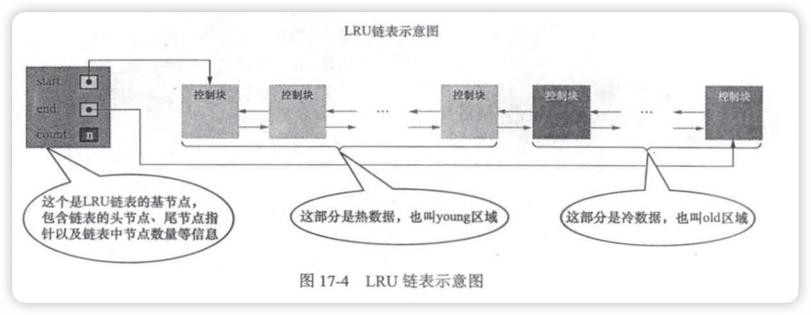

`innodb_old_blocks_pct` old区域在LRU链表所占的比例，默认37。


通过对LRU链表的分区，可以针对前文提到的两种可能降低Buffer Pool命中率的情况进行优化：

- 针对预读的页面可能不进行后续访问的优化。

  当磁盘上的某个页面在初次加载到 Buffer Pool 中的某个缓冲页时，该缓冲页对应的控制块会放到old 区域的头部。这样一来，预读到 Buffer Pool 却不进行后续访问的页面就会被逐渐从old 区域逐出，而不会影响 young 区域中使用比较频繁的缓冲页。

- 针对全表扫描时，短时间内访问大量使用频率非常低的页面的优化。

  🔖

`innodb_old_blocks_time`

总结，用不到的预读页面以及全表扫描的页面都只会放到old区域，而不影响young区域中的缓冲页。

##### 4.更进一步优化LRU链表

🔖

#### 6️⃣其他一些链表

为了更好地管理Buffer Pool而引入了各种链表或其他数据结构，比如用于管理解压页的unzip LRU链表，用于管理压缩页的zip clean链表等等。

#### 7️⃣刷新脏页到磁盘

后台有**专门的线程**负责**每隔一段时间就把脏页刷新到磁盘**，这样可以不影响用户线程处理正常的请求。刷新方式主要有下面两种。

- 从LRU链表的冷数据中刷新一部分页面到磁盘。

  后台线程会定时从LRU链表尾部开始扫描一些页面，扫描的页面数量可以通过系统变量`innodb_lru_scan_depth`来指定。如果在LR 链表中发现脏页，则把它们刷新到磁盘。这种刷新页面的方式称为 **BUF_FLUSH_LRU**。

- 从fush链表中刷新一部分页面到磁盘。

  后台线程也会定时从flush 链表中刷新一部分页面到磁盘，刷新的速率取决于当时系统是否繁忙。这种刷新页面的方式称为 **BUF_FLUSH_LIST**。

#### 8️⃣多个Buffer Pool实例

在Buffer Pool特别大并且多线程并发访问量（各种链表需要加锁处理）特别高的情况下，单一的Buffer Pool可能会影响请求的处理速度。可以把大Buffer Pool拆分成若干个小的Buffer Pool，每个Buffer Pool都称为一个实例。

它们都是独立的——独立地申请内存空间、独立地管理各种链表……在多线程并发访问时并不会相互影响，从而提高了并发处理能力。

`innodb_buffer_pool_instantces`


> 每个实例占用内存空间 = `innodb_buffer_pool_size` / `innodb_buffer_pool_instantces`

> 规定，当`innodb_buffer_pool_size`小于1G时，`innodb_buffer_pool_instantces`默认修改为1，也就是不能设置多个实例。

#### 9️⃣innodb_buffer_pool_chunk_size

MysQL 5.7.5之后，支持了**在服务器运行过程中调整 Buffer Pool 大小的功能**。

但每次重新调整 Buffer Pool 的大小时，都需要重新向操作系统申请一块连续的内存空间，然后将旧Buffer Pool中的内容复制到这一块新空间；这是极其耗时的。

所以，MySQL设计者决定不再一次性为某个Buffer Pool实例向操作系统申请一大片连续的内存空间，而是以一个chunk 为单位向操作系统申请空间。也就是说，一个Buffer Pool实例其实是由若干个chunk组成的。一个chunk就代表一片连续的内存空间，里面包含了若干缓冲页与其对应的控制块。

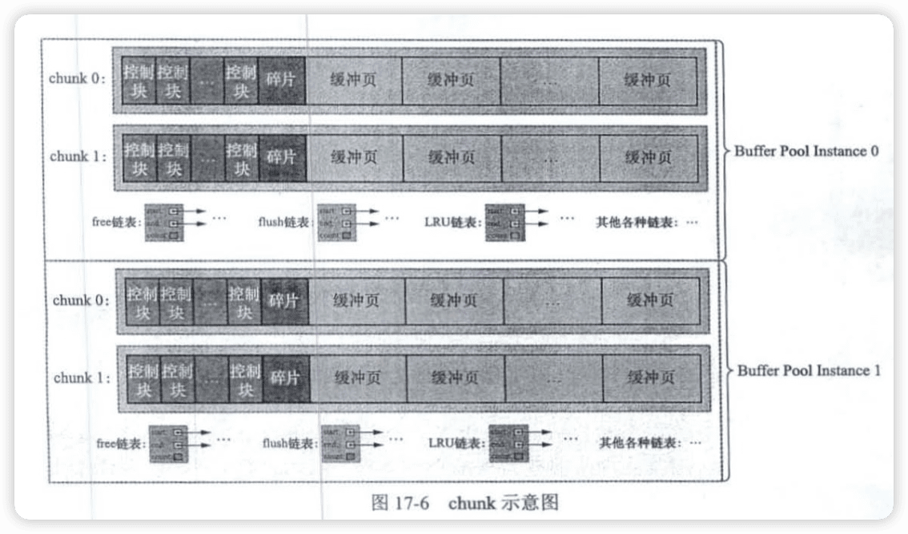

#### 1️⃣0️⃣配置Buffer Pool时的注意事项

- `innodb_buffer_pool_size`必须是`innodb_buffer_pool_chunk_size` x `innodb_buffer_pool_instances`的倍数（主要是想保证每一个Buffer Pool实例中包含的chunk数量相同）。

- 在服务器启动时，如果`innodb_buffer_pool_chunk_size` x `innodb_buffer_pool_instances`的值己经大于 `innodb_buffer_pool_size`的值，那么`innodb_buffer_pool_chunk_size`的值会被服务器自动设置为`innodb_buffer_pool_size` / `innodb_buffer_pool_instances`的值。

#### 1️⃣1️⃣查看Buffer Pool的状态信息

```mysql
mysql> show engine innodb status\G;
...
----------------------
BUFFER POOL AND MEMORY
----------------------
Total large memory allocated 0
Dictionary memory allocated 524562
Buffer pool size   8191
Free buffers       5208
Database pages     2876
Old database pages 1041
Modified db pages  0
Pending reads      0
Pending writes: LRU 0, flush list 0, single page 0
Pages made young 2494, not young 74846
0.00 youngs/s, 0.00 non-youngs/s
Pages read 2315, created 942, written 3692
0.00 reads/s, 0.00 creates/s, 0.00 writes/s
No buffer pool page gets since the last printout
Pages read ahead 0.00/s, evicted without access 0.00/s, Random read ahead 0.00/s
LRU len: 2876, unzip_LRU len: 0
I/O sum[0]:cur[0], unzip sum[0]:cur[0]
--------------
...
```

- **Total memory allocated** ： 代表Buffer Pool向操作系统申请的连续内存空间大小，包括全部控制块、缓冲页，以及碎片的大小。
- **Dictionary memory allocated** ：为数据字典信息分配的内存空间大小。注意，这个内存空间和 Bufer Pool 没有关系，不包含在 Total memory allocated 中。
- **Bufier pool size**：代表该 Buffer Pool 可以容纳多少缓冲页。注意，单位是页！

- **Free buffers**：代表当前Buffer Pool还有多少空闲缓冲页，也就是free链表中还有多少个节点。
- **Database pages**：LRU链表中页的数量，它包含young和old两个区域的节点数量。
- **Old database pages** ：代表LRU链表old 区域的节点数量。
- **Modified db pages** ：代表脏页数量，也就是fush链表中节点的数量。
- **Pending reads**：等待从磁盘加载到Buffer Pool中的页面数量。
- Pending writes LRU：即将从LRU链表中刷新到磁盘中的页面数量。
- Pending writes flush list ：即将从fush 链表中刷新到磁盛中的页面数量。
- Pending writes single page：即将以单个页面的形式刷新到磁盘中的页面数量。
- **Pages made young**：代表LRU链表中曾经从old 区域移动到young 区域头部的节点数量。这里需要注意，一个节点每次只有从 old 区域移动到young 区域头部时才会将 Pages made young 的值加1。也就是说，如果该节点本来就在young 区域，由于它符合在young 区域 1/4 后面的要求，下一次访问这个页面时也会将它移动到 young 区域头部，但这个过程并不会导致 Pages made young 的值加 1。

- **Page made not young** ： 在将 innodb old blocks time 的值设置为大于。时，首次访问或者后续访问某个处于 old 区域的节点时，由于不符合时间间隔的限制而不能将其移动到 young 区域头部中，Page made not young 的值会加 1。

  这里需要注意，对于处于 young 区域的节点，如果因为它在 young 区域的前 1/4 处而没有被移动到 young 区域头部，Page made not young 的值不会加1。

- **youngs/s**：代表每秒从old 区域移动到 young 区域头部的节点数量。

- **non-youngs/s**：代表每秒由于不满足时间限制而不能从 old 区域移动到 young 区域头部的节点数量。

- **Pages read、created、 written**：代表读取、创建、写入了多少页，后边跟着读取、创建、写入的速率。

- Buffer pool hit rate：表示在过去某段时间内，平均访问 1000 次页面时，该页面有多少次已经被缓存到 Buffer Pool中。

- young-making rate：表示在过去某段时间内，平均访问1000 次页面时，有多少次访问使页面移动到 young 区域的头部。

  需要注意的一点是，这里统计的将页面移动到 young 区域的头部次数不仅仅包含从old区城移动到 young 区城头部的次数，还包含从young 区域移动到young 区域头部的次数（访问某个 young 区域的节点时，只要该节点在 young 区城的 1/4 处后面，就会把它移动到 young 区域的头部）。

- not (young-making rate)：表示在过去某段时间内，平均访问 1000 次页面时，有多少次访问没有使页面移动到 young 区域的头部。

  需要注意的一点是，这里统计的没有将页面移动到 young 区域的头部次数不仅仅包含因设置了 ianodb old blocks time 系统变量而导致访问了old 区域中的节点，但没把它们移动到 young 区域的次数：还包含因为该节点在 young 区域的前 1/4 处而没有被移动到young 区域头部的次数。

- **LRU len** ：代表LRU 链表中节点的数量。
- **unzip LRU**： 代表 unzip LRU 链表中节点的数量（由于我们没有具体唠叨过这个链表，现在可以忽略它的值)。
- **I/O sum**：最近 50s 读取磁盘页的总数。
- **I/O cur** ：现在正在读取的磁盘页数量。
- **I/O unzip sum**：最近 50s 解压的页面数量。
- **I/O unzip cur** ：正在解压的页面数量。


### 17.3 总结

磁盘太慢，用内存作为缓冲区很有必要。

Buffer Pool 本质上是IonoDB 向操作系统申请的一段连续的内在空间。可以通过 `innodb_butfer_pool_size` 来调整它的大小。

Bufer Pool向操作系统申请的连续内存空间由==控制块和缓冲页==组成，每个控制块和缓存页都是一一对应的。在填充了足够多的控制块和缓冲页的组合后，Buffer Pool 中剩余的空间可能不足以填充一组控制块和缓冲页，从而导致这部分空间无法使用。这部分空间也称为==碎片==。

InnoDB 使用了许多链表来管理 Buffer Pool.

在==free链表==中，每一个节点都代表一个空闲的缓冲页，在将磁盘中的页加载到 Buffer Pool中时，会从free 链表中寻找空闲的缓冲页。

为了快速定位某个页是否被加载到 Buffer Pool 中，可使用==表空间号＋页号==作为key，缓冲页控制块的地址作为 value 的形式来建立哈希表。

在Buffer Pool 中，被修改的页称为==脏页==。脏页并不是立即刷新的，而是加入到==fush链表==中，待之后的某个时刻再刷新到磁盘中。

==LRU链表==分为 ==young区域==和==old区域==，可以通过 `innodb_old_blocks_pct`来调节old 区域所占的比例。首次从磁盘加载到 Buffer Pool中的页会放到old 区域的头部，在`innodb_old_blocks_time` 间隔时间内访问该页时，不会把它移动到 young区域头部。在Buffor Pool 中没有可用的空闲缓冲页时，会首先淘汰掉 old 区域中的一些页。

可以通过指定 `innodb_buffer_pool_instances` 来控制 Buffer Pool 实例的个数。每个ButferPool 实例都有各自独立的链表，互不干扰。

自 MysQL 5.7.5 版本之后，可以在服务器运行过程中调整 Buffer Pool 的大小。每个 BufferPool 实例由若干个chunk 组成，每个chunk 的大小可以在服务器启动时通过启动选项调整。

可以用下面的命令来查看 Buffer Pool 的状态信息： `SHOW ENGINE INNODB STATUS\G;`


## 18 事务简介

### 18.1 事务的起源

大部分程序员的任务就是==把现实世界的业务场景映射到数据库世界中==。

```mysql
Create Table account (
	id Int Not Null Auto_Increment Comment '自增id',
	name Varchar(100) Comment '客户名称',
	balance Int Comment '余额',
	Primary Key (id)
) Engine=InnoDB Charset=utf8;


insert into account Values(1, '狗哥', 11), (2, '猫爷', 2);
```

#### 原子性（Atomicity）

在现实世界中，转账操作是一个不可分割的操作。也就是说，要么压根儿就没转，要么转账成功；不能存在中间的状态，也就是转了一半的这种情况。

设计数据库的大权把这种 “**要么全做，要么全不做**”的规则称为**==原子性==**。但是，现实世界中一个不可分割的操作却可能对应着数据库世界中若千条不同的操作，**数据库中的一条操作也可能被分解成若干个步骤**（比如先修改缓冲页，之后再刷新到磁盘等）。最要命的是，在任何一个可能的时间点都可能发生意想不到的错误(<u>可能是数据库本身的错误，也可能是操作系统错误，甚至还可能是直接断电之类的意外</u>）而使操作执行不下去。为了保证数据库世界中某些操作的原子性，设计数据库的大叔需要花费一些心思来保证：**==如果在执行操作的过程中发生了错误，就把己经执行的操作恢复成没执行之前的样子==**。

#### 隔离性（Isolation）

在现实世界中，两次状态转换应该是互不影响的。比如，狗哥向猫爷同时进行了两次金额为5元的转账（假设可以在两个ATM机上同时操作）。那么最后狗哥的账户里肯定会少10元，而猫爷的账户里肯定多了10元。但是到对应的数据库世界中，事情又变得复杂了一些。

为了简化问题，我们粗略地假设狗哥向猫爷转账5元的过程是由下面这几个步骤组成的。

1. 读取狗哥账户的余额到变量A中；简写为 read(A)。
1. 将狗哥账户的余额减去转账金额：简写为 A=A-5。
1. 将狗哥账户修改过的余额写到磁盘中：简写为 write(A)。

1. 读取猫爷账户的余额到变量B：简写为 read(B)。
2. 将猫爷账户的余额加上转账金额：简写为B=B+5。
3. 将猫爷账户修改过的余额写到磁盘中：简写为 write(B)。

我们将狗哥向猫爷同时进行的两次转账操作分别称为T1和T2。在现实世界中T1 和T2应该是没有关系的，可以先执行完 T1，再执行 T2；或者先执行完 T2，再执行T1。对应的数据库操作为：

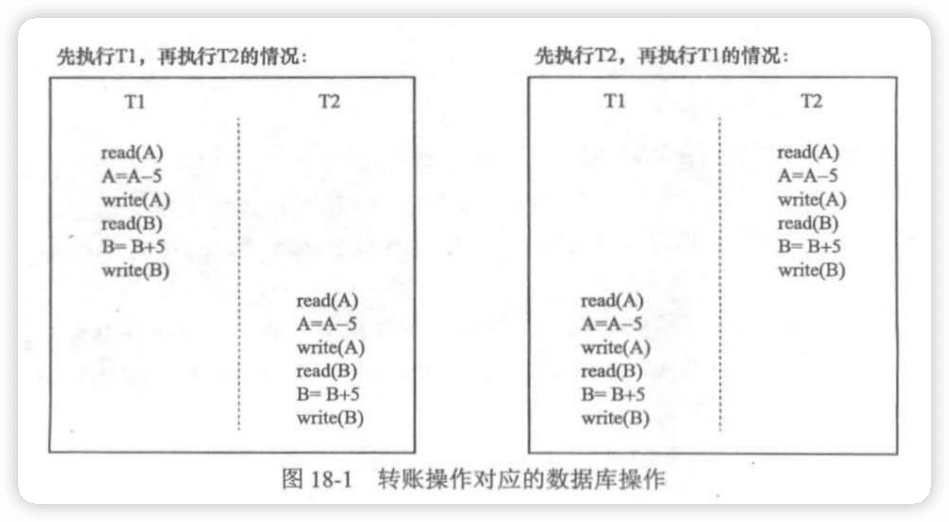

真实的数据库中，T1和T2的操作可能交替执行：

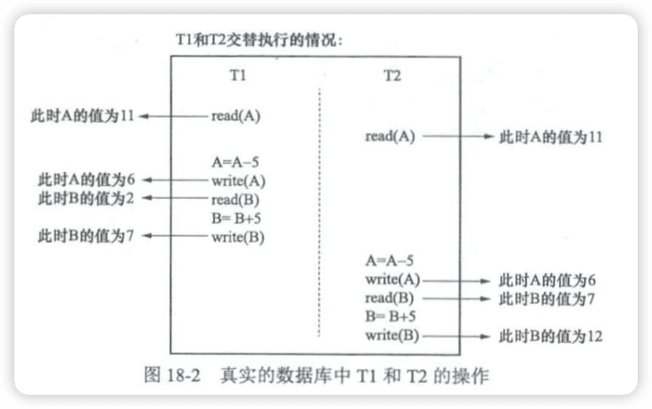

如果按照图18-2中的执行顺序来进行两次转账，最终狗哥的账户里还剩6元钱，相当于只扣了5元钱，但是猫爷的账户里却成了12元钱，相当于多了10元钱。这样一来，银行岂不是要亏死了？

所以，对于现实世界中状态转换对应的某些数据库操作来说，不仅要保证这些操作以原子性的方式执行完成，而且要**保证其他的状态转换不会影响到本次状态转换**，这个规则称为**==隔离性==**。这时，设计数据库的大叔就需要采取一些措施，让访问相同数据（上例中的A账户和B账户）的不同状态转换（上例中的T1和T2）对应的**数据库操作的执行顺序**有一定规律。

#### 一致性（Consistency）

我们生活的**现实世界中在在形形色色的==约束==**，比如<u>身份证号不能重复、性别只能是男或者女、高考的分数只能在0~750之间（国内某些省份）、人民币的最大面值只能是 100（现在是2020年）、红绿灯只有了种颜色、房价不能为负的、学生要听老师话；</u>等等等等。==只有符合这些约束的数据才是有效的==。比如，有个小孩儿跟你说他的高考成绩是 1000 分，你一听就知道他在胡扯。

数据库世界只是现实世界的一个映射，现实世界中存在的约束当然也要在数据库世界中有所体现。如果**数据库中的数据全部符合现实世界中的约束**，就说这些数据就是==一致==的，或者说符合一致性的。

<u>如何保证数据库中数据的一致性呢（就是符合所有现实世界的约束）？</u>这其实是靠两方面的努力。

- **数据库本身**能为我们解决一部分一致性需求（就是数据库自身可以保证现实世界的一部分约束永远有效）。

MySQL数据库可以为表建立==主键、唯一索引、外键==，还可以声明某个列为==NOT NULL==来拒绝NULL值的插入。

MySQL还支持使用==CHECK语法==来自定义约束，但实际上并没有用。还可以通过定义触发器的方式来自定义一些约束条件，以保证数据中的数据的一致性。

- 更多的一致性需求需要靠写**业务代码**的程序员自己保证。

**为了建立现实世界和数据库世界的对应关系，理论上应该把现实世界中的近有约束都反映到数据库世界中**。但是很不幸，在更改数据库数据时进行**一致性检查是一个耗费性能的工作**。

现实生活中复杂的一致性需求比比皆是，而由于性能问题把一致性需求交给数据库来解决也是不现实的，所以这个“锅”就甩给了业务端的程序员。

**原子性和隔离性都会对一致性产生影响**。比如，在现实世界中转账操作完成后，有这样一个一致性需求：参与转账的账户的总余额是不变的。如果数据库不遵循原子性要求，比如转了一半就不转了，也就是说给狗哥扣了钱而没给猫谷转过去，那就是不符合一致性需求的。类似地，如果数据库不遵铺隔离性要求，就像的面唠叨隔高性时举的例子那样，最终狗哥账户中扣的钱和猫爷账户中珠的钱可能就不一样了，也就是说不符合一致性需求了。所以说，数据库某些操作的原子性和隔离性都是保证一致性的一种手段，在操作执行完成后保证符合所有既定的约束则是一种结果。那么，满足原子性和隔高性的操作一定就满足一致性么？这倒也不一定。比如，狗哥要转账 20 元给猫爷，虽然这满足原子性和隔离性，但是在转账完成后狗哥账户的余额就成负的了，这显然是不满足一致性的。那么，不满足原子性和隔离性的操作就一定不满足一致性么？也不一定，**只要最后的结果符合所有现实世界中的约束**，那么就是符合一致性的（当然，**我们一般在定义一致性需求时，只要某些数据库操作满足原子性和隔离性规则，那么这些操作执行后的结果就会满足一致性需求**)。

#### 持久性（Durability）

当现实世界中的一个状态转换完成后，这个转换的结果将永久保留，这个规则被设计数据库的大叔称为==持久性==。比如，狗哥向猫爷转账，ATM 机提示转账成功时，就意味着这次账户的状态转换完成了，狗哥就可以拔卡走人了。如果狗哥走人之后，银行又把这次转账操作给撤销掉，恢复到没转账之前的样子，猫爷就惨了，所以这个持久性是非常重要的。

当把现实世界中的状态转换映射到数据库世界时，持久性意味着该次转换对应的数据库操作所修改的数据都应该在磁盘中保留下来，无论之后发生了什么事故，本次转换造成的影响都不应该丢失（要不然猫爷就麻烦大了）。


### 18.2 事务的概念

**==ACID==**

设计者把需要保证原子性、隔离性、一致性和持久性的**一个或多个**==数据库操作==称为**==事务（transaction）==**。

数据库设计者根据这些操作所执行的不同阶段把事务大致划分为：

- ==活动的（active）==：事务对应的数据库操作正在执行过程中时。
- ==部分提交的（partially commited）==：当事务中的最后一个操作执行完成，但由于操作都在内存中执行，所造成的影响并没有刷新到磁盘时。
- ==失败的（failed）==：当事务处于活动的状态或者部分提交的状态时，可能遇到了某些错误(数据库自身的错误、操作系统错误或者直接断电等）而无法继续执行，或者人为停止了当前事务的执行。
- ==中止的（aborted）==：如果事务执行了半截而变为失败的状态，比如狗哥向猫爷转账的事务，当狗哥账户的钱被扣除，但是猫爷账户的钱没有增加时遇到了错误，从而导致当前事务处在了失败的状态，那么就需要把己经修改的狗哥账户余额调整为未转账之前的金额。换句话说，就是要**撤销失败事务对当前数据库造成的影响**。这个撤销的过程用书面一点的话描达就是：==回滚==。当回滚操作执行完毕后，也就是数据库恢复到了执行事务之前的状态，我们就说该事务处于中止的状态。
- ==提交的（committed）==：当一个处于部分提交的状态的事务将修改过的数据都刷新到磁盘中之后，我们就可以说该事务处于提交的状态。

随着事务对应的数据库操作执行到不同的阶段，事务的状态也在不断变化。

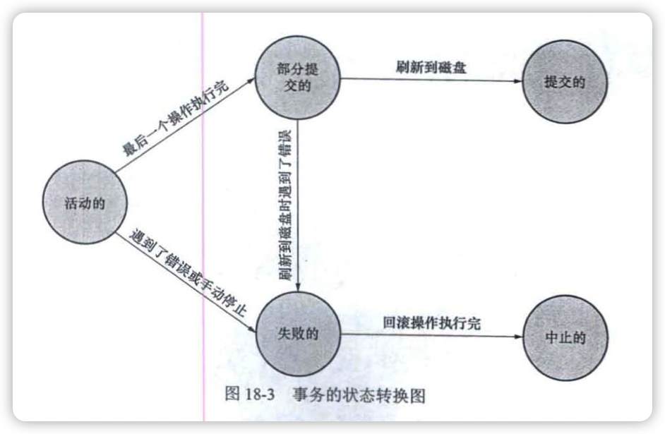

**只有当事务处于提交的或者中止的状态时，一个事务的生命周期才算是结束了**。对于已经提交的事务来说，该事务对数据库所做的修改将永久生效；对于处于中止状态的事务来说，该事务对数据库所做的所有修改都会被回滚到没执行该事务之前的状态。

> transaction，直译为『交易』、『买卖』，交易就是买的人付钱，卖的人交货，不能付了钱不交货，也不能交了货不付钱，所以交易本身就是一种不可分割的操作。 翻译成了“事务”理解起来反而有点困难了。

### 18.3 MySQL事务的语法

事务的本质就是一系列数据库操作，只不过这些数据库操作符合ACID特性而已。

#### 开启事务

- `Begin [Work];`

- `Start Transaction;`与begin语句相同，标志着开启一个事务。后面可以跟随几个修饰符：
  - `Read Only`：属于该事务的数据库操作只能读取数据，不能修改数据。【临时表可以修改】
  - `Read Write`：读写。
  - `With Consistent Snapshot`：启动一致性读。

```mysql
Start Transaction Read Only;

Start Transaction Read Only, With Consistent Snapshot;
```

不设置，默认为读写模式

#### 提交事务

```mysql
Commit [Work];
```

```mysql
mysql> Begin;
Query OK, 0 rows affected (0.00 sec)

mysql> Update account Set balance = balance - 10 Where id = 1;
Query OK, 1 row affected (0.01 sec)
Rows matched: 1  Changed: 1  Warnings: 0

mysql> Update account Set balance = balance + 10 Where id = 2;
Query OK, 1 row affected (0.00 sec)
Rows matched: 1  Changed: 1  Warnings: 0

mysql> Commit;
Query OK, 0 rows affected (0.00 sec)
```


#### 手动中止事务

```mysql
Rollback [Work];
```

ROLLBACK语句代表回滚一个事务。比如在写狗哥给猫爷转账10 元钱所对应的 MySOL 语句时，先给狗哥扣了 10元，然后一时大意只给猫谷账户上增加了1元，此时就可以使用 ROLLBACK 语句进行回滚。完整的过程就是下面这样：

```mysql
mysql> Begin;
Query OK, 0 rows affected (0.00 sec)

mysql> Update account Set balance = balance - 10 Where id = 1;
Query OK, 1 row affected (0.00 sec)
Rows matched: 1  Changed: 1  Warnings: 0

mysql> Update account Set balance = balance + 1 Where id = 2;
Query OK, 1 row affected (0.01 sec)
Rows matched: 1  Changed: 1  Warnings: 0

mysql> Rollback;
Query OK, 0 rows affected (0.00 sec)
```

强调一下，ROLLBACK 语句是程序员在手动回滚事务时使用的。如果事务在执行过程中遇到了某些错误而无法继续执行的话，**大部分情况下会回滚失败的语句，在某些情况下会回滚整个事务**，比方说在发生了死锁的情况下会回滚整个事务。

> 这里所说的开启、提交、中止事务的语法只是针对mysql 客户端程应通过黑框框与服务器进行交互时，用来控制事务的语法。如果大家使用的是其他的客户端程序，此如JDBC之类的，则需要参考相应的文档来看看如何控制事务。

#### 支持事务的存储引擎

MySQL中只有InnoDB和NDB。

如果某个事务中包含的语句要修改某个表中的数据，但是该表使用的存储引擎不支持事务，那么对该表所做的修改将无法进行回滚。

```mysql
Create Table tbl1 (
	i int
) engine=InnoDB;
Create Table tbl2 (
	i int
) engine=MyISAM;
```

```mysql
mysql> Select * from tbl1;
Empty set (0.00 sec)

mysql> Begin;
Query OK, 0 rows affected (0.00 sec)

mysql> Insert into tbl1 Values(1);
Query OK, 1 row affected (0.00 sec)

mysql> Rollback;
Query OK, 0 rows affected (0.01 sec)

mysql> Select * from tbl1;
Empty set (0.00 sec)
```

```mysql
mysql> Select * from tbl2;
Empty set (0.01 sec)

mysql> Begin;
Query OK, 0 rows affected (0.00 sec)

mysql> Insert into tbl2 Values(1);
Query OK, 1 row affected (0.00 sec)

mysql> Rollback;
Query OK, 0 rows affected, 1 warning (0.00 sec)

mysql> Select * from tbl2;
+------+
| i    |
+------+
|    1 |
+------+
1 row in set (0.00 sec)
```


#### 自动提交

系统变量`autocommit`，用来设置自动提交事务，默认为On。

```mysql
Show variables Like 'autocommit';
+---------------+-------+
| Variable_name | Value |
+---------------+-------+
| autocommit    | ON    |
+---------------+-------+
```

默认开启，也就是说如果不显示地使用Start Transaction或Begin语句开启一个事务，那么**每一条语句都算是一个独立的事务**，这种特性称为事务的自动提交。

#### 隐式提交

当使用START TRANSACTION或者BEGIN语句开启了一个事务，或者把系统变量`autocommit`的值设置为OFF时，事务就不会进行自动提交。如果我们输入了某些语句，且这些语句会导致之前的事务悄悄地提交掉（就像输入了COMMIT语句了一样），那么这种因为某些特殊的语句而导致事务提交的情况称为==隐式提交==。会导致事务隐式提交的语句有下面这些。

- 定义或修改数据库对象的数据定义语言 (Data Definition Language, DDL)。

所谓的==数据库对象==，指的就是**数据库、表、视图、存储过程**等这些东西。当使用CREATE、ALTER、DROP等语句修改这些数据库对象时，就会隐式地提交前面语句所属的事务，就像下面这样：

```mysql
BEGIN:

SELECT ... # 事务中的一条语句
UPDATE ... # 事务中的一条语句
...	# 事务中的其他语句

CREATE TABLE ... # 此语句会隐式提交前面语句所属的事务
```

- 隐式使用或修改mysql数据库中的表。

在使用 `ALTER USER`、`CREATE USER`、`DROP USER`、 `GRANT`、 `RENAME USER`、`REVOKE`、`SET PASSWORD` 等语句时，也会隐式地提交前面语句所属的事务。

- 事务控制或关于锁定的语句。

当我们在一个事务还没提交或者还没回滚时就又使用 START TRANSACTION 或者 BEGIN语句开启了另一个事务，此时会隐式地提交上一个事务，就像下面这样：

```mysql
BEGIN;

SELECT ... # 事务中的一条语句
UPDATE ... # 事务中的一条语句
... # 事务中的其他语句

BEGIN; # 此语句会隐式提交前面语句所属的事务
```

在当前的`autocommit` 系统变量的值为 OFF，而我们手动把它调为 ON 时，也会隐式地提交前面语句所属的事务。

使用 `LOCK TABLES`、`UNLOCK TABLES`等关于锁定的语句也会隐式地提交前面语句所属的事务。

- 加载数据的语句。

比如使用 `LOAD DATA`语句向数据库中批量导入数据时，也会隐式地提交前面语句所属的事务。

- 关于MySQL 复制的一些语句。

使用 `START SLAVE`、`STOP SLAVE`、 `RESET SLAVE`、`CHANGE MASTER TO` 等语句时也会隐式地提交前面语句所属的事务。

- 其他语句。

使用ANALYZE TABLE、 CACHE IDEX、CHECK TABLE、FLUSH、 LOAD INDEX ITOCACHE、OPTIMIZE TABLE、REPAIR TABLE、RESET等语句时也会隐式地提交前面语句所属的事务。

#### 保存点

保存点（savepoint）：在事务对应的数据库语句中“打”几个点。给Rollback语句回滚到哪个点，而不是回到最初的原点。

```mysql
Savepoint 保存点名称；
Release Savepoint 保存点名称；  # 删除
```

```mysql
Rollback [Work] To [SavePoint] 保存点名称;
```

```mysql
mysql> Select * From account;
+----+--------+---------+
| id | name   | balance |
+----+--------+---------+
|  1 | 狗哥   |      11 |
|  2 | 猫爷   |       2 |
+----+--------+---------+
2 rows in set (0.00 sec)

mysql> Begin;
Query OK, 0 rows affected (0.00 sec)

mysql> Update account Set balance = balance - 10 Where id = 1;
Query OK, 1 row affected (0.00 sec)
Rows matched: 1  Changed: 1  Warnings: 0

mysql> Savepoint s1;  # 保存点s1
Query OK, 0 rows affected (0.00 sec)

mysql> Select * From account;
+----+--------+---------+
| id | name   | balance |
+----+--------+---------+
|  1 | 狗哥   |       1 |
|  2 | 猫爷   |       2 |
+----+--------+---------+
2 rows in set (0.00 sec)

mysql> Update account Set balance = balance + 1 Where id = 2;
Query OK, 1 row affected (0.00 sec)
Rows matched: 1  Changed: 1  Warnings: 0

mysql> Rollback To s1;
Query OK, 0 rows affected (0.00 sec)

mysql> Select * From account;
+----+--------+---------+
| id | name   | balance |
+----+--------+---------+
|  1 | 狗哥   |       1 |
|  2 | 猫爷   |       2 |
+----+--------+---------+
2 rows in set (0.00 sec)
```


### 18.4 小结

现实世界的业务场景需要映射到数据库世界。现实世界中的一次状态转换需要满足下面几种特性:

- 原子性；
- 隔离性；
- 一致性；
- 持久性。

需要保证原子性、隔离性、一致性和持久性的一个或多个数据库操作称为事务。

事务在执行过程中有几种状态，分别是:

- 活动的;
- 部分提交的；
- 失败的；
- 中止的；
- 提交的。


## 19 说过的话就一定要做到——redo日志

### 19.2 redo日志是啥

InnoDB是以页为单位来管理存储空间的，增删改查操作从本质来说都是在**==访问页面（包括读页面、写页面、创建新页面等操作）==**。

事务提交完成之前，把该事务修改的所有页面都刷新到磁盘，这是个简单粗暴的做法，有一些问题：

- 刷新一个完整的数据页太浪费了。
- 随机I/O刷新起来比较慢。

其实，没有必要在每次提交事务时就把该事务在内存中修改过的全部页面刷新到磁盘，**只需要把修改的内容记录一下就好**。

在系统因奔溃而重启时需要按照上述内容所记录的步骤重新更新数据页，上述内容称为**==重做日志（redo log）==**。

相较于在事务提交时将所有修改过的内存中的页面刷新到磁盘中，只将该事务执行过程中产生的redo日志刷新到磁盘具有一些好处：

- redo日志占用空间小
- redo日志是==顺序==写入磁盘的：在执行事务的过程中，每执行一条语句，就可能产生若干条redo日志，这些日志是按照产生的顺序写入磁盘的，也就是使用==顺序I/O==。


### 19.3 redo日志格式

redo日志只是记录了一下**事务对数据库进行了哪些修改**。InnoDB设计对事务对数据库的**不同修改场景**，定义了多种类型的redo日志。


- type：redo日志类型。53种
- space ID：表空间ID
- page number：页号
- data：redo日志具体内容

#### 简单的redo日志类型

如果没有为某个表显式地定义主键，并且表中也没有定义不允许存储 NULL值的UNIQUE键，那么InnoDB会自动为表添加一个名为row_id的隐藏列作为主键。为这个row_id隐藏列进行赋值的方式如下。

- 服务器会在内存中维护一个==全局变量==，每当向某个包含row_id隐藏列的表中插入一条记录时，就会把这个全局变量的值当作新记录的row_id列的值，并且把这个全局变量自增1。
- 每当这个全局变量的值为`256`的倍数时，就会将该变量的值刷新到系统表空间页号为7的页面中一个名为 **Max Row ID** 的属性中（之所以不是每次自增该全局变量时就将该值刷新到磁盘，是为了避免频繁刷盘）。
- 当系统启动时，会将这个Max Row ID属性加载到内存中，并将该值加上256之后赋值给前面提到的全局变量 （因为在系统上次关机时，该全局变量的值可能大于磁盘页面中Max Row ID属性的值)。

这个Max Row ID属性占用的存储空间是**8字节**。当某个事务向某个包含row_id隐藏列的表插入一条记录，并且为该记录分配的row_id值为256的倍数时，就会向系统表空间页号为7的页面的相应偏移量处写入8字节的值。

但是我们要知道，这个写入操作实际上是在 BufferPool 中完成的，我们需要把这次对这个页面的修改以redo 日志的形式记录下来。这样在事务提交之后，即使系统崩溃了，也可以将该页面恢复成崩溃前的状态。在这种对页面的修改是极其简单的情况下，redo日志中只需要记录一下**==在某个页面的某个偏移量处修改了几个字节的值、具体修改后的内容==**是啥就好了。

InnoDB设计者把这种极其简单的redo日志称为==物理日志==，并且根据在==页面中写入数据的多少==划分了几种不同的redo日志类型。

- `MLOG_1BYTE`(type字段对应的十进制数字为1）：表示在页面的某个偏移量处写入1字节的redo日志类型。
- `MLOG_2BYTE`(type字段对应的十进制数字为2）：表示在页面的某个偏移量处写入2字节的redo日志类型。
- `MLOG_4BYTE`(type字段对应的十进制数字为4)：表示在页面的某个偏移量处写入4字节的redo日志类型。
- `MLOG_8BYTE`(type字段对应的十进制数字为8)：表示在页面的某个偏移量处写入8字节的redo日志类型。
- `MLOG_WRITE_STRING`(type字段对应的十进制数字为30）：表示在页面的某个偏移量处写入一个字节序列。

**Max Row ID** 属性实际占用8字节的存储空间，所以在修改页面中的这个属性时，会记录一条类型为 MLOG_ 8BYTE 的redo 日志：


`MLOG_WRITE_STRING`类型的redo日志表示写入一个字节序列，但是因为不能确定写入的具体数据占用多少字节，所以需要在日志结构中添加一个len字段：


#### 复杂一些的redo日志类型

有时，在执行一条语句时会修改非常多的页面，包括**系统数据页面**和**用户数据页面**（用户数据指的就是聚簇索引和二级索引对应的B+树)。以一条 INSERT语句为例，它除了向B+树的页面中插入数据外，也可能更新系统数据 Max Row ID 的值。不过对于用户来说，平时更关心的是语句对B+树所做的更新。

- 表中包含多少个索引，一条INSERT 语句就可能更新多少棵B+树。
- 针对某一棵B+树来说，既可能更新叶子节点页面，也可能更新内节点页面，还可能创建新的页面（在该记录插入的叶子节点的剩余空间比较少，不足以存放该记录时，会进行**页面分裂**，在内节点页面中添加目录项记录)。

在语句执行过程中，INSERT 语句对所有页面的修改都得保存到redo日志中去。

实际做起来可就比较麻烦了。比如，在将记录插入到聚簇索引中时，如果定位到的叶子节点的剩余空间足够存储该记录，那么只更新该叶子节点页面，并只记录一条`MLOG_WRITE_STRING`类型的redo 日志，表明在页面的某个偏移量处增加了哪些数据。

但是，一个数据页中除了存储实际的记录之外，还有 File Header、PageHeader、 Page Directory等部分。所以每往叶子节点代表的数据页中插入一条记录，还有其他很多地方会跟着更新，比如：

- 可能更新Page Directory中的槽信息；
- 可能更新Page Header中的各种页面统计信息，比如`PAGE_N_DIR_SLOTS`表示的槽数量可能会更改，`PAGE_HEAP_TOP`代表的还未使用的空间最小地址可能会更改，`PAGE_N_HEAP`代表的本页面中的记录数量可能会更改...各种信息都可能会被更改；
- 数据页中的记录按照索引列从小到大的顺序组成一个单向链表，每插入一条记录，还需要更新上一条记录的记录头信息中的 `next_record`属性来维护这个单向链表。
- 其它...


总的来说，在把一条记录插入到一个页面时，需要更改的地方非常多。这时如果使用前面介绍的简单的物理redo日志来记录这些修改，可以有两种解决方案。

- 方案1：在每个修改的地方都记录一条redo日志。

  也就是在图 19-4中，有多少个加粗的块，就写多少条物理 redo 日志。按照这种方式来记录redo日志的缺点是显而易见的，因为被修改的地方实在太多了，可能redo日志占用的空间都要比整个页面占用的空间多。

- 方案2：将整个页面第一个被修改的字节到最后一个被修改的字节之间所有的数据当成一条物理redo日志中的具体数据。

  从图 19-4也可以看出，第一个被修改的字节到最后一个被修改的字节之间仍然有许多没有修改过的数据，把这些没有修改的数据也加入到redo日志中去岂不是太浪费空间了。

正是因为在使用上面这两个方案来记录某个页面中做了哪些修改时，比较浪费空间，InnoDB设计者提出了一些新的redo日志类型。

- `MLOG_REC_INSERT`(type字段对应的十进制数字为9)：表示在插入一条使用非紧凑行格式 (REDUNDANT）的记录时，redo 日志的类型。
- `MLOG_COMP_REC_INSERT`(type字段对应的十进制数字为38）：表示在插入一条使用紧凑行格式 (COMPACT、DYNAMIC、COMPRESSED）的记录时，redo日志的类型。
- `MLOG_COMP_PAGE_CREATE`(type字段对应的十进制数字为58)：表示在创建一个存储紧凑行格式记录的页面时，redo 日志的类型。
- `MLOG_COMP_REC_DELETE` (type 字段对应的十进制数字为42）：表示在删除一条使用紧凑行格式记录时，redo日志的类型。
- `MLOG_COMP_LIST_START_DELETE` (type 字段对应的十进制数字为44)：表示在从某条给定记录开始删除页面中一系列使用紧凑行格式的记录时，redo日志的类型。
- `MLOG_COMP_LIST_END_DELETE`（type字段对应的十进制数宇为43)：与`MLOG_COMP_LIST_START_DELETE`类型的redo日志呼应，表示删除一系列记录，直到`MLOG_COMP_LIST_END_DELETE`类型的redo 日志对应的记录为止。

> 数据页中的记录接照索引列大小的顺序组成单向链表。有时，我们需要刷除索引列的值在莱个区间内的所有记录，这时如果每删除一条记录就写一条redo日志，效率可能有点低。`MLOG_COMP_LIST_START_DELETE`和`MLOG_COMP_LIST_END_DELETE`类型的redo日志以很大程度上减少redo日志的条数。

- `MLOG_ZIP_PAGE_COMPRESS`(type字段对应的十进制数字为51）：表示在压缩一个数据页时，redo日志的类型。

- ...

这些类型的redo日志既包含物理层面的意思，也包含逻辑层面的意思：

- 从==物理层面==看，这些日志都指明了对哪个表空间的哪个页进行修改；
- 从==逻辑层面==看，在系统崩溃后重启时，并不能直接根据这些日志中的记载，在页面内的某个偏移量处恢复某个数据，而是需要调用一些事先准备好的**函数**，在执行完这些函数后才可以将页面恢复成系统崩溃前的样子。

以`MLOG_COMP_REC_INSERT`类型的redo日志（表示插入了一条使用紧凑行格式的记录）为例，解释一下物理层面和逻辑层面到底是啥意恩。

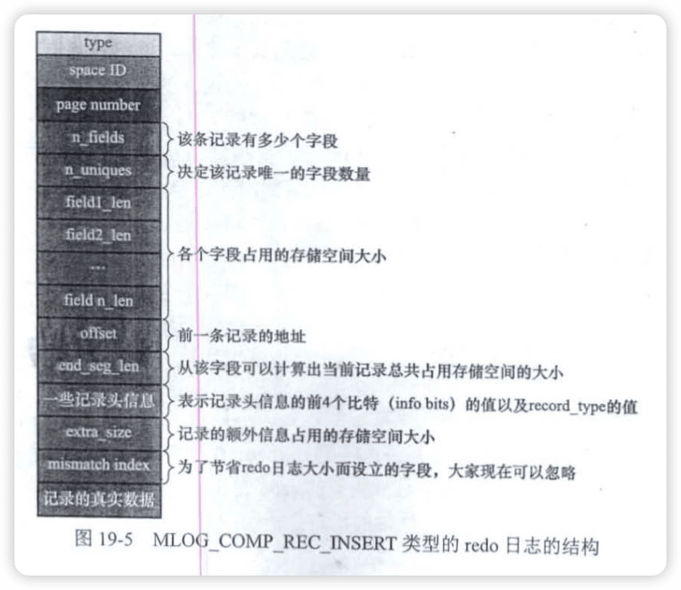

在这个`MLOG_COMP_REC_INSERT`类型的redo日志结构中，有下面几个地方需要注意。

- 在一个数据页中，无论是叶子节点还是非叶子节点，记录都是按照索引列的值从小到大的顺序排序的。对于二级索引来说，当索引列的值相同时，记录还需要按照主键值进行排序。在图 19-5中，`n_uniques`的含义是在一条记录中，需要几个字段的值才能确保记录的唯一性，这样在插入一条记录时，就可以按照记录的前`n_uniques`个字段进行排序。对于聚簇索引来说，`n_uniques`的值为**主键的列数**；对于二级索引来说，该值为**索引列中包含的列数+主键列数**。这里需要注意的是，唯一二级索引的值可能为 NULL， 所以该值仍然为索引引列中包含的列数+主键列数。

- `field1_len` ~ `fieldn_len`代表该记录若干个字段占用存储空间的大小。需要注意的是，这里无论该字段的类型是固定长度类型（比如INT)，还是可变长度类型（比如 VARCHAR(M)）,该字段占用的存储空间大小始终要写入 redo 日志中。

- `offset` 代表该记录的前一条记录在页面中的地址。为啥要记录前一条记录的地址呢？这是因为每向数据页插入一条记录，都需要修改该页面中维护的记录链表。每条记录的记录头信息中都包含一个名为`next_record`的属性，所以在插入新记录时，需要修改前一条记录的`next_record`属性。

- 一条记录其实由额外信息和真实数据这两部分组成，这两个部分的总大小就是一条记录占用存储空间的总大小。通过`end_seg_len`的值可以间接地计算出一条记录占用存储空间的总大小，为啥不直接存储一条记录占用存储空间的总大小呢？

  这是因为写 redo 日志是一个非常频繁的操作，InnoDB设计为了**减小redo日志本身占用的存储空间大小**，想了一些“弯弯绕绕”的算法来实现这个目标。`end_seg_len`字段就是为了节省redo 日志存储空间而提出来的。

- `mismatch_index`也是为了节省 redo 日志的大小而设立的，大家可以忽略。

很显然，这个`MLOG_COMP_REC_INSERT`类型的redo 日志并没有记录 PAGE NDIRSLOTS、 PAGE_ HEAP_TOP、PAGE N HEAP 等的值被修改成什么，而只是把**在本页面中插入一条记录所有必备的要素**记了下来。

之后系统因崩溃而重启后，服务器会调用向某个页面插入一条记录的相关函数，而redo 日志中的那些数据就可以当成调用这个函数所需的参数。在调用完该函数后，页面中的 PAGE N_ DIR SLOTS、 PAGE HEAP_ TOP、PAGE N HEAP 等的值也就都被恢复到系统崩溃前的样子了。这就是 “逻辑层面” 的意思。

#### redo日志格式小结

前面说了一大堆关于 redo 日志格式的内容，如果不是为了编写一个解析 redo 日志的工具，或者自己开发一套redo日志系统，其实没必要把 IonoDB 中各种类型的 redo 日志格式都研究得透透的。

前面只是象征性地介绍了几种类型的redo 日志格式，目的还是想让大家明白：**redo日志会把事务在执行过程中对数据库所做的所有修改都记录下来，在之后系统因崩溃而重启后可以把事务所做的任何修改都恢复过来。**

> 为了节省redo日志占用的存储空间大小，设计InnoDB的大叔还对redo日志中的某些数据进行了压缩处理。比如，space ID和 page number一般占用4字节来存储，但是经过压缩后可以使用更小的空间来存储。

### 19.4 Mini-Transaction（MTR）

#### 以组的形式写入redo日志

语句在执行过程中可能会修改若干个页面。由于对这些页面的更改都发生在Buffer Pool中，所以在修改完页面之后，需要记录相应的redo日志。这些日志被InnoDB设计者人为划分成了若干不可分割的组，比如：

- 更新 Max Row ID 属性时产生的redo日志为一组，是不可分割的；
- 向聚簇索引对应B+树的页面中插入一条记录时产生的redo日志是一组，是不可分割的；
- 向某个二级索引对应 B+树的页面中插入一条记录时产生的redo日志是一组，是不可分割的；
- ...

> 怎么理解这个“==不可分割==”的意思呢？
>
> 以向某个索引对应的 B+树中插入一条记录为例进行解释。

在向B+树中插入这条记录之前，需要先定位这条记录应该被插入到哪个叶子节点代表的数据页中。在定位到具体的数据页之后，有两种可能的情况。

- 情况 1：该数据页剩余的空闲空间相当充足，足够容纳这一条待插入记录。这样一来，事情很简单，直接把记录插入到这个数据页中，然后记录一条`MLOG_COMP_REC_INSERT`类型的 redo 日志就好了。这种情况称为==乐观插入==。

假如某个索引对应的B+树如图19-6所示，现在要插入一条键值为 10 的记录，很显然需要被插入到页b中。由于页6现在有足够的空间容纳一条记录，所以直接将该记录插入到页b中就好了，结果如图 19-7所示。

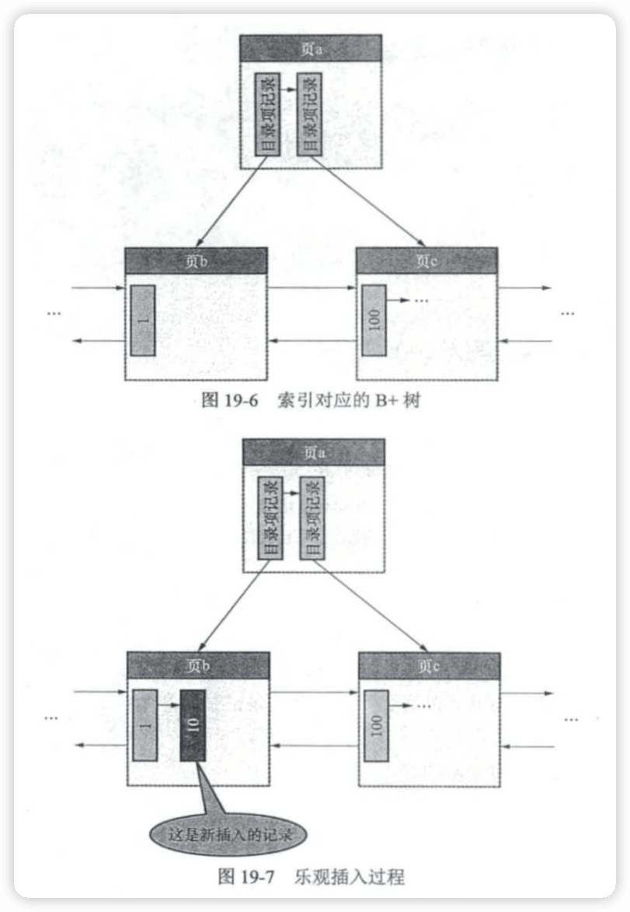

- 情况2：该数据页剩余的空闲空间不足，遇到这种情况时要进行==页分裂==操作，也就是新建一个叶子节点，把原先数据页中的一部分记录复制到这个新的数据页中，然后再把记录插入进去：再把这个叶子节点插入到叶子节点链表中，最后还要在内节点中添加一条目录项记录来指向这个新创建的页面。很显然，这个过程需要对多个页面进行修改，这意味着会产生多条redo日志。这种情况称为==悲观插入==。

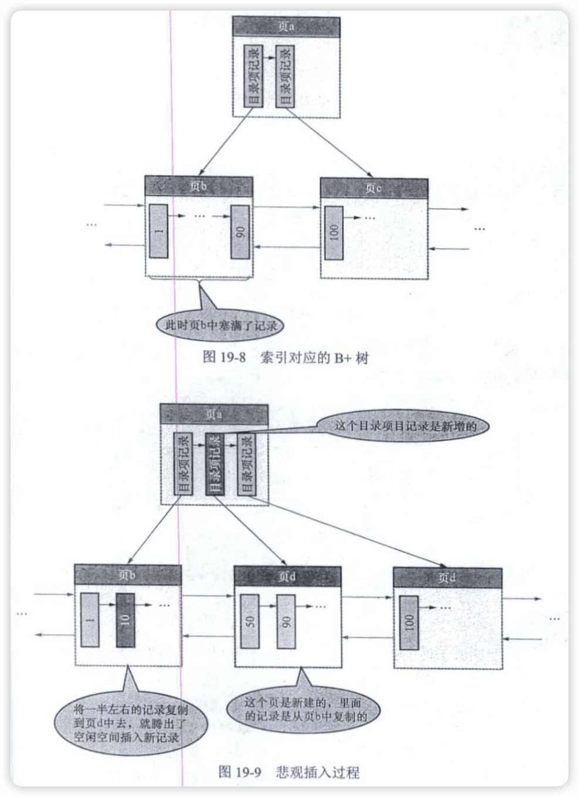

如果作为内节点的页a的剩余空闲空间也不足以容纳新增的一条目录项记录，则需要继续对内节点页a进行分裂操作，这也就意味着会修改更多的页面，从而产生更多的redo 日志。另外，对于悲观插入来说，由于需要新申请数据页，因此还需要改动一些系统页面。比如要修改各种段、区的统计信息，修改各种链表的统计信息等（比如 FREE链表、FREE_FRAG链表等），反正总共需要记录的redo日志有<u>二三十条</u>。

InnoDB设计者认为，==向某个索引对应的B+树中插入一条记录的过程必须是原子的==，不能说插了一半之后就停止了。比如在悲观插入过程中，新的页面己经分配好了，数据也复制过去了，新的记录也插入到页面中了，但是没有向内节点中插入一条目录项记录。那么，这个插入过程就是不完整的，这就会形成一棵不正确的 B+树。

redo日志是为了在系统因崩溃而重启时恢复崩溃前的状态而提出的，如果在悲观插入的过程中只记录了一部分redo日志，那么在系统在重启时会将索引对应的 B+树恢复成一种不正确的状态。这是所不能忍受的，所以设计者规定==在执行这些需要保证原子性的操作时，必须以组的形式来记录redo日志==。在进行恢复时，针对某个组中的redo 日志，要么把全部的日志都恢复，要么一条也不恢复。这是怎么做到的呢？这得分情况讨论。

- 有些需要保证原子性的操作会生成多条redo日志。比如向某个索引对应的 B+树中进行一次悲观插入时，就需要生成许多条redo 日志。

<u>如何把这些redo日志划分到一个组里面呢？</u>IonoDB设计者搞了一个很简单的“小把戏”——在该组中的最后一条redo 日志后面加上一条特殊类型的 redo 日志。该类型的redo日志的名称为 `MLOG_MULTI_REC_END`，结构很简单，只有一个type字段(对应的十进制数字为31)。

所以，某个需要保证原子性的操作所产生的一系列redo日志，必须一条类型为`MLOG_MULTI_REC_END`的redo日志结尾：


这样在系统因崩溃而重启恢复时，只有解析到类型为`MLOG_MULTI_REC_END`的redo日志时，才认为解析到了一组完整的redo日志，才会进行恢复；否则直接放弃前面解析到的redo 日志。

- 有些需要保证原子性的操作只生成一条redo 日志。比如更新 Max Row ID 属性的操作就只会生成一条 redo 日志。

用7个比特就足以包括所有的redo日志类型，省出来一个比特，用来表示这个需要保证原子性的操作只产生一条单一的redo 日志：


如果type字段的第 1个比特为1，代表这个需要保证原子性的操作只产生了一条单一的redo 日志；否则就表示这个需要保证原子性的操作产生了一系列的redo日志。

#### Mini-Transaction的概览

**==Mini-Transaction（MTR）==**：**对底层页面进行一次原子访问的过程**。比如修改一次Max Row ID的值，向某个索引对应的B+树中插入一条记录的过程都算是一个**Mini-Transaction**，也算是一个Mini-Transaction。

一个MTR可以包含一组redo日志，在进行崩溃恢复时，需要把这一组redo日志作为一个不可分割的整体来处理。

一个事务可以包含若干条语句，每一条语句又包含若干个 MTR，每一个MTR 又可以包含若干条redo 日志。我们画个图来表示它们的关系。

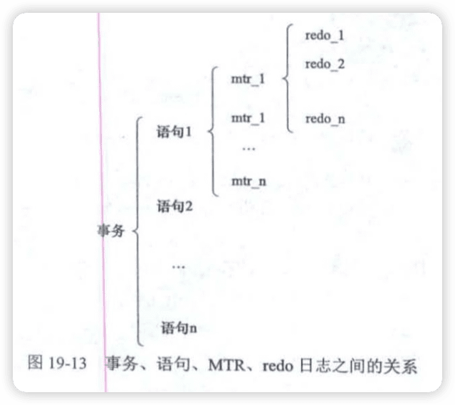


### 19.5 redo日志的写入过程

#### redo log block

MTR生成的redo日志存储在==512==字节的页，这个页叫作**redo log block**（为了区分于之前的页）。

**log block header**和**log block trailer**存储的是一些管理信息，真正的redo日志都是存储到占用==496==字节的**log block body**中。

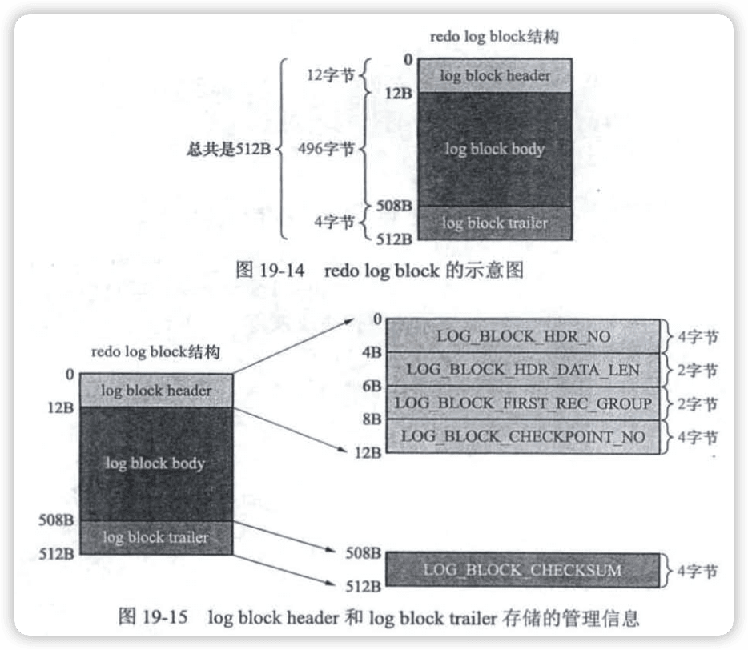

其中，**log block header**中几个属性：

- `LOG_BLOCK_HDR_NO`：每一个blook 都有一个大于0的唯一编号，该属性就表示该编号值。

- `LOG_BLOCK_HIDR_DATA_LEN`：表示 block 中已经使用了多少字节，初始值为12（因为log block body 从第 12个字节处开始)。随着往block 中写入的redo 日志越来越多，该属性值也跟着增长。如果log block body 己经被全部写满，那么该属性的值被设置为512。

- `LOG_BLOCK_FIRST_REC_GROUP` ： 一条redo日志也可以称为一条==redo日志记录 (redo log record)==。一个MTR会生成多条redo日志记录，这个 MTR 生成的这些redo日志记录被称为一个==redo日志记录组 (redo log rocord group)==。 

  这个属性就代表该block 中第一个MTR 生成的 redo 日志记录组的偏移量，其实也就是这个block中第一个MIR 生成的第一条redo 日志记录的偏移量（如果一个MTR 生成的redo 日志横跨了好多个block，那么最后一个block 中的`LOG_BLOCK_FIRST_REC_GROUP`属性就表示这个MTR 对应的redo日志结束的地方，也就是下一个MTR生成的redo 日志开始的地方）。

- `LOG_BLOCK_CHECKPOINT_NO`： 表示checkpoint的序号

**log block trailer** 中属性：

- `LOG_BLOCK_CHECKSUM`：表示该block的校验值，用于正确性校验。

#### redo日志缓冲区

类比引入Buffer Pool，写入redo日志时也不能直接写到磁盘中，实际上在服务器启动时就向操作系统申请了一大片称为**==redo log buffer（redo日志缓冲区）==**的连续内存空间，简称==log buffer==。


启动项`innodb_log_buffer_size`指定大小，默认16MB。

#### redo日志写入log buffer

顺序写入

> 当想往log buffer中写入redo日志时，**应该写在哪个block的哪个偏移量处**？

全局变量`buf_free`指明位置。

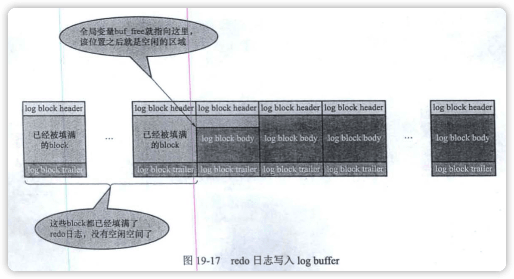

假设有名为T1、T2的两个事务，每个事务都包含2个MTR，这几个MTR 的名字如下：

- 事务T1的两个MTR分别称为mtr_t1_1和mtr_t1_2;
- 事务T2的两个MTR分别称为mtt_t2_1和mtt_t2_2。

每个MTR都会产生一组redo日志：

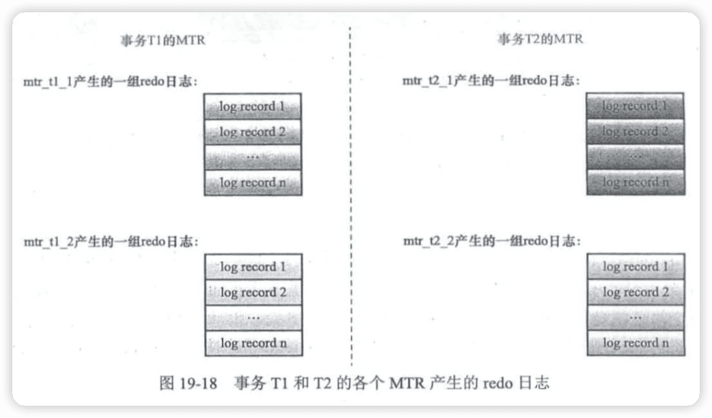

不同的事务是可能并发执行的，所以**T1、T2的MTR可能是交替执行的**。每当一个MTR执行完成时，伴随该MTR生成的一组redo 日志就需要被复制到log buffer中。也就是说不同事务的MTR对应的redo日志可能是交替写入log buffer的，如图19-19 所示（为了美观，我们把一个MTR中产生的所有redo日志当作一个整体）。

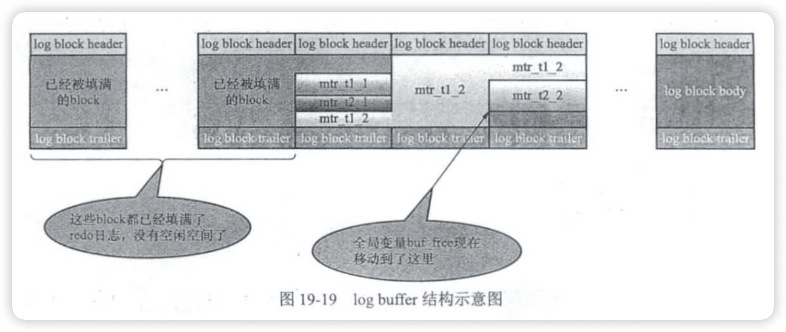

不同的MTR产生的产生的一组redo日志占用的存储空间可能不一样。


### 19.6 redo日志文件

#### redo日志刷盘时机

MTR运行过程中产生的一组redo日志，在MTR结束时会被复制到log buffer中，但是这日志不会总在内存里，下面一些情况会被刷新到磁盘中：

- Log buffer空间不足时

- 事务提交时

  之所以提出 redo日志的概念，主要是因为它**占用的空间少，而且可以将其顺序写入磁盘**。引入redo日志后，虽然在事务提交时可以不把修改过的 Buffer Pool 页面立即刷新到磁盘，但是为了保证持久性，必须要把页面修改时所对应的redo 日志刷新到磁盘：否则系统崩溃后，无法将该事务对页面所做的修改恢复过来。

- 后台有一个线程，大约以**每秒一次**的频率将log buffer中的redo日志刷新到磁盘。

- 正常关闭服务器时
- 做checkpoint时

#### redo日志文件组

MySQL的数据目录（`show variables like 'datadir';`）中的**ib_logfile0**和**ib_logfile1**两个文件就是log buffer默认刷盘的两个磁盘文件。

调节redo日志文件的启动选项：

- `innodb_log_group_home_dir`：指定redo日志文件所在目录，默认为当前数据目录。
- `innodb_log_file_size`：指定每个redo日志文件大小，默认48MB。
- `innodb_log_files_in_group`：指定redo日志文件的个数，默认为2，最大为100。`ib_logfile[数字]`

> redo日志文件的总大小 = `innodb_log_file_size` * `innodb_log_files_in_group`

redo日志文件从**ib_logfile0**开始写起，到最大数目，就重新覆盖第0个（循环）。

#### redo日志文件格式

log buffer 本质上是一片连续的内存空间，被划分成若干个512字节大小的block。将 log buffer 中的redo 日志刷新到磁盘的本质就是把 block 的镜像写入日志文件中，所以redo 日志文件其实也是由若干个 512字节大小的block组成。

在redo 日志文件组中，每个文件的大小都一样，格式也一样，都是由下面两部分组成的：

- 前2,048个字节(也就是前 4个block）用来存储一些管理信息;
- 从第2,048字节往后的字节用来存储log butfer 中的block 镜像。

所以前面所说的循环使用redo 日志文件，其实是从每个日志文件的前 2,048 个字节开始算起：

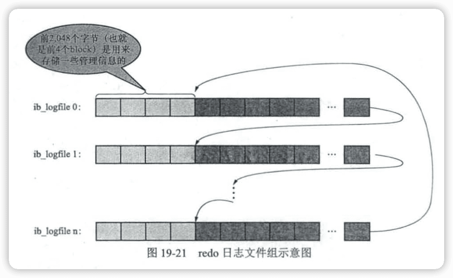

每个redo日志文件的前2048个字节（前4个特殊block），分别是：

- `log file header`：描述redo日志文件的一些整体属性

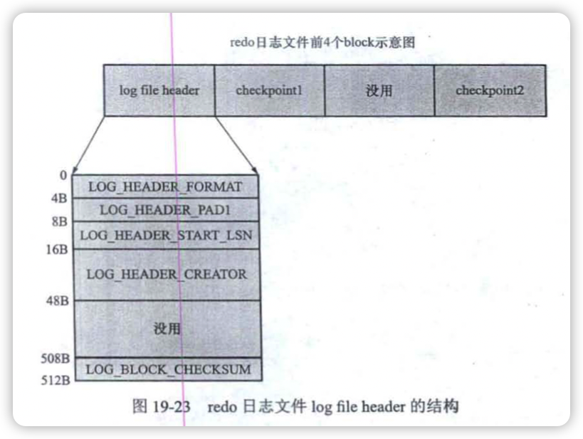

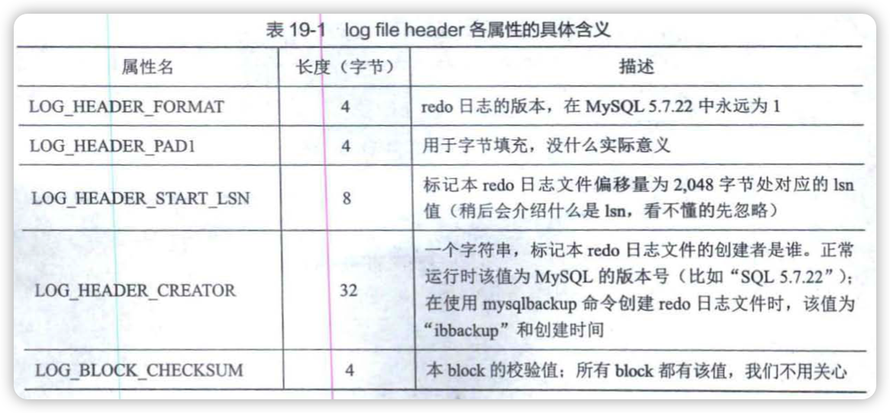

- `checkpoint1`：关于checkpoint的一些属性。

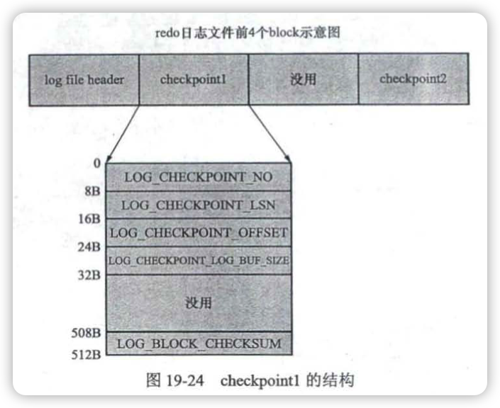

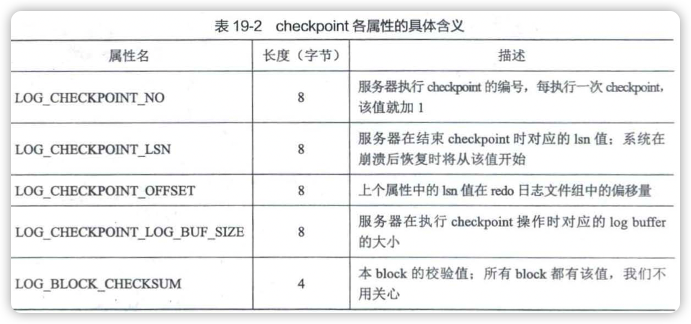

- 第三个block未使用
- `checkpoint2`：结构与`checkpoint1`一样。

### 19.7 log sequence number（lsn）

全局变量**log sequence number（==lsn==）**，用来记录当前总共已经写入的redo日志量。lsn初始值设定为==8704==。

在向log buffer 中写入redo 日志时并不是一条一条写入的，而是以 MTR 生成的一组redo 日志为单位写入的，而且实际上是把日志内容写在了log block body 处。但是在统计Isn 的增长量时，是按照实际写入的日志量加上占用的log block header 和 log block trailer 来计算的。

🔖

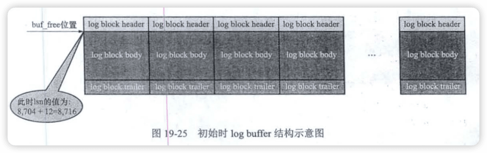

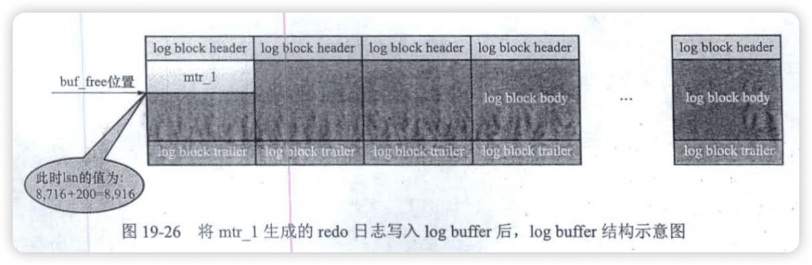

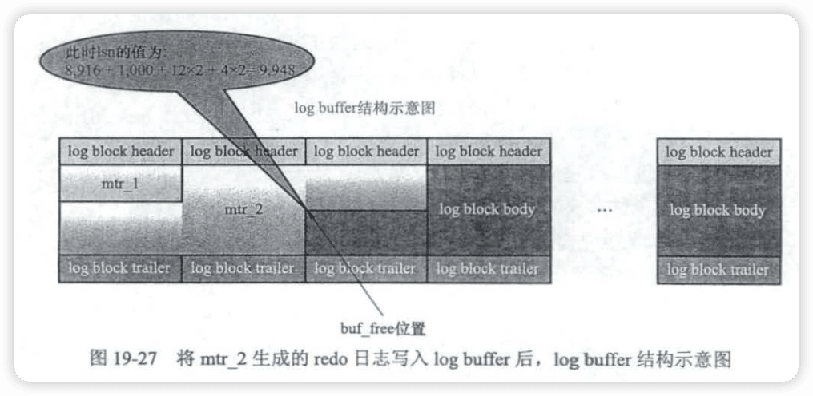

> 每一组由MTR生成的redo日志都有一个唯一的lsn值与其对应；lsn值越小，说明redo日志产生的越早。

#### flushed_to_disk_lsn

全局变量`buf_next_to_write`用来标记当前log buffer中已经有哪些日志被刷新到磁盘中了。

全局变量`flushed_to_disk_lsn`表示刷新到磁盘中的redo日志量。

🔖

#### lsn值和redo日志文件组中的偏移量的对应关系

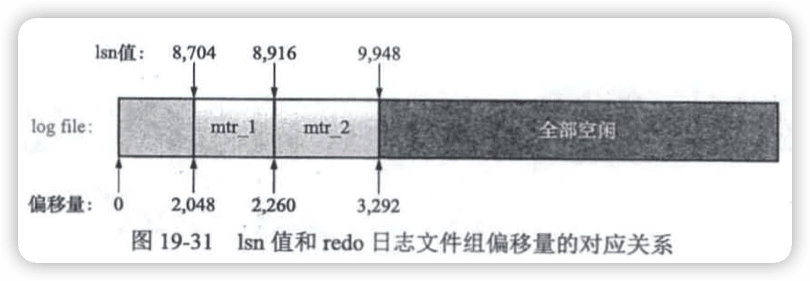

#### flush链表中的lsn

MTR结束时，还要把在MTR执行过程中修改过的页面加入到Buffer Pool的flush链表中。

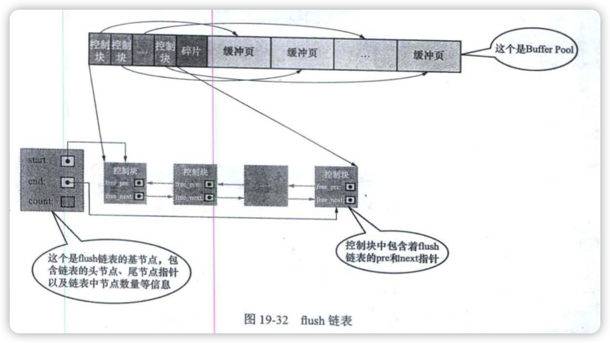

🔖

### 19.8 checkpoint 🔖

判断某些redo日志占用的磁盘空间是否可以覆盖的依据，就是它对应的脏页是否已经被刷新到了磁盘中。

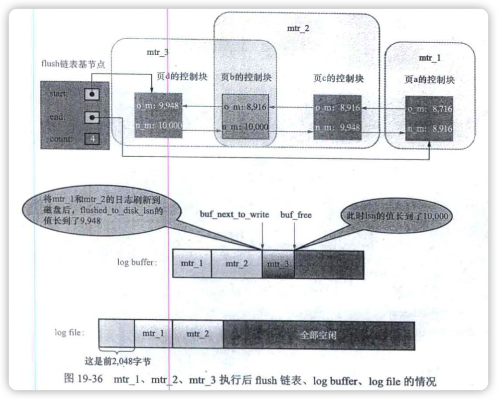


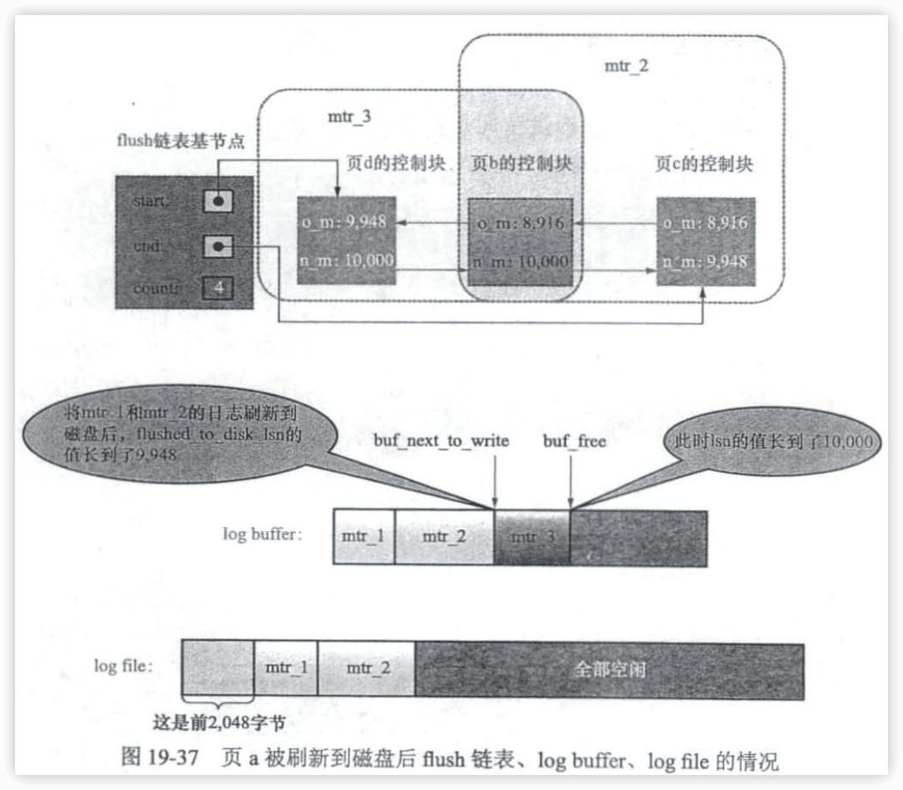


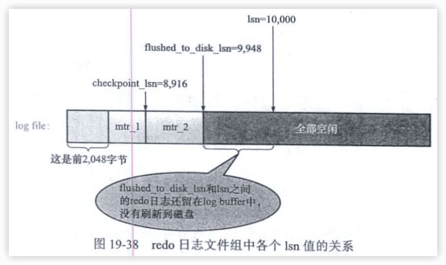

### 19.9 用户线程批量从flush链表中刷出脏页 🔖

一般情况下都是后台的线程对LRU链表和flush链表进行刷脏操作，这主要因为刷脏操作比较慢，不想影响用户线程处理请求。

但是，如果当前系统修改页面的操作十分频繁，这就导致写redo 日志的操作十分频繁，系统lsn值增长过快。如果后台线程的刷脏操作不能将脏页快速刷出，系统将无法及时执行 checkpoint，可能就需要用户线程从 flush 链表中把那些最早修改的脏页（`oldest_modification` 较小的脏页）同步刷新到磁盘。

这样这些脏页对应的redo日志就没用了，然后就可以去执行checkpoint了。

### 19.10 查看系统中的各种lsn值

```mysql
Show Engine Innodb Status\G;
...
---
LOG
---
Log sequence number          62003410
Log buffer assigned up to    62003410
Log buffer completed up to   62003410
Log written up to            62003410
Log flushed up to            62003410
Added dirty pages up to      62003410
Pages flushed up to          62003410
Last checkpoint at           62003410
5831 log i/o's done, 0.00 log i/o's/second
----------------------
...
```

- Log sequence number 表示系统中的lsn值，也就是当前系统已经写入的redo 日志量，包括写入到log buffer中的redo日志：
- Log fushed up to 表示`fushed_to_disk_lsn`的值，也就是当前系统已经写入磁盘的redo日志量；
- Pages flushed up to 表示flush链表中被最早修改的那个页面对应的 oldest_modification属性值：
- Last checkpoint at 表示当前系统的checkpoint_lsn 值。

### 19.11 innodb_flush_log_at_trx_commit的用法


### 19.12 崩溃恢复🔖

在服务器不“挂”的情况下，redo日志简直就是个累赘，不仅没用，反而让性能变得更差。

#### 确定恢复的起点


#### 确定恢复的终点

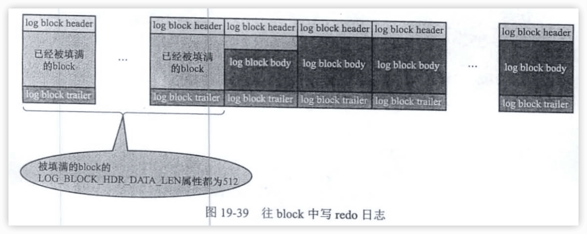


#### 怎么恢复

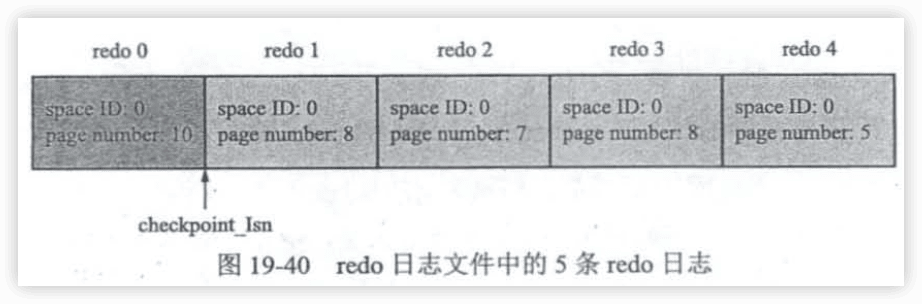

- 使用哈希表

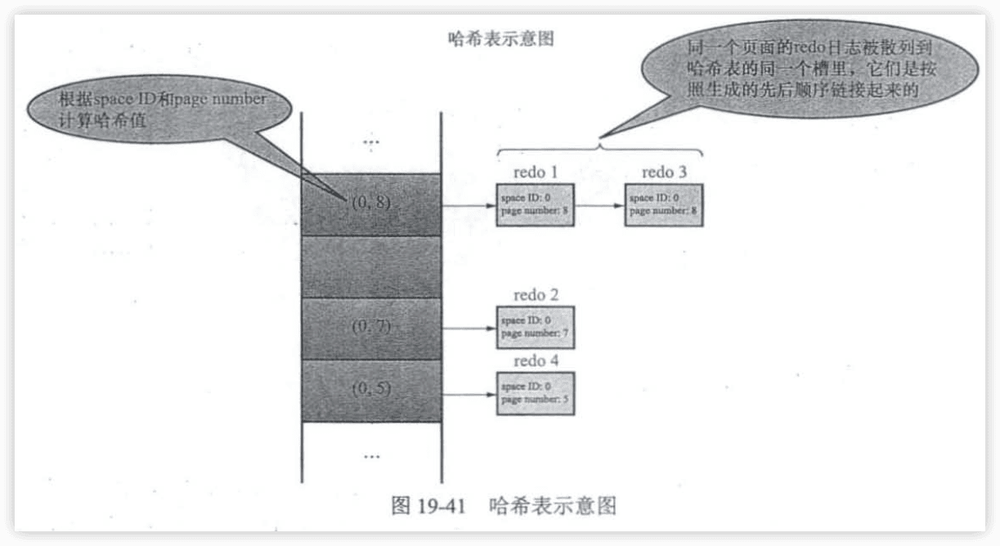


- 跳过已经刷新到磁盘中的页面


### 19.13 遗留问题：LOG_BLOCK_HDR_NO是如何计算的


### 19.14 总结

redo日志记录了事务执行过程中都修改了哪些内容。

事务提交时**只将执行过程中产生的redo日志刷新到磁盘**，而不是将所有修改过的页面都刷新到磁盘。这样做有下面两个好处：

- redo日志占用的空间非常小；
- redo日志是顺序写入磁盘的。

一条redo 日志一般由下面几部分组成。

- type：这条redo日志的类型。
- space ID：表空间ID。
- page number：页号。
- data：这条redo日志的具体内容。

redo日志的类型有简单和复杂之分。简单类型的redo日志是纯粹的物理日志，复杂类型的redo日志兼有物理日志和逻辑日志的特性。

一个MTR可以包含一组redo日志。在进行崩溃恢复时，这一组redo日志作为一个不可分割的整体来处理。

redo日志存放在大小为512字节的block中。每一个block 被分为3 部分：

- log block header;
- log block body ;
- log block trailer.

redo 日志缓冲区是一片连续的内存空间，由若干个block 组成：可以通过启动选项 innodb_log_buffer_size 来调整它的大小。

redo日志文件组由若干个日志文件组成，这些redo日志文件是被==循环==使用的。redo日志文件组中每个文件的大小都一样，格式也一样，都是由两部分组成：

- 前2,048个字节〈也就是能 4个block）用来存储一些管理信息；
- 从第2,048 字节往后的字节用来存储 log buffer 中的block 镜像。

lsn指己经写入的redo 日志量，`fushed_to_disk_lsn`指刷新到磁盘中的redo日志量，fush链表中的脏页按照修改发生的时间顺序进行排序，也就是按照`oldest_modification` 代表的1sn值进行排序。被多次更新的页面不会重复插入到 fush 链表中，但是会更新 `newest_modification`属性的值。`checkpoint_lsn` 表示当前系统中可以被覆盖的redo 日志总量是多少。

redo 日志占用的磁盘空问在它对应的脏页己经被刷新到磁盘后即可被覆盖。执行一次checkpoint 的意思就是增加`checkpoint_lsn` 的值，然后把相关的信息存放到日志文件的管理信息中。

`innodb_flush_log_at_trx_commit` 系统变量控制着在事务提交时是否将该事务运行过程中产生的redo 刷新到磁盘。

在崩溃恢复过程中，从redo日志文件组第一个文件的管理信息中取出最近发生的那次checkpoint 信息，然后从`checkpoint_lsn` 在日志文件组中对应的偏移量开始，一直扫描日志文件中的 block，直到某个block 的 `LOG_BLOCK_HDR_DATA_LEN` 值不等于 512 为止。在恢复过程中，使用哈希表可加快恢复过程，并且会跳过己经刷新到磁盘的页面。


## 20 后悔了怎么办——undo日志

### 20.1 事务回滚的需求

==回滚（rollback）==

数据库中的回滚跟悔棋差不多：<u>插入了一条记录，回滚对应的操作就是把这条记录删除掉；更新了一条记录，回滚对应的操作就是把该记录更新回旧值：刪除了一条记录；回滚对应的操作自然就是把该记录再插进去。</u>

每当要对一条记录进行改动时（Insert、Delete、Update），都需要留一手——**把回滚时所需要的东西都记下来**：

- 在插入一条记录时，至少要把这条记录的主键值记下来，这样之后回滚时只需要把这个主键值对应的记录删掉就好了；
- 在删除一条记录时，至少要把这条记录中的内容都记下来，这样之后回滚时再把由这些内容组成的记录插入到表中就好了；
- 在修改一条记录时，至少要把被更新的列的旧值记下来，这样之后回滚时再把这些列更新为旧值就好了。

为了回滚而记录的东西称为**==撤销日志（undo log）==**。

### 20.2 事务id

#### 分配事务id的时机

如果某个事务在执行过程中对某个表执行了增删改操作，那么InnoDB就会给它分配一个独一无二的事务id。

#### 事务id是怎么生成的

- 服务器会在内存中维护一个全局变量，每当需要为某个事务分配事务id时，就会把该变量的值当作事务 id 分配给该事务，并且把该变量自增1。

- 每当这个变量的值为 256 的倍数时，就会将该变量的值刷新到系统表空间中页号为5的页面中一个名为**Max Trx ID**的属性中，这个属性占用8字节的存储空间。
- 当系统下一次重新启动时，会将这个**Max Trx ID**属性加载到内存中，将该值加上256之后赋值给前面提到的全局变量（因为在上次关机时，该全局变量的值可能大于磁盘页面中的**Max Trx ID**属性值）。

这样就可以保证整个系统中分配的事务 id值是一个递增的数字。先分配事务计的事务得到的是较小的事务 id，后分配事务id的事务得到的是较大的事务id。

#### trx_id隐藏列

聚簇索引的记录除了会保存完整的用户数据以外，而且还会自动添加名为 `trx_id`、`roll_pointer`的隐藏列。如果用户没有在表中定义主键以及不允许存储 NULL值的 UNIQUE 键，还会自动添加一个名为`row_id` 的隐藏列。

一条记录在页面中的真实结构：


`trx_id`就是对这个聚簇索引记录进行改动的语句所在的事务对应的事务id。

### 20.3 undo日志的格式

```mysql
Create Table undo_demo (
	id Int Not Null,
  key1 Varchar(100),
  col Varchar(100),
  Primary Key (id),
  Key idx_key1 (key1)
) Engine=InnoDB Charset=utf8;
```

`FIL_PAGE_UNDO_LOG`


```mysql
Select * From information_schema.innodb_tables Where name = 'xiaohaizi/undo_demo';
```


#### Insert操作对应的undo日志


#### Delete操作对应的undo日志


#### Update操作对应的undo日志


#### 增删改操作对二级索引的影响


### 20.4 通用链表结构


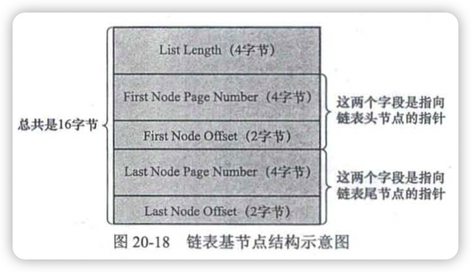

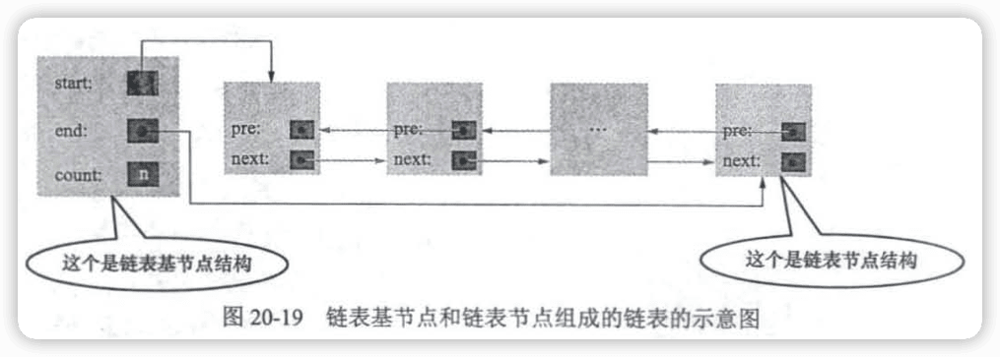


### 20.5 FIL_PAGE_UNDO_LOG页面

`FIL_PAGE_UNDO_LOG`类型的页面是**专门用来存储undo日志的**，简称==Undo页面==。


### 20.6 Undo页面链表

#### 单个事务中的Undo页面链表

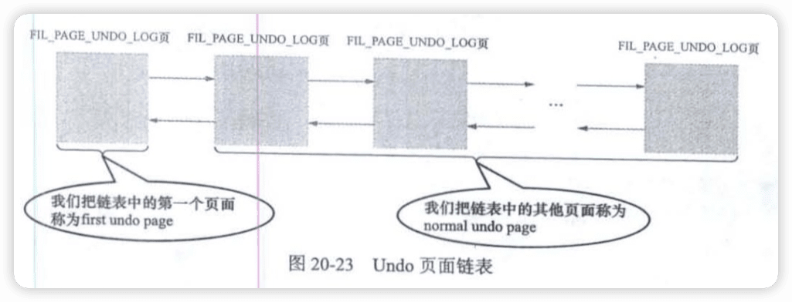

#### 多个事务中的Undo页面链表


### 20.7 undo日志具体写入过程

#### 段的概念

段是一个逻辑上的概念，本质上是由若干个零散页面和若干个完整的区组成的。


#### Undo Log Segment Header


第一个页面比普通页面多了一个Undo Log Segment Header。

#### Undo Log Header


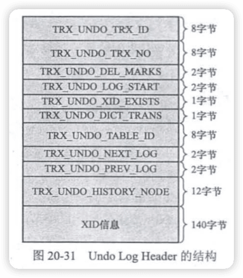


### 20.8 重用Undo页面


### 20.9 回滚段

#### 回滚段的概念


#### 从回滚段中申请Undo页面链表


#### 多个回滚段


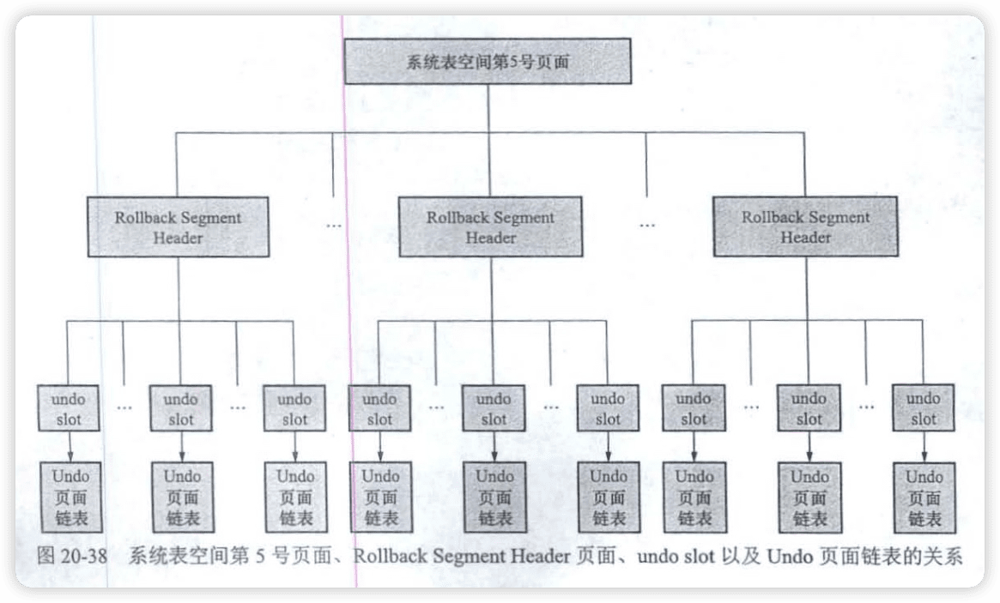

#### 回滚段的分类


#### roll_pointer的组成

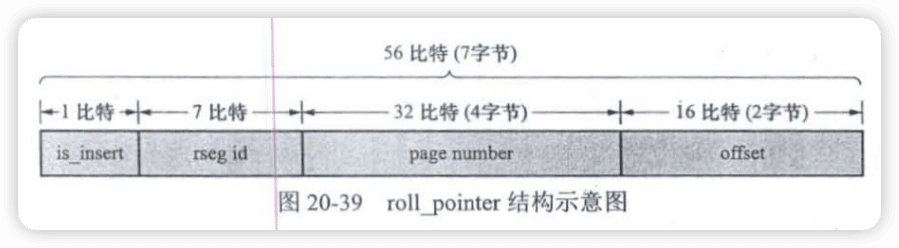


#### 为事务分配Undo页面链表的详细过程


### 20.10 回滚段相关配置

#### 配置回滚段数量


#### 配置undo表空间


### 20.11 undo日志在崩溃恢复时的作用


### 20.12 总结

为了保证事务的原子性，InnoDB设计者引入了undo 日志。undo日志记载了回滚一个操作所需的必要内容。

在事务对表中的记录进行改动时，才会为这个事务分配一个唯一的事务id。事务id值是一个递增的数宇。先被分配 id 的事务得到的是较小的事务id，后被分配 id 的事务得到的是较大的事务id。 未被分配事务 id的事务的事务id默认是0。聚簇索引记录中有一个trx_id隐藏列，它代表**对这个聚簇索引记录进行改动的语句所在的事务对应的事务id**。

InnoDB设计者针对不同的场景设计了不同类型的undo 日志，比如`TRX_UNDO_INSERT_REC`、 `TRX_UNDO_DEL_MARK_REC`、`TRX_UNDO_UPD_EXIST_REC`等。

类型为`FIL_PAGE_UNDO_LOG`的页面是专门用来存储undo 日志的，我们简称为**Undo页面**。

在一个事务执行过程中，最多分配4 个Undo页面链表，分别是：

- 针对普通表的 insert undo 链表;
- 针对普通表的 update undo 链表：
- 针对临时表的 insert undo 链表：
- 针对临时表的 update undo 链表。

只有在真正用到这些链表的时候才去创建它们。

每个 Undo 页面链表都对应一个**Undo Log Segment**。 Undo页面链表的第一个页面中有一个名为 **Undo Log Segment Header** 的部分，专门用来存储关于这个段的一些信息。

同一个事务向一个Undo 页面链表中写入的 undo 日志算是一个组，每个组都以一个**Undo Log Header** 部分开头。

一个 Undo 页面链表如果可以被重用，需要符合下面的条件：

- 该链表中只包含一个Undo页面：
- 该Undo页面己经使用的空间小于整个页面空间的3/4。

每一个Rollback Segment Header 页面都对应者一个回滚段，每个回滚段包含 1,024个 undo slot，一个undo slot 代表一个Undo 页面链表的第一个页面的页号。目前，InnoDB 最多支持128 个回滚段，其中第0号、第`33~127`号回滚段是针对普通表设计的，第`1~32`号回滚段是针对临时表设计的。

我们可以选择將 undo 日志记录到专门的undo 表空间中，在undo 表空间中的文件大到一定程度时，可以自动将该 undo 表空问截断为小文件。


## 21 一条记录的多幅面孔——事务隔离级别和MVCC

```mysql
Create Table hero (
	number Int,
  name Varchar(100),
  country Varchar(100),
  Primary Key (number)
) Engine=Innodb Charset=utf8;

Insert Into hero Values(1, '刘备', '蜀');
```


### 21.2 事务隔离级别

服务器可以同时处理来自多个客户端的多个事务。

在18章中提到，==一个事务就对应着现实世界的一次状态转换==。事务执行之后必须保证数据符合现实世界的所有规则，这就是我们强调的==一致性==。数据库管理系统提供的**一系列约束**，比方说**主键、唯一索引、外键、声明某个列不允许插入NULL值**等可以帮助我们解决一部分一致性需求。但是这对于 “现实世界的所有规则〞 来说，无异于杯水车薪，**更多的一致性需求需要程序员人为地保证**。

数据库管理系统通过redo日志、undo日志这些手段来保证事务的**原子性**。程序员只要将现实世界的状态转换所对应的数据库操作都写到一个事务中，那么该事务执行完成后，必然从一个一致性状态转移到下一个一致性状态 (原子性保证即使事务执行失败，也只会返回到最初的一致性状态)。

在18章的转账事务例子中，必须保证参与转账的账户的总余额保持不变，这也就是这个转账事务的一致性需求。程序员只要把上述步骤都放在一个事务中执行，在事务的原子性的保护下，这些操作执行完肯定是能满足一致性需求。

**如果事务是以单个的形式一个接一个地执行，那么在一个事务开始时，面对的就是上一个事务执行结束后留下的一致性状态，它执行之后又会产生下一个一致性状态**。在多个事务并发执行时，情况就变得比较复杂了。如果这些并发执行的事务不会访问相同的数据，比方说在

“狗哥给猫爷转账〞的事务和“张三给李四转账〞 的事务并发执行时，由于这两个事务并不会访问相同的账户，所以它们并发执行并不会带来什么一致性问题。也就是说最终的 “参与转账的账户的总余额保持不变〞 这个一致性需求是可以保证的，但是，如果并发执行的事务会访问相同的数据，就可能导致不能满足 “参与转账的账户的总余额保持不变” 这个一致性需求。

**事务的隔离性**

事务的执行方式：

- **串行执行**。在系统中的同一个时刻最多只允许一个事务运行（比如说强制让所有事务在一个线程中执行）。缺点是严重降低系统吞吐量和资源利用率，增加事务的等待时间。

- **可串行化执行**。在某个事务访向某个数据时，对要求其他试图访问相同数据的事务进行限制，让它们进行排队。当该事务提交之后，其他事务才能继续访问这个数据。

> 两个并发的事务在执行过程中访问相同数据的情况有读-读情況 （两个事务对该数据都进行读操作)、读-写情况（一个事务对该数据进行读操作，另一个事务对该数据进行写操作）、写-读情况、写-写情况。
>
> 只有在至少一个事务对数据进行写操作时，才可能带来一致性问题（本章后文会详细分析几种种可能引发一致性问题的现象)。所以我们在实现多个事务的可串行化执行的时候，仅需要在多个事务对相同数据的访问是读-写情况，写-读情况和写-写情况时，对其进行排队即可（这通常是通过加锁实现的，在下一章中会详细唠叨锁)。

#### 事务并发执行时遇到的一致性问题

- ==脏写（Dirty Write）==。一个事务修改了另一个未提交事务修改过的数据。
- ==脏读（Dirty Read）==。一个事务读到了另一个未提交事务修改过的数据。
- ==不可重复读==（Non-Repeatable Read）/模糊读（Fuzzy Read）。一个事务修改了另一个未提交事务读取的数据。
- ==幻读（Phantom）==。如果一个事务先根据某些搜索条件查询出一些记录，在该事务未提交时，另一个事务写入一些了符合那些搜素条件的记录（这里的写入可以指INSERT、DELETE、 UPDATE操作）。

#### SQL标准中的4中隔离级别

按照可能导致一致性问题的严重性排序：

```
脏写 > 脏读 > 不可重复读 > 幻读
```

前文所说的“舍弃一部分隔高性来换取一部分性能”在这里就体现为：<u>设立一些隔离级别，隔离级别越低，就越可能发生越严重的问题</u>。

SQL标准标准中设立了4个隔高级别。

- READ UNCOMMITTED ： 未提交读。
- READ COMMITTED：已提交读。
- REPEATABLE READ：可重复读。
- SERIALIZABLE：可串行化。

SQL标准中规定：针对不同的隔离级别，并发事务执行过程中可以发生不同的现象。

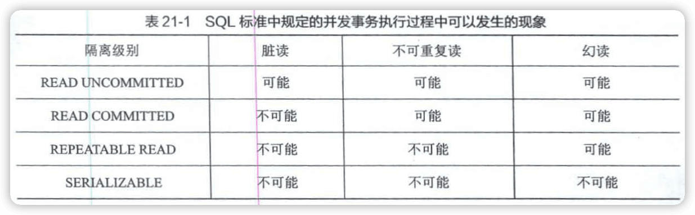

#### MySQL中支持的4中隔离级别

不同的数据库厂商对SQL标准中规定的4种隔离级别的支持不一样。

MySQL中与SQL标准有些出入，MySQL在REPEATABLE READ 隔离级别下，可以很大程度上禁止幻读现象的发生。

MySQL的默认隔离级别为 REPEATABLE READ。设置是事务的隔离级别：

```mysql
Set [Global|Session] Transaction Isolation Level level;
```

level的4个可选值：Repeatable Read、Read Committed、Read Uncommitted、Serializable。

也可以通过启动选项`transaction_isolation`，在服务器启动时改变。

查看当前会话的默认隔离级别：

```mysql
Show variables Like 'transaction_isolation';
-- 简写
Select @@transaction_isolation;
```


系统变量一般只有 GLOBAL 和 SESSION 两个作用范围，不过 `transaction_isolation` 却有3个（GLOBAL、SESSION、仅作用于下一个事务）。

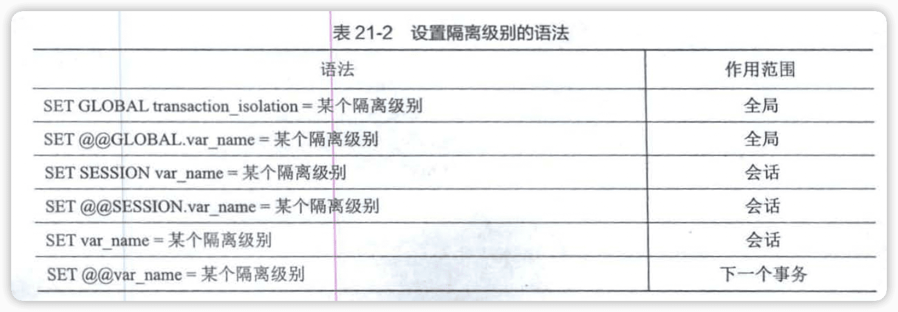

### 21.3 MVCC原理

#### 版本链

聚簇索引记录中包含两个必要的隐藏列：

- `trx_id`：一个事务每次对某条聚簇索引记录进行改动时，都会把该事务的事务id赋值给这个隐藏列。
- `roll_pointer`：每次对某条聚簇索引记录进行改动时，都会把旧的版本写入到undo日志。这个隐藏列相当于一个指针，可通过它找到该记录修改前的信息。

**多版本并发控制（Multi-Version Concurrency COntrol，MVCC）**


#### ReadView

> 核心问题：需要判断版本链中的那个版本是当前事务可见的。

ReadView（“一致性试图”）包含：

- `m_ids`：在生成ReadView时，当前系统中活跃的读写事务的事务id列表。
- `min_trx_id`：在生成ReadView时，当前系统中活跃的读写事务中最小的事务id；也就是`m_ids`中的最小值。
- `max_trx_id`：在生成ReadView时，系统应该分配给下一个事务的事务id值。
- `creator_trx_id`：生成该ReadView 的事务的事务id。

有了这个ReadView后，在访问某条记录时，只需要按照下面的步骤来判断记录的某个版本是否可见：

- 如果被访问版本的`trx_id`属性值与ReadView 中的`creator_trx_id`值相同，意味着当前事务在访问它自己修改过的记录，所以该版本可以被当前事务访问。

- 如果被访问版本的`trx_id`属性值小于ReadView 中的`min_trx_id`值，表明生成该版本的事务在当前事务生成ReadView前己经提交，所以该版本可以被当前事务访问。
- 如果被访问版本的`trx_id`属性值大于或等于ReadView中的`max_trx_id`值，表明生成该版本的事务在当前事务生成ReadView后才开启，所以该版本不可以被当前事务访问。
- 如果被访问版本的`trx_id`属性值在ReadView的`min_trx_id`和`max_trx_id`之间，则需要判断`trx_id`属性值是否在`m_ids`列表中。如果在，说明创建ReadView时生成该版本的事务还是活跃的，该版本不可以被访问；如果不在，说明创建ReadView时生成该版本的事务已经被提交，该版本可以被访问。

如果某个版本的数据对当前事务不可见，那就顺着版本链找到下一个版本的数据，并继续执行上面的步骤来判断记录的可见性；依此类推，直到版本链中的最后一个版本。如果记录的最后一个版本也不可见，就意味着该条记录对当前事务完全不可见，查询结果就不包含该记录。

在MySQL中，READ COMMITTED 与 REPEATABLE READ 隔离级别之间一个非常大的区别就是它们**==生成ReadView的时机不同==**。

🔖

##### 1.Read Committed——每次读取数据前都生成一个ReadView


##### 2.Repeatable Read——在第一次读取数据时生成一个ReadView


#### 二级索引与MVCC

只有在聚簇索引记录中才有`trx_id`和`roll_pointer`隐藏列。<u>如果某个查询语句是使用二级索引来执行查询的，该如何判断可见性呢？</u>

- 步骤1：二级索引页面的Page Header部分有一个名为`PAGE_MAX_TRX_ID`的属性，每当对该页面中的记录执行增删改操作时，如果执行该操作的事务的事务id大于`PAGE_MAX_TRX_ID`属性值，就会把`PAGE_MAX_TRX_ID`属性设置为执行该操作的事务的事务id。这也就意味着`PAGE_MAX_TRX_ID`属性值代表着修改该二级索引页面的最大事务id是什么。当 SELECT 语句访问某个二级索引记录时，首先会看一下对应的ReadView 的`min_trx_id`是否大于该页面的`PAGE_MAX_TRX_ID`属性值。如果是，说明该页面中的所有记录都对该 ReadView 可见；否则就得执行步骤2，在回表之后再判断可见性。

- 步骤2：利用二级索引记录中的主键值进行回表操作，得到对应的聚簇索引记录后再按照前面讲过的方式找到对该 ReadView 可见的第一个版本，然后判断该版本中相应的二级索引列的值是否与利用该二级素引查询时的值相同。本例中就是判断找到的第一个可见版本的 name 值是不是，‘刘备’。如果是，就把这条记录发送给客户端（如果WHERE 子句中还有其他搜素条件的话还需继续判断），否则就跳过该记录。

#### MVCC小结

MVCC指在使用Read Committed、Repeatable Read这两种隔离级别的事务执行普通的Select操作时，访问记录的版本链的过程。

### 21.4 关于purge 🔖

为了节约存储空间，我们应该在合适的时候把update undo日志以及仅仅被标记为删除的记录彻底删除掉，这个删除操作就称为**purge**（净化）。


### 21.5 总结

并发的事务在运行过程中会出现一些可能引发一致性问题的现象，具体如下（由于SQL标准中对脏写、脏读、不可重复读以及幻读的定义比较模糊，本书采用论文 A Critigue of ANs/$2L Isolation Levels 中对于胜写、脏读、不可重复读以及幻读现象的定义)。

- 脏写：一个事务修改了另一一个未提交事务修改过的数据。
- 脏读：广义解释是一个事务读到了另一个未提交事务修改过的数据。它也有对应的严格解释。
- 不可重复读：广义解释是一个事务修改了另一个未提交事务读取的数据。它也有对应的严格解释，请到本章前文参考详情。
- 幻读：一个事务先根据某些搜索条件查询出一些记录，在该事务未提交时，另一个事务写入了一些符合那些搜素条件的记录。它也有对应的严格解释。

SOL标准中的4种隔离级别如下所示。

- READ UNCOMMITTED：可能发生脏读、不可重复读和幻读现象。

- CREAD COMMITTED：可能发生不可重复读和幻读现象，但是不可能发生脏读现象。
- REPEATABLE READ：可能发生幻读现象，但是不可能发生脏读和不可重复读的现象。
- SERIALIZABLE：各种现象都不可以发生。

实际上，MySQL 在REPEATABLE READ 隔离级别下是可以在很大程度上禁止出现幻读现象的。

下面的语句用来设置事务的隔离级别：

```mysql
SET [GLOBAL|SESSION] TRANSACTION ISOLATION LEVEL level;
```

聚簇索引记录和 undo 日志中的 roll_pointer 属性可以串连成一个记录的版本链。

通过生成ReadView来判断记录的某个版本的可见性，其中 READ COMMITTD 在每一次进行普通 SELECT 操作前都会生成一个ReadView，而 REPEATABLE READ 只在第一次进行普通 SELECT 操作前生成一个 ReadView，之后的查询操作都重复使用这个 ReadView。

当前系统中，如果最早生成的ReadView 不再访问undo 日志以及打了删除标记的记录，则可以通过purge操作将它们清除。


## 22 工作面试老大难——锁

### 22.1 解决并发事务带来问题的两种基本方式

#### 写-写情况

在写一写情况下会发生脏写的现象，任何一种隔离级别都不允许这种现象的发生。所以在多个未提交事务相继对一条记录进行改动时，需要让它们**排队执行**。这个排队的过程其实是通过**==为该记录加锁==**来实现的。这个“锁〞本质上是一个**内存中的结构**，在事务执行之前本来是没有锁的，也就是说一开始是没有锁结构与记录进行关联的。

当一个事务想对这条记录进待改动时，首先会看看内存中有没有与这条记录关联的锁结构：如果没有，就会在内存中生成一个锁结构与之关联。


锁结构中两个比较重要的属性：

- ==trx信息==：表示这个锁与哪个事务关联
- ==is_waiting==：表示当前事务是否在等待

在事务T1改动这条记录前，就生成了一个锁结构与该记录关联。因为之前没有别的事务为这条记录加锁，所以 is_waiting 属性就是 false。把这个场景称为**获取锁成功**，或者**加锁成功**，然后就可以继续执行操作了。

在事务T1提交之前，另一个事务T2也想对该记录进行改动，那么T2先去看看有没有锁结构与这条记录关联。在发现有一个锁结构与之关联后，T2也生成了一个锁结构与这条记录关联，不过锁结构的is_waiting 属性值为 true，表示需要等待。把这个场景称为**获取锁失败**，或者**加锁失败**，或者没有成功地获取到锁。

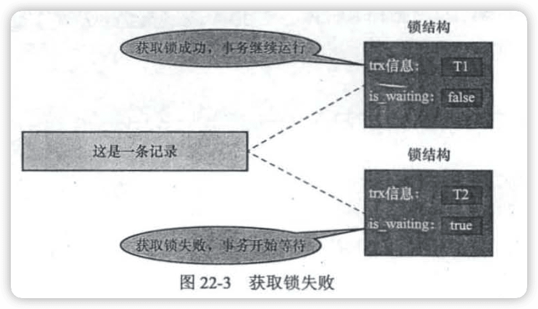

事务T1提交之后，就会把它生成的锁结构释放掉，然后检测一下还有没有与该记录关联的锁结构。结果发现了事务T2还在等待获取锁，所以把事务T2对应的锁结构的 is_waiting 属性设置为false，然后把该事务对应的线程唤醒，让T2继续执行。此时事务T2就算获取到锁了。


> 总结几种说法：
>
> - 获取锁成功，或者加锁成功：在内存中生成了对应的锁结构，而且锁结构的is_ waiting属性为 false，也就是事务可以继续执行操作。当然并不是所有的加锁操作都需要生成对应的锁结构，有时候会有一种 **“加隐式锁〞**的说法。隐式锁并不会生成实际的锁结构，但是仍然可以起到保护记录的作用。把为记录添加隐式锁的情况也认为是获取锁成功 （后文会详细唠叨隐式锁)。
> - 获取锁失败，或者加锁失败，或者没有获取到锁：在内存中生成了对应的锁结构，不过锁结构的 is_waiting 属性为 true， 也就是事务需要等待，不可以继续执行操作。
> - 不加锁：不需要在内存中生成对应的锁结构，可以直接执行操作。不包括为记录加隐式锁的情况。

#### 读-写或写-读情况🔖


#### 一致性读

事务利用MVCC进行的读取操作称为**一致性读（Consistent Read）**。

所有普通的Select语句在Read Committed、Repeatable Read隔离级别下都算是一致性读。

一致性读并不会对表中的任何记录进行加锁操作，其它事务可以自由地对表中的记录进行改动。

#### 锁定读🔖

##### 1.共享锁和独占锁

共享锁（Shared Lock，简称**==S锁==**）

独占锁/排他锁（Exclusive Lock，简称**==X锁==**）

##### 2.锁定读的语句

==锁定读（Locking Read）==

#### 写操作

写操作无非三种：

- DELETE：对一条记录执行 DELETE 操作的过程其实是先在 B+树中定位到这条记录的位置，然后获取这条记录的叉锁，最后再执行 delete mark 操作。也可以把这个“先定位待删除记录在B+树中的位置，然后获取这条记录的x锁的过程” 看成是一个获取X锁的锁定读。

- UPDATE：在对一条记录进行UPDATE操作时分为3种情况。
  1. 如果未修改该记录的键值并且被更新的列所占用的存储空间在修改前后未发生变化，则先在 B+树中定位到这条记录的位置，然后再获取记录的X锁，最后在原记录的位置进行修改操作。其实也可以把这个“先定位待修改记录在 B+树中的位置，然后再获取记录的X锁的过程”看成是一个获取X锁的锁定读。
  2. 如果未修改该记录的键值并且至少有一个被更新的列占用的存储空间在修改前后发生变化，则先在 B+树中定位到这条记录的位置，然后获取记录的X锁，之后将该记录彻底刪除掉《就是把记录彻底移入垃圾链表)，最后再插入一条新记录。可以把这个 “先定位待修改记录在 B+树中的位置，然后再获取记录的X 锁的过程” 看成是一个获取X锁的锁定读，与被彻底删除的记录关联的锁也会被转移到这条新插入的记录上来。
  3. 如果修改了该记录的键值，则相当于在原记录上执行 DELETE 操作之后再来一次INSERT 操作，加锁操作就需要按照 DELETE 和 INSERT 的规则进行了。
- INSERT：一般情况下，新插入的一条记录受隐式锁保护，不需要在内存中为其生成对应的锁结构。更多关于隐式锁的细节我们稍后再看。

> 在一些特殊情况 下 ISERT 探作也会在内存中生成锁结构。
>
> 在一个事务中加的锁一般在事务提交或中止时才会释放。

### 22.2 多粒度锁

前面提到都是针对记录的，称其为==行级锁或行锁==。那么事务在表级别进行加锁，称其为==表级锁或表锁==，表锁也可分为共享锁（S锁）和独占锁（X锁）。

🔖

意向锁（Intention Lock）

- 意向共享锁（Intention Shared Lock，简称IS锁）

- 意向独占锁（Intention Exclusive Lock，简称IX锁）

总结：==IS锁、IX锁是表级锁==，它们的提出仅仅为了在之后加表级别的S锁和X锁时可以**快速判断表中的记录是否被上锁**，以避免用遍历的方式来查看表中有没有上锁的记录；也就是说其实IS锁和IX锁是兼容的，IX锁和IX锁是兼容的。

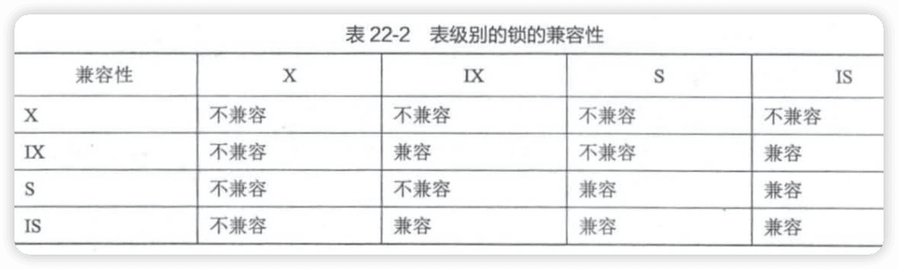

### 22.3 MySQL中的行锁和表锁

#### 22.3.1 其它存储引擎中的锁


#### 22.3.2 InnoDB中的锁

##### 1.InnoDB中的表级锁

- 表级别的S锁、X锁


- 表级别的IS锁、IX锁


- 表级别的Auto-INC锁


##### 2.InnoDB中的行级锁🔖

行级锁也叫记录锁

即使对同一条记录加行锁，如果记录的类型不同，起到的功效也是不同的。


#### 22.3.3 InnoDB锁的内存结构🔖🔖

对一条记录加锁的本质就是==在内存中创建一个锁结构与之关联==（隐式锁除外）。

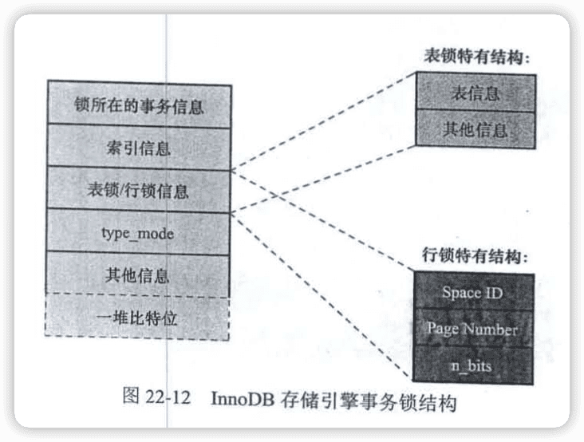


### 22.4 语句加锁分析

```mysql
Alter Table hero Add Index indx_name (name);
```

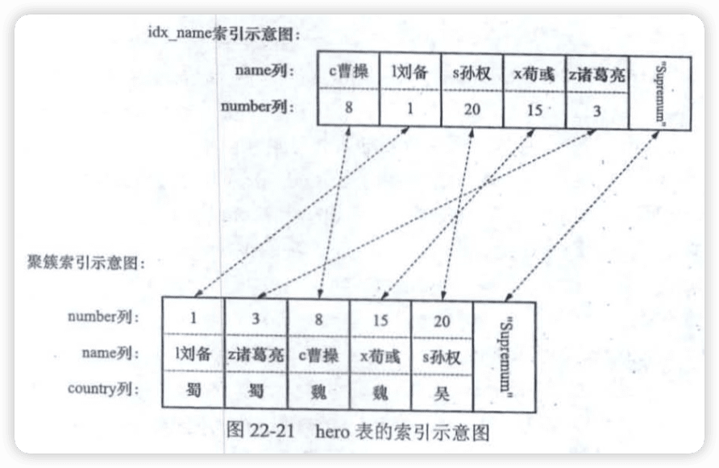

#### 1️⃣普通的Select语句


#### 2️⃣锁定读的语句


#### 3️⃣半一致性读的语句

半一致性读的语句（Semi-COnsistent Read）是一种夹在一致性读和锁定读之间的读取方式。


#### 4️⃣Insert语句


##### 1.遇到重复键（duplicate key）


##### 2.外键检查

```mysql
Create Table horse (
	number Int Primary Key,
  horse_name Varchar(100),
  Foreign Key (number) References hero(number)
) Engine=InnoDB Charset=utf8;
```


### 22.5 查看事务加锁情况

#### 使用information_schema数据库中的表索取锁信息

- **INNODB_TRX**表存储了InnoDB当前正在执行的事务信息。


- **INNODB_LOCKS**


- **INNODB_LOCK_WAITS**


#### 使用Show Engine Innodb Status获取锁信息


```
mysql> Show Engine Innodb Status\G;
```


### 22.6 死锁

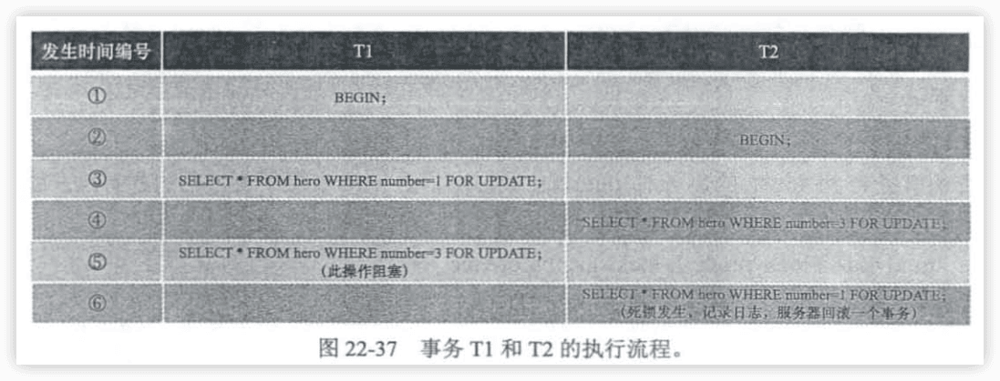


### 22.7 总结

==MVCC==和==加锁==是解决并发事务带来的一致性问题的两种方式。

共享锁简称为S锁，独占锁简称为X锁。S锁与S锁兼容;X锁与S锁不兼容，与X锁也不兼容。

事务利用MVCC进行的读取操作称为==一致性读==，在读取记录前加锁的读取操作称为==锁定读==。设计InnoDB的大叔提供了下面两种语法来进行锁定读:

- `SELECT...LOCK IN SHARE MODE`语句为读取的记录加S锁;
- `SELECT...FOR UPDATE` 语句为读取的记录加X锁。

INSERT 语句一般情况下不需要在内存中生成锁结构，并单纯依靠隐式锁保护插入的记录。UPDATE 和DELETE语句在执行过程中，在B+树中定位到待改动记录并给该记录加锁的过程也算是一个锁定读。

IS、IX锁是表级锁，它们的提出仅仅为了在之后加表级别的S锁和X锁时，可以快速判断表中的记录是否被上锁，以避免用遍历的方式来查看表中有没有上锁的记录。

InnoDB中的行级锁类型有下面这些。

- Record Lock :被我们戏称为**正经记录锁**，只对记录本身加锁。
- Gap Lock:锁住记录前的间隙，防止别的事务向该间隙插入新记录。
- Next-Key Lock:Record Lock和Gap Lock的结合体，既保护记录本身，也防止别的事务向该间隙插入新记录。
- Insert Intention Lock:很“鸡肋”的锁，仅仅是为了解决“在当前事务插入记录时因碰到别的事务加的gap锁而进入等待状态时，也生成一个锁结构”而提出的。某个事务获取一条记录的该类型的锁后，不会阻止别的事务继续获取该记录上任何类型的锁。
- 隐式锁:依靠记录的trxid属性来保护不被别的事务改动该记录。

InnoDB存储引擎的锁都在内存中对应着一个锁结构。有时为了节省锁结构，会把符合下面条件的锁放到同一个锁结构中:

- 在同一个事务中进行加锁操作;
- 被加锁的记录在同一个页面中;
- 加锁的类型是一样的;
- 等待状态是一样的。

语句加锁的情况受到所在事务的隔离级别、语句执行时使用的索引类型、是否是精确匹配、是否是唯一性搜索、具体执行的语句类型等情况的制约，需要具体情况具体分析。

可以通过information_schema数据库下的INNODB_TRX、INNODB_LOCKS、INNODB_LOCK_WAITS表来查看事务和锁的相关信息，也可以通过SHOW ENGINE INNODB STATUS语句查看事务和锁的相关信息。

不同事务由于互相持有对方需要的锁而导致事务都无法继续执行的情况称为==死锁==。死锁发生时，InnoDB会选择一个较小的事务进行回滚。可以通过查看**死锁日志**来分析死锁发生过程。


