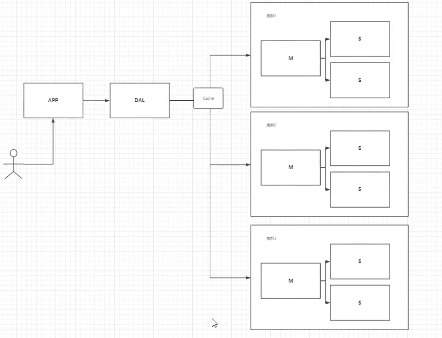
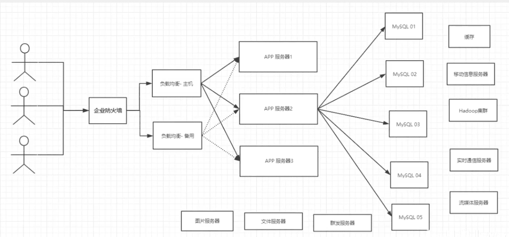

# Redis最新超详细版教程通俗易懂


https://www.bilibili.com/video/BV1S54y1R7SB

学习方式：先基本的理论学习，然后将知识融会贯通。


## NoSQL概述

### 为什么要使用NoSQL？

大数据时代，一般数据库无法进行分析处理了！2006年Hadoop

> 1、单机MySQL的年代

这种情况整个网站的瓶颈是什么？

- 数据量如果太大，一个机器放不下
- 数据的索引（B+ Tree），一个机器内存也放不下
- 访问量（读写混合），一个服务器承受不了

> 2、Memcached（缓存） + MySQL + 垂直拆分(读写分离)

网站80%的情况都是在读，使用缓存来保证效率！

发展过程：优化数据结构和索引 --> 文件缓存（IO） --> Memcached（当时最热门的技术！）


> 3、分库分表 + 水平拆分 + MySQL集群

技术的业务在发展的同时，对人的要求也越来越高！

**本质：数据库（读、写）**

早些年MyISAM：表锁，十分影响效率！高并发下就会出现严重的锁问题
转战Innodb：行锁
慢慢的就开始使用分库分表来解决**写**的压力 ！MySQL在哪个年代推出了表分区（这个并没有多少公司使用）！ 

MySQL的集群，很好满足哪个年代的所有需求！



（M、S代表主从）

> 4、如今最近的年代

2010--2020 十年之间，世界已经发生了翻天覆地的变化；

MySQL等关系型数据库就不够用了！数据量很多，变化很快~！

> 目前一个基本的互联网项目！



> 为什么要用NoSQL？

用户的个人信息、社交网络、地理位置，用户自己产生的数据，用户日志等等爆发式增长！

NoSQL就是用来处理以上情况！


### 什么是NoSQL

NoSQL = Not Only SQL（不仅仅是SQL）

泛指非关系型数据库

关系型数据库：表格，行，列

很多的数据类型用户的个人信息、社交网络、地理位置。这些数据类型的存储不需要一个固定的格式！不需要多余的操作就可以横向扩展！Map<Strign, Object>使用键值对来控制！

#### NoSQL特点

解耦

1. 方便扩展（数据之间没有关系，很好扩展！）

2. 大数量高性能（Redis一秒写8万次，读取11万，NoSQL的缓存记录级，是一种细粒度的缓存，性能会比较高！）

3. 数据类型是多样性的！（不需要事先设计数据库！随取随用Q如果是数据量十分大的表，很多人就无法设计了！）

4. 传统RDBMS 和 NoSQL

   > 传统RDBMS
   >
   > - 结构化组织
   > - SQL
   > - 数据和关系都存在单独的表中，row col
   > - 数据操作，数据定义语言
   > - 严格的一致性
   > - 基础的事务
   > - ...

   > NoSQL
   >
   > - 不仅仅是数据
   > - 没有固定的查询语言
   > - 键值对存储，列存储，文档存储，图形数据库（社交关系）
   > - 最终一致性
   > - CAP定理 和 BASE（异地多活）
   > - 高性能、高可用、高可扩展
   > - ...

> 了解：3V + 3高

大数据时代的3v：主要是描述问题的

1. 海量（Volume）
2. 多样（Variety）
3. 实时（Velocity）

大数据时代的3高：主要是对程序的要求

1. 高并发
2. 高可扩（随时水平拆分，机器不够了，可以扩展机器解决）
3. 高性能（保证用户体验和性能）


公司中的实践：NoSQL + RDBMS一起使用


### 阿里巴巴演进分析


技术急不得，越是慢慢学，才能越扎实


架构师：没有什么中间加一层不能解决的。

淘宝商品页面：

```bash
# 1、商品的基本信息
	名称、	价格、商家信息：
	关系型数据就可以解决了！MySQL/Oracle（淘宝早点就去IOE了！~王坚：文章：阿里云的这群疯子）
	淘宝内部的MySQL不是大家用的MySQL
	
# 2、商品的描述、评论（文字比较多）
	文档型数据库汇中，MongoDB
	
# 3、图片
	分布式文件系统 FastDFS
	- 淘宝自己的 TFS
	- Google的 GFS
	- Hadoop HDFS
	- 阿里云的  oss

# 4、商品的关键字（搜索）
	- 搜索引擎  solr  elasticsearch
	- 阿里的 ISearch（多隆，阿里第一个程序员）
	
# 5、商品热门的波段信息
	- 内存数据库
	- Redis Tair memcahe...
  
# 6、商品的交易，外部的制服接口
	- 三方应用
```


大型互联网应用问题：

- 数据类型太多了
- 数据源繁多，经常重构
- 数据要改造，


### NoSQL的四大分类

KV键值对：

- 新浪：**Redis**
- 美团：Redis + Tair
- 阿里、百度：Redis + memecache

文档型数据库（bson格式 和json一样）：

- **MongoDB**（一般必须要掌握）
  - MongoDB是一个基于分布式文件存储的数据库，C++编写，主要用来处理大量的文档！
  - MongoDB介于关系型数据库和非关系数据库中中间的产品！它是非关系数据库中功能最丰富的，最想关系型数据库的
- ConchDB

列存储数据库（mysql等都是行存储形式）

- **HBase**

- 分布式文件系统

图关系数据库

- 它不是存图形，而是关系，比如：朋友圈社交网络、广告推荐！
- **Neo4j**，InfoGrid


敬畏之心可以使人进步！

活着的意义？追求幸福，探索未知。


## Redis入门

[官方在线redis环境](https://try.redis.io/)

### 概述

Redis（**Re**mote **Di**ctionary **S**erver )，即**远程字典服务**，是一个开源的使用ANSI C语言编写、支持网络、可基于内存亦可持久化的日志型、Key-Value数据库，并提供多种语言的API。

免费和开源，是当下最热门的NoSQL技术之一。

Redis 是一个开源（BSD许可）的，内存中的数据结构存储系统，它可以用作**数据库、缓存和消息中间件**。

> Redis能干嘛？

1. 内存存储、持久化（rdb、aof）
2. 效率高，可以用户高速缓存
3. 发布订阅系统
4. 地图信息分析
5. 计时器、计数器（浏览量！）
6. ...

> 特性

1. 多样的数据类型
2. 持久化
3. 集群
4. 事务

。。。

https://redis.io/

http://www.redis.cn/

https://github.com/redis/redis


五大数据类型：

三种特殊数据类型：geospatial, hyperloglog, bitmaps


### 安装


```
> ping
PONG
```


#### linux

`/usr/local/bin/redis-*`


#### mac

使用homebrew安装，默认位置：

```
/usr/local/Cellar/redis
/usr/local/bin/redis-*
```

默认配置文件：

```
/usr/local/etc/redis.conf
```

表示是否在后台启动

```
daemonize no
```

可通过制定配置文件启动：

```bash
$ redis-server redis.conf
77066:C 14 Oct 2021 19:16:05.200 # oO0OoO0OoO0Oo Redis is starting oO0OoO0OoO0Oo
77066:C 14 Oct 2021 19:16:05.200 # Redis version=5.0.5, bits=64, commit=00000000, modified=0, pid=77066, just started
77066:C 14 Oct 2021 19:16:05.200 # Configuration loaded
```

使用redis-cli链接测试：

```bash
$ redis-cli -p 6379
127.0.0.1:6379>
```

查看redis进程是否开启：

```bash
$ ps -ef | grep redis
  501 77067     1   0  7:16下午 ??         0:00.64 redis-server 127.0.0.1:6379
  501 77124 58804   0  7:17下午 ttys000    0:00.01 redis-cli -p 6379
  501 77187 58193   0  7:19下午 ttys003    0:00.00 grep --color=auto --exclude-dir=.bzr --exclude-dir=CVS --exclude-dir=.git --exclude-dir=.hg --exclude-dir=.svn redis
```

如何关闭redis服务？

```bash
127.0.0.1:6379> shutdown  # 关闭redis-server
not connected> exit  # 退出redis-cli

$ ps -ef | grep redis
  501 77272 58804   0  7:21下午 ttys000    0:00.01 grep --color=auto --exclude-dir=.bzr --exclude-dir=CVS --exclude-dir=.git --exclude-dir=.hg --exclude-dir=.svn redis
```


之后会使用单机多redis启动集群测试

### 测试性能


`redis-benchmark`  

```
redis-benchmark -h localhost -p 6379 -c 100 -n 100000
```


### Redis 基础的知识

默认共有16个数据，默认使用第0个，可以使用select进行切换数据库

```bash
127.0.0.1:6379> select 2
OK
127.0.0.1:6379[2]> dbsize
(integer) 0
127.0.0.1:6379[2]> set name andy
OK
127.0.0.1:6379[2]> dbsize
(integer) 1
```

`keys *`

`flushdb` 清除当前数据库

`flushall` 清除全部数据库

`exists name`	键是否存

`clear` 	

> Redis 6之前是单线程的

Redis是很快的，Redis是基于内存操作，CPU不是Redis性能瓶颈，Redis的瓶颈是根据机器的内存和网络带宽，既然可以使用单线程来实现，就使用单线程了。

**Redis为什么单线程还这么快？**

1、误区1：高性能的服务器一定是多线程的？
2、误区2：多线程（CPU上下文会切换！）一定比单线程效率高！ 

CPU》内存》硬盘的速度要有所了解！
核心：redis是将所有的数据全部放在内存中的，所以说使用单线程去操作效率就是最高的，多线程（CPU上下文会切换：耗时的操作！！！），对于内存系统来说，如果没有上下文切换效率就是最高的！多次读写都是在一个CPU上的，在内存情况下，这个就是最佳的方案！


##五大基本数据类型

### Redis-Key

`move name 1`：从当前数据库移除key为name的值（1代表当前数据库）

`expire name 10`：设置key为name的值10s后过期

`ttl name`：查看当前key的剩余过期时间

`type name`： 查看类型

`clear`

### String

```bash
append key ""  # 如果key不存在，就相当于set
strlen key
incr views
decr views
incrby views 2 # 步长，指定增量
decrby views 10 
getrange key 0 3  # 获取一段字符串 闭区间的 [0, 3]
getrange key 0 -1 # 获取全部
setrange key 1 xx # 替换指定位置开始的字符串
# setex (set with expire) # 设置过期时间
# setnx (set if not exist) # 如果不存在才设置(在分布式锁中会常用)
set key3 30 "hello"  # 设置key3位hello，过期时间30秒
setnx mykey "redis"  # 如果myke不存在，创建mykey，否者创建失败

mset k1 v1 k2 v2 k3 v3
mget k1 k2 k3
msetnx k1 v1 k4 v4   # 原子性的操作

127.0.0.1:6379[2]> getset db redis  # 先获取再设置，如果不存在返回nil，
(nil)
127.0.0.1:6379[2]> get db
"redis"
127.0.0.1:6379[2]> getset db mongodb # 如果存在，则获取原来的值，并设置新的值
"redis"
127.0.0.1:6379[2]> get db
"mongodb"


```

```bash
# 对象
set user:1 {name:zhangsan, age:3}  # 设置一个user:1对象值为json字符来保存一个对象
# 这里的key是一个巧妙的设计： user:{id}:{filed} 

```


数据结构是相通的！

String类似的使用场景：value也可以是数字

- 计数器
- 统计多单位的数量   uid:28354097:follow incr
- 粉丝数
- 对象缓存存储


### List（列表）

栈、队列、阻塞队列

所有list命令都是L开头的

```bash
lpush
lrange
rpush
lpop
rpop
lindex 
llen
lrem list 1 value # 移除list集合中指定个数的value
ltrim
rpoplpush
lset 		# 将列表中指定下标的值替换为另外一值，更新操作
linsert	# 将某个具体的value插入到列中某个元素的前面或者后面
```


```bash
127.0.0.1:6379[2]> lpush list one
(integer) 1
127.0.0.1:6379[2]> lpush list two
(integer) 2
127.0.0.1:6379[2]> lpush list three
(integer) 3
127.0.0.1:6379[2]> lrange list 0 -1
1) "three"
2) "two"
3) "one"
127.0.0.1:6379[2]> rpush list rth
(integer) 4
127.0.0.1:6379[2]> lrange list 0 -1
1) "three"
2) "two"
3) "one"
4) "rth"
127.0.0.1:6379[2]> lpop list
"three"
127.0.0.1:6379[2]> rpop list
"rth"
127.0.0.1:6379[2]> lrange list 0 -1
1) "two"
2) "one"
127.0.0.1:6379[2]> lindex list 0		# 通过下标获得list中的某一个值
"two"
127.0.0.1:6379[2]> lindex list 1
"one"
127.0.0.1:6379[2]> llen list
(integer) 2
####

127.0.0.1:6379[2]> lrange mylist 0 -1
1) "hello4"
2) "hello3"
3) "hello2"
4) "hello1"
5) "hello"
127.0.0.1:6379[2]> ltrim mylist 1 2  # 
OK
127.0.0.1:6379[2]> lrange mylist 0 -1
1) "hello3"
2) "hello2"

##########
rpoplpush   # 移除列表的最后一个元素，将它移动新的列表

127.0.0.1:6379[2]> lrange mylist 0 -1
1) "hello2"
2) "hello1"
3) "hello"
127.0.0.1:6379[2]> rpoplpush mylist myotherlist
"hello"
127.0.0.1:6379[2]> lrange mylist 0 -1
1) "hello2"
2) "hello1"

#############
redis> RPUSH mylist "Hello"
(integer) 1
redis> RPUSH mylist "World"
(integer) 2
redis> LINSERT mylist BEFORE "World" "There"
(integer) 3
redis> LRANGE mylist 0 -1
1) "Hello"
2) "There"
3) "World"

```


### Set（集合）

无序不重复

```
sadd
smembers
sismember
scard			# 获取set集合中的元素个数
srem			# 移除某个元素
srandmember myset # 随机抽出指定个数元素
srandmember myset 2
spop myset   # 随机删除一个元素
smove myset myset2 value  # 移动myset中元素value到myset2中

数学几何
- 差集
- 交集
- 并集（共同关注）
sdiff set1 set2			# set1中与set2不同的元素
sinter set1 set2		# set1中与set2相同的元素
sunion set1 set2		# set1和set2元素合并
```


```bash
127.0.0.1:6379[2]> sadd myset andy
(integer) 1
127.0.0.1:6379[2]> sadd myset hello
(integer) 1
127.0.0.1:6379[2]> sadd myset lovefeifei
(integer) 1
127.0.0.1:6379[2]> SMEMBERS myset
1) "lovefeifei"
2) "hello"
3) "andy"
127.0.0.1:6379[2]> SISMEMBER myset hello
(integer) 1
127.0.0.1:6379[2]> SISMEMBER myset world
(integer) 0
127.0.0.1:6379[2]> SCARD myset
(integer) 3
127.0.0.1:6379[2]> SREM myset hello
(integer) 1
```

> 微博，A用户将所有关乎的人放在一个set集合中，将粉丝放到另外一个集合中。
>
> 共同关注，共同爱好，二度好友，推荐好友！

### Hash（哈希）

Map集合，key-map!

```
hset
hget 
hmset
hmget 
hgetall
hdel
hlen
hexists myhash field
hkeys myhash
hvals myhash
hincrby myhash field []
hdecr
hsetnx

```

```bash
127.0.0.1:6379[2]> hset myhash field1 andy
(integer) 1
127.0.0.1:6379[2]> hget myhash field1
"andy"
127.0.0.1:6379[2]> hmset myhash field1 hello field2 world
OK
127.0.0.1:6379[2]> hmget myhash field1 field2
1) "hello"
2) "world"
127.0.0.1:6379[2]> hgetall myhash
1) "field1"
2) "hello"
3) "field2"
4) "world"
127.0.0.1:6379[2]> hdel myhash field1
(integer) 1
```

> hash可作为变更数据 ，尤其是用户信息之类的，经常变动的信息！
>
> hash更适合于对象的存储，string更加适合字符串存储！
>
> ```bash
> > hset user:1 name andy
> ```
>
> 


### zset（有序集合）

在set的基础上，增加了一个用户排序的值

```
zadd 
zrange
zrevrange
zrangebyscore
zrem
zcard
zcount
```

```bash
127.0.0.1:6379[2]> zadd myzset 1 one
(integer) 1
127.0.0.1:6379[2]> zadd myzset 2 two 3 three
(integer) 2
127.0.0.1:6379[2]> zrange myzset 0 -1
1) "one"
2) "two"
3) "three"
127.0.0.1:6379[2]> zrevrange myzset 0 -1
1) "three"
2) "two"
3) "one"
127.0.0.1:6379[2]> zadd salary 2500 xiaoming
(integer) 1
127.0.0.1:6379[2]> zadd salary 5000 xiaorong
(integer) 1
127.0.0.1:6379[2]> zadd salary 500 xiaokuang
(integer) 1
127.0.0.1:6379[2]> zrangebyscore salary -inf +inf  # inf表示无穷， `-inf +inf`表示从小到大排序显示所有
1) "xiaokuang"
2) "xiaoming"
3) "xiaorong"
127.0.0.1:6379[2]> zrangebyscore salary -inf +inf withscores    
1) "xiaokuang"
2) "500"
3) "xiaoming"
4) "2500"
5) "xiaorong"
6) "5000"
127.0.0.1:6379[2]> zrangebyscore salary -inf 2501 withscores
1) "xiaokuang"
2) "500"
3) "xiaoming"
4) "2500"
127.0.0.1:6379[2]> zcount myzset 1 3
(integer) 3
```

> zset应用场景：
>
> 存储班级成绩表、工资表排序
>
> 排行榜，取Top

## 三种特殊数据类型

### geopatial 地理位置

朋友的定位，附近的人，打车距离计算？


只有6个命令：

1. `geoadd`

```
geoadd key longitude latitude member # 添加地理位置
```

>规则：两级无法直接添加，可以下载城市数据，通过java一次性导入。
>
>- 有效的经度从-180度到180度。
>- 有效的纬度从-85.05112878度到85.05112878度。

```bash
geoadd china:city 116.40 39.90 beijing
geoadd china:city 121.47 31.23 shanghai
geoadd china:city 106.50 29.53 chongqing 114.05 22.52 shengzhen
geoadd china:city 120.16 30.24 hangzhou 108.96 34.26 xian

```

2. `geopos`

```
geopos china:city beijing
```

```bash
127.0.0.1:6379[2]> geopos china:city beijing
1) 1) "116.39999896287918091"
   2) "39.90000009167092543"
```


3. `geodist`  亮点之间的距离

```bash
127.0.0.1:6379[2]> geodist china:city shanghai beijing
"1067378.7564"   # 查看上海到北京的直线距离
127.0.0.1:6379[2]> geodist china:city shanghai beijing km
"1067.3788"
```

4. `georadius`   

```
georadius key longitude latitude radius
```

以给定的经纬度为中心， 返回键包含的位置元素当中， 与中心的距离不超过给定最大距离的所有位置元素。

我附近的人？

获得指定数量的人

```bash
127.0.0.1:6379[2]> georadius china:city 110 30 500 km  # 以100,30这个点为中心，寻找方圆500km内的城市
1) "chongqing"
2) "xian"
127.0.0.1:6379[2]> georadius china:city 110 30 500 km withcoord withdist
1) 1) "chongqing"
   2) "341.9374"
   3) 1) "106.49999767541885376"
      2) "29.52999957900659211"
2) 1) "xian"
   2) "483.8340"
   3) 1) "108.96000176668167114"
      2) "34.25999964418929977"
127.0.0.1:6379[2]> georadius china:city 110 30 500 km withcoord withdist count 1
1) 1) "chongqing"
   2) "341.9374"
   3) 1) "106.49999767541885376"
      2) "29.52999957900659211"      
```

5. `georaduisbymember` 

这个命令和 GEORADIUS 命令一样， 都可以找出位于指定范围内的元素， 但是 GEORADIUSBYMEMBER 的中心点是由给定的位置元素决定的

```bash
127.0.0.1:6379[2]> GEORADIUSBYMEMBER china:city shanghai 400 km
1) "hangzhou"
2) "shanghai"
```

6. `geohash`

把二维的经纬度转换为一维11位的hash字符串，如果两个字符串越接近，那么则距离越近！（很少这么用）

```bash
127.0.0.1:6379[2]> GEOHASH china:city shanghai
1) "wtw3sj5zbj0"
127.0.0.1:6379[2]> GEOHASH china:city shanghai xian
1) "wtw3sj5zbj0"
2) "wqj6zky6bn0"
```

GEO底层的实现原理就是zset，可以使用zset的命令来操作geo！

```bash
127.0.0.1:6379[2]> zrange china:city 0 -1
1) "chongqing"
2) "xian"
3) "shengzhen"
4) "hangzhou"
5) "shanghai"
6) "beijing"
127.0.0.1:6379[2]> zrem china:city beijing
(integer) 1
127.0.0.1:6379[2]> zrange china:city 0 -1
1) "chongqing"
2) "xian"
3) "shengzhen"
4) "hangzhou"
5) "shanghai"
```


### Hyperloglogs基数统计

> 什么是基数？
>
> 不重复的元素
>
> 可以接受误差

优点：占用的内存是固定，2^64不同的元素的计数，只需要花费12KB的内存（固定的）！

**网页的UV（一个访问一个网站多次，但是还是算作一个人）**

传统的方式，set保存用户的id，然后就可以统计set中的元素数量作为UV！但这种方式如果保存大量用户id，就会比较麻烦！我们的目的是为了计数，而不是保存用户id。

0。81%错误率（官方）！统计UV，可以忽略不计


```
pfadd 
pfcount
pfmerge
```

```bash
127.0.0.1:6379[2]> pfadd mykey a b c d e f g i j
(integer) 1
127.0.0.1:6379[2]> pfcount mykey
(integer) 9
127.0.0.1:6379[2]> pfadd mykey a b c d e f g h i j
(integer) 1
127.0.0.1:6379[2]> pfcount mykey
(integer) 10
127.0.0.1:6379[2]> pfadd mykey2 i j k c o e p y
(integer) 1
127.0.0.1:6379[2]> pfcount mykey2
(integer) 8
127.0.0.1:6379[2]> pfmerge mykey3 mykey mykey2
OK
127.0.0.1:6379[2]> pfcount mykey3
(integer) 14
```

> 统计数量，如果允许容错，那么一定可以使用Hyperloglogs


### Bitmaps 位图存储

> 位存储

统计用户信息，活跃，不活跃！登录、未登录！打卡

两个状态都可以使用Bitmaps！

Bitmaps位图，数据结构！都是操作二进制位进行记录，就只有0和1两个状态！

365天 = 365 bit  1字节 = 8bit  46个字节左右

```
setbit key offset value0
getbit 
bitcount key [start end]
```


使用bitmaps来记录周一到周日的打卡：

```bash
127.0.0.1:6379[2]> setbit sign 0 1
(integer) 0
127.0.0.1:6379[2]> setbit sign 1 0
(integer) 0
127.0.0.1:6379[2]> setbit sign 2 0
(integer) 0
127.0.0.1:6379[2]> setbit sign 3 1
(integer) 0
127.0.0.1:6379[2]> setbit sign 4 1
(integer) 0
127.0.0.1:6379[2]> setbit sign 5 0
(integer) 0
127.0.0.1:6379[2]> setbit sign 6 1
(integer) 0
```

查看某一天是否打卡：

```bash
127.0.0.1:6379[2]> getbit sign 1
(integer) 0
127.0.0.1:6379[2]> getbit sign 4
(integer) 1
```

统计打卡天数：

```bash
127.0.0.1:6379[2]> bitcount sign
(integer) 4
```


## 事务

Redis事务本质：一组命令的集合！一个事务中的所有命令都会被序列化，在事务执行过程的中，会按照顺序执行！

一次性、顺序性、排他性！执行一系列的命令！

```
--------- 队列 set set set 执行 ----------
```

**Redis事务没有隔离级别的概念！**

所有的命令在事务中，并没有直接执行！只有发起执行命令的时候才会执行！Exec

**Redis单条命令保存原子性的，但redis事务不保证原子性！**

redis事务的三个阶段：

- 开启事务（multi）
- 命令入队（...）
- 执行事务（exec）

```
multi
exec
discard
```


> 正常执行事务：

```bash
127.0.0.1:6379[2]> multi
OK
127.0.0.1:6379[2]> set k1 v1
QUEUED
127.0.0.1:6379[2]> set k2 v2
QUEUED
127.0.0.1:6379[2]> get k2
QUEUED
127.0.0.1:6379[2]> set k3 v3
QUEUED
127.0.0.1:6379[2]> exec
1) OK
2) OK
3) "v2"
4) OK
```

> 放弃事务

```bash
127.0.0.1:6379[2]> multi
OK
127.0.0.1:6379[2]> set k1 v1
QUEUED
127.0.0.1:6379[2]> set k2 v2
QUEUED
127.0.0.1:6379[2]> set k4 v4
QUEUED
127.0.0.1:6379[2]> discard  # 取消事务
OK
127.0.0.1:6379[2]> get k4 	# 事务队列中命令都不会被执行
(nil)
```

> 编译型异常（代码有问题！命令有错！），事务中所有的命令都不会执行！

```bash
127.0.0.1:6379[2]> multi
OK
127.0.0.1:6379[2]> set k1 v1
QUEUED
127.0.0.1:6379[2]> set k2 v2
QUEUED
127.0.0.1:6379[2]> set k3 v3
QUEUED
127.0.0.1:6379[2]> getset k3  # 错误的命令
(error) ERR wrong number of arguments for 'getset' command
127.0.0.1:6379[2]> set k4 v4
QUEUED
127.0.0.1:6379[2]> set k5 v5
QUEUED
127.0.0.1:6379[2]> exec  # 执行事务报错
(error) EXECABORT Transaction discarded because of previous errors.
127.0.0.1:6379[2]> get k5  # 所有命令都不会被执行
(nil)
```


> 运行时异常(`1/0`)，如果事务队列中存在语法性，那么执行命令的时候，其他命令是可以正常执行的，错误命令抛出异常！（所以所redis事务没有原子性）

```bash
127.0.0.1:6379[2]> set k1 "v1"
OK
127.0.0.1:6379[2]> multi
OK
127.0.0.1:6379[2]> incr k1
QUEUED
127.0.0.1:6379[2]> set k2 v2
QUEUED
127.0.0.1:6379[2]> set k3 v3
QUEUED
127.0.0.1:6379[2]> get k3
QUEUED
127.0.0.1:6379[2]> exec
1) (error) ERR value is not an integer or out of range   # 虽然第一条命令报错了，但是其它依旧正常执行成功了！
2) OK
3) OK
4) "v3"
127.0.0.1:6379[2]> get k2
"v2"
127.0.0.1:6379[2]> get k3
"v3"
```


### 监控  watch （可实现乐观锁）


**悲观锁**：很悲观，认为什么时候都会出问题，无论做什么都会加锁！

**乐观锁**：很乐观，认为什么时候都不会出问题，所以不会上锁！更新数据的时候去判断一下，在此期间是否有人修改过这个数据，（mysql中version，更新的时候比较version）

> redis监视测试

正常执行成功：

```bash
127.0.0.1:6379> set money 100
OK
127.0.0.1:6379> set out 0
OK
127.0.0.1:6379> watch money  # 监视money对象
OK
127.0.0.1:6379> multi  # 事务正常结束，数据期间没有发生变动，这个时候就正常执行成功！
OK
127.0.0.1:6379> decrby money 20
QUEUED
127.0.0.1:6379> incrby out 20
QUEUED
127.0.0.1:6379> exec
1) (integer) 80
2) (integer) 20
```

测试多线程修改值，使用watch可以当作redis的乐观锁操作！重新打开另外一个redis客服端：

```bash
$ redis-cli -p 6379
127.0.0.1:6379> watch money  # 监视 money
OK
127.0.0.1:6379> multi
OK
127.0.0.1:6379> decrby money 10
QUEUED
127.0.0.1:6379> incrby out 10
QUEUED
127.0.0.1:6379> exec  # 执行之前，另外一个线程，修改了money的值（比如在上面的客服端`set money 1000`），就会导致事务执行失败！
(nil)
```

解决办法就是先解除监视，然后重新监视（获取最新的值）：

```bash
127.0.0.1:6379> unwatch #1、如果发现事务执行失败，就先解锁
OK
127.0.0.1:6379> watch money #2、获取最新值，在此监视，select version
OK
127.0.0.1:6379> multi
OK
127.0.0.1:6379> decrby money 10
QUEUED
127.0.0.1:6379> incrby out 10
QUEUED
127.0.0.1:6379> exec #3、比对监视的值是否发生额变化，如果没有变化，那么可以执行成功，如果变了就执行失败
1) (integer) 990
2) (integer) 30
```


## Jedis

使用Java来操作Redis

> Jedis是Redis官方推荐的Java链接开发工具！使用Java操作Redis中间件！如果要使用Java操作redis，那么一定要对Jedis十分熟悉！
>
> https://github.com/redis/jedis
>
> 虽然SpringBoot新版已经不适用Jedis


1. 导入依赖

   ```xml
   <dependency>
     <groupId>redis.clients</groupId>
     <artifactId>jedis</artifactId>
     <version>3.2.0</version>
   </dependency>
   
   <dependency>
     <groupId>com.alibaba</groupId>
     <artifactId>fastjson</artifactId>
     <version>1.2.62</version>
   </dependency>
   ```

2. 编码测试

   链接数据库

   操作命令

   断开连接

> jedis的所有api命令，就是redis的命令，没有变化！ 


## Spingboot整合Redis

SpringBoot操作数据：spring-data，jpa、jdbc、mongodb、redis等

说明：在SpringBoot2.x之后，原来使用的jedis被替换为了lettuce。

jedis：采用直连，多个线程操作的话，是不安全的，如果想要避免不安全，使用jedis pool连接池！（像BIO模式）

lettuce：采用netty，实例可以在多个线程中进行共享，不存在线程不安全的情况！可以减少线程数据！（像NIO模式）


```properties
# SpringBoot所有的配置类，都有一个自动配置类 RedisAutoConfiguration
# 自动配置类都会绑定一个properties配置文件 RedisProperties


```


```java
@Configuration(proxyBeanMethods = false)
@ConditionalOnClass(RedisOperations.class)
@EnableConfigurationProperties(RedisProperties.class)
@Import({ LettuceConnectionConfiguration.class, JedisConnectionConfiguration.class })
public class RedisAutoConfiguration {

	@Bean
	@ConditionalOnMissingBean(name = "redisTemplate") // 我们可以自己定义一个redisTemplate来替换这个默认的！
	@ConditionalOnSingleCandidate(RedisConnectionFactory.class)
	public RedisTemplate<Object, Object> redisTemplate(RedisConnectionFactory redisConnectionFactory) {
    
// 默认的RedisTemplate没有过多的设置，redis对象传输都需要序列化！
// 两个泛型都是Object类型，之后需要强制转换为<String, Object>
		RedisTemplate<Object, Object> template = new RedisTemplate<>();
		template.setConnectionFactory(redisConnectionFactory);
		return template;
	}

	@Bean
	@ConditionalOnMissingBean // 由于String是redis中最常用的类型，所以单独提出来一个bean！
	@ConditionalOnSingleCandidate(RedisConnectionFactory.class)
	public StringRedisTemplate stringRedisTemplate(RedisConnectionFactory redisConnectionFactory) {
		StringRedisTemplate template = new StringRedisTemplate();
		template.setConnectionFactory(redisConnectionFactory);
		return template;
	}

}
```

> 整合测试


 `


`RedisTemplate`：

```java
public class RedisTemplate<K, V> extends RedisAccessor implements RedisOperations<K, V>, BeanClassLoaderAware {
    private boolean enableTransactionSupport = false;
    private boolean exposeConnection = false;
    private boolean initialized = false;
    private boolean enableDefaultSerializer = true;
    @Nullable
    private RedisSerializer<?> defaultSerializer;
    @Nullable
    private ClassLoader classLoader;
  
  
  	// 序列化配置
    @Nullable
    private RedisSerializer keySerializer = null;
    @Nullable
    private RedisSerializer valueSerializer = null;
    @Nullable
    private RedisSerializer hashKeySerializer = null;
    @Nullable
    private RedisSerializer hashValueSerializer = null;
    private RedisSerializer<String> stringSerializer = RedisSerializer.string();
		
  // ...

   public void afterPropertiesSet() {
        super.afterPropertiesSet();
        boolean defaultUsed = false;
        if (this.defaultSerializer == null) {
          // 默认的序列化方式是JDK序列化（可能导致中文乱码），可能需要使用Json来序列化
            this.defaultSerializer = new JdkSerializationRedisSerializer(this.classLoader != null ? this.classLoader : this.getClass().getClassLoader());
        }
// ...
```


没有序列化对象会报错：


让对象实现可序列化接口或者主动序列化对象就可以传输了：

```java
public class User  implements Serializable 
```

自定义RedisTemplate：

```java
@Bean
@SuppressWarnings("all")
public RedisTemplate<String, Object> redisTemplate(RedisConnectionFactory factory) {
  // 为了方便开发，一般直接使用<String, Object>
  RedisTemplate<String, Object> template = new RedisTemplate<>();
  template.setConnectionFactory(factory);

  // Json序列化配置
  Jackson2JsonRedisSerializer jackson2JsonRedisSerializer = new Jackson2JsonRedisSerializer(Object.class);
  ObjectMapper om = new ObjectMapper();
  om.setVisibility(PropertyAccessor.ALL, JsonAutoDetect.Visibility.ANY);
  om.enableDefaultTyping(ObjectMapper.DefaultTyping.NON_FINAL);
  jackson2JsonRedisSerializer.setObjectMapper(om);

  // String的序列化
  StringRedisSerializer stringRedisSerializer = new StringRedisSerializer();

  // key采用String的序列化方式
  template.setKeySerializer(stringRedisSerializer);
  // hash的key采用String的序列化方式
  template.setHashKeySerializer(stringRedisSerializer);
  // value的序列化方式采用Jackon
  template.setValueSerializer(jackson2JsonRedisSerializer);
  // hash的value序列化方式采用Jackon
  template.setHashValueSerializer(jackson2JsonRedisSerializer);

  template.afterPropertiesSet();
  return template;
}
```


一般会把原生的操作封装成工具类：`RedisUtil` 🔖 p26 16:30


> 所有的redis操作，其实对于java开发人员来说，十分的简单，更重要是去理解redis的思想和每一种数据结构的用处和作用场景！


## Redis.conf详解

行家有没有，出手就知道了

1. 单位

配置文件unit单位对大小写不敏感

2. INCLUDES

可以包含其他配置文件

```
# include /path/to/local.conf
# include /path/to/other.conf
```

3. MODULES

```
# loadmodule /path/to/my_module.so
# loadmodule /path/to/other_module.so
```

4. 网络

```
bind 127.0.0.1  		# 绑定ip
protected-mode yes	# 保护模式
port 6379					
```

5. 通用

```
daemonize yes  # yes代表一守护进程的方式运行

pidfile /var/run/redis_6379.pid  # 守护进程运行时，进程的pid文件

# 日志
# Specify the server verbosity level.
# This can be one of:
# debug (a lot of information, useful for development/testing)
# verbose (many rarely useful info, but not a mess like the debug level)
# notice (moderately verbose, what you want in production probably)
# warning (only very important / critical messages are logged)
loglevel notice
logfile ""			# 日志的文件位置名

databases 16   # 数据库的数量

always-show-logo yes  # 登录时是否显示logo
```

6. 快照 SNAPSHOTTING

持久化，在规定时间内，执行了多次次操作，则会持久化到文件 .rdb .aof

```
# 如果900s内，至少有一个key进行了修改，就进行持久化操作
save 900 1   
# 如果300s内，至少有10个key进行了修改，就进行持久化操作
save 300 10
# 如果60s内，至少有10000个key进行了修改，就进行持久化操作
save 60 10000

# 持久化如果出错，是否需要继续工作
stop-writes-on-bgsave-error yes

# 是否压缩rdb文件（需要消耗一些cpu资源）
rdbcompression yes

# 保存rdb文件的时候，是否进行错误的检查校验！
rdbchecksum yes

# rdb文件保存的目录
dir /usr/local/var/db/redis/
```

7. REPLICATION 主从复制相关配置


8. SECURITY 安全

redis默认没有密码，可以在配置文件配置，也可以使用命令配置

```
# requirepass foobared
```

```bash
127.0.0.1:6379> config get requirepass   
1) "requirepass"
2) ""
127.0.0.1:6379> config set requirepass "123456"
OK
127.0.0.1:6379> config get requirepass
(error) NOAUTH Authentication required.
127.0.0.1:6379> ping
(error) NOAUTH Authentication required.
127.0.0.1:6379> auth 123456  # 使用密码登录
OK
127.0.0.1:6379> config get requirepass
1) "requirepass"
2) "123456
```


9. CLIENTS  客户端的一些配置

```
maxclients 10000  # 设置能链接上redis的最大客户端数量
```


10. 内存管理

```
maxmemory <bytes> # redis配置最大的内存容量

maxmemory-policy noeviction  # 内存到达上限的处理策略

```

maxmemory-policy六种方式
1、volatile-lru：只对设置了过期时间的key进行LRU（默认值） 

2、allkeys-lru ： 删除lru算法的key   

3、volatile-random：随机删除即将过期key   

4、allkeys-random：随机删除   

5、volatile-ttl ： 删除即将过期的   

6、noeviction ： 永不过期，返回错误


11. APPEND ONLY MODE  aof配置

```
appendonly no # 默认不开aof模式，默认使用rdb方式持久化，大部分情况下，rdb完全够用

appendfilename "appendonly.aof"  # 持久化的文件名字

# appendfsync always	# 每次修改都会sync，消耗性能
appendfsync everysec  # 每秒执行一次sync，可能会丢失这1s的数据
# appendfsync no		# 不执行sync，这个时候操作系统自己同步数据，速度最快
```


## Redis持久化


### RDB(Redis DataBase)


在指定的时间间隔内将内存中的数据集快照写入磁盘，也就是行话讲的**Snapshot快照**，它恢复时是将快照文件直接读到内存里。 

Redis会单独创建（fork）一个子进程来进行持久化，会先将数据写入到一个临时文件中，待持久化过程都结束了，再用这个临时文件替换上次持久化好的文件。整个过程中，主进程是不进行任何I0操作的。这就确保了极高的性能。如果需要进行大规模数据的恢复，且**对于数据恢复的完整性不是非常敏感**，那RDB方式要比AOF方式更加的高效。

RDB的缺点是最后一次持久化后的数据可能丢失。我们默认的就是RDB，一般情况下不需要修改这个配置！

rdb保存的文件是 `dump.rdb` （在生成环境有时候会备份这个文件），相关配置都在配置文件的**SNAPSHOTTING**模块


> 触发机制

1. save的规则满足的情况下，会自动触发reb规则，保存数据得到rdb文件
2. `flushdb`
3. 退出redis

> 如何恢复rdb文件？

只需要将rbd文件放在redis-server启动指定的目录下，redis就会自动检查dump.rdb文件，并恢复其中的数据。

```bash
127.0.0.1:6379> config get dir
1) "dir"
2) "/Users/andyron/myfield/tmp"
```

优点：

1. 适合大规模的数据恢复
2. 对数据的完整性要求不高

缺点：

1. 需要一定的时间间隔进程操作！如果redis意外宕机了，最后一次修改数据就没有了。
2. fork进程的时候，会占用一定的内容空间！


### AOF(Append Only File)

将所有命令都记录下来（类似history），恢复的时候就把这个文件全部在执行一下。


以日志的形式来记录每个写操作，将Redis执行过的所有指令记录下来（读操作不记录），只许追加文件但不可以改写文件，redis启动之初会读取该文件重新构建数据，换言之，redis重启的话就根据日志文件的内容将写指令从前到后执行一次以完成数据的恢复工作。

Aof保存的是`appendonly.aof`文件

默认AOF是关闭的，开启

```
appendonly yes
```

重启，就会生成appendonly.aof（文本文件），类似如下：

```
$ cat appendonly.aof
*2
$6
SELECT
$1
0
*3
$3
set
$2
k1
$2
v1
*3
$3
set
$2
k2
$2
v2
*3
$3
set
$2
k3
$2
v3
```

如果.aof文件有错误，redis会拒绝连接，可通过`redis-check-aof --fix`修复：

```bash
$ sudo $ sudo redis-check-aof --fix appendonly.aof
0x              6a: Expected \r\n, got: 7177
AOF analyzed: size=118, ok_up_to=81, diff=37
This will shrink the AOF from 118 bytes, with 37 bytes, to 81 bytes
Continue? [y/N]: y
Successfully truncated AOF --fix appendonly.aof
0x              6a: Expected \r\n, got: 7177
AOF analyzed: size=118, ok_up_to=81, diff=37
This will shrink the AOF from 118 bytes, with 37 bytes, to 81 bytes
Continue? [y/N]: y
Successfully truncated AOF
```


> 重写规则说明

aof默认就是文件的无线追加，文件会越来越大！

```bash
no-appendfsync-on-rewrite no

auto-aof-rewrite-percentage 100
auto-aof-rewrite-min-size 64mb
```

如果aof文件大于64m，就fork一个新的进程


> 优缺点

```bash
appendonly no # 默认不开aof模式，默认使用rdb方式持久化，大部分情况下，rdb完全够用

appendfilename "appendonly.aof"  # 持久化的文件名字

# appendfsync always	# 每次修改都会sync，消耗性能
appendfsync everysec  # 每秒执行一次sync，可能会丢失这1s的数据
# appendfsync no		# 不执行sync，这个时候操作系统自己同步数据，速度最快
```


优点：

1. 每一次修改都同步，文件的完整会更加好！
2. 每秒同步一次，可能会丢失一秒的数据
3. 从不同步，效率最高的！

缺点：
1. 相对于数据文件来说，aof远远大于rdb，修复的速度也比rdb慢！
2. Aof运行效率也要比rdb慢，所以我们redis默认的配置就是rdb持久化！


扩展：

1、RDB持久化方式能够在指定的时间间隔内对你的数据进行快照存储
2、AOF持久化方式记录每次对服务器写的操作，当服务器重启的时候会重新执行这些命令来恢复原始的数据，AOF命令以Redis协议追加保存每次写的操作到文件末尾，Redis还能对AOF文件进行后台重写，使得AOF文件的体积不至于过大。
3、只做缓存，如果你只希望你的数据在服务器运行的时候存在，你也可以不使用任何持久化
4、同时开启两种持久化方式
。在这种情况下，当redis重启的时候会优先载入AOF文件来恢复原始的数据，因为在通常情况下AOF文件保存的数据集要比RDB 文件保存的数据集要完整。
RDB的数据不实时，同时使用两者时服务器重启也只会找AOF文件，那要不要只使用AOF呢？作者建议不要，因为RDB更适合用于备份数据库（AOF在不断变化不好备份），快速重启，而且不会有AOF可能潜在的Bug，留着作为一个万一的手段。
5、性能建议

- 因为RDB文件只用作后备用途，建议只在Slave上持久化RDB文件，而且只要15分钟备份一次就够了，只保留save9001这条规则。
- 如果Enable AOF，好处是在最恶劣情况下也只会丢失不超过两秒数据，启动脚本较简单只load自己的AOF文件就可以了，代价一是带来了持续的I0，二是AOF rewrite的最后将rewrite过程中产生的新数据写到新文件造成的阻塞几乎是不可避免的。只要硬盘许可，应该尽量减少AOF rewrite的频率，AOF重写的基础大小默认值64M太小了，可以设到5G以上，默认超过原大小100%大小重写可以改到适当的数值。
- 如果不Enable AOF，仅靠Master-Slave Repllcation实现高可用性也可以，能省掉一大笔I0，也减少了rewrite时带来的系统波动。代价是如果Master/Slave同时倒掉，会丢失十几分钟的数据，启动脚本也要比较两个Master/Slave中的RDB文件，载入较新的那个，微博就是这种架构。

## Redis发布订阅

微信公众号订阅，微博的关注、热搜

Redis发布订阅（pub/sub）是一种**消息通信模式**。发送者（pub）发送消息，订阅者（sub）接收消息。

Redis客户端可以订阅任意数量的频道

三个角色：消息发布者、频道、消息订阅者


🔖p30

## Redis主从复制

高可用

哨兵模式

## Redis缓存穿透和雪崩


