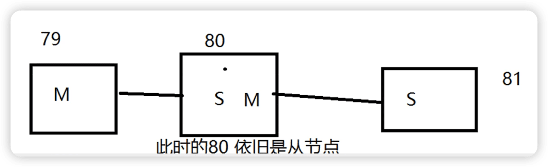
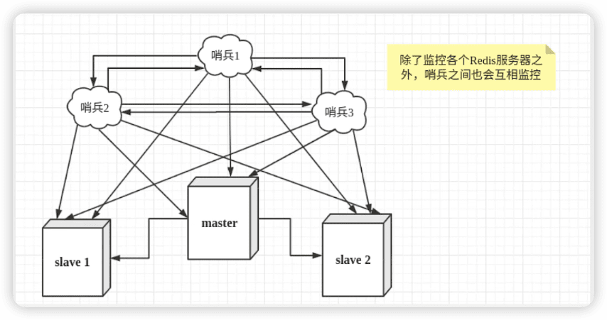
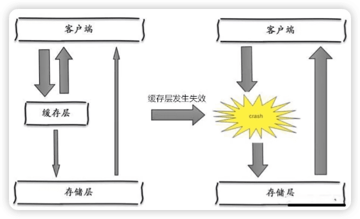

# Redis最新超详细版教程通俗易懂

https://www.bilibili.com/video/BV1S54y1R7SB

学习方式：先基本的理论学习，然后将知识融会贯通。


## NoSQL概述

### 为什么要使用NoSQL？

大数据时代，一般数据库无法进行分析处理了！2006年Hadoop

> 1、单机MySQL的年代

这种情况整个网站的瓶颈是什么？

- 数据量如果太大，一个机器放不下
- 数据的索引（B+ Tree），一个机器内存也放不下
- 访问量（读写混合），一个服务器承受不了

> 2、Memcached（缓存） + MySQL + 垂直拆分(读写分离)

网站80%的情况都是在读，使用缓存来保证效率！

发展过程：优化数据结构和索引 --> 文件缓存（IO） --> Memcached（当时最热门的技术！）


> 3、分库分表 + 水平拆分 + MySQL集群

技术的业务在发展的同时，对人的要求也越来越高！

**本质：数据库（读、写）**

早些年MyISAM：表锁，十分影响效率！高并发下就会出现严重的锁问题
转战Innodb：行锁
慢慢的就开始使用分库分表来解决**写**的压力 ！MySQL在哪个年代推出了表分区（这个并没有多少公司使用）！ 

MySQL的集群，很好满足哪个年代的所有需求！


（M、S代表主从）

> 4、如今最近的年代

2010--2020 十年之间，世界已经发生了翻天覆地的变化；

MySQL等关系型数据库就不够用了！数据量很多，变化很快~！

> 目前一个基本的互联网项目！


> 为什么要用NoSQL？

用户的个人信息、社交网络、地理位置，用户自己产生的数据，用户日志等等爆发式增长！

NoSQL就是用来处理以上情况！


### 什么是NoSQL

NoSQL = ==Not Only SQL（不仅仅是SQL）==

泛指非关系型数据库

关系型数据库：表格，行，列

很多的数据类型**用户的个人信息、社交网络、地理位置**。这些数据类型的存储不需要一个固定的格式！不需要多余的操作就可以横向扩展！Map<Strign, Object>使用键值对来控制！

#### NoSQL特点

解耦

1. 方便扩展（数据之间没有关系，很好扩展！）

2. 大数量高性能（Redis一秒写8万次，读取11万，NoSQL的缓存记录级，是一种<u>细粒度的缓存</u>，性能会比较高！）

3. 数据类型是多样性的！（不需要事先设计数据库！随取随用Q如果是数据量十分大的表，很多人就无法设计了！）

4. 传统RDBMS 和 NoSQL

   > 传统RDBMS
   >
   > - 结构化组织
   > - SQL
   > - 数据和关系都存在单独的表中，row col
   > - 数据操作，数据定义语言
   > - 严格的一致性
   > - 基础的事务
   > - ...

   > NoSQL
   >
   > - 不仅仅是数据
   > - 没有固定的查询语言
   > - 键值对存储，列存储，文档存储，图形数据库（社交关系）
   > - 最终一致性
   > - CAP定理 和 BASE（异地多活）
   > - 高性能、高可用、高可扩展
   > - ...

> 了解：3V + 3高

大数据时代的3v：主要是描述问题的

1. 海量（Volume）
2. 多样（Variety）
3. 实时（Velocity）

大数据时代的3高：主要是对程序的要求

1. 高并发
2. 高可扩（随时水平拆分，机器不够了，可以扩展机器解决）
3. 高性能（保证用户体验和性能）


公司中的实践：NoSQL + RDBMS一起使用


### 阿里巴巴演进分析


技术急不得，越是慢慢学，才能越扎实


架构师：没有什么中间加一层不能解决的。

淘宝商品页面：

```bash
# 1、商品的基本信息
	名称、	价格、商家信息：
	关系型数据就可以解决了！MySQL/Oracle（淘宝很早就去IOE了！~王坚：文章：阿里云的这群疯子）
	淘宝内部的MySQL不是大家用的MySQL
	
# 2、商品的描述、评论（文字比较多）
	文档型数据库汇中，MongoDB
	
# 3、图片
	分布式文件系统 FastDFS
	- 淘宝自己的 TFS
	- Google的 GFS
	- Hadoop HDFS
	- 阿里云的  oss

# 4、商品的关键字（搜索）
	- 搜索引擎  solr  elasticsearch
	- 阿里的 ISearch（多隆，阿里第一个程序员）
	
# 5、商品热门的波段信息
	- 内存数据库
	- Redis Tair memcahe...
  
# 6、商品的交易，外部的制服接口
	- 三方应用
```


大型互联网应用问题：

- 数据类型太多了
- 数据源繁多，经常重构
- 数据要改造，

统一数据服务层(Unified Data Service Layer, UDSL)


### NoSQL的四大分类

#### KV键值对：

- 新浪：**Redis**
- 美团：Redis + Tair
- 阿里、百度：Redis + memecache

#### 文档型数据库（bson格式 和json一样）：

> BSON（/ˈbiːsən/）是一种计算机数据交换格式，主要被用作MongoDB数据库中的数据存储和网络传输格式。它是一种二进制表示形式，能用来表示简单数据结构、关联数组（MongoDB中称为“对象”或“文档”）以及MongoDB中的各种数据类型。
>
> BSON之名缘于JSON，含义为Binary JSON（二进制JSON）。

- **MongoDB**（一般必须要掌握）
  - MongoDB是一个基于分布式文件存储的数据库，C++编写，主要用来处理大量的文档！
  - MongoDB介于关系型数据库和非关系数据库中中间的产品！它是非关系数据库中功能最丰富的，最想关系型数据库的
- CouchDB

#### 列存储数据库（mysql等都是行存储形式）

- **HBase**

- 分布式文件系统

#### 图关系数据库

- 它不是存图形，而是关系，比如：朋友圈社交网络、广告推荐！
- **Neo4j**，InfoGrid

|     分类     | 键值对                                                       | 文档型数据库                                                 | 列存储数据库                                 | 图形数据库                                                   |
| :----------: | ------------------------------------------------------------ | ------------------------------------------------------------ | -------------------------------------------- | ------------------------------------------------------------ |
|     举例     | Tokyo Cabinet/Tyrant,Redis, Voldemort,Oracle BDB             | MongoDB，CouchDB                                             | Cassandra，HBase                             | Neo4J，InfoGrid，Infinite Graph                              |
| 典型应用场景 | 内容缓存，主要用于处理大量数据的高**访问**负载，也用于一些日志系统等等。 | Web应用（与KV类似，Value是结构化的，不同的是数据库能够了解Value的内容 | 分布式的文件系统                             | 社交网络、推荐系统等。专注于构建关系图谱                     |
|   数据模型   | Key指向Value的键值对，通常用hash table来实现                 | Key-Value，Value为结构化数据                                 | 以列簇式存储，将同一列数据存在一起           | 图结构                                                       |
|     优点     | 查找速度快                                                   | 数据结构要求不严格，表结构可以变，不需要想关系型数据库一样预先定义表结构 | 查找速度快，可扩展性强，更容易进行分布式扩展 | 利用图结构相关算法。比如最短路径寻址，N都关系查找等          |
|     缺点     | 数据无结构化，通常只被当做字符串或二进制数据                 | 查询性能不高，而且缺乏统一的查询语法                         | 功能相对局限                                 | 很多时候需要对整个图做计算才能得出需要的信息，而且不太好做分布式集群。 |

敬畏之心可以使人进步！

活着的意义？追求幸福，探索未知。


## Redis入门

[官方在线redis环境](https://try.redis.io/)

### 概述

Redis（**Re**mote **Di**ctionary **S**erver )，即**远程字典服务**，是一个开源的使用ANSI C语言编写、支持网络、可基于内存亦可持久化的日志型、Key-Value数据库，并提供多种语言的API。

免费和开源，是当下最热门的NoSQL技术之一。

Redis 是一个开源（BSD许可）的，内存中的数据结构存储系统，它可以用作**数据库、缓存和消息中间件**。

> Redis能干嘛？

1. 内存存储、持久化（rdb、aof）
2. 效率高，可以用户高速缓存
3. 发布订阅系统
4. 地图信息分析
5. 计时器、计数器（浏览量！）
6. ...

> 特性

1. 多样的数据类型
2. 持久化
3. 集群
4. 事务

。。。

https://redis.io/

http://www.redis.cn/

https://github.com/redis/redis


五大数据类型：

三种特殊数据类型：geospatial, hyperloglog, bitmaps


### 安装


```
> ping
PONG
```


#### linux

`/usr/local/bin/redis-*`


#### mac

使用homebrew安装，默认位置：

```
/usr/local/Cellar/redis
/usr/local/bin/redis-*
```

默认配置文件：

```
/usr/local/etc/redis.conf
```

表示是否在后台启动

```
daemonize no
```

可通过制定配置文件启动：

```bash
$ redis-server redis.conf
77066:C 14 Oct 2021 19:16:05.200 # oO0OoO0OoO0Oo Redis is starting oO0OoO0OoO0Oo
77066:C 14 Oct 2021 19:16:05.200 # Redis version=5.0.5, bits=64, commit=00000000, modified=0, pid=77066, just started
77066:C 14 Oct 2021 19:16:05.200 # Configuration loaded
```

使用redis-cli链接测试：

```bash
$ redis-cli -p 6379
127.0.0.1:6379>
```

查看redis进程是否开启：

```bash
$ ps -ef | grep redis
  501 77067     1   0  7:16下午 ??         0:00.64 redis-server 127.0.0.1:6379
  501 77124 58804   0  7:17下午 ttys000    0:00.01 redis-cli -p 6379
  501 77187 58193   0  7:19下午 ttys003    0:00.00 grep --color=auto --exclude-dir=.bzr --exclude-dir=CVS --exclude-dir=.git --exclude-dir=.hg --exclude-dir=.svn redis
```

如何关闭redis服务？

```bash
127.0.0.1:6379> shutdown  # 关闭redis-server
not connected> exit  # 退出redis-cli

$ ps -ef | grep redis
  501 77272 58804   0  7:21下午 ttys000    0:00.01 grep --color=auto --exclude-dir=.bzr --exclude-dir=CVS --exclude-dir=.git --exclude-dir=.hg --exclude-dir=.svn redis
```


之后会使用单机多redis启动集群测试

### 测试性能


`redis-benchmark`  

```
// 使用100个并发连接、100000个请求检测端口为6379的Redis服务器性能
redis-benchmark -h localhost -p 6379 -c 100 -n 100000
```


### Redis 基础的知识

默认共有16个数据库，默认使用第0个，可以使用select进行切换数据库

```bash
127.0.0.1:6379> select 2
OK
127.0.0.1:6379[2]> dbsize
(integer) 0
127.0.0.1:6379[2]> set name andy
OK
127.0.0.1:6379[2]> dbsize
(integer) 1
```

`keys *`

`flushdb` 清除当前数据库

`flushall` 清除全部数据库

`exists name`	键是否存

`clear` 	

> Redis 6之前是单线程的

Redis是很快的，Redis是基于内存操作，CPU不是Redis性能瓶颈，Redis的瓶颈是根据机器的**==内存和网络带宽==**，既然可以使用单线程来实现，就使用单线程了。

**Redis为什么单线程还这么快？**

1、误区1：高性能的服务器一定是多线程的？
2、误区2：多线程（CPU上下文会切换！）一定比单线程效率高！ 

CPU > 内存 > 硬盘的速度要有所了解！
核心：redis是将所有的数据全部放在内存中的，所以说使用单线程去操作效率就是最高的，多线程（CPU上下文会切换：耗时的操作！！！），对于内存系统来说，如果没有上下文切换效率就是最高的！多次读写都是在一个CPU上的，在内存情况下，这个就是最佳的方案！


## 五大基本数据类型

### Redis-Key

`move name 1`：从当前数据库移除key为name的值（1代表当前数据库）

`expire name 10`：设置key为name的值10s后过期

`ttl name`：查看当前key的剩余过期时间

`type name`： 查看类型

`clear`


```shell
KEYS pattern
KEYS *
KEYS str*
KEYS h?llo

DBSIZE  # 获取键总数（内部变量，不遍历）

Exits key [key ...]   # 查询键是否存在

Del key [key ...]

Type key

Rename key newKey
```


### String

```bash
append key ""  # 如果key不存在，就相当于set
strlen key
incr views
decr views
incrby views 2 # 步长，指定增量
decrby views 10 
getrange key 0 3  # 获取一段字符串 闭区间的 [0, 3]
getrange key 0 -1 # 获取全部
setrange key 1 xx # 替换指定位置开始的字符串
# setex (set with expire) # 设置过期时间
# setnx (set if not exist) # 如果不存在才设置(在分布式锁中会常用)
set key3 30 "hello"  # 设置key3位hello，过期时间30秒
setnx mykey "redis"  # 如果myke不存在，创建mykey，否者创建失败

mset k1 v1 k2 v2 k3 v3
mget k1 k2 k3
msetnx k1 v1 k4 v4   # 原子性的操作

127.0.0.1:6379[2]> getset db redis  # 先获取再设置，如果不存在返回nil，
(nil)
127.0.0.1:6379[2]> get db
"redis"
127.0.0.1:6379[2]> getset db mongodb # 如果存在，则获取原来的值，并设置新的值
"redis"
127.0.0.1:6379[2]> get db
"mongodb"


```

```bash
# 对象
set user:1 {name:zhangsan, age:3}  # 设置一个user:1对象值为json字符来保存一个对象
# 这里的key是一个巧妙的设计： user:{id}:{filed} 

```


数据结构是相通的！

String类似的使用场景：value也可以是数字

- 计数器
- 统计多单位的数量   uid:28354097:follow incr
- 粉丝数
- 对象缓存存储


### List（列表）

栈、队列、阻塞队列

所有list命令都是L开头的

```bash
lpush
lrange
rpush
lpop
rpop
lindex 
llen
lrem list 1 value # 移除list集合中指定个数的value
ltrim	key start stop			# 让列表只保留指定区间内的元素，不在指定区间之内的元素都将被删除。（第一个元素从0开始）
rpoplpush
lset 		# 将列表中指定下标的值替换为另外一值，更新操作
linsert	# 将某个具体的value插入到列中某个元素的前面或者后面
```


```bash
127.0.0.1:6379[2]> lpush list one
(integer) 1
127.0.0.1:6379[2]> lpush list two
(integer) 2
127.0.0.1:6379[2]> lpush list three
(integer) 3
127.0.0.1:6379[2]> lrange list 0 -1
1) "three"
2) "two"
3) "one"
127.0.0.1:6379[2]> rpush list rth
(integer) 4
127.0.0.1:6379[2]> lrange list 0 -1
1) "three"
2) "two"
3) "one"
4) "rth"
127.0.0.1:6379[2]> lpop list
"three"
127.0.0.1:6379[2]> rpop list
"rth"
127.0.0.1:6379[2]> lrange list 0 -1
1) "two"
2) "one"
127.0.0.1:6379[2]> lindex list 0		# 通过下标获得list中的某一个值
"two"
127.0.0.1:6379[2]> lindex list 1
"one"
127.0.0.1:6379[2]> llen list
(integer) 2
####

127.0.0.1:6379[2]> lrange mylist 0 -1
1) "hello4"
2) "hello3"
3) "hello2"
4) "hello1"
5) "hello"
127.0.0.1:6379[2]> ltrim mylist 1 2  # 
OK
127.0.0.1:6379[2]> lrange mylist 0 -1
1) "hello3"
2) "hello2"

##########
rpoplpush   # 移除列表的最后一个元素，将它移动新的列表

127.0.0.1:6379[2]> lrange mylist 0 -1
1) "hello2"
2) "hello1"
3) "hello"
127.0.0.1:6379[2]> rpoplpush mylist myotherlist
"hello"
127.0.0.1:6379[2]> lrange mylist 0 -1
1) "hello2"
2) "hello1"

#############
redis> RPUSH mylist "Hello"
(integer) 1
redis> RPUSH mylist "World"
(integer) 2
redis> LINSERT mylist BEFORE "World" "There"
(integer) 3
redis> LRANGE mylist 0 -1
1) "Hello"
2) "There"
3) "World"

```


### Set（集合）

无序不重复

```
sadd
smembers
sismember
scard			# 获取set集合中的元素个数
srem			# 移除某个元素
srandmember myset # 随机抽出指定个数元素
srandmember myset 2
spop myset   # 随机删除一个元素
smove myset myset2 value  # 移动myset中元素value到myset2中

数学几何
- 差集
- 交集
- 并集（共同关注）
sdiff set1 set2			# set1中与set2不同的元素
sinter set1 set2		# set1中与set2相同的元素
sunion set1 set2		# set1和set2元素合并
```


```bash
127.0.0.1:6379[2]> sadd myset andy
(integer) 1
127.0.0.1:6379[2]> sadd myset hello
(integer) 1
127.0.0.1:6379[2]> sadd myset lovefeifei
(integer) 1
127.0.0.1:6379[2]> SMEMBERS myset
1) "lovefeifei"
2) "hello"
3) "andy"
127.0.0.1:6379[2]> SISMEMBER myset hello
(integer) 1
127.0.0.1:6379[2]> SISMEMBER myset world
(integer) 0
127.0.0.1:6379[2]> SCARD myset
(integer) 3
127.0.0.1:6379[2]> SREM myset hello
(integer) 1
```

> 微博，A用户将所有关乎的人放在一个set集合中，将粉丝放到另外一个集合中。
>
> 共同关注，共同爱好，二度好友，推荐好友！

### Hash（哈希）

Map集合，key-map!

```
hset
hget 
hmset
hmget 
hgetall
hdel
hlen
hexists myhash field
hkeys myhash
hvals myhash
hincrby myhash field []
hdecr
hsetnx

```

```bash
127.0.0.1:6379[2]> hset myhash field1 andy
(integer) 1
127.0.0.1:6379[2]> hget myhash field1
"andy"
127.0.0.1:6379[2]> hmset myhash field1 hello field2 world
OK
127.0.0.1:6379[2]> hmget myhash field1 field2
1) "hello"
2) "world"
127.0.0.1:6379[2]> hgetall myhash
1) "field1"
2) "hello"
3) "field2"
4) "world"
127.0.0.1:6379[2]> hdel myhash field1
(integer) 1
```

> hash可作为变更数据 ，尤其是用户信息之类的，经常变动的信息！
>
> hash更适合于对象的存储，string更加适合字符串存储！
>
> ```bash
> > hset user:1 name andy
> ```
>
> 


### zset（有序集合，也不重复）

在set的基础上，增加了一个用户排序的值

```
zadd 
zrange
zrevrange
zrangebyscore
zrem
zcard
zcount
```

```bash
127.0.0.1:6379[2]> zadd myzset 1 one
(integer) 1
127.0.0.1:6379[2]> zadd myzset 2 two 3 three
(integer) 2
127.0.0.1:6379[2]> zrange myzset 0 -1
1) "one"
2) "two"
3) "three"
127.0.0.1:6379[2]> zrevrange myzset 0 -1
1) "three"
2) "two"
3) "one"
127.0.0.1:6379[2]> zadd salary 2500 xiaoming
(integer) 1
127.0.0.1:6379[2]> zadd salary 5000 xiaorong
(integer) 1
127.0.0.1:6379[2]> zadd salary 500 xiaokuang
(integer) 1
127.0.0.1:6379[2]> zrangebyscore salary -inf +inf  # inf表示无穷， `-inf +inf`表示从小到大排序显示所有
1) "xiaokuang"
2) "xiaoming"
3) "xiaorong"
127.0.0.1:6379[2]> zrangebyscore salary -inf +inf withscores    
1) "xiaokuang"
2) "500"
3) "xiaoming"
4) "2500"
5) "xiaorong"
6) "5000"
127.0.0.1:6379[2]> zrangebyscore salary -inf 2501 withscores
1) "xiaokuang"
2) "500"
3) "xiaoming"
4) "2500"
127.0.0.1:6379[2]> zcount myzset 1 3
(integer) 3
```

> zset应用场景：
>
> 存储班级成绩表、工资表排序
>
> 排行榜，取Top

## 三种特殊数据类型

### geospatial 地理位置

朋友的定位，附近的人，打车距离计算？


只有6个命令：

1. `geoadd`

```
geoadd key longitude latitude member # 添加地理位置
```

>规则：两级无法直接添加，可以下载城市数据，通过java一次性导入。
>
>- 有效的经度从-180度到180度。
>- 有效的纬度从-85.05112878度到85.05112878度。

```bash
geoadd china:city 116.40 39.90 beijing
geoadd china:city 121.47 31.23 shanghai
geoadd china:city 106.50 29.53 chongqing 114.05 22.52 shengzhen
geoadd china:city 120.16 30.24 hangzhou 108.96 34.26 xian

```

2. `geopos`

```
geopos china:city beijing
```

```bash
127.0.0.1:6379[2]> geopos china:city beijing
1) 1) "116.39999896287918091"
   2) "39.90000009167092543"
```


3. `geodist`  亮点之间的距离（单位：米）

```bash
127.0.0.1:6379[2]> geodist china:city shanghai beijing
"1067378.7564"   # 查看上海到北京的直线距离
127.0.0.1:6379[2]> geodist china:city shanghai beijing km
"1067.3788"
```

4. `georadius`   

```
georadius key longitude latitude radius
```

以给定的经纬度为中心， 返回键包含的位置元素当中， 与中心的距离不超过给定最大距离的所有位置元素。

我附近的人？

获得指定数量的人

```bash
127.0.0.1:6379[2]> georadius china:city 110 30 500 km  # 以100,30这个点为中心，寻找方圆500km内的城市
1) "chongqing"
2) "xian"
127.0.0.1:6379[2]> georadius china:city 110 30 500 km withcoord withdist
1) 1) "chongqing"
   2) "341.9374"
   3) 1) "106.49999767541885376"
      2) "29.52999957900659211"
2) 1) "xian"
   2) "483.8340"
   3) 1) "108.96000176668167114"
      2) "34.25999964418929977"
127.0.0.1:6379[2]> georadius china:city 110 30 500 km withcoord withdist count 1
1) 1) "chongqing"
   2) "341.9374"
   3) 1) "106.49999767541885376"
      2) "29.52999957900659211"      
```

5. `georaduisbymember` 

这个命令和 GEORADIUS 命令一样， 都可以找出位于指定范围内的元素， 但是 GEORADIUSBYMEMBER 的中心点是由给定的位置元素决定的

```bash
127.0.0.1:6379[2]> GEORADIUSBYMEMBER china:city shanghai 400 km
1) "hangzhou"
2) "shanghai"
```

6. `geohash`

把二维的经纬度转换为一维11位的hash字符串，如果两个字符串越接近，那么则距离越近！（很少这么用）

```bash
127.0.0.1:6379[2]> GEOHASH china:city shanghai
1) "wtw3sj5zbj0"
127.0.0.1:6379[2]> GEOHASH china:city shanghai xian
1) "wtw3sj5zbj0"
2) "wqj6zky6bn0"
```

🔖GEO底层的实现原理就是zset，可以使用zset的命令来操作geo！

```bash
127.0.0.1:6379[2]> zrange china:city 0 -1
1) "chongqing"
2) "xian"
3) "shengzhen"
4) "hangzhou"
5) "shanghai"
6) "beijing"
127.0.0.1:6379[2]> zrem china:city beijing
(integer) 1
127.0.0.1:6379[2]> zrange china:city 0 -1
1) "chongqing"
2) "xian"
3) "shengzhen"
4) "hangzhou"
5) "shanghai"
```


### Hyperloglogs基数统计

> 什么是基数？
>
> 不重复的元素
>
> 可以接受误差

优点：占用的内存是固定，2^64不同的元素的计数，只需要花费12KB的内存（固定的）！

**网页的UV（一个访问一个网站多次，但是还是算作一个人）**

传统的方式，set保存用户的id，然后就可以统计set中的元素数量作为UV！但这种方式如果保存大量用户id，就会比较麻烦！我们的目的是为了计数，而不是保存用户id。

0。81%错误率（官方）！统计UV，可以忽略不计


```
pfadd 
pfcount
pfmerge
```

```bash
127.0.0.1:6379[2]> pfadd mykey a b c d e f g i j
(integer) 1
127.0.0.1:6379[2]> pfcount mykey
(integer) 9
127.0.0.1:6379[2]> pfadd mykey a b c d e f g h i j
(integer) 1
127.0.0.1:6379[2]> pfcount mykey
(integer) 10
127.0.0.1:6379[2]> pfadd mykey2 i j k c o e p y
(integer) 1
127.0.0.1:6379[2]> pfcount mykey2
(integer) 8
127.0.0.1:6379[2]> pfmerge mykey3 mykey mykey2
OK
127.0.0.1:6379[2]> pfcount mykey3
(integer) 14
```

> 统计数量，如果允许容错，那么一定可以使用Hyperloglogs


### Bitmaps 位图存储

> 位存储

统计用户信息，活跃，不活跃！登录、未登录！打卡

两个状态都可以使用Bitmaps！

Bitmaps位图，数据结构！都是操作二进制位进行记录，就只有0和1两个状态！

365天 = 365 bit  1字节 = 8bit  46个字节左右

```
setbit key offset value0
getbit 
bitcount key [start end]
```


使用bitmaps来记录周一到周日的打卡：

```bash
127.0.0.1:6379[2]> setbit sign 0 1
(integer) 0
127.0.0.1:6379[2]> setbit sign 1 0
(integer) 0
127.0.0.1:6379[2]> setbit sign 2 0
(integer) 0
127.0.0.1:6379[2]> setbit sign 3 1
(integer) 0
127.0.0.1:6379[2]> setbit sign 4 1
(integer) 0
127.0.0.1:6379[2]> setbit sign 5 0
(integer) 0
127.0.0.1:6379[2]> setbit sign 6 1
(integer) 0
```

查看某一天是否打卡：

```bash
127.0.0.1:6379[2]> getbit sign 1
(integer) 0
127.0.0.1:6379[2]> getbit sign 4
(integer) 1
```

统计打卡天数：

```bash
127.0.0.1:6379[2]> bitcount sign
(integer) 4
```


## 事务

Redis事务本质：==一组命令的集合==！一个事务中的所有命令都会被序列化，在事务执行过程的中，会按照顺序执行！

一次性、顺序性、排他性！执行一系列的命令！

```
--------- 队列 set set set 执行 ----------
```

**Redis事务没有隔离级别的概念！**

所有的命令在事务中，并没有直接执行！只有发起执行命令的时候才会执行！Exec

**Redis==单条命令保存原子性的==，但redis==事务不保证原子性==！**

redis事务的三个阶段：

- 开启事务（multi）
- 命令入队（...）
- 执行事务（exec）

```
multi
exec
discard
```


> 正常执行事务：

```bash
127.0.0.1:6379[2]> multi
OK
127.0.0.1:6379[2]> set k1 v1
QUEUED
127.0.0.1:6379[2]> set k2 v2
QUEUED
127.0.0.1:6379[2]> get k2
QUEUED
127.0.0.1:6379[2]> set k3 v3
QUEUED
127.0.0.1:6379[2]> exec
1) OK
2) OK
3) "v2"
4) OK
```

> 放弃事务

```bash
127.0.0.1:6379[2]> multi
OK
127.0.0.1:6379[2]> set k1 v1
QUEUED
127.0.0.1:6379[2]> set k2 v2
QUEUED
127.0.0.1:6379[2]> set k4 v4
QUEUED
127.0.0.1:6379[2]> discard  # 取消事务
OK
127.0.0.1:6379[2]> get k4 	# 事务队列中命令都不会被执行
(nil)
```

> 编译型异常（代码有问题！命令有错！），事务中所有的命令都不会执行！

```bash
127.0.0.1:6379[2]> multi
OK
127.0.0.1:6379[2]> set k1 v1
QUEUED
127.0.0.1:6379[2]> set k2 v2
QUEUED
127.0.0.1:6379[2]> set k3 v3
QUEUED
127.0.0.1:6379[2]> getset k3  # 错误的命令
(error) ERR wrong number of arguments for 'getset' command
127.0.0.1:6379[2]> set k4 v4
QUEUED
127.0.0.1:6379[2]> set k5 v5
QUEUED
127.0.0.1:6379[2]> exec  # 执行事务报错
(error) EXECABORT Transaction discarded because of previous errors.
127.0.0.1:6379[2]> get k5  # 所有命令都不会被执行
(nil)
```


> 运行时异常(`1/0`)，如果事务队列中存在语法性，那么执行命令的时候，其他命令是可以正常执行的，错误命令抛出异常！（所以所redis事务没有原子性）

```bash
127.0.0.1:6379[2]> set k1 "v1"
OK
127.0.0.1:6379[2]> multi
OK
127.0.0.1:6379[2]> incr k1
QUEUED
127.0.0.1:6379[2]> set k2 v2
QUEUED
127.0.0.1:6379[2]> set k3 v3
QUEUED
127.0.0.1:6379[2]> get k3
QUEUED
127.0.0.1:6379[2]> exec
1) (error) ERR value is not an integer or out of range   # 虽然第一条命令报错了，但是其它依旧正常执行成功了！
2) OK
3) OK
4) "v3"
127.0.0.1:6379[2]> get k2
"v2"
127.0.0.1:6379[2]> get k3
"v3"
```


### 监控  watch （可实现乐观锁）🔖


**悲观锁**：很悲观，认为什么时候都会出问题，无论做什么都会加锁！

**乐观锁**：很乐观，认为什么时候都不会出问题，所以不会上锁！更新数据的时候去判断一下，在此期间是否有人修改过这个数据，（mysql中version，更新的时候比较version）

> redis监视测试

正常执行成功：

```bash
127.0.0.1:6379> set money 100
OK
127.0.0.1:6379> set out 0
OK
127.0.0.1:6379> watch money  # 监视money对象
OK
127.0.0.1:6379> multi  # 事务正常结束，数据期间没有发生变动，这个时候就正常执行成功！
OK
127.0.0.1:6379> decrby money 20
QUEUED
127.0.0.1:6379> incrby out 20
QUEUED
127.0.0.1:6379> exec
1) (integer) 80
2) (integer) 20
```

测试多线程修改值，使用watch可以当作redis的乐观锁操作！重新打开另外一个redis客服端：

```bash
$ redis-cli -p 6379
127.0.0.1:6379> watch money  # 监视 money
OK
127.0.0.1:6379> multi
OK
127.0.0.1:6379> decrby money 10
QUEUED
127.0.0.1:6379> incrby out 10
QUEUED
127.0.0.1:6379> exec  # 执行之前，另外一个线程，修改了money的值（比如在上面的客服端`set money 1000`），就会导致事务执行失败！
(nil)
```

解决办法就是先解除监视，然后重新监视（获取最新的值）：

```bash
127.0.0.1:6379> unwatch #1、如果发现事务执行失败，就先解锁
OK
127.0.0.1:6379> watch money #2、获取最新值，在此监视，select version
OK
127.0.0.1:6379> multi
OK
127.0.0.1:6379> decrby money 10
QUEUED
127.0.0.1:6379> incrby out 10
QUEUED
127.0.0.1:6379> exec #3、比对监视的值是否发生额变化，如果没有变化，那么可以执行成功，如果变了就执行失败
1) (integer) 990
2) (integer) 30
```


## Jedis

使用Java来操作Redis

> Jedis是Redis官方推荐的Java链接开发工具！使用Java操作Redis中间件！如果要使用Java操作redis，那么一定要对Jedis十分熟悉！
>
> https://github.com/redis/jedis
>
> 虽然SpringBoot新版已经不适用Jedis


1. 导入依赖

   ```xml
   <dependency>
     <groupId>redis.clients</groupId>
     <artifactId>jedis</artifactId>
     <version>3.2.0</version>
   </dependency>
   
   <dependency>
     <groupId>com.alibaba</groupId>
     <artifactId>fastjson</artifactId>
     <version>1.2.62</version>
   </dependency>
   ```

2. 编码测试

   链接数据库

   操作命令

   断开连接

> jedis的所有api命令，就是redis的命令，没有变化！ 


## Spingboot整合Redis

SpringBoot操作数据：spring-data，jpa、jdbc、mongodb、redis等

说明：在SpringBoot2.x之后，原来使用的jedis被替换为了lettuce。

jedis：采用直连，多个线程操作的话，是不安全的，如果想要避免不安全，使用jedis pool连接池！（像BIO模式）

==lettuce==：采用==netty==，实例可以在多个线程中进行共享，不存在线程不安全的情况！可以减少线程数据！（像NIO模式）


```properties
# SpringBoot所有的配置类，都有一个自动配置类 RedisAutoConfiguration
# 自动配置类都会绑定一个properties配置文件 RedisProperties


```


```java
@Configuration(proxyBeanMethods = false)
@ConditionalOnClass(RedisOperations.class)
@EnableConfigurationProperties(RedisProperties.class)
@Import({ LettuceConnectionConfiguration.class, JedisConnectionConfiguration.class })
public class RedisAutoConfiguration {

	@Bean
	@ConditionalOnMissingBean(name = "redisTemplate") // 我们可以自己定义一个redisTemplate来替换这个默认的！
	@ConditionalOnSingleCandidate(RedisConnectionFactory.class)
	public RedisTemplate<Object, Object> redisTemplate(RedisConnectionFactory redisConnectionFactory) {
    
// 默认的RedisTemplate没有过多的设置，redis对象传输都需要序列化！
// 两个泛型都是Object类型，之后需要强制转换为<String, Object>
		RedisTemplate<Object, Object> template = new RedisTemplate<>();
		template.setConnectionFactory(redisConnectionFactory);
		return template;
	}

	@Bean
	@ConditionalOnMissingBean // 由于String是redis中最常用的类型，所以单独提出来一个bean！
	@ConditionalOnSingleCandidate(RedisConnectionFactory.class)
	public StringRedisTemplate stringRedisTemplate(RedisConnectionFactory redisConnectionFactory) {
		StringRedisTemplate template = new StringRedisTemplate();
		template.setConnectionFactory(redisConnectionFactory);
		return template;
	}

}
```

> 整合测试


 `


`RedisTemplate`：

```java
public class RedisTemplate<K, V> extends RedisAccessor implements RedisOperations<K, V>, BeanClassLoaderAware {
    private boolean enableTransactionSupport = false;
    private boolean exposeConnection = false;
    private boolean initialized = false;
    private boolean enableDefaultSerializer = true;
    @Nullable
    private RedisSerializer<?> defaultSerializer;
    @Nullable
    private ClassLoader classLoader;
  
  
  	// 序列化配置
    @Nullable
    private RedisSerializer keySerializer = null;
    @Nullable
    private RedisSerializer valueSerializer = null;
    @Nullable
    private RedisSerializer hashKeySerializer = null;
    @Nullable
    private RedisSerializer hashValueSerializer = null;
    private RedisSerializer<String> stringSerializer = RedisSerializer.string();
		
  // ...

   public void afterPropertiesSet() {
        super.afterPropertiesSet();
        boolean defaultUsed = false;
        if (this.defaultSerializer == null) {
          // 默认的序列化方式是JDK序列化（可能导致中文乱码），可能需要使用Json来序列化
            this.defaultSerializer = new JdkSerializationRedisSerializer(this.classLoader != null ? this.classLoader : this.getClass().getClassLoader());
        }
// ...
```


没有序列化对象会报错：


让对象实现可序列化接口或者主动序列化对象就可以传输了：

```java
public class User  implements Serializable 
```

自定义RedisTemplate：

```java
@Bean
@SuppressWarnings("all")
public RedisTemplate<String, Object> redisTemplate(RedisConnectionFactory factory) {
  // 为了方便开发，一般直接使用<String, Object>
  RedisTemplate<String, Object> template = new RedisTemplate<>();
  template.setConnectionFactory(factory);

  // Json序列化配置
  Jackson2JsonRedisSerializer jackson2JsonRedisSerializer = new Jackson2JsonRedisSerializer(Object.class);
  ObjectMapper om = new ObjectMapper();
  om.setVisibility(PropertyAccessor.ALL, JsonAutoDetect.Visibility.ANY);
  om.enableDefaultTyping(ObjectMapper.DefaultTyping.NON_FINAL);
  jackson2JsonRedisSerializer.setObjectMapper(om);

  // String的序列化
  StringRedisSerializer stringRedisSerializer = new StringRedisSerializer();

  // key采用String的序列化方式
  template.setKeySerializer(stringRedisSerializer);
  // hash的key采用String的序列化方式
  template.setHashKeySerializer(stringRedisSerializer);
  // value的序列化方式采用Jackon
  template.setValueSerializer(jackson2JsonRedisSerializer);
  // hash的value序列化方式采用Jackon
  template.setHashValueSerializer(jackson2JsonRedisSerializer);

  template.afterPropertiesSet();
  return template;
}
```


一般会把原生的操作封装成工具类：`RedisUtil` 🔖 p26 16:30


> 所有的redis操作，其实对于java开发人员来说，十分的简单，更重要是去理解redis的思想和每一种数据结构的用处和作用场景！


## Redis.conf详解

行家有没有，出手就知道了

1. 单位

配置文件unit单位对大小写不敏感

2. INCLUDES

可以包含其他配置文件

```
# include /path/to/local.conf
# include /path/to/other.conf
```

3. MODULES

```
# loadmodule /path/to/my_module.so
# loadmodule /path/to/other_module.so
```

4. 网络

```
bind 127.0.0.1  		# 绑定ip
protected-mode yes	# 保护模式
port 6379					
```

5. 通用

```
daemonize yes  # yes代表一守护进程的方式运行

pidfile /var/run/redis_6379.pid  # 守护进程运行时，进程的pid文件

# 日志
# Specify the server verbosity level.
# This can be one of:
# debug (a lot of information, useful for development/testing)
# verbose (many rarely useful info, but not a mess like the debug level)
# notice (moderately verbose, what you want in production probably)
# warning (only very important / critical messages are logged)
loglevel notice
logfile ""			# 日志的文件位置名

databases 16   # 数据库的数量

always-show-logo yes  # 登录时是否显示logo
```

6. 快照 SNAPSHOTTING

持久化，在规定时间内，执行了多次次操作，则会持久化到文件 .rdb .aof

```
# 如果900s内，至少有一个key进行了修改，就进行持久化操作
save 900 1   
# 如果300s内，至少有10个key进行了修改，就进行持久化操作
save 300 10
# 如果60s内，至少有10000个key进行了修改，就进行持久化操作
save 60 10000

# 持久化如果出错，是否需要继续工作
stop-writes-on-bgsave-error yes

# 是否压缩rdb文件（需要消耗一些cpu资源）
rdbcompression yes

# 保存rdb文件的时候，是否进行错误的检查校验！
rdbchecksum yes

# rdb文件保存的目录
dir /usr/local/var/db/redis/
```

7. REPLICATION 主从复制相关配置


8. SECURITY 安全

redis默认没有密码，可以在配置文件配置，也可以使用命令配置

```
# requirepass foobared
```

```bash
127.0.0.1:6379> config get requirepass   
1) "requirepass"
2) ""
127.0.0.1:6379> config set requirepass "123456"
OK
127.0.0.1:6379> config get requirepass
(error) NOAUTH Authentication required.
127.0.0.1:6379> ping
(error) NOAUTH Authentication required.
127.0.0.1:6379> auth 123456  # 使用密码登录
OK
127.0.0.1:6379> config get requirepass
1) "requirepass"
2) "123456
```


9. CLIENTS  客户端的一些配置

```
maxclients 10000  # 设置能链接上redis的最大客户端数量
```


10. 内存管理

```
maxmemory <bytes> # redis配置最大的内存容量

maxmemory-policy noeviction  # 内存到达上限的处理策略

```

maxmemory-policy六种方式
1、volatile-lru：只对设置了过期时间的key进行LRU（默认值） 

2、allkeys-lru ： 删除lru算法的key   

3、volatile-random：随机删除即将过期key   

4、allkeys-random：随机删除   

5、volatile-ttl ： 删除即将过期的   

6、noeviction ： 永不过期，返回错误


11. APPEND ONLY MODE  aof配置

```
appendonly no # 默认不开aof模式，默认使用rdb方式持久化，大部分情况下，rdb完全够用

appendfilename "appendonly.aof"  # 持久化的文件名字

# appendfsync always	# 每次修改都会sync，消耗性能
appendfsync everysec  # 每秒执行一次sync，可能会丢失这1s的数据
# appendfsync no		# 不执行sync，这个时候操作系统自己同步数据，速度最快
```


## Redis持久化


### RDB(Redis DataBase)


在指定的时间间隔内将内存中的数据集快照写入磁盘，也就是行话讲的**Snapshot快照**，它恢复时是将快照文件直接读到内存里。 

Redis会单独创建（fork）一个子进程来进行持久化，会先<u>将数据写入到一个临时文件中，待持久化过程都结束了，再用这个临时文件替换上次持久化好的文件</u>。整个过程中，主进程是不进行任何I0操作的。这就确保了极高的性能。如果需要进行大规模数据的恢复，且**对于数据恢复的完整性不是非常敏感**，那RDB方式要比AOF方式更加的高效。

RDB的缺点是最后一次持久化后的数据可能丢失。我们默认的就是RDB，一般情况下不需要修改这个配置！

rdb保存的文件是 `dump.rdb` （在生成环境有时候会备份这个文件），相关配置都在配置文件的**SNAPSHOTTING**模块


> 触发机制

1. save的规则满足的情况下，会自动触发reb规则，保存数据得到rdb文件
2. `flushdb`
3. 退出redis

> 如何恢复rdb文件？

只需要将rbd文件放在redis-server启动指定的目录下，redis就会自动检查dump.rdb文件，并恢复其中的数据。

```bash
127.0.0.1:6379> config get dir
1) "dir"
2) "/Users/andyron/myfield/tmp"
```

```shell
Config get *
Config get loglevel
```

优点：

1. 适合大规模的数据恢复
2. 对数据的完整性要求不高

缺点：

1. 需要一定的时间间隔进程操作！如果redis意外宕机了，最后一次修改数据就没有了。
2. fork进程的时候，会占用一定的内容空间！


### AOF(Append Only File)

将所有命令都记录下来（类似history），恢复的时候就把这个文件全部在执行一下。


以日志的形式来记录每个写操作，将Redis执行过的==所有指令记录下来（读操作不记录）==，==只许追加文件==但不可以改写文件，redis启动之初会读取该文件重新构建数据，换言之，redis重启的话就根据日志文件的内容将写指令从前到后执行一次以完成数据的恢复工作。

Aof保存的是`appendonly.aof`文件

默认AOF是关闭的，开启

```
appendonly yes
```

重启，就会生成appendonly.aof（文本文件），类似如下：

```
$ cat appendonly.aof
*2
$6
SELECT
$1
0
*3
$3
set
$2
k1
$2
v1
*3
$3
set
$2
k2
$2
v2
*3
$3
set
$2
k3
$2
v3
```

如果.aof文件有错误，redis会拒绝连接，可通过`redis-check-aof --fix`修复：

```bash
$ sudo $ sudo redis-check-aof --fix appendonly.aof
0x              6a: Expected \r\n, got: 7177
AOF analyzed: size=118, ok_up_to=81, diff=37
This will shrink the AOF from 118 bytes, with 37 bytes, to 81 bytes
Continue? [y/N]: y
Successfully truncated AOF --fix appendonly.aof
0x              6a: Expected \r\n, got: 7177
AOF analyzed: size=118, ok_up_to=81, diff=37
This will shrink the AOF from 118 bytes, with 37 bytes, to 81 bytes
Continue? [y/N]: y
Successfully truncated AOF
```


> 重写规则说明

aof默认就是文件的无线追加，文件会越来越大！

```bash
no-appendfsync-on-rewrite no

auto-aof-rewrite-percentage 100
auto-aof-rewrite-min-size 64mb
```

如果aof文件大于64m，就fork一个新的进程


> 优缺点

```bash
appendonly no # 默认不开aof模式，默认使用rdb方式持久化，大部分情况下，rdb完全够用

appendfilename "appendonly.aof"  # 持久化的文件名字

# appendfsync always	# 每次修改都会sync，消耗性能
appendfsync everysec  # 每秒执行一次sync，可能会丢失这1s的数据
# appendfsync no		# 不执行sync，这个时候操作系统自己同步数据，速度最快
```


优点：

1. 每一次修改都同步，文件的完整会更加好！
2. 每秒同步一次，可能会丢失一秒的数据
3. 从不同步，效率最高的！

缺点：
1. 相对于数据文件来说，aof远远大于rdb，修复的速度也比rdb慢！
2. Aof运行效率也要比rdb慢，所以我们redis默认的配置就是rdb持久化！


扩展：

1、RDB持久化方式能够在指定的时间间隔内对你的数据进行快照存储
2、AOF持久化方式记录每次对服务器写的操作，当服务器重启的时候会重新执行这些命令来恢复原始的数据，AOF命令以Redis协议追加保存每次写的操作到文件末尾，Redis还能对AOF文件进行后台重写，使得AOF文件的体积不至于过大。
3、只做缓存，如果你只希望你的数据在服务器运行的时候存在，你也可以不使用任何持久化
4、同时开启两种持久化方式
。在这种情况下，当redis重启的时候会优先载入AOF文件来恢复原始的数据，因为在通常情况下AOF文件保存的数据集要比RDB 文件保存的数据集要完整。
RDB的数据不实时，同时使用两者时服务器重启也只会找AOF文件，那要不要只使用AOF呢？作者建议不要，因为RDB更适合用于备份数据库（AOF在不断变化不好备份），快速重启，而且不会有AOF可能潜在的Bug，留着作为一个万一的手段。
5、性能建议

- 因为RDB文件只用作后备用途，建议只在Slave上持久化RDB文件，而且只要15分钟备份一次就够了，只保留save9001这条规则。
- 如果Enable AOF，好处是在最恶劣情况下也只会丢失不超过两秒数据，启动脚本较简单只load自己的AOF文件就可以了，代价一是带来了持续的I0，二是AOF rewrite的最后将rewrite过程中产生的新数据写到新文件造成的阻塞几乎是不可避免的。只要硬盘许可，应该尽量减少AOF rewrite的频率，AOF重写的基础大小默认值64M太小了，可以设到5G以上，默认超过原大小100%大小重写可以改到适当的数值。
- 如果不Enable AOF，仅靠Master-Slave Repllcation实现高可用性也可以，能省掉一大笔I0，也减少了rewrite时带来的系统波动。代价是如果Master/Slave同时倒掉，会丢失十几分钟的数据，启动脚本也要比较两个Master/Slave中的RDB文件，载入较新的那个，微博就是这种架构。

## Redis发布订阅

微信公众号订阅，微博的关注、热搜

Redis发布订阅（pub/sub）是一种**消息通信模式**。发送者（pub）发送消息，订阅者（sub）接收消息。

Redis客户端可以订阅任意数量的频道

三个角色：==消息发布者、频道、消息订阅者==。

订阅/发布消息突、图：


### 发布订阅命令

1. `PSUBSCRIBE pattern [pattern ...]`  订阅一个或多个符合给定模式的频道。
2. `PUBSUB subcommand [argument [argument ...]]` 查看订阅与发布系统状态。
3. `PUBLISH channel message`  将信息发送到指定的频道。
4. `PUNSUBSCRIBE [pattern [pattern ...]]`  退订所有给定模式的频道。
5. `SUBSCRIBE channel [channel ...]`  订阅给定的一个或多个频道的信息。
6. `UNSUBSCRIBE [channel [channel ...]]`  指退订给定的频道。


### 测试

订阅建立了一个频道:

```shell
127.0.0.1:6379> SUBSCRIBE kuangshenshuo
Reading messages... (press Ctrl-C to quit)
1) "subscribe"
2) "kuangshenshuo"
3) (integer) 1
# 等待读取推送的消息
```

在新的redis-cli，发布者发布消息:

```shell
127.0.0.1:6379> PUBLISH kuangshenshuo "hello, world"
(integer) 1
127.0.0.1:6379>
```

订阅的此频道的订阅者会接受到消息：

```shell
127.0.0.1:6379> SUBSCRIBE kuangshenshuo
Reading messages... (press Ctrl-C to quit)
1) "subscribe"
2) "kuangshenshuo"
3) (integer) 1
1) "message"
2) "kuangshenshuo"
3) "hello, world"
```


### 原理

Redis是使用C实现的，通过分析 Redis 源码里的 pubsub.c 文件，了解发布和订阅机制的底层实现，籍此加深对 Redis 的理解。

Redis通过 PUBLISH、SUBSCRIBE 和 PSUBSCRIBE 等命令实现发布和订阅功能。

通过 SUBSCRIBE 命令订阅某频道后，redis-server 里维护了一个字典，字典的键就是一个个频道！，而字典的值则是一个**链表**，链表中保存了所有订阅这个频道的客户端。SUBSCRIBE 命令的关键，就是将客户端添加到给定 channel 的订阅链表中。

通过 PUBLISH 命令向订阅者发送消息，redis-server 会使用给定的频道作为键，在它所维护的channel 宇典中查找记录了订阅这个频道的所有客户端的链表，遍历这个链表，将消息发布给所有订阅者。

Pub/Sub 从字面上理解就是发布(Publish ）与订阅（Subscribe），在Redis中，你可以设定对某—个key 值进行消息发布及消息订阅，当一个key值上进行了消息发布后，所有订阅它的客户端都会收到相应的消息。这一功能最明显的用法就是用作实时消息系统，比如普通的即时聊天，群聊等功能。


**使用场景**：

- 实时消息系统
- 实时聊天！（频道当做聊天室，将信息回显给所有人即可！）
- 订阅

复杂的场景就会使用专业的消息中间体MQ。


## Redis主从复制

主从复制，是指将一台Redis服务器的数据 ，复制到其他的Redis服务器。前者称为==主节点==(master/leader)，后者称为==从节点==(slave/follower);==数据的复制是单向的，只能由主节点到从节点==。Master以写为主，Slave 以读为主。

<u>默认情况下，每台Redis服务器都是主节点</u>；且一个主节点可以有多个从节点(或没有从节点），但一个从节点只能有一个主节点。

主从复制的作用主要包括：

1. 数据冗余：主从复制实现了数据的热备份，是持久化之外的一种数据冗余方式。

2. 故障恢复：当主节点出现问题时，可以由从节点提供服务，实现快速的故障恢复；实际上是一种服务的冗余。

3. 负载均衡：在主从复制的基础上，配合读写分离，可以由主节点提供写服务，由从节点提供读服务(即写Redis数据时应用连接主节点，读Redis数据时应用连接从节点），分担服务器负载；龙其是在写少读多的场景下，通过多个从节点分担读负载，可以大大提高Redis 服务器的并发量。

4. 高可用（集群）基石：除了上述作用以外，主从复制还是哨兵和集群能够实施的基础，因此说主从复制是Redis高可用的基础。


一般来说，要将Redis运用于工程项目中 ，只使用一台Redis是万万不能的（最少一主二从），原因如下：

1. 从结构上，单个Redis服务器会发生单点故障，并且一台服务器需要处理所有的请求负载，压力较大；

2. 从容量上，单个Redis服务器内存容量有限，就算一台Redis服务器内存容量为256G，也不能将所有内存用作Redis存储内存，一般来说，单台Redis最大使用内存不应该超过==20G==。

电商网站上的商品，一般都是一次上传，无数次浏览的，说专业点也就是"多读少写”。


### 环境配置

只配置从库，不用配置主库。

```shell
127.0.0.1:6379> INFO replication  # 查看当前库的信息
# Replication
role:master				# 角色默认是master
connected_slaves:0  # 没有从机
master_failover_state:no-failover
master_replid:66d796ee1cb6bce624bfbf4af0606a4ae8bc063a
master_replid2:0000000000000000000000000000000000000000
master_repl_offset:0
second_repl_offset:-1
repl_backlog_active:0
repl_backlog_size:1048576
repl_backlog_first_byte_offset:0
repl_backlog_histlen:0
```

复制3个配置文件，然后修改对应的信息：

1. 端口
2. pid名字
3. log文件名字
4. dump.rdb 名字

```
port 6380
pidfile /var/run/redis_6380.pid
logfile "6380.log"
dbfilename dump6380.rdb
```


启动三个redis服务

```shell
ps aux | grep redis-server
andyron          19608   0.4  0.0 409625904   3536   ??  Ss    6:00下午   0:01.29 redis-server 127.0.0.1:6379
andyron          19641   0.4  0.0 409485616   3792   ??  Ss    6:04下午   0:00.17 redis-server 127.0.0.1:6381
andyron          19636   0.3  0.0 409485616   3808   ??  Ss    6:04下午   0:00.18 redis-server 127.0.0.1:6380
andyron          19668   0.0  0.0 408626880   1344 s002  S+    6:04下午   0:00.00 grep --color=auto --exclude-dir=.bzr --exclude-dir=CVS --exclude-dir=.git --exclude-dir=.hg --exclude-dir=.svn --exclude-dir=.idea --exclude-dir=.tox redis-server
```


### 一主二从

认老大！一主（80）二从（79,81）

```shell
127.0.0.1:6379> SLAVEOF 127.0.0.1 6380
OK
127.0.0.1:6379> INFO replication
# Replication
role:slave			# 从机
master_host:127.0.0.1  # 主机信息
master_port:6380
master_link_status:down
master_last_io_seconds_ago:-1
master_sync_in_progress:0
slave_read_repl_offset:0
slave_repl_offset:0
master_link_down_since_seconds:-1
slave_priority:100
slave_read_only:1
replica_announced:1
connected_slaves:0
master_failover_state:no-failover
master_replid:e4c02411a40ad33572ddb7368da699b0350c8b5a
master_replid2:0000000000000000000000000000000000000000
master_repl_offset:0
second_repl_offset:-1
repl_backlog_active:0
repl_backlog_size:1048576
repl_backlog_first_byt
```


```shell
127.0.0.1:6380> INFO replication
# Replication
role:master
connected_slaves:2
slave0:ip=127.0.0.1,port=6379,state=online,offset=224,lag=0
slave1:ip=127.0.0.1,port=6381,state=wait_bgsave,offset=0,lag=0
master_failover_state:no-failover
master_replid:4ef210184c7cd05c76c3d60e1d008d3de9a14f95
master_replid2:0000000000000000000000000000000000000000
master_repl_offset:224
second_repl_offset:-1
repl_backlog_active:1
repl_backlog_size:1048576
repl_backlog_first_byte_offset:1
repl_backlog_histlen:224
```


真实的主从配置应该在配置文件中配置，就是在从的配置中配置下面字段：

```
replicaof <masterip> <masterport>   # 主的ip和端口

masterauth <master-password>
# masteruser <username>
```

> 主机可以写，从机不能写只能读。主机中的所有信息和数据，都会自动被从机保持。

```shell
127.0.0.1:6380> set k1 v111
OK
```

```shell
127.0.0.1:6379> get k1
"v111"
127.0.0.1:6379> set k2 v2
(error) READONLY You can't write against a read only replica.
```

测试：

- 主机宕机了，从机依旧是从机，能获得之前主机写入的数据；如果主机重新启动，主从关系恢复，从机依旧从主机获得写入的数据。
- 如果是使用命令配置主从，从机重启后，就会变回的主机；只要重新设置为从机，立马就会从主机中获取值。

> 复制原理

Slave启动成功连接到master后会发送一个sync同步命令。

Master 接到命令，启动后台的存盘进程，同时收集所有接收到的用于修改数据集命令，在后台进程执行完毕之后，==master将传送整个数据文件到slave，并完成一次完全同步==。

==全量复制==：而slave服务在接收到数据库文件数据后，将其存盘并加载到内存中。

==增量复制==：Master继续将新的所有收集到的修改命令依次传给slave，完成同步。

但是只要是重新连接master，一次完全同步（全量复制）将被自动执行！

> 另外一种配置方式

上一个M链接到下一个S：




如果主机断了可以，使用`SLAVEOF no one`让自己成为主机：

```shell
127.0.0.1:6381> SLAVEOF no one
OK
127.0.0.1:6381> INFO replication
# Replication
role:master
connected_slaves:0
master_failover_state:no-failover
master_replid:df6b8d4374570cebda26316b06667f6f1171433b
master_replid2:649a6c76ac9b2fe846cb2cc658780e945fac83de
master_repl_offset:3053
second_repl_offset:3054
repl_backlog_active:1
repl_backlog_size:1048576
repl_backlog_first_byte_offset:2970
repl_backlog_histlen:84
```

其它节点就可以**手动**连接到最新的主节点。


### 哨兵模式（自动选举老大）

主从切换技术的方法是：当主服务器宕机后 ，需要手动把一台从服务器切换为主服务器，这就需要人工干预，费事费力，还会造成一段时间内服务不可用。这不是一种推荐的方式，更多时候，我们优先考虑哨兵模式。

Redis从2.8开始正式提供了==Sentinel (哨兵）==架构来解決这个问题。

谋朝篡位的自动版，能够后台监控主机是否故障，如果故障了根据投票数**自动将从库转换为主库**。

哨兵模式是一种特殊的模式，首先Redis提供了哨兵的命令，哨兵是一个独立的进程，作为进程，它会独立运行。其原理是**哨兵通过发送命令，等待Redis服务器响应，从而监控运行的多个Redis实例**。


这里的哨兵有两个作用

- 通过发送命令，让Redis服务器返回监控其运行状态，包括主服务器和从服务器。
- 当哨兵监测到master宕机，会自动将slave切换成master，然后通过发布订阅模式通知其他的从服务器，修改配置文件，让它们切换主机。

然而一个哨兵进程对Redis服务器进行监控，可能会出现问题，为此，我们可以使用多个哨兵进行监控。各个哨兵之间还会进行监控，这样就形成了==多哨兵模式==。



假设主服务器宕机，哨兵1先检测到这个结果，系统并不会马上进行failover过程，仅仅是哨兵1主观的认为主服务器不可用，这个现象成为==主观下线==。当后面的哨兵也检测到主服务器不可用，并且数量达到一定值时，那么哨兵之问就会进行一次投票，投票的结果由一个哨乓发起，进行failover(故障转移)燥作。切换成功后，就会通过发布订阅模式，让各个哨兵把自己监控的从服务器实现切换主机，这个过程称为==客观下线==。

> 测试

目前是一主二从

1. 配置哨兵配置文件`sentinel.conf`：

```
sentinel monitor myredis 127.0.0.1 6379 1 
```

myredis表示**被监控的名称**；

最后的1表示，（当主机挂了）让从机投票选择谁接替成为主机。

2. 启动哨兵

```shell
$ redis-sentinel myconfig/sentinel.conf
20139:X 07 Mar 2023 19:13:31.540 # oO0OoO0OoO0Oo Redis is starting oO0OoO0OoO0Oo
20139:X 07 Mar 2023 19:13:31.540 # Redis version=7.0.7, bits=64, commit=00000000, modified=0, pid=20139, just started
20139:X 07 Mar 2023 19:13:31.540 # Configuration loaded
20139:X 07 Mar 2023 19:13:31.541 * Increased maximum number of open files to 10032 (it was originally set to 256).
20139:X 07 Mar 2023 19:13:31.541 * monotonic clock: POSIX clock_gettime
                _._
           _.-``__ ''-._
      _.-``    `.  `_.  ''-._           Redis 7.0.7 (00000000/0) 64 bit
  .-`` .-```.  ```\/    _.,_ ''-._
 (    '      ,       .-`  | `,    )     Running in sentinel mode
 |`-._`-...-` __...-.``-._|'` _.-'|     Port: 26379
 |    `-._   `._    /     _.-'    |     PID: 20139
  `-._    `-._  `-./  _.-'    _.-'
 |`-._`-._    `-.__.-'    _.-'_.-'|
 |    `-._`-._        _.-'_.-'    |           https://redis.io
  `-._    `-._`-.__.-'_.-'    _.-'
 |`-._`-._    `-.__.-'    _.-'_.-'|
 |    `-._`-._        _.-'_.-'    |
  `-._    `-._`-.__.-'_.-'    _.-'
      `-._    `-.__.-'    _.-'
          `-._        _.-'
              `-.__.-'

20139:X 07 Mar 2023 19:13:31.541 # WARNING: The TCP backlog setting of 511 cannot be enforced because kern.ipc.somaxconn is set to the lower value of 128.
20139:X 07 Mar 2023 19:13:31.546 * Sentinel new configuration saved on disk
20139:X 07 Mar 2023 19:13:31.547 # Sentinel ID is 83619a787c8cb09c420d6c72bcc869b315f86807
20139:X 07 Mar 2023 19:13:31.547 # +monitor master myredis 127.0.0.1 6379 quorum 1
20139:X 07 Mar 2023 19:13:31.548 * +slave slave 127.0.0.1:6380 127.0.0.1 6380 @ myredis 127.0.0.1 6379
20139:X 07 Mar 2023 19:13:31.552 * Sentinel new configuration saved on disk
20139:X 07 Mar 2023 19:13:31.552 * +slave slave 127.0.0.1:6381 127.0.0.1 6381 @ myredis 127.0.0.1 6379
20139:X 07 Mar 2023 19:13:31.557 * Sentinel new configuration saved on disk
```

如果此时主机（6379）挂掉，等一会儿哨兵就会投票选择主机（有一个投票算法）：

```shell
20139:X 07 Mar 2023 19:15:23.988 # +sdown master myredis 127.0.0.1 6379
20139:X 07 Mar 2023 19:15:23.988 # +odown master myredis 127.0.0.1 6379 #quorum 1/1
20139:X 07 Mar 2023 19:15:23.988 # +new-epoch 1
20139:X 07 Mar 2023 19:15:23.988 # +try-failover master myredis 127.0.0.1 6379
20139:X 07 Mar 2023 19:15:23.996 * Sentinel new configuration saved on disk
20139:X 07 Mar 2023 19:15:23.996 # +vote-for-leader 83619a787c8cb09c420d6c72bcc869b315f86807 1
20139:X 07 Mar 2023 19:15:23.996 # +elected-leader master myredis 127.0.0.1 6379
20139:X 07 Mar 2023 19:15:23.996 # +failover-state-select-slave master myredis 127.0.0.1 6379
20139:X 07 Mar 2023 19:15:24.053 # +selected-slave slave 127.0.0.1:6381 127.0.0.1 6381 @ myredis 127.0.0.1 6379
20139:X 07 Mar 2023 19:15:24.053 * +failover-state-send-slaveof-noone slave 127.0.0.1:6381 127.0.0.1 6381 @ myredis 127.0.0.1 6379
20139:X 07 Mar 2023 19:15:24.112 * +failover-state-wait-promotion slave 127.0.0.1:6381 127.0.0.1 6381 @ myredis 127.0.0.1 6379
20139:X 07 Mar 2023 19:15:24.850 * Sentinel new configuration saved on disk
20139:X 07 Mar 2023 19:15:24.850 # +promoted-slave slave 127.0.0.1:6381 127.0.0.1 6381 @ myredis 127.0.0.1 6379
20139:X 07 Mar 2023 19:15:24.850 # +failover-state-reconf-slaves master myredis 127.0.0.1 6379
20139:X 07 Mar 2023 19:15:24.897 * +slave-reconf-sent slave 127.0.0.1:6380 127.0.0.1 6380 @ myredis 127.0.0.1 6379
20139:X 07 Mar 2023 19:15:25.872 * +slave-reconf-inprog slave 127.0.0.1:6380 127.0.0.1 6380 @ myredis 127.0.0.1 6379
20139:X 07 Mar 2023 19:15:25.872 * +slave-reconf-done slave 127.0.0.1:6380 127.0.0.1 6380 @ myredis 127.0.0.1 6379
20139:X 07 Mar 2023 19:15:25.928 # +failover-end master myredis 127.0.0.1 6379
20139:X 07 Mar 2023 19:15:25.928 # +switch-master myredis 127.0.0.1 6379 127.0.0.1 6381
20139:X 07 Mar 2023 19:15:25.928 * +slave slave 127.0.0.1:6380 127.0.0.1 6380 @ myredis 127.0.0.1 6381
20139:X 07 Mar 2023 19:15:25.928 * +slave slave 127.0.0.1:6379 127.0.0.1 6379 @ myredis 127.0.0.1 6381
20139:X 07 Mar 2023 19:15:25.934 * Sentinel new configuration saved on disk
20139:X 07 Mar 2023 19:15:55.995 # +sdown slave 127.0.0.1:6379 127.0.0.1 6379 @ myredis 127.0.0.1 6381
```

最终选择了6381作为主机：

```shell
127.0.0.1:6381> INFO replication
# Replication
role:master
connected_slaves:1
slave0:ip=127.0.0.1,port=6380,state=online,offset=13946,lag=1
master_failover_state:no-failover
master_replid:9c852c7a7fdf4d6f75788919325ce413ca3a2493
master_replid2:e572d0981895069902fd6096c6e40a68b30f9985
master_repl_offset:13946
second_repl_offset:10144
repl_backlog_active:1
repl_backlog_size:1048576
repl_backlog_first_byte_offset:3124
repl_backlog_histlen:10823
```

如果主机此时回来了，只能归并到新的主机下，当做从机，这就是哨兵模式的规则。

哨兵模式的优点：

1. 哨兵集群，基于主从复制模式，所有的主从配置优点，它全有
2. 主从可以切换，故障可以转移，系统的可用性就会更好
3. 哨兵模式就是主从模式的升级，手动到自动，更加健壮！

缺点：

1. Redis 不好啊在线扩容的，集群容量一旦到达上限，在线扩容就十分麻烦！
2. 实现哨兵模式的配置其实是很麻烦的，里面有很多选择！


## Redis缓存穿透和雪崩（面试高频，工作常用）

服务的高可用问题


Redis缓存的使用，极大的提升了应用程序的性能和效率，特别是数据查询方面。但同时，它也带来了一些问题。其中，最要害的问题，就是数据的一致性问题，从严格意义上讲，这个问题无解。如果对数据的一直性要求很高，那么就不能使用缓存。

另外的一些典型问题就是，缓存穿透、缓存雪崩和缓存击穿。目前，业界都有比较流行的解决方案。

### 缓存穿透（查不到）

缓存穿透的概念很简单，用户想要查询一个数据，发现redis内存数据库没有，也就是缓存没有命中，于是向持久层数据库查询。发现也没有，于是本次查询失败。当用户很多的时候 ，缓存都没有命中（如秒杀！），于是都去请求了持久层数据库。这会给持久层数据库造成很大的压力，这时候就相当于出现了缓存穿透。

> 解决方案

#### 布隆过滤器

布隆过滤器是一种数据结构 ，对所有可能查询的参数以hash形式存储，在控制层先进行校验，不符合则丢奔，从而避免了对底层存储系统的查询压力；


#### 缓存空对象

当存储层不命中后，即使返回的空对象也将其缓存起来，同时会设置一个过期时间，之后再访问这个数据将会从缓存中获取，保护了后端数据源；


但是这种方法会存在两个问题：

1. 如果空值能够被缓存起来 ，这就意味着缓存需要更多的空间存储更多的键，因为这当中可能会有很多的空值的键；
2. 即使对空值设置了过期时间，还是会存在缓存层和存储层的数据会有一段时间窗口的不一致，这对于需要保持一致性的业务会有影响。

### 缓存击穿（量太大，缓存过期！）

这里需要注意和缓存击穿的区别，缓存击穿，是指—个key非常热点 ，在不停的扛着大并发，大并发集中对这一个点进行访问，当这个key在失效的瞬间，持续的大并发就穿破缓存，直接请求数据库，就像在一个屏障上凿开了一个洞。

当某个key在过期的瞬间，有大量的请求并发访问，这类数据一般是热点数据，由于缓存过期，会同时访问数据库来查询最新数据，并且回写缓存，会导使数据库瞬间压力过大。


> 解决方案

#### 设置热点数据永不过期

从缓存层面来看，没有设置过期时间 ，所以不会出现热点 key 过期后产生的问题。

#### 加互斥锁

分布式锁：使用分布式锁，保证对于每个key同时只有一个线程去查询后端服务，其他线程没有获得分布式锁的权限 ，因此只需要等待即可。这种方式将高并发的压力转移到了分布式锁，因此对分布式锁的考验很大。


### 缓存雪崩

缓存雪崩，是指在某一个时间段，缓存集中过期失效。Redis 宕机！

产生雪崩的原因之一，比如在写本文的时候，马上就要到双十二零点，很快就会迎来一波抢购，这波商品时间比较集中的放入了缓存，假设缓存一个小时。那么到了凌晨一点钟的时候 ，这批商品的缓存就都过期了。而对这批商品的访问查询 ，都落到了数据库上，对于数据库而言，就会产生周期性的压力波峰。于是所有的请求都会达到存储层，存储层的调用量会暴增，造成存储层也会挂掉的情况。



其实集中过期，倒不是非常致命，比较致命的缓存雪崩，是缓存服务器某个节点宕机或断网。因为自然形成的缓存雪崩，一定是在某个时间段集中创建缓存，这个时候，数据库也是可以项住压力的。无非就是对数据库产生周期性的压力而已。而<u>缓存服务节点的宕机，对数据库服务器造成的压力是不可预知的，很有可能瞬间就把数据库压垮。</u>

双十一：停掉一些服务（如退款服务等），保证主要的服务可用！）

> 解决方案

#### redis高可用

这个思想的含义是，既然redis有可能挂掉，那我多增设几台redis，这样一台挂掉之后其他的还可以继续工作，其实就是搭建的集群。（异地多活！）

#### 限流降级（在SpringCloud讲解过 ！）

这个解决方案的思想是，在缓存失效后，通过加锁或者队列来控制读数据库写缓存的线程数量。比如对某个key只允许—个线程查询数据和写缓存 ，其他线程等待。

#### 数据预热

数据加热的含义就是在正式部署之前，我先把可能的数据先预先访问一遍，这样部分可能大量访问的数据就会加载到缓存中。在即将发生大并发访问前手动触发加载缓存不同的key，设置不同的过期时间，让缓存失效的时间点尽量均匀。
