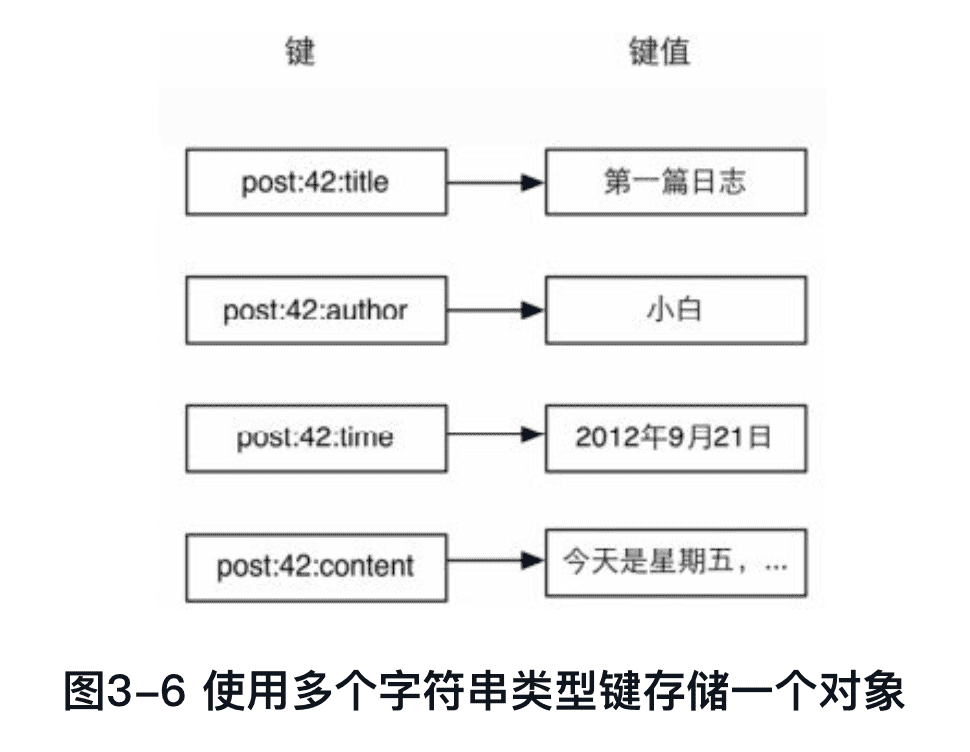

《Redis入门指南》笔记
---------

Redis也是一个名副其实的多面手，无论是存储、队列还是缓存系统，都有它的用武之地。

https://github.com/luin/redis-book-assets

## 1 简介

Redis是一个开源的高性能键值对数据库。它通过提供多种键值数据类型来适应不同场景下的存储需求，并借助许多高层级的接口使其可以胜任如缓存、队列系统等不同的角色。

2008年，意大利，Salvatore Sanfilippo

Redis是**REmote DIctionary Server**（远程字典服务器）的缩写，它以字典结构存储数据，并允许其他应用通过TCP协议读写字典中的内容。

Redis支持的键值数据类型：字符串类型，散列类型，列表类型，集合类型，有序集合类型。

Redis字典结构的存储方式和对多种键值数据类型的支持使得开发者可以将程序中的数据直接映射到Redis中，数据在Redis中的存储形式和其在程序中的存储方式非常相近。

Redis对不同的数据类型提供了非常方便的操作方式。

Redis数据库中的所有数据都存储在内存中。

Redis可以为每个键设置**生存时间（Time To Live，TTL）**，生存时间到期后键会自动被删除。

作为缓存系统，Redis还可以**限定数据占用的最大内存空间**，在数据达到空间限制后可以按照一定的规则自动淘汰不需要的键。

Redis的列表类型键可以用来实现队列，并且支持阻塞式读取，可以很容易地实现一个高性能的优先级队列。

Redis还支持“发布/订阅”的消息模式，可以基于此构建聊天室 等系统。

Redis的贡献者之一Pieter Noordhuis提供了一个使用该模式开发的聊天室的例子，见https://gist.github.com/348262。

在Redis中使用命令来读写数据，命令语句之于Redis就相当于SQL语言之于关系数据库。

```mysql
Select title From posts Where id = 1 Limit 1;

HGET post:1 title
```

Redis提供了一百多个命令，听起来很多，但是常用的却只有十几个，并且每个命令都很容易记忆。

Redis使用C语言开发，代码量只有3万多行（2.6.9）。

## 2 准备

### 2.1 安装Redis

#### 在POSIX系统中安装

POSIX系统，包括Linux、OS X和BSD等。

```shell
wget http://download.redis.io/redis-stable.tar.gz
tar xzf redis-stable.tar.gz
cd redis-stable
make
make install
```

make install 默认会将可执行程序复制到`/usr/local/bin`目录中。

以往版本中存在的已知问题：https://redis.io/topics/problems 。

#### 在OS X系统中安装

```shell
$ brew install redis
```

#### 在Windows中安装


### 2.2 启动和停止Redis

几个程序被复制到`/usr/local/bin`目录中。


#### 启动Redis

##### 1.直接启动（适用于开发环境）

```shell
$ redis-server

$ redis-server --port 6380
```

Redis服务器默认6379端口，可通过--port修改。

##### 2.通过初始化脚本启动Redis（适用生产环境）

源码中有初始化脚本`utils/redis_init_script`：

```shell
#!/bin/sh
#
# Simple Redis init.d script conceived to work on Linux systems
# as it does use of the /proc filesystem.

### BEGIN INIT INFO
# Provides:     redis_6379
# Default-Start:        2 3 4 5
# Default-Stop:         0 1 6
# Short-Description:    Redis data structure server
# Description:          Redis data structure server. See https://redis.io
### END INIT INFO

REDISPORT=6379
EXEC=/usr/local/bin/redis-server
CLIEXEC=/usr/local/bin/redis-cli

PIDFILE=/var/run/redis_${REDISPORT}.pid
CONF="/etc/redis/${REDISPORT}.conf"

case "$1" in
    start)
        if [ -f $PIDFILE ]
        then
                echo "$PIDFILE exists, process is already running or crashed"
        else
                echo "Starting Redis server..."
                $EXEC $CONF
        fi
        ;;
    stop)
        if [ ! -f $PIDFILE ]
        then
                echo "$PIDFILE does not exist, process is not running"
        else
                PID=$(cat $PIDFILE)
                echo "Stopping ..."
                $CLIEXEC -p $REDISPORT shutdown
                while [ -x /proc/${PID} ]
                do
                    echo "Waiting for Redis to shutdown ..."
                    sleep 1
                done
                echo "Redis stopped"
        fi
        ;;
    *)
        echo "Please use start or stop as first argument"
        ;;
esac

```


#### 停止Redis

考虑到Redis有可能正在将内存中的数据同步到硬盘中，强行终止Redis进程可能会导致数据丢失。

```shell
$ redis-cli SHUTDOWN
```

当Redis收到SHUTDOWN命令后，会先断开所有客户端连接，然后根据配置执行持久化，最后完成退出。

Redis可以妥善处理SIGTERM信号，所以使用“kill Redis进程的PID”也可以正常结束Redis，效果与发送SHUTDOWN命令一样。

### 2.3 Redis命令行客户端

redis-cli（RedisCommand Line Interface）是Redis自带的基于命令行的Redis客户端，也是我们学习和测试Redis的重要工具。

#### 发送命令

`redis-cli`会按照默认配置（服务器地址为127.0.0.1，端口号为6379）链接Redis：

```shell
$ redis-cli
127.0.0.1:6379>
```

也可以通过参数-h和-p自定义地址和端口号：

```shell
$ redis-cli -h 127.0.0.1 -p 6379
127.0.0.1:6379>
```

Redis提供了PING命令来测试客户端与Redis的连接是否正常，如果连接正常会收到回复PONG：

```shell
$ redis-cli ping
PONG
```

当然也可以在进入交互模式后，自由输入命令：

```shell
$ redis-cli
127.0.0.1:6379> ping
PONG
127.0.0.1:6379> Echo hi
"hi"
```

#### 命令返回值

##### 1.状态回复

状态回复（status reply）是最简单的一种回复，比如向Redis发送SET命令设置某个键的值时，Redis会回复状态OK表示设置成功。另外之前演示的对PING命令的回复PONG也是状态回复。

##### 2.错误回复

当出现命令不存在或命令格式有错误等情况时Redis会返回错误回复（error reply）。错误回复以(error)开头，并在后面跟上错误信息。

```shell
127.0.0.1:6379> adasd
(error) ERR unknown command `adasd`, with args beginning with:
```

##### 3.整数回复

Redis虽然没有整数类型，但是却提供了一些用于整数操作的命令，如递增键值的**INCR**命令会以整数形式返回递增后的键值。除此之外，一些其他命令也会返回整数，如可以获取当前数据库中键的数量的**DBSIZE**命令等。整数回复（integer reply）以(integer)开头，并在后面跟上整数数据：

```shell
127.0.0.1:6379> INCR foo
(integer) 1
```

##### 4.字符串回复

字符串回复（bulk reply）是最常见的一种回复类型，当请求一个字符串类型键的键值或一个其他类型键中的某个元素时就会得到一个字符串回复。字符串回复以双引号包裹：

```shell
127.0.0.1:6379> Get foo
"1"
```

当请求的键值不存在时会得到一个空结果，显示为(nil)。

##### 5.多行字符串回复

当请求一个非字符串类型键的元素列表时就会收到多行字符串回复。多行字符串回复中的每行字符串都以一个序号开头，如：

```shell
127.0.0.1:6379> KEYS *
1) "foo"
2) "bar"
```

### 2.4 配置

通过类似`-p`这样的启动参数可以配置少量的配置选项，但配置很多选项时需要使用配置文件来配置，就是通过把配置文件当作启动参数传递给`redis-server`：

```shell
$ redis-server /path/to/redis.conf
```

配置文件具体位置可以自定义。

也通过启动参数传递同名的配置选项会**覆盖**配置文件中相应的参数：

```shell
$ redis-server /path/to/redis.conf --loglevel warning
```

Redis源码目录中提供了一个配置文件的模板redis.conf。

还可以在Redis的交互模式下查看和动态设置（不需要重启Redis）配置选项：

```shell
127.0.0.1:6379> Congfig Get loglevel
1) "loglevel"
2) "notice"
127.0.0.1:6379> Config set loglevel warning
OK
127.0.0.1:6379> Config Get loglevel
1) "loglevel"
2) "warning"
```


### 2.5 多数据库

Redis与在一个关系数据库实例中可以创建多个数据库类似，可以将其中的每个字典都理解成一个独立的数据库。

每个数据库对外都是以一个从0开始的递增数字命名，Redis默认支持16个数据库，可以通过配置参数**databases**来修改这一数字。客户端与Redis建立连接后会自动选择0号数据库，不过可以随时使用**SELECT**命令更换数据库，如要选择1号数据库：

```shell
127.0.0.1:6379> Get foo
"1"
127.0.0.1:6379> Select 1
OK
127.0.0.1:6379[1]> Get foo
(nil)
```

Reids中这些以数字命名的数据库与关系数据库的区别：

1. 只能以数字命名，不能自定义；
2. 不支持为每个数据库设置访问密码，所以一个客户端要么可以访问全部数据库，要么一个也不可以访问；
3. 多个数据库之间并不完全隔离，如**FLUSHALL**可以清空所有数据中数据。

因此，这些数据库更像是一种命名空间，而不适宜存储不同应用程序的数据。

一个空Redis实例占用的内存只有1MB左右。

## 3 入门

### 3.1 热身

#### 1.获得符合规则的键名列表

```
> KEYS pattern
```

**pattern**支持glob风格通配符格式：


```
// 获取所有的键
KEYS *   
```

KEYS命令需要遍历Redis中的所有键，当键的数量较多时会影响性能，不建议在生产环境中使用。

#### 2.判断一个键是否存在

```
> Exists key
```

存在返回1，否则返回0。

#### 3.删除键

```
> Del key [key ...]
```

删除成功返回1，否则返回0。

DEL命令的参数不支持通配符，但可以结合Linux的管道和xargs命令实现删除所有符合规则的键。比如要删除所有以“user:”开头的键：

```shell
$ redis-cli KEYS"user:＊" | xargs redis-cli DEL
```

```shell
$ redis-cli DEL 'redis-cliKEYS"user:＊"'
```

#### 4.获得键值的数据类型

```
> Type key
```

返回值可能是：string（字符串类型）、hash（散列类型）、list（列表类型）、set（集合类型）、zset（有序集合类型）。

### 3.2 字符串类型

一个字符串类型键允许存储的数据的最大容量是**512 MB**。

**字符串类型是其他4种数据类型的基础**，其他数据类型和字符串类型的差别从某种角度来说只是组织字符串的形式不同。例如，列表类型是以列表的形式组织字符串，而集合类型是以集合的形式组织字符串。

#### 命令

##### 1.赋值与取值

```shell
Set key value
Get key
```

PHP实现一个SET/GET命令的示例：

```php
<?php
// 加载Predis库的自动加载函数
require './predis/autoload.php';

// 连接Redis
$redis= new Predis\Client(array(
    'host' =＞ '127.0.0.1',
    'port'    =＞ 6379
));

// 如果提交了姓名则使用SET命令将姓名写入到Redis中
if ($_GET['name']) {
    $redis-＞set('name', $_GET['name']);
}
// 通过GET命令从Redis中读取姓名
$name = $redis-＞get('name');
?＞

＜!DOCTYPE html＞
＜html＞ 
    ＜head＞
        ＜meta charset="utf-8" /＞
        ＜title＞我的第一个Redis程序＜/title＞ 
    ＜/head＞ 
    ＜body＞
    ＜?php if ($name): ?＞
        ＜p＞您的姓名是：＜?php echo $name; ?＞＜/p＞
    ＜?php else: ?＞
        ＜p＞您还没有设置姓名。＜/p＞
    ＜?php endif; ?＞
        ＜hr/＞
        ＜h1＞更改姓名＜/h1＞
        ＜form＞
            ＜p＞
                ＜label for="name"＞您的姓名：＜/label＞
                ＜input type="text" name="name" id="name" /＞
            ＜/p＞
            ＜p＞
                ＜button type="submit"＞提交＜/button＞
            ＜/p＞
        ＜/form＞  
    ＜/body＞
＜/html＞
```

上面例子使用PHP的Redis客户端库Predis与Redis通信。

##### 2.递增数字

```
INCR key
```

字符串类型可以存储任何形式的字符串，当存储的字符串是整数形式时，可用**INCR**让当前键值递增，并返回递增后的值。

当要操作的键不存在时会默认键值为0。

键值不是整数时Redis会提示错误：

```shell
127.0.0.1:6379> Set foo learn
OK
127.0.0.1:6379> Incr foo
(error) ERR value is not an integer or out of range
```

包括`INCR`在内的所有Redis命令都是**原子操作**（atomicoperation）（原子操作取“原子”的“不可拆分”的意思，原子操作是最小的执行单位，不会在执行的过程中被其他命令插入打断。），无论多少个客户端同时连接，都不会出现**竞态条件**（race condition）（竞态条件是指一个系统或者进程的输出，依赖于不受控制的事件的出现顺序或者出现时机。）。


#### 实践

##### 1.文章访问量统计

Redis对于键的命名并没有强制的要求，但比较好的实践是用`对象类型:对象ID:对象属性`来命名一个键，如使用键`user:1:friends`来存储ID为1的用户的好友列表。

对于多个单词则推荐使用`.`分隔，如`post:文章ID:page.view`可作为记录文章访问量的键。


##### 2.生成自增ID

在关系数据库中通过设置字段属性为**AUTO_INCREMENT**来实现每增加一条记录自动为其生成一个唯一的递增ID的目的。

而在Redis中可以通过另一种模式来实现：对于每一类对象使用名为`对象类型(复数形式):count`的键（如`users:count`）来存储当前类型对象的数量，每增加一个新对象时都使用INCR命令递增该键的值。（当然这种命名方式只是参考）


##### 3.存储文章数据

文章的多个元素可以通过**序列化函数**（如PHP中的`serialize`和JavaScript中的`JSON.stringify`）转换成一个字符串。

因为字符串类型键可以存储二进制数据，所以也可以使用[MessagePack（类似JSON的一种数据格式）](https://msgpack.org/)进行序列化，速度更快，占用空间也更小。

发布新文章时的伪代码：

```php
# 首先获得新文章的ID
$postID = INCR posts:count
# 将博客文章的诸多元素序列化成字符串
$serializedPost = serialize($title, $content, $author, $time)
# 把序列化后的字符串存一个入字符串类型的键中
SET post:$postID:data, $serializedPost
```


获取文章数据的伪代码如下（以访问ID为42的文章为例）：

```php
# 从Redis中读取文章数据
$serializedPost = GET post:42:data
# 将文章数据反序列化成文章的各个元素
$title, $content, $author, $time = unserialize($serializedPost)
# 获取并递增文章的访问数量
$count = INCR post:42:page.view
```

除了使用序列化函数将文章的多个元素存入一个字符串类型键中外，还可以对每个元素使用一个字符串类型键来存储，这种方法会在散列类型中讨论。


#### 命令拾遗

##### 1.增加指定的整数

```shell
Incrby key increment
```

```shell
127.0.0.1:6379> Incrby bar 2
(integer) 2
127.0.0.1:6379> Incrby bar 3
(integer) 5
```

##### 2.减少指定的整数

```shell
Decr key
Decrby key decrement
```

```shell
127.0.0.1:6379> Decr bar
(integer) 4
127.0.0.1:6379> Decrby bar 2
(integer) 2
```

**Incrby**和**Decrby**都是可以用负参数值的。

##### 3.增加指定浮点数

```shell
Incrbyfloat key increment
```

```shell
127.0.0.1:6379> Incrbyfloat bar 2.7
"4.7"
127.0.0.1:6379> Incrbyfloat bar 5e+4
"50004.69999999999999929"
```

##### 4.向尾部追加值

```shell
Append key value
```

APPEND作用是向键值的末尾追加value。如果键不存在则将该键的值设置为value，即相当于`SET key value`。返回值是追加后字符串的总长度。

```shell
127.0.0.1:6379> Set key hello
OK
127.0.0.1:6379> Append key " world!"
(integer) 12
```

第二个参数加了双引号，原因是该参数包含空格。

##### 5.获取字符串长度

```shell
Strlen key
```

```shell
127.0.0.1:6379> Strlen key
(integer) 12
127.0.0.1:6379> Set key 中国
OK
127.0.0.1:6379> Strlen key
(integer) 6
```

字符串类型可以存储二进制数据，所以它可以存储任何编码的字符串。

##### 6.同时获得/设置多个键值

```shell
Mget key [key ...]
Mset key value [key value ...]
```

```shell
127.0.0.1:6379> Mset key1 v1 key2 v2 key3 v3
OK
127.0.0.1:6379> Mget key1 key3
1) "v1"
2) "v3"
```

##### 7.位操作

```shell
Getbit key offset
Setbit key offset value
Bitcount key [start] [end]
Bittop operation destkey key [key ...]
```

```shell
> Set foo bar
OK
```

bar的3个字母对应的ASCII码分别为98、97和114，转换成二进制后分别为1100010、1100001和1110010，二进制位结构：


**GETBIT**命令可以获得一个字符串类型键指定位置的二进制位的值（0或1），索引从0开始（从左边开始）：

```shell
127.0.0.1:6379> Getbit foo 2
(integer) 1
127.0.0.1:6379> Getbit foo 3
(integer) 0
127.0.0.1:6379> Getbit foo 4
(integer) 0
127.0.0.1:6379> Getbit foo 6
(integer) 1
127.0.0.1:6379> Getbit foo 10000
(integer) 0
```

超出索引范围默认位值为0。

**SETBIT**命令可以设置字符串类型键指定位置的二进制位的值，返回值是该位置的旧值。

```shell
127.0.0.1:6379> Setbit foo 6 0
(integer) 1
127.0.0.1:6379> Get foo
"`ar"
127.0.0.1:6379> Setbit foo 7 1
(integer) 0
127.0.0.1:6379> Get foo
"aar"
```

🔖Setbit设置超返回和不存在键的情况

**BITCOUNT**命令可以获得字符串类型键中值是1的二进制位个数，例如：

```shell
127.0.0.1:6379> Bitcount foo
(integer) 10
```

可以通过参数来限制统计的字节范围，如统计前两个字节（即"aa"）：

```shell
127.0.0.1:6379> Bitcount foo 0 1
(integer) 6
```

统计最后一个字节（即"r"）：

```shell
127.0.0.1:6379> Bitcount foo 2 2
(integer) 4
```

**BITOP**命令可以对多个字符串类型键进行位运算，并将结果存储在destkey参数指定的键中。BITOP命令支持的运算操作有AND、OR、XOR和NOT。

```shell
127.0.0.1:6379> Set foo1 bar
OK
127.0.0.1:6379> Set foo2 aar
OK
127.0.0.1:6379> Bitop OR res foo1 foo2
(integer) 3
127.0.0.1:6379> Get res
"car"
```


利用位操作命令可以非常紧凑地存储布尔值。比如某网站的每个用户都有一个递增的整数ID，如果使用一个字符串类型键配合位操作来记录每个用户的性别（用户ID作为索引，二进制位值1和0表示男性和女性），那么记录100万个用户的性别只需占用100 KB（1000000/8/1024 = 122.0703125KB）多的空间，而且由于GETBIT和SETBIT的时间复杂度都是O(1)，所以读取二进制位值性能很高。


### 3.3 散列类型

散列类型（hash）的键值也是一种字典结构，其存储了**字段**（field）和**字段值**的映射，但字段值只能是字符串，不支持其他数据类型。

一个散列类型键可以包含至多**2<sup>32</sup>-1**个字段。

> 除了散列类型，Redis的其他数据类型同样不支持数据类型嵌套。比如集合类型的每个元素都只能是字符串，不能是另一个集合或散列表等。

散列类型适合存储对象：使用**对象类别和ID**构成键名，使用**字段表示对象的属性，而字段值则存储属性值**。例如要存储ID为2的汽车对象，可以分别使用名为color、name和price的3个字段来存储该辆汽车的颜色、名称和价格。


关系数据库中数据是以二维表的形式存储的，这就要求所有的记录都拥有同样的属性，无法单独为某条记录增减属性。如果想为ID为1的汽车增加生产日期属性，就需要把数据表更改为：


对于ID为2和3的两条记录而言date字段是冗余的。


#### 命令

##### 1.赋值与取值

```shell
HSet key field value
HGet key field
HMSet key field value [field value ...]
HMGet key field [field ...]
HGetall key
```

`HSet`不区分插入和更新，字段不存在时就插入返回1，字段存在就更新就返回0，当键本身不存在时也会自动建立。

##### 2.判断字段是否存在

```
HExists key field
```

字段存在返回1，否则返回0。

##### 3.当字段不存在时赋值

```
HSetNX key field value
```

`HSetnx`与`HSet`的区别在于，如果字段存在前者不执行操作。执行了返回1，否则返回0。

`NX`是`if Not eXists`的缩写。

##### 4.增加数字

```
HIncrby key field increment
```

```
> HIncrby person score 60
(integer) 60
```

之前person键不存在，`HIncrby`会自动建立。

##### 5.删除字段

```
HDel key field [field ...]
```


#### 实践

##### 1.存储文章数据




##### 2.存储文章缩略名

WordPress中发布文章时一般需要指定一个缩略名（slug）来构成该篇文章的网址的一部分，缩略名必须符合网址规范且最好可以与文章标题含义相似，如“This Is A Great Post!”的缩略名可以为“this-is-a-great-post”。每个文章的缩略名必须是**唯一**的，所以在发布文章时程序需要验证用户输入的缩略名是否存在，同时也需要通过缩略名获得文章的ID。

可以使用一个散列类型的键`slug.to.id`来存储文章缩略名和ID之间的映射关系。其中**字段用来记录缩略名，字段值用来记录缩略名对应的ID**。这样就可以使用HEXISTS命令来判断缩略名是否存在，使用HGET命令来获得缩略名对应的文章ID了。

发布文章伪代码变为：

```php
$postID = INCR posts:count

# 判断用户输入的slug是否可用，如果可用则记录
$isSlugAvailable = HSETNX slug.to.id, $slug, $postID
if $isSlugAvailable is 0
  # slug已经用过了，需要提示用户更换slug,
  # 这里为了演示方便直接退出。
  exit

HMSET post:$postID, title, $title, content, $content, slug, $slug,...
```

通过查询`slug.to.id`键来获取文章ID：

```php
$postID = HGet slug.to.id, $slug
if not $postID
  print 文章不存在
  exit

$post = HGetall post:$postID 
print 文章标题:$post.title
```

修改缩略名：

```php
# 判断新的slug是否可用，如果可用则记录
$isSlugAvailable = HSETNX slug.to.id, $newSlug, 42
if $isSlugAvailable is 0
  exit

  # 获得旧的缩略名
  $oldSlug = HGET post:42, slug
  # 设置新的缩略名
  HSET post:42, slug, $newSlug
  # 删除旧的缩略名
  HDEL slug.to.id, $oldSlug
```

#### 命令拾遗

```shell
# 只获取字段名或字段值
HKeys key
HVals key
# 获得字段数量
HLen key
```


### 3.4 列表类型


列表类型（list）可以存储一个**有序的字符串列表**，常用的操作是向列表两端添加元素，或者获得列表的某一个片段。

列表类型内部是使用**双向链表**（double linked list）实现的，所以向列表两端添加元素的时间复杂度为**O(1)**，获取越接近两端的元素速度就越快。这意味着即使是一个有几千万个元素的列表，获取头部或尾部的10条记录也是极快的（和从只有20个元素的列表中获取头部或尾部的10条记录的速度是一样的）。

用链表的代价是**通过索引访问元素比较慢**。

列表适合的场景：

- 社交网站的新鲜事。关心的只是最新的内容

- 记录日志。保证加入新日志的速度不会受到已有日志数量的影响

一个列表类型键最多也能容纳**2<sup>32</sup>-1**个元素。

> 有序但不唯一

#### 命令

```shell
# 向列表两端增加元素，返回值表示增加元素后列表的长度
LPush key value [value ...]
RPush key value [value ...]
# 从列表两端弹出元素，返回时弹出的元素
LPop key
RPop key
# 获取列表中元素的个数
LLen key
# 获得列表片段
LRange key start stop

# 删除列表中指定的值
LRem key count value
# LRem删除列表中前count个值为value的元素，返回值是实际删除的元素个数。
```

如果想把列表当做栈，则搭配使用LPUSH和LPOP或RPUSH和RPOP，如果想当成队列，则搭配使用LPUSH和RPOP或RPUSH和LPOP。


#### 列表实践

##### 1.存储文章ID列表

使用列表类型键`posts:list`记录文章ID列表。当发布新文章时使用`LPUSH`命令把新文章的ID加入这个列表中，另外删除文章时也要记得把列表中的文章ID删除：`LREM posts:list 1`要删除的文章ID。

有了文章ID列表，就可以使用LRANGE命令来实现文章的分页显示了，伪代码：

```php
$postsPerPage = 10
$start = ($currentPage - 1) * $postsPerPage
$end = $currentPage * $postsPerPage - 1
$postsID = LRANGE posts:list, $start, $end

# 
for each $id in $postsID
  $post = HGETALL post:$id
  print 文章标题：$post.title
```


##### 2.存储评论列表

🔖

#### 命令拾遗

```
Lindex key index
Lset key index value

Ltrim key start end

Linsert key Before|After pivot value

Rpoplpush source destination
```


### 3.5 集合类型

一个集合类型（set）键可以存储至多2<sup>32</sup>-1个字符串。

> 唯一但不有序

文章标签

#### 命令

```shell
# 增加/删除元素
SAdd key member [member ...]
SRem key member [member ...]
# 获得集合中的所有元素
SMembers key
# 判断元素是否在集合中
SIsMember key member
# 集合间运算
SDiff key [key ...]
SInter key [key ...]
SUnion key [key ...]
```


#### 实践

##### 1.存储文章标签

`post:文章ID:tags`


##### 2.通过标签搜索文章


#### 命令拾遗

```shell
# 获得集合中元素个数
SCard key

# 进行集合运算并将结果存储
SDiffStore destination key [key ...]
SInterStore destination key [key ...]
SUnionStore destination key [key ...]

# 随机获得集合中的元素
SRandMember key [count]

# 从集合中弹出一个元素
SPop key
```


### 3.6 有序集合类型

文章访问量排序

有序集合类型与列表类型相同点：

1. 二者都是有序的。
2. 二者都可以获得某一范围的元素。

二者也有很大的区别，这使得它们的应用场景也是不同的。

1. 列表类型是通过链表实现的，获取靠近两端的数据速度极快，而当元素增多后，访问中间数据的速度会较慢，所以它更加适合实现如“新鲜事”或“日志”这样很少访问中间元素的应用。
2. 有序集合类型是使用散列表和跳跃表（Skip list）实现的，所以即使读取位于中间部分的数据速度也很快（时间复杂度是O(log(N))）。
3. 列表中不能简单地调整某个元素的位置，但是有序集合可以（通过更改这个元素的分数）。
4. 有序集合要比列表类型更耗费内存。

#### 命令

##### 1.增加元素

```shell
ZAdd key score member [score member ...]
```

ZADD命令用来向有序集合中加入一个元素和该元素的分数，如果该元素已经存在则会用新的分数替换原有的分数。ZADD命令的返回值是新加入到集合中的元素个数（不包含之前已经存在的元素）。

分数不仅可以是整数，还支持双精度浮点数。

##### 2.获得元素的分数

```
ZScore key member
```

##### 3.获得排名在某个范围的元素列表

```
ZRange key start stop [WithScores]
ZRevRange key start stop [WithScores]
```

ZRANGE命令会按照元素分数从小到大的顺序返回索引从start到stop之间的所有元素（包含两端的元素）。

如果需要同时获得元素的分数的话可以在ZRANGE命令的尾部加上`WITHSCORES`参数。

ZRANGE命令的时间复杂度为O(logn + m)（其中n为有序集合的基数，m为返回的元素个数）。

ZREVRANGE命令和ZRANGE的唯一不同在于ZREVRANGE命令是按照元素分数从大到小的顺序给出结果的。

##### 4.获得指定分数范围的元素

```
ZRangeByScore key min max [WithScores] [Limit offset count]
```

##### 5.增加某个元素的分数

```
ZIncrby key increment member
```


#### 实践

##### 1.实现按点击量排序


##### 2.改进按时间排序


#### 命令拾遗

```shell
# 获得集合中元素的数量
ZCard key
# 获得指定分数范围内的元素个数
ZCount key min max
# 删除一个或多个元素
ZRem key member [member ...]
# 按照排名范围删除元素
ZRemRangeByRank key start stop
# 按照分数范围删除元素
ZRemRangeByScore key min max
# 获得元素的排名
ZRank key member
ZRevRank key member
# 计算有序集合的交集
ZINTERSTORE destination numkeys key [key …] [WEIGHTS weight [weight …]] [AGGREGATE SUM|MIN|MAX]
```


## 4 进阶


### 4.1 事务

Redis中的事务（transaction）是一组命令的集合。事务同命令一样都是Redis的最小执行单位，一个事务中的命令要么都执行，要么都不执行

Redis保证一个事务中的所有命令要么都执行，要么都不执行。如果在发送EXEC命令前客户端断线了，则Redis会清空事务队列，事务中的所有命令都不会执行。而一旦客户端发送了EXEC命令，所有的命令就都会被执行，即使此后客户端断线也没关系，因为Redis中已经记录了所有要执行的命令。

#### 错误处理

只要有一个命令有语法错误，执行EXEC命令后Redis就会直接返回错误，连语法正确的命令也不会执行。

Redis的事务没有关系数据库事务提供的回滚（rollback）功能。为此开发者必须在事务执行出错后自己收拾剩下的摊子（将数据库复原回事务执行前的状态等）。

#### WATCH命令介绍


### 4.2 生存时间


Redis中可以使用EXPIRE命令设置一个键的生存时间，到时间后Redis会自动删除它。

```
Expire key seconds
```

`TTL`知道一个键还有多久被删掉：

```
127.0.0.1:6379> set foo bar
OK
127.0.0.1:6379> Expire foo 20
(integer) 1
127.0.0.1:6379> TTL foo
(integer) 15
127.0.0.1:6379> TTL foo
(integer) 11
127.0.0.1:6379> TTL foo
(integer) 4
127.0.0.1:6379> TTL foo
(integer) -1
```

当键不存在时TTL命令会返回`-1`。另外同样会返回-1的情况是没有为键设置生存时间（即永久存在，这是建立一个键后的默认情况）。

`Persist`命令取消键的生存时间设置（即将键恢复成永久的）。

使用SET或GETSET命令为键赋值也会同时清除键的生存时间。

PEXPIRE命令与EXPIRE的唯一区别是前者的时间单位是毫秒，即PEXPIRE key 1000与EXPIRE key 1等价。对应地可以用PTTL命令以毫秒为单位返回键的剩余时间。

`Watch`

#### 实现访问频率限制之一


#### 实现访问频率限制之二


#### 实现缓存


### 4.3 排序


#### 有序集合的集合操作

有序集合常见的使用场景是大数据排序，如游戏的玩家排行榜，所以很少会需要获得键中的全部数据。


#### SORT命令

SORT命令可以对列表类型、集合类型和有序集合类型键进行排序，并且可以完成与关系数据库中的连接查询相类似的任务。

在对有序集合类型排序时会忽略元素的分数，只针对元素自身的值进行排序。

SORT命令还可以通过ALPHA参数实现按照字典顺序排列非数字元素。


#### BY参数


#### GET参数


#### STORE参数


#### 性能优化

SORT是Redis中最强大最复杂的命令之一，如果使用不好很容易成为性能瓶颈。SORT命令的时间复杂度是**O(n+mlogm)**，其中n表示要排序的列表（集合或有序集合）中的元素个数，m表示要返回的元素个数。当n较大的时候SORT命令的性能相对较低，并且Redis在排序前会建立一个长度为n[插图]的容器来存储待排序的元素，虽然是一个临时的过程，但如果同时进行较多的大数据量排序操作则会严重影响性能。

使用SORT命令时注意点：

1. 尽可能减少待排序键中元素的数量（使n尽可能小）。
2. 使用LIMIT参数只获取需要的数据（使m尽可能小）。
3. 如果要排序的数据数量较大，尽可能使用STORE参数将结果缓存。


### 4.4 消息通知


#### 任务队列

通知的过程可以借助任务队列来实现。任务队列顾名思义，就是“传递任务的队列”。与任务队列进行交互的实体有两类，一类是生产者（producer），一类是消费者（consumer）。生产者会将需要处理的任务放入任务队列中，而消费者则不断地从任务队列中读入任务信息并执行。


#### 使用Redis实现任务队列

如果要实现任务队列，只需要让生产者将任务使用LPUSH命令加入到某个键中，另一边让消费者不断地使用RPOP命令从该键中取出任务即可。


#### 优先级队列


#### “发布/订阅”模式

“发布/订阅”模式中包含两种角色，分别是发布者和订阅者。订阅者可以订阅一个或若干个频道（channel），而发布者可以向指定的频道发送消息，所有订阅此频道的订阅者都会收到此消息。


#### 按照规则订阅


### 4.5 管道

客户端和Redis使用TCP协议连接。不论是客户端向Redis发送命令还是Redis向客户端返回命令的执行结果，都需要经过网络传输，这两个部分的总耗时称为**往返时延**。


Redis的底层通信协议对管道（pipelining）提供了支持。通过管道可以一次性发送多条命令并在执行完后一次性将结果返回，当一组命令中每条命令都不依赖于之前命令的执行结果时就可以将这组命令一起通过管道发出。管道通过减少客户端与Redis的通信次数来实现降低往返时延累计值的目的：


### 4.6 节省空间

#### 精简键名和键值


#### 内部编码优化


## 5 实践

### 5.1 PHP与Redis

Redis官方推荐的PHP客户端是[Predis（PHP实现）](https://github.com/nrk/predis)和[phpredis](https://github.com/phpredis)（C实现）


### 5.2 Ruby与Redis

### 5.3 Python与Redis

### 5.4 Node.js与Redis


## 6 脚本

### Lua语言


### Redis与Lua


### 深入脚本


由于Redis脚本非常高效，所以在大部分情况下都不用担心脚本的性能。但同时由于脚本的强大功能，很多原本在程序中执行的逻辑都可以放到脚本中执行，这时就需要开发者根据具体应用权衡到底哪些任务适合交给脚本。通常来讲不应该在脚本中进行大量耗时的计算，因为毕竟Redis是单进程单线程执行脚本，而程序却能够多进程或多线程运行。


## 7 管理

### 7.1 持久化

#### RDB方式

RDB方式的持久化是通过快照（snapshotting）完成的，当符合一定条件时Redis会自动将内存中的所有数据进行快照并存储在硬盘上。进行快照的条件可以由用户在配置文件中自定义，由两个参数构成：**时间**和**改动的键的个数**。当在指定的时间内被更改的键的个数大于指定的数值时就会进行快照。


#### AOF方式

AOF（append only file）

开启AOF持久化后每执行一条会更改Redis中的数据的命令，Redis就会将该命令写入硬盘中的AOF文件。


### 7.2 复制

由于数据是存储在一台服务器上的，如果这台服务器的硬盘出现故障，也会导致数据丢失。为了避免单点故障，我们希望将数据库复制多个副本以部署在不同的服务器上，即使有一台服务器出现故障其他服务器依然可以继续提供服务。这就要求当一台服务器上的数据库更新后，可以自动将更新的数据同步到其他服务器上，Redis提供了复制（replication）功能可以自动实现同步的过程。


### 7.3 安全

#### 可信的环境

Redis的安全设计是在“Redis运行在可信环境”这个前提下做出的，在生产环境运行时不能允许外界直接连接到Redis服务器上，而应该通过应用程序进行中转，运行在可信的环境中是保证Redis安全的最重要方法。


#### 数据库密码


#### 命名命令


### 7.4 通信协议

Redis通信协议是Redis客户端与Redis之间交流的语言，通信协议规定了命令和返回值的格式。

Redis支持两种通信协议，一种是二进制安全的统一请求协议（unifiedrequest protocol），一种是比较直观的便于在telnet程序中输入的简单协议。这两种协议只是命令的格式有区别，命令返回值的格式是一样的。

#### 简单协议


#### 统一请求协议

Redis的AOF文件和主从复制时主数据库向从数据库发送的内容都使用了统一请求协议。如果要开发一个和Redis直接通信的客户端，推荐使用此协议。如果只是想通过telnet向Redis服务器发送命令则使用简单协议就可以了。


### 7.5 管理工具

#### redis-cli


#### phpRedisAdmin


#### Rdbtools


## 附录 Redis命令属性