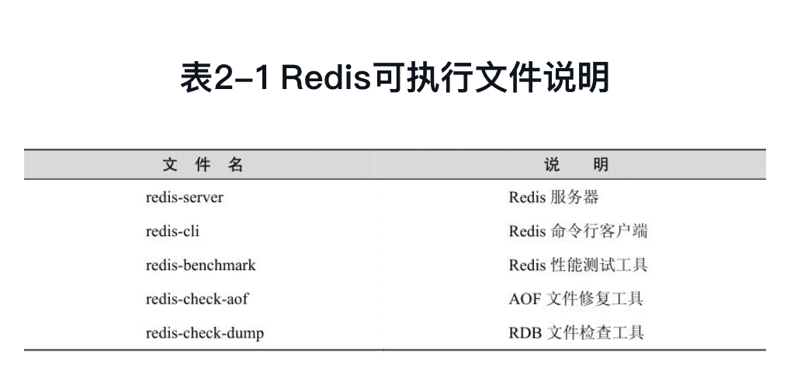
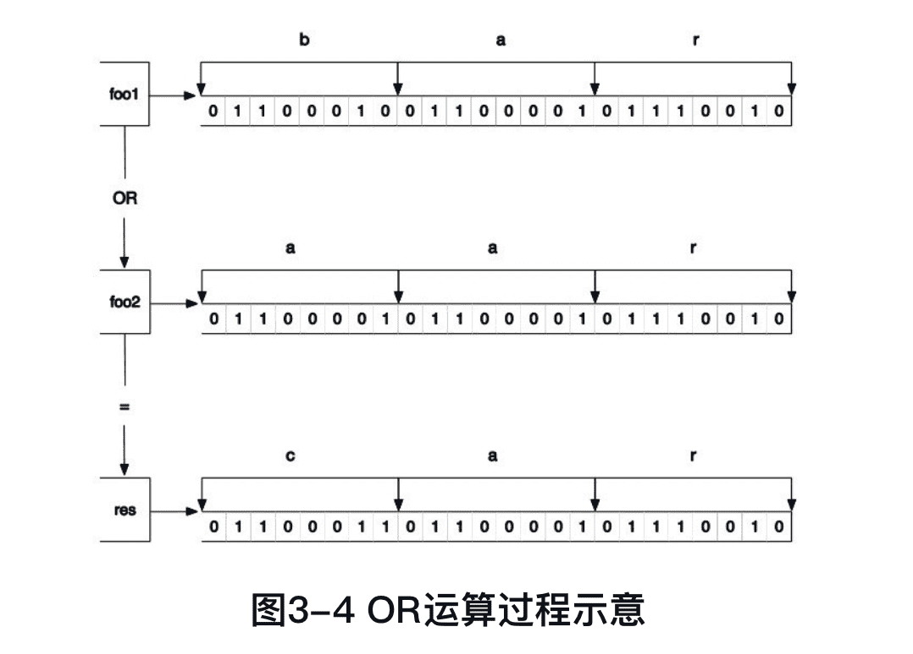

《Redis入门指南》笔记
---------

Redis也是一个名副其实的多面手，无论是存储、队列还是缓存系统，都有它的用武之地。

https://github.com/luin/redis-book-assets

## 1 简介

Redis是一个开源的高性能键值对数据库。它通过提供多种键值数据类型来适应不同场景下的存储需求，并借助许多高层级的接口使其可以胜任如缓存、队列系统等不同的角色。

2008年，意大利，Salvatore Sanfilippo

Redis是REmote DIctionary Server（远程字典服务器）的缩写，它以字典结构存储数据，并允许其他应用通过TCP协议读写字典中的内容。

Redis支持的键值数据类型：字符串类型，散列类型，列表类型，集合类型，有序集合类型。

Redis字典结构的存储方式和对多种键值数据类型的支持使得开发者可以将程序中的数据直接映射到Redis中，数据在Redis中的存储形式和其在程序中的存储方式非常相近。

Redis对不同的数据类型提供了非常方便的操作方式。

Redis数据库中的所有数据都存储在内存中。

Redis可以为每个键设置**生存时间（Time To Live，TTL）**，生存时间到期后键会自动被删除。

作为缓存系统，Redis还可以**限定数据占用的最大内存空间**，在数据达到空间限制后可以按照一定的规则自动淘汰不需要的键。

Redis的列表类型键可以用来实现队列，并且支持阻塞式读取，可以很容易地实现一个高性能的优先级队列。

Redis还支持“发布/订阅”的消息模式，可以基于此构建聊天室 等系统。

Redis的贡献者之一Pieter Noordhuis提供了一个使用该模式开发的聊天室的例子，见https://gist.github.com/348262。

在Redis中使用命令来读写数据，命令语句之于Redis就相当于SQL语言之于关系数据库。

```mysql
Select title From posts Where id = 1 Limit 1;

HGET post:1 title
```

Redis提供了一百多个命令，听起来很多，但是常用的却只有十几个，并且每个命令都很容易记忆。

Redis使用C语言开发，代码量只有3万多行（2.6.9）。

## 2 准备

### 2.1 安装Redis

#### 在POSIX系统中安装

POSIX系统，包括Linux、OS X和BSD等。

```shell
wget http://download.redis.io/redis-stable.tar.gz
tar xzf redis-stable.tar.gz
cd redis-stable
make
make install
```

make install 默认会将可执行程序复制到`/usr/local/bin`目录中。

以往版本中存在的已知问题：https://redis.io/topics/problems 。

#### 在OS X系统中安装

```shell
$ brew install redis
```

#### 在Windows中安装


### 2.2 启动和停止Redis

几个程序被复制到`/usr/local/bin`目录中。



#### 启动Redis

##### 1.直接启动（适用于开发环境）

```shell
$ redis-server

$ redis-server --port 6380
```

Redis服务器默认6379端口，可通过--port修改。

##### 2.通过初始化脚本启动Redis（适用生产环境）

源码中有初始化脚本`utils/redis_init_script`：

```shell
#!/bin/sh
#
# Simple Redis init.d script conceived to work on Linux systems
# as it does use of the /proc filesystem.

### BEGIN INIT INFO
# Provides:     redis_6379
# Default-Start:        2 3 4 5
# Default-Stop:         0 1 6
# Short-Description:    Redis data structure server
# Description:          Redis data structure server. See https://redis.io
### END INIT INFO

REDISPORT=6379
EXEC=/usr/local/bin/redis-server
CLIEXEC=/usr/local/bin/redis-cli

PIDFILE=/var/run/redis_${REDISPORT}.pid
CONF="/etc/redis/${REDISPORT}.conf"

case "$1" in
    start)
        if [ -f $PIDFILE ]
        then
                echo "$PIDFILE exists, process is already running or crashed"
        else
                echo "Starting Redis server..."
                $EXEC $CONF
        fi
        ;;
    stop)
        if [ ! -f $PIDFILE ]
        then
                echo "$PIDFILE does not exist, process is not running"
        else
                PID=$(cat $PIDFILE)
                echo "Stopping ..."
                $CLIEXEC -p $REDISPORT shutdown
                while [ -x /proc/${PID} ]
                do
                    echo "Waiting for Redis to shutdown ..."
                    sleep 1
                done
                echo "Redis stopped"
        fi
        ;;
    *)
        echo "Please use start or stop as first argument"
        ;;
esac

```


#### 停止Redis

考虑到Redis有可能正在将内存中的数据同步到硬盘中，强行终止Redis进程可能会导致数据丢失。

```shell
$ redis-cli SHUTDOWN
```

当Redis收到SHUTDOWN命令后，会先断开所有客户端连接，然后根据配置执行持久化，最后完成退出。

Redis可以妥善处理SIGTERM信号，所以使用“kill Redis进程的PID”也可以正常结束Redis，效果与发送SHUTDOWN命令一样。

### 2.3 Redis命令行客户端

redis-cli（RedisCommand Line Interface）是Redis自带的基于命令行的Redis客户端，也是我们学习和测试Redis的重要工具。

#### 发送命令

`redis-cli`会按照默认配置（服务器地址为127.0.0.1，端口号为6379）链接Redis：

```shell
$ redis-cli
127.0.0.1:6379>
```

也可以通过参数-h和-p自定义地址和端口号：

```shell
$ redis-cli -h 127.0.0.1 -p 6379
127.0.0.1:6379>
```

Redis提供了PING命令来测试客户端与Redis的连接是否正常，如果连接正常会收到回复PONG：

```shell
$ redis-cli ping
PONG
```

当然也可以在进入交互模式后，自由输入命令：

```shell
$ redis-cli
127.0.0.1:6379> ping
PONG
127.0.0.1:6379> Echo hi
"hi"
```

#### 命令返回值

##### 1.状态回复

状态回复（status reply）是最简单的一种回复，比如向Redis发送SET命令设置某个键的值时，Redis会回复状态OK表示设置成功。另外之前演示的对PING命令的回复PONG也是状态回复。

##### 2.错误回复

当出现命令不存在或命令格式有错误等情况时Redis会返回错误回复（error reply）。错误回复以(error)开头，并在后面跟上错误信息。

```shell
127.0.0.1:6379> adasd
(error) ERR unknown command `adasd`, with args beginning with:
```

##### 3.整数回复

Redis虽然没有整数类型，但是却提供了一些用于整数操作的命令，如递增键值的**INCR**命令会以整数形式返回递增后的键值。除此之外，一些其他命令也会返回整数，如可以获取当前数据库中键的数量的**DBSIZE**命令等。整数回复（integer reply）以(integer)开头，并在后面跟上整数数据：

```shell
127.0.0.1:6379> INCR foo
(integer) 1
```

##### 4.字符串回复

字符串回复（bulk reply）是最常见的一种回复类型，当请求一个字符串类型键的键值或一个其他类型键中的某个元素时就会得到一个字符串回复。字符串回复以双引号包裹：

```shell
127.0.0.1:6379> Get foo
"1"
```

当请求的键值不存在时会得到一个空结果，显示为(nil)。

##### 5.多行字符串回复

当请求一个非字符串类型键的元素列表时就会收到多行字符串回复。多行字符串回复中的每行字符串都以一个序号开头，如：

```shell
127.0.0.1:6379> KEYS *
1) "foo"
2) "bar"
```

### 2.4 配置

通过类似`-p`这样的启动参数可以配置少量的配置选项，但配置很多选项时需要使用配置文件来配置，就是通过把配置文件当作启动参数传递给`redis-server`：

```shell
$ redis-server /path/to/redis.conf
```

配置文件具体位置可以自定义。

也通过启动参数传递同名的配置选项会**覆盖**配置文件中相应的参数：

```shell
$ redis-server /path/to/redis.conf --loglevel warning
```

Redis源码目录中提供了一个配置文件的模板redis.conf。

还可以在Redis的交互模式下查看和动态设置（不需要重启Redis）配置选项：

```shell
127.0.0.1:6379> Congfig Get loglevel
1) "loglevel"
2) "notice"
127.0.0.1:6379> Config set loglevel warning
OK
127.0.0.1:6379> Config Get loglevel
1) "loglevel"
2) "warning"
```


### 2.5 多数据库

这与我们熟知的在一个关系数据库实例中可以创建多个数据库类似，所以可以将其中的每个字典都理解成一个独立的数据库。

每个数据库对外都是以一个从0开始的递增数字命名，Redis默认支持16个数据库，可以通过配置参数**databases**来修改这一数字。客户端与Redis建立连接后会自动选择0号数据库，不过可以随时使用**SELECT**命令更换数据库，如要选择1号数据库：

```shell
127.0.0.1:6379> Get foo
"1"
127.0.0.1:6379> Select 1
OK
127.0.0.1:6379[1]> Get foo
(nil)
```

Reids中这些以数字命名的数据库与关系数据库的区别：

1. 只能以数字命名，不能自定义；
2. 不支持为每个数据库设置访问密码，所以一个客户端要么可以访问全部数据库，要么一个也不可以访问；
3. 多个数据库之间并不完全隔离，如**FLUSHALL**可以清空所有数据中数据。

因此，这些数据库更像是一种命名空间，而不适宜存储不同应用程序的数据。

一个空Redis实例占用的内存只有1MB左右。

## 3 入门

### 3.1 热身

#### 1.获得符合规则的键名列表

```
> KEYS pattern
```

**pattern**支持glob风格通配符格式：


```
// 获取所有的键
KEYS *   
```

KEYS命令需要遍历Redis中的所有键，当键的数量较多时会影响性能，不建议在生产环境中使用。

#### 2.判断一个键是否存在

```
> Exists key
```

存在返回1，否则返回0。

#### 3.删除键

```
> Del key [key ...]
```

删除成功返回1，否则返回0。

DEL命令的参数不支持通配符，但可以结合Linux的管道和xargs命令实现删除所有符合规则的键。比如要删除所有以“user:”开头的键：

```shell
$ redis-cli KEYS"user:＊" | xargs redis-cli DEL
```

```shell
$ redis-cli DEL 'redis-cliKEYS"user:＊"'
```

#### 4.获得键值的数据类型

```
> Type key
```

返回值可能是：string（字符串类型）、hash（散列类型）、list（列表类型）、set（集合类型）、zset（有序集合类型）。

### 3.2 字符串类型

一个字符串类型键允许存储的数据的最大容量是**512 MB**。

**字符串类型是其他4种数据类型的基础**，其他数据类型和字符串类型的差别从某种角度来说只是组织字符串的形式不同。例如，列表类型是以列表的形式组织字符串，而集合类型是以集合的形式组织字符串。

#### 命令

##### 1.赋值与取值

```shell
Set key value
Get key
```

PHP实现一个SET/GET命令的示例：

```php
<?php
// 加载Predis库的自动加载函数
require './predis/autoload.php';

// 连接Redis
$redis= new Predis\Client(array(
    'host' =＞ '127.0.0.1',
    'port'    =＞ 6379
));

// 如果提交了姓名则使用SET命令将姓名写入到Redis中
if ($_GET['name']) {
    $redis-＞set('name', $_GET['name']);
}
// 通过GET命令从Redis中读取姓名
$name = $redis-＞get('name');
?＞

＜!DOCTYPE html＞
＜html＞ 
    ＜head＞
        ＜meta charset="utf-8" /＞
        ＜title＞我的第一个Redis程序＜/title＞ 
    ＜/head＞ 
    ＜body＞
    ＜?php if ($name): ?＞
        ＜p＞您的姓名是：＜?php echo $name; ?＞＜/p＞
    ＜?php else: ?＞
        ＜p＞您还没有设置姓名。＜/p＞
    ＜?php endif; ?＞
        ＜hr/＞
        ＜h1＞更改姓名＜/h1＞
        ＜form＞
            ＜p＞
                ＜label for="name"＞您的姓名：＜/label＞
                ＜input type="text" name="name" id="name" /＞
            ＜/p＞
            ＜p＞
                ＜button type="submit"＞提交＜/button＞
            ＜/p＞
        ＜/form＞  
    ＜/body＞
＜/html＞
```

上面例子使用PHP的Redis客户端库Predis与Redis通信。

##### 2.递增数字

```
INCR key
```

字符串类型可以存储任何形式的字符串，当存储的字符串是整数形式时，可用**INCR**让当前键值递增，并返回递增后的值。

当要操作的键不存在时会默认键值为0。

键值不是整数时Redis会提示错误：

```shell
127.0.0.1:6379> Set foo learn
OK
127.0.0.1:6379> Incr foo
(error) ERR value is not an integer or out of range
```

包括INCR在内的所有Redis命令都是原子操作（atomicoperation）（原子操作取“原子”的“不可拆分”的意思，原子操作是最小的执行单位，不会在执行的过程中被其他命令插入打断。），无论多少个客户端同时连接，都不会出现竞态条件（race condition）（竞态条件是指一个系统或者进程的输出，依赖于不受控制的事件的出现顺序或者出现时机。）。

#### 实践

##### 1.文章访问量统计

Redis对于键的命名并没有强制的要求，但比较好的实践是用`对象类型:对象ID:对象属性`来命名一个键，如使用键`user:1:friends`来存储ID为1的用户的好友列表。对于多个单词则推荐使用`.`分隔。

`post:文章ID:page.view`

##### 2.生成自增ID

在关系数据库中通过设置字段属性为**AUTO_INCREMENT**来实现每增加一条记录自动为其生成一个唯一的递增ID的目的。

而在Redis中可以通过另一种模式来实现：对于每一类对象使用名为`对象类型(复数形式):count`的键（如`users:count`）来存储当前类型对象的数量，每增加一个新对象时都使用INCR命令递增该键的值。（当然这种命名方式只是参考）

##### 3.存储文章数据

文章的多个元素可以通过序列化函数（如PHP中的serialize和JavaScript中的JSON.stringify）转换成一个字符串。

因为字符串类型键可以存储二进制数据，所以也可以使用MessagePack[插图]进行序列化，速度更快，占用空间也更小。

发布新文章时的伪代码：

```php
# 首先获得新文章的ID
$postID = INCR posts:count
# 将博客文章的诸多元素序列化成字符串
$serializedPost = serialize($title, $content, $author, $time)
# 把序列化后的字符串存一个入字符串类型的键中
SET post:$postID:data, $serializedPost
```


获取文章数据的伪代码如下（以访问ID为42的文章为例）：

```php
# 从Redis中读取文章数据
$serializedPost = GET post:42:data
# 将文章数据反序列化成文章的各个元素
$title, $content, $author, $time = unserialize($serializedPost)
# 获取并递增文章的访问数量
$count = INCR post:42:page.view
```

除了使用序列化函数将文章的多个元素存入一个字符串类型键中外，还可以对每个元素使用一个字符串类型键来存储，这种方法会在3.3.3节讨论。

#### 命令拾遗

##### 1.增加指定的整数

```shell
Incrby key increment
```

```shell
127.0.0.1:6379> Incrby bar 2
(integer) 2
127.0.0.1:6379> Incrby bar 3
(integer) 5
```

##### 2.减少指定的整数

```shell
Decr key
Decrby key decrement
```

```shell
127.0.0.1:6379> Decr bar
(integer) 4
127.0.0.1:6379> Decrby bar 2
(integer) 2
```

**Incrby**和**Decrby**都是可以用负参数值的。

##### 3.增加指定浮点数

```shell
Incrbyfloat key increment
```

```shell
127.0.0.1:6379> Incrbyfloat bar 2.7
"4.7"
127.0.0.1:6379> Incrbyfloat bar 5e+4
"50004.69999999999999929"
```

##### 4.向尾部追加值

```shell
Append key value
```

APPEND作用是向键值的末尾追加value。如果键不存在则将该键的值设置为value，即相当于SET key value。返回值是追加后字符串的总长度。

```shell
127.0.0.1:6379> Set key hello
OK
127.0.0.1:6379> Append key " world!"
(integer) 12
```

第二个参数加了双引号，原因是该参数包含空格。

##### 5.获取字符串长度

```shell
Strlen key
```

```shell
127.0.0.1:6379> Strlen key
(integer) 12
127.0.0.1:6379> Set key 中国
OK
127.0.0.1:6379> Strlen key
(integer) 6
```

字符串类型可以存储二进制数据，所以它可以存储任何编码的字符串。

##### 6.同时获得/设置多个键值

```shell
Mget key [key ...]
Mset key value [key value ...]
```

```shell
127.0.0.1:6379> Mset key1 v1 key2 v2 key3 v3
OK
127.0.0.1:6379> Mget key1 key3
1) "v1"
2) "v3"
```

##### 7.位操作

```shell
Getbit key offset
Setbit key offset value
Bitcount key [start] [end]
Bittop operation destkey key [key ...]
```

```shell
> Set foo bar
OK
```

bar的3个字母对应的ASCII码分别为98、97和114，转换成二进制后分别为1100010、1100001和1110010，二进制位结构：


**GETBIT**命令可以获得一个字符串类型键指定位置的二进制位的值（0或1），索引从0开始（从左边开始）：

```shell
127.0.0.1:6379> Getbit foo 2
(integer) 1
127.0.0.1:6379> Getbit foo 3
(integer) 0
127.0.0.1:6379> Getbit foo 4
(integer) 0
127.0.0.1:6379> Getbit foo 6
(integer) 1
127.0.0.1:6379> Getbit foo 10000
(integer) 0
```

超出索引范围默认位值为0。

**SETBIT**命令可以设置字符串类型键指定位置的二进制位的值，返回值是该位置的旧值。

```shell
127.0.0.1:6379> Setbit foo 6 0
(integer) 1
127.0.0.1:6379> Setbit foo 7 1
(integer) 0
127.0.0.1:6379> Get foo
"aar"
```

**BITCOUNT**命令可以获得字符串类型键中值是1的二进制位个数，例如：

```shell
127.0.0.1:6379> Bitcount foo
(integer) 10
```

可以通过参数来限制统计的字节范围，如统计前两个字节（即"aa"）：

```shell
127.0.0.1:6379> Bitcount foo 0 1
(integer) 6
```

统计最后一个字节（即"r"）：

```shell
127.0.0.1:6379> Bitcount foo 2 2
(integer) 4
```

**BITOP**命令可以对多个字符串类型键进行位运算，并将结果存储在destkey参数指定的键中。BITOP命令支持的运算操作有AND、OR、XOR和NOT。

```shell
127.0.0.1:6379> Set foo1 bar
OK
127.0.0.1:6379> Set foo2 aar
OK
127.0.0.1:6379> Bitop OR res foo1 foo2
(integer) 3
127.0.0.1:6379> Get res
"car"
```



利用位操作命令可以非常紧凑地存储布尔值。比如某网站的每个用户都有一个递增的整数ID，如果使用一个字符串类型键配合位操作来记录每个用户的性别（用户ID作为索引，二进制位值1和0表示男性和女性），那么记录100万个用户的性别只需占用100 KB（1000000/8/1024 = 122.0703125KB）多的空间，而且由于GETBIT和SETBIT的时间复杂度都是O(1)，所以读取二进制位值性能很高。

### 3.3 散列类型


### 3.4 列表类型


### 3.5 集合类型


### 3.6 有序集合类型


## 4 进阶

### 4.1 事务


### 4.2 生存时间


### 4.3 排序


### 4.4 消息通知


### 4.5 管道


### 4.6 节省空间


## 5 实践


## 6 脚本


## 7 管理

### 7.1 持久化


### 7.2 复制


### 7.3 安全


### 7.4 通信协议


### 7.5 管理工具